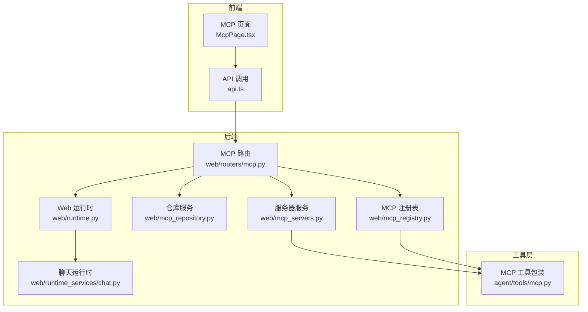
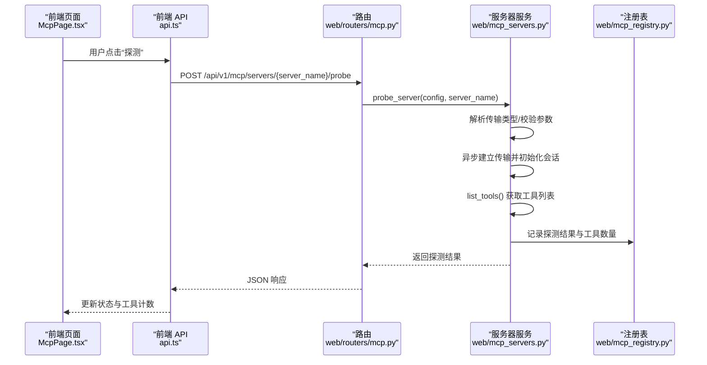
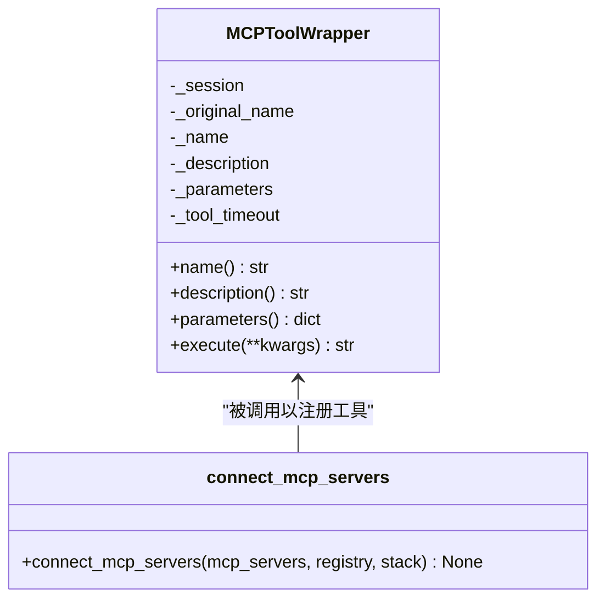
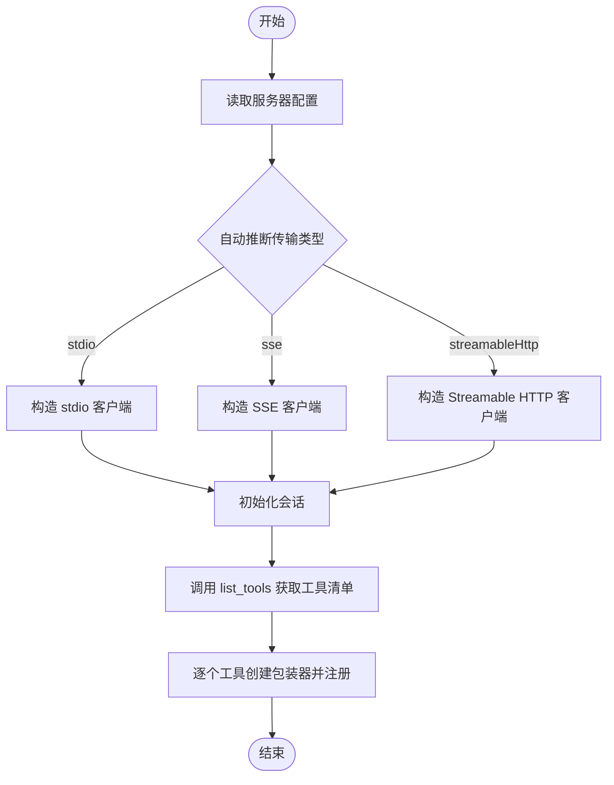
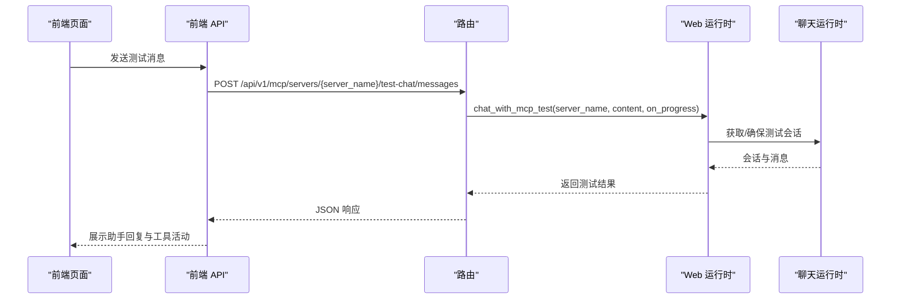
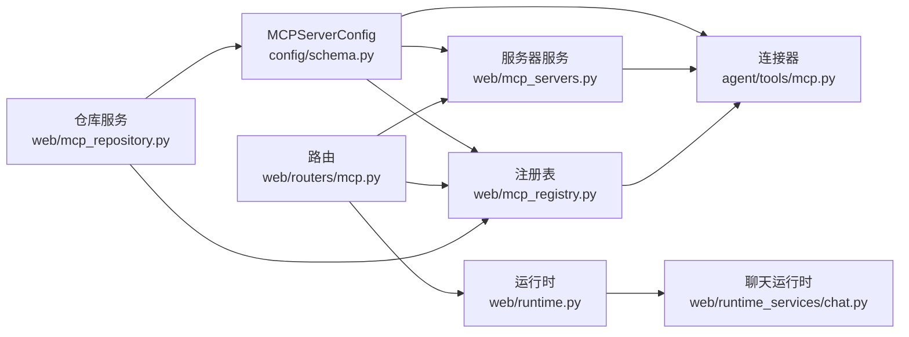

# MCP 协议原理

<cite>
**本文档引用的文件**
- [nanobot/agent/tools/mcp.py](file://nanobot/agent/tools/mcp.py)
- [nanobot/web/routers/mcp.py](file://nanobot/web/routers/mcp.py)
- [nanobot/web/mcp_registry.py](file://nanobot/web/mcp_registry.py)
- [nanobot/web/mcp_repository.py](file://nanobot/web/mcp_repository.py)
- [nanobot/web/mcp_servers.py](file://nanobot/web/mcp_servers.py)
- [nanobot/config/schema.py](file://nanobot/config/schema.py)
- [nanobot/web/runtime.py](file://nanobot/web/runtime.py)
- [nanobot/web/runtime_services/chat.py](file://nanobot/web/runtime_services/chat.py)
- [tests/test_mcp_tool.py](file://tests/test_mcp_tool.py)
- [web-ui/src/pages/McpPage.tsx](file://web-ui/src/pages/McpPage.tsx)
- [web-ui/src/api.ts](file://web-ui/src/api.ts)
</cite>

## 目录
1. [简介](#简介)
2. [项目结构](#项目结构)
3. [核心组件](#核心组件)
4. [架构总览](#架构总览)
5. [详细组件分析](#详细组件分析)
6. [依赖关系分析](#依赖关系分析)
7. [性能考量](#性能考量)
8. [故障排查指南](#故障排查指南)
9. [结论](#结论)
10. [附录](#附录)

## 简介
本文件系统化阐述 nanobot 中的 MCP（Model Context Protocol）协议实现与应用。MCP 是一种用于在 AI 助手中动态发现与调用“工具”的协议，通过标准化的传输层（stdio、SSE、Streamable HTTP）连接外部 MCP 服务器，并将其工具注册为本地可用的工具集，从而显著提升工具系统的灵活性与可扩展性。

本技术文档面向开发者与运维人员，覆盖以下主题：
- MCP 协议核心概念与设计思想
- 客户端-服务器通信模型与工具发现机制
- 三种传输方式（stdio、SSE、Streamable HTTP）的适用场景与实现要点
- 在 nanobot 中的集成点与运行时行为
- 协议规范摘要与实现要点

## 项目结构
围绕 MCP 的实现主要分布在如下模块：
- 工具包装与连接：agent/tools/mcp.py
- Web 路由与管理接口：web/routers/mcp.py
- 注册表与状态持久化：web/mcp_registry.py
- 仓库解析与安装：web/mcp_repository.py
- 服务器操作与探测：web/mcp_servers.py
- 配置模式与类型定义：config/schema.py
- Web 运行时与会话：web/runtime.py、web/runtime_services/chat.py
- 前端页面与 API 调用：web-ui/src/pages/McpPage.tsx、web-ui/src/api.ts
- 测试用例：tests/test_mcp_tool.py

图表来源
- [nanobot/web/routers/mcp.py:1-216](file://nanobot/web/routers/mcp.py#L1-L216)
- [nanobot/web/mcp_registry.py:1-378](file://nanobot/web/mcp_registry.py#L1-L378)
- [nanobot/web/mcp_repository.py:1-589](file://nanobot/web/mcp_repository.py#L1-L589)
- [nanobot/web/mcp_servers.py:1-706](file://nanobot/web/mcp_servers.py#L1-L706)
- [nanobot/web/runtime.py:1-200](file://nanobot/web/runtime.py#L1-L200)
- [nanobot/web/runtime_services/chat.py:1-200](file://nanobot/web/runtime_services/chat.py#L1-L200)
- [nanobot/agent/tools/mcp.py:1-153](file://nanobot/agent/tools/mcp.py#L1-L153)

章节来源
- [nanobot/web/routers/mcp.py:1-216](file://nanobot/web/routers/mcp.py#L1-L216)
- [nanobot/web/mcp_registry.py:1-378](file://nanobot/web/mcp_registry.py#L1-L378)
- [nanobot/web/mcp_repository.py:1-589](file://nanobot/web/mcp_repository.py#L1-L589)
- [nanobot/web/mcp_servers.py:1-706](file://nanobot/web/mcp_servers.py#L1-L706)
- [nanobot/web/runtime.py:1-200](file://nanobot/web/runtime.py#L1-L200)
- [nanobot/web/runtime_services/chat.py:1-200](file://nanobot/web/runtime_services/chat.py#L1-L200)
- [nanobot/agent/tools/mcp.py:1-153](file://nanobot/agent/tools/mcp.py#L1-L153)

## 核心组件
- MCPToolWrapper：将单个 MCP 工具封装为 nanobot 的 Tool，负责参数映射、超时控制、异常处理与内容拼接。
- connect_mcp_servers：遍历配置中的 MCP 服务器，按类型选择传输方式，初始化会话并批量注册工具。
- WebMCPRegistryManager：维护 MCP 注册表元数据（来源、安装信息、工具计数、最后探测状态等），并与配置解耦持久化。
- MCPRepositoryService：分析 GitHub 仓库，推断安装计划（transport、命令、参数、环境变量需求），并生成配置片段。
- MCPServerService：提供服务器探测、修复计划、启用/禁用、更新等操作；内部复用传输层进行工具列表探测。
- FastAPI 路由：提供 MCP 服务器的增删改查、探测、修复计划、仓库安装与测试对话等 API。
- 配置模式：MCPServerConfig 定义了服务器连接参数（type、command/args/env、url/headers、toolTimeout）。
- 运行时与会话：WebAppState 与 WebChatRuntimeService 提供 MCP 测试对话的会话管理与消息格式化。

章节来源
- [nanobot/agent/tools/mcp.py:14-153](file://nanobot/agent/tools/mcp.py#L14-L153)
- [nanobot/web/mcp_registry.py:28-378](file://nanobot/web/mcp_registry.py#L28-L378)
- [nanobot/web/mcp_repository.py:18-589](file://nanobot/web/mcp_repository.py#L18-L589)
- [nanobot/web/mcp_servers.py:23-706](file://nanobot/web/mcp_servers.py#L23-L706)
- [nanobot/web/routers/mcp.py:17-216](file://nanobot/web/routers/mcp.py#L17-L216)
- [nanobot/config/schema.py:329-340](file://nanobot/config/schema.py#L329-L340)
- [nanobot/web/runtime.py:72-200](file://nanobot/web/runtime.py#L72-L200)
- [nanobot/web/runtime_services/chat.py:18-200](file://nanobot/web/runtime_services/chat.py#L18-L200)

## 架构总览
MCP 在 nanobot 中采用“配置驱动 + 运行时按需加载”的架构：
- 配置层：MCPServerConfig 描述每个 MCP 服务器的连接参数与超时策略。
- 注册层：WebMCPRegistryManager 维护 MCP 条目的元数据与状态，支持仓库安装与手动登记。
- 传输层：根据配置自动选择 stdio、SSE 或 Streamable HTTP 三种传输方式。
- 工具层：ClientSession 初始化后调用 list_tools 获取工具清单，MCPToolWrapper 将每个工具包装为本地 Tool 并注册到 ToolRegistry。
- 管理层：FastAPI 路由提供 UI 操作入口，包括探测、修复、仓库安装、测试对话等。
- 运行时层：WebChatRuntimeService 支持 MCP 测试会话，便于调试与验证工具行为。

图表来源
- [nanobot/web/routers/mcp.py:58-67](file://nanobot/web/routers/mcp.py#L58-L67)
- [nanobot/web/mcp_servers.py:139-210](file://nanobot/web/mcp_servers.py#L139-L210)
- [nanobot/web/mcp_registry.py:232-256](file://nanobot/web/mcp_registry.py#L232-L256)

章节来源
- [nanobot/web/routers/mcp.py:45-67](file://nanobot/web/routers/mcp.py#L45-L67)
- [nanobot/web/mcp_servers.py:139-210](file://nanobot/web/mcp_servers.py#L139-L210)
- [nanobot/web/mcp_registry.py:232-256](file://nanobot/web/mcp_registry.py#L232-L256)

## 详细组件分析

### MCP 工具包装与连接
- MCPToolWrapper
  - 将 MCP 服务器返回的工具内容（文本块等）拼接为字符串输出。
  - 统一超时控制与异常处理，兼容取消与超时场景。
- connect_mcp_servers
  - 自动识别传输类型：若未显式指定，则根据 command/url 推断 stdio 或 HTTP（SSE/Streamable HTTP）。
  - 为每种传输构造对应的客户端工厂与会话，初始化后列出工具并逐一包装注册。

图表来源
- [nanobot/agent/tools/mcp.py:14-72](file://nanobot/agent/tools/mcp.py#L14-L72)
- [nanobot/agent/tools/mcp.py:74-153](file://nanobot/agent/tools/mcp.py#L74-L153)

章节来源
- [nanobot/agent/tools/mcp.py:14-153](file://nanobot/agent/tools/mcp.py#L14-L153)
- [tests/test_mcp_tool.py:1-100](file://tests/test_mcp_tool.py#L1-L100)

### 传输方式与适用场景
- stdio
  - 适用于本地可执行程序或 Node/Python 脚本，通过子进程启动 MCP 服务器。
  - 优点：部署简单、可控性强；缺点：需要本地具备相应运行时。
- SSE（Server-Sent Events）
  - 适用于 HTTP 服务端推送事件的场景，URL 以 “/sse” 结尾时自动识别。
  - 优点：实时性强；缺点：需要服务端正确实现 SSE。
- Streamable HTTP
  - 适用于标准 HTTP 接口，适合远程 MCP 服务。
  - 优点：跨网络、易集成；缺点：需关注超时与鉴权。

章节来源
- [nanobot/agent/tools/mcp.py:89-139](file://nanobot/agent/tools/mcp.py#L89-L139)
- [nanobot/web/mcp_registry.py:346-355](file://nanobot/web/mcp_registry.py#L346-L355)
- [nanobot/web/mcp_servers.py:336-345](file://nanobot/web/mcp_servers.py#L336-L345)

### 工具发现与注册流程
- 服务器服务在探测阶段调用 list_tools 获取工具清单，注册表记录工具数量与最后同步时间。
- 工具包装器将每个工具定义转换为本地 Tool 并注册，名称前缀统一为 mcp_{server_name}_。

图表来源
- [nanobot/agent/tools/mcp.py:74-153](file://nanobot/agent/tools/mcp.py#L74-L153)
- [nanobot/web/mcp_servers.py:289-334](file://nanobot/web/mcp_servers.py#L289-L334)

章节来源
- [nanobot/agent/tools/mcp.py:74-153](file://nanobot/agent/tools/mcp.py#L74-L153)
- [nanobot/web/mcp_servers.py:289-334](file://nanobot/web/mcp_servers.py#L289-L334)

### Web 管理与测试对话
- 路由提供服务器的增删改查、探测、修复计划、仓库安装与测试对话接口。
- 前端页面支持仓库预检、安装、探测、修复步骤引导与测试对话。
- 测试对话使用独立会话键（mcp-test:{server_name}），便于隔离调试。

图表来源
- [nanobot/web/routers/mcp.py:119-136](file://nanobot/web/routers/mcp.py#L119-L136)
- [nanobot/web/runtime.py:149-161](file://nanobot/web/runtime.py#L149-L161)
- [nanobot/web/runtime_services/chat.py:182-200](file://nanobot/web/runtime_services/chat.py#L182-L200)
- [web-ui/src/api.ts:184-195](file://web-ui/src/api.ts#L184-L195)

章节来源
- [nanobot/web/routers/mcp.py:119-136](file://nanobot/web/routers/mcp.py#L119-L136)
- [nanobot/web/runtime.py:149-161](file://nanobot/web/runtime.py#L149-L161)
- [nanobot/web/runtime_services/chat.py:182-200](file://nanobot/web/runtime_services/chat.py#L182-L200)
- [web-ui/src/pages/McpPage.tsx:1-380](file://web-ui/src/pages/McpPage.tsx#L1-L380)
- [web-ui/src/api.ts:174-207](file://web-ui/src/api.ts#L174-L207)

## 依赖关系分析
- 配置与类型
  - MCPServerConfig 定义了服务器连接参数与默认超时，贯穿传输层选择与工具超时控制。
- 传输层与会话
  - 三种传输方式分别对应不同的客户端工厂，最终统一通过 ClientSession 初始化并调用 list_tools。
- 注册表与仓库服务
  - 注册表记录工具数量、最后探测状态与错误信息；仓库服务负责从 GitHub 推断安装计划并生成配置片段。
- 路由与运行时
  - 路由将前端请求映射到服务器服务与运行时服务，后者负责会话与消息处理。

图表来源
- [nanobot/config/schema.py:329-340](file://nanobot/config/schema.py#L329-L340)
- [nanobot/web/mcp_registry.py:145-378](file://nanobot/web/mcp_registry.py#L145-L378)
- [nanobot/web/mcp_repository.py:18-589](file://nanobot/web/mcp_repository.py#L18-L589)
- [nanobot/web/mcp_servers.py:23-706](file://nanobot/web/mcp_servers.py#L23-L706)
- [nanobot/agent/tools/mcp.py:74-153](file://nanobot/agent/tools/mcp.py#L74-L153)
- [nanobot/web/routers/mcp.py:1-216](file://nanobot/web/routers/mcp.py#L1-L216)
- [nanobot/web/runtime.py:72-200](file://nanobot/web/runtime.py#L72-L200)
- [nanobot/web/runtime_services/chat.py:18-200](file://nanobot/web/runtime_services/chat.py#L18-L200)

章节来源
- [nanobot/config/schema.py:329-340](file://nanobot/config/schema.py#L329-L340)
- [nanobot/web/mcp_registry.py:145-378](file://nanobot/web/mcp_registry.py#L145-L378)
- [nanobot/web/mcp_repository.py:18-589](file://nanobot/web/mcp_repository.py#L18-L589)
- [nanobot/web/mcp_servers.py:23-706](file://nanobot/web/mcp_servers.py#L23-L706)
- [nanobot/agent/tools/mcp.py:74-153](file://nanobot/agent/tools/mcp.py#L74-L153)
- [nanobot/web/routers/mcp.py:1-216](file://nanobot/web/routers/mcp.py#L1-L216)
- [nanobot/web/runtime.py:72-200](file://nanobot/web/runtime.py#L72-L200)
- [nanobot/web/runtime_services/chat.py:18-200](file://nanobot/web/runtime_services/chat.py#L18-L200)

## 性能考量
- 工具超时控制：每个工具调用具有独立超时（toolTimeout），避免阻塞主流程。
- 传输层超时：HTTP 传输显式设置超时，避免底层库默认超时抢占上层控制。
- 探测与缓存：注册表记录工具数量与最后探测时间，减少重复探测开销。
- 会话隔离：测试对话使用独立会话键，避免干扰常规会话。

章节来源
- [nanobot/agent/tools/mcp.py:17-24](file://nanobot/agent/tools/mcp.py#L17-L24)
- [nanobot/agent/tools/mcp.py:124-136](file://nanobot/agent/tools/mcp.py#L124-L136)
- [nanobot/web/mcp_registry.py:232-256](file://nanobot/web/mcp_registry.py#L232-L256)
- [nanobot/web/runtime_services/chat.py:182-200](file://nanobot/web/runtime_services/chat.py#L182-L200)

## 故障排查指南
- 缺少必要环境变量
  - 现象：探测状态为 blocked，返回缺失的环境变量列表。
  - 处理：在服务器详情中补齐 env/headers，保存后重新探测。
- 传输类型不匹配
  - 现象：未知传输类型或无法识别。
  - 处理：显式设置 type 或补齐 command/url；检查 URL 是否以 /sse 结尾。
- 连接被拒绝/鉴权失败/超时
  - 现象：探测失败并记录错误摘要。
  - 处理：检查服务监听状态、鉴权凭据与网络连通性；必要时提高 toolTimeout。
- 修复流程
  - 使用“修复计划”生成分步指导，支持受限修复模式与危险修复模式（需显式允许）。

章节来源
- [nanobot/web/mcp_servers.py:399-501](file://nanobot/web/mcp_servers.py#L399-L501)
- [nanobot/web/mcp_servers.py:503-626](file://nanobot/web/mcp_servers.py#L503-L626)
- [nanobot/web/mcp_servers.py:665-689](file://nanobot/web/mcp_servers.py#L665-L689)

## 结论
MCP 协议在 nanobot 中实现了“即插即用”的工具生态：通过标准化的传输层与工具发现机制，将外部 MCP 服务器无缝接入本地工具系统。配合完善的注册表、仓库安装与修复流程，用户可以安全地扩展工具能力，同时获得良好的可观测性与可维护性。该方案显著增强了 AI 助手框架的灵活性与可扩展性。

## 附录

### 协议规范摘要与实现要点
- 传输方式
  - stdio：本地可执行程序或脚本，需提供 command 与 args/env。
  - SSE：HTTP 服务端推送，URL 以 /sse 结尾。
  - Streamable HTTP：标准 HTTP 接口，适合远程服务。
- 工具发现
  - 通过 list_tools 获取工具清单，逐个包装为本地 Tool 并注册。
- 超时与异常
  - 工具调用超时与取消均被妥善捕获并返回可读提示。
- 配置要点
  - MCPServerConfig 提供 type、command/args/env、url/headers、toolTimeout 等字段，支持自动推断与显式指定。

章节来源
- [nanobot/agent/tools/mcp.py:74-153](file://nanobot/agent/tools/mcp.py#L74-L153)
- [nanobot/config/schema.py:329-340](file://nanobot/config/schema.py#L329-L340)
- [nanobot/web/mcp_registry.py:346-355](file://nanobot/web/mcp_registry.py#L346-L355)
- [nanobot/web/mcp_servers.py:336-345](file://nanobot/web/mcp_servers.py#L336-L345)