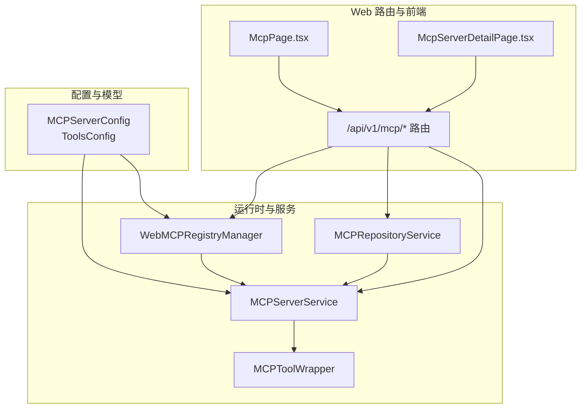
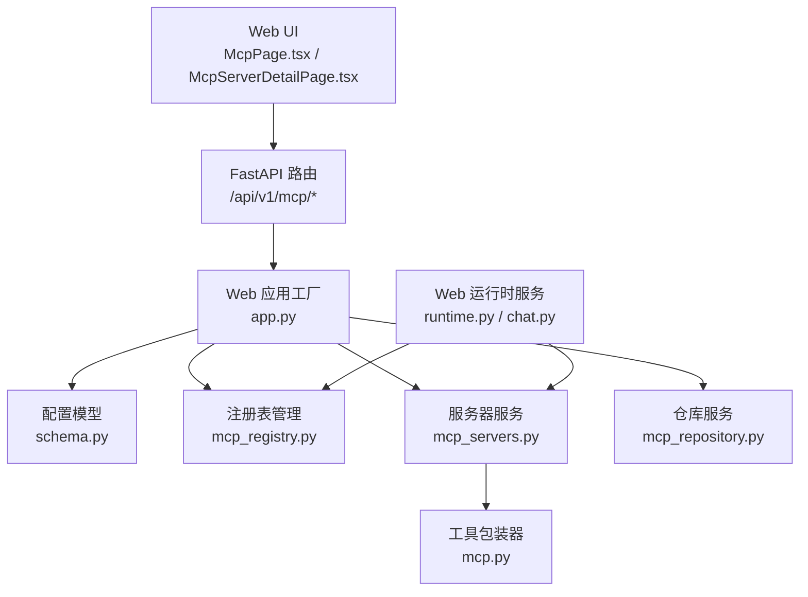
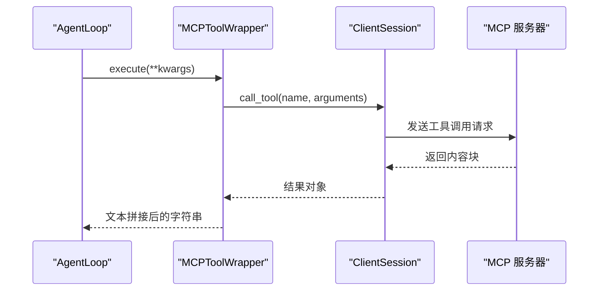
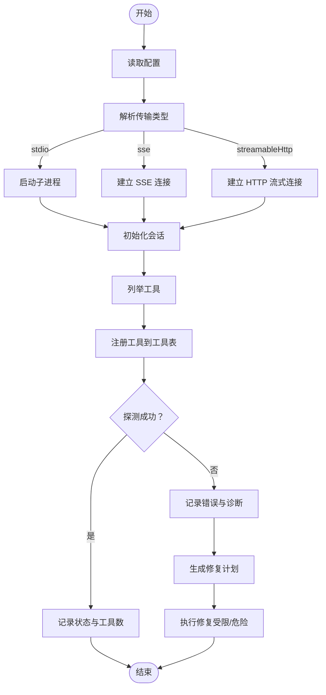
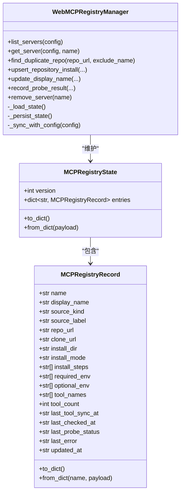
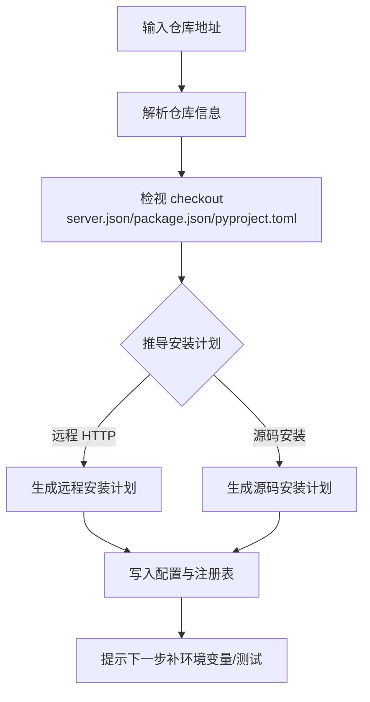
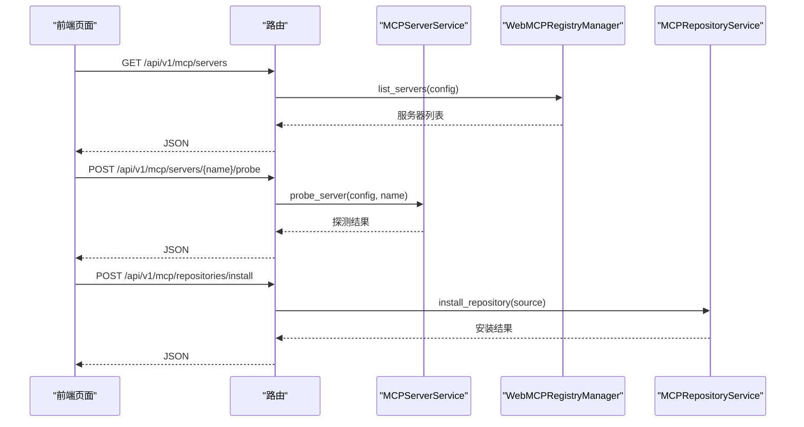
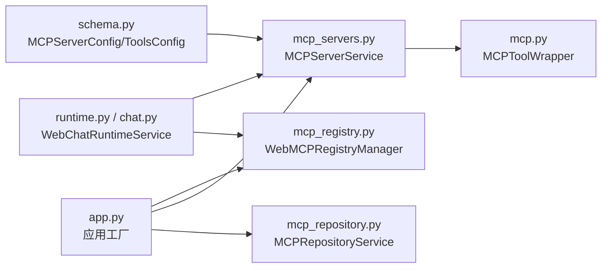

# MCP 协议支持

<cite>
**本文档引用的文件**
- [nanobot/agent/tools/mcp.py](file://nanobot/agent/tools/mcp.py)
- [nanobot/web/mcp_servers.py](file://nanobot/web/mcp_servers.py)
- [nanobot/web/mcp_registry.py](file://nanobot/web/mcp_registry.py)
- [nanobot/web/mcp_repository.py](file://nanobot/web/mcp_repository.py)
- [nanobot/web/routers/mcp.py](file://nanobot/web/routers/mcp.py)
- [nanobot/config/schema.py](file://nanobot/config/schema.py)
- [nanobot/web/app.py](file://nanobot/web/app.py)
- [nanobot/web/runtime.py](file://nanobot/web/runtime.py)
- [nanobot/web/runtime_services/chat.py](file://nanobot/web/runtime_services/chat.py)
- [web-ui/src/pages/McpPage.tsx](file://web-ui/src/pages/McpPage.tsx)
- [web-ui/src/pages/McpServerDetailPage.tsx](file://web-ui/src/pages/McpServerDetailPage.tsx)
- [tests/test_mcp_tool.py](file://tests/test_mcp_tool.py)
</cite>

## 目录
1. [简介](#简介)
2. [项目结构](#项目结构)
3. [核心组件](#核心组件)
4. [架构总览](#架构总览)
5. [详细组件分析](#详细组件分析)
6. [依赖关系分析](#依赖关系分析)
7. [性能考量](#性能考量)
8. [故障排查指南](#故障排查指南)
9. [结论](#结论)
10. [附录](#附录)

## 简介
本文件系统化阐述 Nanobot 的 MCP（Model Context Protocol）支持能力，覆盖协议原理、服务器连接机制、工具同步流程、配置与注册管理、开发与集成指南、与现有工具系统的兼容性、实现示例与调试方法，以及在不同渠道中的应用场景与最佳实践。目标读者包括平台管理员、前端开发者、后端工程师与工具集成者。

## 项目结构
围绕 MCP 的实现由三层组成：
- 配置与模型层：定义 MCP 服务器配置结构与默认行为
- 运行时与服务层：负责连接、探测、修复、仓库安装与注册元数据持久化
- Web 路由与前端：提供 UI 管理入口、测试对话与交互

图表来源
- [nanobot/config/schema.py:329-349](file://nanobot/config/schema.py#L329-L349)
- [nanobot/web/mcp_registry.py:145-378](file://nanobot/web/mcp_registry.py#L145-L378)
- [nanobot/web/mcp_servers.py:23-706](file://nanobot/web/mcp_servers.py#L23-L706)
- [nanobot/web/mcp_repository.py:18-589](file://nanobot/web/mcp_repository.py#L18-L589)
- [nanobot/agent/tools/mcp.py:14-153](file://nanobot/agent/tools/mcp.py#L14-L153)
- [nanobot/web/routers/mcp.py:1-216](file://nanobot/web/routers/mcp.py#L1-L216)
- [web-ui/src/pages/McpPage.tsx:1-200](file://web-ui/src/pages/McpPage.tsx#L1-L200)
- [web-ui/src/pages/McpServerDetailPage.tsx:1-200](file://web-ui/src/pages/McpServerDetailPage.tsx#L1-L200)

章节来源
- [nanobot/config/schema.py:329-349](file://nanobot/config/schema.py#L329-L349)
- [nanobot/web/mcp_registry.py:145-378](file://nanobot/web/mcp_registry.py#L145-L378)
- [nanobot/web/mcp_servers.py:23-706](file://nanobot/web/mcp_servers.py#L23-L706)
- [nanobot/web/mcp_repository.py:18-589](file://nanobot/web/mcp_repository.py#L18-L589)
- [nanobot/agent/tools/mcp.py:14-153](file://nanobot/agent/tools/mcp.py#L14-L153)
- [nanobot/web/routers/mcp.py:1-216](file://nanobot/web/routers/mcp.py#L1-L216)
- [web-ui/src/pages/McpPage.tsx:1-200](file://web-ui/src/pages/McpPage.tsx#L1-L200)
- [web-ui/src/pages/McpServerDetailPage.tsx:1-200](file://web-ui/src/pages/McpServerDetailPage.tsx#L1-L200)

## 核心组件
- MCP 工具包装器：将 MCP 服务器暴露的工具封装为 Nanobot 原生工具，统一参数与执行接口
- MCP 服务器服务：负责连接、探测、修复、更新与删除服务器配置
- MCP 注册表管理：独立于原始配置的元数据持久化，记录状态、工具清单与诊断信息
- MCP 仓库服务：解析 GitHub 仓库，生成安装计划，支持源码安装与远程 HTTP 服务器
- Web 路由与前端：提供服务器列表、探测、修复、测试对话、编辑与删除等操作

章节来源
- [nanobot/agent/tools/mcp.py:14-153](file://nanobot/agent/tools/mcp.py#L14-L153)
- [nanobot/web/mcp_servers.py:23-706](file://nanobot/web/mcp_servers.py#L23-L706)
- [nanobot/web/mcp_registry.py:145-378](file://nanobot/web/mcp_registry.py#L145-L378)
- [nanobot/web/mcp_repository.py:18-589](file://nanobot/web/mcp_repository.py#L18-L589)
- [nanobot/web/routers/mcp.py:1-216](file://nanobot/web/routers/mcp.py#L1-L216)

## 架构总览
下图展示了 MCP 在系统中的位置与交互关系：前端通过路由调用后端服务，后端根据配置连接 MCP 服务器，注册工具并提供测试对话能力。

图表来源
- [nanobot/web/app.py:70-200](file://nanobot/web/app.py#L70-L200)
- [nanobot/web/routers/mcp.py:1-216](file://nanobot/web/routers/mcp.py#L1-L216)
- [nanobot/config/schema.py:329-349](file://nanobot/config/schema.py#L329-L349)
- [nanobot/web/mcp_registry.py:145-378](file://nanobot/web/mcp_registry.py#L145-L378)
- [nanobot/web/mcp_servers.py:23-706](file://nanobot/web/mcp_servers.py#L23-L706)
- [nanobot/web/mcp_repository.py:18-589](file://nanobot/web/mcp_repository.py#L18-L589)
- [nanobot/agent/tools/mcp.py:14-153](file://nanobot/agent/tools/mcp.py#L14-L153)
- [nanobot/web/runtime.py:72-200](file://nanobot/web/runtime.py#L72-L200)
- [nanobot/web/runtime_services/chat.py:18-200](file://nanobot/web/runtime_services/chat.py#L18-L200)
- [web-ui/src/pages/McpPage.tsx:1-200](file://web-ui/src/pages/McpPage.tsx#L1-L200)
- [web-ui/src/pages/McpServerDetailPage.tsx:1-200](file://web-ui/src/pages/McpServerDetailPage.tsx#L1-L200)

## 详细组件分析

### MCP 工具包装器与连接流程
- 工具包装器将单个 MCP 工具适配为 Nanobot 工具，统一名称、描述与参数模式
- 连接流程支持三种传输：
  - stdio：通过子进程启动命令
  - SSE：基于 HTTP SSE 的流式传输
  - Streamable HTTP：基于 HTTP 的流式传输
- 初始化后枚举工具并注册到工具注册表

图表来源
- [nanobot/agent/tools/mcp.py:37-71](file://nanobot/agent/tools/mcp.py#L37-L71)
- [nanobot/agent/tools/mcp.py:74-153](file://nanobot/agent/tools/mcp.py#L74-L153)

章节来源
- [nanobot/agent/tools/mcp.py:14-153](file://nanobot/agent/tools/mcp.py#L14-L153)

### MCP 服务器服务：配置、探测与修复
- 支持更新服务器配置（类型、命令/URL、环境变量、请求头、超时）
- 提供探测接口：连接服务器、列举工具、记录状态与错误
- 提供修复计划与修复执行：基于诊断生成步骤，支持受限与危险模式
- 删除服务器：清理配置并可选删除安装目录

图表来源
- [nanobot/web/mcp_servers.py:289-334](file://nanobot/web/mcp_servers.py#L289-L334)
- [nanobot/web/mcp_servers.py:336-345](file://nanobot/web/mcp_servers.py#L336-L345)
- [nanobot/web/mcp_servers.py:399-501](file://nanobot/web/mcp_servers.py#L399-L501)
- [nanobot/web/mcp_servers.py:234-287](file://nanobot/web/mcp_servers.py#L234-L287)

章节来源
- [nanobot/web/mcp_servers.py:23-706](file://nanobot/web/mcp_servers.py#L23-L706)

### MCP 注册表管理：元数据持久化与状态同步
- 维护独立于配置的注册表状态，记录来源、安装信息、工具清单、最后探测时间与错误
- 与配置同步：新增配置项时自动写入默认记录
- 提供查询与更新接口，用于 UI 展示与操作

图表来源
- [nanobot/web/mcp_registry.py:28-143](file://nanobot/web/mcp_registry.py#L28-L143)
- [nanobot/web/mcp_registry.py:145-378](file://nanobot/web/mcp_registry.py#L145-L378)

章节来源
- [nanobot/web/mcp_registry.py:145-378](file://nanobot/web/mcp_registry.py#L145-L378)

### MCP 仓库服务：仓库解析与安装
- 解析 GitHub 仓库，支持 server.json、package.json、pyproject.toml 等多种入口
- 生成安装计划：远程 HTTP 服务器或源码安装（Node/Python），并记录安装步骤
- 检查缺失运行时与环境变量，提供下一步建议

图表来源
- [nanobot/web/mcp_repository.py:105-165](file://nanobot/web/mcp_repository.py#L105-L165)
- [nanobot/web/mcp_repository.py:233-279](file://nanobot/web/mcp_repository.py#L233-L279)
- [nanobot/web/mcp_repository.py:282-440](file://nanobot/web/mcp_repository.py#L282-L440)

章节来源
- [nanobot/web/mcp_repository.py:18-589](file://nanobot/web/mcp_repository.py#L18-L589)

### Web 路由与前端：管理与测试
- 路由提供服务器列表、详情、探测、修复、测试对话、启用/禁用、更新与删除
- 前端页面提供仓库预检、安装、服务器配置、探测与修复计划查看、测试对话

图表来源
- [nanobot/web/routers/mcp.py:45-216](file://nanobot/web/routers/mcp.py#L45-L216)
- [nanobot/web/mcp_servers.py:139-210](file://nanobot/web/mcp_servers.py#L139-L210)
- [nanobot/web/mcp_registry.py:154-180](file://nanobot/web/mcp_registry.py#L154-L180)
- [nanobot/web/mcp_repository.py:35-103](file://nanobot/web/mcp_repository.py#L35-L103)
- [web-ui/src/pages/McpPage.tsx:1-200](file://web-ui/src/pages/McpPage.tsx#L1-L200)
- [web-ui/src/pages/McpServerDetailPage.tsx:1-200](file://web-ui/src/pages/McpServerDetailPage.tsx#L1-L200)

章节来源
- [nanobot/web/routers/mcp.py:1-216](file://nanobot/web/routers/mcp.py#L1-L216)
- [web-ui/src/pages/McpPage.tsx:1-200](file://web-ui/src/pages/McpPage.tsx#L1-L200)
- [web-ui/src/pages/McpServerDetailPage.tsx:1-200](file://web-ui/src/pages/McpServerDetailPage.tsx#L1-L200)

## 依赖关系分析
- 配置模型 MCPServerConfig 与 ToolsConfig 定义 MCP 服务器的连接参数与工具集合
- Web 应用工厂在生命周期中注入注册表、仓库与服务器服务实例
- 运行时服务提供测试对话会话键与工具包装器的运行时集成点

图表来源
- [nanobot/config/schema.py:329-349](file://nanobot/config/schema.py#L329-L349)
- [nanobot/web/app.py:70-200](file://nanobot/web/app.py#L70-L200)
- [nanobot/web/mcp_registry.py:145-378](file://nanobot/web/mcp_registry.py#L145-L378)
- [nanobot/web/mcp_servers.py:23-706](file://nanobot/web/mcp_servers.py#L23-L706)
- [nanobot/web/mcp_repository.py:18-589](file://nanobot/web/mcp_repository.py#L18-L589)
- [nanobot/agent/tools/mcp.py:14-153](file://nanobot/agent/tools/mcp.py#L14-L153)
- [nanobot/web/runtime.py:72-200](file://nanobot/web/runtime.py#L72-L200)
- [nanobot/web/runtime_services/chat.py:18-200](file://nanobot/web/runtime_services/chat.py#L18-L200)

章节来源
- [nanobot/config/schema.py:329-349](file://nanobot/config/schema.py#L329-L349)
- [nanobot/web/app.py:70-200](file://nanobot/web/app.py#L70-L200)
- [nanobot/web/runtime.py:72-200](file://nanobot/web/runtime.py#L72-L200)
- [nanobot/web/runtime_services/chat.py:18-200](file://nanobot/web/runtime_services/chat.py#L18-L200)

## 性能考量
- 工具调用超时：每个工具调用具有独立超时控制，避免阻塞主循环
- HTTP 传输：显式提供 httpx 客户端，避免默认短超时抢占更高层超时
- 并发与资源：使用异步上下文栈管理连接生命周期，减少泄漏风险
- 前端渲染：列表与修复计划采用懒加载与分页策略，降低首屏压力

## 故障排查指南
- 探测失败：检查传输类型、URL/命令、鉴权头与环境变量；查看最后错误与诊断标签
- 本地运行时缺失：根据仓库分析结果补齐 git/node/python 等运行时
- 连接被拒绝：确认远端服务已启动、网络可达与端口正确
- 鉴权失败：核对 env、headers 与令牌有效性
- 超时问题：适当提高 toolTimeout 或优化远端服务性能
- 修复执行：受限模式不执行危险操作，危险模式需显式启用

章节来源
- [nanobot/web/mcp_servers.py:400-626](file://nanobot/web/mcp_servers.py#L400-L626)
- [nanobot/web/mcp_servers.py:665-689](file://nanobot/web/mcp_servers.py#L665-L689)

## 结论
Nanobot 的 MCP 支持以配置驱动、服务编排与前端交互为核心，实现了从仓库安装、服务器配置、探测诊断到工具注册与测试对话的完整闭环。通过独立的注册表元数据与严格的错误诊断，系统在易用性与可观测性之间取得平衡，适合在多渠道场景中扩展第三方工具能力。

## 附录

### MCP 协议原理与传输机制
- 传输类型
  - stdio：通过子进程启动命令，适用于本地可执行工具
  - SSE：基于 HTTP SSE 的长连接，适用于事件推送
  - Streamable HTTP：基于 HTTP 的流式传输，适用于 REST 风格工具
- 工具同步：初始化会话后列举工具，逐个包装并注册到工具表

章节来源
- [nanobot/agent/tools/mcp.py:74-153](file://nanobot/agent/tools/mcp.py#L74-L153)

### MCP 服务器配置与管理
- 配置字段：enabled、type、command/args/env、url/headers、toolTimeout
- 管理操作：启用/禁用、更新、探测、修复、删除
- 仓库安装：GitHub 仓库解析与安装计划生成

章节来源
- [nanobot/config/schema.py:329-349](file://nanobot/config/schema.py#L329-L349)
- [nanobot/web/mcp_servers.py:56-137](file://nanobot/web/mcp_servers.py#L56-L137)
- [nanobot/web/mcp_repository.py:105-165](file://nanobot/web/mcp_repository.py#L105-L165)

### MCP 工具开发与集成
- 开发要点：遵循 MCP 工具规范，提供输入模式与输出内容块
- 集成步骤：在 Web UI 中登记服务器，进行探测与修复，启用后即可在聊天中使用
- 环境变量：通过 env 字段注入，注意大小写与命名规范

章节来源
- [nanobot/agent/tools/mcp.py:14-153](file://nanobot/agent/tools/mcp.py#L14-L153)
- [web-ui/src/pages/McpServerDetailPage.tsx:144-176](file://web-ui/src/pages/McpServerDetailPage.tsx#L144-L176)

### 与现有工具系统的集成与兼容性
- 工具包装器统一了 MCP 工具与原生工具的调用接口
- 通过工具注册表集中管理，不影响现有工具链路
- 测试对话会话隔离，便于调试与验证

章节来源
- [nanobot/agent/tools/mcp.py:14-153](file://nanobot/agent/tools/mcp.py#L14-L153)
- [nanobot/web/runtime_services/chat.py:182-200](file://nanobot/web/runtime_services/chat.py#L182-L200)

### 实现示例与调试方法
- 示例：在测试用例中模拟 MCP SDK 的 types.TextContent，验证文本块拼接与异常处理
- 调试：利用前端测试对话页面发送消息，观察工具调用与输出；通过路由查看探测与修复结果

章节来源
- [tests/test_mcp_tool.py:1-100](file://tests/test_mcp_tool.py#L1-L100)
- [web-ui/src/pages/McpServerDetailPage.tsx:199-216](file://web-ui/src/pages/McpServerDetailPage.tsx#L199-L216)

### 不同渠道中的应用场景与最佳实践
- 渠道集成：MCP 工具可在聊天通道中作为原生工具使用，提升自动化能力
- 最佳实践：优先使用仓库安装与远程 HTTP 服务器，确保可维护性；合理设置超时与重试；定期探测与修复

章节来源
- [nanobot/web/mcp_repository.py:18-589](file://nanobot/web/mcp_repository.py#L18-L589)
- [nanobot/web/mcp_servers.py:23-706](file://nanobot/web/mcp_servers.py#L23-L706)