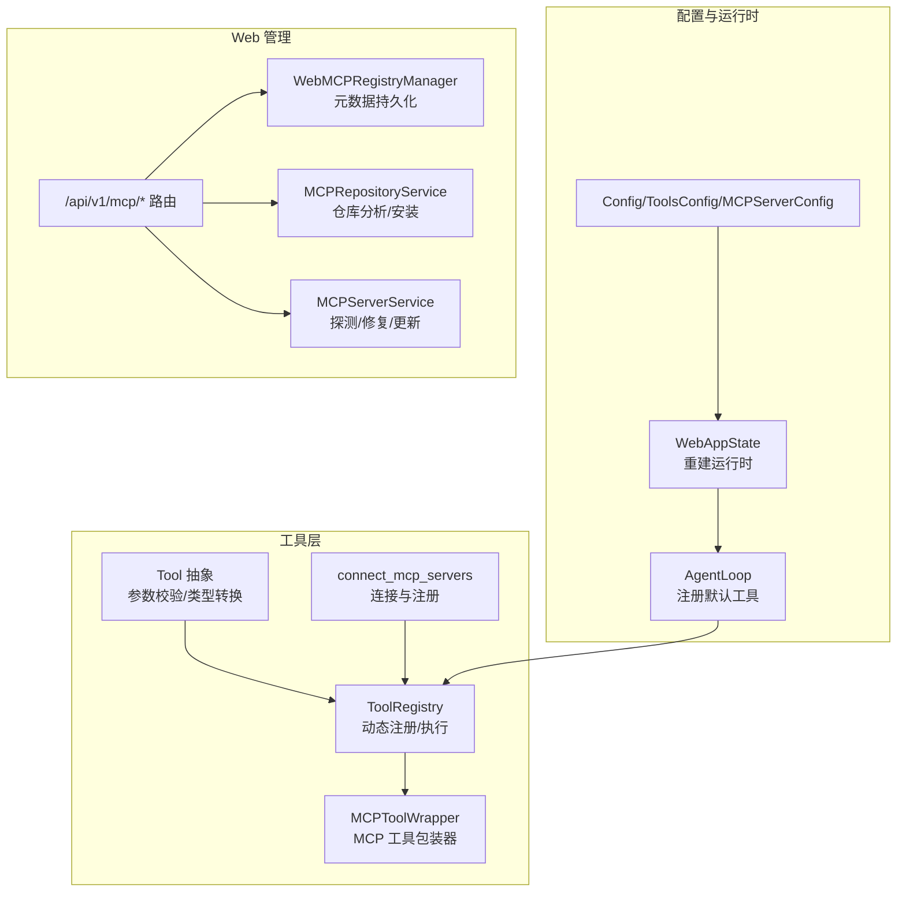
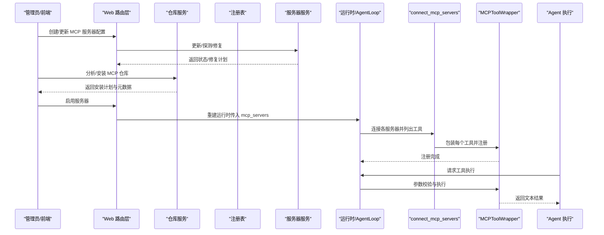
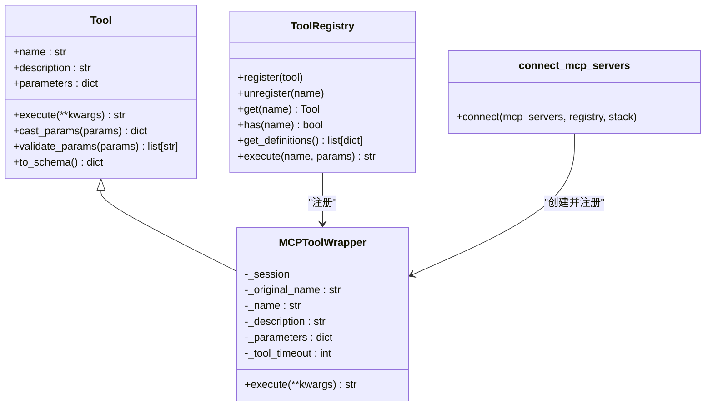
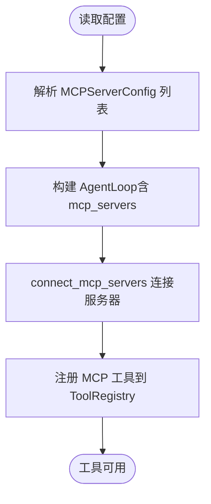
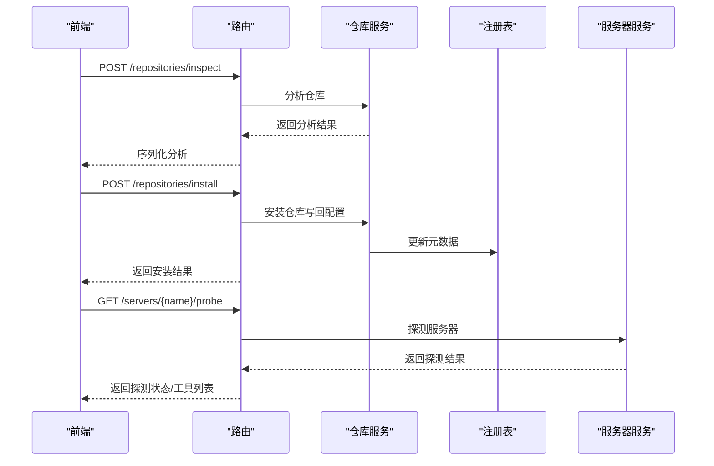
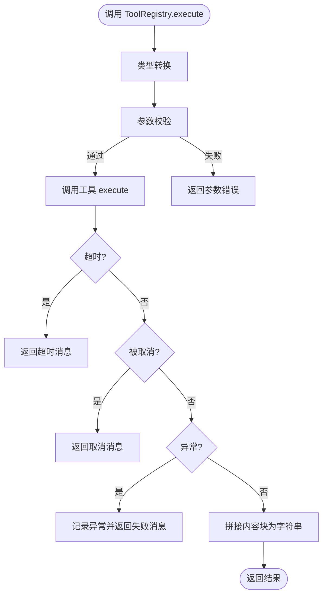
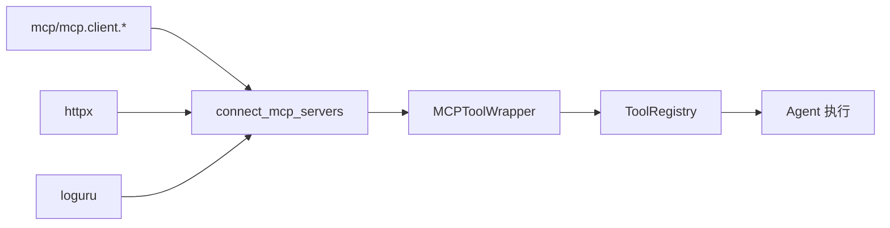

# MCP 工具集成

<cite>
**本文引用的文件**
- [nanobot/agent/tools/mcp.py](file://nanobot/agent/tools/mcp.py)
- [nanobot/agent/tools/base.py](file://nanobot/agent/tools/base.py)
- [nanobot/agent/tools/registry.py](file://nanobot/agent/tools/registry.py)
- [nanobot/config/schema.py](file://nanobot/config/schema.py)
- [nanobot/web/routers/mcp.py](file://nanobot/web/routers/mcp.py)
- [nanobot/web/mcp_registry.py](file://nanobot/web/mcp_registry.py)
- [nanobot/web/mcp_repository.py](file://nanobot/web/mcp_repository.py)
- [nanobot/web/mcp_servers.py](file://nanobot/web/mcp_servers.py)
- [nanobot/web/runtime.py](file://nanobot/web/runtime.py)
- [nanobot/web/runtime_services/agents.py](file://nanobot/web/runtime_services/agents.py)
- [nanobot/web/runtime_services/config.py](file://nanobot/web/runtime_services/config.py)
- [tests/test_mcp_tool.py](file://tests/test_mcp_tool.py)
- [tests/test_web_api.py](file://tests/test_web_api.py)
</cite>

## 目录
1. [简介](#简介)
2. [项目结构](#项目结构)
3. [核心组件](#核心组件)
4. [架构总览](#架构总览)
5. [详细组件分析](#详细组件分析)
6. [依赖分析](#依赖分析)
7. [性能考量](#性能考量)
8. [故障排查指南](#故障排查指南)
9. [结论](#结论)
10. [附录](#附录)

## 简介
本文件面向 MCP（Model Context Protocol）工具在 Nanobot 工具系统中的集成与使用，覆盖从服务器连接、工具发现与注册、到工具执行与生命周期管理的全流程。文档同时给出参数传递、结果处理、错误管理机制说明，并提供开发指南、兼容性与互操作性说明、集成示例与最佳实践，帮助开发者快速、安全地将第三方 MCP 服务器工具接入 Nanobot。

## 项目结构
围绕 MCP 工具集成的关键模块分布如下：
- 工具层
  - 工具抽象与注册中心：[nanobot/agent/tools/base.py](file://nanobot/agent/tools/base.py)、[nanobot/agent/tools/registry.py](file://nanobot/agent/tools/registry.py)
  - MCP 工具包装器与连接器：[nanobot/agent/tools/mcp.py](file://nanobot/agent/tools/mcp.py)
- 配置与运行时
  - 配置模式（含 MCP 服务器配置项）：[nanobot/config/schema.py](file://nanobot/config/schema.py)
  - Web 运行时与 Agent 循环：[nanobot/web/runtime.py](file://nanobot/web/runtime.py)、[nanobot/web/runtime_services/config.py](file://nanobot/web/runtime_services/config.py)、[nanobot/web/runtime_services/agents.py](file://nanobot/web/runtime_services/agents.py)
- Web 管理与仓库安装
  - 路由与 API：[nanobot/web/routers/mcp.py](file://nanobot/web/routers/mcp.py)
  - 注册表与元数据：[nanobot/web/mcp_registry.py](file://nanobot/web/mcp_registry.py)
  - 仓库分析与安装：[nanobot/web/mcp_repository.py](file://nanobot/web/mcp_repository.py)
  - 服务器运维（探测、修复、更新等）：[nanobot/web/mcp_servers.py](file://nanobot/web/mcp_servers.py)

图表来源
- [nanobot/agent/tools/base.py:7-182](file://nanobot/agent/tools/base.py#L7-L182)
- [nanobot/agent/tools/registry.py:8-71](file://nanobot/agent/tools/registry.py#L8-L71)
- [nanobot/agent/tools/mcp.py:14-153](file://nanobot/agent/tools/mcp.py#L14-L153)
- [nanobot/config/schema.py:329-349](file://nanobot/config/schema.py#L329-L349)
- [nanobot/web/runtime.py:72-301](file://nanobot/web/runtime.py#L72-L301)
- [nanobot/web/runtime_services/config.py:79-108](file://nanobot/web/runtime_services/config.py#L79-L108)
- [nanobot/web/routers/mcp.py:1-216](file://nanobot/web/routers/mcp.py#L1-L216)
- [nanobot/web/mcp_registry.py:145-378](file://nanobot/web/mcp_registry.py#L145-L378)
- [nanobot/web/mcp_repository.py:18-589](file://nanobot/web/mcp_repository.py#L18-L589)
- [nanobot/web/mcp_servers.py:23-706](file://nanobot/web/mcp_servers.py#L23-L706)

章节来源
- [nanobot/agent/tools/mcp.py:14-153](file://nanobot/agent/tools/mcp.py#L14-L153)
- [nanobot/agent/tools/base.py:7-182](file://nanobot/agent/tools/base.py#L7-L182)
- [nanobot/agent/tools/registry.py:8-71](file://nanobot/agent/tools/registry.py#L8-L71)
- [nanobot/config/schema.py:329-349](file://nanobot/config/schema.py#L329-L349)
- [nanobot/web/routers/mcp.py:1-216](file://nanobot/web/routers/mcp.py#L1-L216)
- [nanobot/web/mcp_registry.py:145-378](file://nanobot/web/mcp_registry.py#L145-L378)
- [nanobot/web/mcp_repository.py:18-589](file://nanobot/web/mcp_repository.py#L18-L589)
- [nanobot/web/mcp_servers.py:23-706](file://nanobot/web/mcp_servers.py#L23-L706)
- [nanobot/web/runtime.py:72-301](file://nanobot/web/runtime.py#L72-L301)
- [nanobot/web/runtime_services/agents.py:82-111](file://nanobot/web/runtime_services/agents.py#L82-L111)
- [nanobot/web/runtime_services/config.py:79-108](file://nanobot/web/runtime_services/config.py#L79-L108)

## 核心组件
- 工具抽象与注册
  - Tool 抽象定义工具名称、描述、参数模式与异步执行接口；提供参数类型转换与 JSON Schema 校验能力。
  - ToolRegistry 提供动态注册、查找、执行与 OpenAI 函数模式导出。
- MCP 工具包装器
  - MCPToolWrapper 将单个 MCP 工具封装为原生 Nanobot 工具，负责参数透传、超时控制、异常捕获与内容拼接。
  - connect_mcp_servers 负责根据配置连接 MCP 服务器（stdio、sse、streamableHttp），枚举工具并批量注册。
- 配置与运行时
  - MCPServerConfig 定义 MCP 服务器连接参数（类型、命令、参数、环境、URL、头、工具超时）。
  - WebAppState 在重建运行时过程中将 mcp_servers 传入 AgentLoop，从而驱动工具注册。
- Web 管理
  - 路由提供服务器增删改查、探测、修复计划生成、仓库分析与安装等接口。
  - WebMCPRegistryManager 维护 MCP 注册表元数据（来源、安装信息、工具计数、最后探测状态等）。
  - MCPRepositoryService 分析仓库结构，推导安装计划与运行命令，支持源码安装与远程 HTTP 两类部署。
  - MCPServerService 实现服务器探测、修复诊断、修复执行与配置更新。

章节来源
- [nanobot/agent/tools/base.py:7-182](file://nanobot/agent/tools/base.py#L7-L182)
- [nanobot/agent/tools/registry.py:8-71](file://nanobot/agent/tools/registry.py#L8-L71)
- [nanobot/agent/tools/mcp.py:14-153](file://nanobot/agent/tools/mcp.py#L14-L153)
- [nanobot/config/schema.py:329-349](file://nanobot/config/schema.py#L329-L349)
- [nanobot/web/runtime.py:72-301](file://nanobot/web/runtime.py#L72-L301)
- [nanobot/web/runtime_services/config.py:79-108](file://nanobot/web/runtime_services/config.py#L79-L108)
- [nanobot/web/routers/mcp.py:1-216](file://nanobot/web/routers/mcp.py#L1-L216)
- [nanobot/web/mcp_registry.py:145-378](file://nanobot/web/mcp_registry.py#L145-L378)
- [nanobot/web/mcp_repository.py:18-589](file://nanobot/web/mcp_repository.py#L18-L589)
- [nanobot/web/mcp_servers.py:23-706](file://nanobot/web/mcp_servers.py#L23-L706)

## 架构总览
下图展示了 MCP 工具从配置到运行时注册、再到工具执行的全链路：

图表来源
- [nanobot/web/routers/mcp.py:45-184](file://nanobot/web/routers/mcp.py#L45-L184)
- [nanobot/web/mcp_repository.py:27-103](file://nanobot/web/mcp_repository.py#L27-L103)
- [nanobot/web/mcp_servers.py:37-210](file://nanobot/web/mcp_servers.py#L37-L210)
- [nanobot/web/runtime.py:112-112](file://nanobot/web/runtime.py#L112-L112)
- [nanobot/web/runtime_services/config.py:79-108](file://nanobot/web/runtime_services/config.py#L79-L108)
- [nanobot/agent/tools/mcp.py:74-152](file://nanobot/agent/tools/mcp.py#L74-L152)
- [nanobot/agent/tools/registry.py:38-59](file://nanobot/agent/tools/registry.py#L38-L59)

## 详细组件分析

### MCP 工具包装器与连接器
- MCPToolWrapper
  - 名称与描述：基于原始工具名与服务器名生成唯一工具名，描述取自工具定义。
  - 参数模式：使用工具输入模式（默认空对象），配合 ToolRegistry 的参数校验与类型转换。
  - 执行流程：通过会话调用工具，限制超时，捕获取消与异常，拼接文本内容块，返回字符串结果。
- connect_mcp_servers
  - 传输类型解析：根据配置自动推断 stdio、sse 或 streamableHttp；为空则依据 command/url 推断。
  - 会话建立：使用对应客户端工厂创建读写通道，构造 ClientSession 并初始化。
  - 工具注册：枚举工具列表，逐个包装并注册到 ToolRegistry。

图表来源
- [nanobot/agent/tools/base.py:7-182](file://nanobot/agent/tools/base.py#L7-L182)
- [nanobot/agent/tools/registry.py:8-71](file://nanobot/agent/tools/registry.py#L8-L71)
- [nanobot/agent/tools/mcp.py:14-71](file://nanobot/agent/tools/mcp.py#L14-L71)

章节来源
- [nanobot/agent/tools/mcp.py:14-153](file://nanobot/agent/tools/mcp.py#L14-L153)
- [nanobot/agent/tools/base.py:7-182](file://nanobot/agent/tools/base.py#L7-L182)
- [nanobot/agent/tools/registry.py:8-71](file://nanobot/agent/tools/registry.py#L8-L71)

### 配置与运行时集成
- 配置模式
  - MCPServerConfig 支持三种传输：stdio（command/args/env）、sse（url/headers）、streamableHttp（url/headers），并包含工具超时字段。
  - ToolsConfig.mcp_servers 为服务器字典，键为服务器名，值为 MCPServerConfig。
- 运行时集成
  - WebAppState 在重建运行时（rebuild_runtime）时将 mcp_servers 传入 AgentLoop。
  - AgentLoop 在初始化阶段注册默认工具集，MCP 工具在连接阶段动态加入注册表，最终参与工具清单导出与执行。

图表来源
- [nanobot/config/schema.py:329-349](file://nanobot/config/schema.py#L329-L349)
- [nanobot/web/runtime_services/config.py:79-108](file://nanobot/web/runtime_services/config.py#L79-L108)
- [nanobot/web/runtime.py:112-112](file://nanobot/web/runtime.py#L112-L112)
- [nanobot/agent/tools/mcp.py:74-152](file://nanobot/agent/tools/mcp.py#L74-L152)

章节来源
- [nanobot/config/schema.py:329-349](file://nanobot/config/schema.py#L329-L349)
- [nanobot/web/runtime_services/config.py:79-108](file://nanobot/web/runtime_services/config.py#L79-L108)
- [nanobot/web/runtime.py:112-112](file://nanobot/web/runtime.py#L112-L112)

### Web 管理与仓库安装
- 路由层
  - 提供服务器列表、查询、探测、修复计划、修复执行、测试对话、启用切换、更新与删除等接口。
- 注册表
  - 维护 MCP 服务器的显示名、来源（配置/手动/仓库）、仓库信息、安装目录、工具数量、最后探测状态与错误等元数据。
- 仓库服务
  - 支持 GitHub 仓库分析，自动推导 Node/Python 仓库入口、安装步骤与运行命令，生成安装计划并写回配置。
- 服务器服务
  - 实现服务器探测（连接并 list_tools）、修复诊断（根据错误与配置生成修复步骤）、修复执行（外部 worker 进程）与配置更新。

图表来源
- [nanobot/web/routers/mcp.py:187-215](file://nanobot/web/routers/mcp.py#L187-L215)
- [nanobot/web/mcp_repository.py:27-103](file://nanobot/web/mcp_repository.py#L27-L103)
- [nanobot/web/mcp_registry.py:145-378](file://nanobot/web/mcp_registry.py#L145-L378)
- [nanobot/web/mcp_servers.py:139-210](file://nanobot/web/mcp_servers.py#L139-L210)

章节来源
- [nanobot/web/routers/mcp.py:1-216](file://nanobot/web/routers/mcp.py#L1-L216)
- [nanobot/web/mcp_registry.py:145-378](file://nanobot/web/mcp_registry.py#L145-L378)
- [nanobot/web/mcp_repository.py:18-589](file://nanobot/web/mcp_repository.py#L18-L589)
- [nanobot/web/mcp_servers.py:23-706](file://nanobot/web/mcp_servers.py#L23-L706)

### 工具执行流程与错误处理
- 参数传递
  - ToolRegistry.execute 先进行类型转换与参数校验，再调用工具 execute。
  - MCPToolWrapper.execute 将 kwargs 原样传递给 MCP 会话的 call_tool。
- 结果处理
  - 将 MCP 返回的内容块（主要是文本块）拼接为字符串；若无输出返回占位提示。
- 错误管理
  - 超时：返回超时消息，不抛异常。
  - 取消：SDK 取消泄漏时仅在外部取消时重新抛出；否则记录警告并返回取消消息。
  - 异常：记录异常日志并返回失败消息。

图表来源
- [nanobot/agent/tools/registry.py:38-59](file://nanobot/agent/tools/registry.py#L38-L59)
- [nanobot/agent/tools/mcp.py:37-71](file://nanobot/agent/tools/mcp.py#L37-L71)
- [tests/test_mcp_tool.py:33-99](file://tests/test_mcp_tool.py#L33-L99)

章节来源
- [nanobot/agent/tools/registry.py:38-59](file://nanobot/agent/tools/registry.py#L38-L59)
- [nanobot/agent/tools/mcp.py:37-71](file://nanobot/agent/tools/mcp.py#L37-L71)
- [tests/test_mcp_tool.py:33-99](file://tests/test_mcp_tool.py#L33-L99)

## 依赖分析
- 组件耦合
  - MCP 工具包装器依赖 MCP SDK 的 ClientSession 与 types（文本内容块）。
  - connect_mcp_servers 依赖 mcp 客户端工厂（stdio/sse/streamableHttp）与 AsyncExitStack。
  - ToolRegistry 与 Tool 抽象解耦具体工具实现，便于扩展。
- 外部依赖
  - MCP SDK（mcp、mcp.client.*）、httpx（HTTP 传输）、loguru（日志）。
- 潜在循环依赖
  - 未见直接循环导入；工具层与 Web 层通过配置与运行时接口解耦。

图表来源
- [nanobot/agent/tools/mcp.py:74-152](file://nanobot/agent/tools/mcp.py#L74-L152)
- [nanobot/agent/tools/registry.py:8-71](file://nanobot/agent/tools/registry.py#L8-L71)

章节来源
- [nanobot/agent/tools/mcp.py:74-152](file://nanobot/agent/tools/mcp.py#L74-L152)
- [nanobot/agent/tools/registry.py:8-71](file://nanobot/agent/tools/registry.py#L8-L71)

## 性能考量
- 工具超时
  - MCPToolWrapper 的工具超时由配置项 tool_timeout 控制，避免阻塞 Agent 执行。
- 连接与探测
  - 服务器探测采用独立异步流程，避免影响主运行时启动。
- 传输选择
  - HTTP 传输显式提供 httpx.AsyncClient，避免默认超时抢占更高层工具超时。
- 资源释放
  - 使用 AsyncExitStack 管理会话与客户端生命周期，确保资源正确关闭。

[本节为通用指导，不涉及具体文件分析]

## 故障排查指南
- 服务器未启用或配置不完整
  - 现象：服务器状态为 incomplete 或 disabled。
  - 排查：确认 type/command/url/toolTimeout/env/headers 等字段齐全；必要时使用“立即探测”获取更详细的错误。
- 探测失败
  - 现象：状态为 failed，返回 lastError。
  - 排查：根据错误关键字（ENOENT、Connection refused、401/403、timeout）定位问题；参考修复步骤逐步解决。
- 修复执行
  - 若配置了修复 worker，可在受限模式下运行修复；危险模式需显式允许。
- 仓库安装冲突
  - 现象：提示 MCP 已存在或重复安装。
  - 排查：检查注册表中是否已存在相同仓库 URL 的条目。

章节来源
- [nanobot/web/mcp_servers.py:139-210](file://nanobot/web/mcp_servers.py#L139-L210)
- [nanobot/web/mcp_servers.py:234-288](file://nanobot/web/mcp_servers.py#L234-L288)
- [nanobot/web/mcp_registry.py:181-193](file://nanobot/web/mcp_registry.py#L181-L193)
- [nanobot/web/mcp_repository.py:42-54](file://nanobot/web/mcp_repository.py#L42-L54)

## 结论
Nanobot 通过 MCP 工具包装器与连接器，将第三方 MCP 服务器工具无缝接入原生工具系统，具备完善的参数校验、超时控制与错误处理机制。配合 Web 管理界面，用户可便捷地完成仓库分析、安装、服务器配置、探测与修复，实现 MCP 工具的全生命周期管理。该设计保持与现有工具系统的兼容性与互操作性，便于扩展与维护。

[本节为总结性内容，不涉及具体文件分析]

## 附录

### 开发指南：MCP 工具接口规范
- 工具定义
  - 名称：全局唯一，推荐使用“mcp_{server}_{tool}”命名规则。
  - 描述：来自 MCP 服务器工具定义。
  - 输入模式：遵循 JSON Schema（默认空对象），ToolRegistry 将进行类型转换与校验。
- 参数验证
  - 严格遵循 Tool.parameters 的 JSON Schema；类型转换与校验在 ToolRegistry.execute 中统一执行。
- 返回值格式
  - MCP 返回内容块（主要是文本）会被拼接为字符串；无输出时返回占位提示。
- 错误处理
  - 超时：返回超时消息。
  - 取消：SDK 泄漏取消仅在外部取消时重新抛出；否则返回取消消息。
  - 异常：记录异常并返回失败消息。

章节来源
- [nanobot/agent/tools/mcp.py:14-71](file://nanobot/agent/tools/mcp.py#L14-L71)
- [nanobot/agent/tools/registry.py:38-59](file://nanobot/agent/tools/registry.py#L38-L59)
- [nanobot/agent/tools/base.py:55-182](file://nanobot/agent/tools/base.py#L55-L182)

### 集成示例与最佳实践
- 示例：仓库安装与启用
  - 使用“仓库分析/安装”接口完成仓库扫描、安装步骤生成与配置写回；随后启用服务器并进行探测。
  - 参考测试用例：仓库分析与安装流程。
- 最佳实践
  - 明确传输类型与端点：stdio 用于本地命令，sse/streamableHttp 用于 HTTP 服务。
  - 合理设置工具超时：根据 MCP 服务性能调整 tool_timeout。
  - 使用探测与修复：首次启用前务必探测，出现错误时按修复步骤处理。
  - 保持环境变量与安装目录一致：注册表会记录 requiredEnv 与 installDir，便于核对。

章节来源
- [tests/test_web_api.py:48-746](file://tests/test_web_api.py#L48-L746)
- [nanobot/web/mcp_repository.py:105-103](file://nanobot/web/mcp_repository.py#L105-L103)
- [nanobot/web/mcp_servers.py:139-210](file://nanobot/web/mcp_servers.py#L139-L210)