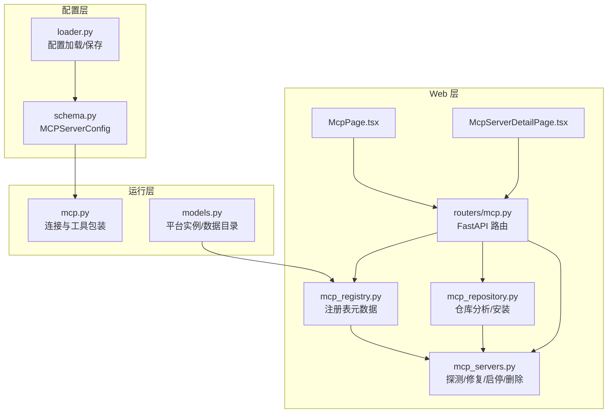
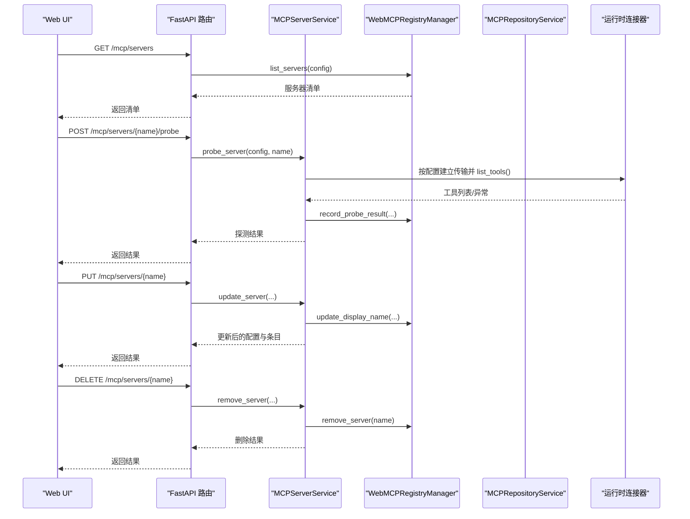
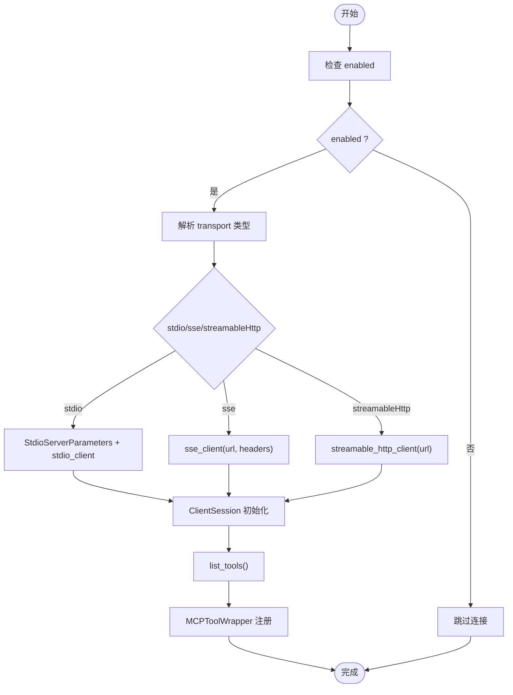
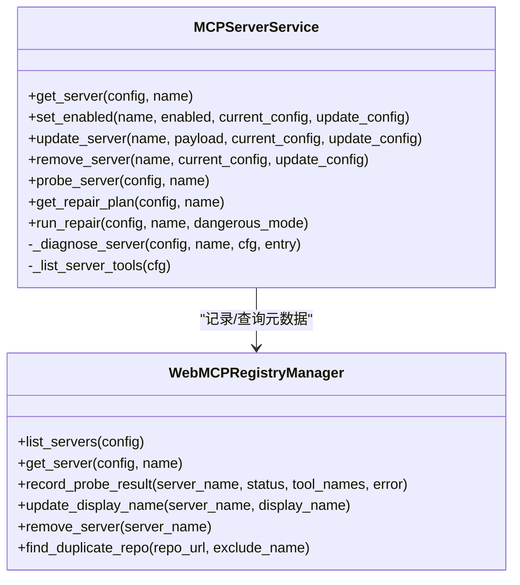
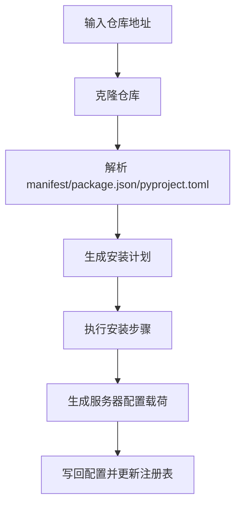
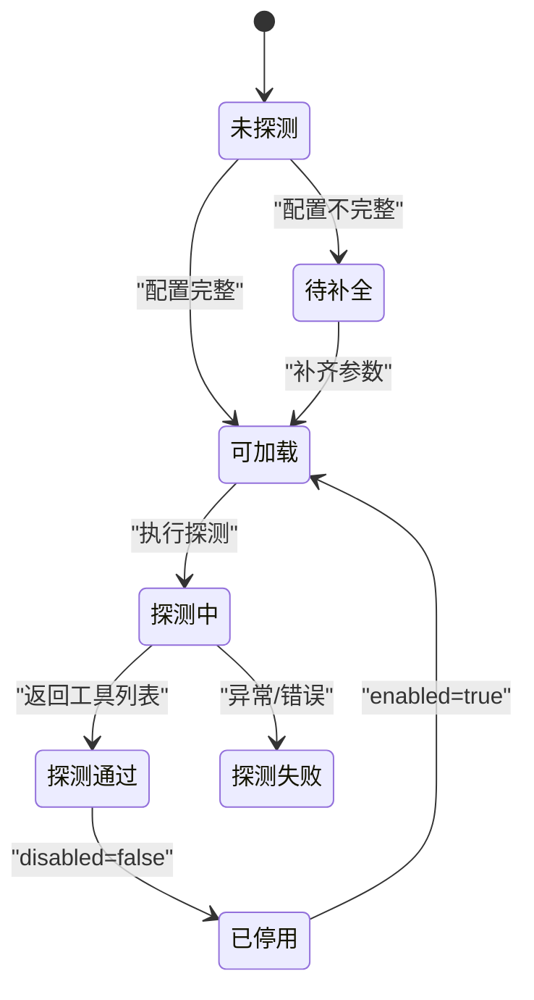
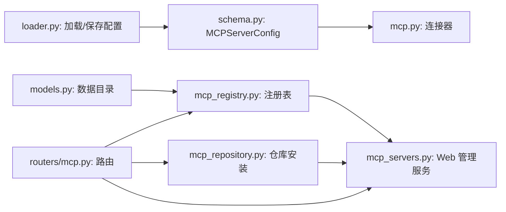

# MCP 服务器管理

<cite>
**本文引用的文件**
- [mcp.py](file://nanobot/agent/tools/mcp.py)
- [mcp_servers.py](file://nanobot/web/mcp_servers.py)
- [mcp_repository.py](file://nanobot/web/mcp_repository.py)
- [mcp_registry.py](file://nanobot/web/mcp_registry.py)
- [mcp.py（路由）](file://nanobot/web/routers/mcp.py)
- [schema.py](file://nanobot/config/schema.py)
- [loader.py](file://nanobot/config/loader.py)
- [models.py（平台实例）](file://nanobot/platform/instances/models.py)
- [commands.py](file://nanobot/cli/commands.py)
- [McpPage.tsx](file://web-ui/src/pages/McpPage.tsx)
- [McpServerDetailPage.tsx](file://web-ui/src/pages/McpServerDetailPage.tsx)
- [test_mcp_tool.py](file://tests/test_mcp_tool.py)
</cite>

## 目录
1. [简介](#简介)
2. [项目结构](#项目结构)
3. [核心组件](#核心组件)
4. [架构总览](#架构总览)
5. [详细组件分析](#详细组件分析)
6. [依赖关系分析](#依赖关系分析)
7. [性能考量](#性能考量)
8. [故障排查指南](#故障排查指南)
9. [结论](#结论)
10. [附录](#附录)

## 简介
本技术文档围绕 MCP（Model Context Protocol）服务器管理能力进行系统化说明，覆盖配置、注册、启停、删除、探测、诊断与修复等全流程。文档同时解释服务器状态管理机制（enabled/disabled）、状态持久化策略，并提供实际可用的配置参数说明、使用方法、常见问题与排障建议。

## 项目结构
MCP 服务器管理由三层协同构成：
- 配置层：定义 MCP 服务器配置结构与默认行为（schema）
- 运行层：在运行时连接 MCP 服务器，注册其工具供代理使用（agent/tools）
- Web 层：提供 Web UI 的管理接口、探测、修复与仓库安装能力（web/*）

图表来源
- [schema.py:329-340](file://nanobot/config/schema.py#L329-L340)
- [mcp.py:74-153](file://nanobot/agent/tools/mcp.py#L74-L153)
- [mcp_servers.py:23-706](file://nanobot/web/mcp_servers.py#L23-L706)
- [mcp_registry.py:145-378](file://nanobot/web/mcp_registry.py#L145-L378)
- [mcp_repository.py:18-589](file://nanobot/web/mcp_repository.py#L18-L589)
- [mcp.py（路由）:1-216](file://nanobot/web/routers/mcp.py#L1-L216)
- [models.py（平台实例）:97-111](file://nanobot/platform/instances/models.py#L97-L111)
- [McpPage.tsx:1-380](file://web-ui/src/pages/McpPage.tsx#L1-L380)
- [McpServerDetailPage.tsx:1-694](file://web-ui/src/pages/McpServerDetailPage.tsx#L1-L694)

章节来源
- [schema.py:329-340](file://nanobot/config/schema.py#L329-L340)
- [mcp.py:74-153](file://nanobot/agent/tools/mcp.py#L74-L153)
- [mcp_servers.py:23-706](file://nanobot/web/mcp_servers.py#L23-L706)
- [mcp_registry.py:145-378](file://nanobot/web/mcp_registry.py#L145-L378)
- [mcp_repository.py:18-589](file://nanobot/web/mcp_repository.py#L18-L589)
- [mcp.py（路由）:1-216](file://nanobot/web/routers/mcp.py#L1-L216)
- [models.py（平台实例）:97-111](file://nanobot/platform/instances/models.py#L97-L111)
- [McpPage.tsx:1-380](file://web-ui/src/pages/McpPage.tsx#L1-L380)
- [McpServerDetailPage.tsx:1-694](file://web-ui/src/pages/McpServerDetailPage.tsx#L1-L694)

## 核心组件
- 配置模型 MCPServerConfig：定义服务器连接参数（type、command、args、url、env、headers、toolTimeout），以及默认启用状态。
- 运行时连接器：根据配置选择传输方式（stdio/sse/streamableHttp），建立会话并列出工具，将每个工具包装为本地工具。
- Web 管理服务：提供探测、修复、启停、删除、仓库安装与分析等能力。
- 注册表：独立于原始配置存储 MCP 元数据（来源、安装信息、探测结果、工具缓存等），用于 UI 与诊断。
- 路由与 UI：暴露 REST API 并提供前端页面进行可视化管理。

章节来源
- [schema.py:329-340](file://nanobot/config/schema.py#L329-L340)
- [mcp.py:74-153](file://nanobot/agent/tools/mcp.py#L74-L153)
- [mcp_servers.py:23-706](file://nanobot/web/mcp_servers.py#L23-L706)
- [mcp_registry.py:145-378](file://nanobot/web/mcp_registry.py#L145-L378)
- [mcp_repository.py:18-589](file://nanobot/web/mcp_repository.py#L18-L589)
- [mcp.py（路由）:1-216](file://nanobot/web/routers/mcp.py#L1-L216)

## 架构总览
MCP 管理的端到端流程如下：

图表来源
- [mcp.py（路由）:45-184](file://nanobot/web/routers/mcp.py#L45-L184)
- [mcp_servers.py:139-210](file://nanobot/web/mcp_servers.py#L139-L210)
- [mcp_registry.py:145-180](file://nanobot/web/mcp_registry.py#L145-L180)
- [mcp_repository.py:35-103](file://nanobot/web/mcp_repository.py#L35-L103)
- [mcp.py:29-36](file://nanobot/agent/tools/mcp.py#L29-L36)

## 详细组件分析

### 配置模型与参数说明
- enabled：布尔值，默认启用。影响运行时是否加载该服务器。
- type：传输类型，可选 stdio、sse、streamableHttp。省略时可自动推断。
- command/args/env：stdio 传输的命令、参数与环境变量。
- url/headers：HTTP/SSE 传输的端点与自定义请求头。
- toolTimeout：单次工具调用超时（秒），用于保护运行时。

章节来源
- [schema.py:329-340](file://nanobot/config/schema.py#L329-L340)

### 运行时连接与工具注册
- 自动推断传输：当未显式指定 type 时，若存在 command 则 stdio，否则根据 url 是否以 /sse 结尾选择 sse 或 streamableHttp。
- 传输客户端：根据传输类型分别使用 stdio_client、sse_client、streamable_http_client。
- 初始化会话：建立 ClientSession 并调用 initialize，随后 list_tools 获取工具清单。
- 工具包装：将每个工具封装为 MCPToolWrapper，统一执行入口与超时处理。

图表来源
- [mcp.py:74-153](file://nanobot/agent/tools/mcp.py#L74-L153)

章节来源
- [mcp.py:74-153](file://nanobot/agent/tools/mcp.py#L74-L153)

### Web 管理服务（探测、修复、启停、删除）
- 探测（probe）：校验必填环境变量，按配置建立传输并获取工具列表，记录探测结果与错误。
- 修复（repair）：基于最近探测与错误信息生成诊断与修复步骤，支持受限与危险两种模式，通过外部 worker 执行修复任务。
- 启停（toggle）：更新配置中的 enabled 字段并持久化。
- 删除（remove）：从配置移除条目，尝试清理受管安装目录。

图表来源
- [mcp_servers.py:23-706](file://nanobot/web/mcp_servers.py#L23-L706)
- [mcp_registry.py:145-378](file://nanobot/web/mcp_registry.py#L145-L378)

章节来源
- [mcp_servers.py:139-210](file://nanobot/web/mcp_servers.py#L139-L210)
- [mcp_servers.py:212-288](file://nanobot/web/mcp_servers.py#L212-L288)
- [mcp_servers.py:399-501](file://nanobot/web/mcp_servers.py#L399-L501)
- [mcp_registry.py:232-262](file://nanobot/web/mcp_registry.py#L232-L262)

### 仓库安装与分析
- 分析仓库：克隆仓库，解析 server.json/package.json/pyproject.toml，推导安装模式、传输方式、运行命令与安装步骤。
- 安装仓库：创建受管安装目录，执行安装步骤，生成 MCP 服务器配置并写回配置文件。
- 元数据：记录来源仓库、安装目录、安装步骤、必填环境变量等，供 UI 与修复使用。

图表来源
- [mcp_repository.py:27-103](file://nanobot/web/mcp_repository.py#L27-L103)
- [mcp_repository.py:105-165](file://nanobot/web/mcp_repository.py#L105-L165)
- [mcp_registry.py:194-221](file://nanobot/web/mcp_registry.py#L194-L221)

章节来源
- [mcp_repository.py:27-103](file://nanobot/web/mcp_repository.py#L27-L103)
- [mcp_repository.py:105-165](file://nanobot/web/mcp_repository.py#L105-L165)
- [mcp_registry.py:194-221](file://nanobot/web/mcp_registry.py#L194-L221)

### 状态管理与持久化
- 运行时状态：由配置中的 enabled 控制是否参与运行时加载。
- 注册表状态：独立存储探测状态、工具计数、最近探测时间、错误信息等，便于 UI 展示与诊断。
- 数据持久化：注册表以 JSON 文件形式保存，路径位于平台实例的数据目录。

图表来源
- [mcp_registry.py:358-367](file://nanobot/web/mcp_registry.py#L358-L367)
- [mcp_servers.py:399-501](file://nanobot/web/mcp_servers.py#L399-L501)

章节来源
- [mcp_registry.py:358-367](file://nanobot/web/mcp_registry.py#L358-L367)
- [mcp_servers.py:399-501](file://nanobot/web/mcp_servers.py#L399-L501)
- [models.py（平台实例）:97-98](file://nanobot/platform/instances/models.py#L97-L98)

### 探测与修复机制
- 探测流程：校验必填环境变量，尝试建立传输并列出工具，记录状态与错误。
- 修复流程：根据最近探测状态与错误信息生成诊断与修复步骤，支持受限/危险模式，通过外部 worker 执行。
- 修复记录：记录最后一次修复请求时间、进程状态、退出码、危险模式开关等。

章节来源
- [mcp_servers.py:139-210](file://nanobot/web/mcp_servers.py#L139-L210)
- [mcp_servers.py:212-288](file://nanobot/web/mcp_servers.py#L212-L288)
- [mcp_servers.py:369-397](file://nanobot/web/mcp_servers.py#L369-L397)

### Web API 与前端交互
- 路由：提供服务器列表、详情、探测、修复、启停、更新、删除、仓库分析与安装等接口。
- 前端页面：McpPage 展示服务器清单与仓库安装面板；McpServerDetailPage 提供连接详情、修复计划、隔离测试聊天、探测摘要与移除操作。

章节来源
- [mcp.py（路由）:45-184](file://nanobot/web/routers/mcp.py#L45-L184)
- [McpPage.tsx:1-380](file://web-ui/src/pages/McpPage.tsx#L1-L380)
- [McpServerDetailPage.tsx:1-694](file://web-ui/src/pages/McpServerDetailPage.tsx#L1-L694)

## 依赖关系分析
- 配置依赖：运行时连接器依赖 schema 中的 MCPServerConfig；Web 层依赖配置加载与保存。
- 平台实例：注册表与安装目录均位于平台实例的数据目录，确保多实例隔离。
- 传输依赖：运行时连接器依赖 mcp 客户端库的不同传输实现；Web 层同样复用相同逻辑进行探测。

图表来源
- [schema.py:329-340](file://nanobot/config/schema.py#L329-L340)
- [mcp.py:74-153](file://nanobot/agent/tools/mcp.py#L74-L153)
- [loader.py:26-66](file://nanobot/config/loader.py#L26-L66)
- [models.py（平台实例）:97-111](file://nanobot/platform/instances/models.py#L97-L111)
- [mcp_registry.py:145-378](file://nanobot/web/mcp_registry.py#L145-L378)
- [mcp_servers.py:23-706](file://nanobot/web/mcp_servers.py#L23-L706)
- [mcp_repository.py:18-589](file://nanobot/web/mcp_repository.py#L18-L589)
- [mcp.py（路由）:1-216](file://nanobot/web/routers/mcp.py#L1-L216)

章节来源
- [schema.py:329-340](file://nanobot/config/schema.py#L329-L340)
- [mcp.py:74-153](file://nanobot/agent/tools/mcp.py#L74-L153)
- [loader.py:26-66](file://nanobot/config/loader.py#L26-L66)
- [models.py（平台实例）:97-111](file://nanobot/platform/instances/models.py#L97-L111)
- [mcp_registry.py:145-378](file://nanobot/web/mcp_registry.py#L145-L378)
- [mcp_servers.py:23-706](file://nanobot/web/mcp_servers.py#L23-L706)
- [mcp_repository.py:18-589](file://nanobot/web/mcp_repository.py#L18-L589)
- [mcp.py（路由）:1-216](file://nanobot/web/routers/mcp.py#L1-L216)

## 性能考量
- 工具超时：通过 toolTimeout 控制单次工具调用的最大耗时，避免阻塞代理循环。
- 传输选择：HTTP 传输建议使用 streamableHttp 以获得更好的流式体验；SSE 适合事件推送场景。
- 并发探测：Web 层的探测与修复采用受限模式优先，危险模式需显式启用，避免误操作导致资源占用。
- 注册表缓存：注册表缓存工具数量与最近探测时间，减少重复探测成本。

章节来源
- [schema.py:339-339](file://nanobot/config/schema.py#L339-L339)
- [mcp_servers.py:369-397](file://nanobot/web/mcp_servers.py#L369-L397)
- [mcp_registry.py:232-256](file://nanobot/web/mcp_registry.py#L232-L256)

## 故障排查指南
- 缺少必填环境变量：探测前会检查 requiredEnv，若缺失则标记 blocked，需先补齐并保存配置。
- 传输参数缺失：stdio 缺少 command，HTTP 缺少 url，均会导致配置不完整，需补齐相应字段。
- 最近一次探测失败：根据错误内容匹配错误码与标签，给出针对性修复步骤（如检查命令/URL、鉴权、超时等）。
- 修复执行：受限模式仅传递上下文给外部 worker；危险模式需显式启用环境变量后方可运行。
- 隔离测试聊天：通过前端隔离测试聊天功能验证工具调用链路与返回内容。

章节来源
- [mcp_servers.py:399-501](file://nanobot/web/mcp_servers.py#L399-L501)
- [mcp_servers.py:560-626](file://nanobot/web/mcp_servers.py#L560-L626)
- [McpServerDetailPage.tsx:199-237](file://web-ui/src/pages/McpServerDetailPage.tsx#L199-L237)

## 结论
MCP 服务器管理在配置、运行时连接、Web 管理与诊断修复方面形成了完整的闭环。通过清晰的配置参数、自动化的传输选择、完善的注册表状态与丰富的修复步骤，用户可以安全、可控地管理第三方 MCP 服务器，并在出现问题时快速定位与修复。

## 附录

### 配置参数详解与使用方法
- enabled：控制服务器是否参与运行时加载。可在 Web UI 中启停，或通过 API 更新。
- type：传输类型，可选 stdio、sse、streamableHttp。未设置时可自动推断。
- command/args/env：stdio 传输的命令、参数与环境变量，适用于本地可执行文件或脚本。
- url/headers：HTTP/SSE 传输的端点与自定义请求头，适用于远程 MCP 服务。
- toolTimeout：单次工具调用超时（秒），建议根据服务性能合理设置。

章节来源
- [schema.py:329-340](file://nanobot/config/schema.py#L329-L340)
- [mcp.py:89-139](file://nanobot/agent/tools/mcp.py#L89-L139)

### 服务器启停与删除 API
- 启停：POST /api/v1/mcp/servers/{server_name}/enabled
- 更新：PUT /api/v1/mcp/servers/{server_name}
- 删除：DELETE /api/v1/mcp/servers/{server_name}

章节来源
- [mcp.py（路由）:139-184](file://nanobot/web/routers/mcp.py#L139-L184)

### 探测与修复 API
- 探测：POST /api/v1/mcp/servers/{server_name}/probe
- 修复计划：GET /api/v1/mcp/servers/{server_name}/repair-plan
- 触发修复：POST /api/v1/mcp/servers/{server_name}/repair-run

章节来源
- [mcp.py（路由）:58-98](file://nanobot/web/routers/mcp.py#L58-L98)

### 前端页面与交互
- MCP 列表页：展示服务器清单、状态、工具数与探测摘要，支持仓库安装与探测。
- MCP 详情页：编辑连接参数、查看修复计划、执行隔离测试聊天、移除服务器。

章节来源
- [McpPage.tsx:1-380](file://web-ui/src/pages/McpPage.tsx#L1-L380)
- [McpServerDetailPage.tsx:1-694](file://web-ui/src/pages/McpServerDetailPage.tsx#L1-L694)

### 运行时集成
- 运行时通过 AgentLoop 将 mcp_servers 配置传入，连接器按配置建立会话并注册工具。
- 关闭时调用 close_mcp，确保资源释放。

章节来源
- [commands.py:396-401](file://nanobot/cli/commands.py#L396-L401)
- [commands.py:672-672](file://nanobot/cli/commands.py#L672-L672)

### 测试参考
- 工具包装器的超时、取消与异常处理行为可通过单元测试验证。

章节来源
- [test_mcp_tool.py:1-100](file://tests/test_mcp_tool.py#L1-L100)