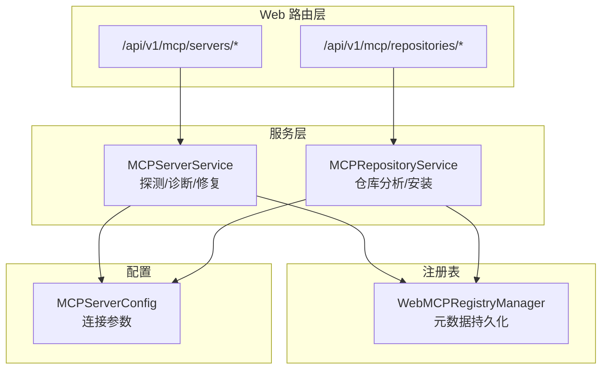
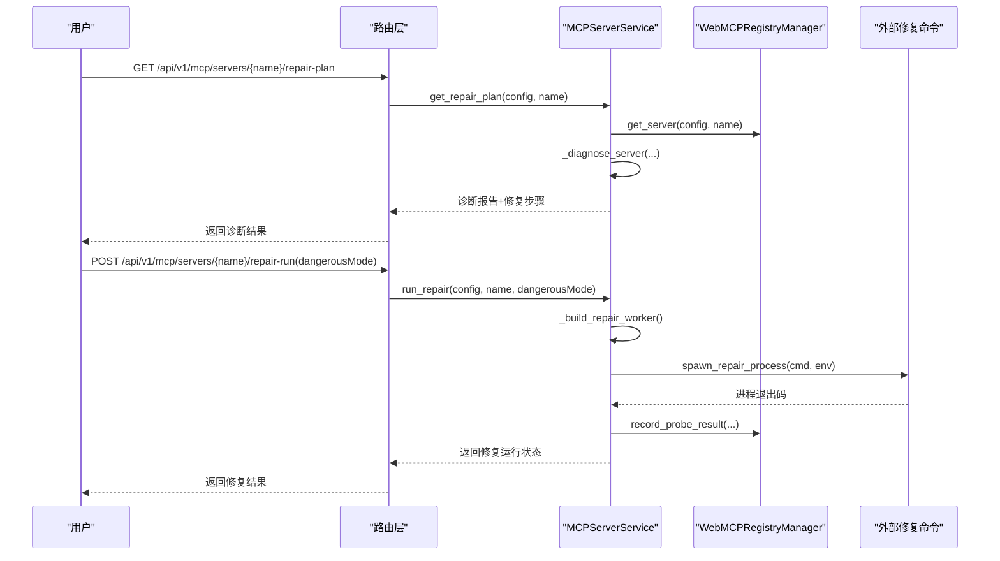
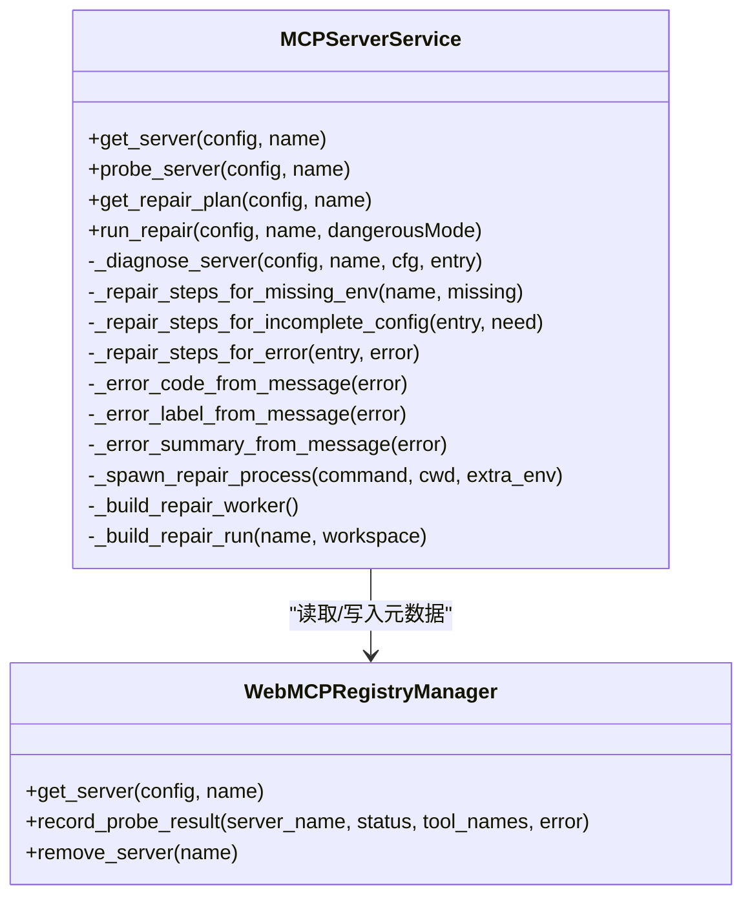
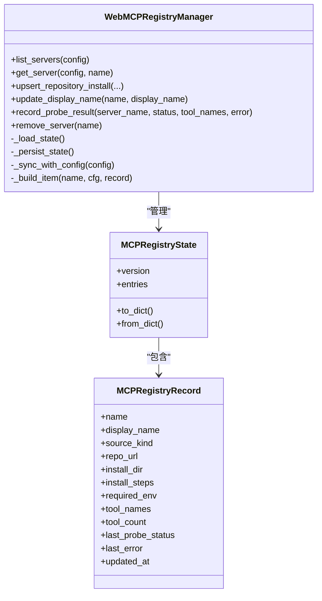
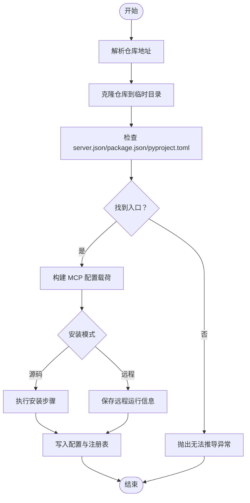
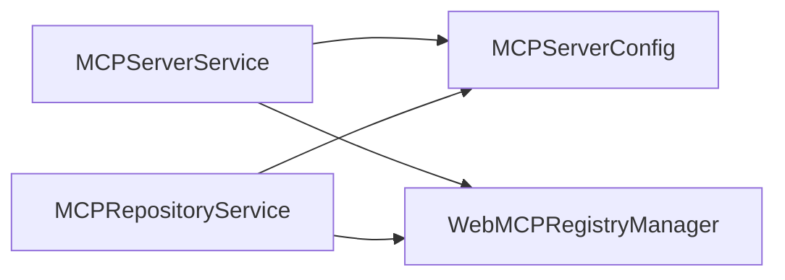

# 修复与诊断

<cite>
**本文引用的文件**
- [mcp_servers.py](file://nanobot/web/mcp_servers.py)
- [mcp_registry.py](file://nanobot/web/mcp_registry.py)
- [mcp_repository.py](file://nanobot/web/mcp_repository.py)
- [mcp.py（路由）](file://nanobot/web/routers/mcp.py)
- [schema.py（配置）](file://nanobot/config/schema.py)
- [test_web_api.py（测试）](file://tests/test_web_api.py)
</cite>

## 目录
1. [简介](#简介)
2. [项目结构](#项目结构)
3. [核心组件](#核心组件)
4. [架构总览](#架构总览)
5. [详细组件分析](#详细组件分析)
6. [依赖分析](#依赖分析)
7. [性能考量](#性能考量)
8. [故障排查指南](#故障排查指南)
9. [结论](#结论)
10. [附录](#附录)

## 简介
本文件面向 MCP（Model Context Protocol）服务器的自动诊断与修复能力，系统性阐述以下内容：
- 自动诊断机制：状态检查、错误分类、诊断报告生成
- 修复流程设计：安全修复与危险修复的区别及权限控制
- 故障类型与修复步骤：环境变量缺失、命令缺失、连接拒绝、鉴权失败、超时等
- 修复工作流配置与使用：外部修复命令集成、上下文传递与运行状态
- 安全控制与权限管理：受限模式与危险模式的边界
- 实战示例与操作指南：基于真实代码路径的诊断与修复步骤

## 项目结构
围绕 MCP 修复与诊断的关键模块如下：
- 路由层：提供 MCP 服务器的探测、修复计划、修复执行等 API
- 服务层：负责实际的探测、诊断、修复执行与运行状态管理
- 注册表：维护 MCP 元数据（来源、安装信息、最后探测状态、错误等）
- 仓库分析：解析第三方仓库，推导安装与运行方案
- 配置模型：MCPServerConfig 描述 MCP 的连接与运行参数

图表来源
- [mcp.py（路由）:45-216](file://nanobot/web/routers/mcp.py#L45-L216)
- [mcp_servers.py:23-706](file://nanobot/web/mcp_servers.py#L23-L706)
- [mcp_repository.py:18-589](file://nanobot/web/mcp_repository.py#L18-L589)
- [mcp_registry.py:145-378](file://nanobot/web/mcp_registry.py#L145-L378)
- [schema.py（配置）:329-339](file://nanobot/config/schema.py#L329-L339)

章节来源
- [mcp.py（路由）:45-216](file://nanobot/web/routers/mcp.py#L45-L216)
- [mcp_servers.py:23-706](file://nanobot/web/mcp_servers.py#L23-L706)
- [mcp_registry.py:145-378](file://nanobot/web/mcp_registry.py#L145-L378)
- [mcp_repository.py:18-589](file://nanobot/web/mcp_repository.py#L18-L589)
- [schema.py（配置）:329-339](file://nanobot/config/schema.py#L329-L339)

## 核心组件
- MCPServerService：负责 MCP 服务器的探测、诊断、修复计划生成与修复执行；内置线程锁保护修复运行状态；通过环境变量驱动外部修复命令。
- WebMCPRegistryManager：独立于原始配置的 MCP 元数据管理器，持久化记录探测状态、工具数量、最后错误等，用于诊断与修复步骤生成。
- MCPRepositoryService：分析 GitHub 仓库，推导安装与运行方案，支持源码安装与远程运行两种模式。
- 路由层：提供统一的 REST 接口，暴露探测、修复计划、修复执行、仓库分析与安装等功能。

章节来源
- [mcp_servers.py:23-706](file://nanobot/web/mcp_servers.py#L23-L706)
- [mcp_registry.py:145-378](file://nanobot/web/mcp_registry.py#L145-L378)
- [mcp_repository.py:18-589](file://nanobot/web/mcp_repository.py#L18-L589)
- [mcp.py（路由）:45-216](file://nanobot/web/routers/mcp.py#L45-L216)

## 架构总览
MCP 修复与诊断的端到端流程如下：
- 用户通过路由触发探测或修复
- 服务层根据配置与注册表状态进行诊断
- 生成诊断报告与修复步骤
- 可选地，通过外部修复命令在受限或危险模式下执行修复
- 注册表记录最新探测状态与错误，供后续诊断参考

图表来源
- [mcp.py（路由）:70-98](file://nanobot/web/routers/mcp.py#L70-L98)
- [mcp_servers.py:212-288](file://nanobot/web/mcp_servers.py#L212-L288)
- [mcp_registry.py:232-256](file://nanobot/web/mcp_registry.py#L232-L256)

## 详细组件分析

### 组件一：MCPServerService（诊断与修复）
职责与关键点：
- 探测：根据配置选择传输方式（stdio/sse/streamableHttp），异步初始化并列出工具，记录到注册表
- 诊断：综合“必填环境变量缺失”“配置不完整”“上次探测失败”等状态，生成诊断代码、标签、摘要、详情与修复步骤
- 修复：通过外部修复命令执行修复，支持受限模式与危险模式；通过线程锁保证并发安全；记录修复运行状态

图表来源
- [mcp_servers.py:23-706](file://nanobot/web/mcp_servers.py#L23-L706)
- [mcp_registry.py:145-378](file://nanobot/web/mcp_registry.py#L145-L378)

章节来源
- [mcp_servers.py:139-210](file://nanobot/web/mcp_servers.py#L139-L210)
- [mcp_servers.py:212-288](file://nanobot/web/mcp_servers.py#L212-L288)
- [mcp_servers.py:399-501](file://nanobot/web/mcp_servers.py#L399-L501)
- [mcp_servers.py:560-626](file://nanobot/web/mcp_servers.py#L560-L626)
- [mcp_servers.py:665-689](file://nanobot/web/mcp_servers.py#L665-L689)
- [mcp_registry.py:232-256](file://nanobot/web/mcp_registry.py#L232-L256)

### 组件二：WebMCPRegistryManager（元数据与持久化）
职责与关键点：
- 维护 MCP 元数据（来源、安装信息、工具列表、最后探测状态、错误等）
- 持久化到文件，支持并发读写与原子替换
- 提供“就绪/不完整/禁用”等状态解析，辅助诊断

图表来源
- [mcp_registry.py:28-143](file://nanobot/web/mcp_registry.py#L28-L143)
- [mcp_registry.py:145-378](file://nanobot/web/mcp_registry.py#L145-L378)

章节来源
- [mcp_registry.py:28-143](file://nanobot/web/mcp_registry.py#L28-L143)
- [mcp_registry.py:145-378](file://nanobot/web/mcp_registry.py#L145-L378)

### 组件三：MCPRepositoryService（仓库分析与安装）
职责与关键点：
- 解析 GitHub 仓库，支持 server.json、package.json、pyproject.toml 等多种入口推导
- 生成安装步骤与运行预览命令，支持源码安装与远程运行
- 将仓库元信息写入注册表，便于后续诊断与修复

图表来源
- [mcp_repository.py:27-103](file://nanobot/web/mcp_repository.py#L27-L103)
- [mcp_repository.py:137-165](file://nanobot/web/mcp_repository.py#L137-L165)
- [mcp_repository.py:167-196](file://nanobot/web/mcp_repository.py#L167-L196)

章节来源
- [mcp_repository.py:27-103](file://nanobot/web/mcp_repository.py#L27-L103)
- [mcp_repository.py:137-196](file://nanobot/web/mcp_repository.py#L137-L196)

### 组件四：路由层（REST API）
职责与关键点：
- 提供 MCP 服务器列表、详情、探测、修复计划、修复执行、仓库分析与安装等接口
- 对异常进行标准化处理，返回明确的错误码与消息

章节来源
- [mcp.py（路由）:45-216](file://nanobot/web/routers/mcp.py#L45-L216)

## 依赖分析
- MCPServerService 依赖：
  - 配置模型 MCPServerConfig
  - WebMCPRegistryManager（读取/写入元数据）
  - 外部修复命令（通过环境变量注入）
- WebMCPRegistryManager 依赖：
  - 配置模型（用于状态同步）
  - 文件系统（持久化）
- MCPRepositoryService 依赖：
  - WebMCPRegistryManager（写入仓库元数据）
  - Git 与包管理器（安装步骤）

图表来源
- [mcp_servers.py:18-29](file://nanobot/web/mcp_servers.py#L18-L29)
- [mcp_registry.py:12-13](file://nanobot/web/mcp_registry.py#L12-L13)
- [mcp_repository.py:14-15](file://nanobot/web/mcp_repository.py#L14-L15)
- [schema.py（配置）:329-339](file://nanobot/config/schema.py#L329-L339)

章节来源
- [mcp_servers.py:18-29](file://nanobot/web/mcp_servers.py#L18-L29)
- [mcp_registry.py:12-13](file://nanobot/web/mcp_registry.py#L12-L13)
- [mcp_repository.py:14-15](file://nanobot/web/mcp_repository.py#L14-L15)
- [schema.py（配置）:329-339](file://nanobot/config/schema.py#L329-L339)

## 性能考量
- 探测阶段采用异步客户端，避免阻塞主线程
- 修复执行通过外部命令异步运行，避免阻塞 Web 服务
- 注册表持久化采用临时文件写入后原子替换，减少竞态风险
- 修复运行状态通过进程轮询判断，避免频繁 IO

[本节为通用指导，不直接分析具体文件]

## 故障排查指南

### 诊断代码与修复步骤
- 缺少必填环境变量（missing_env）
  - 诊断：必填环境变量缺失
  - 步骤：补齐环境变量、保存配置、重新探测
- stdio 缺少命令（missing_command）
  - 诊断：stdio 传输缺少 command
  - 步骤：补齐命令或重新安装以恢复受管路径
- HTTP 连接缺少 URL（missing_url）
  - 诊断：HTTP 传输缺少 url
  - 步骤：补齐 URL 并确认服务监听
- 最近一次探测失败（由错误消息分类）
  - 诊断：根据错误消息映射到具体类别
  - 步骤：针对不同类别给出检查项（命令/URL/鉴权/超时/安装目录）
- 配置尚未完整（incomplete_config）
  - 诊断：配置结构不完整
  - 步骤：补齐连接参数、保存配置、重新探测
- 等待首次探测（not_tested）
  - 诊断：尚未形成足够探测证据
  - 步骤：先做一次探测

章节来源
- [mcp_servers.py:406-501](file://nanobot/web/mcp_servers.py#L406-L501)
- [mcp_servers.py:504-524](file://nanobot/web/mcp_servers.py#L504-L524)
- [mcp_servers.py:526-558](file://nanobot/web/mcp_servers.py#L526-L558)
- [mcp_servers.py:560-626](file://nanobot/web/mcp_servers.py#L560-L626)
- [mcp_servers.py:628-663](file://nanobot/web/mcp_servers.py#L628-L663)

### 修复流程与安全控制
- 修复计划生成
  - 读取配置与注册表状态
  - 生成诊断报告与修复步骤
- 修复执行
  - 通过环境变量注入外部修复命令
  - 支持受限模式与危险模式
  - 通过线程锁防止并发冲突
  - 记录修复运行状态与退出码
- 安全控制
  - 受限模式：仅传递 MCP 上下文，不自动开启危险权限
  - 危险模式：需显式设置允许危险标志后方可运行
  - 进程在后台执行，标准输出/错误静默，避免泄露敏感信息

章节来源
- [mcp_servers.py:212-288](file://nanobot/web/mcp_servers.py#L212-L288)
- [mcp_servers.py:355-367](file://nanobot/web/mcp_servers.py#L355-L367)
- [mcp_servers.py:665-689](file://nanobot/web/mcp_servers.py#L665-L689)
- [mcp.py（路由）:79-98](file://nanobot/web/routers/mcp.py#L79-L98)

### 修复工作流配置与使用
- 配置外部修复命令
  - 设置环境变量以启用修复命令与危险模式
- 触发修复
  - 获取修复计划
  - 在受限或危险模式下执行修复
- 查看修复运行状态
  - 通过修复运行状态字段查看是否配置、是否运行、退出码、PID 等

章节来源
- [mcp_servers.py:355-367](file://nanobot/web/mcp_servers.py#L355-L367)
- [mcp_servers.py:369-397](file://nanobot/web/mcp_servers.py#L369-L397)
- [mcp.py（路由）:70-98](file://nanobot/web/routers/mcp.py#L70-L98)

### 常见故障类型与修复步骤（示例）
- 本地运行时或路径缺失（runtime_missing）
  - 检查命令或脚本路径
  - 如已配置 worker，可先运行受限修复
- 连接被拒绝（connection_refused）
  - 确认远端服务正在监听
- 鉴权失败（auth_failed）
  - 检查 env、headers 与 token 是否有效
- 连接或握手超时（timeout）
  - 检查服务耗时或调高 toolTimeout
- 配置尚未完整（incomplete_config）
  - 补齐连接参数、保存配置、重新探测
- 等待首次探测（not_tested）
  - 先做一次探测

章节来源
- [mcp_servers.py:628-663](file://nanobot/web/mcp_servers.py#L628-L663)
- [mcp_servers.py:560-626](file://nanobot/web/mcp_servers.py#L560-L626)

### 诊断示例与修复操作指南
- 示例：缺少必填环境变量
  - 诊断：blocked + missing_env
  - 步骤：补齐环境变量、保存配置、重新探测
- 示例：探测失败（由错误消息分类）
  - 诊断：attention + 具体错误代码
  - 步骤：按错误类别检查命令/URL/鉴权/超时/安装目录，必要时运行受限修复
- 示例：等待首次探测
  - 诊断：attention + not_tested
  - 步骤：先做一次探测

章节来源
- [mcp_servers.py:406-501](file://nanobot/web/mcp_servers.py#L406-L501)
- [test_web_api.py:909-924](file://tests/test_web_api.py#L909-L924)

## 结论
本系统通过“探测—诊断—修复”的闭环，实现了 MCP 服务器的自动化运维。其特点包括：
- 诊断全面：覆盖环境变量、配置完整性、网络连通性、鉴权与超时等多类问题
- 修复可控：受限与危险模式双通道，外部命令执行，避免直接在 Web 服务中执行高风险操作
- 可观测：注册表持久化记录探测状态与错误，便于持续监控与回溯
- 易扩展：路由层清晰分离业务逻辑，便于接入更多仓库与修复策略

[本节为总结，不直接分析具体文件]

## 附录

### 诊断代码与标签映射
- missing_env：缺少必填环境变量
- missing_command：stdio 缺少命令
- missing_url：HTTP 连接缺少 URL
- incomplete_config：配置尚未完整
- healthy：无需修复
- not_tested：等待首次探测
- runtime_missing：本地运行时或路径缺失
- connection_refused：连接被拒绝
- auth_failed：远端鉴权失败
- timeout：连接或握手超时
- probe_failed：探测失败

章节来源
- [mcp_servers.py:406-501](file://nanobot/web/mcp_servers.py#L406-L501)
- [mcp_servers.py:628-663](file://nanobot/web/mcp_servers.py#L628-L663)

### 修复步骤模板
- 补齐必填环境变量
- 保存 MCP 详情
- 重新探测
- 补齐连接参数
- 保存配置
- 按安装步骤复查受管目录
- 检查命令或脚本路径
- 确认远端服务正在监听
- 检查鉴权凭据
- 检查服务耗时或调高超时
- 如已配置 worker，可先运行受限修复
- 修复后重新探测

章节来源
- [mcp_servers.py:504-524](file://nanobot/web/mcp_servers.py#L504-L524)
- [mcp_servers.py:526-558](file://nanobot/web/mcp_servers.py#L526-L558)
- [mcp_servers.py:560-626](file://nanobot/web/mcp_servers.py#L560-L626)