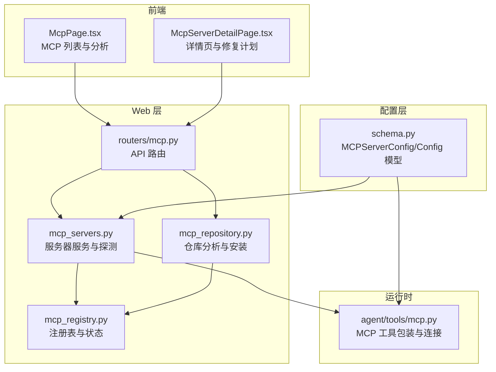
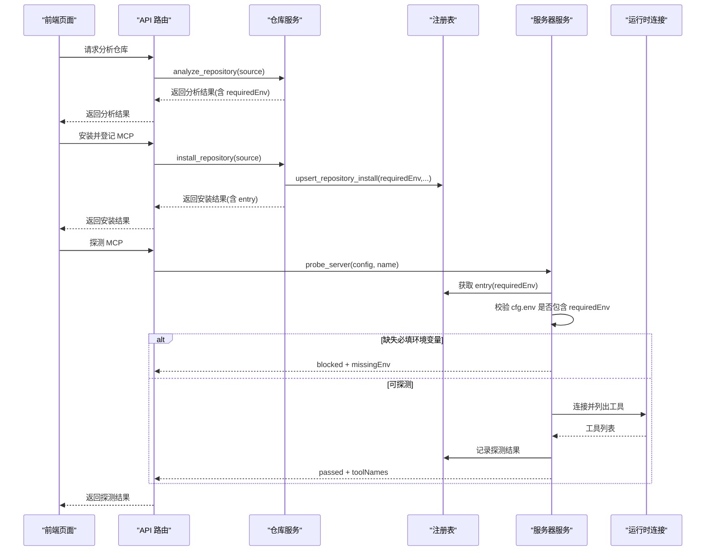
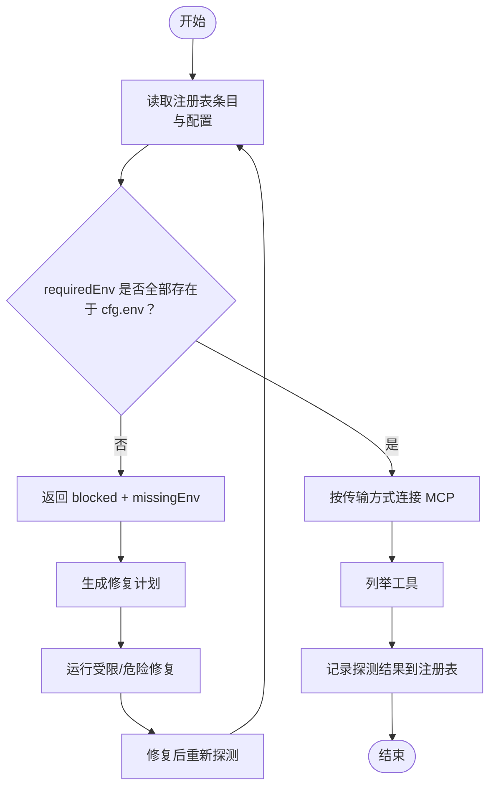
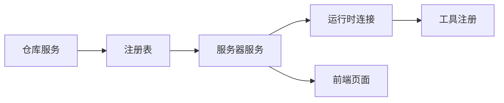

# 环境变量管理

<cite>
**本文档引用的文件**
- [mcp_servers.py](file://nanobot/web/mcp_servers.py)
- [mcp_registry.py](file://nanobot/web/mcp_registry.py)
- [mcp_repository.py](file://nanobot/web/mcp_repository.py)
- [mcp.py](file://nanobot/agent/tools/mcp.py)
- [mcp.py（路由）](file://nanobot/web/routers/mcp.py)
- [schema.py](file://nanobot/config/schema.py)
- [McpPage.tsx](file://web-ui/src/pages/McpPage.tsx)
- [McpServerDetailPage.tsx](file://web-ui/src/pages/McpServerDetailPage.tsx)
- [test_web_api.py](file://tests/test_web_api.py)
- [test_web_services.py](file://tests/test_web_services.py)
</cite>

## 目录
1. [简介](#简介)
2. [项目结构](#项目结构)
3. [核心组件](#核心组件)
4. [架构总览](#架构总览)
5. [详细组件分析](#详细组件分析)
6. [依赖分析](#依赖分析)
7. [性能考量](#性能考量)
8. [故障排除指南](#故障排除指南)
9. [结论](#结论)
10. [附录](#附录)

## 简介
本文件聚焦于 MCP（Model Context Protocol）环境变量管理，系统性阐述以下内容：
- MCP 服务器所需环境变量的来源与用途
- requiredEnv 的概念、存储与校验机制
- 环境变量的验证、检查与修复流程
- 不同传输方式（stdio、sse、streamableHttp）下环境变量的使用差异
- 最佳实践与安全注意事项
- 常见配置示例与故障排除方法
- 环境变量与系统安全及权限控制的关系

## 项目结构
围绕 MCP 环境变量管理的关键模块分布如下：
- Web 层：负责 MCP 服务器的注册、探测、修复计划与前端交互
- 配置层：定义 MCP 服务器配置模型与环境变量前缀
- 运行时：在实际连接 MCP 服务器时注入环境变量
- 前端页面：展示与编辑环境变量、触发探测与修复

图表来源
- [mcp_registry.py:145-378](file://nanobot/web/mcp_registry.py#L145-L378)
- [mcp_servers.py:23-706](file://nanobot/web/mcp_servers.py#L23-L706)
- [mcp_repository.py:18-589](file://nanobot/web/mcp_repository.py#L18-L589)
- [mcp.py（路由）:1-216](file://nanobot/web/routers/mcp.py#L1-L216)
- [schema.py:291-349](file://nanobot/config/schema.py#L291-L349)
- [mcp.py:74-153](file://nanobot/agent/tools/mcp.py#L74-L153)
- [McpPage.tsx:1-380](file://web-ui/src/pages/McpPage.tsx#L1-L380)
- [McpServerDetailPage.tsx:1-694](file://web-ui/src/pages/McpServerDetailPage.tsx#L1-L694)

章节来源
- [mcp_registry.py:145-378](file://nanobot/web/mcp_registry.py#L145-L378)
- [mcp_servers.py:23-706](file://nanobot/web/mcp_servers.py#L23-L706)
- [mcp_repository.py:18-589](file://nanobot/web/mcp_repository.py#L18-L589)
- [mcp.py（路由）:1-216](file://nanobot/web/routers/mcp.py#L1-L216)
- [schema.py:291-349](file://nanobot/config/schema.py#L291-L349)
- [mcp.py:74-153](file://nanobot/agent/tools/mcp.py#L74-L153)
- [McpPage.tsx:1-380](file://web-ui/src/pages/McpPage.tsx#L1-L380)
- [McpServerDetailPage.tsx:1-694](file://web-ui/src/pages/McpServerDetailPage.tsx#L1-L694)

## 核心组件
- MCP 注册表与状态（WebMCPRegistryManager）
  - 存储每个 MCP 的来源、安装元数据、requiredEnv、optionalEnv、工具列表与探测结果
  - 提供构建条目、解析传输方式、计算状态等能力
- MCP 服务器服务（MCPServerService）
  - 实现探测、修复计划、修复执行、环境变量缺失诊断
  - 支持三种传输方式：stdio、sse、streamableHttp
- MCP 仓库服务（MCPRepositoryService）
  - 分析仓库结构，提取 requiredEnv、install_steps、transport 等
  - 生成安装后的服务器配置并写入注册表
- 配置模型（MCPServerConfig、Config）
  - 定义 MCP 服务器配置字段（env、headers、toolTimeout 等）
  - 定义全局配置的环境变量前缀（NANOBOT_）
- 运行时连接（agent/tools/mcp.py）
  - 在运行时根据配置注入 env/headers，建立连接并注册工具
- 前端页面
  - 展示 requiredEnv、env JSON 编辑器、修复计划与修复执行入口

章节来源
- [mcp_registry.py:28-114](file://nanobot/web/mcp_registry.py#L28-L114)
- [mcp_servers.py:23-706](file://nanobot/web/mcp_servers.py#L23-L706)
- [mcp_repository.py:18-589](file://nanobot/web/mcp_repository.py#L18-L589)
- [schema.py:291-349](file://nanobot/config/schema.py#L291-L349)
- [mcp.py:74-153](file://nanobot/agent/tools/mcp.py#L74-L153)
- [McpPage.tsx:240-276](file://web-ui/src/pages/McpPage.tsx#L240-L276)
- [McpServerDetailPage.tsx:432-460](file://web-ui/src/pages/McpServerDetailPage.tsx#L432-L460)

## 架构总览
MCP 环境变量管理贯穿“仓库分析 → 安装登记 → 环境变量配置 → 探测校验 → 修复计划 → 运行时注入”的闭环。

图表来源
- [mcp_repository.py:27-103](file://nanobot/web/mcp_repository.py#L27-L103)
- [mcp_registry.py:194-231](file://nanobot/web/mcp_registry.py#L194-L231)
- [mcp_servers.py:139-210](file://nanobot/web/mcp_servers.py#L139-L210)
- [mcp.py:74-153](file://nanobot/agent/tools/mcp.py#L74-L153)

## 详细组件分析

### requiredEnv 的概念与机制
- 来源
  - 仓库分析阶段从 .env 示例文件中收集必需环境变量键名，形成 requiredEnv 列表
  - 注册表记录每个 MCP 的 requiredEnv、optionalEnv 与安装元数据
- 作用
  - 在探测前进行“必填环境变量”校验，若缺失则直接阻断探测
  - 作为修复计划的首要依据，指导用户补齐 env
- 存储与展示
  - 注册表记录 requiredEnv、optionalEnv，并在条目中暴露给前端
  - 前端在“安装分析”与“详情页”中展示 requiredEnv，辅助用户理解需要配置哪些变量

章节来源
- [mcp_repository.py:442-456](file://nanobot/web/mcp_repository.py#L442-L456)
- [mcp_registry.py:194-231](file://nanobot/web/mcp_registry.py#L194-L231)
- [mcp_registry.py:303-344](file://nanobot/web/mcp_registry.py#L303-L344)
- [McpPage.tsx:251-260](file://web-ui/src/pages/McpPage.tsx#L251-L260)
- [McpServerDetailPage.tsx:663-667](file://web-ui/src/pages/McpServerDetailPage.tsx#L663-L667)

### 环境变量的验证、检查与修复流程
- 验证与检查
  - 探测前：遍历 entry.requiredEnv，若 cfg.env 中对应键为空则标记为缺失
  - 若缺失，返回 blocked 状态与 missingEnv 列表
  - 若通过，进入连接与工具列举流程，并记录探测结果
- 修复计划
  - 基于缺失的 requiredEnv 生成“补齐必填环境变量”等步骤
  - 结合 lastError 推断可能的运行时/鉴权/超时等问题，提供针对性修复步骤
  - 支持受限修复（bounded）与危险修复（dangerous），后者需要显式允许
- 修复执行
  - 通过外部 worker 命令执行修复任务，传递上下文与诊断信息
  - 修复后可重新探测以确认问题是否解决

图表来源
- [mcp_servers.py:139-210](file://nanobot/web/mcp_servers.py#L139-L210)
- [mcp_servers.py:399-501](file://nanobot/web/mcp_servers.py#L399-L501)
- [mcp_servers.py:503-626](file://nanobot/web/mcp_servers.py#L503-L626)

章节来源
- [mcp_servers.py:139-210](file://nanobot/web/mcp_servers.py#L139-L210)
- [mcp_servers.py:399-501](file://nanobot/web/mcp_servers.py#L399-L501)
- [mcp_servers.py:503-626](file://nanobot/web/mcp_servers.py#L503-L626)

### 不同传输方式下的环境变量使用差异
- stdio
  - 通过命令行启动 MCP 进程，环境变量通过 env 字段传入子进程
  - 适合本地可执行脚本或二进制
- sse/streamableHttp
  - 通过 HTTP 客户端连接远程 MCP 服务，环境变量通常用于鉴权（如 API Key）
  - headers 字段用于附加请求头（如 Authorization）
- 运行时注入
  - 运行时连接时，会合并 headers 并注入 env，确保工具调用具备必要凭据

章节来源
- [mcp_servers.py:289-334](file://nanobot/web/mcp_servers.py#L289-L334)
- [mcp.py:74-153](file://nanobot/agent/tools/mcp.py#L74-L153)

### 配置模型与环境变量前缀
- MCPServerConfig
  - env：键值对形式的环境变量
  - headers：键值对形式的请求头
  - toolTimeout：工具调用超时
- Config
  - 通过环境变量前缀 NANOBOT_ 与嵌套分隔符 __ 将系统环境映射到配置字段
  - 便于在部署环境中统一注入配置

章节来源
- [schema.py:291-349](file://nanobot/config/schema.py#L291-L349)
- [schema.py:449-450](file://nanobot/config/schema.py#L449-L450)

### 前端交互与最佳实践
- 前端展示
  - 安装分析页展示 requiredEnv，帮助用户提前准备
  - 详情页提供 env JSON 编辑器，支持保存后立即生效
- 最佳实践
  - 将敏感凭据放入 requiredEnv，避免硬编码在命令行参数中
  - 使用 headers 传递短期令牌，减少长期持久化风险
  - 为每个 MCP 单独维护 env，避免跨服务污染
  - 在启用前先探测，确认工具列表与错误状态

章节来源
- [McpPage.tsx:251-260](file://web-ui/src/pages/McpPage.tsx#L251-L260)
- [McpServerDetailPage.tsx:432-460](file://web-ui/src/pages/McpServerDetailPage.tsx#L432-L460)

## 依赖分析
- 组件耦合
  - MCPServerService 依赖注册表与配置模型，负责探测与修复
  - MCPRepositoryService 依赖注册表，负责仓库分析与安装
  - agent/tools/mcp.py 依赖 mcp SDK，负责运行时连接与工具注册
- 关键依赖链
  - 仓库分析 → 注册表记录 requiredEnv → 探测前校验 → 修复计划 → 保存配置 → 运行时注入

图表来源
- [mcp_repository.py:18-589](file://nanobot/web/mcp_repository.py#L18-L589)
- [mcp_registry.py:145-378](file://nanobot/web/mcp_registry.py#L145-L378)
- [mcp_servers.py:23-706](file://nanobot/web/mcp_servers.py#L23-L706)
- [mcp.py:74-153](file://nanobot/agent/tools/mcp.py#L74-L153)

章节来源
- [mcp_repository.py:18-589](file://nanobot/web/mcp_repository.py#L18-L589)
- [mcp_registry.py:145-378](file://nanobot/web/mcp_registry.py#L145-L378)
- [mcp_servers.py:23-706](file://nanobot/web/mcp_servers.py#L23-L706)
- [mcp.py:74-153](file://nanobot/agent/tools/mcp.py#L74-L153)

## 性能考量
- 探测超时
  - 通过 toolTimeout 控制单次工具调用的最长等待时间，避免阻塞
- 传输选择
  - SSE/Streamable HTTP 适合远程服务，注意网络抖动与超时策略
  - stdio 适合本地进程，关注命令可用性与路径展开
- 缓存与复用
  - 注册表缓存工具列表与探测结果，减少重复探测成本

## 故障排除指南
- 常见症状与定位
  - blocked：缺少 requiredEnv，优先补齐 env JSON
  - failed：查看 lastError，常见原因包括运行时缺失、连接被拒、鉴权失败、超时
  - ready：无需修复，可直接启用
- 修复步骤
  - 运行受限修复（bounded）：在不开启危险权限的前提下，将上下文交给外部 worker
  - 显式启用危险修复（dangerous）：需要配置危险模式开关
  - 修复后重新探测，确认工具列表与错误状态变化
- 测试与验证
  - 使用隔离测试聊天验证工具行为
  - 逐步缩小问题范围：先检查命令/URL，再检查 env/headers

章节来源
- [mcp_servers.py:399-501](file://nanobot/web/mcp_servers.py#L399-L501)
- [mcp_servers.py:560-626](file://nanobot/web/mcp_servers.py#L560-L626)
- [McpServerDetailPage.tsx:529-540](file://web-ui/src/pages/McpServerDetailPage.tsx#L529-L540)

## 结论
MCP 环境变量管理以 requiredEnv 为核心，贯穿“仓库分析 → 安装登记 → 环境变量配置 → 探测校验 → 修复计划 → 运行时注入”的完整闭环。通过注册表与服务器服务的协作，系统实现了对必填变量的严格校验与可视化的修复引导；通过前端提供的 env JSON 编辑器与隔离测试聊天，用户可以高效地完成配置与验证。在安全方面，建议优先使用 headers 与短期令牌，避免将敏感信息长期持久化；在性能方面，合理设置 toolTimeout 与选择合适的传输方式，有助于提升稳定性与响应速度。

## 附录

### 常见配置示例与要点
- 仓库分析阶段
  - requiredEnv 从 .env 示例文件中提取，作为必填项清单
- 安装登记阶段
  - 安装后 entry 中包含 requiredEnv、installSteps、installDir 等元数据
- 探测阶段
  - 若 cfg.env 中缺少 requiredEnv，则返回 blocked 并提示 missingEnv
  - 成功后记录工具列表与探测状态
- 前端操作
  - 在详情页将 requiredEnv 填入 env JSON，保存后立即写回配置
  - 通过“探测”按钮验证配置正确性

章节来源
- [mcp_repository.py:442-456](file://nanobot/web/mcp_repository.py#L442-L456)
- [mcp_registry.py:194-231](file://nanobot/web/mcp_registry.py#L194-L231)
- [mcp_servers.py:139-210](file://nanobot/web/mcp_servers.py#L139-L210)
- [McpPage.tsx:251-260](file://web-ui/src/pages/McpPage.tsx#L251-L260)
- [McpServerDetailPage.tsx:432-460](file://web-ui/src/pages/McpServerDetailPage.tsx#L432-L460)

### 测试用例参考
- 仓库分析返回 requiredEnv
- 安装后 entry 包含 requiredEnv
- 探测时 blocked 并返回 missingEnv
- 修复计划解释缺失环境变量并阻止危险模式

章节来源
- [test_web_api.py:712-742](file://tests/test_web_api.py#L712-L742)
- [test_web_services.py:121-164](file://tests/test_web_services.py#L121-L164)