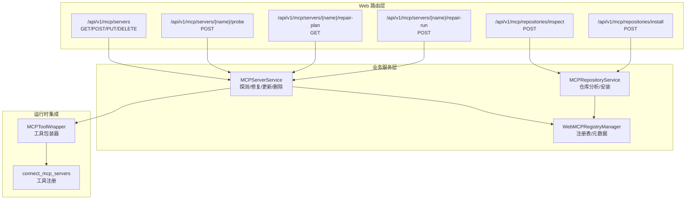
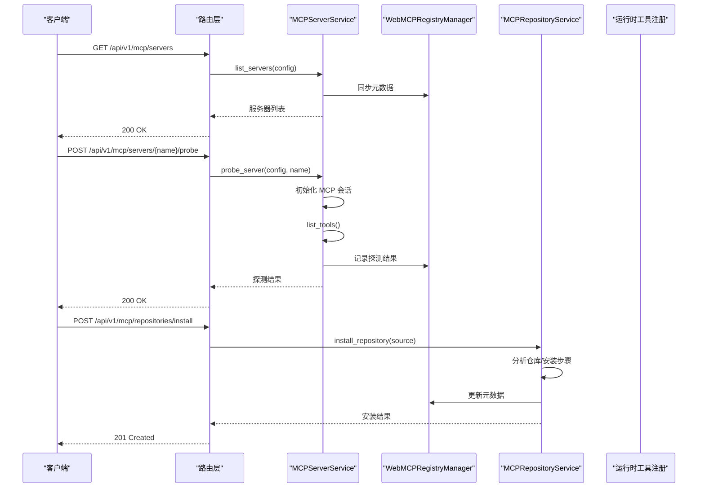
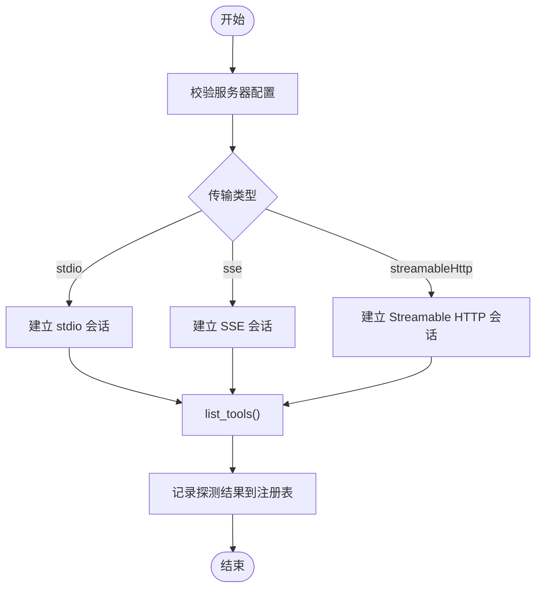
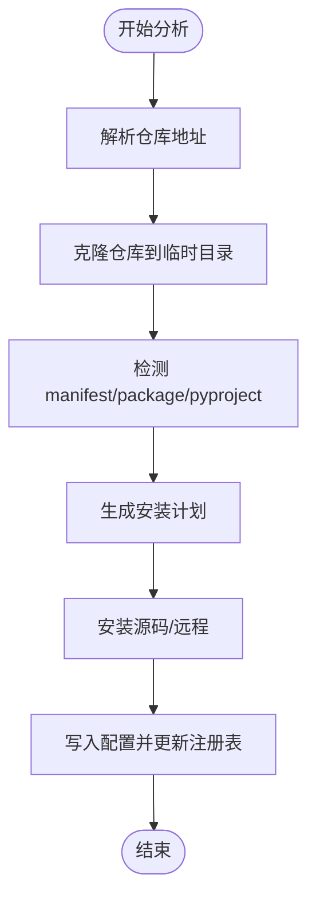
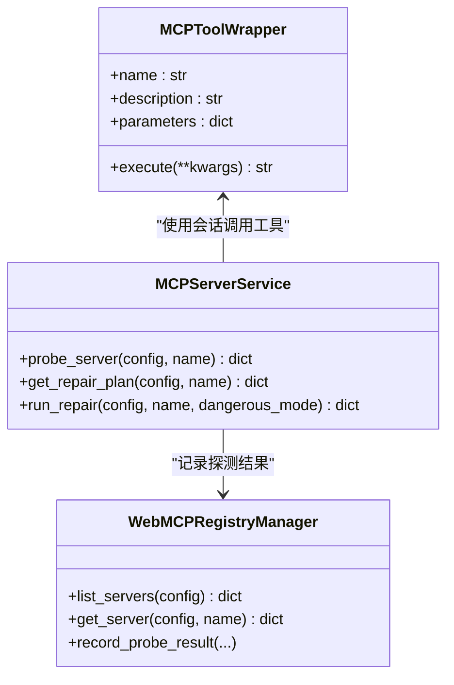
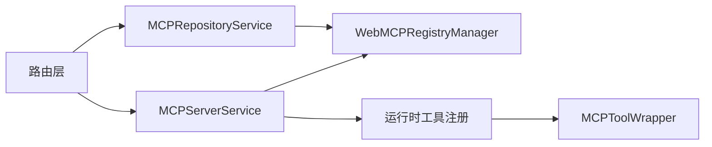

# MCP 服务 API

<cite>
**本文档引用的文件**
- [nanobot/web/routers/mcp.py](file://nanobot/web/routers/mcp.py)
- [nanobot/web/mcp_registry.py](file://nanobot/web/mcp_registry.py)
- [nanobot/web/mcp_repository.py](file://nanobot/web/mcp_repository.py)
- [nanobot/web/mcp_servers.py](file://nanobot/web/mcp_servers.py)
- [nanobot/agent/tools/mcp.py](file://nanobot/agent/tools/mcp.py)
- [nanobot/web/app.py](file://nanobot/web/app.py)
- [nanobot/web/operations.py](file://nanobot/web/operations.py)
- [nanobot/web/routers/setup.py](file://nanobot/web/routers/setup.py)
- [nanobot/config/schema.py](file://nanobot/config/schema.py)
</cite>

## 目录
1. [简介](#简介)
2. [项目结构](#项目结构)
3. [核心组件](#核心组件)
4. [架构总览](#架构总览)
5. [详细组件分析](#详细组件分析)
6. [依赖关系分析](#依赖关系分析)
7. [性能考量](#性能考量)
8. [故障排查指南](#故障排查指南)
9. [结论](#结论)
10. [附录](#附录)

## 简介
本文件为 MCP（Model Context Protocol）服务 API 的权威参考文档，覆盖 MCP 服务器注册、工具同步与连接管理的完整 API 生命周期，包括：
- 服务器注册与管理：创建、查询、更新、删除、启用/停用
- 工具同步与探测：自动探测工具清单、生成修复方案、执行修复
- 连接管理：支持 stdio、SSE、Streamable HTTP 三种传输方式
- 协议握手与工具发现：基于 MCP 协议的客户端会话与工具枚举
- 远程工具调用：将 MCP 工具包装为本地工具并注入运行时
- 健康检查、故障转移与性能监控：系统级健康检查与运行时验证
- 工具注册表管理、版本兼容性与安全控制：配置校验、环境变量、传输类型与超时策略

## 项目结构
MCP 相关功能主要分布在以下模块：
- Web 路由层：定义 REST API 端点与请求/响应模型
- 业务服务层：负责服务器探测、修复、仓库分析与安装
- 注册表与持久化：维护 MCP 服务器元数据与状态
- 运行时集成：将 MCP 工具注入到本地工具注册表
- 配置与校验：基于 Pydantic 的配置模型与传输类型约束

**图表来源**
- [nanobot/web/routers/mcp.py:45-216](file://nanobot/web/routers/mcp.py#L45-L216)
- [nanobot/web/mcp_servers.py:23-706](file://nanobot/web/mcp_servers.py#L23-L706)
- [nanobot/web/mcp_repository.py:18-589](file://nanobot/web/mcp_repository.py#L18-L589)
- [nanobot/web/mcp_registry.py:145-378](file://nanobot/web/mcp_registry.py#L145-L378)
- [nanobot/agent/tools/mcp.py:14-153](file://nanobot/agent/tools/mcp.py#L14-L153)

**章节来源**
- [nanobot/web/routers/mcp.py:1-216](file://nanobot/web/routers/mcp.py#L1-L216)
- [nanobot/web/app.py:70-281](file://nanobot/web/app.py#L70-L281)

## 核心组件
- 路由器（FastAPI）：集中定义 MCP 相关端点，统一错误处理与认证中间件
- 服务器服务：封装 MCP 服务器的探测、修复、更新与删除逻辑
- 仓库服务：分析与安装第三方 MCP 仓库，生成安装计划与配置
- 注册表管理：独立于原始配置的 MCP 元数据持久化与状态同步
- 工具包装与注册：将 MCP 工具转换为本地工具并注入运行时注册表
- 配置模型：严格的传输类型与字段约束，保障协议一致性

**章节来源**
- [nanobot/web/mcp_servers.py:23-706](file://nanobot/web/mcp_servers.py#L23-L706)
- [nanobot/web/mcp_repository.py:18-589](file://nanobot/web/mcp_repository.py#L18-L589)
- [nanobot/web/mcp_registry.py:145-378](file://nanobot/web/mcp_registry.py#L145-L378)
- [nanobot/agent/tools/mcp.py:14-153](file://nanobot/agent/tools/mcp.py#L14-L153)
- [nanobot/config/schema.py:1-200](file://nanobot/config/schema.py#L1-L200)

## 架构总览
MCP 服务 API 的整体交互流程如下：

**图表来源**
- [nanobot/web/routers/mcp.py:45-216](file://nanobot/web/routers/mcp.py#L45-L216)
- [nanobot/web/mcp_servers.py:139-211](file://nanobot/web/mcp_servers.py#L139-L211)
- [nanobot/web/mcp_registry.py:154-180](file://nanobot/web/mcp_registry.py#L154-L180)
- [nanobot/web/mcp_repository.py:35-104](file://nanobot/web/mcp_repository.py#L35-L104)

## 详细组件分析

### 路由与端点定义
- 服务器管理
  - GET /api/v1/mcp/servers：列出所有 MCP 服务器及其摘要统计
  - GET /api/v1/mcp/servers/{server_name}：查询单个服务器详情
  - POST /api/v1/mcp/servers/{server_name}/probe：探测服务器并返回工具清单
  - GET /api/v1/mcp/servers/{server_name}/repair-plan：生成修复计划
  - POST /api/v1/mcp/servers/{server_name}/repair-run：执行修复（可选危险模式）
  - POST /api/v1/mcp/servers/{server_name}/enabled：启用/停用服务器
  - PUT /api/v1/mcp/servers/{server_name}：更新服务器配置
  - DELETE /api/v1/mcp/servers/{server_name}：删除服务器并清理受管安装目录
- 仓库管理
  - POST /api/v1/mcp/repositories/inspect：分析仓库并返回安装计划
  - POST /api/v1/mcp/repositories/install：安装仓库并写入配置

请求体与响应体均采用统一的 JSON 包装格式，错误码遵循 APIError 规范。

**章节来源**
- [nanobot/web/routers/mcp.py:45-216](file://nanobot/web/routers/mcp.py#L45-L216)

### 服务器服务（MCPServerService）
- 探测流程
  - 校验服务器是否存在与配置完整性
  - 基于传输类型（stdio/sse/streamableHttp）建立 MCP 会话
  - 执行工具枚举并记录结果到注册表
  - 返回探测状态、工具数量与错误信息
- 修复流程
  - 诊断阻塞原因（缺少环境变量、命令、URL 等）
  - 生成修复步骤（补齐环境变量、保存配置、重新探测等）
  - 受限/危险模式执行修复（通过外部 worker 命令）
- 更新与删除
  - 更新传输类型、命令/URL、环境变量、超时等
  - 删除服务器并清理受管安装目录（若位于受管目录内）

**图表来源**
- [nanobot/web/mcp_servers.py:289-335](file://nanobot/web/mcp_servers.py#L289-L335)
- [nanobot/web/mcp_servers.py:139-211](file://nanobot/web/mcp_servers.py#L139-L211)

**章节来源**
- [nanobot/web/mcp_servers.py:23-706](file://nanobot/web/mcp_servers.py#L23-L706)

### 仓库服务（MCPRepositoryService）
- 仓库分析
  - 支持 GitHub 仓库地址解析
  - 解析 server.json、package.json、pyproject.toml 推导安装计划
  - 识别运行时需求与缺失项
- 仓库安装
  - 源码安装：克隆仓库、执行安装步骤、构建服务器配置
  - 远程安装：直接配置 HTTP 远端（streamableHttp/sse）
  - 写入配置并更新注册表元数据

**图表来源**
- [nanobot/web/mcp_repository.py:27-166](file://nanobot/web/mcp_repository.py#L27-L166)
- [nanobot/web/mcp_repository.py:35-104](file://nanobot/web/mcp_repository.py#L35-L104)

**章节来源**
- [nanobot/web/mcp_repository.py:18-589](file://nanobot/web/mcp_repository.py#L18-L589)

### 注册表管理（WebMCPRegistryManager）
- 元数据结构
  - 记录显示名、来源类型（配置/手动/仓库）、仓库信息、安装目录与步骤、环境变量需求
  - 工具计数、最后探测时间、最后错误、状态标签等
- 状态同步
  - 与配置文件保持同步，新增配置项即创建记录
  - 持久化到独立文件，避免与原始配置耦合
- 查询与汇总
  - 提供列表、详情、统计（总数、启用/禁用、就绪/不完整、工具总数等）

**章节来源**
- [nanobot/web/mcp_registry.py:28-378](file://nanobot/web/mcp_registry.py#L28-L378)

### 运行时工具集成（MCPToolWrapper 与 connect_mcp_servers）
- 工具包装
  - 将 MCP 工具名称映射为唯一本地工具名
  - 读取输入 Schema 并在调用时传递参数
  - 处理超时、取消与异常，返回统一文本输出
- 服务器连接
  - 自动识别传输类型（stdio/sse/streamableHttp）
  - 建立会话并初始化，枚举工具后逐个注册
  - 将每个工具包装为本地工具并注入注册表

**图表来源**
- [nanobot/agent/tools/mcp.py:14-153](file://nanobot/agent/tools/mcp.py#L14-L153)
- [nanobot/web/mcp_servers.py:23-706](file://nanobot/web/mcp_servers.py#L23-L706)
- [nanobot/web/mcp_registry.py:145-378](file://nanobot/web/mcp_registry.py#L145-L378)

**章节来源**
- [nanobot/agent/tools/mcp.py:14-153](file://nanobot/agent/tools/mcp.py#L14-L153)

### 协议握手与工具发现
- 握手过程
  - 根据配置选择传输类型：stdio、sse 或 streamableHttp
  - 建立客户端会话并初始化
  - 调用工具枚举接口获取工具清单
- 工具发现机制
  - 将返回的工具定义转换为本地工具包装器
  - 注册到运行时工具注册表，供代理与技能使用
- 远程工具调用接口
  - 通过会话调用工具，支持超时控制与异常处理
  - 输出内容聚合为字符串返回

**章节来源**
- [nanobot/agent/tools/mcp.py:74-153](file://nanobot/agent/tools/mcp.py#L74-L153)
- [nanobot/web/mcp_servers.py:289-335](file://nanobot/web/mcp_servers.py#L289-L335)

### 健康检查、故障转移与性能监控
- 健康检查
  - /api/v1/health：基础健康端点，返回服务状态
- 系统级验证
  - 运行时验证：检查本地运行时（python3/git/node/npm 等）是否就绪
  - 网关与服务地址验证：校验 host/port 与心跳配置
  - MCP 服务验证：检查 MCP 服务器状态、阻塞项与失败项
- 故障转移与修复
  - 通过修复计划生成器诊断问题（缺少环境变量、命令、URL、鉴权、超时等）
  - 提供受限/危险模式修复流程，必要时调用外部 worker 命令
- 性能监控
  - 工具超时控制：每工具独立超时配置
  - 探测结果缓存：注册表记录最后探测时间与错误，减少重复探测成本

**章节来源**
- [nanobot/web/routers/setup.py:153-156](file://nanobot/web/routers/setup.py#L153-L156)
- [nanobot/web/operations.py:55-457](file://nanobot/web/operations.py#L55-L457)
- [nanobot/web/mcp_servers.py:234-626](file://nanobot/web/mcp_servers.py#L234-L626)

### 工具注册表管理、版本兼容性与安全控制
- 工具注册表管理
  - 通过运行时连接函数批量注册 MCP 工具
  - 工具名称去重与命名空间隔离（mcp_{server}_{tool}）
- 版本兼容性
  - 严格传输类型约束（stdio/sse/streamableHttp）
  - 配置字段校验（command/url/env/headers/toolTimeout 等）
  - 仓库安装模式区分（source/remote），并记录安装步骤
- 安全控制
  - 环境变量与头部合并策略，避免明文泄露
  - 危险模式开关（需显式设置环境变量才允许）
  - 工作区目录限制建议（通过系统验证提示）

**章节来源**
- [nanobot/agent/tools/mcp.py:74-153](file://nanobot/agent/tools/mcp.py#L74-L153)
- [nanobot/web/mcp_servers.py:56-109](file://nanobot/web/mcp_servers.py#L56-L109)
- [nanobot/web/mcp_repository.py:167-197](file://nanobot/web/mcp_repository.py#L167-L197)
- [nanobot/web/operations.py:355-381](file://nanobot/web/operations.py#L355-L381)

## 依赖关系分析
- 路由层依赖业务服务与注册表管理
- 业务服务依赖 MCP SDK（mcp）进行会话与工具调用
- 仓库服务依赖 Git 与包管理器（npm/pip 等）执行安装
- 运行时集成依赖工具注册表与代理上下文

**图表来源**
- [nanobot/web/routers/mcp.py:1-216](file://nanobot/web/routers/mcp.py#L1-L216)
- [nanobot/web/mcp_servers.py:23-706](file://nanobot/web/mcp_servers.py#L23-L706)
- [nanobot/web/mcp_repository.py:18-589](file://nanobot/web/mcp_repository.py#L18-L589)
- [nanobot/web/mcp_registry.py:145-378](file://nanobot/web/mcp_registry.py#L145-L378)
- [nanobot/agent/tools/mcp.py:14-153](file://nanobot/agent/tools/mcp.py#L14-L153)

**章节来源**
- [nanobot/web/app.py:70-281](file://nanobot/web/app.py#L70-L281)

## 性能考量
- 探测并发：多服务器探测建议异步执行，避免阻塞主线程
- 超时策略：合理设置 toolTimeout，避免长时间阻塞导致资源浪费
- 缓存利用：注册表记录探测结果，减少重复探测开销
- 传输优化：HTTP 传输使用长连接与合适的超时配置，避免频繁握手
- 安装优化：源码安装尽量复用缓存与增量安装命令（如 npm ci、pip -e）

## 故障排查指南
- 常见错误与定位
  - MCP_SERVER_NOT_FOUND：服务器名称不存在或已被删除
  - MCP_PROBE_FAILED：探测过程中发生异常（网络、鉴权、超时等）
  - MCP_REPAIR_DANGEROUS_DISABLED：危险模式未启用
  - MCP_REPAIR_ALREADY_RUNNING：修复任务已在运行
  - MCP_REPOSITORY_INSPECT_FAILED/MCP_REPOSITORY_INSTALL_FAILED：仓库分析或安装失败
- 诊断步骤
  - 查看修复计划中的诊断代码与修复步骤
  - 补齐缺失的环境变量、命令或 URL
  - 重新探测以验证修复效果
  - 如需危险修复，设置相应环境变量后执行受限修复
- 日志与验证
  - 通过系统验证页面查看运行时与 MCP 服务状态
  - 关注最后探测时间与错误信息，辅助定位问题

**章节来源**
- [nanobot/web/routers/mcp.py:58-99](file://nanobot/web/routers/mcp.py#L58-L99)
- [nanobot/web/mcp_servers.py:234-626](file://nanobot/web/mcp_servers.py#L234-L626)
- [nanobot/web/operations.py:306-353](file://nanobot/web/operations.py#L306-L353)

## 结论
MCP 服务 API 提供了从服务器注册、仓库安装、工具同步到运行时集成的完整能力。通过严格的配置校验、完善的修复流程与系统级健康检查，确保 MCP 在开发与生产环境中的稳定性与安全性。建议在生产环境中：
- 明确传输类型与超时策略
- 严格管理环境变量与鉴权头
- 使用受限修复模式，谨慎启用危险模式
- 定期运行系统验证，及时发现并修复潜在问题

## 附录

### API 端点一览
- 服务器管理
  - GET /api/v1/mcp/servers
  - GET /api/v1/mcp/servers/{server_name}
  - POST /api/v1/mcp/servers/{server_name}/probe
  - GET /api/v1/mcp/servers/{server_name}/repair-plan
  - POST /api/v1/mcp/servers/{server_name}/repair-run
  - POST /api/v1/mcp/servers/{server_name}/enabled
  - PUT /api/v1/mcp/servers/{server_name}
  - DELETE /api/v1/mcp/servers/{server_name}
- 仓库管理
  - POST /api/v1/mcp/repositories/inspect
  - POST /api/v1/mcp/repositories/install
- 健康检查
  - GET /api/v1/health

**章节来源**
- [nanobot/web/routers/mcp.py:45-216](file://nanobot/web/routers/mcp.py#L45-L216)
- [nanobot/web/routers/setup.py:153-156](file://nanobot/web/routers/setup.py#L153-L156)