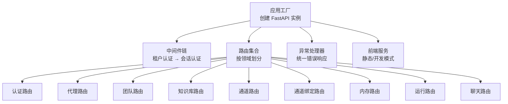
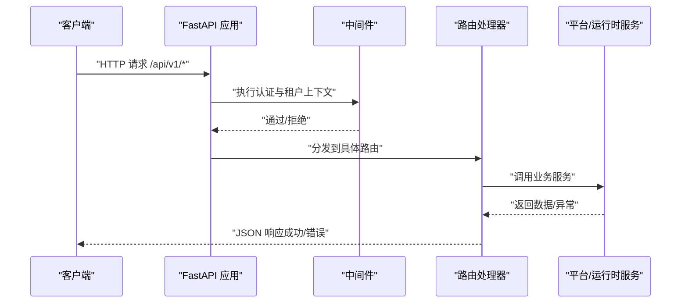
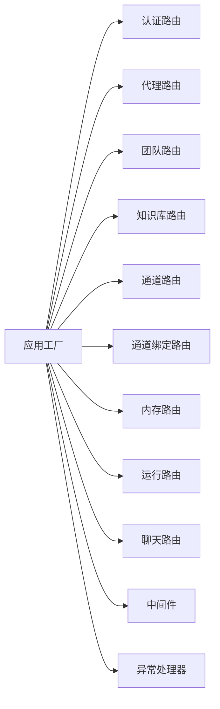

# Web API 参考

<cite>
**本文引用的文件**
- [nanobot/web/app.py](file://nanobot/web/app.py)
- [nanobot/web/api.py](file://nanobot/web/api.py)
- [nanobot/web/http.py](file://nanobot/web/http.py)
- [nanobot/web/auth.py](file://nanobot/web/auth.py)
- [nanobot/web/routers/__init__.py](file://nanobot/web/routers/__init__.py)
- [nanobot/web/routers/auth.py](file://nanobot/web/routers/auth.py)
- [nanobot/web/routers/agents.py](file://nanobot/web/routers/agents.py)
- [nanobot/web/routers/teams.py](file://nanobot/web/routers/teams.py)
- [nanobot/web/routers/memory.py](file://nanobot/web/routers/memory.py)
- [nanobot/web/routers/runs.py](file://nanobot/web/routers/runs.py)
- [nanobot/web/routers/knowledge.py](file://nanobot/web/routers/knowledge.py)
- [nanobot/web/routers/channels.py](file://nanobot/web/routers/channels.py)
- [nanobot/web/routers/channel_bindings.py](file://nanobot/web/routers/channel_bindings.py)
- [nanobot/web/routers/chat.py](file://nanobot/web/routers/chat.py)
</cite>

## 目录
1. [简介](#简介)
2. [项目结构](#项目结构)
3. [核心组件](#核心组件)
4. [架构总览](#架构总览)
5. [详细组件分析](#详细组件分析)
6. [依赖分析](#依赖分析)
7. [性能考量](#性能考量)
8. [故障排查指南](#故障排查指南)
9. [结论](#结论)
10. [附录](#附录)

## 简介
本文件为 Nanobot Web API 的完整参考文档，覆盖 REST API 的端点定义、请求/响应模式、认证与授权、错误处理、状态码语义、版本控制策略、安全与速率限制建议、实时通信（SSE）与 WebSocket 连接说明，以及客户端集成与 SDK 使用指引。API 基于 FastAPI 构建，统一采用 JSON 响应体与结构化错误对象，并通过中间件实现会话级认证与租户上下文注入。

## 项目结构
Nanobot Web API 的入口位于应用工厂函数，路由按领域拆分到独立模块，统一在应用工厂中注册。前端静态资源与开发服务器由配套工具函数管理。

图表来源
- [nanobot/web/app.py:70-280](file://nanobot/web/app.py#L70-L280)
- [nanobot/web/routers/__init__.py:19-35](file://nanobot/web/routers/__init__.py#L19-L35)

章节来源
- [nanobot/web/app.py:70-280](file://nanobot/web/app.py#L70-L280)
- [nanobot/web/api.py:24-78](file://nanobot/web/api.py#L24-L78)
- [nanobot/web/routers/__init__.py:19-35](file://nanobot/web/routers/__init__.py#L19-L35)

## 核心组件
- 应用工厂与生命周期：负责实例化平台服务、绑定运行时源、启动通道运行时、注册路由与中间件。
- 中间件：强制对 /api/v1/* 路径进行会话认证；支持基于 API Key 的租户上下文透传；对 OPTIONS 预检放行。
- 异常处理：将业务异常转换为统一的结构化错误响应；对 404、422、HTTP 异常进行分类处理。
- HTTP 辅助：统一成功/失败响应封装、SSE 编码器、结构化错误类。
- 认证管理：管理员账户初始化、登录、会话令牌发放与校验、头像上传与清理、个人资料更新与密码轮换。

章节来源
- [nanobot/web/app.py:148-246](file://nanobot/web/app.py#L148-L246)
- [nanobot/web/http.py:11-40](file://nanobot/web/http.py#L11-L40)
- [nanobot/web/auth.py:129-414](file://nanobot/web/auth.py#L129-L414)

## 架构总览
下图展示 API 的关键交互路径：客户端请求经中间件认证后进入对应路由，路由调用平台服务或运行时服务，最终返回统一 JSON 响应。

图表来源
- [nanobot/web/app.py:225-246](file://nanobot/web/app.py#L225-L246)
- [nanobot/web/routers/auth.py:87-128](file://nanobot/web/routers/auth.py#L87-L128)

## 详细组件分析

### 版本控制与基础约定
- 版本前缀：所有受管端点均以 /api/v1 开头。
- 响应体结构：统一使用成功/失败包装与结构化错误对象，便于客户端一致处理。
- 错误对象字段：success、data、error.code、error.message、error.details。
- 未匹配路由：/api/{path:path} 统一返回 404。

章节来源
- [nanobot/web/app.py:264-272](file://nanobot/web/app.py#L264-L272)
- [nanobot/web/http.py:11-25](file://nanobot/web/http.py#L11-L25)

### 认证与会话（Cookie）
- 会话 Cookie 名称：nanobot_web_session
- 会话有效期：约 12 小时
- 认证要求：除健康检查与 /api/v1/auth/* 外，所有 /api/v1/* 路由需有效会话；若已通过 API Key 注入租户上下文则跳过 Cookie 校验。
- 登出：清除 Cookie 并失效当前会话。
- 头像：支持上传 PNG/JPEG/WEBP/GIF，大小不超过 2MB；头像 URL 由后端动态拼接。

章节来源
- [nanobot/web/app.py:225-246](file://nanobot/web/app.py#L225-L246)
- [nanobot/web/auth.py:18-27](file://nanobot/web/auth.py#L18-L27)
- [nanobot/web/routers/auth.py:55-74](file://nanobot/web/routers/auth.py#L55-L74)

### 错误处理与状态码
- 400：请求参数无效或业务校验失败（如 AUTH_VALIDATION_ERROR、PROFILE_AVATAR_INVALID 等）。
- 401：未认证（AUTH_REQUIRED）。
- 404：端点不存在或资源不存在（NOT_FOUND、CHAT_SESSION_NOT_FOUND 等）。
- 409：资源冲突（如 AUTH_ALREADY_INITIALIZED、AGENT_CONFLICT、TEAM_CONFLICT）。
- 500：内部错误（如 CHAT_FAILED）。
- 统一错误响应：包含 success=false、error.code、error.message、error.details。

章节来源
- [nanobot/web/app.py:205-224](file://nanobot/web/app.py#L205-L224)
- [nanobot/web/http.py:31-40](file://nanobot/web/http.py#L31-L40)
- [nanobot/web/routers/auth.py:96-115](file://nanobot/web/routers/auth.py#L96-L115)
- [nanobot/web/routers/chat.py:176-186](file://nanobot/web/routers/chat.py#L176-L186)

### 实时通信（SSE）
- SSE 端点：/api/v1/chat/sessions/{session_id}/messages（查询参数 stream=true）。
- 事件类型：start、progress（含 toolHint）、done、error。
- 客户端需以 text/event-stream 接收并解析 data 字段中的 JSON。

章节来源
- [nanobot/web/routers/chat.py:118-169](file://nanobot/web/routers/chat.py#L118-L169)
- [nanobot/web/http.py:27-28](file://nanobot/web/http.py#L27-L28)

### WebSocket（概念性说明）
- 当前代码未实现 WebSocket 路由；若需要，可在现有 SSE 流基础上扩展为双向 WebSocket 通道，用于实时消息推送与事件订阅。
- 建议：保持与 SSE 一致的事件模型与认证策略，确保跨协议一致性。

（本节为概念性说明，不直接分析具体文件）

## 认证与授权 API

### 端点清单
- GET /api/v1/auth/status
  - 功能：获取当前认证状态（是否初始化、是否已登录、用户名）。
  - 认证：可匿名访问。
  - 返回：状态对象。
- POST /api/v1/auth/bootstrap
  - 功能：初始化管理员账户（仅一次）。
  - 认证：可匿名访问。
  - 请求体：username、password。
  - 成功：201，设置会话 Cookie。
- POST /api/v1/auth/login
  - 功能：登录并生成会话。
  - 认证：可匿名访问。
  - 请求体：username、password。
  - 成功：200，设置会话 Cookie。
- POST /api/v1/auth/logout
  - 功能：登出并清除会话。
  - 认证：需会话。
  - 成功：200，清除 Cookie。
- GET /api/v1/profile
  - 功能：获取个人资料（含头像 URL）。
  - 认证：需会话。
  - 成功：200。
- PUT /api/v1/profile
  - 功能：更新用户名/显示名/邮箱。
  - 认证：需会话。
  - 请求体：username、displayName、email。
  - 成功：200，可能重写会话 Cookie（当用户名变更导致重新签发）。
- POST /api/v1/profile/password
  - 功能：修改密码。
  - 认证：需会话。
  - 请求体：currentPassword、newPassword。
  - 成功：200，重写会话 Cookie。
- GET /api/v1/profile/avatar
  - 功能：下载头像文件。
  - 认证：需会话。
  - 成功：200，返回文件流。
- POST /api/v1/profile/avatar
  - 功能：上传头像。
  - 认证：需会话。
  - 请求体：multipart/form-data，file 字段。
  - 成功：200。
- DELETE /api/v1/profile/avatar
  - 功能：删除头像。
  - 认证：需会话。
  - 成功：200。

章节来源
- [nanobot/web/routers/auth.py:87-220](file://nanobot/web/routers/auth.py#L87-L220)
- [nanobot/web/auth.py:129-414](file://nanobot/web/auth.py#L129-L414)

## 代理（Agents）API

### 端点清单
- GET /api/v1/agents
  - 查询：enabled（可选）。
  - 认证：需会话；支持 API Key 租户上下文。
  - 成功：200，返回列表。
- POST /api/v1/agents
  - 请求体：代理定义（可包含模板快照）。
  - 成功：201。
- GET /api/v1/agents/{agent_id}
  - 成功：200。
- PUT /api/v1/agents/{agent_id}
  - 成功：200。
- DELETE /api/v1/agents/{agent_id}
  - 成功：200，返回 {deleted: true}。
- POST /api/v1/agents/{agent_id}/copy
  - 成功：201。
- POST /api/v1/agents/{agent_id}/enable
  - 成功：200。
- POST /api/v1/agents/{agent_id}/disable
  - 成功：200。
- POST /api/v1/agents/{agent_id}/test-run
  - 请求体：content。
  - 成功：200。

章节来源
- [nanobot/web/routers/agents.py:43-162](file://nanobot/web/routers/agents.py#L43-L162)

## 团队（Teams）API

### 端点清单
- GET /api/v1/teams
  - 查询：enabled（可选）。
  - 成功：200。
- POST /api/v1/teams
  - 成功：201。
- GET /api/v1/teams/{team_id}
  - 成功：200。
- GET /api/v1/teams/{team_id}/thread
  - 成功：200。
- GET /api/v1/teams/{team_id}/thread/messages
  - 查询：limit（默认 40，范围 1-200）。
  - 成功：200。
- PUT /api/v1/teams/{team_id}
  - 成功：200。
- DELETE /api/v1/teams/{team_id}
  - 成功：200。
- POST /api/v1/teams/{team_id}/copy
  - 成功：201。
- POST /api/v1/teams/{team_id}/enable
  - 成功：200。
- POST /api/v1/teams/{team_id}/disable
  - 成功：200。
- POST /api/v1/teams/{team_id}/runs
  - 请求体：content。
  - 成功：200。
- POST /api/v1/teams/{team_id}/runs/{run_id}/retry
  - 请求体：appendContext（可选）。
  - 成功：200。

章节来源
- [nanobot/web/routers/teams.py:30-185](file://nanobot/web/routers/teams.py#L30-L185)

## 内存（Memory）API

### 端点清单
- GET /api/v1/teams/{team_id}/memory
  - 成功：200。
- PUT /api/v1/teams/{team_id}/memory
  - 请求体：content。
  - 成功：200。
- GET /api/v1/memory-candidates
  - 查询：teamId、status、scope、limit（默认 100，上限 200）。
  - 成功：200。
- POST /api/v1/memory-search
  - 请求体：query、teamId（可选）、limit（默认 10）、mode（默认 hybrid）。
  - 成功：200。
- POST /api/v1/memory-get
  - 请求体：sourceType、sourceId、teamId（可选）。
  - 成功：200。
- POST /api/v1/memory-candidates/{candidate_id}/apply
  - 成功：200。
- POST /api/v1/memory-candidates/{candidate_id}/reject
  - 成功：200。

章节来源
- [nanobot/web/routers/memory.py:32-125](file://nanobot/web/routers/memory.py#L32-L125)

## 运行（Runs）API

### 端点清单
- GET /api/v1/runs
  - 查询：status、kind、agentId、teamId、sessionKey、parentRunId、rootRunId、threadId、limit（默认 50，上限 200）。
  - 成功：200，返回 items 与 total。
- GET /api/v1/runs/{run_id}
  - 成功：200。
- GET /api/v1/runs/{run_id}/children
  - 成功：200。
- GET /api/v1/runs/{run_id}/tree
  - 成功：200。
- GET /api/v1/runs/{run_id}/artifact
  - 成功：200。
- POST /api/v1/runs/{run_id}/cancel
  - 成功：202，返回运行状态与 taskCancellationSent 标记。

章节来源
- [nanobot/web/routers/runs.py:14-120](file://nanobot/web/routers/runs.py#L14-L120)

## 知识库（Knowledge）API

### 端点清单
- GET /api/v1/knowledge-bases
  - 查询：enabled（可选）。
  - 成功：200。
- POST /api/v1/knowledge-bases
  - 成功：201。
- GET /api/v1/knowledge-bases/{kb_id}
  - 成功：200。
- PUT /api/v1/knowledge-bases/{kb_id}
  - 成功：200。
- DELETE /api/v1/knowledge-bases/{kb_id}
  - 成功：200。
- GET /api/v1/knowledge-bases/{kb_id}/documents
  - 成功：200。
- GET /api/v1/knowledge-bases/{kb_id}/sources
  - 成功：200。
- PUT /api/v1/knowledge-bases/{kb_id}/sources/{source_id}
  - 成功：200。
- DELETE /api/v1/knowledge-bases/{kb_id}/documents/{doc_id}
  - 成功：200。
- POST /api/v1/knowledge-bases/{kb_id}/documents/delete
  - 请求体：docIds（数组）。
  - 成功：200。
- GET /api/v1/knowledge-bases/{kb_id}/jobs
  - 成功：200。
- POST /api/v1/knowledge-bases/{kb_id}/documents
  - 支持 multipart/form-data（多文件）或 JSON（web_url/faq_table）。
  - 成功：202。
- POST /api/v1/knowledge-bases/{kb_id}/retrieve-test
  - 请求体：query、filters（可选）、mode（可选）、limit（可选）。
  - 成功：200。
- POST /api/v1/knowledge-bases/{kb_id}/reindex
  - 请求体：任意（取决于实现）。
  - 成功：202。
- POST /api/v1/knowledge-bases/{kb_id}/sources/{source_id}/sync
  - 成功：202。

章节来源
- [nanobot/web/routers/knowledge.py:22-240](file://nanobot/web/routers/knowledge.py#L22-L240)

## 通道（Channels）API

### 端点清单
- GET /api/v1/channels
  - 成功：200。
- PUT /api/v1/channels/delivery
  - 请求体：交付配置更新。
  - 成功：200。
- GET /api/v1/channels/{channel_name}
  - 成功：200。
- PUT /api/v1/channels/{channel_name}
  - 请求体：通道配置更新。
  - 成功：200。
- POST /api/v1/channels/{channel_name}/test
  - 请求体：测试载荷。
  - 成功：200。
- GET /api/v1/channels/whatsapp/bind/status
  - 成功：200。
- POST /api/v1/channels/whatsapp/bind/start
  - 请求体：绑定起始参数。
  - 成功：200。
- POST /api/v1/channels/whatsapp/bind/stop
  - 成功：200。

章节来源
- [nanobot/web/routers/channels.py:16-123](file://nanobot/web/routers/channels.py#L16-L123)

## 通道绑定（Channel Bindings）API

### 端点清单
- GET /api/v1/channel-bindings
  - 成功：200。
- POST /api/v1/channel-bindings
  - 成功：201。
- GET /api/v1/channel-bindings/{binding_id}
  - 成功：200。
- PUT /api/v1/channel-bindings/{binding_id}
  - 成功：200。
- DELETE /api/v1/channel-bindings/{binding_id}
  - 成功：200。
- POST /api/v1/channel-bindings/resolve
  - 请求体：channelName、chatId。
  - 成功：200，返回 binding 与 resolved。

章节来源
- [nanobot/web/routers/channel_bindings.py:21-102](file://nanobot/web/routers/channel_bindings.py#L21-L102)

## 聊天（Chat）API

### 端点清单
- POST /api/v1/chat/uploads
  - 请求体：multipart/form-data，file 字段。
  - 成功：201，返回上传信息。
- GET /api/v1/chat/workspace
  - 成功：200。
- GET /api/v1/chat/sessions
  - 查询：page（默认 1）、pageSize（默认 20，1-100）。
  - 成功：200。
- POST /api/v1/chat/sessions
  - 请求体：title（可选）。
  - 成功：201。
- PATCH /api/v1/chat/sessions/{session_id}
  - 请求体：title。
  - 成功：200。
- DELETE /api/v1/chat/sessions/{session_id}
  - 成功：200。
- GET /api/v1/chat/sessions/{session_id}/messages
  - 查询：limit（默认 200，1-500）。
  - 成功：200。
- POST /api/v1/chat/sessions/{session_id}/messages
  - 查询：stream（布尔，默认 false）。
  - 请求体：content。
  - 成功：200 或 SSE 流（当 stream=true）。

章节来源
- [nanobot/web/routers/chat.py:31-187](file://nanobot/web/routers/chat.py#L31-L187)

## 依赖分析

图表来源
- [nanobot/web/app.py:248-262](file://nanobot/web/app.py#L248-L262)
- [nanobot/web/routers/__init__.py:3-17](file://nanobot/web/routers/__init__.py#L3-L17)

章节来源
- [nanobot/web/app.py:248-262](file://nanobot/web/app.py#L248-L262)
- [nanobot/web/routers/__init__.py:3-17](file://nanobot/web/routers/__init__.py#L3-L17)

## 性能考量
- SSE 流式响应：使用异步队列与事件编码，避免阻塞主线程；客户端应正确处理连接中断与重连。
- 会话缓存：内存中维护会话表，注意并发访问的锁保护与过期清理。
- 文件上传：头像限制大小与类型，避免过大文件占用存储与带宽。
- 分页与限制：多处端点提供分页与数量上限，防止一次性返回过多数据。

（本节为通用指导，不直接分析具体文件）

## 故障排查指南
- 401 未认证：确认 Cookie 是否存在且未过期；若使用 API Key，请确保已在请求前注入租户上下文。
- 404 资源不存在：核对 ID 是否正确；部分端点对不存在的会话/运行等返回 404。
- 400 参数错误：检查请求体字段类型与必填项；SSE 端点需正确设置 stream 查询参数。
- 500 内部错误：查看服务日志；SSE 场景下关注取消任务与异常捕获逻辑。

章节来源
- [nanobot/web/app.py:205-224](file://nanobot/web/app.py#L205-L224)
- [nanobot/web/routers/chat.py:176-186](file://nanobot/web/routers/chat.py#L176-L186)

## 结论
Nanobot Web API 提供了清晰的版本前缀、统一的响应与错误结构、完善的认证与租户上下文机制，以及丰富的协作控制平面能力（代理、团队、知识库、通道、内存、运行、聊天）。SSE 已就绪，WebSocket 可按需扩展。建议在生产环境启用 HTTPS、合理设置速率限制与超时、完善监控与日志。

## 附录

### 客户端实现与集成建议
- 基础库：使用任意 HTTP 客户端发送 JSON 请求；对 SSE 使用事件流解析器。
- 认证：登录后保存 Cookie；后续请求自动携带；登出时清除。
- 速率限制：建议在客户端实现指数退避与去重队列，避免重复提交。
- 前端集成：可直接复用 /api/v1/* 端点；SSE 使用 EventSource 或 fetch + ReadableStream。

（本节为通用指导，不直接分析具体文件）