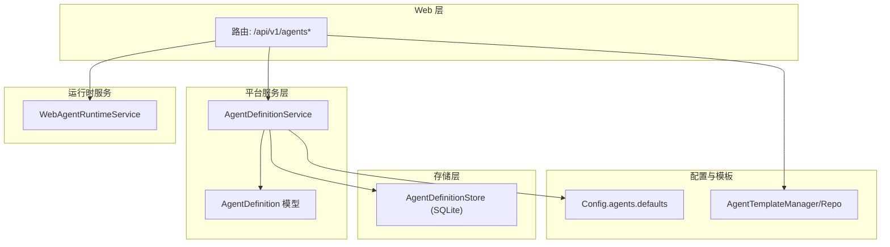
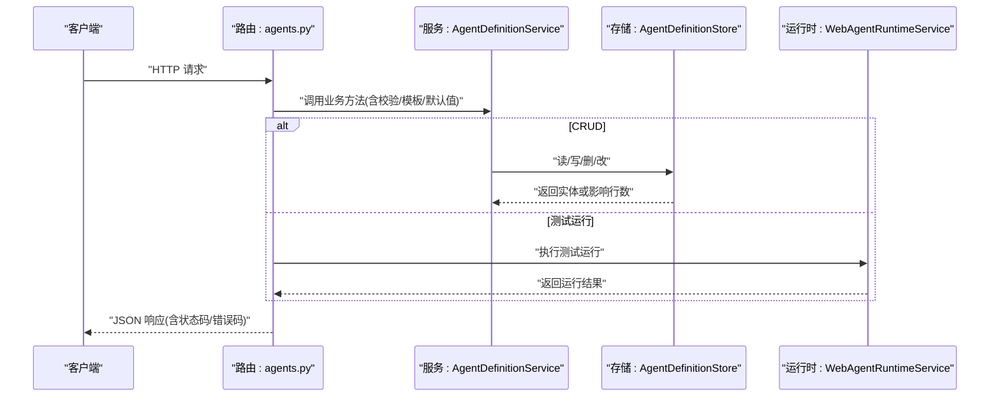
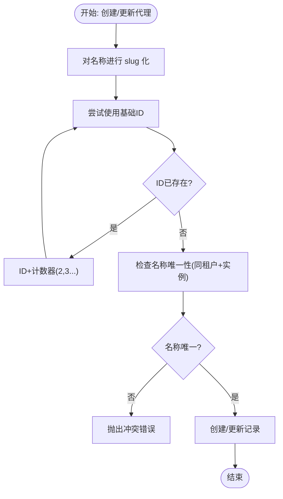
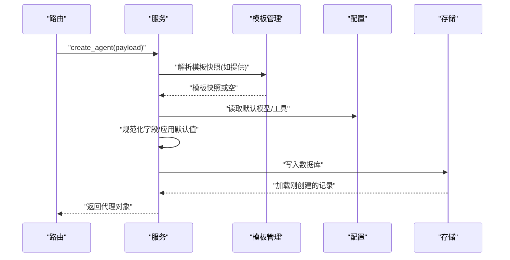
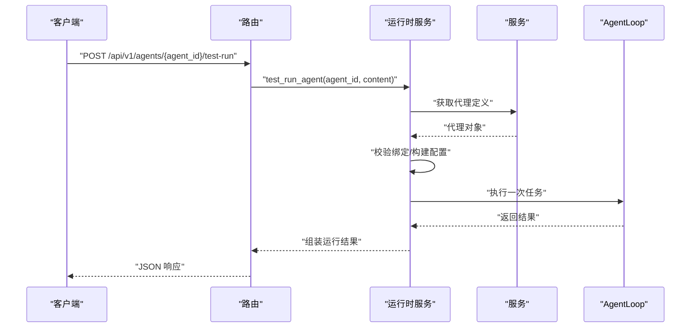
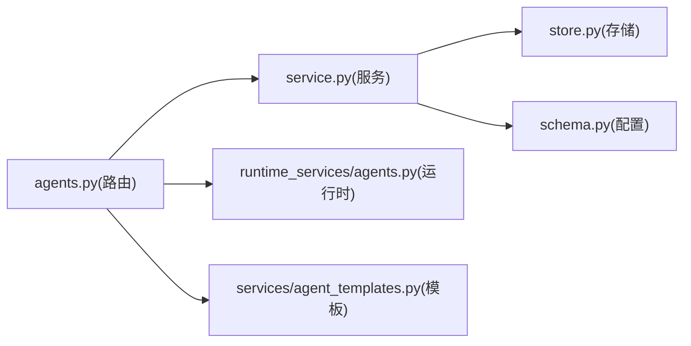

# 代理 CRUD 操作

<cite>
**本文引用的文件**
- [agents.py](file://nanobot/web/routers/agents.py)
- [service.py](file://nanobot/platform/agents/service.py)
- [store.py](file://nanobot/platform/agents/store.py)
- [models.py](file://nanobot/platform/agents/models.py)
- [agents.py](file://nanobot/web/runtime_services/agents.py)
- [schema.py](file://nanobot/config/schema.py)
- [agent_templates.py](file://nanobot/services/agent_templates.py)
- [agent_template_repository.py](file://nanobot/storage/agent_template_repository.py)
- [app.py](file://nanobot/web/app.py)
</cite>

## 目录
1. [简介](#简介)
2. [项目结构](#项目结构)
3. [核心组件](#核心组件)
4. [架构总览](#架构总览)
5. [详细组件分析](#详细组件分析)
6. [依赖分析](#依赖分析)
7. [性能考虑](#性能考虑)
8. [故障排除指南](#故障排除指南)
9. [结论](#结论)

## 简介
本文件面向使用 nanobot 的开发者与运维人员，系统化梳理“代理（Agent）”在协作控制平面中的 CRUD 能力与运行时测试能力，覆盖以下 REST 端点：
- 列表与查询：GET /api/v1/agents
- 创建：POST /api/v1/agents
- 读取：GET /api/v1/agents/{agent_id}
- 更新：PUT /api/v1/agents/{agent_id}
- 删除：DELETE /api/v1/agents/{agent_id}
- 复制：POST /api/v1/agents/{agent_id}/copy
- 启用/禁用：POST /api/v1/agents/{agent_id}/enable, POST /api/v1/agents/{agent_id}/disable
- 测试运行：POST /api/v1/agents/{agent_id}/test-run

同时，文档详细说明代理 ID 生成规则、唯一性约束、冲突处理机制，以及代理配置验证、模板应用与默认值设置流程，并给出关键数据模型与错误码。

## 项目结构
围绕代理的 API 层、服务层、存储层与运行时服务的组织如下：
- Web 路由层：定义 REST 端点与请求/响应包装
- 平台服务层：实现业务规则、校验、ID 生成与模板应用
- 存储层：基于 SQLite 的持久化
- 运行时服务：提供测试运行与会话管理
- 配置与模板：全局配置与代理模板仓库

**图表来源**
- [agents.py:43-162](file://nanobot/web/routers/agents.py#L43-L162)
- [service.py:30-404](file://nanobot/platform/agents/service.py#L30-L404)
- [store.py:12-206](file://nanobot/platform/agents/store.py#L12-L206)
- [models.py:15-109](file://nanobot/platform/agents/models.py#L15-L109)
- [agents.py:18-401](file://nanobot/web/runtime_services/agents.py#L18-L401)
- [schema.py:252-300](file://nanobot/config/schema.py#L252-L300)
- [agent_templates.py:207-342](file://nanobot/services/agent_templates.py#L207-L342)
- [agent_template_repository.py:13-205](file://nanobot/storage/agent_template_repository.py#L13-L205)

**章节来源**
- [agents.py:43-162](file://nanobot/web/routers/agents.py#L43-L162)
- [service.py:30-404](file://nanobot/platform/agents/service.py#L30-L404)
- [store.py:12-206](file://nanobot/platform/agents/store.py#L12-L206)
- [models.py:15-109](file://nanobot/platform/agents/models.py#L15-L109)
- [agents.py:18-401](file://nanobot/web/runtime_services/agents.py#L18-L401)
- [schema.py:252-300](file://nanobot/config/schema.py#L252-L300)
- [agent_templates.py:207-342](file://nanobot/services/agent_templates.py#L207-L342)
- [agent_template_repository.py:13-205](file://nanobot/storage/agent_template_repository.py#L13-L205)

## 核心组件
- 路由器与端点
  - 定义了代理列表、创建、读取、更新、删除、复制、启用/禁用、测试运行等端点
  - 统一通过 JSON 包装返回，并在异常时映射为标准错误码
- 服务层
  - 实现配置规范化、字段校验、ID 生成策略、名称唯一性检查、模板快照合并、更新补丁应用
- 存储层
  - 基于 SQLite 的表结构与索引，支持按租户与实例维度隔离
- 运行时服务
  - 提供测试运行、知识检索、绑定校验、会话与运行记录管理
- 配置与模板
  - 全局默认模型、工具目录、模板仓库与内置模板

**章节来源**
- [agents.py:43-162](file://nanobot/web/routers/agents.py#L43-L162)
- [service.py:30-404](file://nanobot/platform/agents/service.py#L30-L404)
- [store.py:12-206](file://nanobot/platform/agents/store.py#L12-L206)
- [agents.py:18-401](file://nanobot/web/runtime_services/agents.py#L18-L401)
- [schema.py:252-300](file://nanobot/config/schema.py#L252-L300)
- [agent_templates.py:207-342](file://nanobot/services/agent_templates.py#L207-L342)

## 架构总览
下图展示从 Web 请求到服务与存储的关键调用链路：

**图表来源**
- [agents.py:43-162](file://nanobot/web/routers/agents.py#L43-L162)
- [service.py:348-404](file://nanobot/platform/agents/service.py#L348-L404)
- [store.py:110-206](file://nanobot/platform/agents/store.py#L110-L206)
- [agents.py:362-401](file://nanobot/web/runtime_services/agents.py#L362-L401)

## 详细组件分析

### REST 端点与行为

- GET /api/v1/agents
  - 查询参数：enabled（可选）
  - 返回：代理列表（字典数组）
  - 错误：无特定错误码（成功时返回 200）

- POST /api/v1/agents
  - 请求体：代理配置对象（可选包含 templateName/template_name）
  - 行为：应用模板快照、填充默认模型与工具、规范化字段、生成唯一 ID、创建
  - 成功：201，响应体为新创建的代理对象
  - 可能错误：400（AGENT_VALIDATION_ERROR）、409（AGENT_CONFLICT）

- GET /api/v1/agents/{agent_id}
  - 行为：按 agent_id 与租户上下文读取代理
  - 成功：200，响应体为代理对象
  - 可能错误：404（AGENT_NOT_FOUND）

- PUT /api/v1/agents/{agent_id}
  - 请求体：部分字段更新补丁
  - 行为：规范化补丁、校验名称唯一性、应用补丁、更新
  - 成功：200，响应体为更新后的代理对象
  - 可能错误：400（AGENT_VALIDATION_ERROR）、404（AGENT_NOT_FOUND）、409（AGENT_CONFLICT）

- DELETE /api/v1/agents/{agent_id}
  - 行为：删除代理
  - 成功：200，响应体包含 deleted: true
  - 可能错误：404（AGENT_NOT_FOUND）

- POST /api/v1/agents/{agent_id}/copy
  - 请求体：可选目标名称
  - 行为：克隆现有代理，生成新名称与 ID，创建副本
  - 成功：201，响应体为克隆后的代理对象
  - 可能错误：400（AGENT_VALIDATION_ERROR）、404（AGENT_NOT_FOUND）、409（AGENT_CONFLICT）

- POST /api/v1/agents/{agent_id}/enable
  - 行为：设置 enabled=true
  - 成功：200，响应体为更新后的代理对象
  - 可能错误：404（AGENT_NOT_FOUND）

- POST /api/v1/agents/{agent_id}/disable
  - 行为：设置 enabled=false
  - 成功：200，响应体为更新后的代理对象
  - 可能错误：404（AGENT_NOT_FOUND）

- POST /api/v1/agents/{agent_id}/test-run
  - 请求体：{ content: string }
  - 行为：构建运行配置、校验绑定、执行一次测试运行、返回运行摘要与消息
  - 成功：200
  - 可能错误：400（AGENT_TEST_RUN_INVALID）、404（AGENT_NOT_FOUND）

**章节来源**
- [agents.py:43-162](file://nanobot/web/routers/agents.py#L43-L162)
- [agents.py:362-401](file://nanobot/web/runtime_services/agents.py#L362-L401)

### 数据模型与字段规范

- AgentDefinition 字段概览（关键字段）
  - agentId: 字符串，主键
  - tenantId: 字符串，租户标识
  - instanceId: 字符串，实例标识
  - name: 必填字符串
  - description: 字符串
  - systemPrompt: 必填字符串
  - rules: 字符串数组
  - model: 字符串（可空）
  - backend: 字符串（可空）
  - enabled: 布尔，默认 true
  - toolAllowlist: 字符串数组
  - mcpServerIds: 字符串数组
  - skillIds: 字符串数组
  - knowledgeBindingIds: 字符串数组
  - tags: 字符串数组
  - memoryScope: 字符串，默认 "agent_profile"
  - sourceTemplateName: 字符串（可空）
  - teamRoleHint: 字符串
  - maxExecutionTimeoutSeconds: 整数，默认 300，范围 10..3600
  - outputFormatHint: 字符串
  - createdAt/updatedAt: ISO 时间戳

- 字段规范化与默认值
  - 文本字段：去除首尾空白；必填字段缺失时报错
  - 数组字段：去重、过滤空项
  - 正整数字段：默认值、最小/最大范围校验
  - memoryScope：默认 "agent_profile"
  - model/backend：若未显式提供则回退到模板或全局默认

- 存储结构
  - 主键：agent_id
  - 索引：tenant_id+instance_id+updated_at DESC、enabled、name
  - 配置以 JSON 字符串形式存储

**章节来源**
- [models.py:15-109](file://nanobot/platform/agents/models.py#L15-L109)
- [service.py:120-242](file://nanobot/platform/agents/service.py#L120-L242)
- [store.py:15-34](file://nanobot/platform/agents/store.py#L15-L34)

### ID 生成规则、唯一性约束与冲突处理

- ID 生成
  - 名称 slug 化后作为基础 ID
  - 若冲突，追加 -2、-3…，确保唯一
- 名称唯一性
  - 同一租户+实例内，name 必须唯一
  - 更新时允许保留自身名称
- 冲突处理
  - 名称重复：抛出冲突错误
  - 无效工具/MCP/技能：抛出校验错误
  - 不存在的代理：抛出未找到错误

**图表来源**
- [service.py:103-118](file://nanobot/platform/agents/service.py#L103-L118)
- [service.py:93-101](file://nanobot/platform/agents/service.py#L93-L101)
- [store.py:58-83](file://nanobot/platform/agents/store.py#L58-L83)

**章节来源**
- [service.py:93-118](file://nanobot/platform/agents/service.py#L93-L118)
- [store.py:58-83](file://nanobot/platform/agents/store.py#L58-L83)

### 配置验证、模板应用与默认值设置

- 模板解析
  - 支持 templateName 或 template_name
  - 未指定模板时使用空快照
  - 模板不存在时返回 404
- 默认值来源
  - 默认模型：来自全局配置 agents.defaults.model
  - 默认工具：来自工作区模板工具目录
- 字段优先级
  - 显式 payload > 模板快照 > 默认值
- 校验规则
  - 必填字段缺失、数组类型错误、正整数越界、无效工具/MCP/技能等均触发 400

**图表来源**
- [agents.py:52-70](file://nanobot/web/routers/agents.py#L52-L70)
- [service.py:120-242](file://nanobot/platform/agents/service.py#L120-L242)
- [agent_templates.py:207-342](file://nanobot/services/agent_templates.py#L207-L342)
- [schema.py:252-300](file://nanobot/config/schema.py#L252-L300)

**章节来源**
- [agents.py:33-41](file://nanobot/web/routers/agents.py#L33-L41)
- [service.py:120-242](file://nanobot/platform/agents/service.py#L120-L242)
- [agent_templates.py:207-342](file://nanobot/services/agent_templates.py#L207-L342)
- [schema.py:252-300](file://nanobot/config/schema.py#L252-L300)

### 测试运行流程

- 输入：agent_id + content
- 校验：代理存在性、content 非空
- 绑定校验：工具、MCP、技能、知识绑定有效性
- 执行：构建运行配置，启动 AgentLoop，记录事件与产物
- 输出：运行记录、会话摘要、最后一条助手消息、消息列表、知识命中等

**图表来源**
- [agents.py:149-162](file://nanobot/web/routers/agents.py#L149-L162)
- [agents.py:362-401](file://nanobot/web/runtime_services/agents.py#L362-L401)

**章节来源**
- [agents.py:149-162](file://nanobot/web/routers/agents.py#L149-L162)
- [agents.py:82-116](file://nanobot/web/runtime_services/agents.py#L82-L116)
- [agents.py:158-361](file://nanobot/web/runtime_services/agents.py#L158-L361)

## 依赖分析

- 组件耦合
  - 路由器仅依赖服务层与运行时服务，职责清晰
  - 服务层依赖存储层与配置/模板资源，封装业务规则
  - 存储层与模型解耦，便于替换持久化介质
- 关键依赖链
  - 路由器 → 服务层 → 存储层
  - 路由器 → 运行时服务（测试运行）
  - 服务层 ← 配置与模板（默认值/工具目录/模板快照）

**图表来源**
- [agents.py:43-162](file://nanobot/web/routers/agents.py#L43-L162)
- [service.py:30-404](file://nanobot/platform/agents/service.py#L30-L404)
- [store.py:12-206](file://nanobot/platform/agents/store.py#L12-L206)
- [agents.py:18-401](file://nanobot/web/runtime_services/agents.py#L18-L401)
- [schema.py:252-300](file://nanobot/config/schema.py#L252-L300)
- [agent_templates.py:207-342](file://nanobot/services/agent_templates.py#L207-L342)

**章节来源**
- [app.py:83-107](file://nanobot/web/app.py#L83-L107)
- [agents.py:43-162](file://nanobot/web/routers/agents.py#L43-L162)
- [service.py:30-404](file://nanobot/platform/agents/service.py#L30-L404)
- [store.py:12-206](file://nanobot/platform/agents/store.py#L12-L206)
- [agents.py:18-401](file://nanobot/web/runtime_services/agents.py#L18-L401)
- [schema.py:252-300](file://nanobot/config/schema.py#L252-L300)
- [agent_templates.py:207-342](file://nanobot/services/agent_templates.py#L207-L342)

## 性能考虑
- 查询优化
  - 使用索引：tenant_id+instance_id+updated_at DESC、enabled、name
  - 列表查询按 enabled 与更新时间排序，有利于前端分页与筛选
- 写入优化
  - 单条插入/更新，事务内完成
  - 创建后立即回读，保证一致性
- 运行时测试
  - 采用会话与运行记录分离，避免阻塞主线程
  - 限制知识检索数量与消息截断，降低内存压力

[本节为通用建议，无需具体文件分析]

## 故障排除指南
- 常见错误码
  - 400 AGENT_VALIDATION_ERROR：字段类型/范围/必填不合法
  - 400 AGENT_TEST_RUN_INVALID：测试运行输入非法
  - 404 AGENT_NOT_FOUND：代理不存在
  - 404 AGENT_TEMPLATE_NOT_FOUND：模板不存在
  - 409 AGENT_CONFLICT：名称冲突或违反唯一性
- 排查步骤
  - 检查请求体字段是否符合规范（必填、类型、范围）
  - 确认模板名称是否存在且可用
  - 核对租户上下文与实例隔离
  - 查看运行时日志中绑定校验失败原因（工具/MCP/技能/知识）

**章节来源**
- [agents.py:66-69](file://nanobot/web/routers/agents.py#L66-L69)
- [agents.py:78-79](file://nanobot/web/routers/agents.py#L78-L79)
- [agents.py:117-125](file://nanobot/web/routers/agents.py#L117-L125)
- [agents.py:157-160](file://nanobot/web/routers/agents.py#L157-L160)
- [agents.py:82-116](file://nanobot/web/runtime_services/agents.py#L82-L116)

## 结论
本文档系统化梳理了代理 CRUD 与测试运行的完整生命周期，明确了端点语义、数据模型、ID 生成与唯一性约束、模板与默认值策略，以及错误处理与运行时行为。遵循这些规范可确保代理定义在多租户、多实例场景下的安全、一致与可维护性。