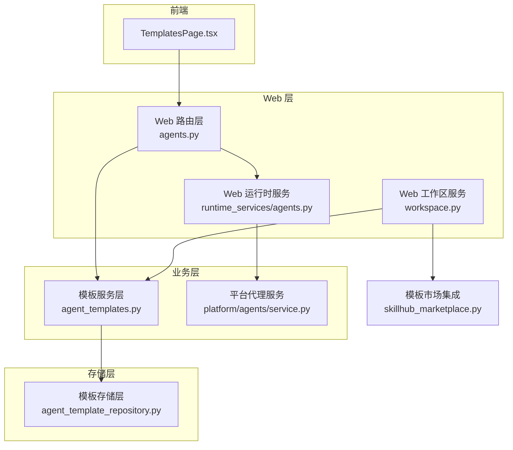
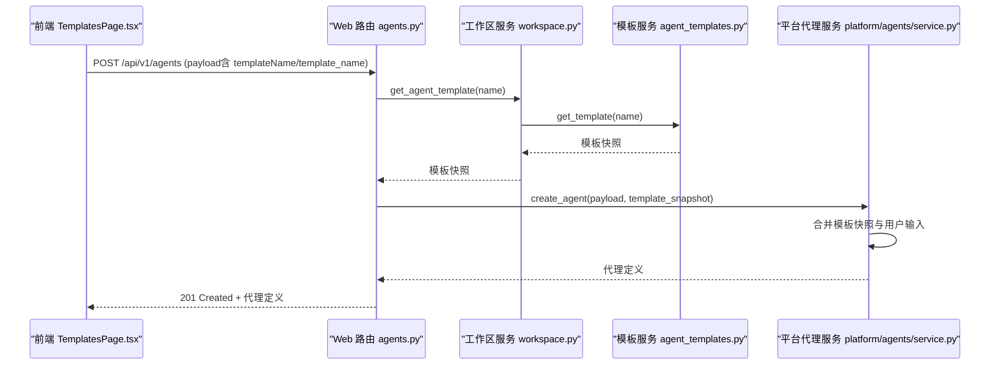
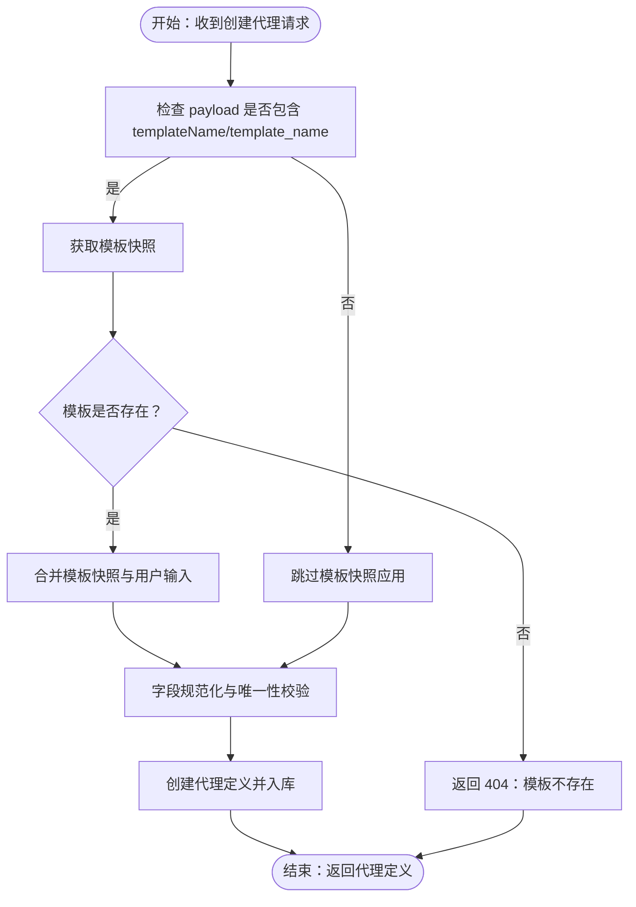
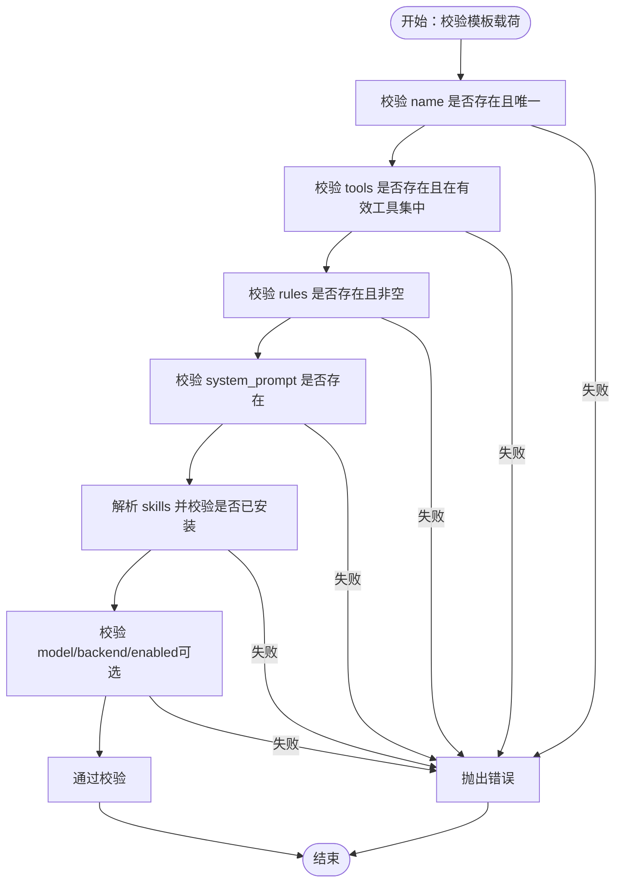
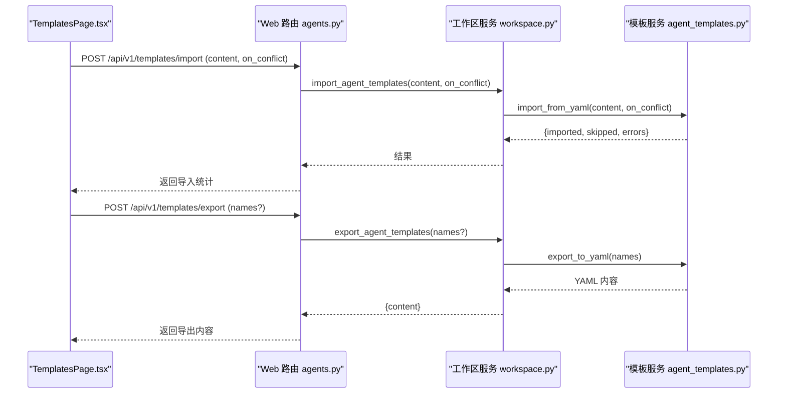
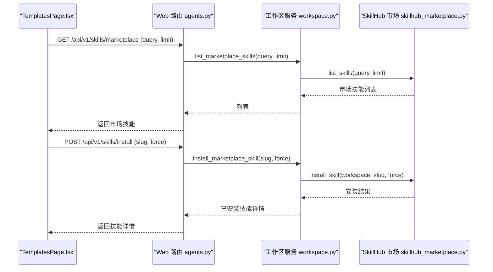
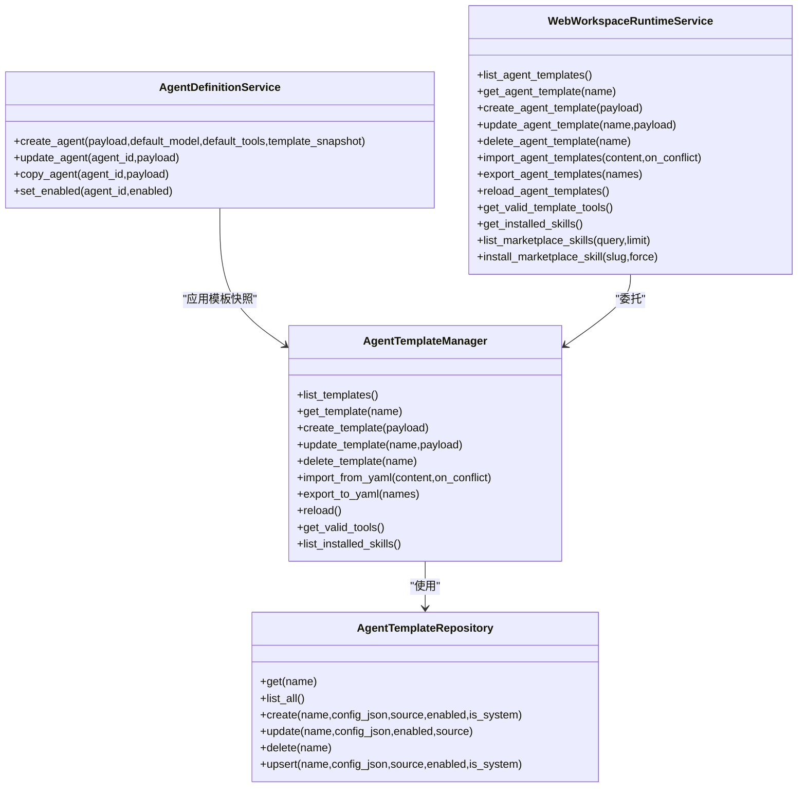

# 代理模板集成

<cite>
**本文引用的文件**
- [agent_templates.py](file://nanobot/services/agent_templates.py)
- [agent_template_repository.py](file://nanobot/storage/agent_template_repository.py)
- [agents.py](file://nanobot/web/routers/agents.py)
- [runtime_services/agents.py](file://nanobot/web/runtime_services/agents.py)
- [runtime.py](file://nanobot/web/runtime.py)
- [workspace.py](file://nanobot/web/runtime_services/workspace.py)
- [platform/agents/service.py](file://nanobot/platform/agents/service.py)
- [TemplatesPage.tsx](file://web-ui/src/pages/TemplatesPage.tsx)
- [skillhub_marketplace.py](file://nanobot/services/skillhub_marketplace.py)
</cite>

## 目录
1. [简介](#简介)
2. [项目结构](#项目结构)
3. [核心组件](#核心组件)
4. [架构总览](#架构总览)
5. [详细组件分析](#详细组件分析)
6. [依赖关系分析](#依赖关系分析)
7. [性能考虑](#性能考虑)
8. [故障排查指南](#故障排查指南)
9. [结论](#结论)
10. [附录](#附录)

## 简介
本文件面向“代理模板集成”的 API 文档需求，系统化阐述模板名称解析、模板快照应用、模板验证机制，以及 templateName 参数的使用方式与模板优先级规则。同时涵盖模板仓库管理、模板版本控制、模板继承、模板导入导出、模板共享与模板市场集成等能力，并通过可视化图示帮助读者快速理解各模块之间的交互关系。

## 项目结构
该系统围绕“模板服务层”“模板存储层”“Web 路由层”“运行时服务层”“前端页面”五大层次构建：
- 模板服务层：负责模板的增删改查、导入导出、校验与工具/技能解析。
- 模板存储层：基于 SQLite 的持久化存储，支持 upsert、查询与索引。
- Web 路由层：暴露 REST API，解析 templateName 并应用模板快照。
- 运行时服务层：在创建/测试代理时应用模板快照，进行绑定校验与运行。
- 前端页面：提供模板管理界面、导入导出与冲突策略选择。

图表来源
- [agents.py:33-41](file://nanobot/web/routers/agents.py#L33-L41)
- [runtime_services/agents.py:158-361](file://nanobot/web/runtime_services/agents.py#L158-L361)
- [workspace.py:68-111](file://nanobot/web/runtime_services/workspace.py#L68-L111)
- [agent_templates.py:207-264](file://nanobot/services/agent_templates.py#L207-L264)
- [agent_template_repository.py:13-51](file://nanobot/storage/agent_template_repository.py#L13-L51)
- [platform/agents/service.py:120-242](file://nanobot/platform/agents/service.py#L120-L242)
- [skillhub_marketplace.py:87-141](file://nanobot/services/skillhub_marketplace.py#L87-L141)

章节来源
- [agents.py:1-162](file://nanobot/web/routers/agents.py#L1-L162)
- [runtime.py:72-301](file://nanobot/web/runtime.py#L72-L301)
- [workspace.py:21-344](file://nanobot/web/runtime_services/workspace.py#L21-L344)
- [agent_templates.py:1-566](file://nanobot/services/agent_templates.py#L1-L566)
- [agent_template_repository.py:1-205](file://nanobot/storage/agent_template_repository.py#L1-L205)
- [platform/agents/service.py:1-404](file://nanobot/platform/agents/service.py#L1-L404)
- [TemplatesPage.tsx:1-606](file://web-ui/src/pages/TemplatesPage.tsx#L1-L606)
- [skillhub_marketplace.py:1-465](file://nanobot/services/skillhub_marketplace.py#L1-L465)

## 核心组件
- 模板服务层（AgentTemplateManager）
  - 提供模板的创建、更新、删除、查询、导入导出、工具与技能解析、内置模板初始化等能力。
  - 支持模板冲突处理策略（跳过、重命名、替换），并保证内置模板不可被替换。
- 模板存储层（AgentTemplateRepository）
  - 基于 SQLite 的持久化，提供 upsert、查询、索引与事务一致性保障。
- Web 路由层（agents.py）
  - 解析请求中的 templateName 参数，调用模板服务获取模板快照并应用到代理定义创建流程。
- 运行时服务层（WebAgentRuntimeService）
  - 在测试运行或实际运行时，对代理绑定进行校验，组装系统提示词与知识检索片段，驱动 AgentLoop 执行。
- 工作区服务层（WebWorkspaceRuntimeService）
  - 对外暴露模板列表、模板详情、导入导出、工具与技能查询、模板市场集成等接口。
- 平台代理服务层（AgentDefinitionService）
  - 将模板快照与用户输入合并，生成最终的代理定义，处理字段规范化与唯一性约束。

章节来源
- [agent_templates.py:207-566](file://nanobot/services/agent_templates.py#L207-L566)
- [agent_template_repository.py:13-205](file://nanobot/storage/agent_template_repository.py#L13-L205)
- [agents.py:33-70](file://nanobot/web/routers/agents.py#L33-L70)
- [runtime_services/agents.py:158-361](file://nanobot/web/runtime_services/agents.py#L158-L361)
- [workspace.py:68-140](file://nanobot/web/runtime_services/workspace.py#L68-L140)
- [platform/agents/service.py:120-242](file://nanobot/platform/agents/service.py#L120-L242)

## 架构总览
模板从“模板服务层”进入“平台代理服务层”，在创建代理时应用模板快照；运行时通过“运行时服务层”对工具、MCP、技能、知识绑定进行校验并执行任务。

图表来源
- [agents.py:52-70](file://nanobot/web/routers/agents.py#L52-L70)
- [workspace.py:68-74](file://nanobot/web/runtime_services/workspace.py#L68-L74)
- [agent_templates.py:269-271](file://nanobot/services/agent_templates.py#L269-L271)
- [platform/agents/service.py:348-364](file://nanobot/platform/agents/service.py#L348-L364)

## 详细组件分析

### 模板名称解析与模板快照应用
- 名称解析
  - Web 路由层在创建代理时，从请求负载中提取 templateName 或 template_name 字段，若为空则不应用模板快照。
  - 若名称存在，调用工作区服务获取模板快照；若模板不存在，返回 404 错误。
- 快照应用
  - 平台代理服务在标准化代理定义时，优先使用模板快照中的字段（如 name、description、system_prompt、rules、tools、skills、model、backend 等），若用户显式传入则覆盖。
  - 默认工具集来自运行时提供的工具目录，若模板未指定工具，则回退到默认工具集。

图表来源
- [agents.py:33-41](file://nanobot/web/routers/agents.py#L33-L41)
- [workspace.py:68-74](file://nanobot/web/runtime_services/workspace.py#L68-L74)
- [platform/agents/service.py:120-242](file://nanobot/platform/agents/service.py#L120-L242)

章节来源
- [agents.py:33-70](file://nanobot/web/routers/agents.py#L33-L70)
- [platform/agents/service.py:120-242](file://nanobot/platform/agents/service.py#L120-L242)

### 模板验证机制
- 字段校验
  - name：必填且唯一；若为空或重复，抛出错误。
  - tools：必填且非空；必须属于有效工具集合；去重与清洗。
  - rules：必填且非空；去重与清洗。
  - system_prompt：必填；用于生成系统提示词。
  - skills/model/backend/enabled：可选，支持从模板快照或默认值继承。
- 工具与技能解析
  - 有效工具集来源于运行时工具目录；模板中工具名需在有效集合内。
  - 技能列表通过工作区服务解析已安装技能，确保引用合法。
- 冲突处理
  - 导入模板时支持三种策略：skip（跳过）、rename（重命名）、replace（替换）。
  - 内置模板不可被替换；重复名称时根据策略决定处理方式。

图表来源
- [agent_templates.py:471-540](file://nanobot/services/agent_templates.py#L471-L540)
- [workspace.py:118-121](file://nanobot/web/runtime_services/workspace.py#L118-L121)

章节来源
- [agent_templates.py:471-566](file://nanobot/services/agent_templates.py#L471-L566)
- [workspace.py:118-121](file://nanobot/web/runtime_services/workspace.py#L118-L121)

### 模板优先级规则
- 字段优先级（创建代理时）
  - 用户显式传入字段 > 模板快照字段 > 默认值（如默认模型、默认工具集）。
- 工具优先级
  - 模板快照中的工具列表优先；若未提供，则使用运行时默认工具集。
- 技能优先级
  - 模板快照中的技能列表优先；若未提供，则为空列表。
- 其他字段优先级
  - model/backend/source_template_name/memory_scope 等均可由模板快照或默认值填充。

章节来源
- [platform/agents/service.py:120-242](file://nanobot/platform/agents/service.py#L120-L242)

### 模板仓库管理与版本控制
- 仓库管理
  - 模板以 JSON 形式存储在 SQLite 表中，包含 name、source、config_json、enabled、is_system、created_at、updated_at 等字段。
  - 支持 upsert、查询、索引（按 source、is_system 排序）。
- 版本控制
  - 通过 created_at/updated_at 字段记录时间戳，便于审计与追踪。
  - 内置模板标记为 is_system，用户模板标记为 user；列表时按 is_system、enabled、name 排序。

章节来源
- [agent_template_repository.py:16-77](file://nanobot/storage/agent_template_repository.py#L16-L77)

### 模板继承
- 继承方式
  - 模板快照作为“基线”，用户输入作为“覆盖层”。平台代理服务在标准化阶段完成合并。
- 继承范围
  - 包括 name、description、system_prompt、rules、tools、skills、model、backend 等字段。
- 继承边界
  - 内置模板不可被替换；工具与技能必须在有效集合内。

章节来源
- [platform/agents/service.py:120-242](file://nanobot/platform/agents/service.py#L120-L242)
- [agent_templates.py:231-255](file://nanobot/services/agent_templates.py#L231-L255)

### 模板导入导出
- 导入
  - 支持 YAML 格式，顶层包含 agents 数组；每个条目为模板对象。
  - 冲突策略：skip（跳过）、rename（重命名）、replace（替换）。
  - 返回导入统计：imported（创建/替换）、skipped（跳过）、errors（错误列表）。
- 导出
  - 支持导出指定模板或全部模板；输出为 YAML，包含版本与导出时间戳。
- 前端交互
  - TemplatesPage.tsx 提供导入/导出 UI，支持冲突策略选择与结果展示。

图表来源
- [agents.py:9-17](file://nanobot/web/routers/agents.py#L9-L17)
- [workspace.py:98-106](file://nanobot/web/runtime_services/workspace.py#L98-L106)
- [agent_templates.py:358-431](file://nanobot/services/agent_templates.py#L358-L431)
- [TemplatesPage.tsx:292-315](file://web-ui/src/pages/TemplatesPage.tsx#L292-L315)

章节来源
- [agent_templates.py:358-431](file://nanobot/services/agent_templates.py#L358-L431)
- [workspace.py:98-106](file://nanobot/web/runtime_services/workspace.py#L98-L106)
- [TemplatesPage.tsx:278-315](file://web-ui/src/pages/TemplatesPage.tsx#L278-L315)

### 模板共享与模板市场集成
- 模板共享
  - 通过导入导出 YAML 实现跨工作区共享；内置模板不可被替换，避免破坏系统稳定性。
- 模板市场集成
  - 工作区服务封装 SkillHub 市场客户端，支持列出、搜索、安装技能。
  - 安装流程：下载 ZIP -> 校验 -> 解压 -> 复制到工作区 skills 目录 -> 重新加载技能。
  - 兼容性检测：对技能包进行内容扫描，标注 native/partial/unsupported，并给出原因摘要。

图表来源
- [workspace.py:123-139](file://nanobot/web/runtime_services/workspace.py#L123-L139)
- [skillhub_marketplace.py:106-140](file://nanobot/services/skillhub_marketplace.py#L106-L140)
- [skillhub_marketplace.py:142-161](file://nanobot/services/skillhub_marketplace.py#L142-L161)

章节来源
- [workspace.py:123-139](file://nanobot/web/runtime_services/workspace.py#L123-L139)
- [skillhub_marketplace.py:106-161](file://nanobot/services/skillhub_marketplace.py#L106-L161)

## 依赖关系分析

图表来源
- [agent_templates.py:207-566](file://nanobot/services/agent_templates.py#L207-L566)
- [agent_template_repository.py:13-205](file://nanobot/storage/agent_template_repository.py#L13-L205)
- [platform/agents/service.py:30-404](file://nanobot/platform/agents/service.py#L30-L404)
- [workspace.py:60-140](file://nanobot/web/runtime_services/workspace.py#L60-L140)

章节来源
- [agent_templates.py:207-566](file://nanobot/services/agent_templates.py#L207-L566)
- [agent_template_repository.py:13-205](file://nanobot/storage/agent_template_repository.py#L13-L205)
- [platform/agents/service.py:30-404](file://nanobot/platform/agents/service.py#L30-L404)
- [workspace.py:60-140](file://nanobot/web/runtime_services/workspace.py#L60-L140)

## 性能考虑
- 数据库访问
  - 使用索引（source、is_system）提升查询效率；批量操作建议合并事务。
- 模板加载
  - 模板列表按 is_system、enabled、name 排序，减少前端渲染负担。
- 导入导出
  - YAML 解析与模板遍历为 O(n)；建议限制单次导入模板数量并提供进度反馈。
- 运行时校验
  - 工具/技能/知识绑定校验在运行前完成，避免无效运行开销。

## 故障排查指南
- 模板名称解析
  - 若返回 404，请确认 templateName/template_name 是否正确，以及模板是否存在于工作区。
- 模板验证失败
  - 常见原因：tools/rules/system_prompt 缺失或不在有效集合内；skills 未安装；name 重复。
- 导入冲突
  - 根据 on_conflict 策略调整；内置模板不可替换。
- 运行时绑定错误
  - 工具名无效、MCP 服务器缺失或禁用、技能 ID 不存在、知识绑定未解析等。

章节来源
- [agents.py:33-41](file://nanobot/web/routers/agents.py#L33-L41)
- [runtime_services/agents.py:82-116](file://nanobot/web/runtime_services/agents.py#L82-L116)
- [agent_templates.py:471-540](file://nanobot/services/agent_templates.py#L471-L540)

## 结论
本系统通过“模板快照 + 字段优先级 + 绑定校验”的机制，实现了灵活而稳定的代理模板体系。模板服务层与工作区服务层清晰分离职责，Web 路由层与运行时服务层分别承担“应用模板”和“执行任务”的关键环节。配合导入导出与模板市场集成，用户可在本地与云端之间高效流转模板与技能，满足从开发到生产的全链路需求。

## 附录

### API 规范概览
- 创建代理（应用模板快照）
  - 方法：POST
  - 路径：/api/v1/agents
  - 请求体：包含 templateName 或 template_name 时，将应用对应模板快照
  - 成功响应：201，返回代理定义
- 获取模板详情
  - 方法：GET
  - 路径：/api/v1/templates/{name}
  - 成功响应：200，返回模板详情
- 导入模板
  - 方法：POST
  - 路径：/api/v1/templates/import
  - 请求体：content（YAML）、on_conflict（skip/rename/replace）
  - 成功响应：200，返回导入统计
- 导出模板
  - 方法：POST
  - 路径：/api/v1/templates/export
  - 请求体：names（可选）
  - 成功响应：200，返回 YAML 内容
- 列出模板
  - 方法：GET
  - 路径：/api/v1/templates
  - 查询参数：enabled（可选）
  - 成功响应：200，返回模板列表

章节来源
- [agents.py:43-162](file://nanobot/web/routers/agents.py#L43-L162)
- [workspace.py:60-111](file://nanobot/web/runtime_services/workspace.py#L60-L111)
- [TemplatesPage.tsx:278-315](file://web-ui/src/pages/TemplatesPage.tsx#L278-L315)