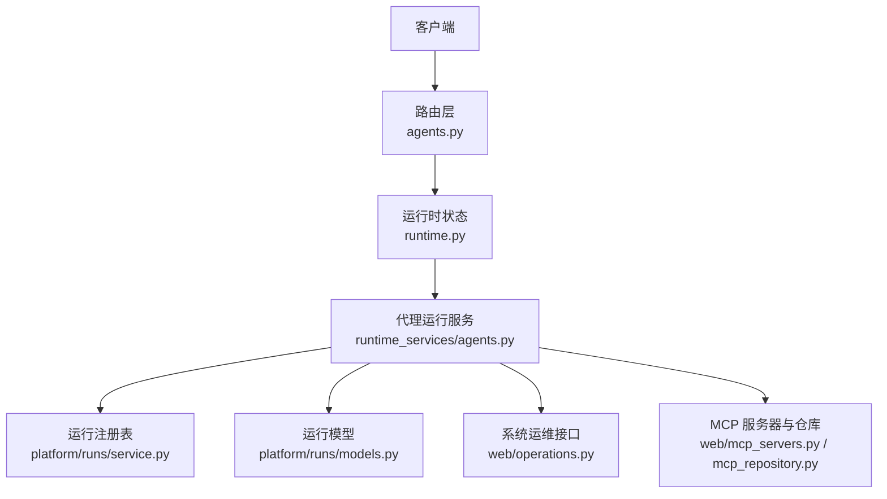
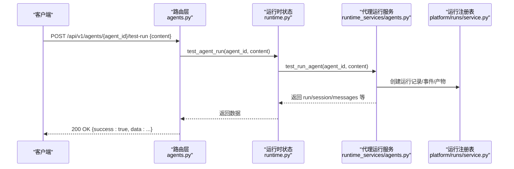
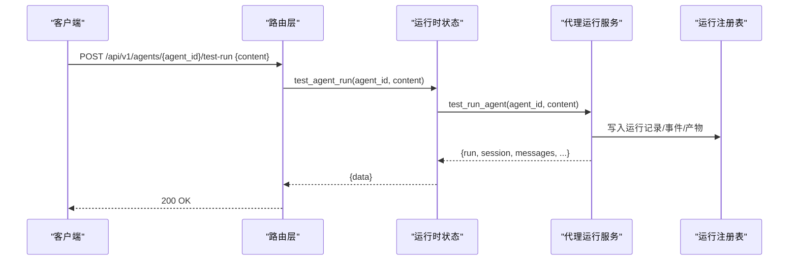
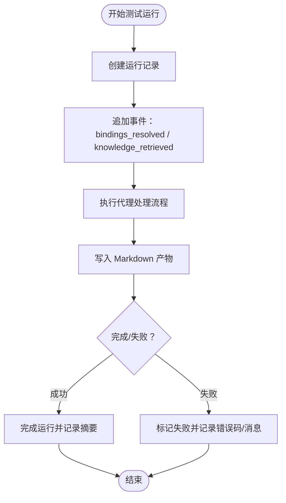
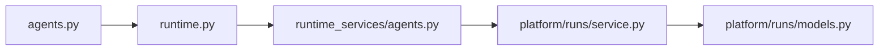

# 代理测试与调试

<cite>
**本文引用的文件**
- [nanobot/web/routers/agents.py](file://nanobot/web/routers/agents.py)
- [nanobot/web/runtime_services/agents.py](file://nanobot/web/runtime_services/agents.py)
- [nanobot/web/runtime.py](file://nanobot/web/runtime.py)
- [nanobot/web/http.py](file://nanobot/web/http.py)
- [nanobot/platform/runs/models.py](file://nanobot/platform/runs/models.py)
- [nanobot/platform/runs/service.py](file://nanobot/platform/runs/service.py)
- [tests/test_web_api.py](file://tests/test_web_api.py)
- [nanobot/web/operations.py](file://nanobot/web/operations.py)
- [nanobot/web/mcp_servers.py](file://nanobot/web/mcp_servers.py)
- [nanobot/web/mcp_repository.py](file://nanobot/web/mcp_repository.py)
- [tests/test_tool_validation.py](file://tests/test_tool_validation.py)
</cite>

## 目录
1. [简介](#简介)
2. [项目结构](#项目结构)
3. [核心组件](#核心组件)
4. [架构总览](#架构总览)
5. [详细组件分析](#详细组件分析)
6. [依赖分析](#依赖分析)
7. [性能考虑](#性能考虑)
8. [故障排查指南](#故障排查指南)
9. [结论](#结论)
10. [附录](#附录)

## 简介
本文件面向代理测试与调试场景，聚焦于 /api/v1/agents/{agent_id}/test-run 端点的使用方法与实现细节，涵盖：
- 测试运行请求格式与响应结构
- 调试信息与运行产物（运行记录、会话、知识检索、绑定信息）
- 代理行为验证、工具调用测试与错误诊断
- 测试环境配置、模拟数据准备与结果分析
- 安全限制与性能考量

## 项目结构
围绕测试运行功能的关键模块如下：
- 路由层：定义 /api/v1/agents/{agent_id}/test-run 的请求解析与错误映射
- 运行服务层：执行测试运行、构建运行记录、会话与知识检索、工具与技能绑定校验
- 运行时状态：统一调度与上下文管理
- 运行注册表：运行生命周期、事件、产物存储与查询
- 测试用例：覆盖成功路径、知识检索、绑定解析、产物生成与运行列表

**图表来源**
- [nanobot/web/routers/agents.py:149-161](file://nanobot/web/routers/agents.py#L149-L161)
- [nanobot/web/runtime.py:232-233](file://nanobot/web/runtime.py#L232-L233)
- [nanobot/web/runtime_services/agents.py:362-400](file://nanobot/web/runtime_services/agents.py#L362-L400)
- [nanobot/platform/runs/service.py:1-73](file://nanobot/platform/runs/service.py#L1-L73)
- [nanobot/platform/runs/models.py:16-161](file://nanobot/platform/runs/models.py#L16-L161)
- [nanobot/web/operations.py:44-71](file://nanobot/web/operations.py#L44-L71)
- [nanobot/web/mcp_servers.py:468-501](file://nanobot/web/mcp_servers.py#L468-L501)
- [nanobot/web/mcp_repository.py:507-542](file://nanobot/web/mcp_repository.py#L507-L542)

**章节来源**
- [nanobot/web/routers/agents.py:149-161](file://nanobot/web/routers/agents.py#L149-L161)
- [nanobot/web/runtime.py:232-233](file://nanobot/web/runtime.py#L232-L233)
- [nanobot/web/runtime_services/agents.py:362-400](file://nanobot/web/runtime_services/agents.py#L362-L400)
- [nanobot/platform/runs/service.py:1-73](file://nanobot/platform/runs/service.py#L1-L73)
- [nanobot/platform/runs/models.py:16-161](file://nanobot/platform/runs/models.py#L16-L161)
- [nanobot/web/operations.py:44-71](file://nanobot/web/operations.py#L44-L71)
- [nanobot/web/mcp_servers.py:468-501](file://nanobot/web/mcp_servers.py#L468-L501)
- [nanobot/web/mcp_repository.py:507-542](file://nanobot/web/mcp_repository.py#L507-L542)

## 核心组件
- 测试运行端点
  - 方法与路径：POST /api/v1/agents/{agent_id}/test-run
  - 请求体：包含 content 字段（字符串），用于触发代理测试
  - 响应：包含 run、session、assistantMessage、messages、pendingKnowledgeBindings、knowledgeHits、appliedBindings 等字段
- 运行服务
  - 执行测试运行，创建运行记录、写入 Markdown 产物、记录进度事件
  - 校验代理绑定（工具、MCP、技能、知识绑定）并生成调试信息
- 运行注册表
  - 维护运行生命周期、事件、产物文件与元数据
- 错误处理
  - 未找到代理：404
  - 参数无效：400
  - 运行异常：标记为失败并记录错误码与消息

**章节来源**
- [nanobot/web/routers/agents.py:22-24](file://nanobot/web/routers/agents.py#L22-L24)
- [nanobot/web/routers/agents.py:149-161](file://nanobot/web/routers/agents.py#L149-L161)
- [nanobot/web/runtime_services/agents.py:362-400](file://nanobot/web/runtime_services/agents.py#L362-L400)
- [nanobot/platform/runs/service.py:161-182](file://nanobot/platform/runs/service.py#L161-L182)
- [nanobot/web/http.py:31-40](file://nanobot/web/http.py#L31-L40)

## 架构总览
下图展示从客户端到运行服务与运行注册表的调用链路。

**图表来源**
- [nanobot/web/routers/agents.py:149-161](file://nanobot/web/routers/agents.py#L149-L161)
- [nanobot/web/runtime.py:232-233](file://nanobot/web/runtime.py#L232-L233)
- [nanobot/web/runtime_services/agents.py:362-400](file://nanobot/web/runtime_services/agents.py#L362-L400)
- [nanobot/platform/runs/service.py:203-257](file://nanobot/platform/runs/service.py#L203-L257)

## 详细组件分析

### /api/v1/agents/{agent_id}/test-run 端点
- 请求
  - 路径参数：agent_id（字符串）
  - 请求体：AgentTestRunRequest，包含 content（字符串）
- 处理流程
  - 路由层解析请求并调用运行时状态的 test_agent_run
  - 运行时状态委托给代理运行服务执行测试运行
  - 代理运行服务创建运行记录、会话、知识检索与绑定校验，并生成 Markdown 产物
- 响应
  - 成功：200 OK，data 包含 run、session、assistantMessage、messages、pendingKnowledgeBindings、knowledgeHits、appliedBindings
  - 失败：404（代理不存在）、400（参数无效）、内部错误时由运行注册表标记失败并返回错误摘要

**图表来源**
- [nanobot/web/routers/agents.py:149-161](file://nanobot/web/routers/agents.py#L149-L161)
- [nanobot/web/runtime.py:232-233](file://nanobot/web/runtime.py#L232-L233)
- [nanobot/web/runtime_services/agents.py:362-400](file://nanobot/web/runtime_services/agents.py#L362-L400)
- [nanobot/platform/runs/service.py:203-257](file://nanobot/platform/runs/service.py#L203-L257)

**章节来源**
- [nanobot/web/routers/agents.py:22-24](file://nanobot/web/routers/agents.py#L22-L24)
- [nanobot/web/routers/agents.py:149-161](file://nanobot/web/routers/agents.py#L149-L161)
- [nanobot/web/runtime.py:232-233](file://nanobot/web/runtime.py#L232-L233)
- [nanobot/web/runtime_services/agents.py:362-400](file://nanobot/web/runtime_services/agents.py#L362-L400)
- [nanobot/platform/runs/service.py:203-257](file://nanobot/platform/runs/service.py#L203-L257)

### 运行服务与运行注册表
- 运行服务职责
  - 创建运行记录、追加事件（如 bindings_resolved、knowledge_retrieved）、写入 Markdown 产物、完成/失败/取消运行
  - 记录进度事件数量、知识命中数等元数据
- 运行注册表职责
  - 维护运行生命周期与状态转换
  - 提供产物读取与校验（路径解析与存在性检查）

**图表来源**
- [nanobot/web/runtime_services/agents.py:200-333](file://nanobot/web/runtime_services/agents.py#L200-L333)
- [nanobot/platform/runs/service.py:161-182](file://nanobot/platform/runs/service.py#L161-L182)
- [nanobot/platform/runs/service.py:203-257](file://nanobot/platform/runs/service.py#L203-L257)

**章节来源**
- [nanobot/web/runtime_services/agents.py:200-333](file://nanobot/web/runtime_services/agents.py#L200-L333)
- [nanobot/platform/runs/service.py:161-182](file://nanobot/platform/runs/service.py#L161-L182)
- [nanobot/platform/runs/service.py:203-257](file://nanobot/platform/runs/service.py#L203-L257)

### 绑定校验与调试信息
- 工具与技能校验
  - 校验工具名称是否在模板工具清单中
  - 校验技能名称是否存在于工作区技能目录
- MCP 服务器校验
  - 校验代理引用的 MCP 服务器是否存在且启用
- 知识绑定
  - 按代理知识绑定 ID 检索相关知识片段，生成提示块
- 调试输出
  - appliedBindings：实际应用的工具、MCP、技能、知识绑定
  - knowledgeHits：检索到的知识片段
  - pendingKnowledgeBindings：代理声明但尚未解析的知识绑定

**章节来源**
- [nanobot/web/runtime_services/agents.py:82-116](file://nanobot/web/runtime_services/agents.py#L82-L116)
- [nanobot/web/runtime_services/agents.py:74-81](file://nanobot/web/runtime_services/agents.py#L74-L81)
- [nanobot/web/runtime_services/agents.py:118-143](file://nanobot/web/runtime_services/agents.py#L118-L143)

### 错误处理与诊断
- 代理不存在：404，错误码 AGENT_NOT_FOUND
- 参数无效：400，错误码 AGENT_TEST_RUN_INVALID
- 运行失败：运行注册表写入失败事件，包含错误码与消息
- 系统验证与运维
  - 提供系统验证与日志查询接口，辅助诊断运行时问题

**章节来源**
- [nanobot/web/routers/agents.py:157-160](file://nanobot/web/routers/agents.py#L157-L160)
- [nanobot/platform/runs/service.py:161-182](file://nanobot/platform/runs/service.py#L161-L182)
- [nanobot/web/operations.py:44-71](file://nanobot/web/operations.py#L44-L71)

## 依赖分析
- 路由层依赖运行时状态进行测试运行
- 运行时状态依赖代理运行服务执行具体逻辑
- 代理运行服务依赖运行注册表维护运行生命周期与产物
- 运行注册表依赖运行模型定义运行状态、事件与记录结构

**图表来源**
- [nanobot/web/routers/agents.py:149-161](file://nanobot/web/routers/agents.py#L149-L161)
- [nanobot/web/runtime.py:232-233](file://nanobot/web/runtime.py#L232-L233)
- [nanobot/web/runtime_services/agents.py:362-400](file://nanobot/web/runtime_services/agents.py#L362-L400)
- [nanobot/platform/runs/service.py:1-73](file://nanobot/platform/runs/service.py#L1-L73)
- [nanobot/platform/runs/models.py:16-161](file://nanobot/platform/runs/models.py#L16-L161)

**章节来源**
- [nanobot/web/routers/agents.py:149-161](file://nanobot/web/routers/agents.py#L149-L161)
- [nanobot/web/runtime.py:232-233](file://nanobot/web/runtime.py#L232-L233)
- [nanobot/web/runtime_services/agents.py:362-400](file://nanobot/web/runtime_services/agents.py#L362-L400)
- [nanobot/platform/runs/service.py:1-73](file://nanobot/platform/runs/service.py#L1-L73)
- [nanobot/platform/runs/models.py:16-161](file://nanobot/platform/runs/models.py#L16-L161)

## 性能考虑
- 运行限制
  - 全局并发上限、每会话并发上限、子运行数量上限、最大派生深度等
- 资源隔离
  - 可选的工作区限制与工具执行保护，避免越权操作
- 产物与事件
  - 产物为纯文本 Markdown，便于快速检索与审计；事件按需截断以控制内存占用

**章节来源**
- [nanobot/platform/runs/models.py:84-91](file://nanobot/platform/runs/models.py#L84-L91)
- [tests/test_tool_validation.py:131-134](file://tests/test_tool_validation.py#L131-L134)

## 故障排查指南
- 代理不存在
  - 现象：404 AGENT_NOT_FOUND
  - 排查：确认 agent_id 是否正确，代理是否已创建
- 参数无效
  - 现象：400 AGENT_TEST_RUN_INVALID
  - 排查：检查 content 是否为空或格式不合法
- 运行失败
  - 现象：运行状态为 failed，记录包含错误码与消息
  - 排查：查看运行事件中的 failed 事件详情，核对绑定与知识检索结果
- 绑定问题
  - 工具/技能/知识绑定无效：检查模板工具清单、技能目录与知识库绑定
  - MCP 服务器未启用：检查 MCP 配置与状态
- 产物缺失
  - 现象：运行记录无 artifactPath 或读取失败
  - 排查：确认产物目录配置与权限，检查产物文件是否存在

**章节来源**
- [nanobot/web/routers/agents.py:157-160](file://nanobot/web/routers/agents.py#L157-L160)
- [nanobot/platform/runs/service.py:161-182](file://nanobot/platform/runs/service.py#L161-L182)
- [nanobot/web/mcp_servers.py:468-501](file://nanobot/web/mcp_servers.py#L468-L501)
- [nanobot/web/mcp_repository.py:507-542](file://nanobot/web/mcp_repository.py#L507-L542)

## 结论
- /api/v1/agents/{agent_id}/test-run 提供了完整的代理测试能力，覆盖运行生命周期、知识检索、绑定校验与产物生成
- 通过运行事件与产物，用户可进行行为验证、工具调用测试与错误诊断
- 在生产环境中，建议结合系统验证与运维接口，持续监控运行健康度与资源使用情况

## 附录

### API 定义与示例

- 端点
  - 方法：POST
  - 路径：/api/v1/agents/{agent_id}/test-run
  - 路径参数：agent_id（字符串）
  - 请求体：AgentTestRunRequest
    - content（字符串）：测试任务内容
  - 响应体：标准响应包，data 字段包含以下键
    - run：运行记录（含 runId、kind、status、artifactPath、events 等）
    - session：会话摘要（含 id、title、messageCount 等）
    - assistantMessage：最后一条助手消息（含 content、toolCalls 等）
    - messages：消息列表（按序号与格式化后的消息）
    - pendingKnowledgeBindings：待解析的知识绑定 ID 列表
    - knowledgeHits：知识检索命中片段列表
    - appliedBindings：实际应用的绑定（工具、MCP、技能、知识）

- 示例请求
  - 路径：POST /api/v1/agents/{agent_id}/test-run
  - 请求体：
    - content: "请总结如何重启 nanobot"

- 示例响应
  - 状态码：200
  - data.run.kind: "agent"
  - data.run.status: "succeeded"
  - data.run.artifactPath: "{runId}.md"
  - data.assistantMessage.content: "代理测试回复"
  - data.pendingKnowledgeBindings: ["kb-id"]
  - data.knowledgeHits.length >= 1
  - data.appliedBindings.skillIds: ["briefing-skill"]

- 错误响应
  - 404：AGENT_NOT_FOUND
  - 400：AGENT_TEST_RUN_INVALID
  - 运行失败：运行记录包含 lastErrorCode 与 lastErrorMessage

**章节来源**
- [nanobot/web/routers/agents.py:22-24](file://nanobot/web/routers/agents.py#L22-L24)
- [nanobot/web/routers/agents.py:149-161](file://nanobot/web/routers/agents.py#L149-L161)
- [tests/test_web_api.py:1441-1470](file://tests/test_web_api.py#L1441-L1470)

### 测试环境配置与模拟数据
- 使用测试客户端创建代理并触发测试运行
- 通过替换配置运行时提供商，注入假的 LLM 响应，验证工具调用与绑定
- 产物可通过运行 ID 获取并解析，验证关键信息是否包含在内容中

**章节来源**
- [tests/test_web_api.py:1472-1510](file://tests/test_web_api.py#L1472-L1510)
- [tests/test_web_api.py:1441-1470](file://tests/test_web_api.py#L1441-L1470)

### 结果分析方法
- 运行列表：按 agentId 与 kind 查询最近运行，确认测试运行被持久化
- 产物内容：读取 Markdown 产物，核对任务、结果、绑定与知识检索摘要
- 事件审计：查找 bindings_resolved 与 knowledge_retrieved 事件，确认绑定与检索生效

**章节来源**
- [tests/test_web_api.py:1463-1470](file://tests/test_web_api.py#L1463-L1470)
- [nanobot/platform/runs/service.py:244-257](file://nanobot/platform/runs/service.py#L244-L257)