# 代理生命周期管理

<cite>
**本文档引用的文件**
- [nanobot/web/routers/agents.py](file://nanobot/web/routers/agents.py)
- [nanobot/platform/agents/service.py](file://nanobot/platform/agents/service.py)
- [nanobot/platform/agents/models.py](file://nanobot/platform/agents/models.py)
- [nanobot/platform/agents/store.py](file://nanobot/platform/agents/store.py)
- [nanobot/web/runtime_services/agents.py](file://nanobot/web/runtime_services/agents.py)
- [nanobot/heartbeat/service.py](file://nanobot/heartbeat/service.py)
- [nanobot/platform/runs/service.py](file://nanobot/platform/runs/service.py)
- [nanobot/platform/runs/models.py](file://nanobot/platform/runs/models.py)
- [nanobot/web/http.py](file://nanobot/web/http.py)
</cite>

## 目录
1. [简介](#简介)
2. [项目结构](#项目结构)
3. [核心组件](#核心组件)
4. [架构概览](#架构概览)
5. [详细组件分析](#详细组件分析)
6. [依赖关系分析](#依赖关系分析)
7. [性能考虑](#性能考虑)
8. [故障排除指南](#故障排除指南)
9. [结论](#结论)

## 简介

本文档为代理生命周期管理系统提供了全面的 API 文档，重点涵盖代理启用/禁用操作以及相关的生命周期管理功能。系统采用分层架构设计，通过 FastAPI 提供 RESTful API 接口，支持代理定义的完整生命周期管理，包括创建、更新、删除、复制、启用/禁用等操作。

代理生命周期管理是智能代理系统的核心功能之一，它确保代理能够在运行时根据需要进行启停控制，同时保持系统的稳定性和可维护性。本文档详细说明了各个 API 端点的功能、参数、返回值以及错误处理机制。

## 项目结构

代理生命周期管理系统主要分布在以下模块中：

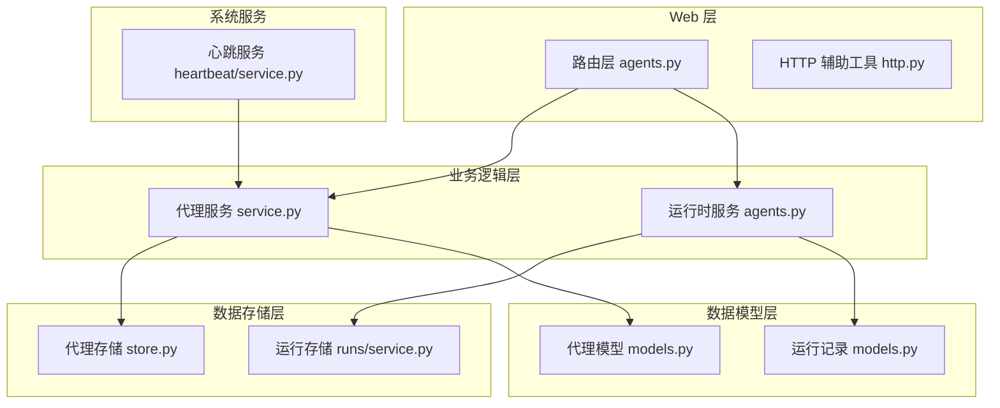

**图表来源**
- [nanobot/web/routers/agents.py:1-162](file://nanobot/web/routers/agents.py#L1-L162)
- [nanobot/platform/agents/service.py:1-404](file://nanobot/platform/agents/service.py#L1-L404)
- [nanobot/platform/agents/store.py:1-206](file://nanobot/platform/agents/store.py#L1-L206)

**章节来源**
- [nanobot/web/routers/agents.py:1-162](file://nanobot/web/routers/agents.py#L1-L162)
- [nanobot/platform/agents/service.py:1-404](file://nanobot/platform/agents/service.py#L1-L404)

## 核心组件

### 代理定义模型

代理定义使用数据类进行建模，包含完整的代理配置信息：

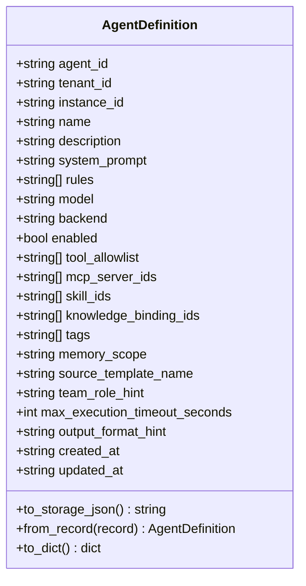

**图表来源**
- [nanobot/platform/agents/models.py:15-109](file://nanobot/platform/agents/models.py#L15-L109)

### 运行记录模型

运行记录用于跟踪代理执行的历史和状态：

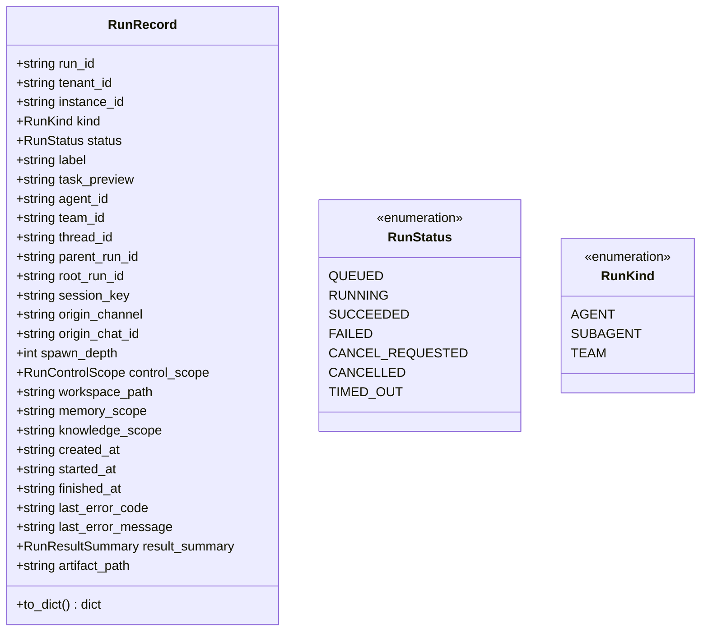

**图表来源**
- [nanobot/platform/runs/models.py:24-161](file://nanobot/platform/runs/models.py#L24-L161)

**章节来源**
- [nanobot/platform/agents/models.py:15-109](file://nanobot/platform/agents/models.py#L15-L109)
- [nanobot/platform/runs/models.py:24-161](file://nanobot/platform/runs/models.py#L24-L161)

## 架构概览

代理生命周期管理系统采用分层架构，各层职责明确：

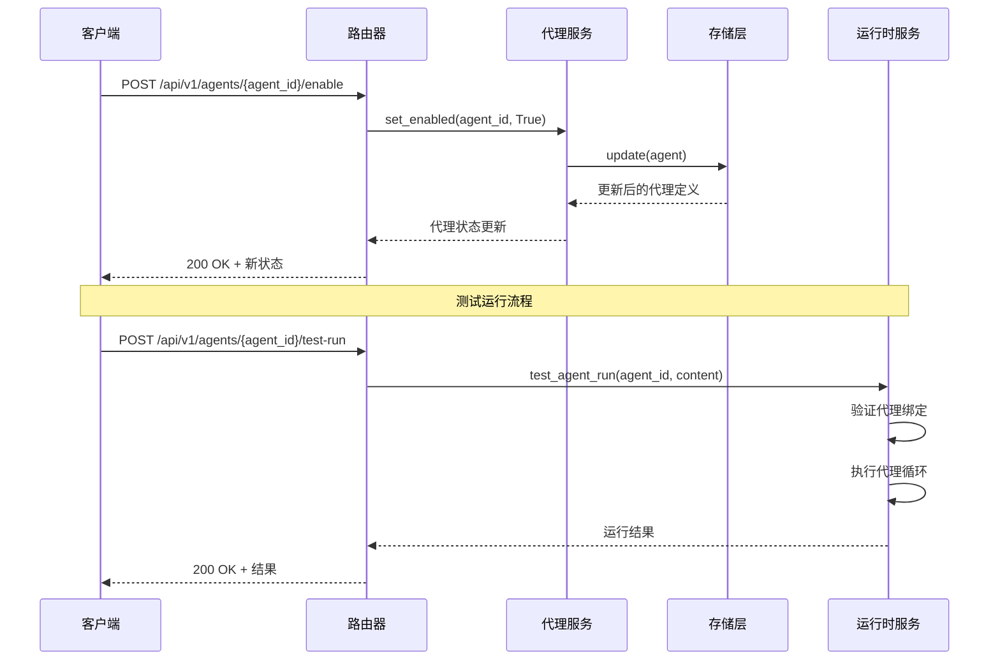

**图表来源**
- [nanobot/web/routers/agents.py:129-161](file://nanobot/web/routers/agents.py#L129-L161)
- [nanobot/platform/agents/service.py:398-403](file://nanobot/platform/agents/service.py#L398-L403)
- [nanobot/web/runtime_services/agents.py:362-400](file://nanobot/web/runtime_services/agents.py#L362-L400)

## 详细组件分析

### 启用/禁用代理 API

#### API 端点定义

系统提供了两个核心的代理状态管理端点：

| 端点 | 方法 | 描述 | 请求体 | 响应码 |
|------|------|------|--------|--------|
| `/api/v1/agents/{agent_id}/enable` | POST | 启用指定代理 | 无 | 200, 404 |
| `/api/v1/agents/{agent_id}/disable` | POST | 禁用指定代理 | 无 | 200, 404 |

#### 启用代理流程

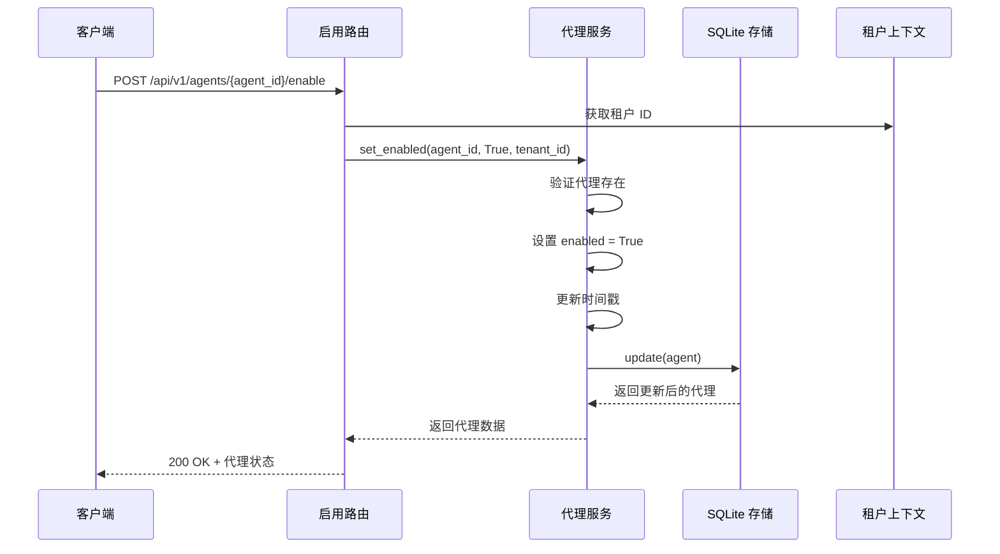

**图表来源**
- [nanobot/web/routers/agents.py:129-136](file://nanobot/web/routers/agents.py#L129-L136)
- [nanobot/platform/agents/service.py:398-403](file://nanobot/platform/agents/service.py#L398-L403)

#### 禁用代理流程

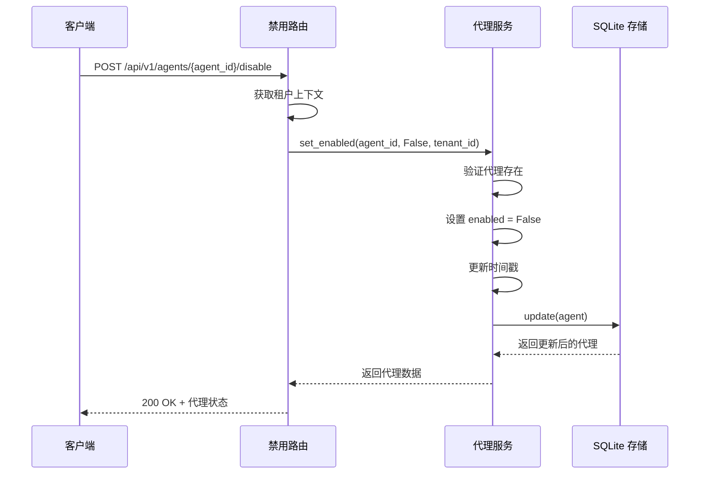

**图表来源**
- [nanobot/web/routers/agents.py:139-146](file://nanobot/web/routers/agents.py#L139-L146)
- [nanobot/platform/agents/service.py:398-403](file://nanobot/platform/agents/service.py#L398-L403)

#### 错误处理机制

系统实现了完善的错误处理机制：

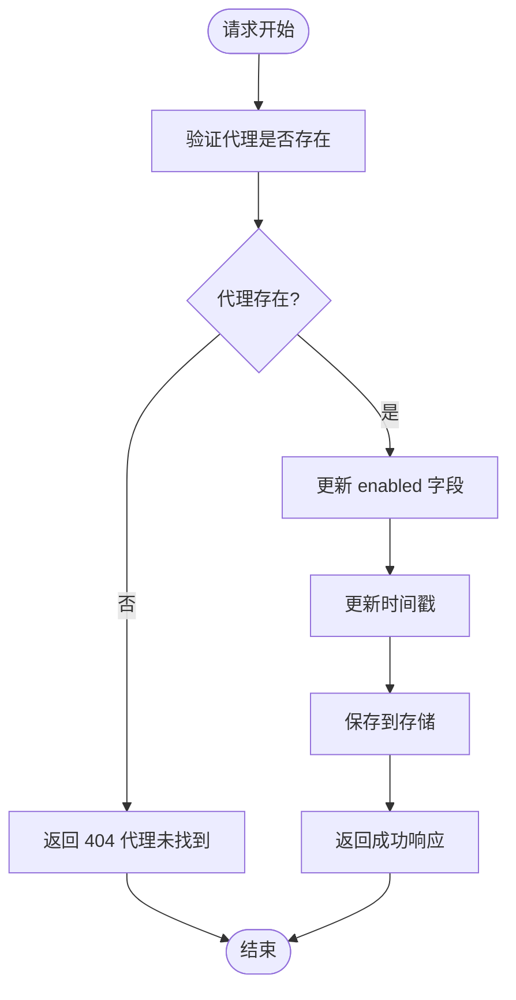

**图表来源**
- [nanobot/platform/agents/service.py:398-403](file://nanobot/platform/agents/service.py#L398-L403)
- [nanobot/web/routers/agents.py:130-146](file://nanobot/web/routers/agents.py#L130-L146)

**章节来源**
- [nanobot/web/routers/agents.py:129-146](file://nanobot/web/routers/agents.py#L129-L146)
- [nanobot/platform/agents/service.py:398-403](file://nanobot/platform/agents/service.py#L398-L403)

### 代理状态变更触发条件

代理状态变更的触发条件主要包括：

1. **手动操作**：通过 API 端点显式调用启用或禁用
2. **系统管理**：平台管理员进行批量状态管理
3. **自动化流程**：基于业务规则的状态自动切换

状态变更的影响范围：
- **立即生效**：状态变更立即反映在系统中
- **查询过滤**：启用状态影响代理列表查询结果
- **运行控制**：禁用状态阻止新任务的执行

### 代理启动、停止、重启管理

虽然当前版本主要提供启用/禁用功能，但系统架构支持更完整的生命周期管理：

#### 启动流程

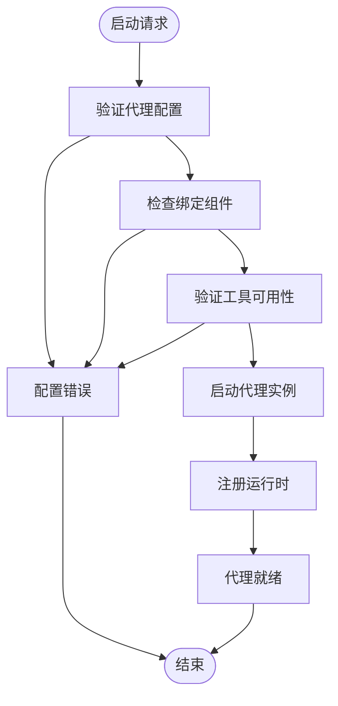

#### 停止流程

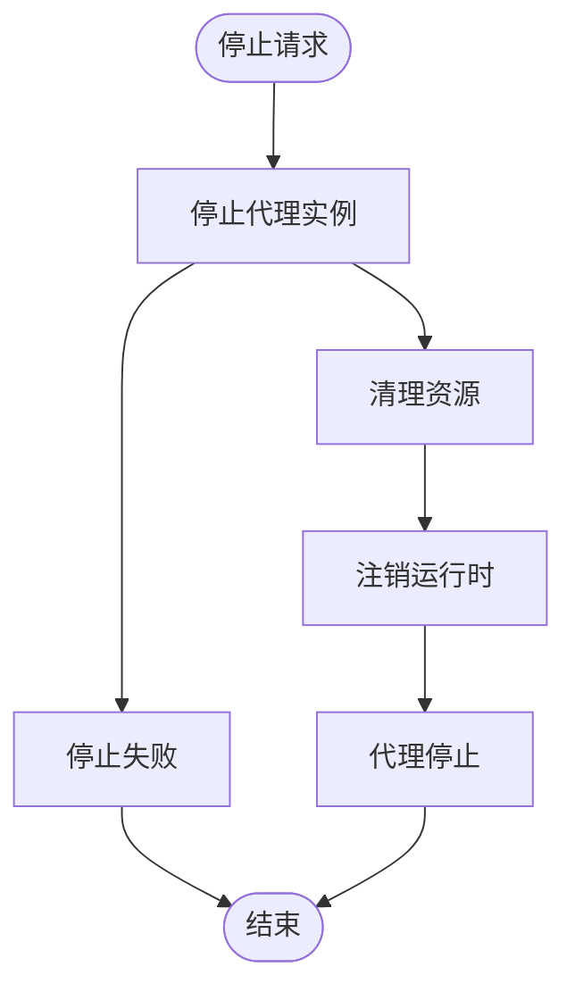

### 健康检查、状态监控和故障恢复

#### 心跳服务

系统集成了心跳服务来监控代理健康状况：

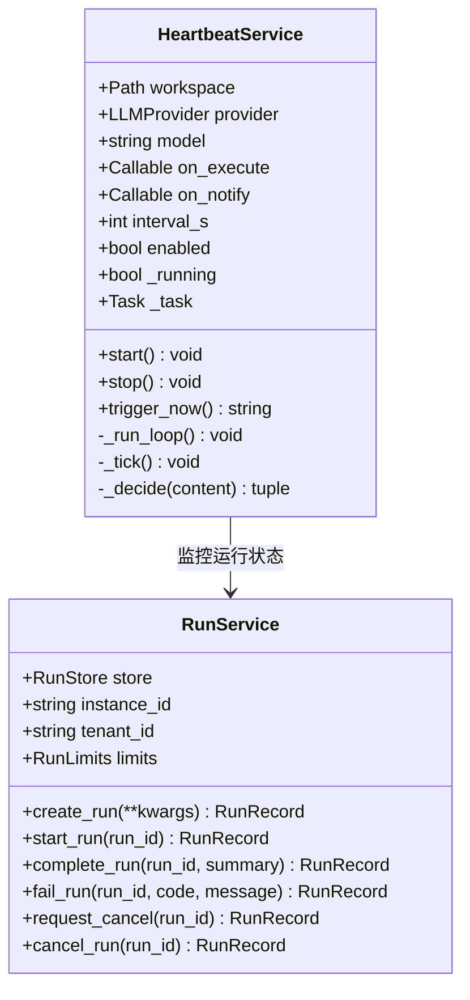

**图表来源**
- [nanobot/heartbeat/service.py:40-174](file://nanobot/heartbeat/service.py#L40-L174)
- [nanobot/platform/runs/service.py:39-338](file://nanobot/platform/runs/service.py#L39-L338)

#### 运行状态监控

系统提供了完整的运行状态监控能力：

| 状态类型 | 描述 | 用途 |
|----------|------|------|
| QUEUED | 已排队等待执行 | 监控队列长度 |
| RUNNING | 正在执行中 | 监控并发数 |
| SUCCEEDED | 执行成功 | 统计成功率 |
| FAILED | 执行失败 | 故障诊断 |
| CANCEL_REQUESTED | 请求取消 | 取消流程监控 |
| CANCELLED | 已取消 | 统计取消率 |
| TIMED_OUT | 超时 | 性能监控 |

**章节来源**
- [nanobot/heartbeat/service.py:40-174](file://nanobot/heartbeat/service.py#L40-L174)
- [nanobot/platform/runs/service.py:39-338](file://nanobot/platform/runs/service.py#L39-L338)

## 依赖关系分析

代理生命周期管理系统的关键依赖关系如下：

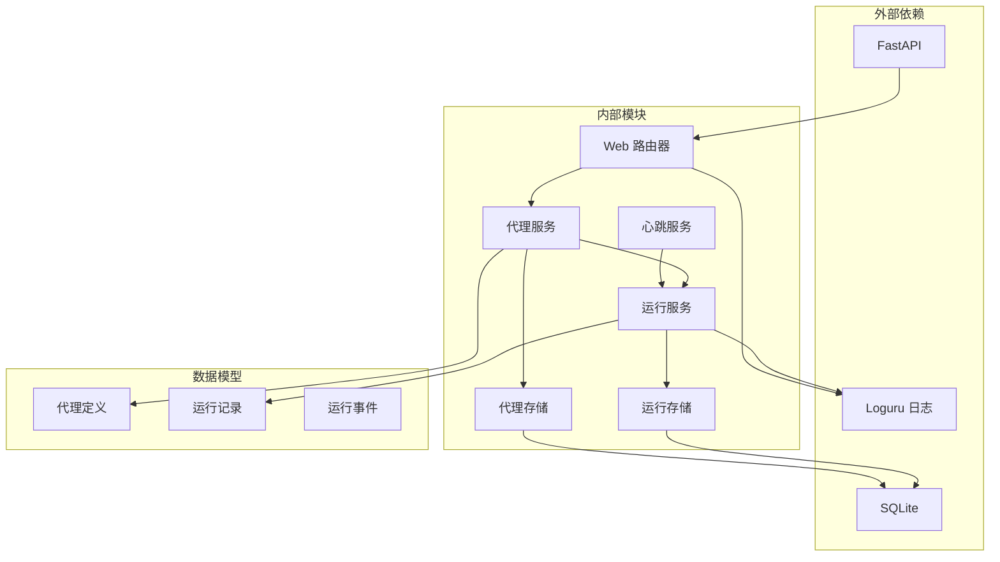

**图表来源**
- [nanobot/web/routers/agents.py:1-162](file://nanobot/web/routers/agents.py#L1-L162)
- [nanobot/platform/agents/service.py:1-404](file://nanobot/platform/agents/service.py#L1-L404)
- [nanobot/platform/agents/store.py:1-206](file://nanobot/platform/agents/store.py#L1-L206)

**章节来源**
- [nanobot/platform/agents/store.py:12-50](file://nanobot/platform/agents/store.py#L12-L50)
- [nanobot/platform/runs/service.py:39-70](file://nanobot/platform/runs/service.py#L39-L70)

## 性能考虑

### 数据库优化

系统通过索引优化查询性能：

- **主键索引**：按 agent_id 查询
- **复合索引**：tenant_id + instance_id + updated_at
- **状态索引**：enabled 字段快速筛选

### 内存管理

- **懒加载**：代理定义按需加载
- **连接池**：SQLite 连接复用
- **缓存策略**：热点数据缓存

### 并发控制

- **线程安全**：SQLite 操作串行化
- **事务管理**：原子性操作保证
- **超时控制**：防止长时间阻塞

## 故障排除指南

### 常见错误及解决方案

| 错误类型 | 错误码 | 描述 | 解决方案 |
|----------|--------|------|----------|
| 代理不存在 | 404 | 指定的代理 ID 不存在 | 检查代理 ID 是否正确 |
| 参数验证失败 | 400 | 请求参数格式不正确 | 检查请求体格式 |
| 冲突错误 | 409 | 代理名称冲突 | 修改代理名称 |
| 运行时错误 | 500 | 系统内部错误 | 查看日志文件 |

### 调试建议

1. **启用调试模式**：查看详细的错误堆栈
2. **检查数据库**：验证代理数据完整性
3. **监控日志**：分析系统运行状态
4. **测试连接**：验证数据库连接正常

**章节来源**
- [nanobot/web/http.py:31-40](file://nanobot/web/http.py#L31-L40)
- [nanobot/platform/agents/service.py:13-23](file://nanobot/platform/agents/service.py#L13-L23)

## 结论

代理生命周期管理系统提供了完整的代理状态管理功能，包括启用/禁用操作、状态监控和故障恢复机制。系统采用清晰的分层架构设计，确保了良好的可维护性和扩展性。

主要特点：
- **RESTful API 设计**：符合标准 HTTP 协议
- **完整的错误处理**：提供详细的错误信息
- **状态持久化**：所有状态变更都持久化存储
- **监控集成**：内置心跳服务和运行状态监控
- **扩展性强**：支持未来添加更多生命周期管理功能

该系统为智能代理的生产环境部署提供了坚实的基础，能够满足企业级应用对代理管理的需求。