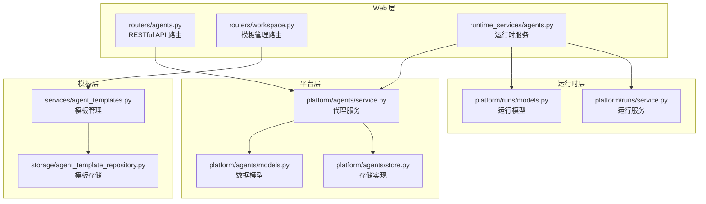
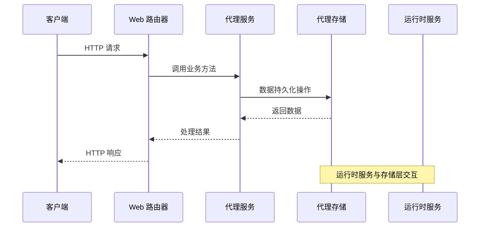
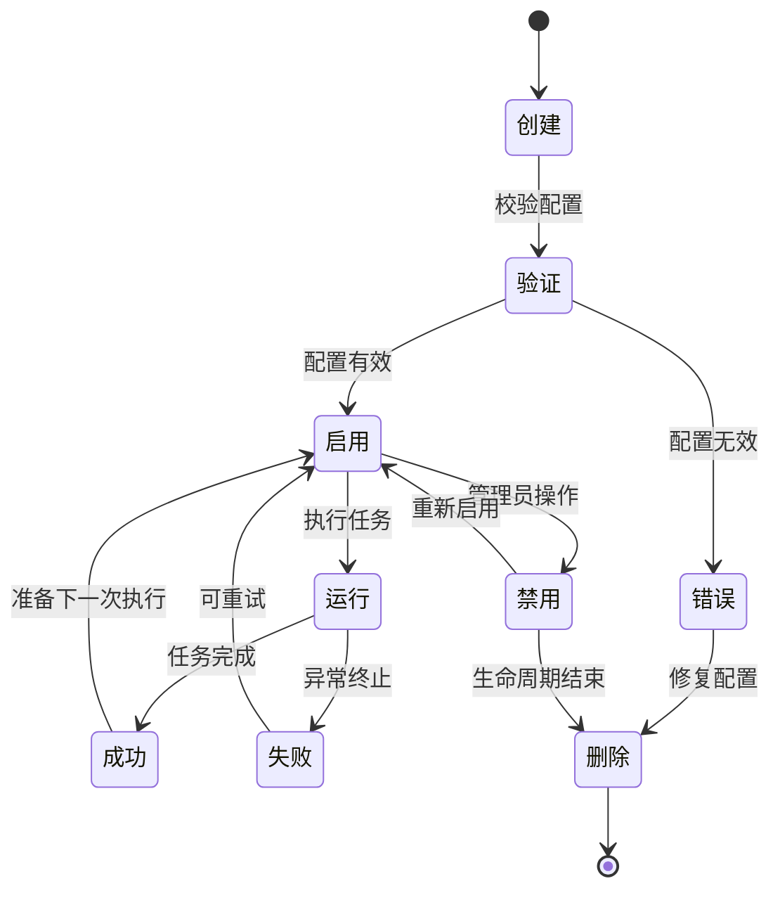
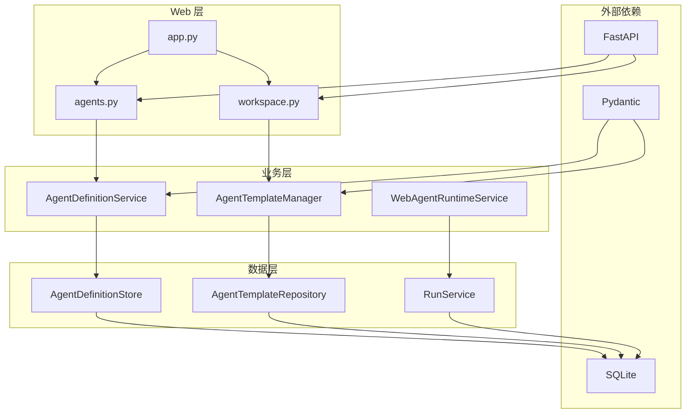

# 代理管理 API

<cite>
**本文档引用的文件**
- [agents.py](file://nanobot/web/routers/agents.py)
- [service.py](file://nanobot/platform/agents/service.py)
- [models.py](file://nanobot/platform/agents/models.py)
- [store.py](file://nanobot/platform/agents/store.py)
- [agent_templates.py](file://nanobot/services/agent_templates.py)
- [agent_template_repository.py](file://nanobot/storage/agent_template_repository.py)
- [workspace.py](file://nanobot/web/routers/workspace.py)
- [agents.py](file://nanobot/web/runtime_services/agents.py)
- [models.py](file://nanobot/platform/runs/models.py)
- [service.py](file://nanobot/platform/runs/service.py)
- [app.py](file://nanobot/web/app.py)
</cite>

## 目录
1. [简介](#简介)
2. [项目结构](#项目结构)
3. [核心组件](#核心组件)
4. [架构概览](#架构概览)
5. [详细组件分析](#详细组件分析)
6. [依赖关系分析](#依赖关系分析)
7. [性能考虑](#性能考虑)
8. [故障排除指南](#故障排除指南)
9. [结论](#结论)

## 简介

代理管理 API 是 nanobot 平台的核心功能模块，负责管理智能体（Agent）的完整生命周期。该系统提供了完整的 RESTful API 来创建、查询、更新、删除和复制代理定义，同时支持代理模板管理、批量操作和运行状态监控。

系统采用分层架构设计，包括 Web 路由层、服务层、存储层和运行时服务层，确保了良好的可维护性和扩展性。代理定义支持多种配置参数，包括系统提示词、工具权限、MCP 服务器绑定、技能集成和知识库绑定等。

## 项目结构

代理管理相关的代码主要分布在以下目录结构中：

**图表来源**
- [agents.py:1-162](file://nanobot/web/routers/agents.py#L1-L162)
- [service.py:1-404](file://nanobot/platform/agents/service.py#L1-L404)
- [models.py:1-109](file://nanobot/platform/agents/models.py#L1-L109)

**章节来源**
- [agents.py:1-162](file://nanobot/web/routers/agents.py#L1-L162)
- [service.py:1-404](file://nanobot/platform/agents/service.py#L1-L404)
- [models.py:1-109](file://nanobot/platform/agents/models.py#L1-L109)

## 核心组件

### 代理定义模型

代理定义采用数据类设计，包含以下核心字段：

- **标识信息**: agent_id, tenant_id, instance_id
- **基础配置**: name, description, enabled
- **AI 配置**: system_prompt, rules, model, backend
- **权限控制**: tool_allowlist, mcp_server_ids, skill_ids
- **知识集成**: knowledge_binding_ids, memory_scope
- **元数据**: tags, source_template_name, team_role_hint
- **性能参数**: max_execution_timeout_seconds, output_format_hint
- **时间戳**: created_at, updated_at

### 代理服务层

代理服务层提供完整的 CRUD 操作和业务逻辑验证：

- **创建验证**: 名称唯一性检查、系统提示词必填验证
- **更新处理**: 字段级更新、冲突检测
- **模板集成**: 支持从代理模板快照创建代理
- **复制功能**: 自动生成唯一名称，保持配置一致性

### 存储层

采用 SQLite 数据库存储代理定义，支持多租户隔离和实例范围内的数据管理。

**章节来源**
- [models.py:15-109](file://nanobot/platform/agents/models.py#L15-L109)
- [service.py:30-404](file://nanobot/platform/agents/service.py#L30-L404)
- [store.py:12-206](file://nanobot/platform/agents/store.py#L12-L206)

## 架构概览

代理管理系统采用分层架构，确保关注点分离和高内聚低耦合：

**图表来源**
- [app.py:70-200](file://nanobot/web/app.py#L70-L200)
- [agents.py:43-161](file://nanobot/web/routers/agents.py#L43-L161)

系统架构特点：
- **三层分离**: Web 路由层、业务服务层、数据存储层
- **错误处理**: 统一的异常类型和错误响应格式
- **租户隔离**: 支持多租户环境下的数据隔离
- **模板集成**: 代理模板与代理定义的关联机制

**章节来源**
- [app.py:70-200](file://nanobot/web/app.py#L70-L200)

## 详细组件分析

### RESTful API 端点

#### 代理管理端点

系统提供完整的代理 CRUD 操作和状态管理：

| 方法 | 路径 | 功能描述 |
|------|------|----------|
| GET | `/api/v1/agents` | 获取代理列表，支持按启用状态过滤 |
| POST | `/api/v1/agents` | 创建新代理，支持模板快照 |
| GET | `/api/v1/agents/{agent_id}` | 获取单个代理详情 |
| PUT | `/api/v1/agents/{agent_id}` | 更新代理配置 |
| DELETE | `/api/v1/agents/{agent_id}` | 删除代理 |
| POST | `/api/v1/agents/{agent_id}/copy` | 复制代理 |
| POST | `/api/v1/agents/{agent_id}/enable` | 启用代理 |
| POST | `/api/v1/agents/{agent_id}/disable` | 禁用代理 |
| POST | `/api/v1/agents/{agent_id}/test-run` | 测试运行代理 |

#### 代理模板管理端点

模板管理提供代理配置的标准化和复用能力：

| 方法 | 路径 | 功能描述 |
|------|------|----------|
| GET | `/api/v1/agent-templates` | 获取模板列表 |
| POST | `/api/v1/agent-templates` | 创建模板 |
| GET | `/api/v1/agent-templates/tools/valid` | 获取有效工具列表 |
| POST | `/api/v1/agent-templates/import` | 导入模板 |
| POST | `/api/v1/agent-templates/export` | 导出模板 |
| POST | `/api/v1/agent-templates/reload` | 重新加载模板 |
| GET | `/api/v1/agent-templates/{template_name}` | 获取模板详情 |
| PATCH | `/api/v1/agent-templates/{template_name}` | 更新模板 |
| DELETE | `/api/v1/agent-templates/{template_name}` | 删除模板 |

**章节来源**
- [agents.py:43-161](file://nanobot/web/routers/agents.py#L43-L161)
- [workspace.py:47-136](file://nanobot/web/routers/workspace.py#L47-L136)

### 代理配置参数详解

#### 基础配置参数

| 参数名 | 类型 | 必填 | 默认值 | 描述 |
|--------|------|------|--------|------|
| name | string | 是 | - | 代理名称，必须唯一 |
| description | string | 否 | 空字符串 | 代理描述信息 |
| systemPrompt | string | 是 | 空字符串 | 系统提示词，定义代理行为 |
| rules | array[string] | 否 | 空数组 | 行为规则列表 |
| enabled | boolean | 否 | true | 是否启用代理 |

#### AI 模型配置

| 参数名 | 类型 | 必填 | 默认值 | 描述 |
|--------|------|------|--------|------|
| model | string | 否 | 空 | AI 模型名称 |
| backend | string | 向后兼容 | 空 | 后端提供商 |

#### 权限控制参数

| 参数名 | 类型 | 必填 | 默认值 | 描述 |
|--------|------|------|--------|------|
| toolAllowlist | array[string] | 否 | 空数组 | 工具白名单 |
| mcpServerIds | array[string] | 否 | 空数组 | MCP 服务器 ID 列表 |
| skillIds | array[string] | 否 | 空数组 | 技能 ID 列表 |
| knowledgeBindingIds | array[string] | 否 | 空数组 | 知识库绑定 ID 列表 |

#### 高级配置参数

| 参数名 | 类型 | 必填 | 默认值 | 描述 |
|--------|------|------|--------|------|
| memoryScope | string | 否 | "agent_profile" | 内存作用域 |
| tags | array[string] | 否 | 空数组 | 标签列表 |
| maxExecutionTimeoutSeconds | integer | 否 | 300 | 最大执行超时时间 |
| outputFormatHint | string | 否 | 空字符串 | 输出格式提示 |

**章节来源**
- [service.py:120-241](file://nanobot/platform/agents/service.py#L120-L241)
- [models.py:15-41](file://nanobot/platform/agents/models.py#L15-L41)

### 代理生命周期管理

代理生命周期包括创建、验证、运行、监控和销毁等阶段：

**图表来源**
- [service.py:348-403](file://nanobot/platform/agents/service.py#L348-L403)

### 运行状态监控

系统提供完整的运行状态监控能力：

#### 运行状态枚举

| 状态 | 描述 | 用途 |
|------|------|------|
| queued | 已排队 | 任务已提交等待执行 |
| running | 执行中 | 代理正在处理任务 |
| succeeded | 成功完成 | 任务成功完成 |
| failed | 执行失败 | 任务执行过程中失败 |
| cancel_requested | 请求取消 | 用户请求取消任务 |
| cancelled | 已取消 | 任务已被取消 |
| timed_out | 超时 | 任务执行超时 |

#### 性能指标

系统收集以下性能指标用于监控和诊断：

- **执行时间**: 任务开始到结束的时间统计
- **资源使用**: CPU、内存、网络资源使用情况
- **工具调用次数**: 各种工具的调用频率统计
- **成功率**: 任务成功完成的比例
- **错误率**: 任务失败的比例

**章节来源**
- [models.py:24-33](file://nanobot/platform/runs/models.py#L24-L33)
- [service.py:42-52](file://nanobot/platform/runs/service.py#L42-L52)

### 故障诊断接口

系统提供多种故障诊断能力：

#### 错误类型

| 错误类型 | HTTP 状态码 | 错误代码 | 描述 |
|----------|-------------|----------|------|
| 代理不存在 | 404 | AGENT_NOT_FOUND | 无法找到指定的代理 |
| 代理冲突 | 409 | AGENT_CONFLICT | 代理名称或配置冲突 |
| 验证错误 | 400 | AGENT_VALIDATION_ERROR | 代理配置验证失败 |
| 模板不存在 | 404 | AGENT_TEMPLATE_NOT_FOUND | 代理模板不存在 |
| 测试运行无效 | 400 | AGENT_TEST_RUN_INVALID | 测试运行参数无效 |

#### 诊断工具

- **配置验证**: 实时验证代理配置的有效性
- **依赖检查**: 检查工具、MCP 服务器、技能的可用性
- **日志追踪**: 提供详细的执行日志和事件追踪
- **性能分析**: 分析代理执行性能瓶颈

**章节来源**
- [agents.py:66-161](file://nanobot/web/routers/agents.py#L66-L161)

## 依赖关系分析

代理管理系统的依赖关系呈现清晰的层次结构：

**图表来源**
- [app.py:70-200](file://nanobot/web/app.py#L70-L200)
- [service.py:30-41](file://nanobot/platform/agents/service.py#L30-L41)

系统依赖特点：
- **松耦合设计**: 各层之间通过接口进行通信
- **单一职责**: 每个组件专注于特定的功能领域
- **可测试性**: 清晰的依赖关系便于单元测试
- **可扩展性**: 新功能可以以插件形式添加

**章节来源**
- [app.py:70-200](file://nanobot/web/app.py#L70-L200)

## 性能考虑

### 数据访问优化

- **索引策略**: 在代理定义表上建立多列复合索引，支持常用查询模式
- **连接池**: 使用 SQLite 连接池减少连接开销
- **批量操作**: 支持批量查询和更新操作
- **缓存机制**: 模板和工具目录的缓存优化

### 并发控制

- **线程安全**: 存储层使用锁机制保证并发安全性
- **事务管理**: 关键操作使用数据库事务确保数据一致性
- **乐观锁**: 支持版本控制防止并发更新冲突

### 内存管理

- **流式处理**: 大型文档和工件采用流式读写
- **垃圾回收**: 及时释放不再使用的对象引用
- **资源清理**: 确保数据库连接和文件句柄正确关闭

## 故障排除指南

### 常见问题诊断

#### 代理创建失败

**症状**: 创建代理时返回 400 或 409 错误

**可能原因**:
1. 代理名称重复
2. 系统提示词为空
3. 工具权限配置无效
4. MCP 服务器未配置

**解决步骤**:
1. 检查代理名称是否唯一
2. 验证系统提示词内容
3. 确认工具列表中的工具存在
4. 检查 MCP 服务器配置状态

#### 代理运行异常

**症状**: 代理在执行过程中抛出异常

**诊断方法**:
1. 查看运行日志中的错误信息
2. 检查工具权限配置
3. 验证知识库绑定状态
4. 分析执行时间限制设置

#### 性能问题

**症状**: 代理执行缓慢或内存占用过高

**优化建议**:
1. 减少工具调用频率
2. 优化系统提示词长度
3. 调整执行超时时间
4. 检查数据库性能

**章节来源**
- [agents.py:66-161](file://nanobot/web/routers/agents.py#L66-L161)
- [service.py:13-23](file://nanobot/platform/agents/service.py#L13-L23)

### API 使用最佳实践

#### 错误处理

建议客户端实现以下错误处理策略：
- 捕获并解析 API 错误响应
- 实现重试机制处理临时性错误
- 记录详细的错误上下文信息
- 提供用户友好的错误提示

#### 批量操作

对于大量代理的批量操作：
- 使用分页查询避免一次性加载过多数据
- 实现异步处理避免阻塞
- 添加进度报告机制
- 实现原子性操作确保数据一致性

#### 监控和告警

建议实现以下监控机制：
- 实时监控代理状态变化
- 设置性能指标阈值告警
- 记录关键操作审计日志
- 建立故障自动恢复机制

## 结论

代理管理 API 提供了完整的智能体生命周期管理能力，具有以下优势：

**功能完整性**: 支持代理的全生命周期管理，从创建到销毁的每个环节都有相应的 API 接口。

**配置灵活性**: 提供丰富的配置参数，支持复杂的代理行为定制。

**可靠性保障**: 完善的错误处理机制和故障诊断能力，确保系统的稳定运行。

**可扩展性**: 清晰的架构设计和模块化实现，便于功能扩展和性能优化。

**易用性**: 统一的 API 设计和详细的文档说明，降低了使用门槛。

该系统为构建复杂的人工智能应用提供了坚实的基础，能够满足从简单到复杂的各种应用场景需求。