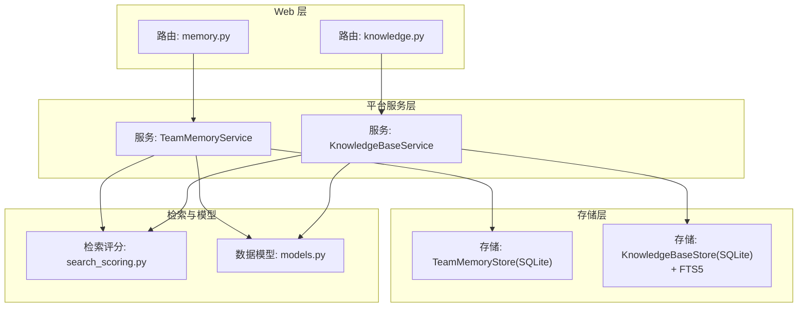
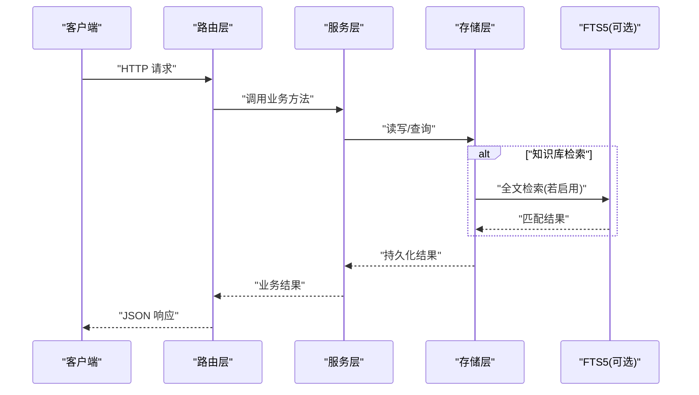
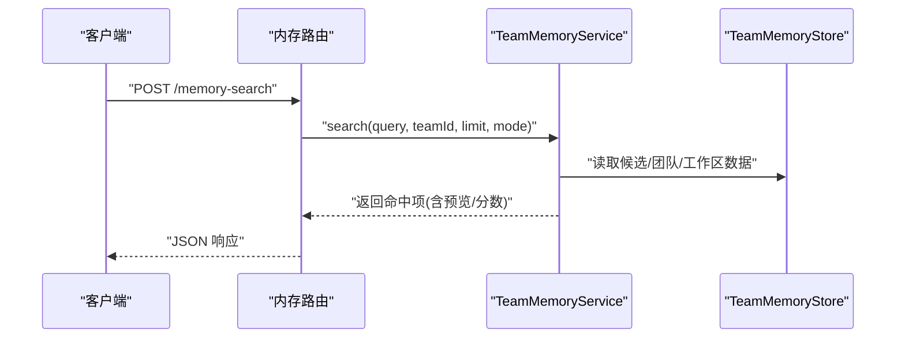
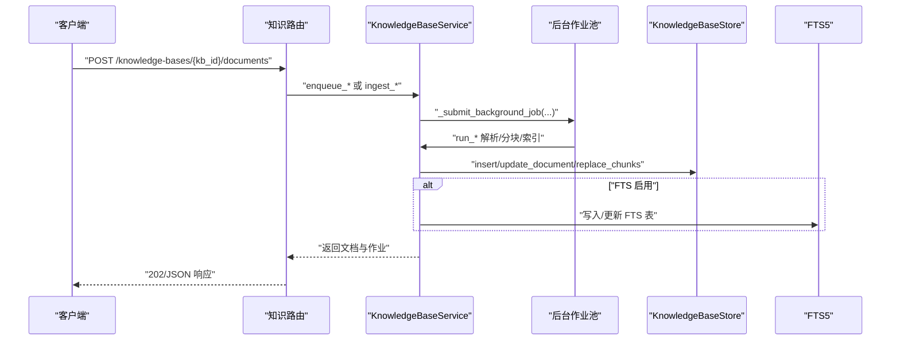
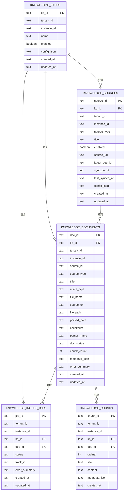
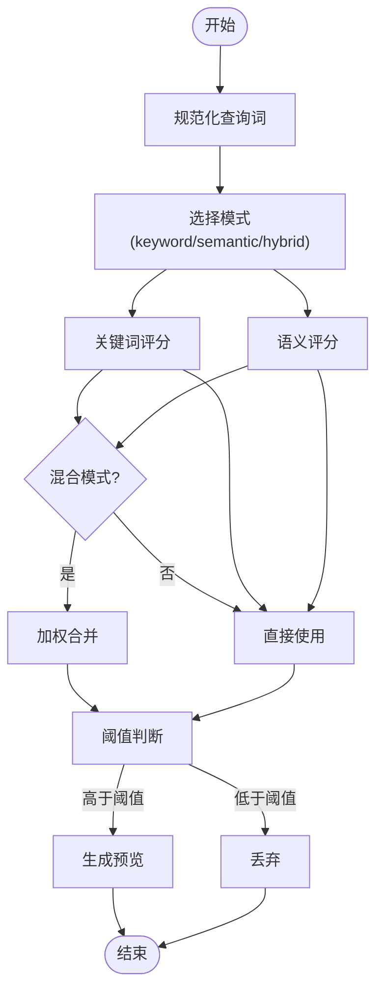
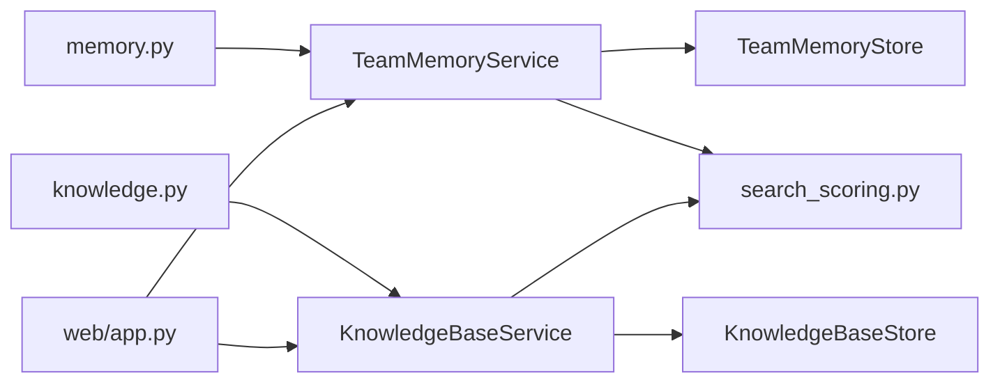

# 内存与知识 API

<cite>
**本文引用的文件**
- [nanobot/web/routers/memory.py](file://nanobot/web/routers/memory.py)
- [nanobot/web/routers/knowledge.py](file://nanobot/web/routers/knowledge.py)
- [nanobot/platform/memory/models.py](file://nanobot/platform/memory/models.py)
- [nanobot/platform/knowledge/models.py](file://nanobot/platform/knowledge/models.py)
- [nanobot/platform/memory/service.py](file://nanobot/platform/memory/service.py)
- [nanobot/platform/knowledge/service.py](file://nanobot/platform/knowledge/service.py)
- [nanobot/platform/memory/store.py](file://nanobot/platform/memory/store.py)
- [nanobot/platform/knowledge/store.py](file://nanobot/platform/knowledge/store.py)
- [nanobot/platform/search_scoring.py](file://nanobot/platform/search_scoring.py)
- [nanobot/web/app.py](file://nanobot/web/app.py)
- [memory/MEMORY.md](file://memory/MEMORY.md)
- [nanobot/templates/memory/MEMORY.md](file://nanobot/templates/memory/MEMORY.md)
</cite>

## 目录
1. [简介](#简介)
2. [项目结构](#项目结构)
3. [核心组件](#核心组件)
4. [架构总览](#架构总览)
5. [详细组件分析](#详细组件分析)
6. [依赖分析](#依赖分析)
7. [性能考虑](#性能考虑)
8. [故障排查指南](#故障排查指南)
9. [结论](#结论)
10. [附录](#附录)

## 简介
本文件为“内存与知识管理 API”的权威参考，覆盖以下能力：
- 团队共享内存：创建、查询、更新、候选条目管理（应用/拒绝）
- 上下文检索：基于关键字/语义/混合模式的检索与预览
- 长期记忆：工作区与团队级共享记忆文件
- 知识库：创建、查询、更新、删除知识库
- 知识源：上传文件、网页链接、FAQ 表格等多源接入
- 索引与检索：分块切片、FTS 检索、重索引、同步
- 元数据管理：知识文档、作业状态、源配置与统计

## 项目结构
- Web 路由层：提供 REST API，统一错误处理与鉴权
- 平台服务层：封装业务逻辑，负责数据校验、解析、索引与检索
- 存储层：SQLite 持久化，支持 FTS5 增强检索
- 检索评分：本地关键词/语义/混合评分与阈值控制

图表来源
- [nanobot/web/routers/memory.py:1-125](file://nanobot/web/routers/memory.py#L1-L125)
- [nanobot/web/routers/knowledge.py:1-240](file://nanobot/web/routers/knowledge.py#L1-L240)
- [nanobot/platform/memory/service.py:1-447](file://nanobot/platform/memory/service.py#L1-L447)
- [nanobot/platform/knowledge/service.py:1-800](file://nanobot/platform/knowledge/service.py#L1-L800)
- [nanobot/platform/memory/store.py:1-202](file://nanobot/platform/memory/store.py#L1-L202)
- [nanobot/platform/knowledge/store.py:1-729](file://nanobot/platform/knowledge/store.py#L1-L729)
- [nanobot/platform/search_scoring.py:1-143](file://nanobot/platform/search_scoring.py#L1-L143)
- [nanobot/platform/memory/models.py:1-65](file://nanobot/platform/memory/models.py#L1-L65)
- [nanobot/platform/knowledge/models.py:1-298](file://nanobot/platform/knowledge/models.py#L1-L298)

章节来源
- [nanobot/web/routers/memory.py:1-125](file://nanobot/web/routers/memory.py#L1-L125)
- [nanobot/web/routers/knowledge.py:1-240](file://nanobot/web/routers/knowledge.py#L1-L240)
- [nanobot/platform/memory/service.py:1-447](file://nanobot/platform/memory/service.py#L1-L447)
- [nanobot/platform/knowledge/service.py:1-800](file://nanobot/platform/knowledge/service.py#L1-L800)
- [nanobot/platform/memory/store.py:1-202](file://nanobot/platform/memory/store.py#L1-L202)
- [nanobot/platform/knowledge/store.py:1-729](file://nanobot/platform/knowledge/store.py#L1-L729)
- [nanobot/platform/search_scoring.py:1-143](file://nanobot/platform/search_scoring.py#L1-L143)

## 核心组件
- 内存路由与服务
  - 提供团队共享内存的读写、候选列表、搜索、候选应用/拒绝
  - 支持从运行产物、线程快照等动态来源加载内容
- 知识路由与服务
  - 提供知识库的增删改查、文档与源管理、批量删除、重索引、同步
  - 支持上传文件、网页 URL、FAQ 表格三种源类型
  - 后台异步执行解析、分块、索引流程，并跟踪作业状态
- 数据模型
  - 内存候选、知识库定义、文档、作业、源、检索配置等
- 存储与检索
  - SQLite 持久化；知识库支持 FTS5 全文检索
  - 本地关键词/语义/混合评分与阈值

章节来源
- [nanobot/platform/memory/models.py:1-65](file://nanobot/platform/memory/models.py#L1-L65)
- [nanobot/platform/knowledge/models.py:1-298](file://nanobot/platform/knowledge/models.py#L1-L298)
- [nanobot/platform/memory/store.py:1-202](file://nanobot/platform/memory/store.py#L1-L202)
- [nanobot/platform/knowledge/store.py:1-729](file://nanobot/platform/knowledge/store.py#L1-L729)
- [nanobot/platform/search_scoring.py:1-143](file://nanobot/platform/search_scoring.py#L1-L143)

## 架构总览
Web 应用在启动时注入平台实例与服务，路由层通过请求上下文访问服务层，服务层调用存储层持久化与检索，同时使用本地检索评分模块进行排序与过滤。

图表来源
- [nanobot/web/app.py:70-280](file://nanobot/web/app.py#L70-L280)
- [nanobot/platform/knowledge/store.py:615-729](file://nanobot/platform/knowledge/store.py#L615-L729)

章节来源
- [nanobot/web/app.py:70-280](file://nanobot/web/app.py#L70-L280)

## 详细组件分析

### 内存 API 参考
- 基础路径：/api/v1
- 认证：除健康检查与鉴权端点外，所有 /api/v1/* 需要会话认证

端点概览
- GET /teams/{team_id}/memory
  - 查询团队共享内存内容与候选计数
- PUT /teams/{team_id}/memory
  - 更新团队共享内存内容
- GET /memory-candidates
  - 列出候选条目（支持按状态、范围、团队过滤）
- POST /memory-search
  - 在工作区、团队、线程、产物、候选中搜索
- POST /memory-get
  - 获取指定来源的内容（工作区、团队、线程、产物、候选）
- POST /memory-candidates/{candidate_id}/apply
  - 将候选条目应用到团队共享内存
- POST /memory-candidates/{candidate_id}/reject
  - 拒绝候选条目

请求与响应要点
- 搜索支持模式：keyword、semantic、hybrid，默认 hybrid
- 预览生成：基于命中词构建上下文片段
- 错误码：INVALID、NOT_FOUND、CONFLICT 等

图表来源
- [nanobot/web/routers/memory.py:74-88](file://nanobot/web/routers/memory.py#L74-L88)
- [nanobot/platform/memory/service.py:249-346](file://nanobot/platform/memory/service.py#L249-L346)

章节来源
- [nanobot/web/routers/memory.py:1-125](file://nanobot/web/routers/memory.py#L1-L125)
- [nanobot/platform/memory/service.py:1-447](file://nanobot/platform/memory/service.py#L1-L447)
- [nanobot/platform/search_scoring.py:1-143](file://nanobot/platform/search_scoring.py#L1-L143)

### 知识库 API 参考
- 基础路径：/api/v1/knowledge-bases/{kb_id}

知识库管理
- GET /knowledge-bases
  - 列出知识库（可按启用状态过滤）
- POST /knowledge-bases
  - 创建知识库（名称唯一性校验）
- GET /knowledge-bases/{kb_id}
  - 获取知识库详情
- PUT /knowledge-bases/{kb_id}
  - 更新知识库（名称唯一性校验）
- DELETE /knowledge-bases/{kb_id}
  - 删除知识库（级联清理文件与索引）

文档与源管理
- GET /knowledge-bases/{kb_id}/documents
  - 列出文档
- GET /knowledge-bases/{kb_id}/sources
  - 列出源（自动回填旧文档的源信息）
- PUT /knowledge-bases/{kb_id}/sources/{source_id}
  - 更新源（支持 web_url、faq_table 的字段校验）
- DELETE /knowledge-bases/{kb_id}/documents/{doc_id}
  - 删除单个文档
- POST /knowledge-bases/{kb_id}/documents/delete
  - 批量删除文档
- GET /knowledge-bases/{kb_id}/jobs
  - 列出作业

知识入库与检索
- POST /knowledge-bases/{kb_id}/documents
  - 多源上传：multipart 文件、web_url、faq_table
- POST /knowledge-bases/{kb_id}/retrieve-test
  - 测试检索（支持 filters、mode、limit）
- POST /knowledge-bases/{kb_id}/reindex
  - 重索引（可指定文档 ID 列表）
- POST /knowledge-bases/{kb_id}/sources/{source_id}/sync
  - 同步源（web_url/faq_table），重新触发解析与索引

图表来源
- [nanobot/web/routers/knowledge.py:150-186](file://nanobot/web/routers/knowledge.py#L150-L186)
- [nanobot/platform/knowledge/service.py:1164-1249](file://nanobot/platform/knowledge/service.py#L1164-L1249)
- [nanobot/platform/knowledge/store.py:560-613](file://nanobot/platform/knowledge/store.py#L560-L613)

章节来源
- [nanobot/web/routers/knowledge.py:1-240](file://nanobot/web/routers/knowledge.py#L1-L240)
- [nanobot/platform/knowledge/service.py:1-1814](file://nanobot/platform/knowledge/service.py#L1-L1814)
- [nanobot/platform/knowledge/store.py:1-729](file://nanobot/platform/knowledge/store.py#L1-L729)

### 数据模型与存储
- 内存候选
  - 字段：候选 ID、租户/实例/团队/代理/运行标识、来源类型、标题、内容、状态、时间戳
  - 存储：SQLite，带索引（团队/状态/更新时间、运行 ID、范围/状态/更新时间）
- 知识库定义
  - 字段：知识库 ID、名称、描述、启用状态、标签、检索配置
  - 存储：SQLite，配置以 JSON 存储
- 文档
  - 字段：文档 ID、来源类型/URI/文件名、解析路径、校验和、解析器、状态、块数量、元数据、错误摘要
  - 存储：SQLite，含 FTS5 虚表
- 作业
  - 字段：作业 ID、状态、跟踪 ID、错误摘要
  - 存储：SQLite
- 源
  - 字段：源 ID、类型、标题、启用状态、最新文档、同步次数、配置
  - 存储：SQLite，配置以 JSON 存储

图表来源
- [nanobot/platform/knowledge/store.py:21-131](file://nanobot/platform/knowledge/store.py#L21-L131)
- [nanobot/platform/knowledge/models.py:80-298](file://nanobot/platform/knowledge/models.py#L80-L298)

章节来源
- [nanobot/platform/memory/models.py:1-65](file://nanobot/platform/memory/models.py#L1-L65)
- [nanobot/platform/knowledge/models.py:1-298](file://nanobot/platform/knowledge/models.py#L1-L298)
- [nanobot/platform/memory/store.py:1-202](file://nanobot/platform/memory/store.py#L1-L202)
- [nanobot/platform/knowledge/store.py:1-729](file://nanobot/platform/knowledge/store.py#L1-L729)

### 检索与评分
- 模式支持：keyword、semantic、hybrid
- 关键词评分：基于命中词覆盖率与密度
- 语义评分：基于字符 N-gram Jaccard 与前缀匹配
- 预览：根据首次命中位置截取上下文
- 阈值：不同模式有不同的最低阈值

图表来源
- [nanobot/platform/search_scoring.py:17-118](file://nanobot/platform/search_scoring.py#L17-L118)

章节来源
- [nanobot/platform/search_scoring.py:1-143](file://nanobot/platform/search_scoring.py#L1-L143)

### 长期记忆与上下文
- 工作区共享记忆：工作目录下的 MEMORY.md，作为全局上下文的一部分
- 团队共享记忆：每个团队独立的 .md 文件，支持候选条目格式化追加
- 运行产物与线程快照：动态注入到检索源，便于上下文召回

章节来源
- [memory/MEMORY.md:1-24](file://memory/MEMORY.md#L1-L24)
- [nanobot/templates/memory/MEMORY.md:1-24](file://nanobot/templates/memory/MEMORY.md#L1-L24)
- [nanobot/platform/memory/service.py:107-248](file://nanobot/platform/memory/service.py#L107-L248)

## 依赖分析
- 路由层依赖服务层，服务层依赖存储层与检索评分模块
- Web 应用在生命周期内初始化服务并注入到应用状态
- 知识服务使用线程池执行后台作业，避免阻塞请求

图表来源
- [nanobot/web/routers/memory.py:1-125](file://nanobot/web/routers/memory.py#L1-L125)
- [nanobot/web/routers/knowledge.py:1-240](file://nanobot/web/routers/knowledge.py#L1-L240)
- [nanobot/platform/memory/service.py:1-447](file://nanobot/platform/memory/service.py#L1-L447)
- [nanobot/platform/knowledge/service.py:1-800](file://nanobot/platform/knowledge/service.py#L1-L800)
- [nanobot/platform/memory/store.py:1-202](file://nanobot/platform/memory/store.py#L1-L202)
- [nanobot/platform/knowledge/store.py:1-729](file://nanobot/platform/knowledge/store.py#L1-L729)
- [nanobot/platform/search_scoring.py:1-143](file://nanobot/platform/search_scoring.py#L1-L143)
- [nanobot/web/app.py:70-280](file://nanobot/web/app.py#L70-L280)

章节来源
- [nanobot/web/app.py:70-280](file://nanobot/web/app.py#L70-L280)

## 性能考虑
- 知识库检索
  - FTS5 启用时优先使用全文匹配；未启用时退回到 LIKE 匹配
  - 分块大小与重叠参数影响检索精度与性能
- 异步作业
  - 解析、分块、索引在后台线程池执行，避免阻塞主请求
- 索引与查询
  - 使用合适的 top_k/chunk_top_k 与模式，平衡召回与速度
- 存储
  - SQLite 适合中小规模；大规模场景建议评估外部向量/全文引擎

## 故障排查指南
常见错误与定位
- 内存相关
  - INVALID：请求参数缺失或无效（如 teamId、query、sourceType）
  - NOT_FOUND：候选不存在或来源不可用
- 知识库相关
  - CONFLICT：知识库名称冲突
  - INVALID：上传文件为空、URL 内容类型不支持、FAQ 缺少问题/答案对
  - NOT_FOUND：知识库/文档/源不存在
  - VALIDATION_ERROR：请求体校验失败

定位步骤
- 查看响应中的错误码与消息
- 检查知识库状态与文档状态（uploaded/parsing/parased/indexing/indexed/error_*）
- 确认源是否启用且最新文档有效
- 对于重索引，确认 docIds 是否属于该知识库

章节来源
- [nanobot/web/routers/memory.py:34-106](file://nanobot/web/routers/memory.py#L34-L106)
- [nanobot/web/routers/knowledge.py:35-186](file://nanobot/web/routers/knowledge.py#L35-L186)
- [nanobot/platform/knowledge/service.py:46-60](file://nanobot/platform/knowledge/service.py#L46-L60)

## 结论
本 API 提供了从“短期对话记忆”到“长期共享记忆”，再到“企业知识库”的完整能力谱系。通过本地检索评分与 SQLite 持久化，系统在无需外部向量数据库的前提下实现了稳定、可预测的检索体验；通过多源知识入库与异步索引，满足企业知识管理的日常需求。建议结合实际规模与性能要求，合理配置检索参数与后端资源。

## 附录

### API 一览表（按功能分组）
- 内存
  - GET /api/v1/teams/{team_id}/memory
  - PUT /api/v1/teams/{team_id}/memory
  - GET /api/v1/memory-candidates
  - POST /api/v1/memory-search
  - POST /api/v1/memory-get
  - POST /api/v1/memory-candidates/{candidate_id}/apply
  - POST /api/v1/memory-candidates/{candidate_id}/reject
- 知识库
  - GET /api/v1/knowledge-bases
  - POST /api/v1/knowledge-bases
  - GET /api/v1/knowledge-bases/{kb_id}
  - PUT /api/v1/knowledge-bases/{kb_id}
  - DELETE /api/v1/knowledge-bases/{kb_id}
  - GET /api/v1/knowledge-bases/{kb_id}/documents
  - GET /api/v1/knowledge-bases/{kb_id}/sources
  - PUT /api/v1/knowledge-bases/{kb_id}/sources/{source_id}
  - DELETE /api/v1/knowledge-bases/{kb_id}/documents/{doc_id}
  - POST /api/v1/knowledge-bases/{kb_id}/documents/delete
  - GET /api/v1/knowledge-bases/{kb_id}/jobs
  - POST /api/v1/knowledge-bases/{kb_id}/documents
  - POST /api/v1/knowledge-bases/{kb_id}/retrieve-test
  - POST /api/v1/knowledge-bases/{kb_id}/reindex
  - POST /api/v1/knowledge-bases/{kb_id}/sources/{source_id}/sync