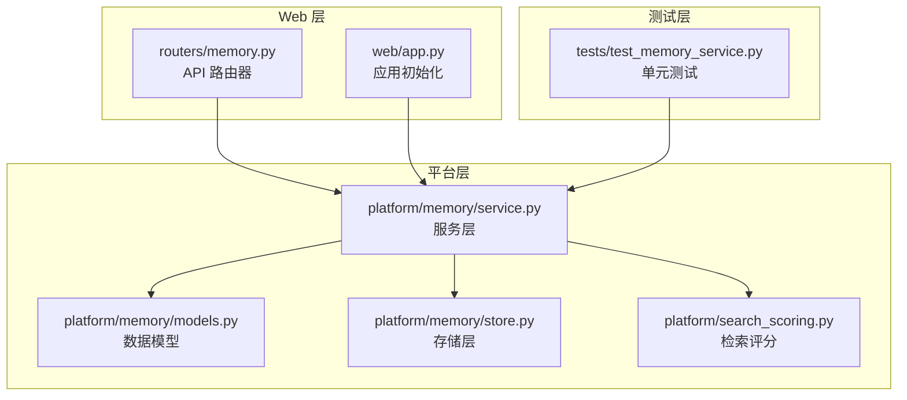
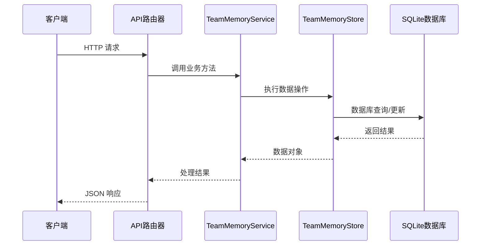
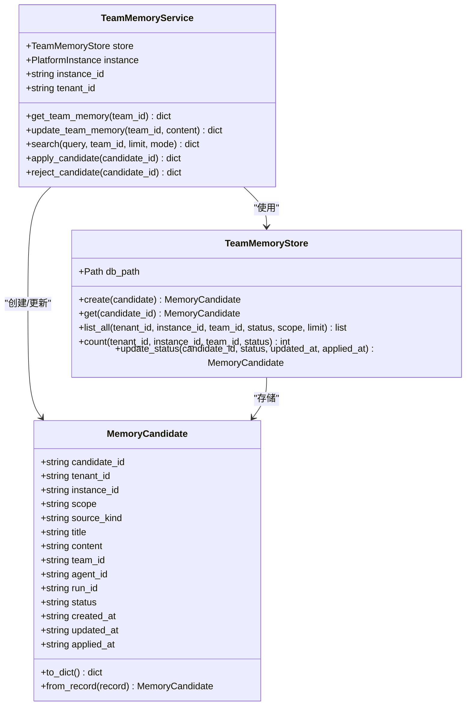
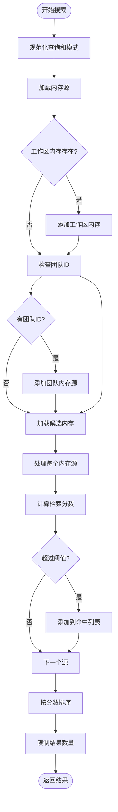
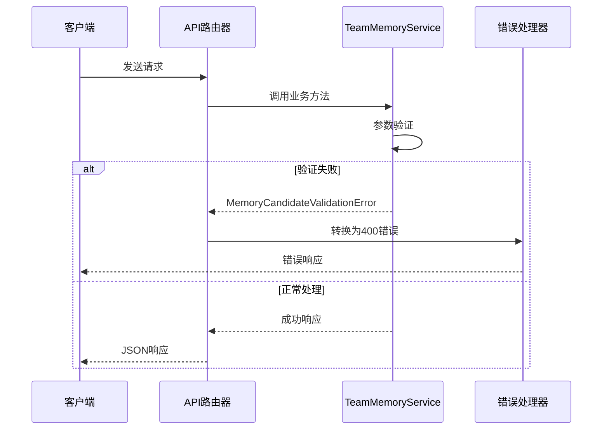

# 内存管理 API

<cite>
**本文档引用的文件**
- [nanobot/web/routers/memory.py](file://nanobot/web/routers/memory.py)
- [nanobot/platform/memory/service.py](file://nanobot/platform/memory/service.py)
- [nanobot/platform/memory/models.py](file://nanobot/platform/memory/models.py)
- [nanobot/platform/memory/store.py](file://nanobot/platform/memory/store.py)
- [nanobot/platform/search_scoring.py](file://nanobot/platform/search_scoring.py)
- [nanobot/web/app.py](file://nanobot/web/app.py)
- [tests/test_memory_service.py](file://tests/test_memory_service.py)
</cite>

## 目录
1. [简介](#简介)
2. [项目结构](#项目结构)
3. [核心组件](#核心组件)
4. [架构概览](#架构概览)
5. [详细组件分析](#详细组件分析)
6. [依赖关系分析](#依赖关系分析)
7. [性能考虑](#性能考虑)
8. [故障排除指南](#故障排除指南)
9. [结论](#结论)

## 简介
本文档详细介绍了 nanobot 平台的内存管理 API，包括团队内存的获取和更新端点，以及内存候选条目的完整生命周期管理。该 API 提供了协作式内存管理功能，支持多种检索模式（混合、语义、关键词），并允许用户对内存候选进行审批和拒绝操作。

## 项目结构
内存管理功能主要分布在以下模块中：



**图表来源**
- [nanobot/web/routers/memory.py:1-125](file://nanobot/web/routers/memory.py#L1-L125)
- [nanobot/platform/memory/service.py:1-447](file://nanobot/platform/memory/service.py#L1-L447)

**章节来源**
- [nanobot/web/routers/memory.py:1-125](file://nanobot/web/routers/memory.py#L1-L125)
- [nanobot/platform/memory/service.py:1-447](file://nanobot/platform/memory/service.py#L1-L447)

## 核心组件
内存管理 API 由四个核心组件构成：

### 1. API 路由器
负责定义所有内存管理相关的 HTTP 端点，包括：
- 团队内存获取和更新
- 内存候选列表管理
- 搜索功能
- 候选审批操作

### 2. 服务层 (TeamMemoryService)
提供业务逻辑实现，包括：
- 团队内存文件管理
- 内存候选创建、审批、拒绝
- 多源内容检索
- 检索评分和排序

### 3. 数据模型
定义内存候选的数据结构，包含：
- 候选标识符和状态
- 团队关联信息
- 内容和元数据
- 时间戳管理

### 4. 存储层 (TeamMemoryStore)
基于 SQLite 的持久化存储，提供：
- 候选条目的 CRUD 操作
- 高效的查询和索引
- 数据一致性保证

**章节来源**
- [nanobot/platform/memory/service.py:31-447](file://nanobot/platform/memory/service.py#L31-L447)
- [nanobot/platform/memory/models.py:14-65](file://nanobot/platform/memory/models.py#L14-L65)
- [nanobot/platform/memory/store.py:12-202](file://nanobot/platform/memory/store.py#L12-L202)

## 架构概览
内存管理 API 采用分层架构设计，确保关注点分离和可维护性：



**图表来源**
- [nanobot/web/routers/memory.py:32-124](file://nanobot/web/routers/memory.py#L32-L124)
- [nanobot/platform/memory/service.py:107-447](file://nanobot/platform/memory/service.py#L107-L447)

## 详细组件分析

### 团队内存管理端点

#### GET /api/v1/teams/{team_id}/memory
获取指定团队的共享内存内容。

**请求参数:**
- 路径参数: team_id (字符串, 必需)
- 查询参数: 无

**响应格式:**
```json
{
  "teamId": "string",
  "content": "string",
  "fileName": "string",
  "candidateCount": integer,
  "updatedAt": "string"
}
```

**使用示例:**
```bash
curl -X GET "http://localhost:8000/api/v1/teams/support-team/memory"
```

#### PUT /api/v1/teams/{team_id}/memory
更新指定团队的共享内存内容。

**请求体:**
```json
{
  "content": "string"
}
```

**响应格式:** 同 GET 端点响应

**使用示例:**
```bash
curl -X PUT "http://localhost:8000/api/v1/teams/support-team/memory" \
  -H "Content-Type: application/json" \
  -d '{"content": "更新后的团队记忆内容"}'
```

**章节来源**
- [nanobot/web/routers/memory.py:32-51](file://nanobot/web/routers/memory.py#L32-L51)
- [nanobot/platform/memory/service.py:107-125](file://nanobot/platform/memory/service.py#L107-L125)

### 内存候选管理端点

#### GET /api/v1/memory-candidates
列出内存候选条目。

**查询参数:**
- teamId: 团队标识符 (可选)
- status: 候选状态 (可选)
- scope: 作用域 (可选)
- limit: 结果数量限制 (默认 100, 最小 1, 最大 200)

**响应格式:**
```json
{
  "items": [
    {
      "candidateId": "string",
      "tenantId": "string",
      "instanceId": "string",
      "scope": "string",
      "teamId": "string",
      "agentId": "string",
      "runId": "string",
      "sourceKind": "string",
      "title": "string",
      "content": "string",
      "status": "string",
      "createdAt": "string",
      "updatedAt": "string",
      "appliedAt": "string"
    }
  ],
  "total": integer
}
```

**使用示例:**
```bash
curl "http://localhost:8000/api/v1/memory-candidates?teamId=support-team&status=proposed&limit=50"
```

**章节来源**
- [nanobot/web/routers/memory.py:54-71](file://nanobot/web/routers/memory.py#L54-L71)
- [nanobot/platform/memory/service.py:387-408](file://nanobot/platform/memory/service.py#L387-L408)

### 搜索功能端点

#### POST /api/v1/memory-search
在多个内存源中执行搜索。

**请求体:**
```json
{
  "query": "string",
  "teamId": "string",
  "limit": integer,
  "mode": "string"
}
```

**搜索模式:**
- keyword: 关键词匹配
- semantic: 语义相似度
- hybrid: 混合模式 (默认)

**响应格式:**
```json
{
  "query": "string",
  "requestedMode": "string",
  "effectiveMode": "string",
  "items": [
    {
      "sourceType": "string",
      "sourceId": "string",
      "title": "string",
      "content": "string",
      "preview": "string",
      "score": number,
      "metadata": {}
    }
  ],
  "total": integer
}
```

**使用示例:**
```bash
curl -X POST "http://localhost:8000/api/v1/memory-search" \
  -H "Content-Type: application/json" \
  -d '{
    "query": "团队升级流程",
    "teamId": "support-team",
    "limit": 10,
    "mode": "hybrid"
  }'
```

**章节来源**
- [nanobot/web/routers/memory.py:74-88](file://nanobot/web/routers/memory.py#L74-L88)
- [nanobot/platform/memory/service.py:249-346](file://nanobot/platform/memory/service.py#L249-L346)

### 内存源获取端点

#### POST /api/v1/memory-get
获取特定内存源的内容。

**请求体:**
```json
{
  "sourceType": "string",
  "sourceId": "string",
  "teamId": "string"
}
```

**支持的源类型:**
- workspace_memory: 工作区共享内存
- team_memory: 团队共享内存
- team_thread: 团队线程
- run_artifact: 运行工件
- memory_candidate: 内存候选

**使用示例:**
```bash
curl -X POST "http://localhost:8000/api/v1/memory-get" \
  -H "Content-Type: application/json" \
  -d '{
    "sourceType": "team_memory",
    "sourceId": "support-team",
    "teamId": "support-team"
  }'
```

**章节来源**
- [nanobot/web/routers/memory.py:91-106](file://nanobot/web/routers/memory.py#L91-L106)
- [nanobot/platform/memory/service.py:181-247](file://nanobot/platform/memory/service.py#L181-L247)

### 候选审批操作端点

#### POST /api/v1/memory-candidates/{candidate_id}/apply
批准内存候选并将其合并到团队内存中。

**路径参数:**
- candidate_id: 内存候选标识符

**响应格式:** 更新后的候选状态

**使用示例:**
```bash
curl -X POST "http://localhost:8000/api/v1/memory-candidates/memcand_abc123/apply"
```

#### POST /api/v1/memory-candidates/{candidate_id}/reject
拒绝内存候选。

**路径参数:**
- candidate_id: 内存候选标识符

**响应格式:** 更新后的候选状态

**使用示例:**
```bash
curl -X POST "http://localhost:8000/api/v1/memory-candidates/memcand_abc123/reject"
```

**章节来源**
- [nanobot/web/routers/memory.py:109-124](file://nanobot/web/routers/memory.py#L109-L124)
- [nanobot/platform/memory/service.py:417-446](file://nanobot/platform/memory/service.py#L417-L446)

## 依赖关系分析

### 数据模型关系图


**图表来源**
- [nanobot/platform/memory/models.py:14-65](file://nanobot/platform/memory/models.py#L14-L65)
- [nanobot/platform/memory/service.py:31-51](file://nanobot/platform/memory/service.py#L31-L51)
- [nanobot/platform/memory/store.py:12-55](file://nanobot/platform/memory/store.py#L12-L55)

### 检索算法流程图


**图表来源**
- [nanobot/platform/memory/service.py:249-346](file://nanobot/platform/memory/service.py#L249-L346)
- [nanobot/platform/search_scoring.py:100-119](file://nanobot/platform/search_scoring.py#L100-L119)

**章节来源**
- [nanobot/platform/memory/service.py:1-447](file://nanobot/platform/memory/service.py#L1-L447)
- [nanobot/platform/search_scoring.py:1-143](file://nanobot/platform/search_scoring.py#L1-L143)

## 性能考虑
内存管理 API 在设计时充分考虑了性能优化：

### 索引策略
- 团队索引: `idx_memory_candidates_team(team_id, status, updated_at DESC)`
- 运行索引: `idx_memory_candidates_run(run_id)`
- 作用域索引: `idx_memory_candidates_scope(scope, status, updated_at DESC)`

### 检索优化
- 支持三种检索模式，可根据需求选择最优模式
- 混合模式平衡关键词匹配和语义相似度
- 结果预览功能减少不必要的内容传输

### 存储优化
- SQLite 原生支持，无需额外依赖
- 批量查询和连接复用
- 适当的缓存策略

## 故障排除指南

### 常见错误类型

#### 内存候选验证错误 (400)
当请求参数无效或缺少必需字段时发生：
- teamId 缺失或不存在
- 查询为空
- 源类型不支持

#### 内存候选未找到 (404)
当指定的内存候选不存在时：
- 无效的候选 ID
- 已被删除的候选

### 错误处理流程


**图表来源**
- [nanobot/web/routers/memory.py:34-50](file://nanobot/web/routers/memory.py#L34-L50)
- [nanobot/web/routers/memory.py:102-105](file://nanobot/web/routers/memory.py#L102-L105)

**章节来源**
- [nanobot/web/routers/memory.py:9-10](file://nanobot/web/routers/memory.py#L9-L10)
- [nanobot/platform/memory/service.py:23-28](file://nanobot/platform/memory/service.py#L23-L28)

## 结论
内存管理 API 提供了一个完整、灵活且高效的协作式内存管理系统。通过清晰的分层架构、丰富的检索模式和完善的错误处理机制，该系统能够满足各种内存管理场景的需求。建议在生产环境中合理配置检索模式，并定期清理过期的内存候选以保持系统的最佳性能。