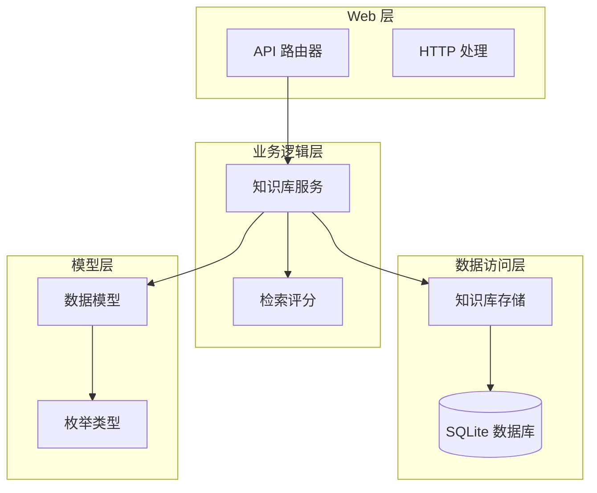
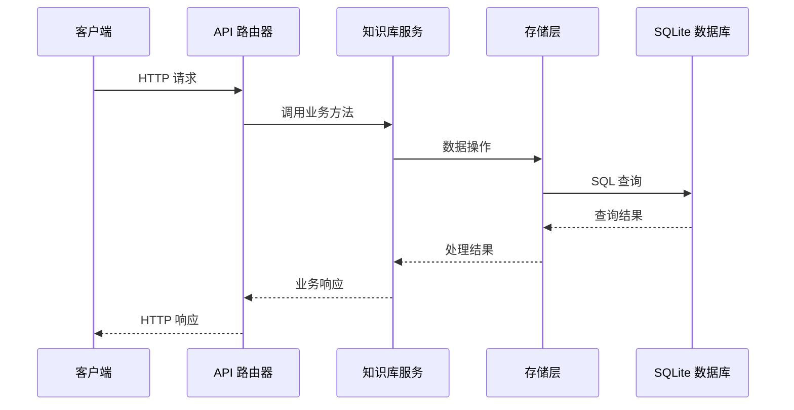
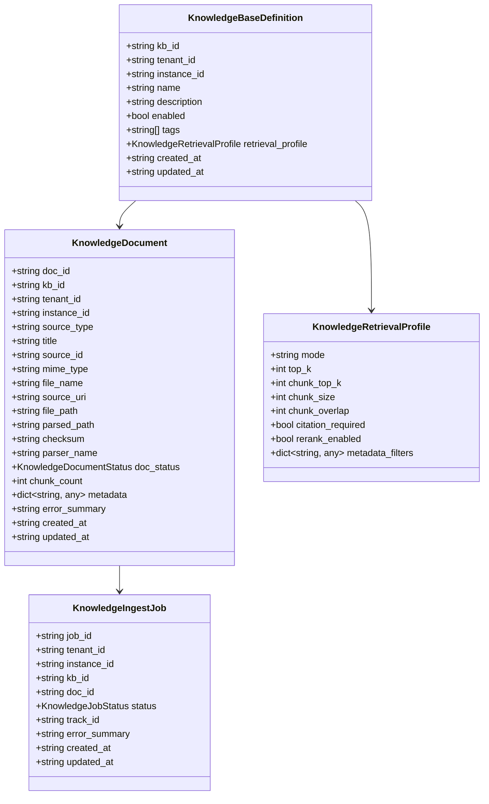
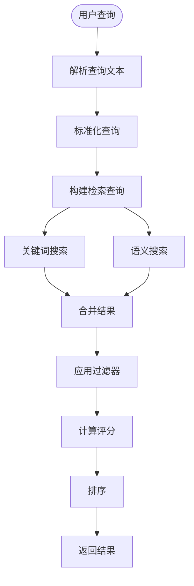

# 知识库管理 API

<cite>
**本文档引用的文件**
- [knowledge.py](file://nanobot/platform/knowledge/__init__.py)
- [models.py](file://nanobot/platform/knowledge/models.py)
- [service.py](file://nanobot/platform/knowledge/service.py)
- [store.py](file://nanobot/platform/knowledge/store.py)
- [knowledge.py](file://nanobot/web/routers/knowledge.py)
- [app.py](file://nanobot/web/app.py)
- [search_scoring.py](file://nanobot/platform/search_scoring.py)
- [test_knowledge_bases.py](file://tests/test_knowledge_bases.py)
</cite>

## 目录
1. [简介](#简介)
2. [项目结构](#项目结构)
3. [核心组件](#核心组件)
4. [架构概览](#架构概览)
5. [详细组件分析](#详细组件分析)
6. [API 参考](#api-参考)
7. [数据模型](#数据模型)
8. [检索与搜索](#检索与搜索)
9. [性能考虑](#性能考虑)
10. [故障排除指南](#故障排除指南)
11. [结论](#结论)

## 简介

知识库管理 API 是 nanobot 平台的核心组件之一，提供了企业级知识管理的完整解决方案。该系统支持多种知识来源（文件上传、网页链接、FAQ 表格），具备自动化的文档解析、分块处理、向量化索引和智能检索功能。

本 API 支持知识库的全生命周期管理，包括创建、配置、内容管理、索引构建和智能检索。系统采用 SQLite 作为存储后端，内置 FTS5 全文搜索引擎，提供高效的关键词和语义检索能力。

## 项目结构

知识库管理模块采用清晰的分层架构设计：

**图表来源**
- [knowledge.py:1-36](file://nanobot/platform/knowledge/__init__.py#L1-L36)
- [service.py:71-93](file://nanobot/platform/knowledge/service.py#L71-L93)
- [store.py:18-160](file://nanobot/platform/knowledge/store.py#L18-L160)

**章节来源**
- [knowledge.py:1-36](file://nanobot/platform/knowledge/__init__.py#L1-L36)
- [service.py:71-93](file://nanobot/platform/knowledge/service.py#L71-L93)
- [store.py:18-160](file://nanobot/platform/knowledge/store.py#L18-L160)

## 核心组件

### 知识库服务 (KnowledgeBaseService)

知识库服务是整个系统的核心协调者，负责：
- 知识库的 CRUD 操作
- 文档上传和解析
- 索引构建和维护
- 智能检索和排序
- 后台作业管理

### 知识库存储 (KnowledgeBaseStore)

基于 SQLite 的持久化存储，提供：
- 结构化数据存储
- FTS5 全文搜索支持
- 关系型数据完整性保证
- 高效的查询优化

### 检索评分引擎

内置的检索评分系统，提供三种检索模式：
- **关键词模式**：基于精确匹配的关键词检索
- **语义模式**：基于语义相似度的智能检索
- **混合模式**：结合关键词和语义的综合检索

**章节来源**
- [service.py:71-93](file://nanobot/platform/knowledge/service.py#L71-L93)
- [store.py:18-160](file://nanobot/platform/knowledge/store.py#L18-L160)
- [search_scoring.py:17-22](file://nanobot/platform/search_scoring.py#L17-L22)

## 架构概览

**图表来源**
- [app.py:87-91](file://nanobot/web/app.py#L87-L91)
- [knowledge.py:30-41](file://nanobot/web/routers/knowledge.py#L30-L41)

## 详细组件分析

### 知识库模型体系

系统采用强类型的模型设计，确保数据的一致性和完整性：

**图表来源**
- [models.py:80-129](file://nanobot/platform/knowledge/models.py#L80-L129)
- [models.py:131-199](file://nanobot/platform/knowledge/models.py#L131-L199)
- [models.py:202-242](file://nanobot/platform/knowledge/models.py#L202-L242)
- [models.py:33-77](file://nanobot/platform/knowledge/models.py#L33-L77)

### 检索流程

**图表来源**
- [service.py:1722-1813](file://nanobot/platform/knowledge/service.py#L1722-L1813)
- [search_scoring.py:100-109](file://nanobot/platform/search_scoring.py#L100-L109)

**章节来源**
- [models.py:80-129](file://nanobot/platform/knowledge/models.py#L80-L129)
- [models.py:131-199](file://nanobot/platform/knowledge/models.py#L131-L199)
- [models.py:202-242](file://nanobot/platform/knowledge/models.py#L202-L242)
- [models.py:33-77](file://nanobot/platform/knowledge/models.py#L33-L77)

## API 参考

### 知识库管理端点

#### 获取知识库列表
- **方法**: GET
- **路径**: `/api/v1/knowledge-bases`
- **查询参数**:
  - `enabled`: 可选，布尔值，过滤启用状态的知识库
- **响应**: 知识库对象数组

#### 创建知识库
- **方法**: POST
- **路径**: `/api/v1/knowledge-bases`
- **请求体**: 知识库定义对象
- **响应**: 创建的知库对象
- **状态码**: 201 Created

#### 获取单个知识库
- **方法**: GET
- **路径**: `/api/v1/knowledge-bases/{kb_id}`
- **路径参数**: `kb_id` - 知识库 ID
- **响应**: 知识库对象

#### 更新知识库
- **方法**: PUT
- **路径**: `/api/v1/knowledge-bases/{kb_id}`
- **路径参数**: `kb_id` - 知识库 ID
- **请求体**: 更新字段
- **响应**: 更新后的知识库对象

#### 删除知识库
- **方法**: DELETE
- **路径**: `/api/v1/knowledge-bases/{kb_id}`
- **路径参数**: `kb_id` - 知识库 ID
- **响应**: 删除确认对象

**章节来源**
- [knowledge.py:22-76](file://nanobot/web/routers/knowledge.py#L22-L76)

### 知识条目管理端点

#### 列出知识条目
- **方法**: GET
- **路径**: `/api/v1/knowledge-bases/{kb_id}/documents`
- **路径参数**: `kb_id` - 知识库 ID
- **响应**: 文档对象数组

#### 删除单个知识条目
- **方法**: DELETE
- **路径**: `/api/v1/knowledge-bases/{kb_id}/documents/{doc_id}`
- **路径参数**:
  - `kb_id` - 知识库 ID
  - `doc_id` - 文档 ID
- **响应**: 删除确认对象

#### 批量删除知识条目
- **方法**: POST
- **路径**: `/api/v1/knowledge-bases/{kb_id}/documents/delete`
- **路径参数**: `kb_id` - 知识库 ID
- **请求体**: `{ docIds: string[] }`
- **响应**: 删除统计对象

#### 列出知识条目作业
- **方法**: GET
- **路径**: `/api/v1/knowledge-bases/{kb_id}/jobs`
- **路径参数**: `kb_id` - 知识库 ID
- **响应**: 作业对象数组

**章节来源**
- [knowledge.py:79-147](file://nanobot/web/routers/knowledge.py#L79-L147)

### 知识源管理端点

#### 列出知识源
- **方法**: GET
- **路径**: `/api/v1/knowledge-bases/{kb_id}/sources`
- **路径参数**: `kb_id` - 知识库 ID
- **响应**: 知识源对象数组

#### 更新知识源
- **方法**: PUT
- **路径**: `/api/v1/knowledge-bases/{kb_id}/sources/{source_id}`
- **路径参数**:
  - `kb_id` - 知识库 ID
  - `source_id` - 知识源 ID
- **请求体**: 知识源更新对象
- **响应**: 更新后的知识源对象

#### 同步知识源
- **方法**: POST
- **路径**: `/api/v1/knowledge-bases/{kb_id}/sources/{source_id}/sync`
- **路径参数**:
  - `kb_id` - 知识库 ID
  - `source_id` - 知识源 ID
- **响应**: 同步结果对象

**章节来源**
- [knowledge.py:88-112](file://nanobot/web/routers/knowledge.py#L88-L112)
- [knowledge.py:229-239](file://nanobot/web/routers/knowledge.py#L229-L239)

### 内容上传和索引端点

#### 上传知识内容
- **方法**: POST
- **路径**: `/api/v1/knowledge-bases/{kb_id}/documents`
- **路径参数**: `kb_id` - 知识库 ID
- **内容类型**: 
  - `multipart/form-data` 或 JSON
- **请求体**: 文件上传或源类型定义
- **响应**: 上传结果对象

#### 测试检索
- **方法**: POST
- **路径**: `/api/v1/knowledge-bases/{kb_id}/retrieve-test`
- **路径参数**: `kb_id` - 知识库 ID
- **请求体**: 检索参数
- **响应**: 检索结果对象

#### 重新索引
- **方法**: POST
- **路径**: `/api/v1/knowledge-bases/{kb_id}/reindex`
- **路径参数**: `kb_id` - 知识库 ID
- **请求体**: 重新索引参数
- **响应**: 重新索引结果对象

**章节来源**
- [knowledge.py:150-226](file://nanobot/web/routers/knowledge.py#L150-L226)

## 数据模型

### 知识库定义 (KnowledgeBaseDefinition)

| 字段名 | 类型 | 必填 | 描述 |
|--------|------|------|------|
| kbId | string | 是 | 知识库唯一标识符 |
| tenantId | string | 是 | 租户标识符 |
| instanceId | string | 是 | 实例标识符 |
| name | string | 是 | 知识库名称 |
| description | string | 否 | 描述信息 |
| enabled | boolean | 否 | 是否启用 |
| tags | string[] | 否 | 标签列表 |
| retrievalProfile | object | 否 | 检索配置 |
| createdAt | string | 否 | 创建时间 |
| updatedAt | string | 否 | 更新时间 |

### 检索配置 (KnowledgeRetrievalProfile)

| 字段名 | 类型 | 默认值 | 描述 |
|--------|------|--------|------|
| mode | string | "hybrid" | 检索模式 (keyword/semantic/hybrid) |
| topK | number | 8 | 返回结果数量 |
| chunkTopK | number | 20 | 分块结果数量 |
| chunkSize | number | 800 | 分块大小 |
| chunkOverlap | number | 120 | 分块重叠 |
| citationRequired | boolean | true | 是否需要引用 |
| rerankEnabled | boolean | false | 是否启用重排 |
| metadataFilters | object | {} | 元数据过滤器 |

### 知识条目 (KnowledgeDocument)

| 字段名 | 类型 | 描述 |
|--------|------|------|
| docId | string | 文档唯一标识符 |
| kbId | string | 知识库标识符 |
| tenantId | string | 租户标识符 |
| instanceId | string | 实例标识符 |
| sourceType | string | 来源类型 |
| title | string | 标题 |
| sourceId | string | 源标识符 |
| mimeType | string | MIME 类型 |
| fileName | string | 文件名 |
| sourceUri | string | 源 URI |
| filePath | string | 原始文件路径 |
| parsedPath | string | 解析后文件路径 |
| checksum | string | 校验和 |
| parserName | string | 解析器名称 |
| docStatus | string | 文档状态 |
| chunkCount | number | 分块数量 |
| metadata | object | 元数据 |
| errorSummary | string | 错误摘要 |
| createdAt | string | 创建时间 |
| updatedAt | string | 更新时间 |

### 状态枚举

**知识文档状态**:
- `uploaded`: 已上传
- `parsing`: 解析中
- `parsed`: 已解析
- `indexing`: 索引中
- `indexed`: 已索引
- `error_parsing`: 解析错误
- `error_indexing`: 索引错误

**作业状态**:
- `queued`: 队列中
- `running`: 运行中
- `succeeded`: 成功
- `failed`: 失败

**章节来源**
- [models.py:16-24](file://nanobot/platform/knowledge/models.py#L16-L24)
- [models.py:26-31](file://nanobot/platform/knowledge/models.py#L26-L31)
- [models.py:80-129](file://nanobot/platform/knowledge/models.py#L80-L129)
- [models.py:131-199](file://nanobot/platform/knowledge/models.py#L131-L199)

## 检索与搜索

### 检索模式

系统支持三种检索模式，每种模式都有其特定的应用场景：

#### 关键词模式 (Keyword)
- **特点**: 基于精确匹配的关键词检索
- **适用场景**: 精确术语查询、技术规范检索
- **优势**: 性能优异、结果可预测
- **阈值**: 0.0

#### 语义模式 (Semantic)
- **特点**: 基于语义相似度的智能检索
- **适用场景**: 自然语言查询、概念检索
- **优势**: 理解语义关系、支持同义词
- **阈值**: 0.12

#### 混合模式 (Hybrid)
- **特点**: 结合关键词和语义的综合检索
- **适用场景**: 多样化查询需求
- **优势**: 平衡准确性与召回率
- **阈值**: 0.08

### 检索参数

| 参数名 | 类型 | 必填 | 描述 |
|--------|------|------|------|
| query | string | 是 | 检索查询文本 |
| limit | number | 否 | 返回结果数量限制 |
| filters | object | 否 | 元数据过滤器 |
| mode | string | 否 | 检索模式 |

### 元数据过滤

支持基于以下维度的元数据过滤：

- **docId**: 文档 ID 过滤
- **sourceType**: 来源类型过滤
- **locale**: 地区语言过滤
- **tags**: 标签集合过滤

### 检索评分

系统使用多维度评分算法：

1. **关键词评分**: 基于精确匹配的权重
2. **语义评分**: 基于语义相似度的权重
3. **混合评分**: 加权平均组合
4. **FTS 评分**: 基于全文搜索的相关性

**章节来源**
- [service.py:1722-1813](file://nanobot/platform/knowledge/service.py#L1722-L1813)
- [search_scoring.py:100-118](file://nanobot/platform/search_scoring.py#L100-L118)

## 性能考虑

### 存储优化

- **SQLite FTS5**: 内置全文搜索引擎，提供高性能文本检索
- **索引策略**: 多层次索引优化查询性能
- **分块存储**: 将大文档分割为小块，提高检索精度
- **缓存机制**: 避免重复解析和索引

### 检索优化

- **查询预处理**: 标准化查询文本，提取关键词
- **结果合并**: 合并多个查询的结果集
- **过滤优先**: 先应用过滤器再计算评分
- **结果截断**: 控制返回结果数量

### 并发处理

- **线程池**: 后台作业使用线程池并发处理
- **锁机制**: 确保数据一致性
- **资源管理**: 优雅关闭和清理资源

## 故障排除指南

### 常见错误类型

| 错误代码 | 描述 | 处理建议 |
|----------|------|----------|
| KNOWLEDGE_BASE_NOT_FOUND | 知识库不存在 | 检查知识库 ID 是否正确 |
| KNOWLEDGE_BASE_CONFLICT | 知识库名称冲突 | 修改知识库名称 |
| KNOWLEDGE_BASE_INVALID | 知识库数据无效 | 检查请求数据格式 |
| KNOWLEDGE_SOURCE_NOT_FOUND | 知识源不存在 | 验证知识源 ID |
| KNOWLEDGE_SOURCE_INVALID | 知识源数据无效 | 检查源配置 |
| KNOWLEDGE_DOCUMENT_INVALID | 文档数据无效 | 验证上传文件格式 |

### 调试技巧

1. **检查日志**: 查看后台作业执行日志
2. **验证数据**: 确认数据库表结构完整
3. **测试连接**: 验证 SQLite 数据库连接
4. **监控性能**: 监控检索响应时间和资源使用

### 最佳实践

- **合理配置**: 根据使用场景调整检索参数
- **文件格式**: 支持的文件格式包括 txt、md、html、json、csv、xlsx、pdf、docx
- **索引策略**: 定期重新索引以保持检索效果
- **监控告警**: 设置适当的性能监控和告警机制

**章节来源**
- [knowledge.py:37-40](file://nanobot/web/routers/knowledge.py#L37-L40)
- [knowledge.py:180-185](file://nanobot/web/routers/knowledge.py#L180-L185)

## 结论

知识库管理 API 提供了一个完整的企业级知识管理解决方案，具有以下优势：

1. **全面的功能覆盖**: 从知识库创建到智能检索的全流程支持
2. **灵活的配置选项**: 支持多种检索模式和自定义配置
3. **高性能的检索**: 基于 SQLite FTS5 的高效文本检索
4. **可靠的存储**: 基于 SQLite 的持久化存储方案
5. **易于集成**: 清晰的 API 设计和完整的错误处理

该系统适合各种规模的企业知识管理需求，从简单的文档检索到复杂的智能问答场景都能有效支持。