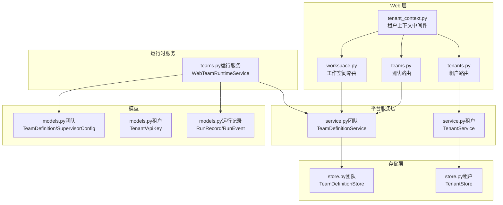
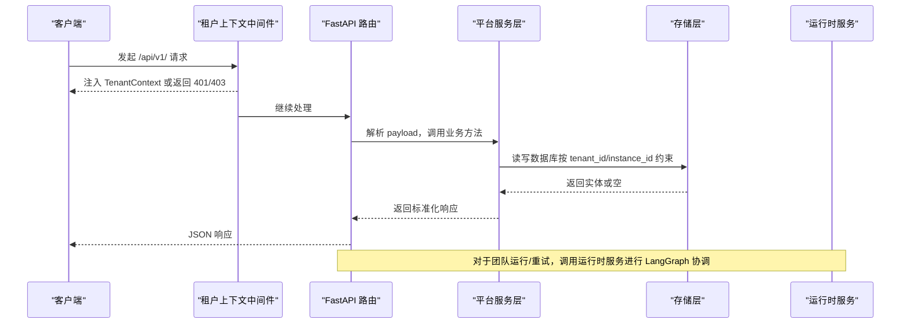
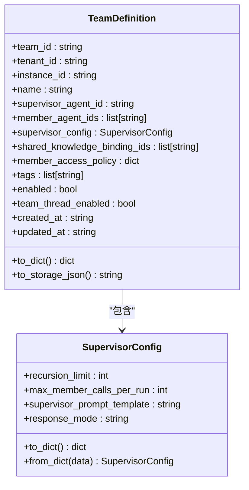
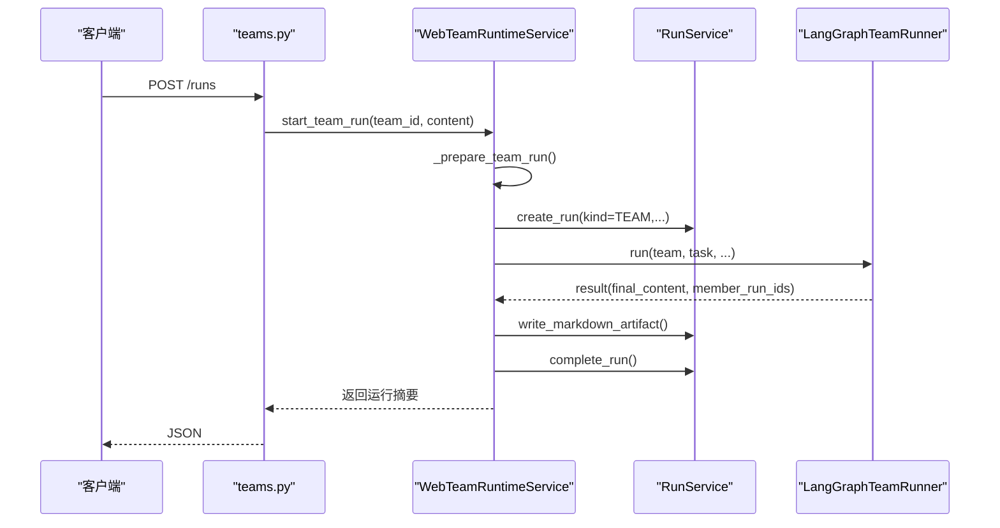
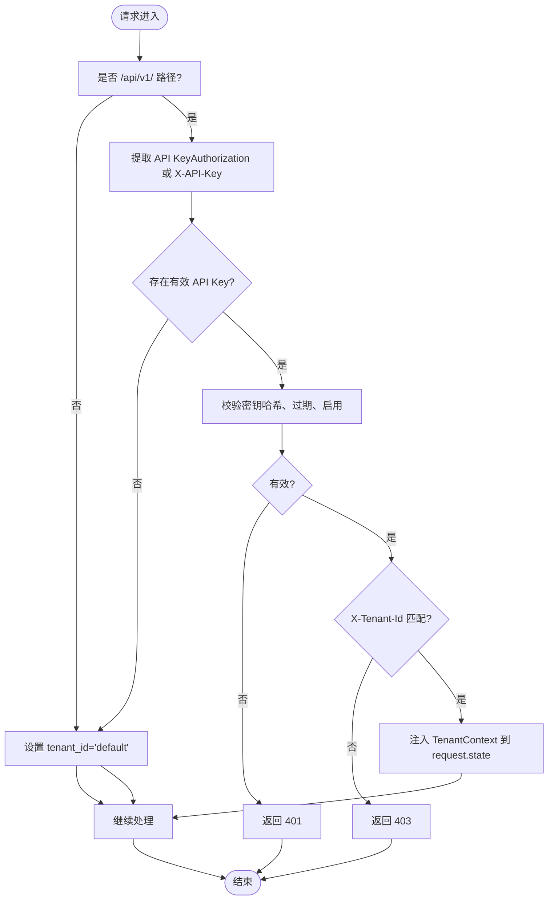
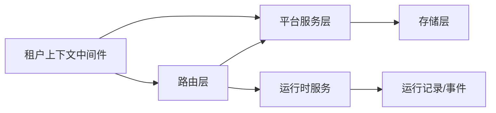

# 团队与工作空间 API

<cite>
**本文档引用的文件**
- [teams.py](file://nanobot/web/routers/teams.py)
- [workspace.py](file://nanobot/web/routers/workspace.py)
- [models.py（团队）](file://nanobot/platform/teams/models.py)
- [service.py（团队）](file://nanobot/platform/teams/service.py)
- [store.py（团队）](file://nanobot/platform/teams/store.py)
- [models.py（租户）](file://nanobot/platform/tenants/models.py)
- [service.py（租户）](file://nanobot/platform/tenants/service.py)
- [store.py（租户）](file://nanobot/platform/tenants/store.py)
- [teams.py（运行服务）](file://nanobot/web/runtime_services/teams.py)
- [tenant_context.py](file://nanobot/web/tenant_context.py)
- [app.py](file://nanobot/web/app.py)
- [models.py（运行记录）](file://nanobot/platform/runs/models.py)
- [tenants.py（路由）](file://nanobot/web/routers/tenants.py)
</cite>

## 目录
1. [简介](#简介)
2. [项目结构](#项目结构)
3. [核心组件](#核心组件)
4. [架构总览](#架构总览)
5. [详细组件分析](#详细组件分析)
6. [依赖分析](#依赖分析)
7. [性能考虑](#性能考虑)
8. [故障排查指南](#故障排查指南)
9. [结论](#结论)
10. [附录：端点清单与字段说明](#附录端点清单与字段说明)

## 简介
本文件为“团队与工作空间 API”的权威参考文档，覆盖以下主题：
- 团队生命周期管理：创建、查询、更新、删除、复制、启用/禁用
- 成员与权限：监督者与成员关系、成员访问策略（共享知识库与团队记忆）
- 工作空间资源：模板、技能、文档等资源的管理与批量导入导出
- 多租户架构：租户隔离、API 密钥认证、请求级租户上下文注入
- 运行与协作：团队测试运行、重试、线程上下文、知识检索与记忆共享
- 审计与可观测性：运行事件、结果摘要、工件生成与线程消息回溯

## 项目结构
围绕团队与工作空间的核心模块包括：
- Web 路由层：定义 /api/v1/ 前缀的 REST 端点
- 平台服务层：封装业务规则与校验逻辑
- 存储层：基于 SQLite 的持久化
- 运行时服务：团队运行、LangGraph 协调、线程与知识/记忆集成
- 租户与认证：API Key 认证中间件、租户上下文注入

图表来源
- [teams.py:1-185](file://nanobot/web/routers/teams.py#L1-L185)
- [workspace.py:1-245](file://nanobot/web/routers/workspace.py#L1-L245)
- [tenants.py（路由）:1-119](file://nanobot/web/routers/tenants.py#L1-L119)
- [tenant_context.py:1-108](file://nanobot/web/tenant_context.py#L1-L108)
- [service.py（团队）:1-358](file://nanobot/platform/teams/service.py#L1-L358)
- [service.py（租户）:1-191](file://nanobot/platform/tenants/service.py#L1-L191)
- [store.py（团队）:1-201](file://nanobot/platform/teams/store.py#L1-L201)
- [store.py（租户）:1-222](file://nanobot/platform/tenants/store.py#L1-L222)
- [teams.py（运行服务）:1-543](file://nanobot/web/runtime_services/teams.py#L1-L543)
- [models.py（团队）:1-143](file://nanobot/platform/teams/models.py#L1-L143)
- [models.py（租户）:1-100](file://nanobot/platform/tenants/models.py#L1-L100)
- [models.py（运行记录）:1-161](file://nanobot/platform/runs/models.py#L1-L161)

章节来源
- [teams.py:1-185](file://nanobot/web/routers/teams.py#L1-L185)
- [workspace.py:1-245](file://nanobot/web/routers/workspace.py#L1-L245)
- [tenants.py（路由）:1-119](file://nanobot/web/routers/tenants.py#L1-L119)
- [tenant_context.py:1-108](file://nanobot/web/tenant_context.py#L1-L108)
- [service.py（团队）:1-358](file://nanobot/platform/teams/service.py#L1-L358)
- [service.py（租户）:1-191](file://nanobot/platform/tenants/service.py#L1-L191)
- [store.py（团队）:1-201](file://nanobot/platform/teams/store.py#L1-L201)
- [store.py（租户）:1-222](file://nanobot/platform/tenants/store.py#L1-L222)
- [teams.py（运行服务）:1-543](file://nanobot/web/runtime_services/teams.py#L1-L543)
- [models.py（团队）:1-143](file://nanobot/platform/teams/models.py#L1-L143)
- [models.py（租户）:1-100](file://nanobot/platform/tenants/models.py#L1-L100)
- [models.py（运行记录）:1-161](file://nanobot/platform/runs/models.py#L1-L161)

## 核心组件
- 团队定义模型与服务
  - TeamDefinition：团队元数据、监督者、成员、共享知识绑定、成员访问策略、标签、启用状态、线程开关等
  - TeamDefinitionService：标准化输入、唯一性校验、更新合并、复制、启用/禁用
  - TeamDefinitionStore：SQLite 持久化，索引覆盖租户+实例+时间
- 运行时服务
  - WebTeamRuntimeService：准备任务、构建上下文（知识检索、团队记忆、线程）、LangGraph 协调执行、事件记录、工件生成、重试与取消
- 工作空间资源
  - 模板：增删改查、导入/导出、工具校验
  - 技能：安装市场技能、上传 ZIP/文件列表、卸载
  - 文档：列出、查询、更新、重置
- 租户与认证
  - Tenant/ApiKey 模型与 TenantService：租户 CRUD、API Key 创建/校验/撤销
  - tenant_auth_middleware：API Key 优先认证，支持 X-API-Key 与 Bearer nk_xxx；非 /api/v1/ 路径默认租户
- 应用装配
  - app.py：注册路由、初始化各服务与运行时，注入 app.state

章节来源
- [models.py（团队）:64-143](file://nanobot/platform/teams/models.py#L64-L143)
- [service.py（团队）:35-358](file://nanobot/platform/teams/service.py#L35-L358)
- [store.py（团队）:12-201](file://nanobot/platform/teams/store.py#L12-L201)
- [teams.py（运行服务）:16-543](file://nanobot/web/runtime_services/teams.py#L16-L543)
- [workspace.py:47-245](file://nanobot/web/routers/workspace.py#L47-L245)
- [models.py（租户）:15-100](file://nanobot/platform/tenants/models.py#L15-L100)
- [service.py（租户）:43-191](file://nanobot/platform/tenants/service.py#L43-L191)
- [store.py（租户）:12-222](file://nanobot/platform/tenants/store.py#L12-L222)
- [tenant_context.py:26-108](file://nanobot/web/tenant_context.py#L26-L108)
- [app.py:70-200](file://nanobot/web/app.py#L70-L200)

## 架构总览
下图展示从请求到执行的关键路径，以及多租户与资源隔离如何通过租户上下文与存储层实现。

图表来源
- [tenant_context.py:26-108](file://nanobot/web/tenant_context.py#L26-L108)
- [teams.py:30-185](file://nanobot/web/routers/teams.py#L30-L185)
- [service.py（团队）:304-358](file://nanobot/platform/teams/service.py#L304-L358)
- [store.py（团队）:57-201](file://nanobot/platform/teams/store.py#L57-L201)
- [teams.py（运行服务）:414-543](file://nanobot/web/runtime_services/teams.py#L414-L543)

## 详细组件分析

### 团队 API（REST）
- 列表与查询
  - GET /api/v1/teams?enabled=布尔
  - GET /api/v1/teams/{team_id}
- 创建与更新
  - POST /api/v1/teams
  - PUT /api/v1/teams/{team_id}
- 删除与复制
  - DELETE /api/v1/teams/{team_id}
  - POST /api/v1/teams/{team_id}/copy
- 启用/禁用
  - POST /api/v1/teams/{team_id}/enable
  - POST /api/v1/teams/{team_id}/disable
- 测试运行与重试
  - POST /api/v1/teams/{team_id}/runs
  - POST /api/v1/teams/{team_id}/runs/{run_id}/retry
- 团队线程
  - GET /api/v1/teams/{team_id}/thread
  - GET /api/v1/teams/{team_id}/thread/messages?limit=N

错误码与行为
- 404：团队不存在（TEAM_NOT_FOUND）
- 409：命名冲突（TEAM_CONFLICT）
- 400：参数校验失败（TEAM_VALIDATION_ERROR），运行/重试无效（TEAM_RUN_INVALID、TEAM_RUN_RETRY_INVALID）

章节来源
- [teams.py:30-185](file://nanobot/web/routers/teams.py#L30-L185)

### 团队模型与服务
- TeamDefinition 字段要点
  - 关键标识：team_id、tenant_id、instance_id、name
  - 结构：supervisor_agent_id、member_agent_ids、shared_knowledge_binding_ids
  - 策略：member_access_policy（如 teamSharedKnowledge、teamSharedMemory）
  - 元数据：tags、enabled、team_thread_enabled、created_at/updated_at
- 服务层规范
  - 命名唯一性（同租户+实例内）
  - 成员不可包含监督者
  - supervisorConfig 严格校验（递归深度、最大成员调用、响应模式）
  - 支持复制并自动生成不冲突名称
  - 更新采用部分字段合并策略

图表来源
- [models.py（团队）:64-143](file://nanobot/platform/teams/models.py#L64-L143)

章节来源
- [models.py（团队）:64-143](file://nanobot/platform/teams/models.py#L64-L143)
- [service.py（团队）:180-297](file://nanobot/platform/teams/service.py#L180-L297)

### 团队运行与协作流程
- 测试运行
  - 准备阶段：解析任务、解析团队、创建根运行、记录事件、构建线程上下文块
  - 执行阶段：检索共享知识、读取团队记忆、LangGraph 协调、记录事件、生成工件、完成运行
  - 线程消息：自动追加用户/助手消息，支持分页拉取
- 重试
  - 基于源运行的任务提取与附加上下文合并
- 取消
  - 取消后台任务并更新运行状态

图表来源
- [teams.py:152-164](file://nanobot/web/routers/teams.py#L152-L164)
- [teams.py（运行服务）:414-543](file://nanobot/web/runtime_services/teams.py#L414-L543)
- [models.py（运行记录）:94-161](file://nanobot/platform/runs/models.py#L94-L161)

章节来源
- [teams.py（运行服务）:16-543](file://nanobot/web/runtime_services/teams.py#L16-L543)
- [models.py（运行记录）:16-161](file://nanobot/platform/runs/models.py#L16-L161)

### 工作空间 API（REST）
- 智能体模板
  - GET /api/v1/agent-templates
  - GET /api/v1/agent-templates/tools/valid
  - POST /api/v1/agent-templates（含 name/description/tools/rules/system_prompt/skills/model/backend/enabled）
  - POST /api/v1/agent-templates/import（content, on_conflict）
  - POST /api/v1/agent-templates/export（names）
  - POST /api/v1/agent-templates/reload
  - GET/PATCH/DELETE /api/v1/agent-templates/{template_name}
- 技能
  - GET /api/v1/skills/installed
  - GET /api/v1/skills/marketplace?q=&limit=
  - POST /api/v1/skills/install（slug, force）
  - POST /api/v1/skills/upload（multipart 表单，path 与 file 列表）
  - POST /api/v1/skills/upload-zip（ZIP 文件）
  - DELETE /api/v1/skills/{skill_id}
- 文档
  - GET /api/v1/documents
  - GET /api/v1/documents/{document_id}
  - PUT /api/v1/documents/{document_id}（content）
  - POST /api/v1/documents/{document_id}/reset

章节来源
- [workspace.py:47-245](file://nanobot/web/routers/workspace.py#L47-L245)

### 租户与多租户认证
- 路由
  - GET/POST/PUT/DELETE /api/v1/tenants
  - GET/POST/DELETE /api/v1/tenants/{tenant_id}/api-keys 与 /api/v1/api-keys/{key_id}
- 中间件
  - 仅对 /api/v1/ 应用 API Key 认证，支持 Authorization: Bearer nk_xxx 或 X-API-Key: nk_xxx
  - 支持 X-Tenant-Id 头部校验
  - 未提供 API Key 时默认租户上下文为 default
- 服务
  - TenantService：租户 CRUD、API Key 创建（生成原始密钥明文）、校验（哈希匹配、过期、最后使用时间更新）、撤销
  - TenantStore：SQLite 持久化，索引覆盖 tenant_id

图表来源
- [tenant_context.py:26-108](file://nanobot/web/tenant_context.py#L26-L108)
- [tenants.py（路由）:24-119](file://nanobot/web/routers/tenants.py#L24-L119)
- [service.py（租户）:160-191](file://nanobot/platform/tenants/service.py#L160-L191)
- [store.py（租户）:142-222](file://nanobot/platform/tenants/store.py#L142-L222)

章节来源
- [tenant_context.py:26-108](file://nanobot/web/tenant_context.py#L26-L108)
- [tenants.py（路由）:24-119](file://nanobot/web/routers/tenants.py#L24-L119)
- [service.py（租户）:160-191](file://nanobot/platform/tenants/service.py#L160-L191)
- [store.py（租户）:142-222](file://nanobot/platform/tenants/store.py#L142-L222)

### 数据模型与存储
- 团队定义
  - 表：team_definitions（主键 team_id，索引 tenant_id/instance_id/updated_at、enabled、name）
  - 字段：tenant_id、instance_id、name、enabled、config_json、created_at、updated_at
- 租户与 API Key
  - 表：tenants、api_keys（索引 key_hash、tenant_id）
  - 字段：settings_json、scopes_json 等 JSON 字段

章节来源
- [store.py（团队）:15-33](file://nanobot/platform/teams/store.py#L15-L33)
- [store.py（租户）:15-42](file://nanobot/platform/tenants/store.py#L15-L42)

## 依赖分析
- 路由到服务
  - teams.py 与 workspace.py 路由均通过 request.app.state 访问平台服务（teams、knowledge、memory、runs、tenants_service 等）
- 运行时耦合
  - WebTeamRuntimeService 依赖 runs、sessions、app_knowledge、app_memory、langgraph_supervisor
- 多租户隔离
  - 所有 CRUD 操作在服务层与存储层均以 tenant_id 作为约束条件之一，确保跨租户资源隔离
- 认证与注入
  - tenant_auth_middleware 在路由前注入 TenantContext，后续路由读取 get_tenant_id(request) 获取当前租户

图表来源
- [app.py:70-200](file://nanobot/web/app.py#L70-L200)
- [tenant_context.py:26-108](file://nanobot/web/tenant_context.py#L26-L108)
- [teams.py:30-185](file://nanobot/web/routers/teams.py#L30-L185)
- [workspace.py:47-245](file://nanobot/web/routers/workspace.py#L47-L245)
- [service.py（团队）:304-358](file://nanobot/platform/teams/service.py#L304-L358)
- [service.py（租户）:160-191](file://nanobot/platform/tenants/service.py#L160-L191)
- [teams.py（运行服务）:16-543](file://nanobot/web/runtime_services/teams.py#L16-L543)
- [models.py（运行记录）:94-161](file://nanobot/platform/runs/models.py#L94-L161)

章节来源
- [app.py:70-200](file://nanobot/web/app.py#L70-L200)
- [tenant_context.py:26-108](file://nanobot/web/tenant_context.py#L26-L108)
- [teams.py:30-185](file://nanobot/web/routers/teams.py#L30-L185)
- [workspace.py:47-245](file://nanobot/web/routers/workspace.py#L47-L245)
- [service.py（团队）:304-358](file://nanobot/platform/teams/service.py#L304-L358)
- [service.py（租户）:160-191](file://nanobot/platform/tenants/service.py#L160-L191)
- [teams.py（运行服务）:16-543](file://nanobot/web/runtime_services/teams.py#L16-L543)
- [models.py（运行记录）:94-161](file://nanobot/platform/runs/models.py#L94-L161)

## 性能考虑
- 查询优化
  - 团队定义表对 tenant_id/instance_id/updated_at、enabled、name 建有索引，支持按租户+实例快速筛选与排序
- 运行时
  - 线程上下文与知识检索命中缓存式会话，避免重复计算
  - 运行事件与工件写入异步化，减少阻塞
- 存储
  - 使用 SQLite 本地文件，适合中小规模并发；建议在高并发场景引入连接池与读写分离

## 故障排查指南
- 常见错误码
  - 400：TEAM_VALIDATION_ERROR、SKILL_UPLOAD_INVALID、DOCUMENT_NOT_FOUND 等
  - 401：API Key 无效或过期
  - 403：X-Tenant-Id 与 API Key 不匹配
  - 404：TEAM_NOT_FOUND、AGENT_TEMPLATE_NOT_FOUND、SKILL_NOT_FOUND、DOCUMENT_NOT_FOUND
  - 409：TEAM_CONFLICT
- 建议排查步骤
  - 确认请求头 Authorization/X-API-Key 是否正确，且未过期
  - 确认 X-Tenant-Id 与 API Key 所属租户一致
  - 检查团队名称唯一性与成员引用有效性
  - 检查模板/技能/文档是否存在，必要时先导入再操作
  - 查看运行事件与工件，定位失败环节

章节来源
- [teams.py:47-101](file://nanobot/web/routers/teams.py#L47-L101)
- [workspace.py:64-212](file://nanobot/web/routers/workspace.py#L64-L212)
- [tenants.py（路由）:98-118](file://nanobot/web/routers/tenants.py#L98-L118)
- [tenant_context.py:66-81](file://nanobot/web/tenant_context.py#L66-L81)

## 结论
本 API 以清晰的路由分层、严格的模型与服务校验、完善的多租户隔离与运行时编排，提供了团队协作与工作空间资源管理的一体化能力。通过租户上下文中间件与存储层约束，确保跨租户资源完全隔离；通过运行时服务与 LangGraph 协调，实现可审计、可重试、可扩展的团队运行体验。

## 附录：端点清单与字段说明

### 团队管理
- GET /api/v1/teams?enabled=布尔
  - 查询当前租户+实例下的团队列表，可按 enabled 过滤
- GET /api/v1/teams/{team_id}
  - 获取团队详情
- POST /api/v1/teams
  - 创建团队，必填：name、supervisorAgentId；可选：memberAgentIds、supervisorConfig、sharedKnowledgeBindingIds、memberAccessPolicy、tags、teamThreadEnabled、enabled
- PUT /api/v1/teams/{team_id}
  - 更新团队，支持部分字段更新
- DELETE /api/v1/teams/{team_id}
  - 删除团队
- POST /api/v1/teams/{team_id}/copy
  - 复制团队，默认生成不冲突名称
- POST /api/v1/teams/{team_id}/enable
  - 启用团队
- POST /api/v1/teams/{team_id}/disable
  - 禁用团队
- POST /api/v1/teams/{team_id}/runs
  - 测试运行团队任务（content 必填）
- POST /api/v1/teams/{team_id}/runs/{run_id}/retry
  - 基于源运行重试，支持附加上下文 appendContext
- GET /api/v1/teams/{team_id}/thread
  - 获取团队线程摘要
- GET /api/v1/teams/{team_id}/thread/messages?limit=N
  - 分页获取线程消息

章节来源
- [teams.py:30-185](file://nanobot/web/routers/teams.py#L30-L185)

### 工作空间资源
- 智能体模板
  - GET /api/v1/agent-templates
  - GET /api/v1/agent-templates/tools/valid
  - POST /api/v1/agent-templates（字段：name/description/tools/rules/system_prompt/skills/model/backend/enabled）
  - POST /api/v1/agent-templates/import（on_conflict: skip|replace|rename）
  - POST /api/v1/agent-templates/export（names: 列表）
  - POST /api/v1/agent-templates/reload
  - GET /api/v1/agent-templates/{template_name}
  - PATCH /api/v1/agent-templates/{template_name}
  - DELETE /api/v1/agent-templates/{template_name}
- 技能
  - GET /api/v1/skills/installed
  - GET /api/v1/skills/marketplace?q=&limit=
  - POST /api/v1/skills/install（slug, force）
  - POST /api/v1/skills/upload（multipart：path 与 file 列表，数量需相等）
  - POST /api/v1/skills/upload-zip（ZIP 文件）
  - DELETE /api/v1/skills/{skill_id}
- 文档
  - GET /api/v1/documents
  - GET /api/v1/documents/{document_id}
  - PUT /api/v1/documents/{document_id}（content）
  - POST /api/v1/documents/{document_id}/reset

章节来源
- [workspace.py:47-245](file://nanobot/web/routers/workspace.py#L47-L245)

### 租户与 API Key
- 租户
  - GET /api/v1/tenants
  - POST /api/v1/tenants
  - GET /api/v1/tenants/{tenant_id}
  - PUT /api/v1/tenants/{tenant_id}
  - DELETE /api/v1/tenants/{tenant_id}
- API Key
  - GET /api/v1/tenants/{tenant_id}/api-keys
  - POST /api/v1/tenants/{tenant_id}/api-keys（name 必填，scopes 可选，expiresAt 可选）
  - DELETE /api/v1/api-keys/{key_id}

章节来源
- [tenants.py（路由）:24-119](file://nanobot/web/routers/tenants.py#L24-L119)