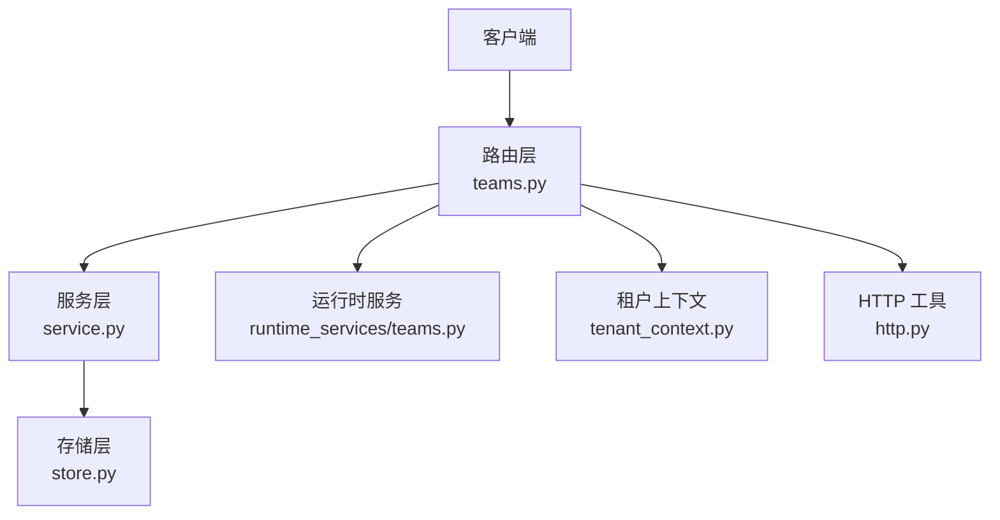
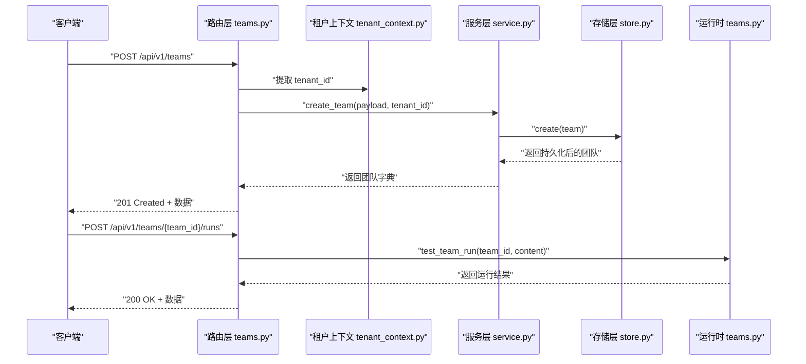
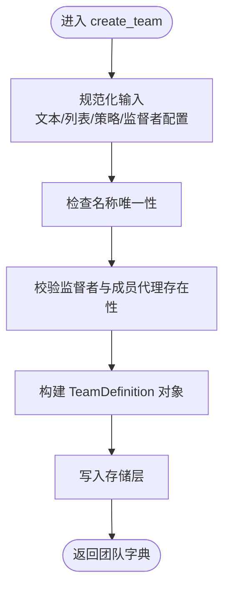
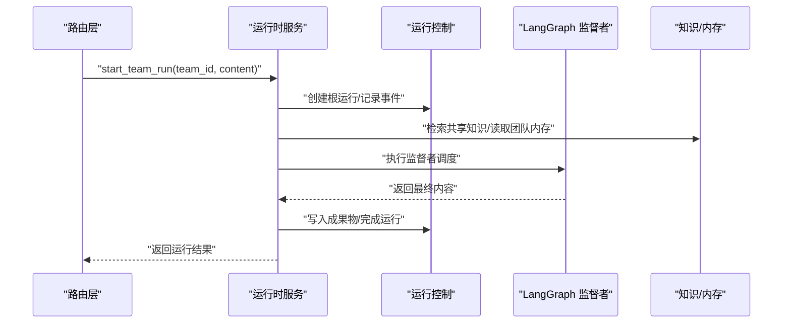
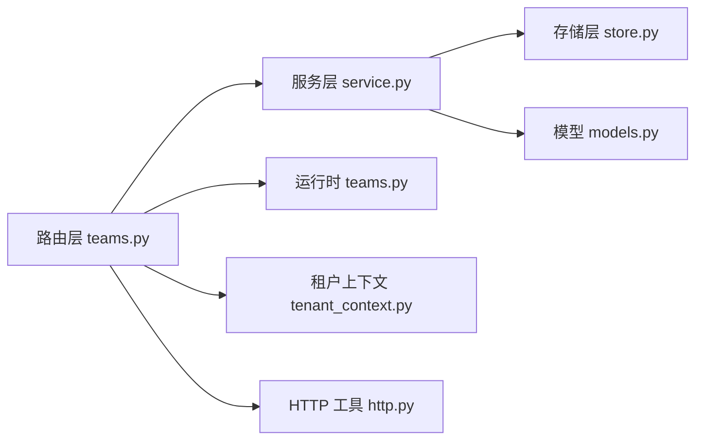

# 团队管理 API

<cite>
**本文档引用的文件**
- [teams.py](file://nanobot/web/routers/teams.py)
- [models.py](file://nanobot/platform/teams/models.py)
- [service.py](file://nanobot/platform/teams/service.py)
- [store.py](file://nanobot/platform/teams/store.py)
- [teams.py](file://nanobot/web/runtime_services/teams.py)
- [tenant_context.py](file://nanobot/web/tenant_context.py)
- [http.py](file://nanobot/web/http.py)
- [test_team_definitions.py](file://tests/test_team_definitions.py)
</cite>

## 目录
1. [简介](#简介)
2. [项目结构](#项目结构)
3. [核心组件](#核心组件)
4. [架构总览](#架构总览)
5. [详细组件分析](#详细组件分析)
6. [依赖关系分析](#依赖关系分析)
7. [性能考虑](#性能考虑)
8. [故障排除指南](#故障排除指南)
9. [结论](#结论)
10. [附录：完整 API 参考](#附录完整-api-参考)

## 简介
本文件为团队管理 API 的权威参考文档，覆盖团队的创建、查询、更新、删除与复制等 RESTful 接口；详述团队状态管理（启用/禁用）、团队运行测试与重试机制；明确团队定义的验证规则、冲突处理与错误响应格式；解释团队 ID 生成规则、租户隔离机制与权限控制；并提供完整的请求/响应示例与常见使用场景。

## 项目结构
团队管理 API 由三层组成：
- 路由层：定义 RESTful 端点与参数校验
- 服务层：实现业务逻辑、数据验证与冲突检测
- 存储层：基于 SQLite 的持久化存储

图表来源
- [teams.py:1-185](file://nanobot/web/routers/teams.py#L1-L185)
- [service.py:1-358](file://nanobot/platform/teams/service.py#L1-L358)
- [store.py:1-201](file://nanobot/platform/teams/store.py#L1-L201)
- [teams.py:1-543](file://nanobot/web/runtime_services/teams.py#L1-L543)
- [tenant_context.py:1-108](file://nanobot/web/tenant_context.py#L1-L108)
- [http.py:1-40](file://nanobot/web/http.py#L1-L40)

章节来源
- [teams.py:1-185](file://nanobot/web/routers/teams.py#L1-L185)
- [service.py:1-358](file://nanobot/platform/teams/service.py#L1-L358)
- [store.py:1-201](file://nanobot/platform/teams/store.py#L1-L201)

## 核心组件
- 路由器：提供团队 CRUD、复制、启停、运行测试与重试接口
- 服务层：负责团队定义的规范化、验证、冲突检测与存储交互
- 存储层：SQLite 表结构与索引设计，支持按租户与实例隔离
- 运行时服务：封装团队运行测试、线程上下文、知识检索与重试流程
- 租户上下文：提取并注入租户标识，支持 API Key 认证与多租户隔离

章节来源
- [teams.py:30-184](file://nanobot/web/routers/teams.py#L30-L184)
- [service.py:35-358](file://nanobot/platform/teams/service.py#L35-L358)
- [store.py:12-201](file://nanobot/platform/teams/store.py#L12-L201)
- [teams.py:16-543](file://nanobot/web/runtime_services/teams.py#L16-L543)
- [tenant_context.py:20-108](file://nanobot/web/tenant_context.py#L20-L108)

## 架构总览
团队管理 API 的调用链路如下：

图表来源
- [teams.py:39-51](file://nanobot/web/routers/teams.py#L39-L51)
- [service.py:317-318](file://nanobot/platform/teams/service.py#L317-L318)
- [store.py:109-141](file://nanobot/platform/teams/store.py#L109-L141)
- [teams.py:502-503](file://nanobot/web/runtime_services/teams.py#L502-L503)

## 详细组件分析

### 路由层（RESTful 端点）
- 列表团队：GET /api/v1/teams?enabled=布尔
- 创建团队：POST /api/v1/teams
- 获取团队详情：GET /api/v1/teams/{team_id}
- 获取团队线程摘要：GET /api/v1/teams/{team_id}/thread
- 获取团队线程消息：GET /api/v1/teams/{team_id}/thread/messages?limit=N
- 更新团队：PUT /api/v1/teams/{team_id}
- 删除团队：DELETE /api/v1/teams/{team_id}
- 复制团队：POST /api/v1/teams/{team_id}/copy
- 启用团队：POST /api/v1/teams/{team_id}/enable
- 禁用团队：POST /api/v1/teams/{team_id}/disable
- 测试运行团队：POST /api/v1/teams/{team_id}/runs
- 重试团队运行：POST /api/v1/teams/{team_id}/runs/{run_id}/retry

章节来源
- [teams.py:30-184](file://nanobot/web/routers/teams.py#L30-L184)

### 服务层（业务逻辑与验证）
- 团队定义模型：包含团队 ID、租户 ID、实例 ID、名称、监督者代理 ID、成员代理 ID 列表、监督者配置、共享知识绑定 ID、成员访问策略、标签、启用状态、团队线程开关、创建/更新时间等字段
- 规范化与验证：
  - 文本字段标准化与必填校验
  - 字符串列表去重与空值过滤
  - 成员代理 ID 不得包含监督者代理
  - 监督者配置递归限制、最大成员调用次数、响应模式（synthesize/last_member/custom）等范围校验
  - 名称唯一性校验（同租户+同实例）
- ID 生成与复制：
  - 基于名称的 slug 化生成基础 ID，若冲突则追加 -2/-3...
  - 复制时默认“名称 Copy”，冲突则追加数字后缀
- 启停控制：通过 set_enabled 切换 enabled 字段

图表来源
- [service.py:180-219](file://nanobot/platform/teams/service.py#L180-L219)
- [service.py:134-151](file://nanobot/platform/teams/service.py#L134-L151)

章节来源
- [models.py:63-143](file://nanobot/platform/teams/models.py#L63-L143)
- [service.py:58-133](file://nanobot/platform/teams/service.py#L58-L133)
- [service.py:134-159](file://nanobot/platform/teams/service.py#L134-L159)

### 存储层（SQLite 持久化）
- 表结构：team_definitions（主键 team_id，外键 tenant_id/instance_id，启用标志，JSON 配置，时间戳）
- 索引：租户+实例+更新时间、启用状态、名称
- 查询：按 ID、按名称（租户+实例）、分页列表（可按启用状态过滤）
- 写入：插入或更新，统一序列化为 JSON 存储

章节来源
- [store.py:15-33](file://nanobot/platform/teams/store.py#L15-L33)
- [store.py:57-107](file://nanobot/platform/teams/store.py#L57-L107)
- [store.py:109-182](file://nanobot/platform/teams/store.py#L109-L182)

### 运行时服务（测试运行与重试）
- 测试运行：
  - 解析任务内容，解析团队定义，创建根运行（team），记录事件，准备知识检索与团队线程上下文，启动 LangGraph 监督者执行，写入 Markdown 成果物，完成运行
- 重试机制：
  - 解析源运行，提取原始任务或预览，合并附加上下文，重新发起运行
- 线程上下文：
  - 维护团队线程会话，记录用户/助手消息，支持摘要与消息查询

图表来源
- [teams.py:414-451](file://nanobot/web/runtime_services/teams.py#L414-L451)
- [teams.py:284-413](file://nanobot/web/runtime_services/teams.py#L284-L413)

章节来源
- [teams.py:16-543](file://nanobot/web/runtime_services/teams.py#L16-L543)

### 错误处理与响应格式
- 统一响应体：success、data、error（含 code、message、details）
- 常见错误码：
  - TEAM_NOT_FOUND：团队不存在
  - TEAM_CONFLICT：名称冲突
  - TEAM_VALIDATION_ERROR：输入验证失败
  - TEAM_RUN_INVALID：测试运行参数无效
  - TEAM_RUN_RETRY_INVALID：重试参数无效
- HTTP 状态码映射：
  - 200：成功获取/更新/删除/启停/测试运行
  - 201：创建成功
  - 400：参数/验证错误
  - 404：未找到
  - 409：冲突

章节来源
- [http.py:11-40](file://nanobot/web/http.py#L11-L40)
- [teams.py:47-50](file://nanobot/web/routers/teams.py#L47-L50)
- [teams.py:95-100](file://nanobot/web/routers/teams.py#L95-L100)
- [teams.py:158-163](file://nanobot/web/routers/teams.py#L158-L163)
- [teams.py:174-183](file://nanobot/web/routers/teams.py#L174-L183)

### 团队 ID 生成规则
- 名称 slug 化：仅保留字母数字，连字符分隔，小写
- 基础 ID：slug 化后的名称
- 冲突处理：若已存在，追加 -2/-3... 直到唯一
- 复制命名：默认“原名 Copy”，冲突追加数字后缀

章节来源
- [service.py:30-32](file://nanobot/platform/teams/service.py#L30-L32)
- [service.py:144-151](file://nanobot/platform/teams/service.py#L144-L151)
- [service.py:153-159](file://nanobot/platform/teams/service.py#L153-L159)

### 租户隔离与权限控制
- 租户提取：从请求上下文中获取 tenant_id，默认为 "default"
- API Key 认证：支持 Authorization Bearer 或 X-API-Key，校验后注入 TenantContext，并可校验 x-tenant-id 头部一致性
- 存储隔离：所有读写均携带 tenant_id 与 instance_id，确保跨租户与跨实例隔离
- 权限控制：前端通过 API Key 调用，后端在路由层统一注入租户上下文，服务层按租户维度进行查询与写入

章节来源
- [tenant_context.py:20-108](file://nanobot/web/tenant_context.py#L20-L108)
- [store.py:57-82](file://nanobot/platform/teams/store.py#L57-L82)
- [store.py:143-197](file://nanobot/platform/teams/store.py#L143-L197)
- [teams.py:35-36](file://nanobot/web/routers/teams.py#L35-L36)

## 依赖关系分析

图表来源
- [teams.py:11-17](file://nanobot/web/routers/teams.py#L11-L17)
- [service.py:9-15](file://nanobot/platform/teams/service.py#L9-L15)
- [models.py:22-143](file://nanobot/platform/teams/models.py#L22-L143)
- [store.py:9-10](file://nanobot/platform/teams/store.py#L9-L10)
- [teams.py:10-13](file://nanobot/web/runtime_services/teams.py#L10-L13)
- [tenant_context.py:20-23](file://nanobot/web/tenant_context.py#L20-L23)
- [http.py:11-24](file://nanobot/web/http.py#L11-L24)

章节来源
- [teams.py:1-185](file://nanobot/web/routers/teams.py#L1-L185)
- [service.py:1-358](file://nanobot/platform/teams/service.py#L1-L358)
- [store.py:1-201](file://nanobot/platform/teams/store.py#L1-L201)
- [models.py:1-143](file://nanobot/platform/teams/models.py#L1-L143)
- [teams.py:1-543](file://nanobot/web/runtime_services/teams.py#L1-L543)
- [tenant_context.py:1-108](file://nanobot/web/tenant_context.py#L1-L108)
- [http.py:1-40](file://nanobot/web/http.py#L1-L40)

## 性能考虑
- 存储层索引：按 tenant_id/instance_id/updated_at 与 enabled 建立索引，提升查询与排序效率
- 分页与限制：线程消息查询支持 limit 参数（1..200），避免一次性返回过多数据
- 异步运行：测试运行采用异步任务，后台执行 LangGraph 监督者，避免阻塞请求
- 缓存与会话：团队线程会话在内存中维护，减少重复读取

章节来源
- [store.py:27-33](file://nanobot/platform/teams/store.py#L27-L33)
- [teams.py:77-78](file://nanobot/web/routers/teams.py#L77-L78)
- [teams.py:414-451](file://nanobot/web/runtime_services/teams.py#L414-L451)

## 故障排除指南
- 400 错误（TEAM_VALIDATION_ERROR）
  - 检查必填字段（如 name、supervisorAgentId）
  - 检查成员代理 ID 是否包含监督者代理
  - 检查监督者配置数值范围（递归限制、最大成员调用次数、响应模式）
- 409 错误（TEAM_CONFLICT）
  - 名称冲突：同一租户+实例下名称必须唯一
  - 复制时名称冲突：系统会自动追加数字后缀
- 404 错误（TEAM_NOT_FOUND）
  - 团队不存在或已被删除
  - 测试运行/重试时传入了错误的 team_id/run_id
- 400 错误（TEAM_RUN_INVALID/TEAM_RUN_RETRY_INVALID）
  - 测试运行缺少 content
  - 重试时源运行没有可复用的任务内容
- 租户隔离问题
  - 确认 API Key 属于目标租户，且 x-tenant-id 头部一致
  - 确认存储层查询携带正确的 tenant_id 与 instance_id

章节来源
- [service.py:58-133](file://nanobot/platform/teams/service.py#L58-L133)
- [service.py:134-159](file://nanobot/platform/teams/service.py#L134-L159)
- [teams.py:47-50](file://nanobot/web/routers/teams.py#L47-L50)
- [teams.py:95-100](file://nanobot/web/routers/teams.py#L95-L100)
- [teams.py:158-163](file://nanobot/web/routers/teams.py#L158-L163)
- [teams.py:174-183](file://nanobot/web/routers/teams.py#L174-L183)
- [tenant_context.py:74-81](file://nanobot/web/tenant_context.py#L74-L81)

## 结论
团队管理 API 提供了完整的团队生命周期管理能力，具备严格的输入验证、冲突检测与租户隔离机制。运行时服务支持团队测试运行与重试，结合知识检索与团队线程上下文，形成闭环的协作工作流。建议在生产环境中配合 API Key 认证与 x-tenant-id 头部校验，确保多租户安全隔离。

## 附录：完整 API 参考

### 通用响应格式
- 成功响应：{"success": true, "data": {...}, "error": null}
- 失败响应：{"success": false, "data": null, "error": {"code": "...", "message": "...", "details": ...}}

章节来源
- [http.py:11-20](file://nanobot/web/http.py#L11-L20)

### 团队管理端点

- GET /api/v1/teams
  - 查询参数：enabled（可选，布尔）
  - 返回：团队列表（按启用状态、更新时间、名称排序）

- POST /api/v1/teams
  - 请求体：团队定义（名称必填，监督者代理必填，成员代理可选，监督者配置可选，其他字段可选）
  - 成功：201，返回新团队对象
  - 错误：400（验证失败），409（名称冲突）

- GET /api/v1/teams/{team_id}
  - 成功：200，返回团队详情
  - 错误：404（团队不存在）

- GET /api/v1/teams/{team_id}/thread
  - 成功：200，返回团队线程摘要（包含线程 ID 与会话摘要）

- GET /api/v1/teams/{team_id}/thread/messages?limit=N
  - 查询参数：limit（1..200，默认 40）
  - 成功：200，返回最近消息列表与总数

- PUT /api/v1/teams/{team_id}
  - 请求体：部分字段更新（名称、描述、监督者代理、成员代理、监督者配置、共享知识绑定、成员访问策略、标签、启用状态、团队线程开关）
  - 成功：200，返回更新后的团队对象
  - 错误：404（团队不存在），409（名称冲突），400（验证失败）

- DELETE /api/v1/teams/{team_id}
  - 成功：200，返回 {"deleted": true}
  - 错误：404（团队不存在）

- POST /api/v1/teams/{team_id}/copy
  - 请求体：可选 { name: "新名称" }（不填则使用“原名 Copy”）
  - 成功：201，返回复制出的新团队对象
  - 错误：404（团队不存在），409（名称冲突），400（验证失败）

- POST /api/v1/teams/{team_id}/enable
  - 成功：200，返回启用后的团队对象

- POST /api/v1/teams/{team_id}/disable
  - 成功：200，返回禁用后的团队对象

- POST /api/v1/teams/{team_id}/runs
  - 请求体：{ content: "任务内容" }
  - 成功：200，返回运行结果（包含团队、根运行、知识命中等）
  - 错误：404（团队不存在），400（content 为空）

- POST /api/v1/teams/{team_id}/runs/{run_id}/retry
  - 请求体：可选 { appendContext: "附加上下文" }
  - 成功：200，返回重试后的运行结果
  - 错误：404（团队不存在），400（源运行不可用或无可用任务内容）

章节来源
- [teams.py:30-184](file://nanobot/web/routers/teams.py#L30-L184)

### 团队定义字段说明
- teamId：团队唯一标识（系统生成）
- tenantId：租户标识（来自请求上下文）
- instanceId：实例标识（服务初始化时指定）
- name：团队名称（必填，唯一）
- supervisorAgentId：监督者代理 ID（必填，必须存在）
- description：描述（可选）
- memberAgentIds：成员代理 ID 列表（可选，不得包含监督者）
- supervisorConfig：监督者配置（可选）
  - recursionLimit：递归限制（5..100）
  - maxMemberCallsPerRun：每轮最大成员调用次数（1..50）
  - responseMode：响应模式（synthesize/last_member/custom）
  - supervisorPromptTemplate：监督者提示模板（可选）
- sharedKnowledgeBindingIds：共享知识绑定 ID 列表（可选）
- memberAccessPolicy：成员访问策略（可选）
- tags：标签列表（可选）
- enabled：是否启用（默认 true）
- teamThreadEnabled：是否启用团队线程（默认 true）
- createdAt/updatedAt：创建与更新时间
- memberCount：成员数量（包含监督者）

章节来源
- [models.py:63-143](file://nanobot/platform/teams/models.py#L63-L143)
- [service.py:95-132](file://nanobot/platform/teams/service.py#L95-L132)

### 常见使用场景
- 创建团队：提交包含 name、supervisorAgentId 的最小集合，系统自动生成 teamId 并返回
- 更新团队：仅提交需要变更的字段，如 description、enabled
- 复制团队：调用复制端点，可指定新名称，系统自动处理名称唯一性
- 测试运行：传入 content 即可立即触发一次团队运行，查看最终结果与知识命中
- 重试运行：基于已有 run_id 重试，可附加上下文以引导后续执行

章节来源
- [test_team_definitions.py:28-83](file://tests/test_team_definitions.py#L28-L83)
- [teams.py:152-184](file://nanobot/web/routers/teams.py#L152-L184)