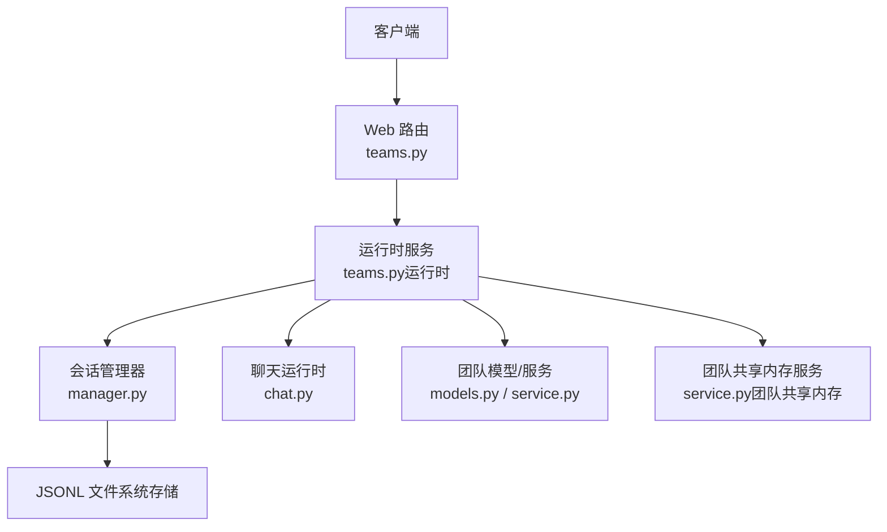
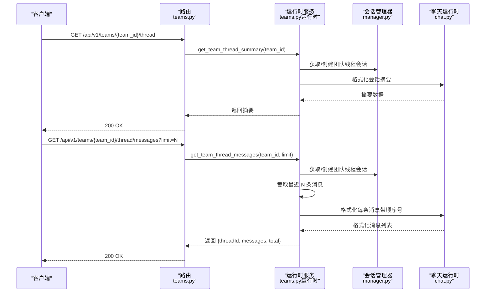
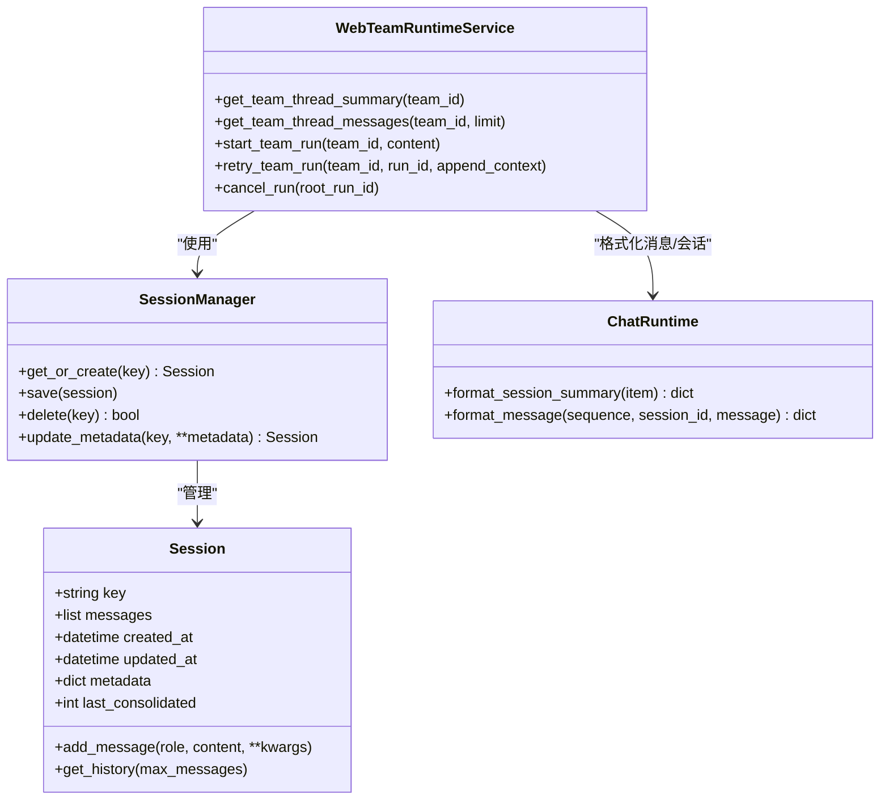
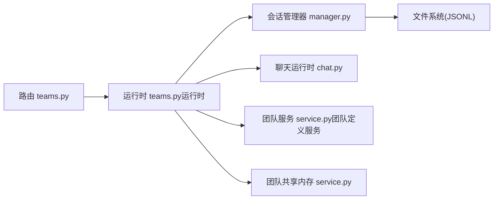

# 团队线程 API

<cite>
**本文引用的文件**
- [teams.py](file://nanobot/web/routers/teams.py)
- [teams.py（运行时）](file://nanobot/web/runtime_services/teams.py)
- [models.py（团队定义）](file://nanobot/platform/teams/models.py)
- [service.py（团队定义服务）](file://nanobot/platform/teams/service.py)
- [manager.py（会话管理器）](file://nanobot/session/manager.py)
- [chat.py（聊天运行时）](file://nanobot/web/runtime_services/chat.py)
- [models.py（内存候选）](file://nanobot/platform/memory/models.py)
- [service.py（团队共享内存）](file://nanobot/platform/memory/service.py)
</cite>

## 目录
1. [简介](#简介)
2. [项目结构](#项目结构)
3. [核心组件](#核心组件)
4. [架构总览](#架构总览)
5. [详细组件分析](#详细组件分析)
6. [依赖分析](#依赖分析)
7. [性能考虑](#性能考虑)
8. [故障排查指南](#故障排查指南)
9. [结论](#结论)
10. [附录](#附录)

## 简介
本文件为“团队线程 API”的权威参考文档，覆盖团队对话线程的获取、消息查询与线程摘要信息的 API 端点；说明线程消息的分页查询机制、消息限制参数与数据格式；解释线程状态跟踪、消息历史管理与实时更新机制；给出线程 ID 规范、消息排序规则与过滤条件；并提供完整的 API 调用示例与集成指南。

## 项目结构
团队线程 API 的实现由三层组成：
- Web 层路由：定义 REST 接口与参数校验
- 运行时服务：负责线程会话生命周期、消息格式化与运行任务编排
- 平台层模型与存储：团队定义、会话持久化与消息序列化

图表来源
- [teams.py:64-83](file://nanobot/web/routers/teams.py#L64-L83)
- [teams.py（运行时）:453-475](file://nanobot/web/runtime_services/teams.py#L453-L475)
- [manager.py（会话管理器）:96-199](file://nanobot/session/manager.py#L96-L199)
- [chat.py（聊天运行时）:55-71](file://nanobot/web/runtime_services/chat.py#L55-L71)
- [models.py（团队定义）:63-82](file://nanobot/platform/teams/models.py#L63-L82)
- [service.py（团队定义服务）:314-327](file://nanobot/platform/teams/service.py#L314-L327)
- [service.py（团队共享内存）:107-125](file://nanobot/platform/memory/service.py#L107-L125)

章节来源
- [teams.py:1-185](file://nanobot/web/routers/teams.py#L1-L185)
- [teams.py（运行时）:1-543](file://nanobot/web/runtime_services/teams.py#L1-L543)
- [manager.py（会话管理器）:1-252](file://nanobot/session/manager.py#L1-L252)
- [chat.py（聊天运行时）:41-133](file://nanobot/web/runtime_services/chat.py#L41-L133)
- [models.py（团队定义）:1-143](file://nanobot/platform/teams/models.py#L1-L143)
- [service.py（团队定义服务）:1-358](file://nanobot/platform/teams/service.py#L1-L358)
- [service.py（团队共享内存）:107-125](file://nanobot/platform/memory/service.py#L107-L125)

## 核心组件
- 团队线程摘要端点：返回线程标识与会话摘要
- 团队线程消息端点：按 limit 分页返回消息列表，并提供总条数
- 运行时服务：负责线程会话创建、消息写入、格式化与运行任务编排
- 会话存储：基于 JSONL 的会话持久化，支持消息追加与元数据保存
- 消息格式化：统一输出消息字段，含顺序号、角色、内容与时间戳等

章节来源
- [teams.py:64-83](file://nanobot/web/routers/teams.py#L64-L83)
- [teams.py（运行时）:453-475](file://nanobot/web/runtime_services/teams.py#L453-L475)
- [manager.py（会话管理器）:16-71](file://nanobot/session/manager.py#L16-L71)
- [chat.py（聊天运行时）:55-71](file://nanobot/web/runtime_services/chat.py#L55-L71)

## 架构总览
团队线程 API 的调用链路如下：

图表来源
- [teams.py:64-83](file://nanobot/web/routers/teams.py#L64-L83)
- [teams.py（运行时）:453-475](file://nanobot/web/runtime_services/teams.py#L453-L475)
- [manager.py（会话管理器）:96-199](file://nanobot/session/manager.py#L96-L199)
- [chat.py（聊天运行时）:55-71](file://nanobot/web/runtime_services/chat.py#L55-L71)

## 详细组件分析

### API 端点与行为
- 获取团队线程摘要
  - 方法与路径：GET /api/v1/teams/{team_id}/thread
  - 行为：确保团队存在，获取或创建团队线程会话，返回 threadId 与会话摘要
  - 错误：当团队不存在时返回 404
- 获取团队线程消息
  - 方法与路径：GET /api/v1/teams/{team_id}/thread/messages
  - 查询参数：
    - limit：整数，默认 40，最小 1，最大 200
  - 行为：截取最近 limit 条消息，按顺序号格式化后返回，同时返回总消息数
  - 错误：当团队不存在时返回 404

章节来源
- [teams.py:64-83](file://nanobot/web/routers/teams.py#L64-L83)

### 线程 ID 规范
- 团队线程标识生成规则：team-thread:{teamId}
- 该规范用于区分不同团队的线程会话键值，避免冲突
- 运行时服务中提供转换函数，便于从 thread_id 解析 team_id

章节来源
- [teams.py（运行时）:35-41](file://nanobot/web/runtime_services/teams.py#L35-L41)
- [service.py（团队共享内存）:127-133](file://nanobot/platform/memory/service.py#L127-L133)

### 消息分页与限制
- 分页策略：服务端直接对会话消息切片，返回最近 N 条
- 限制参数：
  - 默认值：40
  - 最小值：1
  - 最大值：200
- 返回结构：
  - threadId：线程标识
  - messages：格式化后的消息数组（含顺序号、角色、内容、时间戳等）
  - total：会话中消息总数

章节来源
- [teams.py:73-83](file://nanobot/web/routers/teams.py#L73-L83)
- [teams.py（运行时）:462-475](file://nanobot/web/runtime_services/teams.py#L462-L475)
- [chat.py（聊天运行时）:55-71](file://nanobot/web/runtime_services/chat.py#L55-L71)

### 消息排序与过滤
- 排序规则：按消息在会话中的追加顺序递增，顺序号从 1 开始
- 过滤条件：当前实现未提供额外过滤条件，仅支持 limit 截断
- 历史管理：会话采用追加式存储，不修改已加载的消息列表，保证缓存安全

章节来源
- [teams.py（运行时）:466-473](file://nanobot/web/runtime_services/teams.py#L466-L473)
- [manager.py（会话管理器）:46-64](file://nanobot/session/manager.py#L46-L64)

### 数据格式说明
- 消息对象字段：
  - id：消息唯一标识（msg_{sequence}）
  - sessionId：所属会话标识
  - sequence：顺序号（从 1 开始）
  - role：角色（如 user、assistant）
  - content：消息内容
  - createdAt：消息时间戳
  - 可选字段：toolCalls、toolCallId、name（当存在工具调用时）
- 会话摘要对象字段：
  - id/sessionId/title：会话标识、标题
  - createdAt/updatedAt/messageCount：创建与更新时间、消息数量

章节来源
- [chat.py（聊天运行时）:55-71](file://nanobot/web/runtime_services/chat.py#L55-L71)
- [chat.py（聊天运行时）:41-53](file://nanobot/web/runtime_services/chat.py#L41-L53)

### 线程状态跟踪与运行编排
- 状态跟踪：
  - 运行时维护活跃任务映射，用于取消与清理
  - 支持取消团队运行任务，清理状态
- 运行编排：
  - 准备阶段：解析团队配置、构建线程上下文块、创建根运行与事件
  - 执行阶段：LangGraph 团队执行器驱动成员代理协作
  - 完成阶段：写入最终结果、生成制品、标记完成并记录事件
- 线程消息写入：
  - 用户输入与最终回复均写入团队线程会话，持久化到 JSONL 文件

章节来源
- [teams.py（运行时）:219-232](file://nanobot/web/runtime_services/teams.py#L219-L232)
- [teams.py（运行时）:414-451](file://nanobot/web/runtime_services/teams.py#L414-L451)
- [teams.py（运行时）:321-413](file://nanobot/web/runtime_services/teams.py#L321-L413)
- [teams.py（运行时）:70-83](file://nanobot/web/runtime_services/teams.py#L70-L83)

### 实时更新机制
- 当前实现通过同步接口返回最新消息；未提供 WebSocket 或长轮询的实时推送
- 若需实时更新，可在客户端侧进行定时轮询或在网关层引入 SSE/WebSocket（需扩展）

章节来源
- [teams.py:64-83](file://nanobot/web/routers/teams.py#L64-L83)

### 团队线程与共享内存
- 团队共享内存：
  - 提供团队级共享记忆快照读取能力
  - 可作为线程上下文的一部分参与任务执行
- 内存候选：
  - 支持候选记忆的创建、查询与状态变更
  - 用于团队共享记忆的治理与应用

章节来源
- [service.py（团队共享内存）:107-125](file://nanobot/platform/memory/service.py#L107-L125)
- [models.py（内存候选）:14-65](file://nanobot/platform/memory/models.py#L14-L65)

### 类关系图（代码级）

图表来源
- [teams.py（运行时）:16-543](file://nanobot/web/runtime_services/teams.py#L16-L543)
- [manager.py（会话管理器）:16-252](file://nanobot/session/manager.py#L16-L252)
- [chat.py（聊天运行时）:41-133](file://nanobot/web/runtime_services/chat.py#L41-L133)

## 依赖分析
- 路由层依赖运行时服务与平台团队模块
- 运行时服务依赖会话管理器、聊天运行时与团队定义服务
- 会话管理器依赖文件系统进行 JSONL 存储
- 聊天运行时负责消息格式化
- 团队共享内存服务提供团队级共享记忆能力

图表来源
- [teams.py:1-185](file://nanobot/web/routers/teams.py#L1-L185)
- [teams.py（运行时）:1-543](file://nanobot/web/runtime_services/teams.py#L1-L543)
- [manager.py（会话管理器）:1-252](file://nanobot/session/manager.py#L1-L252)
- [chat.py（聊天运行时）:41-133](file://nanobot/web/runtime_services/chat.py#L41-L133)
- [service.py（团队定义服务）:1-358](file://nanobot/platform/teams/service.py#L1-L358)
- [service.py（团队共享内存）:107-125](file://nanobot/platform/memory/service.py#L107-L125)

章节来源
- [teams.py:1-185](file://nanobot/web/routers/teams.py#L1-L185)
- [teams.py（运行时）:1-543](file://nanobot/web/runtime_services/teams.py#L1-L543)
- [manager.py（会话管理器）:1-252](file://nanobot/session/manager.py#L1-L252)
- [chat.py（聊天运行时）:41-133](file://nanobot/web/runtime_services/chat.py#L41-L133)
- [service.py（团队定义服务）:1-358](file://nanobot/platform/teams/service.py#L1-L358)
- [service.py（团队共享内存）:107-125](file://nanobot/platform/memory/service.py#L107-L125)

## 性能考虑
- 消息截断：服务端直接对消息切片，避免全量扫描，复杂度 O(N)
- 顺序号计算：在内存中按当前消息长度计算起始序号，避免重复遍历
- 会话持久化：JSONL 追加写入，减少随机 IO；元数据与消息分离，便于读取
- 限制建议：合理设置 limit，避免一次性拉取过多消息导致响应体过大
- 并发与取消：运行时维护活跃任务映射，支持取消与清理，防止资源泄漏

章节来源
- [teams.py（运行时）:462-475](file://nanobot/web/runtime_services/teams.py#L462-L475)
- [manager.py（会话管理器）:172-199](file://nanobot/session/manager.py#L172-L199)
- [teams.py（运行时）:219-232](file://nanobot/web/runtime_services/teams.py#L219-L232)

## 故障排查指南
- 团队不存在
  - 现象：返回 404，错误码 TEAM_NOT_FOUND
  - 处理：确认 team_id 是否正确，团队是否启用
- 参数越界
  - 现象：limit 小于 1 或大于 200 导致请求失败
  - 处理：调整 limit 到允许范围
- 运行被取消
  - 现象：取消团队运行任务后状态异常
  - 处理：调用取消接口，等待后台任务清理并重试

章节来源
- [teams.py:68-82](file://nanobot/web/routers/teams.py#L68-L82)
- [teams.py（运行时）:524-534](file://nanobot/web/runtime_services/teams.py#L524-L534)

## 结论
团队线程 API 提供了稳定的线程摘要与消息查询能力，结合运行时服务实现了完整的线程生命周期管理。通过 JSONL 会话存储与消息格式化，兼顾性能与可维护性。建议在生产环境中配合限流与缓存策略，并根据需要扩展实时推送能力。

## 附录

### API 调用示例（路径引用）
- 获取团队线程摘要
  - 请求：GET /api/v1/teams/{team_id}/thread
  - 响应字段：threadId、session（包含 id、sessionId、title、createdAt、updatedAt、messageCount）
  - 参考实现位置：[teams.py:64-70](file://nanobot/web/routers/teams.py#L64-L70)，[teams.py（运行时）:453-460](file://nanobot/web/runtime_services/teams.py#L453-L460)
- 获取团队线程消息（默认 limit=40）
  - 请求：GET /api/v1/teams/{team_id}/thread/messages
  - 响应字段：threadId、messages（每条含 id、sessionId、sequence、role、content、createdAt 等）、total
  - 参考实现位置：[teams.py:73-83](file://nanobot/web/routers/teams.py#L73-L83)，[teams.py（运行时）:462-475](file://nanobot/web/runtime_services/teams.py#L462-L475)
- 获取团队线程消息（自定义 limit）
  - 请求：GET /api/v1/teams/{team_id}/thread/messages?limit=100
  - 参考实现位置：[teams.py:73-83](file://nanobot/web/routers/teams.py#L73-L83)

### 集成指南
- 认证与鉴权：在路由层统一处理租户上下文与权限校验
- 限流与熔断：对消息查询接口增加限流策略，避免高并发冲击
- 缓存：对线程摘要可做短期缓存，消息列表建议按需拉取
- 实时更新：若业务需要，可在网关层引入 SSE 或 WebSocket，由运行时服务触发事件推送