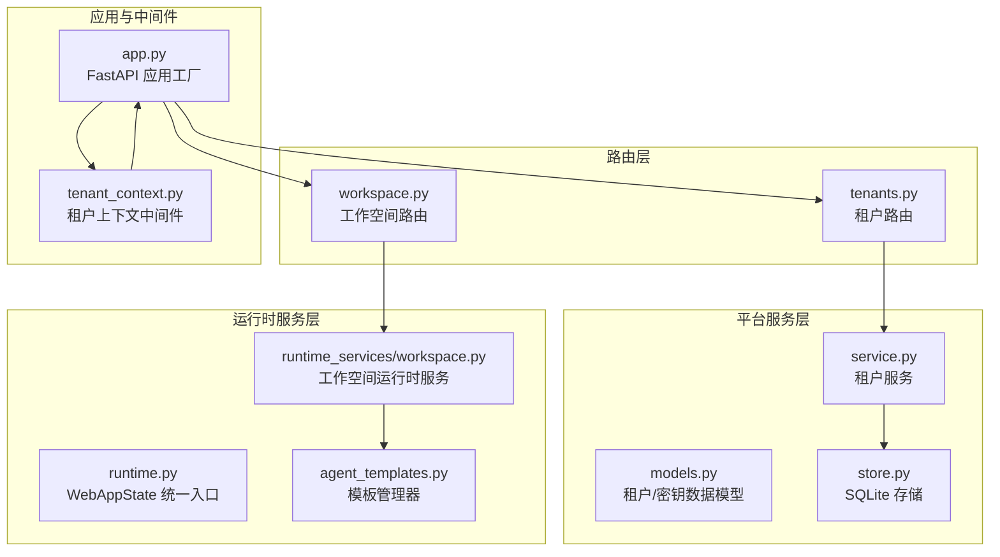
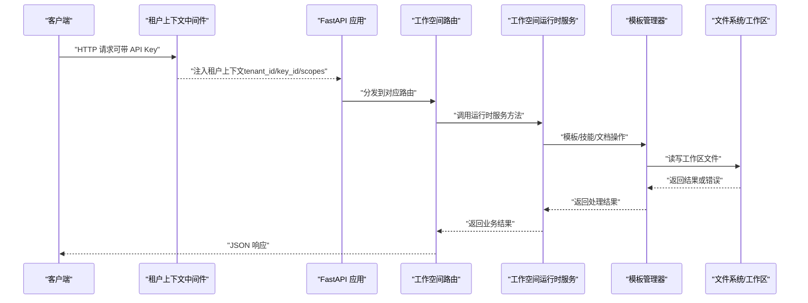
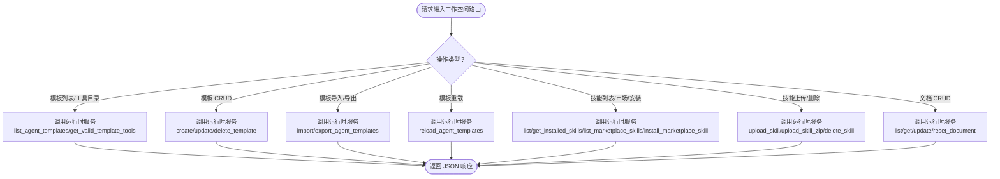
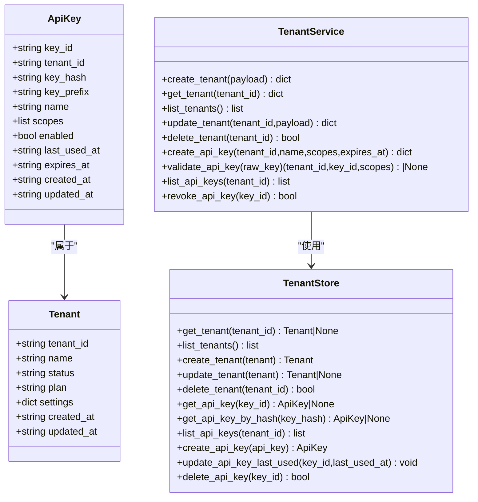
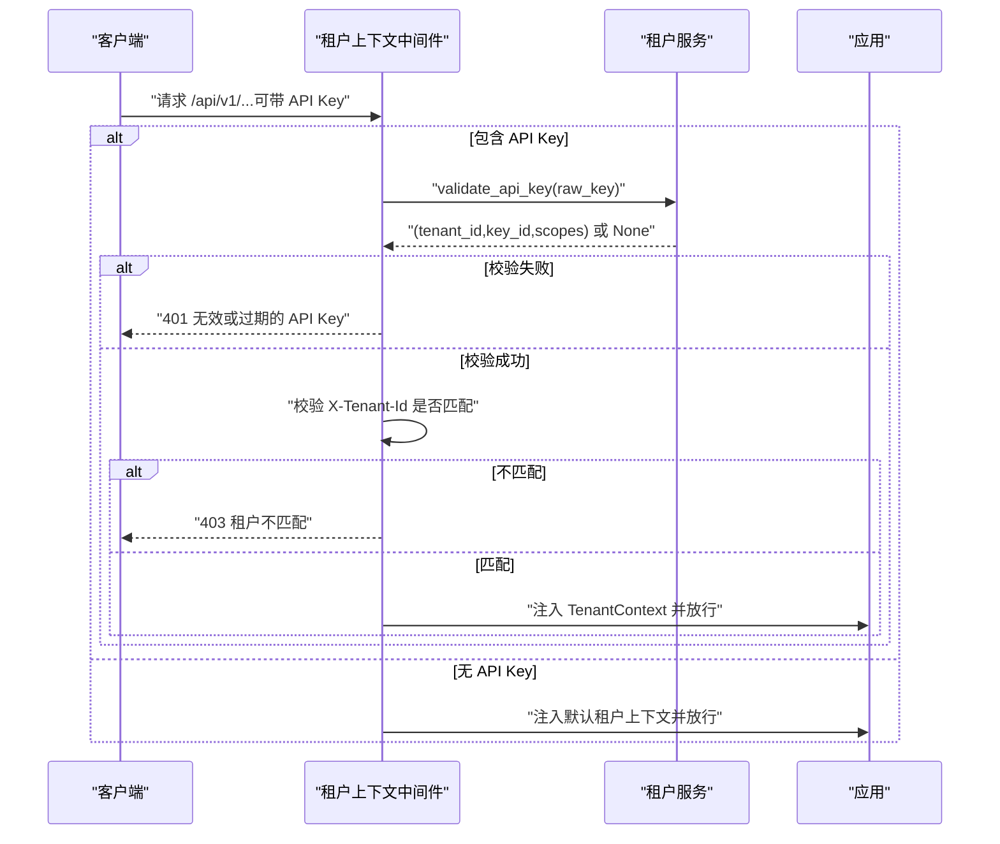
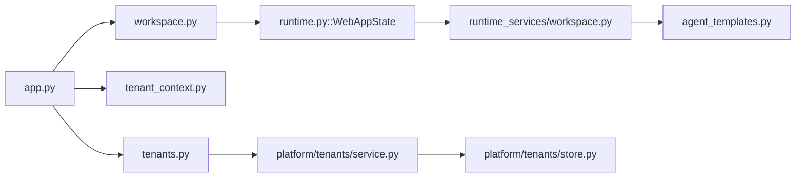

# 工作空间管理 API

<cite>
**本文引用的文件**
- [workspace.py](file://nanobot/web/routers/workspace.py)
- [tenants.py](file://nanobot/web/routers/tenants.py)
- [tenant_context.py](file://nanobot/web/tenant_context.py)
- [models.py](file://nanobot/platform/tenants/models.py)
- [service.py](file://nanobot/platform/tenants/service.py)
- [store.py](file://nanobot/platform/tenants/store.py)
- [app.py](file://nanobot/web/app.py)
- [runtime_services/workspace.py](file://nanobot/web/runtime_services/workspace.py)
- [runtime.py](file://nanobot/web/runtime.py)
- [agent_templates.py](file://nanobot/services/agent_templates.py)
- [schema.py](file://nanobot/config/schema.py)
</cite>

## 目录
1. [简介](#简介)
2. [项目结构](#项目结构)
3. [核心组件](#核心组件)
4. [架构总览](#架构总览)
5. [详细组件分析](#详细组件分析)
6. [依赖分析](#依赖分析)
7. [性能考虑](#性能考虑)
8. [故障排查指南](#故障排查指南)
9. [结论](#结论)
10. [附录](#附录)

## 简介
本文件为工作空间管理 API 的权威参考，覆盖以下主题：
- 工作空间的创建、配置与管理：包括代理模板、技能、文档等资产的增删改查与导入导出。
- 多租户架构下的工作空间隔离：通过租户维度的数据存储与 API 认证实现资源隔离。
- 权限管理与访问控制：基于 API Key 的认证与作用域校验，以及可选的租户 ID 对齐校验。
- 资源配额与监控：通过租户模型扩展字段与运行时服务暴露状态接口支持资源治理。
- 租户上下文切换与审计：请求级租户上下文注入与 API 错误响应格式化。

## 项目结构
工作空间管理 API 由三层组成：
- 路由层（Routers）：定义 REST 接口与请求体模型。
- 运行时服务层（Runtime Services）：封装工作空间资产读写、模板与技能管理、文档操作。
- 平台服务层（Platform Services）：提供租户与 API Key 的持久化与验证能力。

**图表来源**
- [workspace.py:1-245](file://nanobot/web/routers/workspace.py#L1-L245)
- [tenants.py:1-119](file://nanobot/web/routers/tenants.py#L1-L119)
- [tenant_context.py:1-108](file://nanobot/web/tenant_context.py#L1-L108)
- [models.py:1-100](file://nanobot/platform/tenants/models.py#L1-L100)
- [service.py:1-191](file://nanobot/platform/tenants/service.py#L1-L191)
- [store.py:1-222](file://nanobot/platform/tenants/store.py#L1-L222)
- [runtime_services/workspace.py:1-344](file://nanobot/web/runtime_services/workspace.py#L1-L344)
- [runtime.py:1-301](file://nanobot/web/runtime.py#L1-L301)
- [agent_templates.py:1-566](file://nanobot/services/agent_templates.py#L1-L566)

**章节来源**
- [workspace.py:1-245](file://nanobot/web/routers/workspace.py#L1-L245)
- [tenants.py:1-119](file://nanobot/web/routers/tenants.py#L1-L119)
- [tenant_context.py:1-108](file://nanobot/web/tenant_context.py#L1-L108)
- [app.py:1-332](file://nanobot/web/app.py#L1-L332)

## 核心组件
- 工作空间路由（workspace.py）
  - 代理模板：查询、校验工具、创建、导入、导出、重载、获取、更新、删除。
  - 技能：列出已安装、从市场拉取、安装、上传单文件、上传 ZIP、删除。
  - 文档：列出、获取、更新、重置。
- 租户路由（tenants.py）
  - 租户：列表、创建、获取、更新、删除。
  - API Key：列表、创建、吊销。
- 租户上下文中间件（tenant_context.py）
  - 支持 API Key 认证（Bearer 或 X-API-Key），并可校验 X-Tenant-Id 与密钥归属是否一致；未携带密钥时回退到默认租户上下文。
- 平台服务（service.py + store.py + models.py）
  - 租户与 API Key 的 CRUD、哈希校验、过期时间检查、最后使用时间更新。
- 运行时服务（runtime_services/workspace.py + runtime.py + agent_templates.py）
  - 模板工具目录、模板 CRUD、导入导出、技能安装与上传、文档读写与重置。
- 应用与中间件（app.py）
  - 注册路由、注册异常处理器、注册 HTTP 中间件（API Key 优先于 Cookie 认证）、挂载平台服务实例。

**章节来源**
- [workspace.py:47-245](file://nanobot/web/routers/workspace.py#L47-L245)
- [tenants.py:24-119](file://nanobot/web/routers/tenants.py#L24-L119)
- [tenant_context.py:26-108](file://nanobot/web/tenant_context.py#L26-L108)
- [service.py:43-191](file://nanobot/platform/tenants/service.py#L43-L191)
- [store.py:12-222](file://nanobot/platform/tenants/store.py#L12-L222)
- [runtime_services/workspace.py:21-344](file://nanobot/web/runtime_services/workspace.py#L21-L344)
- [runtime.py:72-301](file://nanobot/web/runtime.py#L72-L301)
- [agent_templates.py:207-566](file://nanobot/services/agent_templates.py#L207-L566)
- [app.py:70-280](file://nanobot/web/app.py#L70-L280)

## 架构总览
下图展示工作空间 API 的端到端调用链路与关键组件交互：

**图表来源**
- [tenant_context.py:26-92](file://nanobot/web/tenant_context.py#L26-L92)
- [app.py:225-246](file://nanobot/web/app.py#L225-L246)
- [workspace.py:47-245](file://nanobot/web/routers/workspace.py#L47-L245)
- [runtime_services/workspace.py:21-344](file://nanobot/web/runtime_services/workspace.py#L21-L344)
- [agent_templates.py:207-566](file://nanobot/services/agent_templates.py#L207-L566)

## 详细组件分析

### 工作空间路由与运行时服务
- 代理模板
  - 查询可用工具目录、创建、导入、导出、重载、获取、更新、删除。
  - 导入/导出支持冲突策略（跳过/替换/重命名）与 YAML 格式。
- 技能
  - 列出已安装技能、从市场拉取、安装、上传单文件与 ZIP、删除（内置技能不可删除）。
- 文档
  - 列出文档、获取内容（不存在则回退模板）、更新、重置为模板内容。

**图表来源**
- [workspace.py:47-245](file://nanobot/web/routers/workspace.py#L47-L245)
- [runtime_services/workspace.py:60-344](file://nanobot/web/runtime_services/workspace.py#L60-L344)
- [agent_templates.py:207-566](file://nanobot/services/agent_templates.py#L207-L566)

**章节来源**
- [workspace.py:47-245](file://nanobot/web/routers/workspace.py#L47-L245)
- [runtime_services/workspace.py:21-344](file://nanobot/web/runtime_services/workspace.py#L21-L344)
- [agent_templates.py:207-566](file://nanobot/services/agent_templates.py#L207-L566)

### 租户与 API Key 管理
- 租户
  - 字段：tenantId、name、status、plan、settings、createdAt、updatedAt。
  - 支持创建（自动派生 tenant_id）、获取、列表、更新（仅允许部分字段）、删除。
- API Key
  - 字段：keyId、tenantId、keyHash、keyPrefix、name、scopes、enabled、lastUsedAt、expiresAt、createdAt、updatedAt。
  - 创建：生成原始密钥、哈希存储、返回明文密钥副本；默认作用域为读写。
  - 校验：校验启用状态、过期时间、更新最后使用时间；可选校验 X-Tenant-Id 与密钥归属一致。
- 存储
  - 使用 SQLite 表 tenants 与 api_keys，索引 key_hash 与 tenant_id，确保高效查询与唯一性。

**图表来源**
- [models.py:15-100](file://nanobot/platform/tenants/models.py#L15-L100)
- [service.py:43-191](file://nanobot/platform/tenants/service.py#L43-L191)
- [store.py:12-222](file://nanobot/platform/tenants/store.py#L12-L222)

**章节来源**
- [models.py:15-100](file://nanobot/platform/tenants/models.py#L15-L100)
- [service.py:43-191](file://nanobot/platform/tenants/service.py#L43-L191)
- [store.py:12-222](file://nanobot/platform/tenants/store.py#L12-L222)

### 租户上下文与认证流程
- API Key 优先策略
  - 仅对 /api/v1/ 路径生效；排除 /api/v1/auth/* 与 /api/v1/health。
  - 支持 Authorization: Bearer nk_xxx 与 X-API-Key: nk_xxx。
  - 若提供 API Key，则进行校验并通过后注入 TenantContext；否则回退到默认租户上下文。
- 可选租户 ID 对齐
  - 若请求头 X-Tenant-Id 存在且与密钥归属租户不一致，返回 403。
- Cookie 回退
  - 未携带 API Key 时，仍可通过现有 Cookie 认证逻辑处理非 /api/v1/ 路径与特定路径。

**图表来源**
- [tenant_context.py:26-92](file://nanobot/web/tenant_context.py#L26-L92)
- [service.py:160-191](file://nanobot/platform/tenants/service.py#L160-L191)

**章节来源**
- [tenant_context.py:26-92](file://nanobot/web/tenant_context.py#L26-L92)
- [service.py:160-191](file://nanobot/platform/tenants/service.py#L160-L191)

### 多租户隔离与资源配额
- 隔离机制
  - 数据层面：租户与 API Key 存储分离，模板与技能位于工作区目录，按租户上下文访问。
  - 认证层面：API Key 与租户绑定，可选 X-Tenant-Id 校验，避免跨租户访问。
- 资源配额与监控
  - 租户模型包含 plan 与 settings 字段，可用于承载配额与计费信息。
  - 运行时服务提供系统状态与计划任务状态查询接口，便于资源监控与审计。

**章节来源**
- [models.py:15-51](file://nanobot/platform/tenants/models.py#L15-L51)
- [runtime.py:180-225](file://nanobot/web/runtime.py#L180-L225)

## 依赖分析
- 路由到运行时服务
  - workspace.py 通过 request.app.state.web 调用 WebAppState 方法，后者委托 runtime_services/workspace.py 实现具体功能。
- 运行时服务到模板管理器
  - runtime_services/workspace.py 依赖 agent_templates.py 提供模板工具目录、CRUD、导入导出与技能管理。
- 应用初始化
  - app.py 在 lifespan 中构建 WebAppState，并注入 tenants_service、runs、agents 等服务，同时注册中间件与路由。

**图表来源**
- [workspace.py:47-245](file://nanobot/web/routers/workspace.py#L47-L245)
- [runtime.py:72-301](file://nanobot/web/runtime.py#L72-L301)
- [runtime_services/workspace.py:21-344](file://nanobot/web/runtime_services/workspace.py#L21-L344)
- [agent_templates.py:207-566](file://nanobot/services/agent_templates.py#L207-L566)
- [app.py:70-280](file://nanobot/web/app.py#L70-L280)
- [tenants.py:24-119](file://nanobot/web/routers/tenants.py#L24-L119)
- [service.py:43-191](file://nanobot/platform/tenants/service.py#L43-L191)
- [store.py:12-222](file://nanobot/platform/tenants/store.py#L12-L222)

**章节来源**
- [app.py:70-280](file://nanobot/web/app.py#L70-L280)
- [runtime.py:72-301](file://nanobot/web/runtime.py#L72-L301)

## 性能考虑
- 模板与技能加载
  - 模板管理器在初始化时加载内置与用户模板，建议在变更频繁场景定期调用重载接口以减少磁盘 IO。
- 文件上传与解压
  - 技能 ZIP 上传采用临时目录解压与校验，注意磁盘空间与并发上传的资源占用。
- API Key 校验
  - 通过哈希索引快速定位 API Key，建议保持合理的密钥数量与定期清理过期密钥。

[本节为通用指导，无需特定文件来源]

## 故障排查指南
- API 响应格式
  - 应用统一通过 APIError 返回错误，包含状态码、错误码与详情；前端可据此提示用户。
- 常见错误与定位
  - 400 参数校验失败：检查请求体字段与格式（如模板工具列表、技能名称合法性）。
  - 401 无效或过期 API Key：确认密钥前缀与有效期；必要时重新创建。
  - 403 租户不匹配：核对 X-Tenant-Id 与 API Key 所属租户是否一致。
  - 404 资源不存在：确认模板/技能/文档 ID 是否正确。
  - 409 租户冲突：创建租户时 tenant_id 已存在，需更换或复用。

**章节来源**
- [app.py:205-223](file://nanobot/web/app.py#L205-L223)
- [workspace.py:62-136](file://nanobot/web/routers/workspace.py#L62-L136)
- [tenants.py:35-108](file://nanobot/web/routers/tenants.py#L35-L108)
- [tenant_context.py:66-81](file://nanobot/web/tenant_context.py#L66-L81)

## 结论
工作空间管理 API 通过清晰的路由分层、运行时服务封装与多租户认证机制，提供了完整的模板、技能与文档管理能力。结合租户模型的扩展字段与运行时状态接口，可在多租户场景下实现稳定的资源隔离与可观测性。

[本节为总结，无需特定文件来源]

## 附录

### API 参考概览（按功能分组）

- 代理模板
  - GET /api/v1/agent-templates
  - GET /api/v1/agent-templates/tools/valid
  - POST /api/v1/agent-templates
  - POST /api/v1/agent-templates/import
  - POST /api/v1/agent-templates/export
  - POST /api/v1/agent-templates/reload
  - GET /api/v1/agent-templates/{template_name:path}
  - PATCH /api/v1/agent-templates/{template_name:path}
  - DELETE /api/v1/agent-templates/{template_name:path}

- 技能
  - GET /api/v1/skills/installed
  - GET /api/v1/skills/marketplace?q=&limit=
  - POST /api/v1/skills/install
  - POST /api/v1/skills/upload（multipart）
  - POST /api/v1/skills/upload-zip（multipart）
  - DELETE /api/v1/skills/{skill_id:path}

- 文档
  - GET /api/v1/documents
  - GET /api/v1/documents/{document_id:path}
  - PUT /api/v1/documents/{document_id:path}
  - POST /api/v1/documents/{document_id:path}/reset

- 租户
  - GET /api/v1/tenants
  - POST /api/v1/tenants
  - GET /api/v1/tenants/{tenant_id}
  - PUT /api/v1/tenants/{tenant_id}
  - DELETE /api/v1/tenants/{tenant_id}

- 租户 API Key
  - GET /api/v1/tenants/{tenant_id}/api-keys
  - POST /api/v1/tenants/{tenant_id}/api-keys
  - DELETE /api/v1/api-keys/{key_id}

**章节来源**
- [workspace.py:47-245](file://nanobot/web/routers/workspace.py#L47-L245)
- [tenants.py:24-119](file://nanobot/web/routers/tenants.py#L24-L119)

### 最佳实践
- 认证与授权
  - 生产环境强制使用 API Key（Bearer 或 X-API-Key），并开启 X-Tenant-Id 校验。
  - 为不同用途创建细粒度 API Key（如只读/只写），并设置合理过期时间。
- 资源隔离
  - 将工作区路径置于独立卷，限制工具访问范围（如 restrict_to_workspace），降低风险面。
- 模板与技能管理
  - 使用导入/导出功能标准化团队模板；对第三方技能进行审核后再安装。
- 监控与审计
  - 定期检查 API Key 最后使用时间与租户状态；利用系统状态接口观察运行指标。

[本节为通用指导，无需特定文件来源]