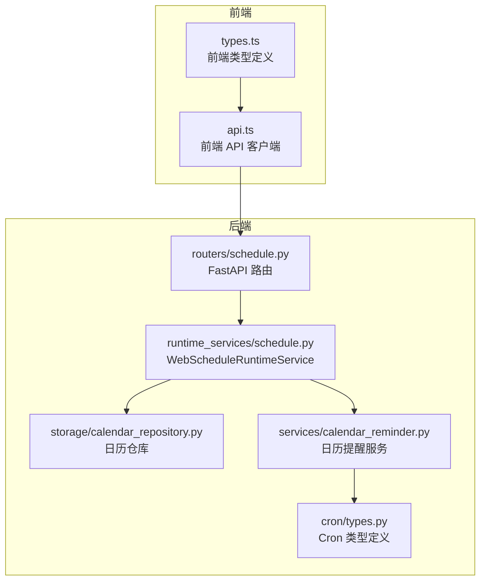
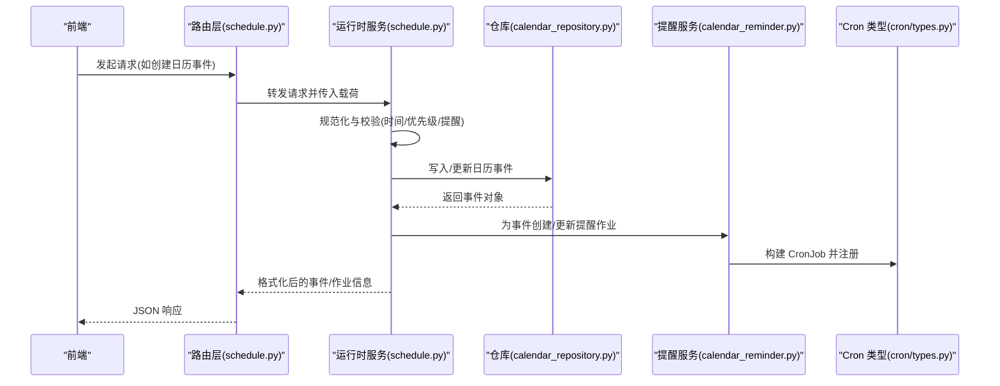
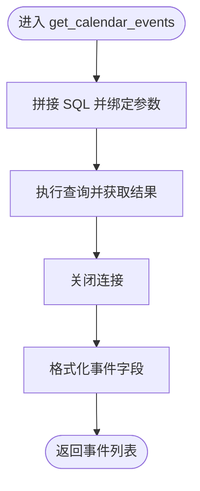
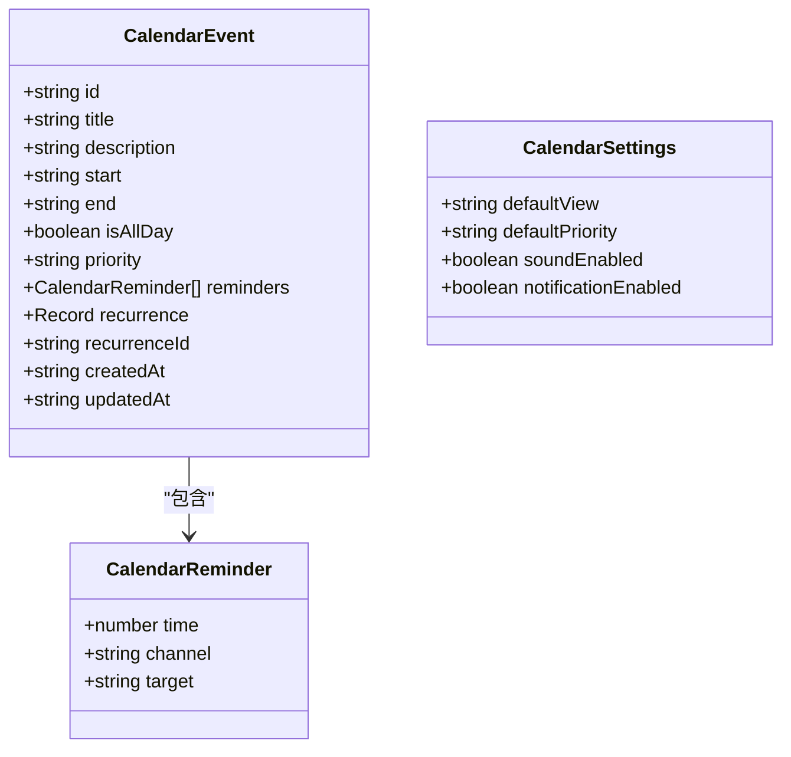
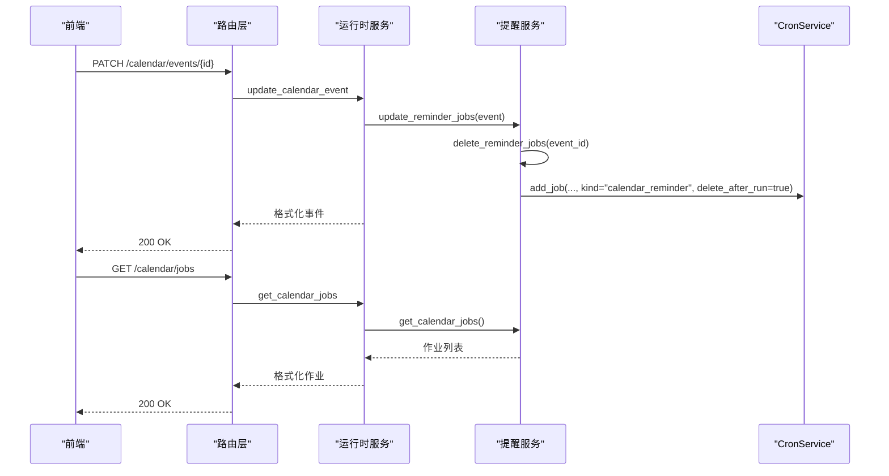
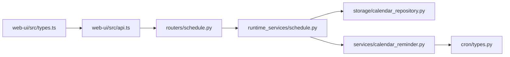

# 日程与日历 API

<cite>
**本文引用的文件**
- [schedule.py（路由）](file://nanobot/web/routers/schedule.py)
- [schedule.py（运行时服务）](file://nanobot/web/runtime_services/schedule.py)
- [calendar_repository.py](file://nanobot/storage/calendar_repository.py)
- [calendar_reminder.py](file://nanobot/services/calendar_reminder.py)
- [types.py（cron 类型）](file://nanobot/cron/types.py)
- [api.ts（前端 API 客户端）](file://web-ui/src/api.ts)
- [types.ts（前端类型定义）](file://web-ui/src/types.ts)
- [test_web_api.py（测试用例）](file://tests/test_web_api.py)
</cite>

## 目录
1. [简介](#简介)
2. [项目结构](#项目结构)
3. [核心组件](#核心组件)
4. [架构总览](#架构总览)
5. [详细组件分析](#详细组件分析)
6. [依赖分析](#依赖分析)
7. [性能考虑](#性能考虑)
8. [故障排查指南](#故障排查指南)
9. [结论](#结论)
10. [附录：API 参考](#附录api-参考)

## 简介
本文件为“日程与日历 API”的权威参考文档，覆盖以下能力：
- 日程 CRUD：创建、查询、更新、删除
- 时间范围查询与批量行为：通过起止时间参数进行范围筛选
- 日历事件管理：标题、描述、全天标记、优先级、提醒、重复字段等
- 提醒机制：基于定时任务的“日历提醒”作业，支持通道与目标会话
- 设置管理：默认视图、默认优先级、声音与通知开关
- 与定时任务系统（Cron）的集成：日历事件变更自动同步提醒作业
- 外部集成与通知：通过通道分发提醒消息到指定会话

本参考文档面向后端开发者、前端工程师与运维人员，既提供高层概览，也给出关键流程与数据结构的深入解析。

## 项目结构
围绕日程与日历 API 的关键模块如下：
- 路由层：定义 REST 接口与请求/响应封装
- 运行时服务层：业务编排、输入校验、格式化输出、与存储与提醒服务交互
- 存储层：SQLite 持久化日历事件与设置
- 提醒服务：将日历事件转换为定时任务作业
- 前端：API 客户端与类型定义，支撑日历页面与提醒作业展示

图表来源
- [schedule.py（路由）:1-161](file://nanobot/web/routers/schedule.py#L1-L161)
- [schedule.py（运行时服务）:1-514](file://nanobot/web/runtime_services/schedule.py#L1-L514)
- [calendar_repository.py:1-276](file://nanobot/storage/calendar_repository.py#L1-L276)
- [calendar_reminder.py:1-120](file://nanobot/services/calendar_reminder.py#L1-L120)
- [types.py（cron 类型）:1-61](file://nanobot/cron/types.py#L1-L61)
- [api.ts（前端 API 客户端）:474-510](file://web-ui/src/api.ts#L474-L510)
- [types.ts（前端类型定义）:326-363](file://web-ui/src/types.ts#L326-L363)

章节来源
- [schedule.py（路由）:1-161](file://nanobot/web/routers/schedule.py#L1-L161)
- [schedule.py（运行时服务）:1-514](file://nanobot/web/runtime_services/schedule.py#L1-L514)
- [calendar_repository.py:1-276](file://nanobot/storage/calendar_repository.py#L1-L276)
- [calendar_reminder.py:1-120](file://nanobot/services/calendar_reminder.py#L1-L120)
- [types.py（cron 类型）:1-61](file://nanobot/cron/types.py#L1-L61)
- [api.ts（前端 API 客户端）:474-510](file://web-ui/src/api.ts#L474-L510)
- [types.ts（前端类型定义）:326-363](file://web-ui/src/types.ts#L326-L363)

## 核心组件
- 路由层（FastAPI）
  - 定义 /api/v1/calendar/* 与 /api/v1/cron/* 的 REST 接口
  - 对外暴露日历事件 CRUD、设置读写、提醒作业查询
- 运行时服务（WebScheduleRuntimeService）
  - 输入规范化与校验（如时间顺序、优先级枚举）
  - 事件与设置的格式化输出
  - 与仓库与提醒服务的编排调用
- 仓库（CalendarRepository）
  - SQLite 表结构：calendar_events、calendar_settings
  - 提供事件与设置的增删改查
- 提醒服务（CalendarReminderService）
  - 将日历事件转换为定时任务作业（CronJob）
  - 支持创建、更新、删除对应事件的提醒作业
- Cron 类型（cron/types.py）
  - CronSchedule/CronPayload/CronJob 数据结构
  - 用于构建与传递定时任务

章节来源
- [schedule.py（路由）:97-160](file://nanobot/web/routers/schedule.py#L97-L160)
- [schedule.py（运行时服务）:181-513](file://nanobot/web/runtime_services/schedule.py#L181-L513)
- [calendar_repository.py:14-276](file://nanobot/storage/calendar_repository.py#L14-L276)
- [calendar_reminder.py:14-120](file://nanobot/services/calendar_reminder.py#L14-L120)
- [types.py（cron 类型）:7-61](file://nanobot/cron/types.py#L7-L61)

## 架构总览
下图展示了从前端到后端各层的调用链路与职责分工：

图表来源
- [schedule.py（路由）:106-138](file://nanobot/web/routers/schedule.py#L106-L138)
- [schedule.py（运行时服务）:463-482](file://nanobot/web/runtime_services/schedule.py#L463-L482)
- [calendar_repository.py:137-231](file://nanobot/storage/calendar_repository.py#L137-L231)
- [calendar_reminder.py:53-101](file://nanobot/services/calendar_reminder.py#L53-L101)
- [types.py（cron 类型）:7-54](file://nanobot/cron/types.py#L7-L54)

## 详细组件分析

### 组件一：日历事件 CRUD 与时间范围查询
- 查询事件
  - 方法：GET
  - 路径：/api/v1/calendar/events
  - 查询参数：start、end（ISO 字符串，用于时间范围过滤）
  - 返回：事件数组（已格式化）
- 创建事件
  - 方法：POST
  - 路径：/api/v1/calendar/events
  - 请求体：事件输入对象（标题、开始/结束时间、是否全天、优先级、提醒、可选重复与重复 ID）
  - 返回：新创建的事件对象
- 更新事件
  - 方法：PATCH
  - 路径：/api/v1/calendar/events/{event_id}
  - 请求体：部分字段更新
  - 返回：更新后的事件对象
- 删除事件
  - 方法：DELETE
  - 路径：/api/v1/calendar/events/{event_id}
  - 返回：删除成功标志
- 时间范围查询逻辑
  - 仓库层按 end_time >= start 且 start_time <= end 条件过滤
  - 结果按开始时间升序排序

图表来源
- [schedule.py（路由）:97-103](file://nanobot/web/routers/schedule.py#L97-L103)
- [schedule.py（运行时服务）:455-461](file://nanobot/web/runtime_services/schedule.py#L455-L461)
- [calendar_repository.py:105-127](file://nanobot/storage/calendar_repository.py#L105-L127)

章节来源
- [schedule.py（路由）:97-138](file://nanobot/web/routers/schedule.py#L97-L138)
- [schedule.py（运行时服务）:455-482](file://nanobot/web/runtime_services/schedule.py#L455-L482)
- [calendar_repository.py:105-135](file://nanobot/storage/calendar_repository.py#L105-L135)
- [test_web_api.py:2541-2563](file://tests/test_web_api.py#L2541-L2563)

### 组件二：日历事件管理（字段与校验）
- 必填与校验
  - 标题：必填，非空
  - 开始/结束时间：必填；结束必须晚于开始
  - 优先级：枚举 high/medium/low
  - 提醒：数组，每项含 time（分钟）、channel（默认 web）、target（默认会话标识）
  - 重复：可选对象（结构未在后端强制解析，前端类型定义允许传入）
- 存储与序列化
  - 事件表包含：id、title、description、start_time、end_time、is_all_day、priority、reminders_json、recurrence_json、recurrence_id、created_at、updated_at
  - 设置表包含：default_view、default_priority、sound_enabled、notification_enabled
- 格式化输出
  - 输出字段统一为前端友好的命名（如 isAllDay、defaultView 等）

图表来源
- [types.ts（前端类型定义）:332-363](file://web-ui/src/types.ts#L332-L363)
- [schedule.py（运行时服务）:182-205](file://nanobot/web/runtime_services/schedule.py#L182-L205)
- [calendar_repository.py:17-43](file://nanobot/storage/calendar_repository.py#L17-L43)

章节来源
- [schedule.py（运行时服务）:207-277](file://nanobot/web/runtime_services/schedule.py#L207-L277)
- [types.ts（前端类型定义）:332-363](file://web-ui/src/types.ts#L332-L363)
- [calendar_repository.py:17-43](file://nanobot/storage/calendar_repository.py#L17-L43)

### 组件三：提醒设置与日历提醒作业
- 设置读取与更新
  - GET /api/v1/calendar/settings
  - PATCH /api/v1/calendar/settings（支持部分更新）
- 日历提醒作业
  - 当创建或更新日历事件时，运行时服务会调用提醒服务
  - 提醒服务根据事件开始时间与每条提醒的提前分钟数，计算触发时间
  - 使用 CronService 注册一次性作业（deleteAfterRun=true），作业类型为 calendar_reminder
  - 作业消息内容包含事件标题与开始时间提示
- 作业查询
  - GET /api/v1/calendar/jobs：列出所有来源为 calendar 的作业

图表来源
- [schedule.py（路由）:118-160](file://nanobot/web/routers/schedule.py#L118-L160)
- [schedule.py（运行时服务）:469-482](file://nanobot/web/runtime_services/schedule.py#L469-L482)
- [calendar_reminder.py:53-119](file://nanobot/services/calendar_reminder.py#L53-L119)
- [types.py（cron 类型）:21-54](file://nanobot/cron/types.py#L21-L54)

章节来源
- [schedule.py（路由）:141-160](file://nanobot/web/routers/schedule.py#L141-L160)
- [schedule.py（运行时服务）:484-513](file://nanobot/web/runtime_services/schedule.py#L484-L513)
- [calendar_reminder.py:53-119](file://nanobot/services/calendar_reminder.py#L53-L119)
- [types.py（cron 类型）:21-54](file://nanobot/cron/types.py#L21-L54)

### 组件四：与定时任务系统的集成
- CronSchedule/CronPayload/CronJob
  - CronSchedule：支持 at/every/cron 三种触发方式
  - CronPayload：支持 kind 为 agent_turn/system_event/calendar_reminder
  - CronJob：包含调度、负载、状态与元信息
- 运行时服务负责：
  - 解析与构建 CronSchedule/CronPayload
  - 注册/更新/删除作业
  - 将作业状态格式化为对外响应结构

章节来源
- [types.py（cron 类型）:7-61](file://nanobot/cron/types.py#L7-L61)
- [schedule.py（运行时服务）:279-357](file://nanobot/web/runtime_services/schedule.py#L279-L357)

## 依赖分析
- 路由层依赖运行时服务提供的业务方法
- 运行时服务依赖仓库与提醒服务
- 提醒服务依赖 CronService 与 Cron 类型
- 前端通过 api.ts 调用后端接口，并使用 types.ts 中的类型定义

图表来源
- [schedule.py（路由）:1-161](file://nanobot/web/routers/schedule.py#L1-L161)
- [schedule.py（运行时服务）:1-514](file://nanobot/web/runtime_services/schedule.py#L1-L514)
- [calendar_repository.py:1-276](file://nanobot/storage/calendar_repository.py#L1-L276)
- [calendar_reminder.py:1-120](file://nanobot/services/calendar_reminder.py#L1-L120)
- [types.py（cron 类型）:1-61](file://nanobot/cron/types.py#L1-L61)
- [api.ts（前端 API 客户端）:474-510](file://web-ui/src/api.ts#L474-L510)
- [types.ts（前端类型定义）:326-363](file://web-ui/src/types.ts#L326-L363)

## 性能考虑
- 查询优化
  - 事件表对 start_time 与 recurrence_id 建有索引，有助于范围查询与重复事件检索
- 写入与事务
  - 单条事件写入使用一次事务提交，保证一致性
- 提醒作业
  - 一次性提醒作业在触发后自动删除，避免长期堆积
- 前端缓存与批处理
  - 建议前端对事件列表与设置进行本地缓存，减少重复请求
  - 批量更新事件时，建议合并请求以降低往返开销

章节来源
- [calendar_repository.py:33-34](file://nanobot/storage/calendar_repository.py#L33-L34)
- [calendar_repository.py:137-183](file://nanobot/storage/calendar_repository.py#L137-L183)
- [calendar_reminder.py:103-110](file://nanobot/services/calendar_reminder.py#L103-L110)

## 故障排查指南
- 常见错误码
  - CALENDAR_EVENT_NOT_FOUND：更新/删除不存在的事件
  - CALENDAR_VALIDATION_ERROR：输入校验失败（如时间顺序、优先级非法）
  - CALENDAR_SETTINGS_INVALID：设置值不在允许范围内
- 排查步骤
  - 确认请求体字段是否符合类型定义与校验规则
  - 检查时间范围参数是否为合法 ISO 字符串
  - 查看后端日志中的警告/错误信息（如提醒跳过原因）
  - 通过 GET /api/v1/calendar/jobs 验证提醒作业是否存在与状态
- 测试参考
  - 可参考测试用例验证 CRUD 与设置更新流程

章节来源
- [schedule.py（路由）:118-155](file://nanobot/web/routers/schedule.py#L118-L155)
- [schedule.py（运行时服务）:231-234](file://nanobot/web/runtime_services/schedule.py#L231-L234)
- [test_web_api.py:2541-2603](file://tests/test_web_api.py#L2541-L2603)

## 结论
本日程与日历 API 以清晰的分层设计实现事件 CRUD、时间范围查询、提醒作业管理与设置控制。通过与定时任务系统的深度集成，实现了从事件到提醒的自动化闭环。前端类型与客户端进一步提升了易用性与一致性。后续可在重复规则的标准化与冲突检测方面扩展，以满足更复杂的日程编排需求。

## 附录：API 参考

- 日历事件
  - GET /api/v1/calendar/events?start={iso}&end={iso}
    - 返回：事件数组
  - POST /api/v1/calendar/events
    - 请求体：事件输入对象（标题、开始/结束时间、是否全天、优先级、提醒、可选重复）
    - 返回：新事件
  - PATCH /api/v1/calendar/events/{event_id}
    - 请求体：部分字段更新
    - 返回：更新后事件
  - DELETE /api/v1/calendar/events/{event_id}
    - 返回：删除成功标志
- 日历设置
  - GET /api/v1/calendar/settings
    - 返回：当前设置
  - PATCH /api/v1/calendar/settings
    - 请求体：部分设置更新
    - 返回：更新后设置
- 日历提醒作业
  - GET /api/v1/calendar/jobs
    - 返回：来源为 calendar 的作业列表

章节来源
- [schedule.py（路由）:97-160](file://nanobot/web/routers/schedule.py#L97-L160)
- [api.ts（前端 API 客户端）:479-510](file://web-ui/src/api.ts#L479-L510)
- [types.ts（前端类型定义）:332-363](file://web-ui/src/types.ts#L332-L363)