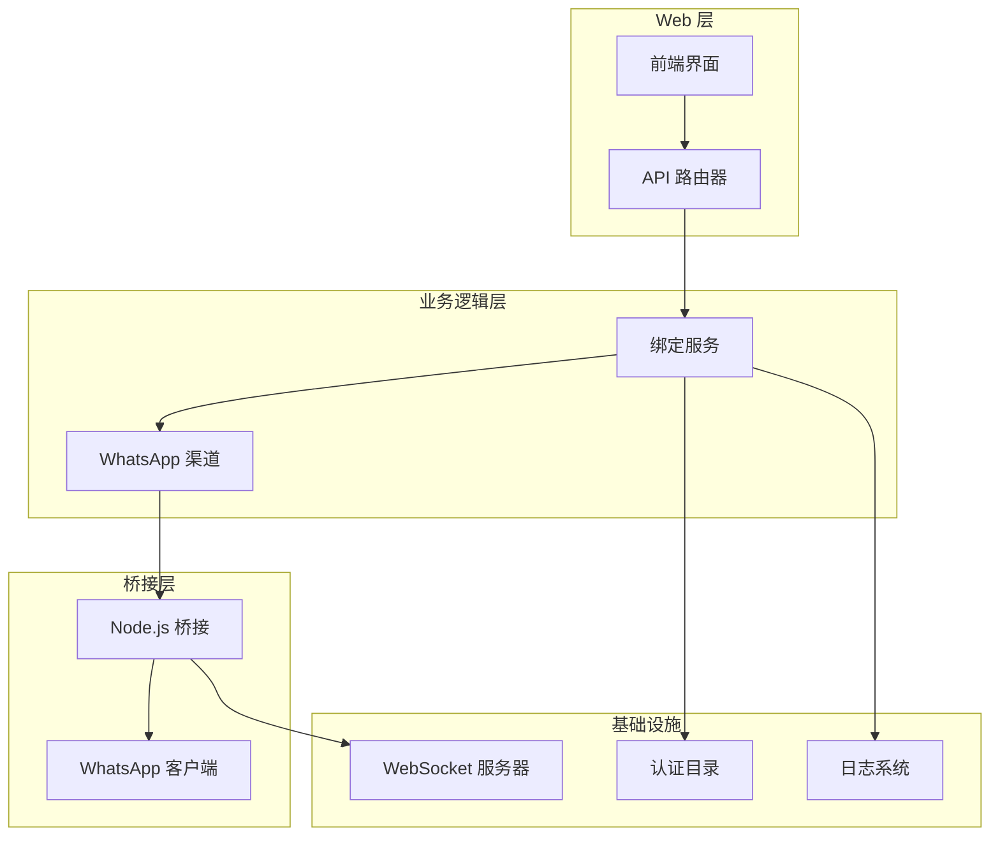
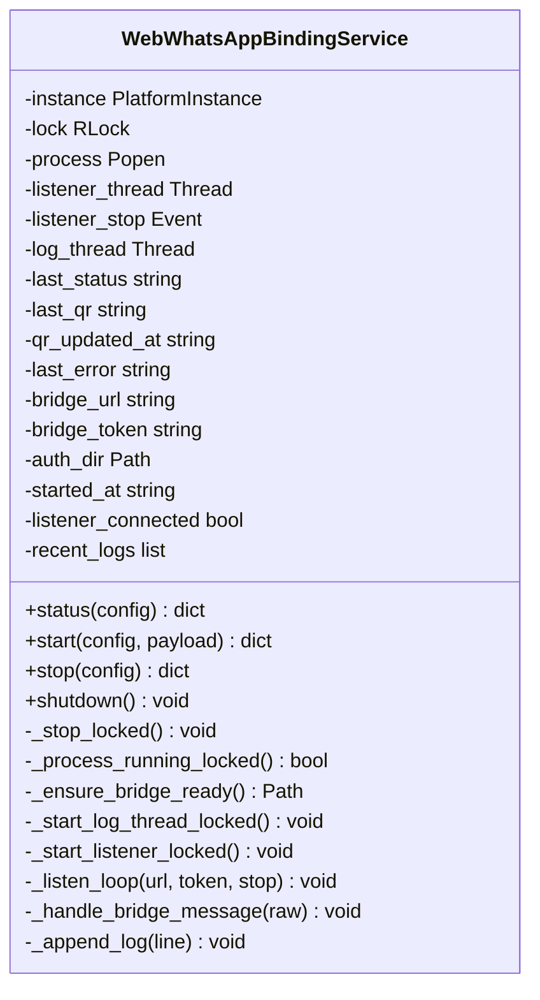
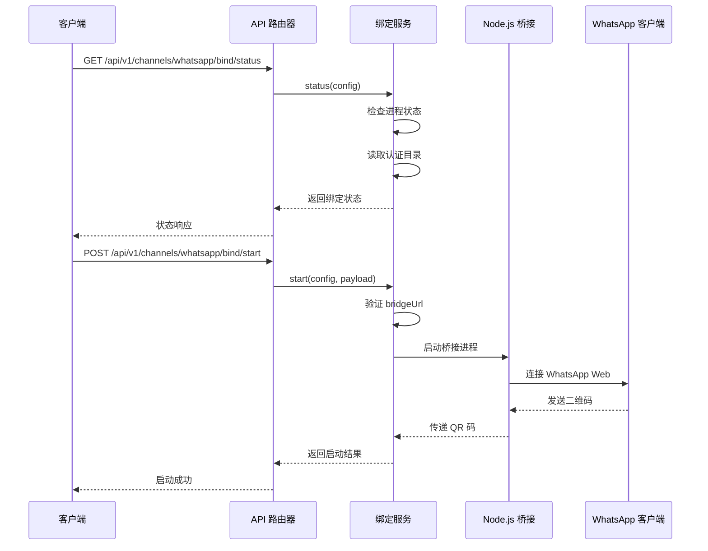
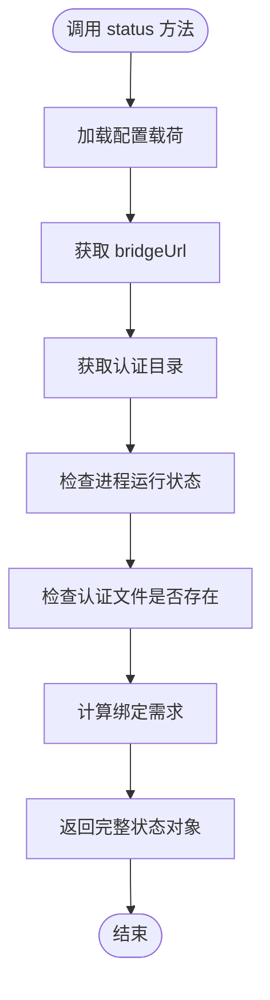
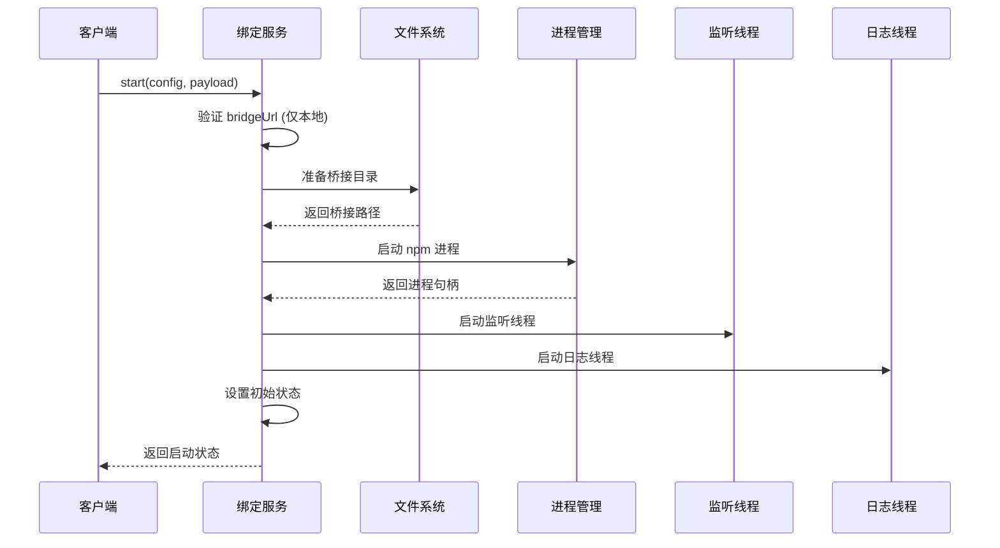
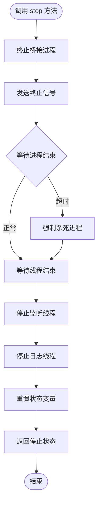
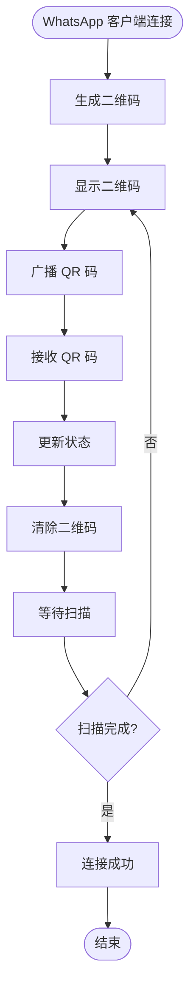
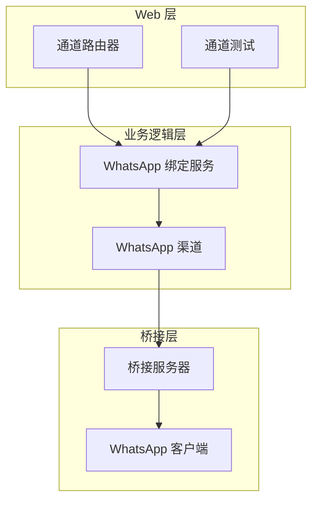
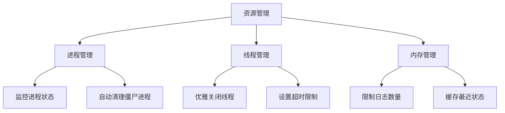

# WhatsApp 绑定 API

<cite>
**本文档引用的文件**
- [nanobot/web/whatsapp_binding.py](file://nanobot/web/whatsapp_binding.py)
- [nanobot/web/routers/channels.py](file://nanobot/web/routers/channels.py)
- [nanobot/channels/whatsapp.py](file://nanobot/channels/whatsapp.py)
- [bridge/src/whatsapp.ts](file://bridge/src/whatsapp.ts)
- [bridge/src/server.ts](file://bridge/src/server.ts)
- [nanobot/config/schema.py](file://nanobot/config/schema.py)
- [nanobot/web/channel_testing.py](file://nanobot/web/channel_testing.py)
- [web-ui/src/pages/ChannelDetailPage.tsx](file://web-ui/src/pages/ChannelDetailPage.tsx)
- [tests/test_web_api.py](file://tests/test_web_api.py)
</cite>

## 目录
1. [简介](#简介)
2. [项目结构](#项目结构)
3. [核心组件](#核心组件)
4. [架构概览](#架构概览)
5. [详细组件分析](#详细组件分析)
6. [依赖关系分析](#依赖关系分析)
7. [性能考虑](#性能考虑)
8. [故障排除指南](#故障排除指南)
9. [结论](#结论)

## 简介

WhatsApp 绑定 API 是 nanobot 项目中的一个关键功能模块，用于管理 WhatsApp 与系统之间的绑定流程。该模块提供了完整的绑定生命周期管理，包括二维码生成、扫描验证和会话建立等功能。

该 API 主要服务于以下目标：
- 提供 WhatsApp 绑定状态查询接口
- 支持启动和停止绑定流程
- 实现二维码生成和扫描验证机制
- 管理会话建立和连接状态
- 提供绑定超时处理和重新绑定机制

## 项目结构

WhatsApp 绑定功能涉及多个层次的组件协作：



**图表来源**
- [nanobot/web/whatsapp_binding.py:43-92](file://nanobot/web/whatsapp_binding.py#L43-L92)
- [bridge/src/server.ts:20-68](file://bridge/src/server.ts#L20-L68)

**章节来源**
- [nanobot/web/whatsapp_binding.py:1-339](file://nanobot/web/whatsapp_binding.py#L1-L339)
- [bridge/src/whatsapp.ts:1-240](file://bridge/src/whatsapp.ts#L1-L240)

## 核心组件

### API 路由器

系统提供了三个主要的 API 端点来管理 WhatsApp 绑定：

| 端点 | 方法 | 描述 |
|------|------|------|
| `/api/v1/channels/whatsapp/bind/status` | GET | 获取绑定状态 |
| `/api/v1/channels/whatsapp/bind/start` | POST | 启动绑定流程 |
| `/api/v1/channels/whatsapp/bind/stop` | POST | 停止绑定流程 |

### 绑定服务类

`WebWhatsAppBindingService` 是核心的服务类，负责管理整个绑定流程：



**图表来源**
- [nanobot/web/whatsapp_binding.py:43-339](file://nanobot/web/whatsapp_binding.py#L43-L339)

**章节来源**
- [nanobot/web/routers/channels.py:96-122](file://nanobot/web/routers/channels.py#L96-L122)
- [nanobot/web/whatsapp_binding.py:43-339](file://nanobot/web/whatsapp_binding.py#L43-L339)

## 架构概览

WhatsApp 绑定系统的整体架构采用分层设计，确保了良好的可维护性和扩展性：



**图表来源**
- [nanobot/web/routers/channels.py:96-122](file://nanobot/web/routers/channels.py#L96-L122)
- [nanobot/web/whatsapp_binding.py:94-158](file://nanobot/web/whatsapp_binding.py#L94-L158)
- [bridge/src/server.ts:27-68](file://bridge/src/server.ts#L27-L68)

## 详细组件分析

### 绑定状态管理

绑定状态通过 `status()` 方法统一管理，返回包含以下关键信息的对象：



**图表来源**
- [nanobot/web/whatsapp_binding.py:64-92](file://nanobot/web/whatsapp_binding.py#L64-L92)

### 启动绑定流程

启动绑定流程包含多个步骤，确保安全性和可靠性：



**图表来源**
- [nanobot/web/whatsapp_binding.py:94-158](file://nanobot/web/whatsapp_binding.py#L94-L158)

### 停止绑定流程

停止绑定流程需要清理所有相关资源：



**图表来源**
- [nanobot/web/whatsapp_binding.py:160-190](file://nanobot/web/whatsapp_binding.py#L160-L190)

### 二维码生成和处理

二维码生成和处理是绑定流程的核心部分：



**图表来源**
- [bridge/src/whatsapp.ts:80-88](file://bridge/src/whatsapp.ts#L80-L88)
- [bridge/src/server.ts:34-39](file://bridge/src/server.ts#L34-L39)
- [nanobot/web/whatsapp_binding.py:311-330](file://nanobot/web/whatsapp_binding.py#L311-L330)

**章节来源**
- [bridge/src/whatsapp.ts:80-109](file://bridge/src/whatsapp.ts#L80-L109)
- [bridge/src/server.ts:101-108](file://bridge/src/server.ts#L101-L108)
- [nanobot/web/whatsapp_binding.py:311-330](file://nanobot/web/whatsapp_binding.py#L311-L330)

## 依赖关系分析

### 外部依赖

系统依赖于以下外部组件：

```mermaid
graph TB
subgraph "核心依赖"
NodeJS[Node.js >= 18]
npm[npm 包管理器]
Baileys[@whiskeysockets/baileys]
WebSocket[WebSocket 协议]
end
subgraph "Python 依赖"
FastAPI[FastAPI Web 框架]
WebSockets[websockets 库]
Loguru[loguru 日志库]
Pydantic[Pydantic 配置验证]
end
subgraph "系统依赖"
Localhost[127.0.0.1 本地回环]
AuthDir[认证目录权限]
MediaDir[媒体下载目录]
end
NodeJS --> Baileys
npm --> NodeJS
WebSocket --> Baileys
FastAPI --> WebSockets
WebSockets --> WebSocket
Pydantic --> FastAPI
Localhost --> WebSocket
AuthDir --> Baileys
MediaDir --> Baileys
```

**图表来源**
- [nanobot/web/whatsapp_binding.py:200-244](file://nanobot/web/whatsapp_binding.py#L200-L244)
- [bridge/src/server.ts:27-31](file://bridge/src/server.ts#L27-L31)

### 内部组件依赖



**图表来源**
- [nanobot/web/routers/channels.py:13-122](file://nanobot/web/routers/channels.py#L13-L122)
- [nanobot/web/whatsapp_binding.py:43-92](file://nanobot/web/whatsapp_binding.py#L43-L92)
- [bridge/src/server.ts:20-68](file://bridge/src/server.ts#L20-L68)

**章节来源**
- [nanobot/web/routers/channels.py:13-122](file://nanobot/web/routers/channels.py#L13-L122)
- [nanobot/web/whatsapp_binding.py:43-339](file://nanobot/web/whatsapp_binding.py#L43-L339)

## 性能考虑

### 并发处理

系统采用多线程架构来处理并发操作：

- **监听线程**：独立处理 WebSocket 连接和消息接收
- **日志线程**：异步处理进程输出和错误日志
- **锁机制**：使用 RLock 确保线程安全的状态访问

### 资源管理



### 连接优化

- **自动重连**：WebSocket 断开后自动重连
- **心跳检测**：定期检查连接状态
- **错误恢复**：异常情况下的自动恢复机制

## 故障排除指南

### 常见问题及解决方案

#### 1. npm 未安装

**症状**：启动绑定时报错提示 npm 未安装

**原因**：系统缺少 Node.js 环境

**解决方案**：
- 安装 Node.js >= 18
- 确保 npm 在 PATH 中可用
- 重新启动绑定流程

#### 2. bridgeUrl 验证失败

**症状**：启动时报错 "当前内置绑定流程只支持本机桥接地址"

**原因**：bridgeUrl 不是 127.0.0.1 或 localhost

**解决方案**：
- 使用 `ws://127.0.0.1:3001` 格式
- 确保端口 3001 可用
- 检查防火墙设置

#### 3. 认证失败

**症状**：绑定过程中出现认证错误

**原因**：BRIDGE_TOKEN 不匹配或过期

**解决方案**：
- 检查 BRIDGE_TOKEN 配置
- 重新生成令牌
- 确保令牌在有效期内

#### 4. 进程启动失败

**症状**：bridge 进程启动后立即退出

**原因**：npm install 或 npm run build 失败

**解决方案**：
- 检查网络连接
- 清理 node_modules 缓存
- 查看详细错误日志

### 调试工具

#### 绑定状态检查

通过以下 API 检查当前绑定状态：

```bash
curl -X GET "http://localhost:8080/api/v1/channels/whatsapp/bind/status"
```

#### 最近日志查看

系统会保留最近 20 条日志，可用于诊断问题：

```bash
curl -X GET "http://localhost:8080/api/v1/channels/whatsapp/bind/status" | jq '.data.recentLogs'
```

#### 通道测试

使用通道测试功能验证连接：

```bash
curl -X POST "http://localhost:8080/api/v1/channels/whatsapp/test" \
  -H "Content-Type: application/json" \
  -d '{"bridgeUrl":"ws://127.0.0.1:3001","bridgeToken":"your-token"}'
```

**章节来源**
- [nanobot/web/whatsapp_binding.py:200-244](file://nanobot/web/whatsapp_binding.py#L200-L244)
- [nanobot/web/channel_testing.py:378-399](file://nanobot/web/channel_testing.py#L378-L399)

## 结论

WhatsApp 绑定 API 提供了一个完整、可靠的 WhatsApp 与系统集成解决方案。通过分层架构设计和完善的错误处理机制，该系统能够：

- **简化绑定流程**：从复杂的二维码扫描到会话建立，提供直观的操作界面
- **增强安全性**：本地回环连接和可选的令牌认证机制
- **提高可靠性**：自动重连、错误恢复和资源清理机制
- **便于维护**：清晰的代码结构和完善的日志系统

该 API 为开发者提供了灵活的扩展能力，可以根据具体需求进行定制和优化。建议在生产环境中启用 BRIDGE_TOKEN 认证，并定期监控绑定状态以确保系统稳定运行。