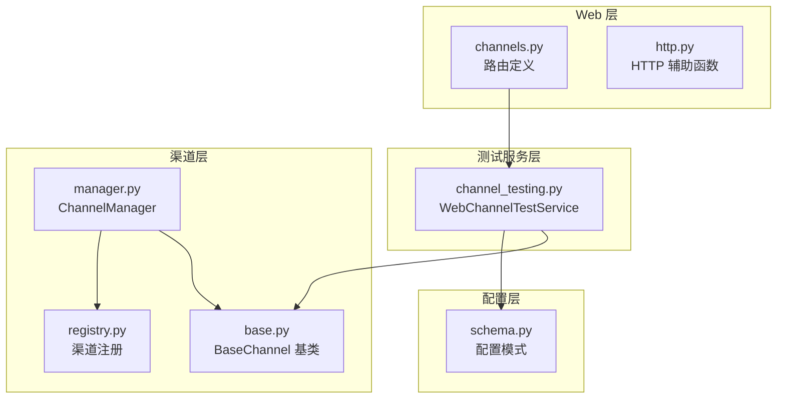
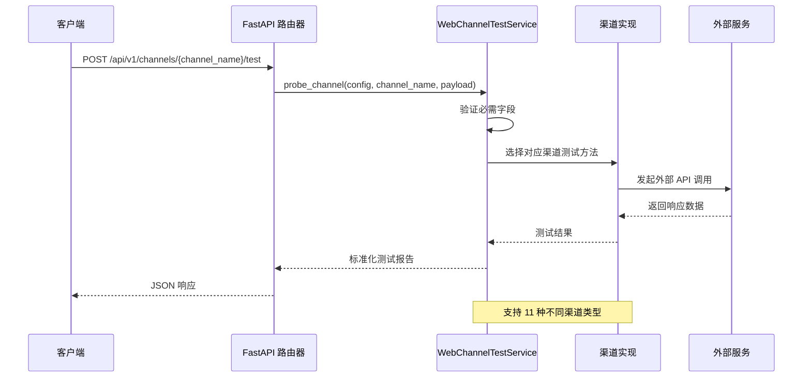
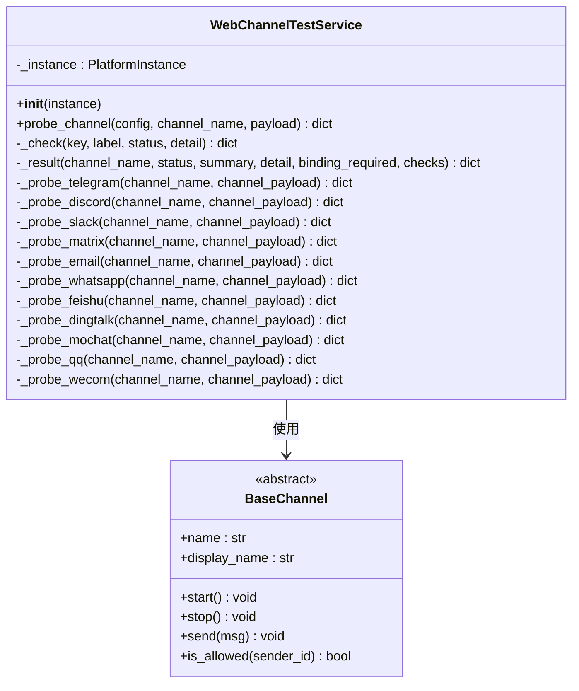
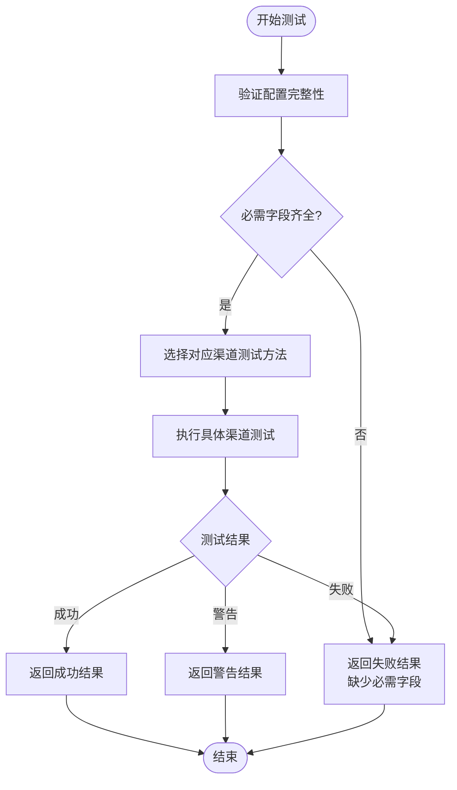
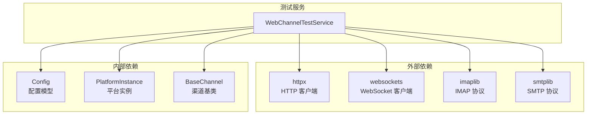

# 渠道测试 API

<cite>
**本文档引用的文件**
- [channel_testing.py](file://nanobot/web/channel_testing.py)
- [channels.py](file://nanobot/web/routers/channels.py)
- [schema.py](file://nanobot/config/schema.py)
- [http.py](file://nanobot/web/http.py)
- [base.py](file://nanobot/channels/base.py)
- [manager.py](file://nanobot/channels/manager.py)
- [registry.py](file://nanobot/channels/registry.py)
- [README.md](file://README.md)
</cite>

## 目录
1. [简介](#简介)
2. [项目结构](#项目结构)
3. [核心组件](#核心组件)
4. [架构概览](#架构概览)
5. [详细组件分析](#详细组件分析)
6. [依赖关系分析](#依赖关系分析)
7. [性能考虑](#性能考虑)
8. [故障排除指南](#故障排除指南)
9. [结论](#结论)

## 简介

渠道测试 API 是 nanobot 平台中用于验证各种聊天渠道连接性和认证状态的核心功能模块。该 API 允许用户在不启动完整服务的情况下，对不同渠道的配置进行快速连通性检查和故障诊断。

本 API 支持多种主流聊天平台，包括 Telegram、Discord、WhatsApp、Feishu、DingTalk、Slack、Email、QQ、WeCom 和 Mochat 等渠道类型。每个渠道都有专门的测试逻辑，涵盖网络连接验证、认证状态检查和基本功能测试。

## 项目结构

渠道测试功能主要分布在以下模块中：

**图表来源**
- [channels.py:1-123](file://nanobot/web/routers/channels.py#L1-L123)
- [channel_testing.py:81-131](file://nanobot/web/channel_testing.py#L81-L131)
- [schema.py:11-200](file://nanobot/config/schema.py#L11-L200)

**章节来源**
- [channels.py:1-123](file://nanobot/web/routers/channels.py#L1-L123)
- [channel_testing.py:81-131](file://nanobot/web/channel_testing.py#L81-L131)

## 核心组件

### WebChannelTestService 类

`WebChannelTestService` 是渠道测试的核心服务类，负责执行各种渠道的连接性检查。该类提供了统一的接口来测试不同类型的渠道配置。

主要功能特性：
- 支持 11 种不同类型的渠道测试
- 提供轻量级的连接性检查
- 包含详细的错误诊断信息
- 支持临时配置覆盖测试

### 渠道测试端点

系统提供以下主要的测试端点：

| 端点 | 方法 | 描述 |
|------|------|------|
| `/api/v1/channels/{channel_name}/test` | POST | 对指定渠道进行连接性测试 |
| `/api/v1/channels/whatsapp/bind/status` | GET | 获取 WhatsApp 绑定状态 |
| `/api/v1/channels/whatsapp/bind/start` | POST | 开始 WhatsApp 绑定流程 |
| `/api/v1/channels/whatsapp/bind/stop` | POST | 停止 WhatsApp 绑定流程 |

**章节来源**
- [channels.py:76-123](file://nanobot/web/routers/channels.py#L76-L123)
- [channel_testing.py:81-131](file://nanobot/web/channel_testing.py#L81-L131)

## 架构概览

渠道测试系统的整体架构采用分层设计，确保了良好的可扩展性和维护性：

**图表来源**
- [channels.py:76-93](file://nanobot/web/routers/channels.py#L76-L93)
- [channel_testing.py:87-130](file://nanobot/web/channel_testing.py#L87-L130)

## 详细组件分析

### 渠道测试服务类

**图表来源**
- [channel_testing.py:81-554](file://nanobot/web/channel_testing.py#L81-L554)
- [base.py:15-135](file://nanobot/channels/base.py#L15-L135)

### 渠道必需字段验证

系统为每种渠道类型定义了必需的配置字段，确保测试的有效性：

| 渠道类型 | 必需字段 |
|----------|----------|
| telegram | token |
| whatsapp | bridgeUrl |
| discord | token |
| qq | appId, secret |
| slack | botToken, appToken |
| matrix | accessToken, userId |
| feishu | appId, appSecret |
| dingtalk | clientId, clientSecret |
| wecom | botId, secret |
| mochat | clawToken, agentUserId |
| email | consentGranted, imapHost, imapUsername, imapPassword, smtpHost, smtpUsername, smtpPassword, fromAddress |

**章节来源**
- [channel_testing.py:20-41](file://nanobot/web/channel_testing.py#L20-L41)

### 渠道测试流程

**图表来源**
- [channel_testing.py:87-130](file://nanobot/web/channel_testing.py#L87-L130)
- [channel_testing.py:99-111](file://nanobot/web/channel_testing.py#L99-L111)

## 依赖关系分析

渠道测试系统的关键依赖关系如下：

**图表来源**
- [channel_testing.py:5-17](file://nanobot/web/channel_testing.py#L5-L17)
- [channel_testing.py:84-85](file://nanobot/web/channel_testing.py#L84-L85)

### 渠道特定依赖

不同渠道的额外依赖要求：

| 渠道类型 | 额外依赖 | 用途 |
|----------|----------|------|
| qq | botpy | QQ 机器人 SDK |
| wecom | wecom_aibot_sdk | 企业微信 SDK |
| matrix | matrix-nio | Matrix 客户端库 |
| email | 标准库 | IMAP/SMTP 协议支持 |

**章节来源**
- [channel_testing.py:458-465](file://nanobot/web/channel_testing.py#L458-L465)
- [channel_testing.py:496-504](file://nanobot/web/channel_testing.py#L496-L504)

## 性能考虑

渠道测试服务在设计时充分考虑了性能优化：

### 超时控制
- 所有 HTTP 请求设置 15 秒超时
- WebSocket 连接设置 10 秒超时
- IMAP/SMTP 操作设置 10 秒超时

### 异步处理
- 使用 asyncio 实现异步 I/O 操作
- 支持并发测试多个渠道
- 避免阻塞主线程

### 资源管理
- 自动清理网络连接资源
- 及时关闭数据库和文件句柄
- 合理使用内存缓冲区

## 故障排除指南

### 常见错误类型

#### 配置验证错误
- **错误码**: `CHANNEL_TEST_FAILED`
- **描述**: 配置字段验证失败
- **解决方法**: 检查必需字段是否完整填写

#### 认证失败
- **错误码**: `AUTHENTICATION_FAILED`
- **描述**: 渠道认证凭据无效
- **解决方法**: 重新生成或更新 API 密钥

#### 网络连接错误
- **错误码**: `NETWORK_CONNECTION_ERROR`
- **描述**: 无法连接到外部服务
- **解决方法**: 检查网络连接和防火墙设置

#### 依赖缺失
- **错误码**: `MISSING_DEPENDENCY`
- **描述**: 缺少必要的 Python 依赖包
- **解决方法**: 安装对应的 SDK 或库

### 渠道特定问题诊断

#### Telegram 测试失败
- 检查 Bot Token 是否正确
- 验证代理设置（如果使用）
- 确认网络能够访问 Telegram API

#### Discord 测试失败
- 验证 Bot Token 权限
- 检查 Message Content Intent 设置
- 确认服务器成员权限配置

#### WhatsApp 测试失败
- 检查 bridgeUrl 格式
- 验证 bridgeToken 配置
- 确认本地认证目录存在

#### Email 测试失败
- 验证 IMAP/SMTP 服务器地址
- 检查 SSL/TLS 配置
- 确认用户名密码正确性

**章节来源**
- [channels.py:88-92](file://nanobot/web/routers/channels.py#L88-L92)
- [channel_testing.py:184-192](file://nanobot/web/channel_testing.py#L184-L192)

### 调试建议

1. **启用详细日志**: 在配置中增加日志级别
2. **逐步验证**: 从网络连接开始，逐项验证各项配置
3. **使用官方工具**: 利用各平台提供的开发者工具验证凭据
4. **检查时间同步**: 确保系统时间准确，避免证书验证失败

## 结论

渠道测试 API 为 nanobot 平台提供了强大而灵活的连接性验证能力。通过统一的接口设计和详细的错误诊断，用户可以快速识别和解决渠道配置问题。

该系统的主要优势包括：
- 支持多种主流聊天平台
- 提供详细的故障诊断信息
- 轻量级的设计便于集成
- 完善的错误处理机制
- 良好的性能表现

未来可以考虑的功能增强：
- 添加更多渠道类型的测试支持
- 实现增量测试功能
- 提供更详细的性能指标
- 增加自动化修复建议