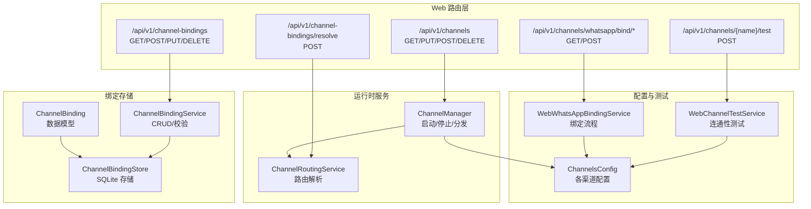
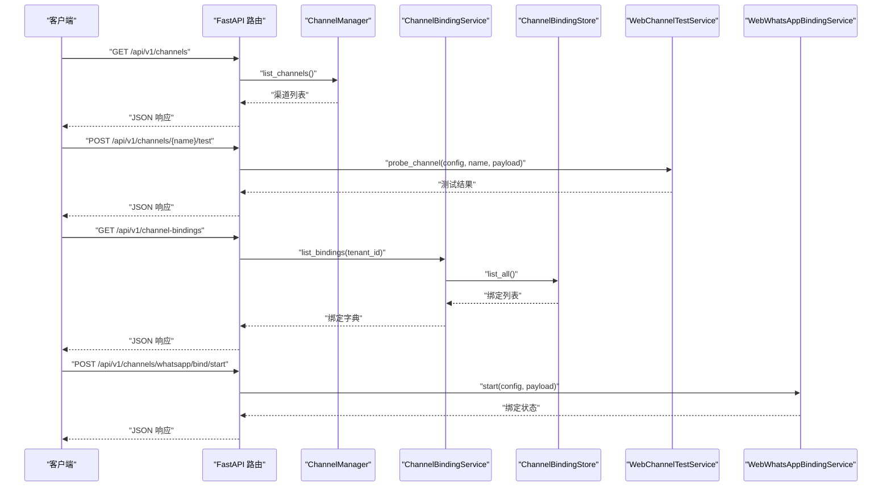
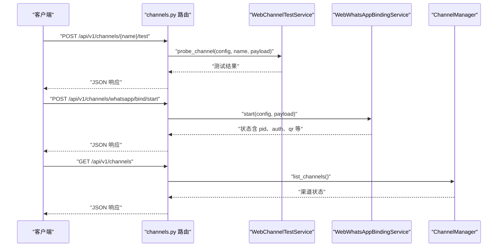
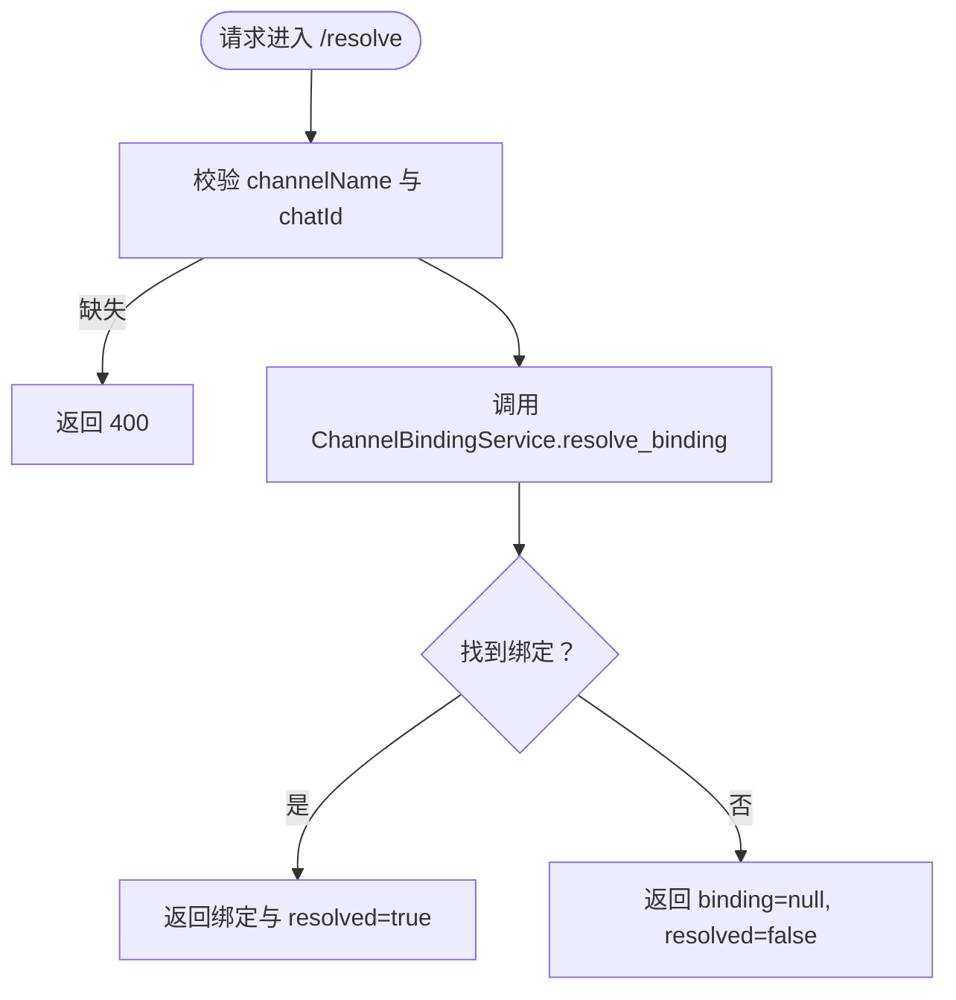
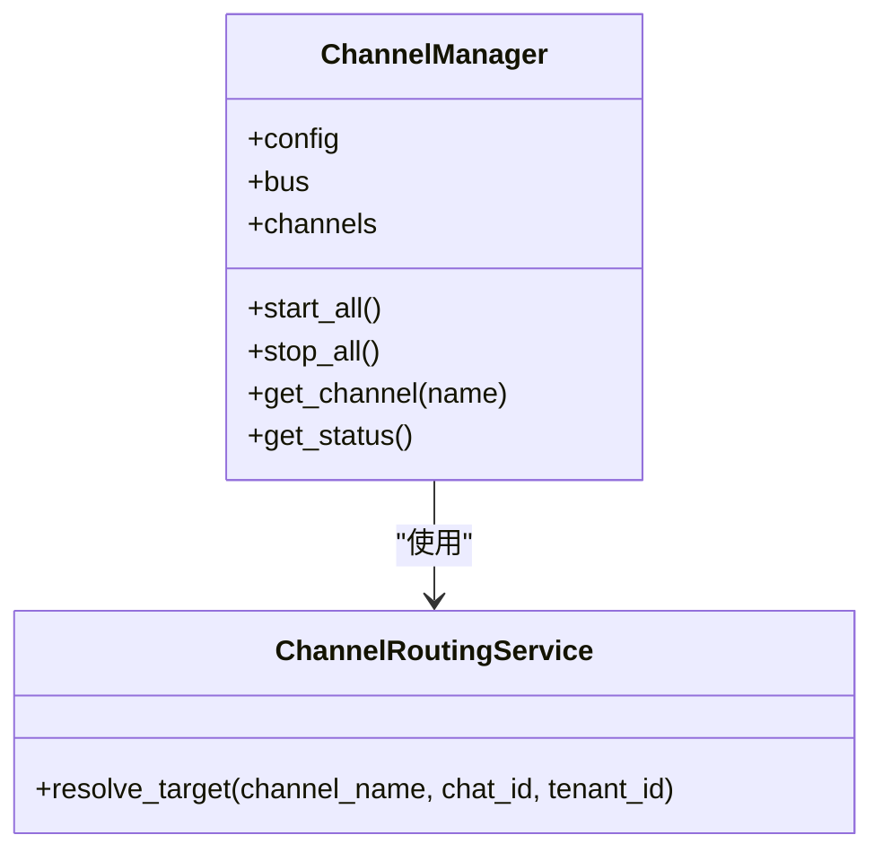
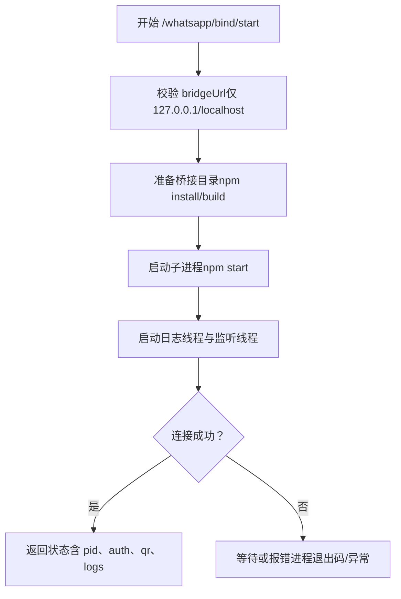
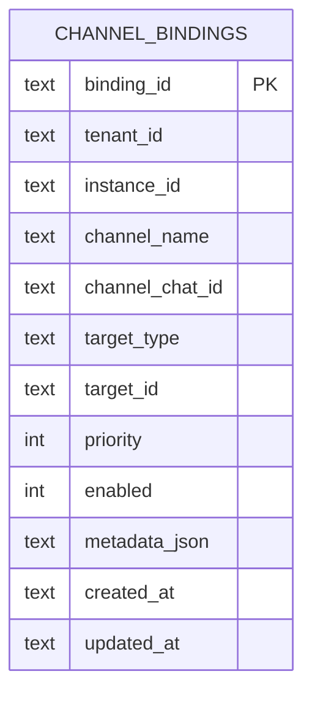
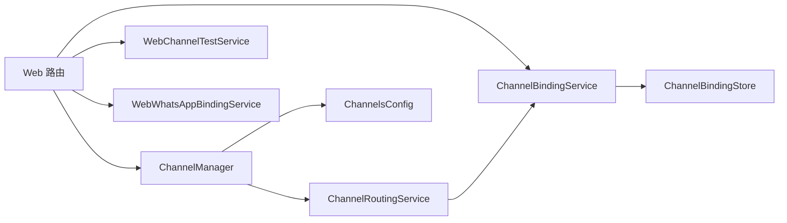

# 渠道管理 API

<cite>
**本文引用的文件**
- [channels.py](file://nanobot/web/routers/channels.py)
- [channel_bindings.py](file://nanobot/web/routers/channel_bindings.py)
- [manager.py](file://nanobot/channels/manager.py)
- [base.py](file://nanobot/channels/base.py)
- [schema.py](file://nanobot/config/schema.py)
- [channel_testing.py](file://nanobot/web/channel_testing.py)
- [whatsapp_binding.py](file://nanobot/web/whatsapp_binding.py)
- [models.py](file://nanobot/platform/channel_bindings/models.py)
- [service.py](file://nanobot/platform/channel_bindings/service.py)
- [store.py](file://nanobot/platform/channel_bindings/store.py)
- [channel_routing.py](file://nanobot/web/runtime_services/channel_routing.py)
</cite>

## 目录
1. [简介](#简介)
2. [项目结构](#项目结构)
3. [核心组件](#核心组件)
4. [架构总览](#架构总览)
5. [详细组件分析](#详细组件分析)
6. [依赖分析](#依赖分析)
7. [性能考虑](#性能考虑)
8. [故障排查指南](#故障排查指南)
9. [结论](#结论)
10. [附录](#附录)

## 简介
本文件为“渠道管理 API”的权威参考文档，覆盖以下主题：
- 渠道配置、绑定关系与状态管理的 API 端点
- 不同渠道类型的配置参数、认证信息与连接状态检查
- 渠道测试、重连机制与故障恢复的 API 接口
- 渠道绑定管理、消息路由配置与批量操作的端点说明

目标读者包括系统管理员、平台运维人员与集成开发者，内容以“可执行清单”和“可视化图示”为主，帮助快速定位问题与实现集成。

## 项目结构
与渠道管理 API 相关的关键模块分布如下：
- Web 路由层：负责暴露 REST API，统一错误处理与响应格式
- 渠道运行时：负责启动/停止各渠道、消息分发与状态查询
- 绑定服务：负责渠道到代理/团队的路由绑定管理
- 配置模式：定义各渠道的配置字段与默认值
- 测试与绑定工作流：提供渠道连通性测试与 WhatsApp 绑定流程

**图表来源**
- [channels.py:16-122](file://nanobot/web/routers/channels.py#L16-L122)
- [channel_bindings.py:21-101](file://nanobot/web/routers/channel_bindings.py#L21-L101)
- [manager.py:52-209](file://nanobot/channels/manager.py#L52-L209)
- [service.py:28-201](file://nanobot/platform/channel_bindings/service.py#L28-L201)
- [store.py:11-231](file://nanobot/platform/channel_bindings/store.py#L11-L231)
- [schema.py:213-229](file://nanobot/config/schema.py#L213-L229)
- [channel_testing.py:81-554](file://nanobot/web/channel_testing.py#L81-L554)
- [whatsapp_binding.py:43-339](file://nanobot/web/whatsapp_binding.py#L43-L339)
- [channel_routing.py:23-73](file://nanobot/web/runtime_services/channel_routing.py#L23-L73)

**章节来源**
- [channels.py:16-122](file://nanobot/web/routers/channels.py#L16-L122)
- [channel_bindings.py:21-101](file://nanobot/web/routers/channel_bindings.py#L21-L101)
- [manager.py:52-209](file://nanobot/channels/manager.py#L52-L209)
- [service.py:28-201](file://nanobot/platform/channel_bindings/service.py#L28-L201)
- [store.py:11-231](file://nanobot/platform/channel_bindings/store.py#L11-L231)
- [schema.py:213-229](file://nanobot/config/schema.py#L213-L229)
- [channel_testing.py:81-554](file://nanobot/web/channel_testing.py#L81-L554)
- [whatsapp_binding.py:43-339](file://nanobot/web/whatsapp_binding.py#L43-L339)
- [channel_routing.py:23-73](file://nanobot/web/runtime_services/channel_routing.py#L23-L73)

## 核心组件
- 渠道管理路由：提供渠道列表、更新、测试以及 WhatsApp 绑定状态与启停接口
- 渠道绑定路由：提供绑定的增删改查与解析接口
- 渠道运行时：负责初始化、启动/停止各渠道，以及出站消息分发
- 绑定服务与存储：提供绑定的持久化、解析与校验
- 配置模式：统一描述各渠道的配置字段与默认值
- 测试与绑定工作流：提供跨渠道的连通性测试与 WhatsApp 本地绑定流程

**章节来源**
- [channels.py:16-122](file://nanobot/web/routers/channels.py#L16-L122)
- [channel_bindings.py:21-101](file://nanobot/web/routers/channel_bindings.py#L21-L101)
- [manager.py:52-209](file://nanobot/channels/manager.py#L52-L209)
- [service.py:28-201](file://nanobot/platform/channel_bindings/service.py#L28-L201)
- [store.py:11-231](file://nanobot/platform/channel_bindings/store.py#L11-L231)
- [schema.py:213-229](file://nanobot/config/schema.py#L213-L229)
- [channel_testing.py:81-554](file://nanobot/web/channel_testing.py#L81-L554)
- [whatsapp_binding.py:43-339](file://nanobot/web/whatsapp_binding.py#L43-L339)
- [channel_routing.py:23-73](file://nanobot/web/runtime_services/channel_routing.py#L23-L73)

## 架构总览
下图展示从 Web 请求到渠道运行时与绑定解析的整体调用链：

**图表来源**
- [channels.py:16-122](file://nanobot/web/routers/channels.py#L16-L122)
- [channel_bindings.py:21-101](file://nanobot/web/routers/channel_bindings.py#L21-L101)
- [manager.py:86-139](file://nanobot/channels/manager.py#L86-L139)
- [service.py:87-91](file://nanobot/platform/channel_bindings/service.py#L87-L91)
- [store.py:112-128](file://nanobot/platform/channel_bindings/store.py#L112-L128)
- [channel_testing.py:87-131](file://nanobot/web/channel_testing.py#L87-131)
- [whatsapp_binding.py:94-158](file://nanobot/web/whatsapp_binding.py#L94-158)

## 详细组件分析

### 渠道管理 API
- 列出所有启用的渠道
  - 方法与路径：GET /api/v1/channels
  - 行为：读取运行时状态，返回每个渠道的启用与运行状态
  - 响应：包含每个渠道的名称、启用标志与运行标志
- 更新渠道投递策略
  - 方法与路径：PUT /api/v1/channels/delivery
  - 行为：更新全局投递策略（如进度/工具提示）
  - 响应：更新后的配置摘要
- 获取单个渠道详情
  - 方法与路径：GET /api/v1/channels/{channel_name}
  - 行为：返回该渠道的配置快照
  - 错误：未知渠道返回 404
- 更新单个渠道配置
  - 方法与路径：PUT /api/v1/channels/{channel_name}
  - 行为：合并临时负载后写入配置，支持在线生效
  - 错误：未知渠道 404，参数错误 400
- 测试指定渠道连通性
  - 方法与路径：POST /api/v1/channels/{channel_name}/test
  - 行为：按渠道类型进行最小化连通性探测（令牌/凭证有效性等）
  - 响应：包含测试状态、检查项与时间戳
  - 错误：未知渠道 404，其他异常 400
- WhatsApp 绑定状态
  - 方法与路径：GET /api/v1/channels/whatsapp/bind/status
  - 行为：返回桥接地址、进程状态、认证目录、二维码与最近日志
- 启动 WhatsApp 绑定流程
  - 方法与路径：POST /api/v1/channels/whatsapp/bind/start
  - 行为：准备本地桥接、启动子进程、监听 WebSocket 事件
  - 限制：仅允许 127.0.0.1 或 localhost 的桥接地址
- 停止 WhatsApp 绑定流程
  - 方法与路径：POST /api/v1/channels/whatsapp/bind/stop
  - 行为：终止子进程与监听线程，清理资源

**图表来源**
- [channels.py:76-122](file://nanobot/web/routers/channels.py#L76-L122)
- [channel_testing.py:87-131](file://nanobot/web/channel_testing.py#L87-131)
- [whatsapp_binding.py:94-158](file://nanobot/web/whatsapp_binding.py#L94-158)
- [manager.py:195-209](file://nanobot/channels/manager.py#L195-L209)

**章节来源**
- [channels.py:16-122](file://nanobot/web/routers/channels.py#L16-L122)
- [channel_testing.py:81-554](file://nanobot/web/channel_testing.py#L81-L554)
- [whatsapp_binding.py:43-339](file://nanobot/web/whatsapp_binding.py#L43-L339)
- [manager.py:195-209](file://nanobot/channels/manager.py#L195-L209)

### 渠道绑定管理 API
- 列出绑定
  - 方法与路径：GET /api/v1/channel-bindings
  - 行为：按租户列出所有绑定
- 创建绑定
  - 方法与路径：POST /api/v1/channel-bindings
  - 行为：创建新的渠道-聊天室-目标绑定（支持优先级、启用状态、元数据）
  - 错误：冲突 409，校验失败 400
- 查询绑定
  - 方法与路径：GET /api/v1/channel-bindings/{binding_id}
  - 行为：按 ID 获取绑定详情
  - 错误：不存在 404
- 更新绑定
  - 方法与路径：PUT /api/v1/channel-bindings/{binding_id}
  - 行为：部分字段更新（目标类型/ID、优先级、启用、元数据）
  - 错误：不存在 404，冲突 409，校验失败 400
- 删除绑定
  - 方法与路径：DELETE /api/v1/channel-bindings/{binding_id}
  - 行为：删除绑定并返回删除结果
  - 错误：不存在 404
- 解析绑定
  - 方法与路径：POST /api/v1/channel-bindings/resolve
  - 行为：根据 channelName 与 chatId 解析目标（精确匹配优先，否则回退到通配符）
  - 响应：返回绑定与解析结果布尔值

**图表来源**
- [channel_bindings.py:83-101](file://nanobot/web/routers/channel_bindings.py#L83-L101)
- [service.py:73-86](file://nanobot/platform/channel_bindings/service.py#L73-L86)

**章节来源**
- [channel_bindings.py:21-101](file://nanobot/web/routers/channel_bindings.py#L21-L101)
- [service.py:28-201](file://nanobot/platform/channel_bindings/service.py#L28-L201)
- [store.py:74-111](file://nanobot/platform/channel_bindings/store.py#L74-L111)

### 渠道运行时与消息路由
- ChannelManager
  - 初始化：扫描已启用渠道并实例化
  - 启动：并发启动各渠道，并启动出站分发任务
  - 停止：取消分发任务并逐个停止渠道
  - 分发：根据消息中的 channel 字段选择对应渠道发送
  - 状态：聚合返回各渠道的启用与运行状态
- ChannelRoutingService
  - 将入站消息的渠道与聊天室解析为目标（代理或团队），并注入路由元数据
  - 支持精确匹配与通配符回退，按优先级排序

**图表来源**
- [manager.py:52-209](file://nanobot/channels/manager.py#L52-L209)
- [channel_routing.py:23-73](file://nanobot/web/runtime_services/channel_routing.py#L23-L73)

**章节来源**
- [manager.py:52-209](file://nanobot/channels/manager.py#L52-L209)
- [channel_routing.py:23-73](file://nanobot/web/runtime_services/channel_routing.py#L23-L73)

### 渠道配置与认证要点
- 通用字段
  - enabled：是否启用
  - allow_from：允许的发送者列表（空列表将拒绝所有）
- Telegram
  - token：机器人令牌
  - proxy：可选代理
  - reply_to_message：是否回复原消息
  - group_policy：群组策略（mention/open）
- Discord
  - token：机器人令牌
  - gateway_url/intents：网关与意图
  - group_policy：群组策略
- Slack
  - bot_token/app_token：Bot 令牌与 Socket Mode App 令牌
  - webhook_path：Webhook 路径
  - reply_in_thread/react_emoji/group_policy/group_allow_from/dm：行为与权限
- Matrix
  - homeserver/access_token/user_id/device_id：认证
  - e2ee_enabled/max_media_bytes：加密与媒体大小
  - group_policy/group_allow_from/allow_room_mentions：群组策略
- Email
  - consent_granted：已获许可
  - IMAP：host/port/username/password/mailbox/use_ssl
  - SMTP：host/port/username/password/use_tls/use_ssl/from_address
  - auto_reply_enabled/poll_interval_seconds/mark_seen/max_body_chars/subject_prefix/allow_from：行为
- Feishu
  - app_id/app_secret：应用凭证
  - encrypt_key/verification_token：事件订阅安全
  - react_emoji/allow_from：交互与白名单
- DingTalk
  - client_id/client_secret：应用凭证
  - allow_from：允许员工 ID
- QQ
  - app_id/secret：应用凭证
  - allow_from：允许用户 openid
- WeCom
  - bot_id/secret：机器人凭证
  - welcome_message：入群欢迎语
- WhatsApp
  - bridge_url：WebSocket 桥接地址（仅限 127.0.0.1/localhost）
  - bridge_token：共享鉴权令牌（可选）
  - allow_from：允许的手机号

**章节来源**
- [schema.py:17-229](file://nanobot/config/schema.py#L17-L229)

### 渠道测试与重连机制
- 测试服务
  - 支持 Telegram/Discord/Slack/Matrix/Email/WhatsApp/Feishu/DingTalk/Mochat/QQ/WeCom
  - 必填字段检测：若配置不完整，返回“缺少字段”提示
  - 最小化探测：如 Telegram 的 /getMe、Slack 的 auth.test 与 apps.connections.open、Matrix 的 whoami 等
  - 结果结构：包含状态、标签、摘要、明细、检查项与时间戳
- WhatsApp 绑定
  - 本地桥接：准备 npm 环境、复制源码、安装与构建
  - 子进程：启动 npm start，读取标准输出日志
  - 监听器：连接 WebSocket，接收 qr/status/error 事件，维护最近日志
  - 重连：监听器断开后自动休眠重连
  - 停止：终止子进程并清理线程

**图表来源**
- [whatsapp_binding.py:94-158](file://nanobot/web/whatsapp_binding.py#L94-158)
- [whatsapp_binding.py:200-235](file://nanobot/web/whatsapp_binding.py#L200-235)
- [whatsapp_binding.py:269-310](file://nanobot/web/whatsapp_binding.py#L269-310)

**章节来源**
- [channel_testing.py:81-554](file://nanobot/web/channel_testing.py#L81-L554)
- [whatsapp_binding.py:43-339](file://nanobot/web/whatsapp_binding.py#L43-L339)

### 数据模型与存储
- ChannelBinding
  - 关键字段：binding_id、tenant_id、instance_id、channel_name、channel_chat_id、target_type、target_id、priority、enabled、metadata、时间戳
  - 序列化：to_storage_json()/from_record()/to_dict()
- ChannelBindingService
  - 校验：targetType 仅允许 agent/team；agent/team 对应的目标存在性校验
  - 创建/更新：生成 binding_id，填充时间戳，写入存储
  - 解析：exact match 优先，否则回退到通配符 '*'
- ChannelBindingStore
  - 表结构：唯一索引（tenant_id, instance_id, channel_name, channel_chat_id）、查找索引
  - 操作：get/resolve/list/create/update/delete

**图表来源**
- [store.py:14-35](file://nanobot/platform/channel_bindings/store.py#L14-L35)
- [models.py:15-69](file://nanobot/platform/channel_bindings/models.py#L15-L69)
- [service.py:28-201](file://nanobot/platform/channel_bindings/service.py#L28-L201)

**章节来源**
- [models.py:15-69](file://nanobot/platform/channel_bindings/models.py#L15-L69)
- [service.py:28-201](file://nanobot/platform/channel_bindings/service.py#L28-L201)
- [store.py:11-231](file://nanobot/platform/channel_bindings/store.py#L11-L231)

## 依赖分析
- 路由层依赖运行时与服务层
  - 渠道路由依赖 ChannelManager 与 WebChannelTestService、WebWhatsAppBindingService
  - 绑定路由依赖 ChannelBindingService 与 ChannelBindingStore
- 运行时依赖配置与消息总线
  - ChannelManager 依赖 ChannelsConfig 与 MessageBus
  - ChannelRoutingService 依赖 ChannelBindingService
- 存储层
  - ChannelBindingStore 使用 SQLite，提供高效解析与唯一约束

**图表来源**
- [channels.py:16-122](file://nanobot/web/routers/channels.py#L16-L122)
- [channel_bindings.py:21-101](file://nanobot/web/routers/channel_bindings.py#L21-L101)
- [manager.py:52-209](file://nanobot/channels/manager.py#L52-L209)
- [service.py:28-201](file://nanobot/platform/channel_bindings/service.py#L28-L201)
- [store.py:11-231](file://nanobot/platform/channel_bindings/store.py#L11-L231)
- [schema.py:213-229](file://nanobot/config/schema.py#L213-L229)
- [channel_routing.py:23-73](file://nanobot/web/runtime_services/channel_routing.py#L23-L73)

**章节来源**
- [channels.py:16-122](file://nanobot/web/routers/channels.py#L16-L122)
- [channel_bindings.py:21-101](file://nanobot/web/routers/channel_bindings.py#L21-L101)
- [manager.py:52-209](file://nanobot/channels/manager.py#L52-L209)
- [service.py:28-201](file://nanobot/platform/channel_bindings/service.py#L28-L201)
- [store.py:11-231](file://nanobot/platform/channel_bindings/store.py#L11-L231)
- [schema.py:213-229](file://nanobot/config/schema.py#L213-L229)
- [channel_routing.py:23-73](file://nanobot/web/runtime_services/channel_routing.py#L23-L73)

## 性能考虑
- 并发启动：ChannelManager 并发启动各渠道，避免串行阻塞
- 出站分发：基于异步队列消费与超时控制，保证高吞吐
- 绑定解析：SQLite 索引优化，优先精确匹配，降低解析成本
- 日志与监控：WhatsApp 绑定提供最近日志截断，便于定位问题

[本节为通用指导，无需特定文件引用]

## 故障排查指南
- 渠道测试失败
  - 检查必填字段是否齐全（例如 Telegram 的 token、Slack 的 bot/app tokens、Matrix 的 access token 等）
  - 查看测试结果中的 checks 与 detail 字段，定位具体失败项
- WhatsApp 绑定失败
  - 确认 bridgeUrl 为 127.0.0.1 或 localhost
  - 检查 npm 是否可用，确保桥接目录已正确复制与构建
  - 查看最近日志与 lastError，关注“Failed to start bridge”或“Bridge failed”
  - 若无二维码且状态非 connected，确认桥接 WebSocket 正常
- 绑定冲突或校验失败
  - 创建/更新绑定时出现冲突或校验错误，请检查 targetType 与目标存在性
  - 确保同一租户+实例+渠道+聊天室的唯一性约束满足
- 入站消息未路由
  - 检查 allow_from 白名单是否为空（空列表将拒绝所有）
  - 使用 /resolve 接口确认绑定是否存在且 enabled

**章节来源**
- [channel_testing.py:81-554](file://nanobot/web/channel_testing.py#L81-L554)
- [whatsapp_binding.py:94-158](file://nanobot/web/whatsapp_binding.py#L94-158)
- [service.py:13-23](file://nanobot/platform/channel_bindings/service.py#L13-L23)
- [base.py:79-135](file://nanobot/channels/base.py#L79-L135)
- [channel_bindings.py:83-101](file://nanobot/web/routers/channel_bindings.py#L83-L101)

## 结论
本参考文档梳理了渠道管理 API 的端点、数据模型与运行机制，提供了测试、绑定与路由的完整流程说明。建议在生产环境中：
- 使用 /channels/{name}/test 定期巡检关键渠道
- 通过 /channel-bindings/resolve 核验路由准确性
- 对 WhatsApp 等需要本地桥接的渠道，提前准备 npm 环境并监控绑定状态
- 严格管理 allow_from 白名单，避免空列表导致访问被拒

[本节为总结性内容，无需特定文件引用]

## 附录
- 批量操作建议
  - 通过 /api/v1/channel-bindings 批量创建/更新/删除绑定时，建议先使用 /resolve 验证预期路由，再提交变更
- 最佳实践
  - 在更新渠道配置前，先调用 /channels/{name}/test 进行最小化连通性验证
  - 对于需要外部 SDK 的渠道（如 WeCom），确保依赖已安装并在测试中完成字段预检

[本节为通用指导，无需特定文件引用]