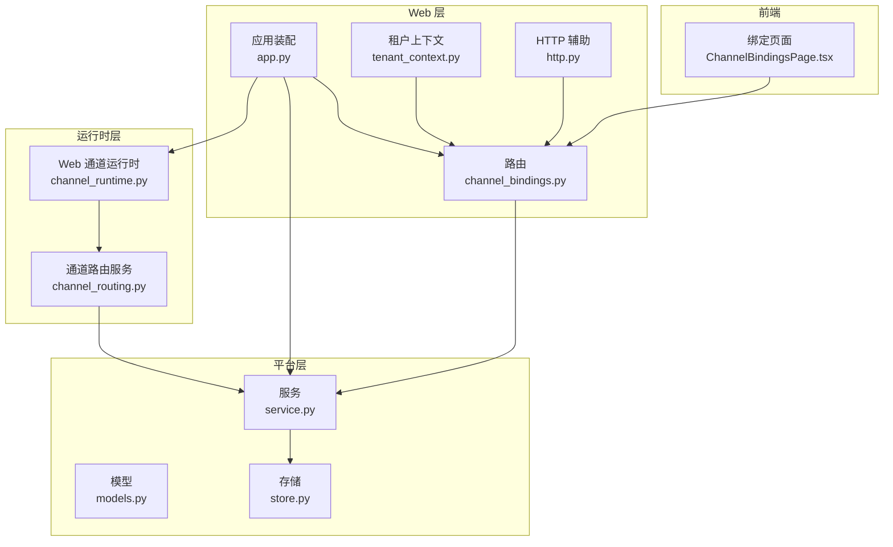
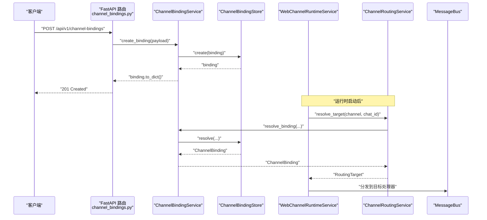
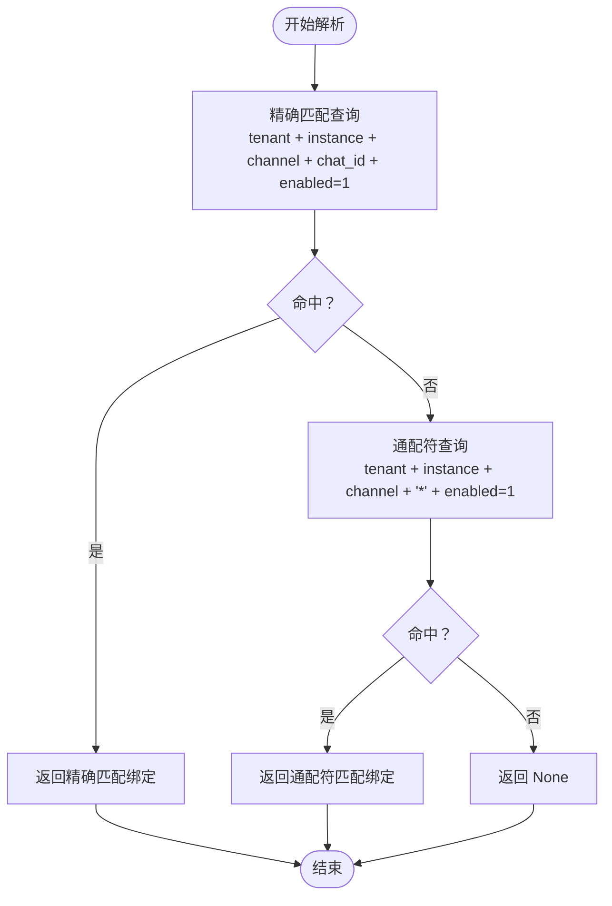
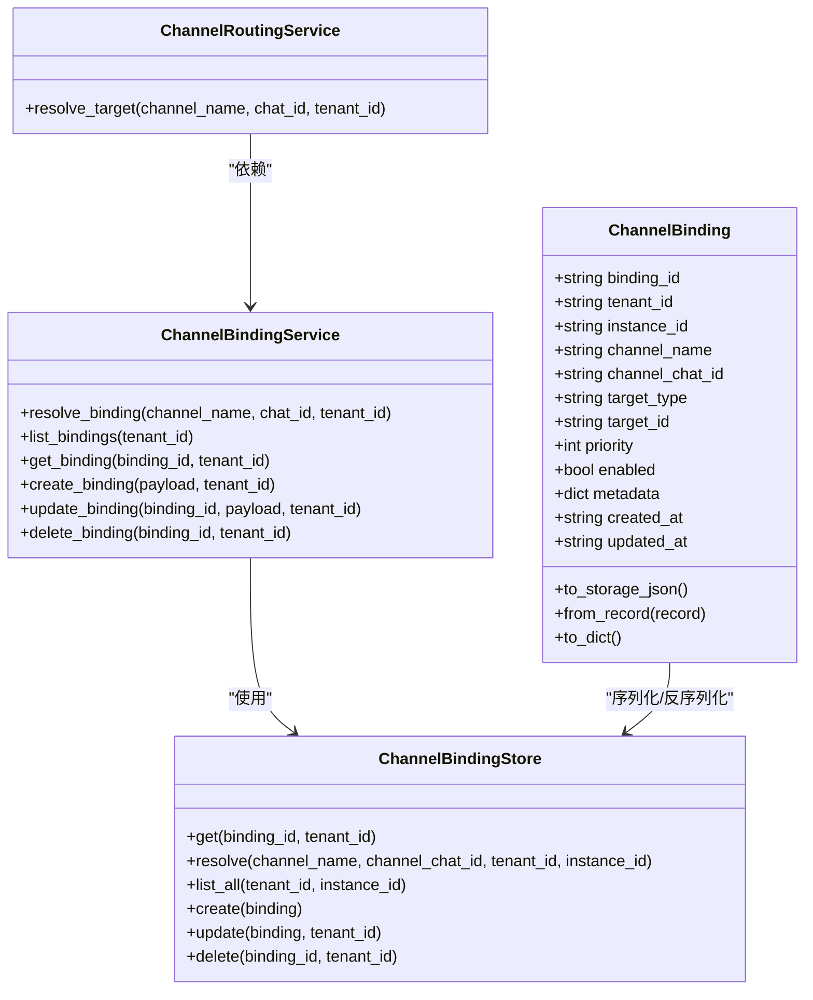
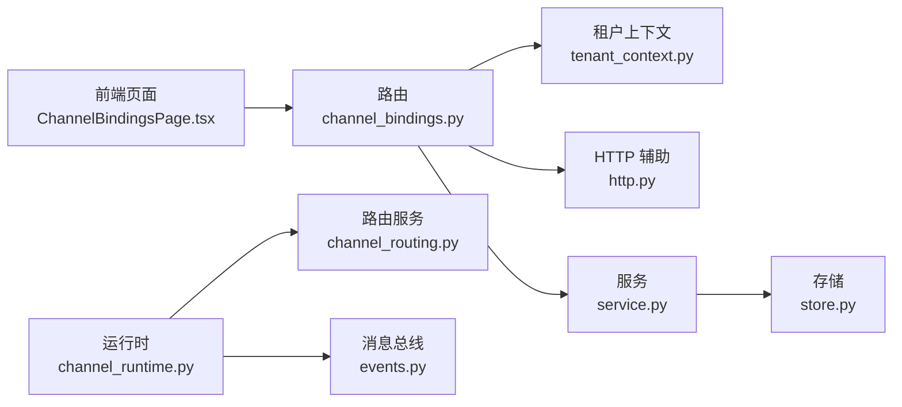

# 渠道绑定关系管理 API

<cite>
**本文档引用的文件**
- [nanobot/platform/channel_bindings/__init__.py](file://nanobot/platform/channel_bindings/__init__.py)
- [nanobot/platform/channel_bindings/models.py](file://nanobot/platform/channel_bindings/models.py)
- [nanobot/platform/channel_bindings/service.py](file://nanobot/platform/channel_bindings/service.py)
- [nanobot/platform/channel_bindings/store.py](file://nanobot/platform/channel_bindings/store.py)
- [nanobot/web/routers/channel_bindings.py](file://nanobot/web/routers/channel_bindings.py)
- [nanobot/web/runtime_services/channel_routing.py](file://nanobot/web/runtime_services/channel_routing.py)
- [nanobot/web/runtime_services/channel_runtime.py](file://nanobot/web/runtime_services/channel_runtime.py)
- [nanobot/web/app.py](file://nanobot/web/app.py)
- [nanobot/web/http.py](file://nanobot/web/http.py)
- [nanobot/web/tenant_context.py](file://nanobot/web/tenant_context.py)
- [web-ui/src/pages/ChannelBindingsPage.tsx](file://web-ui/src/pages/ChannelBindingsPage.tsx)
- [tests/test_channel_routing_e2e.py](file://tests/test_channel_routing_e2e.py)
- [nanobot/bus/events.py](file://nanobot/bus/events.py)
- [nanobot/channels/base.py](file://nanobot/channels/base.py)
</cite>

## 目录
1. [简介](#简介)
2. [项目结构](#项目结构)
3. [核心组件](#核心组件)
4. [架构总览](#架构总览)
5. [详细组件分析](#详细组件分析)
6. [依赖分析](#依赖分析)
7. [性能考虑](#性能考虑)
8. [故障排查指南](#故障排查指南)
9. [结论](#结论)
10. [附录](#附录)

## 简介
本文件为“渠道绑定关系管理 API”的权威参考文档，覆盖以下能力：
- 渠道绑定关系的创建、查询、更新、删除（CRUD）端点
- 绑定规则配置与消息路由策略（精确匹配与通配符回退）
- 多对多关系管理（一个渠道可有多个绑定，支持通配符与具体聊天 ID 并存）
- 绑定状态监控与生命周期管理
- 自动重连机制与绑定冲突处理
- 性能优化建议与最佳实践

该系统通过 Web API 提供 REST 接口，并在运行时由通道运行时服务驱动消息路由，将入站消息精确分发到指定的 AI 员工或团队。

## 项目结构
与渠道绑定关系管理直接相关的模块分布如下：
- 平台层：模型、服务、存储（用于持久化与解析）
- Web 层：路由、认证与租户上下文、应用装配
- 运行时层：通道路由服务与 Web 通道运行时服务（负责消息分发）
- 前端页面：可视化绑定管理界面
- 测试：端到端验证路由行为与 API 行为

图表来源
- [nanobot/web/routers/channel_bindings.py:1-102](file://nanobot/web/routers/channel_bindings.py#L1-L102)
- [nanobot/web/app.py:70-280](file://nanobot/web/app.py#L70-L280)
- [nanobot/web/tenant_context.py:1-108](file://nanobot/web/tenant_context.py#L1-L108)
- [nanobot/web/http.py:1-40](file://nanobot/web/http.py#L1-L40)
- [nanobot/platform/channel_bindings/models.py:1-69](file://nanobot/platform/channel_bindings/models.py#L1-L69)
- [nanobot/platform/channel_bindings/service.py:1-201](file://nanobot/platform/channel_bindings/service.py#L1-L201)
- [nanobot/platform/channel_bindings/store.py:1-231](file://nanobot/platform/channel_bindings/store.py#L1-L231)
- [nanobot/web/runtime_services/channel_routing.py:1-73](file://nanobot/web/runtime_services/channel_routing.py#L1-L73)
- [nanobot/web/runtime_services/channel_runtime.py:1-382](file://nanobot/web/runtime_services/channel_runtime.py#L1-L382)
- [web-ui/src/pages/ChannelBindingsPage.tsx:1-559](file://web-ui/src/pages/ChannelBindingsPage.tsx#L1-L559)

章节来源
- [nanobot/web/routers/channel_bindings.py:1-102](file://nanobot/web/routers/channel_bindings.py#L1-L102)
- [nanobot/web/app.py:70-280](file://nanobot/web/app.py#L70-L280)
- [nanobot/platform/channel_bindings/__init__.py:1-20](file://nanobot/platform/channel_bindings/__init__.py#L1-L20)

## 核心组件
- 数据模型：ChannelBinding 描述绑定关系的核心字段（绑定 ID、租户 ID、实例 ID、渠道名、聊天 ID、目标类型与 ID、优先级、启用状态、元数据等），并提供序列化/反序列化方法。
- 服务层：ChannelBindingService 提供校验、生成绑定 ID、目标存在性校验、创建/读取/更新/删除与解析绑定的能力。
- 存储层：ChannelBindingStore 使用 SQLite 持久化，包含唯一索引与查询逻辑，支持精确匹配与通配符回退。
- 路由服务：ChannelRoutingService 将入站消息解析为 RoutingTarget，驱动后续分发。
- Web 路由：提供 /api/v1/channel-bindings 的 REST 端点与 /api/v1/channel-bindings/resolve 解析端点。
- 应用装配：在应用启动时注入 ChannelBindingService，并在运行时启动 Web 通道运行时服务。

章节来源
- [nanobot/platform/channel_bindings/models.py:15-69](file://nanobot/platform/channel_bindings/models.py#L15-L69)
- [nanobot/platform/channel_bindings/service.py:28-201](file://nanobot/platform/channel_bindings/service.py#L28-L201)
- [nanobot/platform/channel_bindings/store.py:11-231](file://nanobot/platform/channel_bindings/store.py#L11-L231)
- [nanobot/web/runtime_services/channel_routing.py:23-73](file://nanobot/web/runtime_services/channel_routing.py#L23-L73)
- [nanobot/web/routers/channel_bindings.py:21-102](file://nanobot/web/routers/channel_bindings.py#L21-L102)
- [nanobot/web/app.py:109-114](file://nanobot/web/app.py#L109-L114)

## 架构总览
下图展示从 Web API 到运行时的消息路由全链路：

图表来源
- [nanobot/web/routers/channel_bindings.py:28-42](file://nanobot/web/routers/channel_bindings.py#L28-L42)
- [nanobot/platform/channel_bindings/service.py:99-141](file://nanobot/platform/channel_bindings/service.py#L99-L141)
- [nanobot/platform/channel_bindings/store.py:130-161](file://nanobot/platform/channel_bindings/store.py#L130-L161)
- [nanobot/web/runtime_services/channel_runtime.py:142-186](file://nanobot/web/runtime_services/channel_runtime.py#L142-L186)
- [nanobot/web/runtime_services/channel_routing.py:38-72](file://nanobot/web/runtime_services/channel_routing.py#L38-L72)

## 详细组件分析

### API 端点定义与行为
- 列表绑定
  - 方法与路径：GET /api/v1/channel-bindings
  - 功能：列出当前租户下的所有绑定，按渠道名、优先级、更新时间排序
  - 认证与租户：通过中间件获取租户 ID，默认为 default
- 创建绑定
  - 方法与路径：POST /api/v1/channel-bindings
  - 请求体字段：channelName、channelChatId、targetType、targetId、priority、enabled、metadata
  - 返回：新创建的绑定对象
  - 错误：400 验证错误；409 冲突错误
- 获取绑定
  - 方法与路径：GET /api/v1/channel-bindings/{binding_id}
  - 返回：指定绑定详情
  - 错误：404 未找到
- 更新绑定
  - 方法与路径：PUT /api/v1/channel-bindings/{binding_id}
  - 支持部分字段更新（channelName、channelChatId、targetType、targetId、priority、enabled、metadata）
  - 返回：更新后的绑定对象
  - 错误：404 未找到；409 冲突；400 验证错误
- 删除绑定
  - 方法与路径：DELETE /api/v1/channel-bindings/{binding_id}
  - 返回：{"deleted": true}
  - 错误：404 未找到
- 解析绑定
  - 方法与路径：POST /api/v1/channel-bindings/resolve
  - 请求体：channelName、chatId
  - 返回：{"binding": {...}|null, "resolved": true|false}
  - 场景：用于调试与预检，不修改数据库

章节来源
- [nanobot/web/routers/channel_bindings.py:21-102](file://nanobot/web/routers/channel_bindings.py#L21-L102)
- [nanobot/web/tenant_context.py:20-24](file://nanobot/web/tenant_context.py#L20-L24)
- [nanobot/web/http.py:11-25](file://nanobot/web/http.py#L11-L25)

### 绑定规则与消息路由策略
- 精确匹配优先：优先查找与 (tenant_id, instance_id, channel_name, channel_chat_id) 完全一致的绑定
- 通配符回退：若无精确匹配，则回退到 channel_chat_id = '*' 的绑定
- 启用过滤：仅启用中的绑定参与匹配
- 优先级：在同一查询条件下按 priority 降序返回
- 元数据透传：解析出的绑定信息随消息在运行时链路中传递

图表来源
- [nanobot/platform/channel_bindings/store.py:74-110](file://nanobot/platform/channel_bindings/store.py#L74-L110)

章节来源
- [nanobot/platform/channel_bindings/store.py:74-110](file://nanobot/platform/channel_bindings/store.py#L74-L110)
- [nanobot/web/runtime_services/channel_routing.py:38-72](file://nanobot/web/runtime_services/channel_routing.py#L38-L72)

### 多对多关系管理
- 一对多：同一渠道可配置多个绑定，分别针对不同聊天 ID 或通配符
- 多对一：同一目标（agent/team）可被多个绑定指向
- 优先级：通过 priority 字段控制同条件下的选择顺序
- 冲突约束：唯一索引保证同一租户+实例+渠道+聊天 ID 下的唯一性

章节来源
- [nanobot/platform/channel_bindings/store.py:14-35](file://nanobot/platform/channel_bindings/store.py#L14-L35)
- [nanobot/platform/channel_bindings/models.py:15-69](file://nanobot/platform/channel_bindings/models.py#L15-L69)

### 绑定状态监控与生命周期
- 生命周期
  - 创建：生成 binding_id，写入 created_at/updated_at
  - 更新：仅更新变更字段，更新 updated_at
  - 删除：物理删除记录
- 状态字段
  - enabled：控制是否参与解析
  - priority：控制解析优先级
  - metadata：扩展字段，可用于运行时策略
- 运行时监控
  - WebChannelRuntimeService 提供运行状态查询，包含运行标志、已启用通道、各通道状态
  - 前端页面 ChannelBindingsPage 提供绑定列表、筛选、搜索与统计

章节来源
- [nanobot/platform/channel_bindings/service.py:126-195](file://nanobot/platform/channel_bindings/service.py#L126-L195)
- [nanobot/web/runtime_services/channel_runtime.py:129-136](file://nanobot/web/runtime_services/channel_runtime.py#L129-L136)
- [web-ui/src/pages/ChannelBindingsPage.tsx:127-138](file://web-ui/src/pages/ChannelBindingsPage.tsx#L127-L138)

### 自动重连机制与绑定冲突处理
- 自动重连
  - 通道运行时在独立线程与事件循环中运行，异常停止后会尝试重启（restart）
  - 通过后台线程 + asyncio.new_event_loop 实现隔离，避免阻塞主服务
- 冲突处理
  - 唯一索引防止重复绑定
  - 服务层抛出 ChannelBindingConflictError，Web 层映射为 409
  - 建议：创建前先调用解析接口进行预检，避免冲突

章节来源
- [nanobot/platform/channel_bindings/store.py:30-35](file://nanobot/platform/channel_bindings/store.py#L30-L35)
- [nanobot/platform/channel_bindings/service.py:17-19](file://nanobot/platform/channel_bindings/service.py#L17-L19)
- [nanobot/web/routers/channel_bindings.py:38-41](file://nanobot/web/routers/channel_bindings.py#L38-L41)
- [nanobot/web/runtime_services/channel_runtime.py:124-128](file://nanobot/web/runtime_services/channel_runtime.py#L124-L128)

### 类与依赖关系图

图表来源
- [nanobot/platform/channel_bindings/models.py:15-69](file://nanobot/platform/channel_bindings/models.py#L15-L69)
- [nanobot/platform/channel_bindings/service.py:28-201](file://nanobot/platform/channel_bindings/service.py#L28-L201)
- [nanobot/platform/channel_bindings/store.py:11-231](file://nanobot/platform/channel_bindings/store.py#L11-L231)
- [nanobot/web/runtime_services/channel_routing.py:23-73](file://nanobot/web/runtime_services/channel_routing.py#L23-L73)

## 依赖分析
- Web 路由依赖租户上下文中间件与统一错误包装
- 应用装配在启动时构建 ChannelBindingService 并注入运行时服务
- 运行时服务依赖消息总线与通道管理器，实现消息分发
- 前端页面依赖 API 提供的绑定列表、创建、更新、删除与解析能力

图表来源
- [nanobot/web/routers/channel_bindings.py:1-102](file://nanobot/web/routers/channel_bindings.py#L1-L102)
- [nanobot/web/tenant_context.py:1-108](file://nanobot/web/tenant_context.py#L1-L108)
- [nanobot/web/http.py:1-40](file://nanobot/web/http.py#L1-L40)
- [nanobot/platform/channel_bindings/service.py:1-201](file://nanobot/platform/channel_bindings/service.py#L1-L201)
- [nanobot/platform/channel_bindings/store.py:1-231](file://nanobot/platform/channel_bindings/store.py#L1-L231)
- [nanobot/web/runtime_services/channel_runtime.py:1-382](file://nanobot/web/runtime_services/channel_runtime.py#L1-L382)
- [nanobot/web/runtime_services/channel_routing.py:1-73](file://nanobot/web/runtime_services/channel_routing.py#L1-L73)
- [nanobot/bus/events.py:1-39](file://nanobot/bus/events.py#L1-L39)
- [web-ui/src/pages/ChannelBindingsPage.tsx:1-559](file://web-ui/src/pages/ChannelBindingsPage.tsx#L1-L559)

章节来源
- [nanobot/web/app.py:109-114](file://nanobot/web/app.py#L109-L114)
- [nanobot/web/routers/channel_bindings.py:1-102](file://nanobot/web/routers/channel_bindings.py#L1-L102)

## 性能考虑
- 查询优化
  - 使用索引 idx_cb_lookup 与 idx_cb_unique_binding，减少解析与去重成本
  - 解析时先精确匹配再通配符回退，避免全表扫描
- 写入优化
  - 批量操作建议合并请求，减少事务开销
  - 仅更新变更字段，避免不必要的写放大
- 运行时优化
  - 通道运行时在独立线程与事件循环中运行，避免阻塞主服务
  - 通过优先级与启用状态减少无效匹配
- 前端体验
  - 列表支持筛选与搜索，降低用户认知负担
  - 统计信息帮助快速定位问题

章节来源
- [nanobot/platform/channel_bindings/store.py:14-35](file://nanobot/platform/channel_bindings/store.py#L14-L35)
- [nanobot/web/runtime_services/channel_runtime.py:48-98](file://nanobot/web/runtime_services/channel_runtime.py#L48-L98)
- [web-ui/src/pages/ChannelBindingsPage.tsx:140-163](file://web-ui/src/pages/ChannelBindingsPage.tsx#L140-L163)

## 故障排查指南
- 常见错误码
  - 400：请求体字段缺失或非法（如 targetType 不在允许集合）
  - 404：绑定不存在
  - 409：绑定冲突（唯一索引冲突）
- 建议排查步骤
  - 使用解析端点 /api/v1/channel-bindings/resolve 预检绑定是否命中
  - 检查 enabled 是否为 true
  - 检查 priority 与通配符优先级
  - 查看运行时状态：WebChannelRuntimeService.get_status
- 单元与集成测试参考
  - 端到端测试覆盖了解析优先级、通配符回退、禁用绑定不路由、错误处理等场景

章节来源
- [nanobot/web/routers/channel_bindings.py:38-70](file://nanobot/web/routers/channel_bindings.py#L38-L70)
- [tests/test_channel_routing_e2e.py:116-185](file://tests/test_channel_routing_e2e.py#L116-L185)
- [tests/test_channel_routing_e2e.py:192-225](file://tests/test_channel_routing_e2e.py#L192-L225)
- [tests/test_channel_routing_e2e.py:297-495](file://tests/test_channel_routing_e2e.py#L297-L495)

## 结论
本 API 以清晰的模型与服务层设计，提供了稳定、可扩展的渠道绑定关系管理能力。结合运行时路由与前端可视化界面，实现了从配置到执行的完整闭环。遵循本文档的最佳实践与故障排查建议，可在生产环境中获得可靠的路由效果与良好的用户体验。

## 附录

### API 参考清单
- GET /api/v1/channel-bindings
  - 功能：列出绑定
  - 认证：需登录或 API Key
  - 租户：基于租户上下文
- POST /api/v1/channel-bindings
  - 功能：创建绑定
  - 请求体字段：channelName、channelChatId、targetType、targetId、priority、enabled、metadata
  - 响应：201 + 新绑定对象
- GET /api/v1/channel-bindings/{binding_id}
  - 功能：获取绑定详情
  - 响应：绑定对象
- PUT /api/v1/channel-bindings/{binding_id}
  - 功能：更新绑定
  - 请求体字段：可选上述字段
  - 响应：更新后的绑定对象
- DELETE /api/v1/channel-bindings/{binding_id}
  - 功能：删除绑定
  - 响应：{"deleted": true}
- POST /api/v1/channel-bindings/resolve
  - 功能：解析绑定
  - 请求体：channelName、chatId
  - 响应：{"binding": {...}|null, "resolved": true|false}

章节来源
- [nanobot/web/routers/channel_bindings.py:21-102](file://nanobot/web/routers/channel_bindings.py#L21-L102)