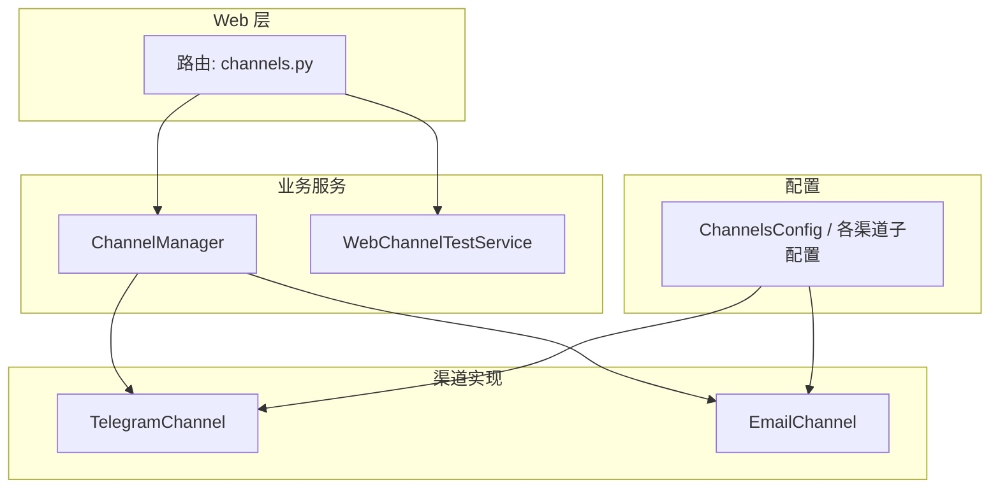
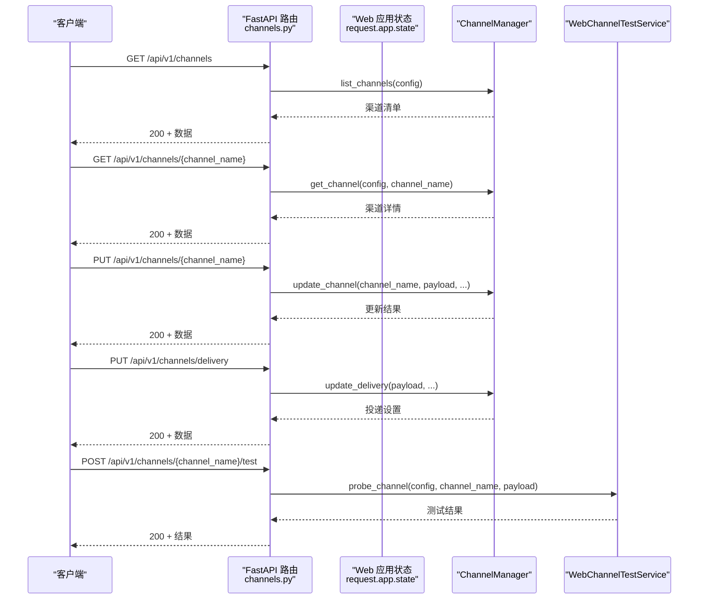
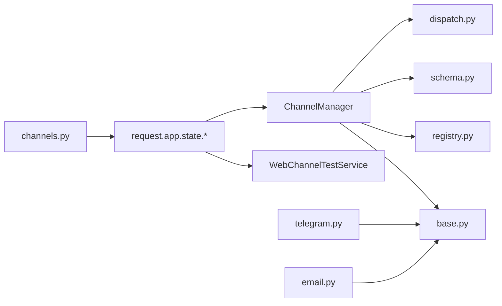

# 渠道配置 API

<cite>
**本文引用的文件**
- [channels.py](file://nanobot/web/routers/channels.py)
- [channel_testing.py](file://nanobot/web/channel_testing.py)
- [schema.py](file://nanobot/config/schema.py)
- [manager.py](file://nanobot/channels/manager.py)
- [registry.py](file://nanobot/channels/registry.py)
- [base.py](file://nanobot/channels/base.py)
- [dispatch.py](file://nanobot/channels/dispatch.py)
- [telegram.py](file://nanobot/channels/telegram.py)
- [email.py](file://nanobot/channels/email.py)
</cite>

## 目录
1. [简介](#简介)
2. [项目结构](#项目结构)
3. [核心组件](#核心组件)
4. [架构总览](#架构总览)
5. [详细组件分析](#详细组件分析)
6. [依赖分析](#依赖分析)
7. [性能考虑](#性能考虑)
8. [故障排查指南](#故障排查指南)
9. [结论](#结论)
10. [附录](#附录)

## 简介
本文件为“渠道配置 API”的权威参考，覆盖以下能力：
- 获取所有渠道列表
- 获取特定渠道详情
- 更新渠道配置
- 更新渠道投递设置（Delivery）

同时说明各端点的 HTTP 方法、URL 模式、请求参数、响应格式、错误处理机制、认证要求与使用示例，并对不同渠道类型的配置参数差异与必填字段进行对比说明。

## 项目结构
与渠道配置 API 相关的关键模块如下：
- Web 路由层：提供 REST API 入口，负责参数解析、错误包装与统一响应
- 配置模型：定义各渠道的配置字段与默认值
- 渠道管理器：负责渠道生命周期与消息分发
- 渠道实现：具体平台适配（如 Telegram、Email 等）
- 渠道测试服务：用于校验配置连通性

图表来源
- [channels.py:16-123](file://nanobot/web/routers/channels.py#L16-L123)
- [manager.py:52-209](file://nanobot/channels/manager.py#L52-L209)
- [schema.py:213-229](file://nanobot/config/schema.py#L213-L229)
- [telegram.py:150-200](file://nanobot/channels/telegram.py#L150-L200)
- [email.py:25-100](file://nanobot/channels/email.py#L25-L100)

章节来源
- [channels.py:16-123](file://nanobot/web/routers/channels.py#L16-L123)
- [schema.py:213-229](file://nanobot/config/schema.py#L213-L229)

## 核心组件
- 渠道路由（FastAPI）：提供获取列表、获取详情、更新配置、更新投递设置等端点
- 渠道测试服务：对指定渠道进行最小化连通性探测，辅助前端配置校验
- 渠道配置模型：集中定义各渠道字段、默认值与行为开关
- 渠道管理器：负责渠道初始化、启动、停止与消息分发

章节来源
- [channels.py:16-123](file://nanobot/web/routers/channels.py#L16-L123)
- [channel_testing.py:81-131](file://nanobot/web/channel_testing.py#L81-L131)
- [schema.py:17-229](file://nanobot/config/schema.py#L17-L229)
- [manager.py:52-209](file://nanobot/channels/manager.py#L52-L209)

## 架构总览
下图展示“渠道配置 API”的调用链路与关键对象交互：

图表来源
- [channels.py:16-123](file://nanobot/web/routers/channels.py#L16-L123)
- [manager.py:52-209](file://nanobot/channels/manager.py#L52-L209)
- [channel_testing.py:87-131](file://nanobot/web/channel_testing.py#L87-L131)

## 详细组件分析

### API 端点总览
- 获取所有渠道列表
  - 方法与路径：GET /api/v1/channels
  - 请求参数：无
  - 响应：渠道名称数组
- 获取特定渠道详情
  - 方法与路径：GET /api/v1/channels/{channel_name}
  - 路径参数：channel_name（字符串）
  - 响应：该渠道的配置对象
- 更新渠道配置
  - 方法与路径：PUT /api/v1/channels/{channel_name}
  - 路径参数：channel_name（字符串）
  - 请求体：任意键值对（对应渠道配置字段）
  - 响应：更新后的配置对象
- 更新渠道投递设置
  - 方法与路径：PUT /api/v1/channels/delivery
  - 请求体：任意键值对（对应投递策略字段）
  - 响应：投递设置对象
- 测试渠道连通性
  - 方法与路径：POST /api/v1/channels/{channel_name}/test
  - 路径参数：channel_name（字符串）
  - 请求体：任意键值对（可临时覆盖某渠道的配置字段）
  - 响应：测试报告（含状态、检查项、摘要等）

章节来源
- [channels.py:16-123](file://nanobot/web/routers/channels.py#L16-L123)

### 错误处理与响应规范
- 统一错误包装：后端通过 APIError 包装错误码与消息，前端以 JSON 响应呈现
- 常见错误码：
  - 400：参数校验失败、更新失败、测试失败
  - 404：渠道不存在
  - 409：绑定冲突（与渠道绑定相关，此处不展开）
- 成功响应：统一 200 + ok 包裹的数据对象

章节来源
- [channels.py:22-123](file://nanobot/web/routers/channels.py#L22-L123)

### 认证与安全
- 本仓库未在上述路由中显式声明认证中间件，是否启用取决于部署时的 Web 应用配置
- 建议在生产环境中启用鉴权与 CORS 策略

[本节为通用说明，不直接分析具体文件]

### 使用示例（步骤级）
- 获取所有渠道列表
  - 步骤：向 GET /api/v1/channels 发起请求，接收渠道名数组
- 获取特定渠道详情
  - 步骤：向 GET /api/v1/channels/{channel_name} 发起请求，接收该渠道的配置对象
- 更新渠道配置
  - 步骤：向 PUT /api/v1/channels/{channel_name} 发送 JSON，包含要修改的字段，接收更新后的配置对象
- 更新渠道投递设置
  - 步骤：向 PUT /api/v1/channels/delivery 发送 JSON，包含投递策略字段，接收更新后的投递设置对象
- 测试渠道连通性
  - 步骤：向 POST /api/v1/channels/{channel_name}/test 发送 JSON，包含临时覆盖字段（可选），接收测试报告

[本节为通用说明，不直接分析具体文件]

### 不同渠道类型的配置参数差异与必填字段
以下为常见渠道的必填字段与典型配置项（来源于配置模型与测试服务）。注意：字段名遵循驼峰命名，且支持大小写不敏感的别名。

- Telegram
  - 必填：token
  - 典型字段：enabled、allowFrom、proxy、replyToMessage、groupPolicy
- WhatsApp
  - 必填：bridgeUrl
  - 典型字段：enabled、bridgeUrl、bridgeToken、allowFrom
- Discord
  - 必填：token
  - 典型字段：enabled、token、allowFrom、gatewayUrl、intents、groupPolicy
- QQ
  - 必填：appId、secret
  - 典型字段：enabled、appId、secret、allowFrom
- Slack
  - 必填：botToken、appToken
  - 典型字段：enabled、mode、webhookPath、botToken、appToken、userTokenReadOnly、replyInThread、reactEmoji、allowFrom、groupPolicy、groupAllowFrom、dm.policy、dm.allowFrom
- Matrix
  - 必填：accessToken、userId
  - 典型字段：enabled、homeserver、accessToken、userId、deviceId、e2eeEnabled、syncStopGraceSeconds、maxMediaBytes、allowFrom、groupPolicy、groupAllowFrom、allowRoomMentions
- 飞书（Feishu）
  - 必填：appId、appSecret
  - 典型字段：enabled、appId、appSecret、encryptKey、verificationToken、allowFrom、reactEmoji
- 钉钉（DingTalk）
  - 必填：clientId、clientSecret
  - 典型字段：enabled、clientId、clientSecret、allowFrom
- 企业微信（WeCom）
  - 必填：botId、secret
  - 典型字段：enabled、botId、secret、allowFrom、welcomeMessage
- Mochat
  - 必填：clawToken、agentUserId
  - 典型字段：enabled、baseUrl、socketUrl、socketPath、socketDisableMsgpack、socketReconnectDelayMs、socketMaxReconnectDelayMs、socketConnectTimeoutMs、refreshIntervalMs、watchTimeoutMs、watchLimit、retryDelayMs、maxRetryAttempts、clawToken、agentUserId、sessions、panels、allowFrom、mention.requireInGroups、groups、replyDelayMode、replyDelayMs
- Email
  - 必填：consentGranted、imapHost、imapUsername、imapPassword、smtpHost、smtpUsername、smtpPassword、fromAddress
  - 典型字段：enabled、consentGranted、imapHost、imapPort、imapUsername、imapPassword、imapMailbox、imapUseSsl、smtpHost、smtpPort、smtpUsername、smtpPassword、smtpUseTls、smtpUseSsl、fromAddress、autoReplyEnabled、pollIntervalSeconds、markSeen、maxBodyChars、subjectPrefix、allowFrom

章节来源
- [schema.py:17-229](file://nanobot/config/schema.py#L17-L229)
- [channel_testing.py:20-41](file://nanobot/web/channel_testing.py#L20-L41)

### 渠道配置模型与字段映射
- 根配置对象包含 channels 字段，其中包含各渠道子配置
- 各渠道子配置均继承统一的字段生成规则，支持驼峰与蛇形别名
- 通道行为开关（如投递进度、工具提示）位于 channels 根级字段

章节来源
- [schema.py:213-229](file://nanobot/config/schema.py#L213-L229)

### 渠道测试服务（最小连通性探测）
- 支持的渠道：Telegram、Discord、Slack、Matrix、Email、WhatsApp、飞书、钉钉、Mochat、QQ、WeCom
- 探测逻辑：
  - 若 payload 提供则临时合并到配置中进行校验
  - 对于缺失必填字段的情况，返回“failed”并列出缺少字段
  - 对于支持的渠道，执行平台 API 或网络探测，返回“passed/warning/manual”
- 返回结构包含：渠道名、状态、摘要、明细、检查项、时间戳等

章节来源
- [channel_testing.py:87-131](file://nanobot/web/channel_testing.py#L87-L131)
- [channel_testing.py:177-554](file://nanobot/web/channel_testing.py#L177-L554)

### 渠道管理与消息分发
- ChannelManager 负责：
  - 自动发现并初始化已启用的渠道
  - 启动/停止所有渠道与出站分发任务
  - 将出站消息路由到对应渠道
- 渠道实现需遵循 BaseChannel 接口，提供 start/stop/send 等方法
- 入站消息经渠道进入消息总线，可结合 ChannelMessageDispatcher 进行目标路由

章节来源
- [manager.py:52-209](file://nanobot/channels/manager.py#L52-L209)
- [base.py:15-135](file://nanobot/channels/base.py#L15-L135)
- [dispatch.py:13-93](file://nanobot/channels/dispatch.py#L13-L93)

## 依赖分析
- 路由层依赖 Web 应用状态中的 channels、channel_tests、whatsapp_binding 等服务
- 渠道管理器依赖配置模型与消息总线
- 渠道实现依赖各自平台的 SDK 或协议
- 测试服务依赖各平台的公开 API 或网络协议

图表来源
- [channels.py:16-123](file://nanobot/web/routers/channels.py#L16-L123)
- [manager.py:86-106](file://nanobot/channels/manager.py#L86-L106)
- [registry.py:15-36](file://nanobot/channels/registry.py#L15-L36)
- [base.py:15-135](file://nanobot/channels/base.py#L15-L135)
- [dispatch.py:13-93](file://nanobot/channels/dispatch.py#L13-L93)
- [telegram.py:150-200](file://nanobot/channels/telegram.py#L150-L200)
- [email.py:25-100](file://nanobot/channels/email.py#L25-L100)

## 性能考虑
- 渠道测试服务采用异步 HTTP/WS 客户端，超时控制合理，避免阻塞主线程
- 渠道管理器的出站分发循环使用超时等待，防止长时间阻塞
- 大文本渲染与媒体处理在渠道实现中进行拆分与缓冲，降低内存峰值

[本节为通用说明，不直接分析具体文件]

## 故障排查指南
- 400 错误
  - 参数校验失败：检查请求体字段是否符合渠道模型
  - 更新失败：查看后端日志定位异常
- 404 错误
  - 渠道不存在：确认 channel_name 是否正确
- 409 错误（与绑定相关）
  - 绑定冲突：检查绑定规则与优先级
- 连通性问题
  - 使用测试端点进行最小探测，关注“缺少字段”“凭证校验失败”等提示
- 日志定位
  - 关注 FastAPI 异常日志与渠道实现的错误输出

章节来源
- [channels.py:22-123](file://nanobot/web/routers/channels.py#L22-L123)
- [channel_testing.py:87-131](file://nanobot/web/channel_testing.py#L87-L131)

## 结论
- 渠道配置 API 提供了统一的 CRUD 与连通性测试能力
- 通过配置模型与自动发现机制，新增渠道无需修改路由层
- 建议在生产环境启用鉴权与严格的 CORS 策略，并结合测试端点进行配置校验

[本节为总结性内容，不直接分析具体文件]

## 附录

### 端点与参数对照表
- GET /api/v1/channels
  - 无参数
  - 响应：渠道名称数组
- GET /api/v1/channels/{channel_name}
  - 路径参数：channel_name
  - 响应：该渠道配置对象
- PUT /api/v1/channels/{channel_name}
  - 路径参数：channel_name
  - 请求体：任意键值对（对应渠道配置字段）
  - 响应：更新后的配置对象
- PUT /api/v1/channels/delivery
  - 请求体：任意键值对（对应投递策略字段）
  - 响应：投递设置对象
- POST /api/v1/channels/{channel_name}/test
  - 路径参数：channel_name
  - 请求体：任意键值对（可临时覆盖某渠道的配置字段）
  - 响应：测试报告对象

章节来源
- [channels.py:16-123](file://nanobot/web/routers/channels.py#L16-L123)