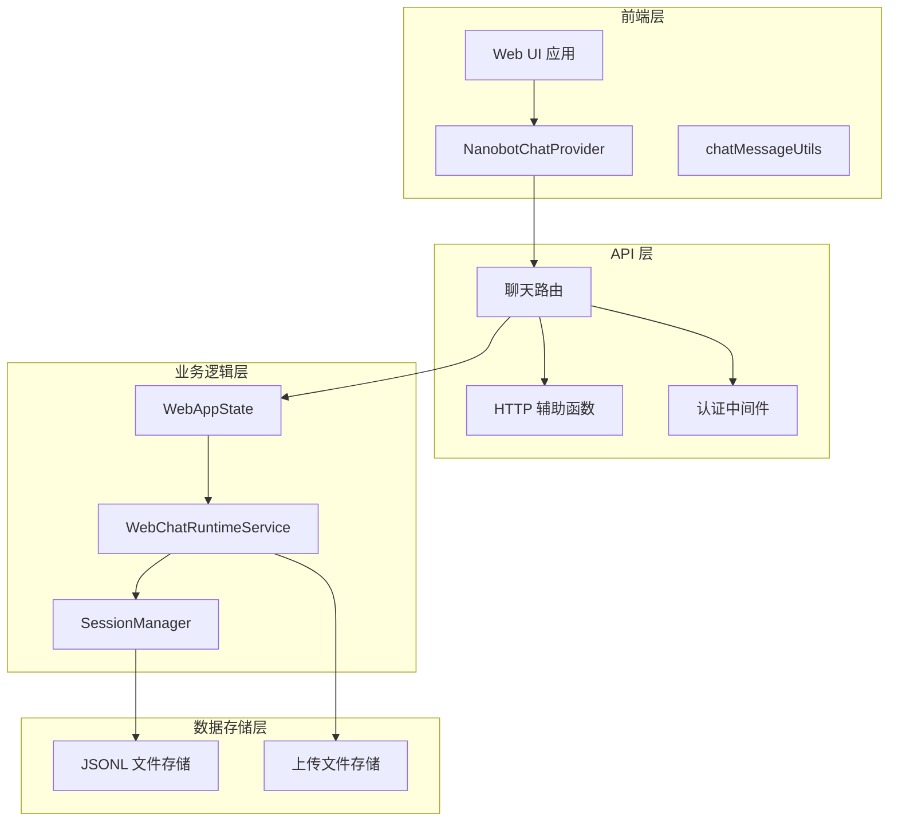
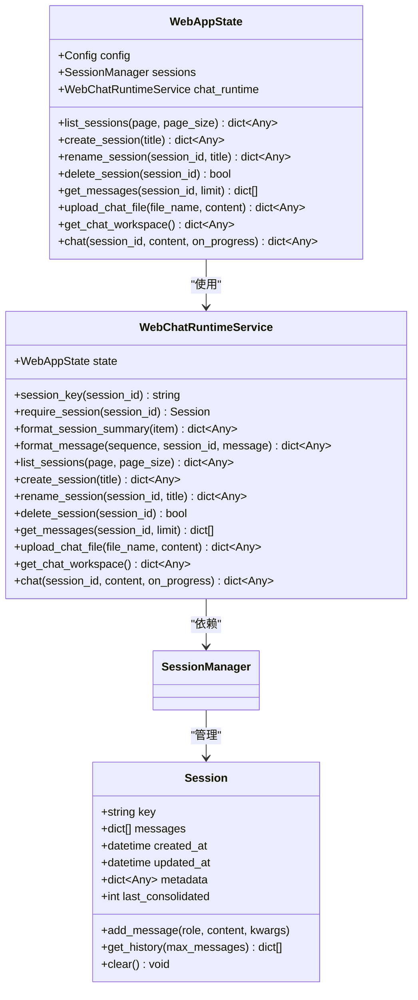
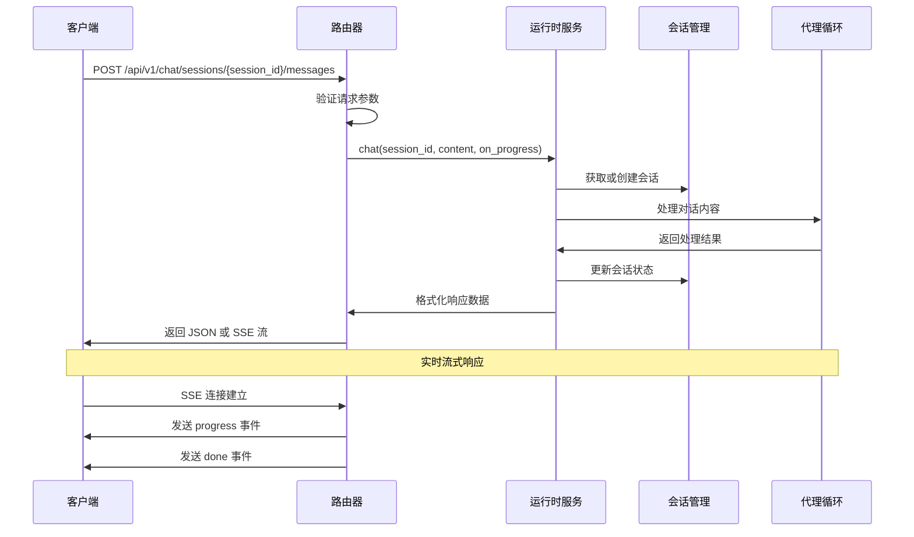
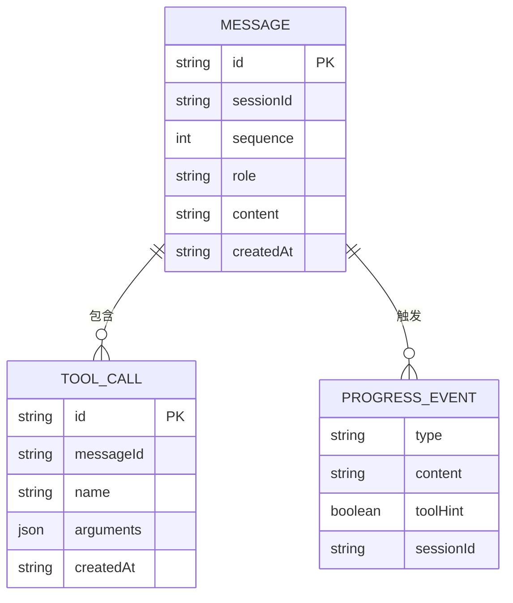
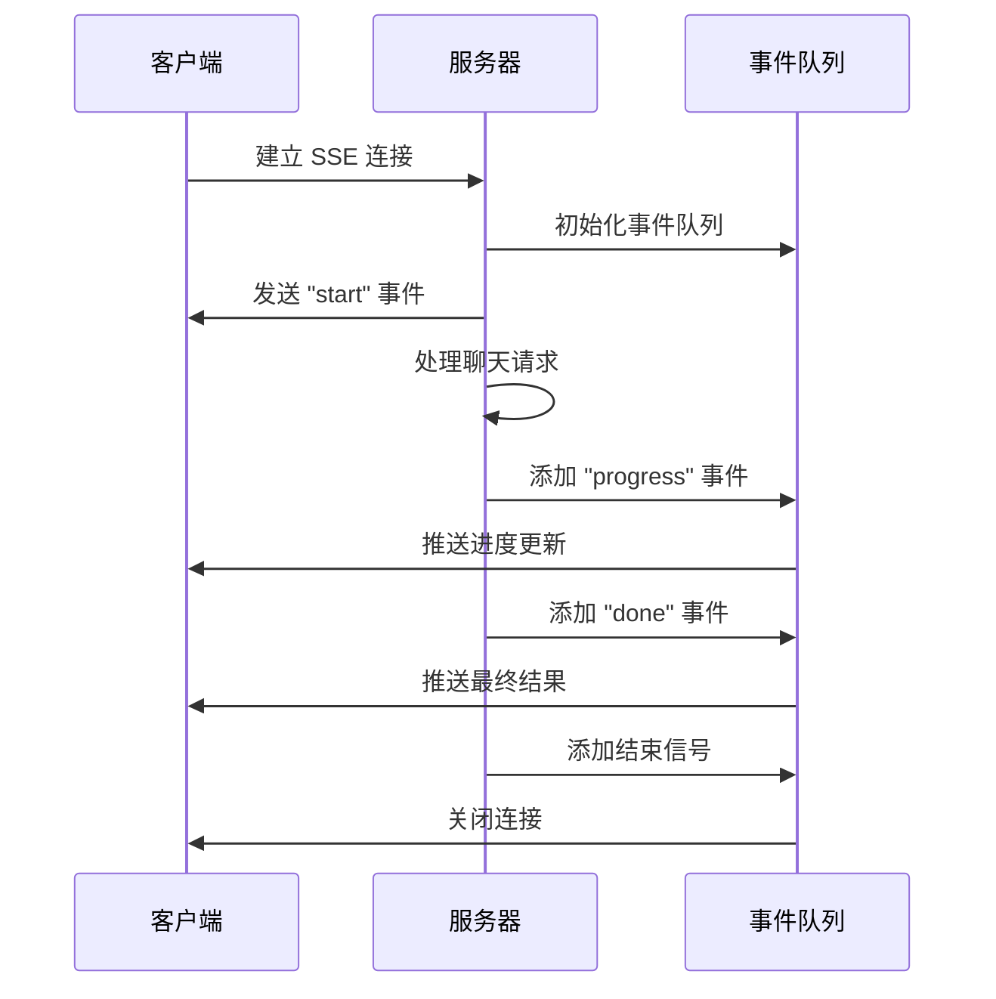
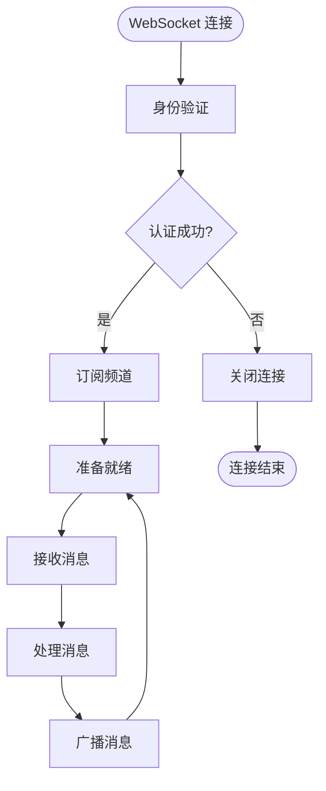
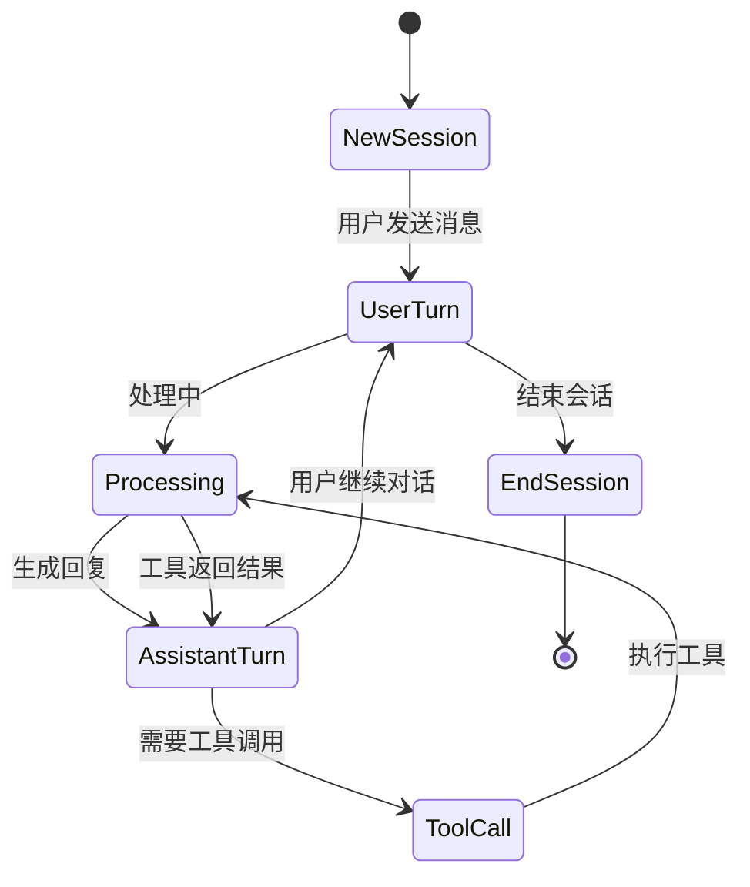
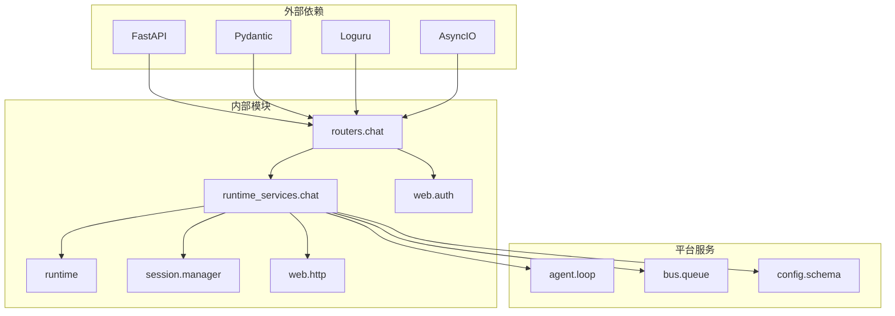

# 聊天对话 API

<cite>
**本文档引用的文件**
- [nanobot/web/routers/chat.py](file://nanobot/web/routers/chat.py)
- [nanobot/web/runtime_services/chat.py](file://nanobot/web/runtime_services/chat.py)
- [nanobot/web/runtime.py](file://nanobot/web/runtime.py)
- [nanobot/web/http.py](file://nanobot/web/http.py)
- [nanobot/web/app.py](file://nanobot/web/app.py)
- [nanobot/session/manager.py](file://nanobot/session/manager.py)
- [web-ui/src/chat/NanobotChatProvider.ts](file://web-ui/src/chat/NanobotChatProvider.ts)
- [web-ui/src/chat/chatMessageUtils.ts](file://web-ui/src/chat/chatMessageUtils.ts)
- [nanobot/web/auth.py](file://nanobot/web/auth.py)
</cite>

## 目录
1. [简介](#简介)
2. [项目结构](#项目结构)
3. [核心组件](#核心组件)
4. [架构概览](#架构概览)
5. [详细组件分析](#详细组件分析)
6. [依赖关系分析](#依赖关系分析)
7. [性能考虑](#性能考虑)
8. [故障排除指南](#故障排除指南)
9. [结论](#结论)

## 简介

聊天对话 API 是 nanobot 项目的核心功能模块，提供了完整的实时聊天对话能力。该 API 支持消息发送、接收、历史查询和实时聊天等完整功能，包括消息格式化、上下文管理、会话状态管理和多轮对话处理机制。

本 API 基于 FastAPI 构建，采用 SSE（Server-Sent Events）实现实时流式响应，并通过 WebSocket 提供实时通信能力。系统支持多种消息类型，包括普通文本消息、工具调用消息和进度更新消息。

## 项目结构

聊天对话 API 的整体架构由以下层次组成：

**图表来源**
- [nanobot/web/routers/chat.py:1-187](file://nanobot/web/routers/chat.py#L1-L187)
- [nanobot/web/runtime_services/chat.py:1-440](file://nanobot/web/runtime_services/chat.py#L1-L440)
- [nanobot/web/runtime.py:1-301](file://nanobot/web/runtime.py#L1-L301)

**章节来源**
- [nanobot/web/routers/chat.py:1-187](file://nanobot/web/routers/chat.py#L1-L187)
- [nanobot/web/runtime_services/chat.py:1-440](file://nanobot/web/runtime_services/chat.py#L1-L440)
- [nanobot/web/runtime.py:1-301](file://nanobot/web/runtime.py#L1-L301)

## 核心组件

### 聊天路由层

聊天路由层负责处理所有与聊天相关的 HTTP 请求，包括会话管理、消息处理和文件上传等功能。

主要路由包括：
- 会话管理：创建、重命名、删除、列表查询
- 消息处理：发送消息、获取历史消息
- 文件上传：聊天文件上传和管理
- 工作区信息：获取聊天工作区配置

### 运行时服务层

运行时服务层封装了聊天功能的核心业务逻辑，提供统一的服务接口：

- WebChatRuntimeService：聊天会话管理、消息格式化、文件上传处理
- WebAppState：应用状态管理，协调各个服务组件
- SessionManager：会话持久化管理，基于 JSONL 文件存储

### 数据模型

聊天系统使用以下核心数据结构：

**图表来源**
- [nanobot/web/runtime_services/chat.py:18-440](file://nanobot/web/runtime_services/chat.py#L18-L440)
- [nanobot/web/runtime.py:72-301](file://nanobot/web/runtime.py#L72-L301)
- [nanobot/session/manager.py:16-252](file://nanobot/session/manager.py#L16-L252)

**章节来源**
- [nanobot/web/runtime_services/chat.py:18-440](file://nanobot/web/runtime_services/chat.py#L18-L440)
- [nanobot/session/manager.py:16-252](file://nanobot/session/manager.py#L16-L252)

## 架构概览

聊天对话 API 采用分层架构设计，确保了良好的可维护性和扩展性：

**图表来源**
- [nanobot/web/routers/chat.py:105-186](file://nanobot/web/routers/chat.py#L105-L186)
- [nanobot/web/runtime_services/chat.py:418-440](file://nanobot/web/runtime_services/chat.py#L418-L440)

## 详细组件分析

### API 端点定义

#### 会话管理端点

| 方法 | 路径 | 功能 | 请求体 | 响应 |
|------|------|------|--------|------|
| GET | `/api/v1/chat/sessions` | 获取会话列表 | 查询参数: page, pageSize | 会话列表 |
| POST | `/api/v1/chat/sessions` | 创建新会话 | 可选标题 | 新会话信息 |
| PATCH | `/api/v1/chat/sessions/{session_id}` | 重命名会话 | 新标题 | 更新后的会话 |
| DELETE | `/api/v1/chat/sessions/{session_id}` | 删除会话 | 无 | 删除确认 |
| GET | `/api/v1/chat/sessions/{session_id}/messages` | 获取消息历史 | 查询参数: limit | 消息列表 |

#### 消息处理端点

| 方法 | 路径 | 功能 | 请求体 | 响应 |
|------|------|------|--------|------|
| POST | `/api/v1/chat/sessions/{session_id}/messages` | 发送消息 | content | 处理结果 |
| POST | `/api/v1/chat/uploads` | 上传文件 | multipart/form-data | 文件信息 |

#### 工作区端点

| 方法 | 路径 | 功能 | 请求体 | 响应 |
|------|------|------|--------|------|
| GET | `/api/v1/chat/workspace` | 获取工作区信息 | 无 | 工作区配置 |

**章节来源**
- [nanobot/web/routers/chat.py:31-186](file://nanobot/web/routers/chat.py#L31-L186)

### 消息格式规范

系统支持多种消息格式，用于不同的交互场景：

#### 基础消息格式

**图表来源**
- [nanobot/web/runtime_services/chat.py:56-71](file://nanobot/web/runtime_services/chat.py#L56-L71)

#### 上下文管理机制

系统通过 Session 类实现智能的上下文管理：

- **消息追加模式**：消息以只追加方式存储，提高 LLM 缓存效率
- **历史截断**：默认保留最近 500 条消息，自动丢弃非用户开头的消息
- **元数据管理**：支持会话标题、创建时间、更新时间等元数据
- **持久化存储**：使用 JSONL 文件格式进行高效存储

**章节来源**
- [nanobot/session/manager.py:16-252](file://nanobot/session/manager.py#L16-L252)

### 实时通信协议

#### SSE 流式传输

系统使用 Server-Sent Events 实现高效的实时通信：

**图表来源**
- [nanobot/web/routers/chat.py:120-169](file://nanobot/web/routers/chat.py#L120-L169)

#### 事件类型定义

| 事件类型 | 字段 | 描述 |
|----------|------|------|
| start | sessionId | 连接建立事件 |
| progress | content, toolHint | 进度更新事件 |
| done | content, assistantMessage, session, messages | 处理完成事件 |
| error | message | 错误事件 |

**章节来源**
- [nanobot/web/routers/chat.py:120-169](file://nanobot/web/routers/chat.py#L120-L169)

### WebSocket 实时通信

虽然主要 API 使用 SSE，但系统还支持 WebSocket 实现实时通信：

**图表来源**
- [bridge/src/server.ts:27-68](file://bridge/src/server.ts#L27-L68)

### 多轮对话处理机制

系统通过智能的上下文管理实现多轮对话：

**图表来源**
- [nanobot/web/runtime_services/chat.py:418-440](file://nanobot/web/runtime_services/chat.py#L418-L440)

**章节来源**
- [nanobot/web/runtime_services/chat.py:418-440](file://nanobot/web/runtime_services/chat.py#L418-L440)

### 文件上传和管理

系统提供完整的文件上传和管理功能：

- **文件大小限制**：最大 10MB
- **文件名安全处理**：过滤特殊字符，确保文件名安全
- **上传目录管理**：自动创建 uploads 目录
- **最近上传列表**：最多显示 6 个最近上传的文件

**章节来源**
- [nanobot/web/runtime_services/chat.py:152-180](file://nanobot/web/runtime_services/chat.py#L152-L180)

## 依赖关系分析

**图表来源**
- [nanobot/web/routers/chat.py:1-15](file://nanobot/web/routers/chat.py#L1-L15)
- [nanobot/web/runtime_services/chat.py:11-16](file://nanobot/web/runtime_services/chat.py#L11-L16)

**章节来源**
- [nanobot/web/app.py:47-67](file://nanobot/web/app.py#L47-L67)

## 性能考虑

### 会话存储优化

- **JSONL 文件格式**：提供高效的读写性能
- **内存缓存**：减少磁盘 I/O 操作
- **消息截断**：控制内存使用量，避免无限增长
- **元数据分离**：将元数据和消息分离存储

### 实时通信优化

- **异步处理**：使用 asyncio 实现高并发
- **事件队列**：通过队列管理事件流
- **连接池**：复用连接资源
- **背压处理**：防止消息积压

### 缓存策略

- **会话缓存**：内存中的会话对象缓存
- **配置缓存**：运行时配置缓存
- **工具调用缓存**：LLM 调用结果缓存

## 故障排除指南

### 常见错误类型

| 错误码 | 错误类型 | 描述 | 解决方案 |
|--------|----------|------|----------|
| 400 | VALIDATION_ERROR | 请求参数验证失败 | 检查请求格式和必填字段 |
| 401 | AUTH_REQUIRED | 需要身份验证 | 登录系统或提供有效令牌 |
| 404 | CHAT_SESSION_NOT_FOUND | 会话不存在 | 检查会话 ID 是否正确 |
| 409 | AUTH_ALREADY_INITIALIZED | 系统已初始化 | 不要重复初始化 |
| 500 | CHAT_FAILED | 聊天处理失败 | 检查后端服务状态 |

### 连接问题诊断

1. **SSE 连接失败**
   - 检查网络连接稳定性
   - 确认服务器端口开放
   - 验证 CORS 配置

2. **WebSocket 连接异常**
   - 检查防火墙设置
   - 验证认证令牌
   - 确认服务端配置

3. **会话状态异常**
   - 清理浏览器缓存
   - 检查会话文件完整性
   - 重启服务进程

**章节来源**
- [nanobot/web/http.py:31-40](file://nanobot/web/http.py#L31-L40)
- [nanobot/web/app.py:205-223](file://nanobot/web/app.py#L205-L223)

## 结论

聊天对话 API 提供了一个完整、高效且可扩展的实时聊天解决方案。通过合理的架构设计和优化策略，系统能够支持大规模的并发访问和复杂的多轮对话场景。

主要优势包括：
- **完整的功能覆盖**：从基础消息发送到高级工具集成
- **优秀的性能表现**：基于异步处理和缓存优化
- **灵活的扩展性**：模块化设计便于功能扩展
- **可靠的稳定性**：完善的错误处理和监控机制

未来可以考虑的功能增强：
- 支持消息标记和分类
- 实现消息撤回和编辑功能
- 增强消息转发和分享能力
- 优化移动端用户体验