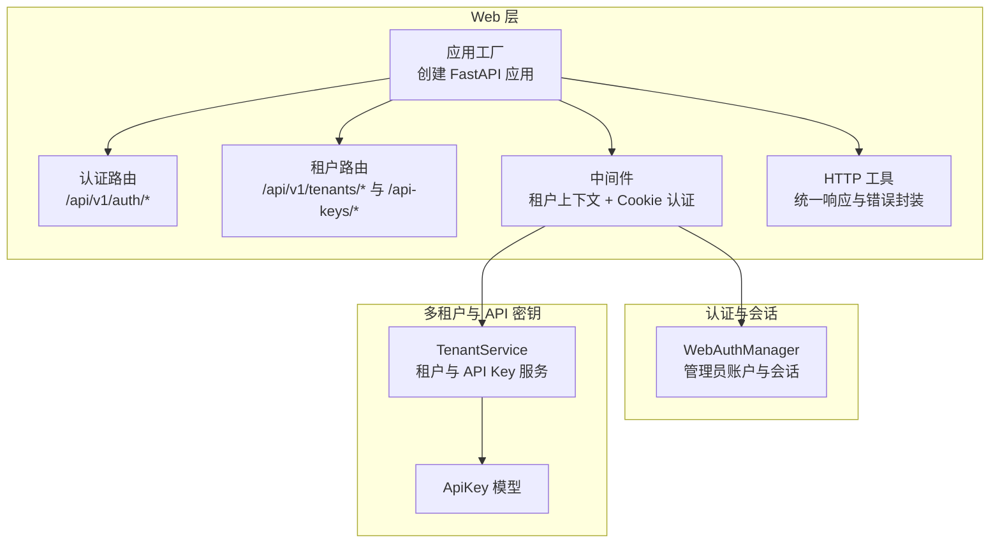
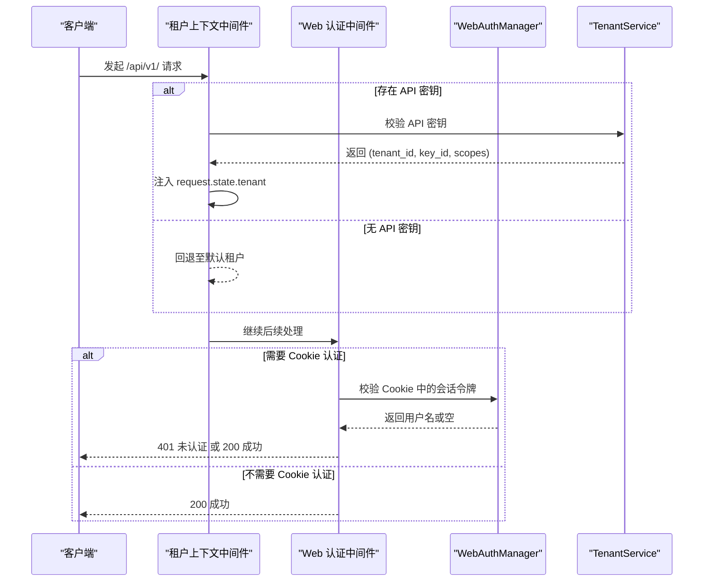
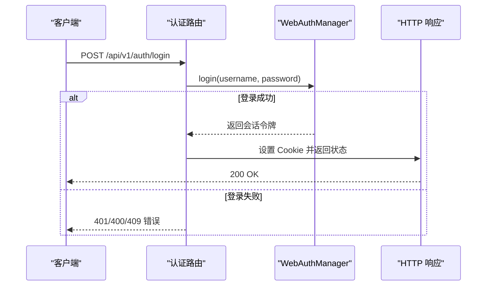
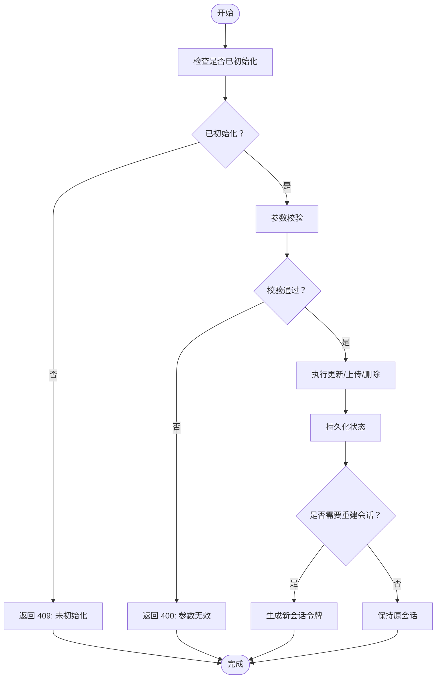
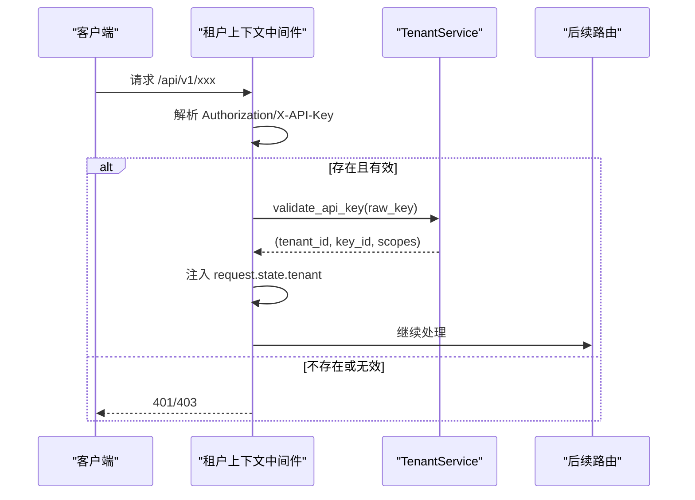
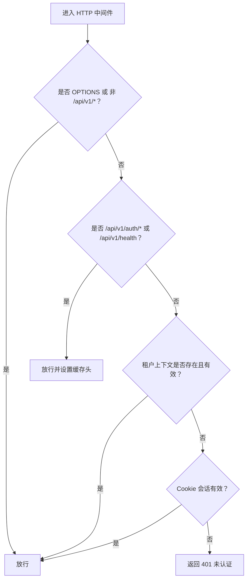
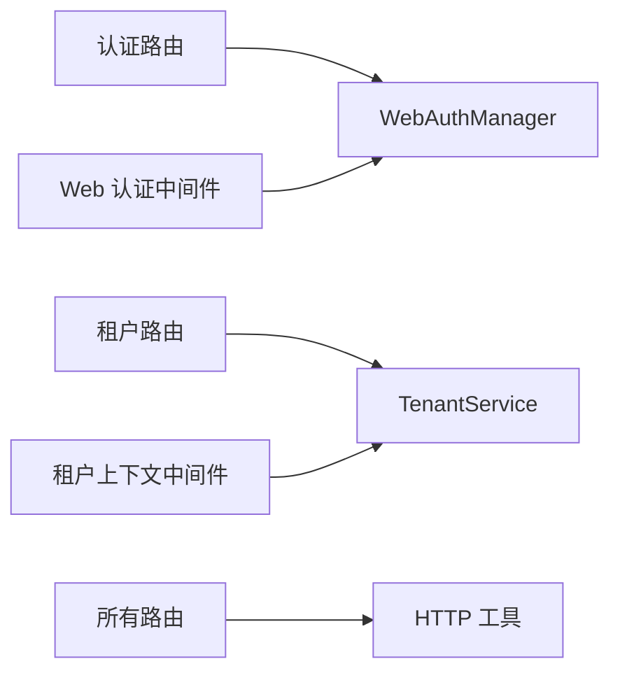

# 认证与授权 API

<cite>
**本文引用的文件**
- [nanobot/web/routers/auth.py](file://nanobot/web/routers/auth.py)
- [nanobot/web/auth.py](file://nanobot/web/auth.py)
- [nanobot/web/app.py](file://nanobot/web/app.py)
- [nanobot/web/tenant_context.py](file://nanobot/web/tenant_context.py)
- [nanobot/web/http.py](file://nanobot/web/http.py)
- [nanobot/platform/tenants/service.py](file://nanobot/platform/tenants/service.py)
- [nanobot/platform/tenants/models.py](file://nanobot/platform/tenants/models.py)
- [nanobot/web/routers/tenants.py](file://nanobot/web/routers/tenants.py)
- [SECURITY.md](file://SECURITY.md)
</cite>

## 目录
1. [简介](#简介)
2. [项目结构](#项目结构)
3. [核心组件](#核心组件)
4. [架构总览](#架构总览)
5. [详细组件分析](#详细组件分析)
6. [依赖分析](#依赖分析)
7. [性能考量](#性能考量)
8. [故障排查指南](#故障排查指南)
9. [结论](#结论)
10. [附录](#附录)

## 简介
本文件为 Nanobot 的认证与授权 API 文档，覆盖以下主题：
- 登录、登出、状态查询等认证端点的 HTTP 方法、URL 模式与请求/响应格式
- 会话（Cookie）机制与有效期管理
- API 密钥管理与多租户上下文注入
- 中间件的使用与权限检查流程
- 错误处理、安全考虑与最佳实践

注意：当前实现未包含 JWT 令牌生成与验证逻辑，而是采用基于 Cookie 的会话机制；同时支持通过 API 密钥进行多租户 API 调用。

## 项目结构
认证与授权相关代码主要分布在以下模块：
- Web 层路由与中间件：认证路由、前端静态资源、全局异常处理、HTTP 响应封装
- 认证管理器：管理员账户初始化、登录校验、会话生命周期管理、头像上传与读取
- 多租户与 API 密钥：租户服务、API 密钥创建/校验/撤销、租户上下文中间件
- 安全策略：仓库安全政策与最佳实践



图表来源
- [nanobot/web/app.py:70-280](file://nanobot/web/app.py#L70-L280)
- [nanobot/web/routers/auth.py:1-220](file://nanobot/web/routers/auth.py#L1-L220)
- [nanobot/web/routers/tenants.py:1-119](file://nanobot/web/routers/tenants.py#L1-L119)
- [nanobot/web/tenant_context.py:1-108](file://nanobot/web/tenant_context.py#L1-L108)
- [nanobot/web/auth.py:1-414](file://nanobot/web/auth.py#L1-L414)
- [nanobot/platform/tenants/service.py:1-191](file://nanobot/platform/tenants/service.py#L1-L191)
- [nanobot/platform/tenants/models.py:1-100](file://nanobot/platform/tenants/models.py#L1-L100)
- [nanobot/web/http.py:1-40](file://nanobot/web/http.py#L1-L40)

章节来源
- [nanobot/web/app.py:70-280](file://nanobot/web/app.py#L70-L280)
- [nanobot/web/routers/auth.py:1-220](file://nanobot/web/routers/auth.py#L1-L220)
- [nanobot/web/routers/tenants.py:1-119](file://nanobot/web/routers/tenants.py#L1-L119)
- [nanobot/web/tenant_context.py:1-108](file://nanobot/web/tenant_context.py#L1-L108)
- [nanobot/web/auth.py:1-414](file://nanobot/web/auth.py#L1-L414)
- [nanobot/platform/tenants/service.py:1-191](file://nanobot/platform/tenants/service.py#L1-L191)
- [nanobot/platform/tenants/models.py:1-100](file://nanobot/platform/tenants/models.py#L1-L100)
- [nanobot/web/http.py:1-40](file://nanobot/web/http.py#L1-L40)

## 核心组件
- WebAuthManager：负责管理员账户初始化、登录校验、会话创建与失效、头像存储与读取、用户资料更新与密码轮换
- 租户上下文中间件：优先尝试 API 密钥认证，失败则回退到 Cookie 会话认证，并将租户信息注入请求上下文
- TenantService：提供租户 CRUD 与 API Key 创建/校验/撤销能力
- 统一响应与错误封装：统一返回体结构与错误码

章节来源
- [nanobot/web/auth.py:129-414](file://nanobot/web/auth.py#L129-L414)
- [nanobot/web/tenant_context.py:26-92](file://nanobot/web/tenant_context.py#L26-L92)
- [nanobot/platform/tenants/service.py:43-191](file://nanobot/platform/tenants/service.py#L43-L191)
- [nanobot/web/http.py:11-40](file://nanobot/web/http.py#L11-L40)

## 架构总览
认证与授权的整体流程如下：
- WebAuthManager 管理管理员账户与会话；Cookie 名称与有效期在配置中定义
- 租户上下文中间件优先从请求头提取 API 密钥（Authorization: Bearer 或 X-API-Key），若有效则注入租户上下文；否则回退到 Cookie 会话认证
- 全局 HTTP 中间件对非 /api/v1/ 路径与健康检查路径放行，其余 API 路由在未携带有效租户上下文时拒绝访问



图表来源
- [nanobot/web/tenant_context.py:26-92](file://nanobot/web/tenant_context.py#L26-L92)
- [nanobot/web/app.py:225-246](file://nanobot/web/app.py#L225-L246)
- [nanobot/web/auth.py:317-346](file://nanobot/web/auth.py#L317-L346)
- [nanobot/platform/tenants/service.py:160-179](file://nanobot/platform/tenants/service.py#L160-L179)

章节来源
- [nanobot/web/app.py:225-246](file://nanobot/web/app.py#L225-L246)
- [nanobot/web/tenant_context.py:26-92](file://nanobot/web/tenant_context.py#L26-L92)
- [nanobot/web/auth.py:317-346](file://nanobot/web/auth.py#L317-L346)
- [nanobot/platform/tenants/service.py:160-179](file://nanobot/platform/tenants/service.py#L160-L179)

## 详细组件分析

### 认证端点（Cookie 会话）
- 端点设计
  - GET /api/v1/auth/status：查询当前认证状态（是否已初始化、是否已登录、用户名）
  - POST /api/v1/auth/bootstrap：初始化管理员账户（仅在未初始化时可用）
  - POST /api/v1/auth/login：登录并创建会话
  - POST /api/v1/auth/logout：登出并清除会话
- 会话机制
  - 使用 Cookie 存储会话令牌，名称与有效期在配置中定义
  - 会话过期时间固定，到期后自动失效
- 请求/响应格式
  - 所有 API 均返回统一结构：包含 success、data、error 字段
  - 成功时 data 为业务数据，错误时 error 包含 code、message、details
- 错误码
  - AUTH_NOT_INITIALIZED、AUTH_INVALID_CREDENTIALS、AUTH_ALREADY_INITIALIZED、AUTH_VALIDATION_ERROR 等



图表来源
- [nanobot/web/routers/auth.py:106-119](file://nanobot/web/routers/auth.py#L106-L119)
- [nanobot/web/auth.py:176-194](file://nanobot/web/auth.py#L176-L194)
- [nanobot/web/http.py:11-25](file://nanobot/web/http.py#L11-L25)

章节来源
- [nanobot/web/routers/auth.py:87-127](file://nanobot/web/routers/auth.py#L87-L127)
- [nanobot/web/auth.py:176-194](file://nanobot/web/auth.py#L176-L194)
- [nanobot/web/http.py:11-25](file://nanobot/web/http.py#L11-L25)

### 用户资料与头像
- 端点设计
  - GET /api/v1/profile：获取当前用户资料
  - PUT /api/v1/profile：更新用户名、显示名、邮箱
  - POST /api/v1/profile/password：修改密码（需提供当前密码）
  - GET /api/v1/profile/avatar：下载头像
  - POST /api/v1/profile/avatar：上传头像（PNG/JPEG/WEBP/GIF，≤2MB）
  - DELETE /api/v1/profile/avatar：删除头像
- 行为说明
  - 更新资料或密码可能触发会话重建（当用户名变更时）
  - 头像上传后清理旧文件，更新元数据并持久化



图表来源
- [nanobot/web/routers/auth.py:130-220](file://nanobot/web/routers/auth.py#L130-L220)
- [nanobot/web/auth.py:195-301](file://nanobot/web/auth.py#L195-L301)

章节来源
- [nanobot/web/routers/auth.py:130-220](file://nanobot/web/routers/auth.py#L130-L220)
- [nanobot/web/auth.py:195-301](file://nanobot/web/auth.py#L195-L301)

### API 密钥与多租户上下文
- API 密钥
  - 前缀 nk_，创建时生成原始密钥并在响应中返回一次，随后只保存哈希
  - 支持设置过期时间与作用域列表
  - 支持启用/禁用与撤销
- 租户上下文中间件
  - 优先从 Authorization: Bearer 或 X-API-Key 提取密钥
  - 校验通过后将 tenant_id、key_id、scopes 注入 request.state.tenant
  - 可选校验 X-Tenant-Id 头与密钥所属租户一致
  - 对 /api/v1/auth/* 与 /api/v1/health 放行
- 路由端点
  - GET/POST /api/v1/tenants/{tenant_id}/api-keys：列出与创建 API Key
  - DELETE /api/v1/api-keys/{key_id}：撤销 API Key



图表来源
- [nanobot/web/tenant_context.py:26-92](file://nanobot/web/tenant_context.py#L26-L92)
- [nanobot/platform/tenants/service.py:160-179](file://nanobot/platform/tenants/service.py#L160-L179)
- [nanobot/web/routers/tenants.py:89-118](file://nanobot/web/routers/tenants.py#L89-L118)

章节来源
- [nanobot/web/tenant_context.py:26-92](file://nanobot/web/tenant_context.py#L26-L92)
- [nanobot/platform/tenants/service.py:121-179](file://nanobot/platform/tenants/service.py#L121-L179)
- [nanobot/web/routers/tenants.py:80-118](file://nanobot/web/routers/tenants.py#L80-L118)

### 中间件与权限检查
- 全局 HTTP 中间件
  - OPTIONS 请求直接放行
  - 非 /api/v1/ 路径放行（用于前端静态资源）
  - /api/v1/ 路径下，若未通过租户上下文中间件注入有效租户上下文，则检查 Cookie 会话
  - 对 /api/v1/auth/* 路径设置 no-store 缓存头
- 权限检查
  - 未携带有效租户上下文且未通过 Cookie 会话校验时，返回 401
  - 租户上下文中间件可结合 API 密钥与作用域实现细粒度权限控制



图表来源
- [nanobot/web/app.py:225-246](file://nanobot/web/app.py#L225-L246)

章节来源
- [nanobot/web/app.py:225-246](file://nanobot/web/app.py#L225-L246)

## 依赖分析
- 认证路由依赖 WebAuthManager 提供的状态、登录、会话管理与资料操作
- 租户路由依赖 TenantService 提供的租户与 API Key 管理
- 全局中间件依赖租户上下文中间件与 WebAuthManager
- 统一响应封装被各路由复用



图表来源
- [nanobot/web/routers/auth.py:1-220](file://nanobot/web/routers/auth.py#L1-L220)
- [nanobot/web/auth.py:129-414](file://nanobot/web/auth.py#L129-L414)
- [nanobot/web/routers/tenants.py:1-119](file://nanobot/web/routers/tenants.py#L1-L119)
- [nanobot/platform/tenants/service.py:43-191](file://nanobot/platform/tenants/service.py#L43-L191)
- [nanobot/web/tenant_context.py:26-92](file://nanobot/web/tenant_context.py#L26-L92)
- [nanobot/web/http.py:11-25](file://nanobot/web/http.py#L11-L25)

章节来源
- [nanobot/web/routers/auth.py:1-220](file://nanobot/web/routers/auth.py#L1-L220)
- [nanobot/web/auth.py:129-414](file://nanobot/web/auth.py#L129-L414)
- [nanobot/web/routers/tenants.py:1-119](file://nanobot/web/routers/tenants.py#L1-L119)
- [nanobot/platform/tenants/service.py:43-191](file://nanobot/platform/tenants/service.py#L43-L191)
- [nanobot/web/tenant_context.py:26-92](file://nanobot/web/tenant_context.py#L26-L92)
- [nanobot/web/http.py:11-25](file://nanobot/web/http.py#L11-L25)

## 性能考量
- 会话存储为内存字典，适合单实例部署；如需分布式部署，建议替换为持久化存储（如 Redis）
- PBKDF2 迭代次数较高，密码校验成本较大，建议在高并发场景评估 CPU 开销
- API 密钥校验通过数据库哈希匹配，建议为 api_keys 表建立 key_hash 索引以提升查询性能
- 头像上传写入磁盘，建议配合 CDN 或对象存储优化访问性能

## 故障排查指南
- 401 未认证
  - 检查是否正确设置 Cookie 或携带 API 密钥
  - 确认租户上下文中间件是否正确注入 tenant_id
- 409 已初始化/未初始化
  - 初始化前禁止登录；登录前必须先完成初始化
- 400 参数无效
  - 检查用户名长度、密码长度、邮箱格式、头像类型与大小
- 404 资源不存在
  - API Key 或租户不存在
- 403 权限不足
  - X-Tenant-Id 与 API Key 所属租户不一致
- 日志与审计
  - 结合仓库安全策略中的日志监控建议，定期审查认证与授权相关日志

章节来源
- [nanobot/web/routers/auth.py:94-115](file://nanobot/web/routers/auth.py#L94-L115)
- [nanobot/web/routers/tenants.py:89-118](file://nanobot/web/routers/tenants.py#L89-L118)
- [nanobot/web/tenant_context.py:74-81](file://nanobot/web/tenant_context.py#L74-L81)
- [SECURITY.md:191-203](file://SECURITY.md#L191-L203)

## 结论
Nanobot 当前采用“Cookie 会话 + API 密钥”的混合认证模型：
- WebAuthManager 负责管理员账户与会话生命周期管理
- 租户上下文中间件优先使用 API 密钥进行多租户认证，回退到 Cookie 会话
- 统一的响应与错误封装提升了 API 的一致性与可观测性
- 若需引入 JWT 令牌，可在现有中间件层扩展，以兼容现有 Cookie 会话与 API 密钥两种模式

## 附录

### 认证端点一览（HTTP 方法、URL 模式、请求/响应）
- GET /api/v1/auth/status
  - 请求：无
  - 响应：包含 initialized、authenticated、username
- POST /api/v1/auth/bootstrap
  - 请求：username、password
  - 响应：初始化后的状态与会话令牌（设置 Cookie）
- POST /api/v1/auth/login
  - 请求：username、password
  - 响应：登录后的状态与会话令牌（设置 Cookie）
- POST /api/v1/auth/logout
  - 请求：无
  - 响应：清空会话后的状态（清除 Cookie）
- GET /api/v1/profile
  - 请求：无
  - 响应：用户资料（含头像 URL）
- PUT /api/v1/profile
  - 请求：username、displayName、email
  - 响应：更新后的资料与状态（必要时重置 Cookie）
- POST /api/v1/profile/password
  - 请求：currentPassword、newPassword
  - 响应：更新后的资料与状态（重置 Cookie）
- GET /api/v1/profile/avatar
  - 请求：无
  - 响应：头像文件（二进制）
- POST /api/v1/profile/avatar
  - 请求：multipart/form-data，字段 file
  - 响应：更新后的资料
- DELETE /api/v1/profile/avatar
  - 请求：无
  - 响应：更新后的资料

章节来源
- [nanobot/web/routers/auth.py:87-220](file://nanobot/web/routers/auth.py#L87-L220)

### API 密钥管理端点
- GET /api/v1/tenants/{tenant_id}/api-keys
  - 请求：tenant_id
  - 响应：该租户的 API Key 列表
- POST /api/v1/tenants/{tenant_id}/api-keys
  - 请求：name、scopes、expiresAt
  - 响应：创建的 API Key（包含原始密钥一次）
- DELETE /api/v1/api-keys/{key_id}
  - 请求：key_id
  - 响应：删除结果

章节来源
- [nanobot/web/routers/tenants.py:80-118](file://nanobot/web/routers/tenants.py#L80-L118)
- [nanobot/platform/tenants/service.py:121-158](file://nanobot/platform/tenants/service.py#L121-L158)

### 数据模型（简化）
```mermaid
classDiagram
class Tenant {
+string tenant_id
+string name
+string status
+string plan
+dict settings
+string created_at
+string updated_at
}
class ApiKey {
+string key_id
+string tenant_id
+string key_hash
+string key_prefix
+string name
+list scopes
+bool enabled
+string last_used_at
+string expires_at
+string created_at
+string updated_at
}
Tenant ||--o{ ApiKey : "拥有"
```

图表来源
- [nanobot/platform/tenants/models.py:15-100](file://nanobot/platform/tenants/models.py#L15-L100)

章节来源
- [nanobot/platform/tenants/models.py:15-100](file://nanobot/platform/tenants/models.py#L15-L100)

### 安全与最佳实践
- API 密钥管理
  - 不要在代码中硬编码密钥，使用受保护的配置文件或环境变量
  - 定期轮换密钥，区分开发与生产密钥
- 会话与传输
  - 在 HTTPS 下运行，确保 Cookie 的 secure 属性生效
  - 合理设置会话过期时间，避免长期有效会话
- 输入与访问控制
  - 对输入参数进行严格校验，限制长度与格式
  - 为通道接入配置 allowFrom 白名单
- 日志与审计
  - 定期审查日志，关注未认证与权限错误
  - 对敏感操作（如密码修改、头像上传）增加审计记录

章节来源
- [SECURITY.md:19-203](file://SECURITY.md#L19-L203)