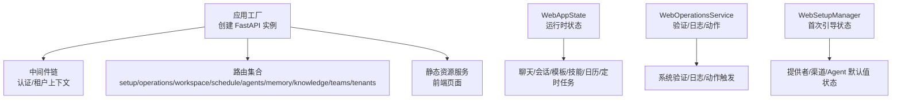
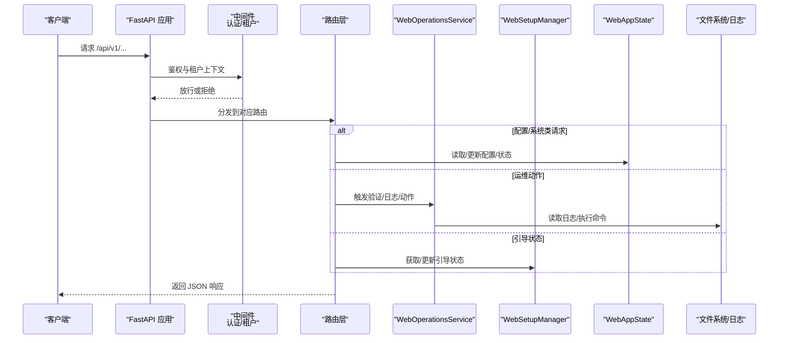
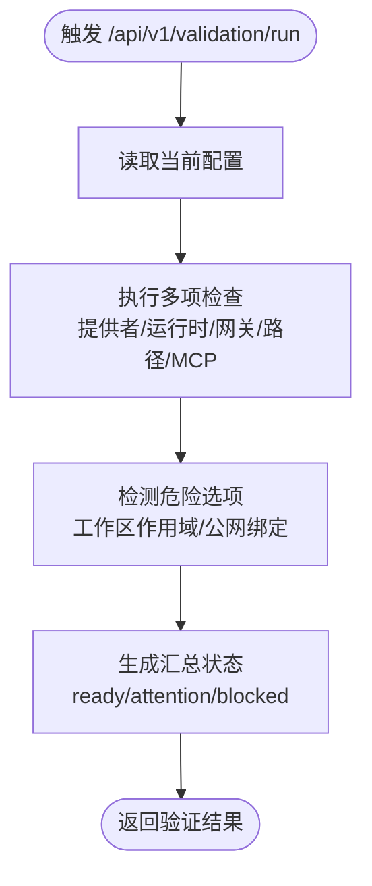
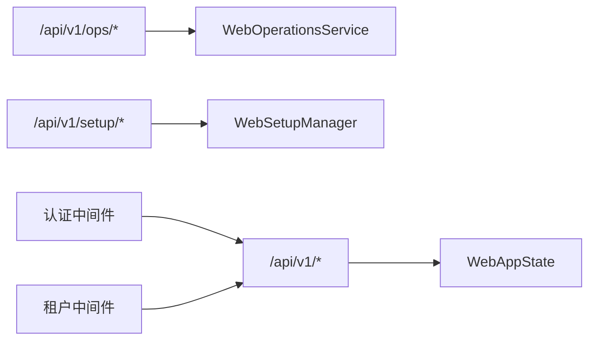

# 运营与管理 API

<cite>
**本文引用的文件**
- [nanobot/web/app.py](file://nanobot/web/app.py)
- [nanobot/web/api.py](file://nanobot/web/api.py)
- [nanobot/web/operations.py](file://nanobot/web/operations.py)
- [nanobot/web/setup.py](file://nanobot/web/setup.py)
- [nanobot/web/runtime.py](file://nanobot/web/runtime.py)
- [nanobot/web/routers/operations.py](file://nanobot/web/routers/operations.py)
- [nanobot/web/routers/setup.py](file://nanobot/web/routers/setup.py)
- [nanobot/web/routers/workspace.py](file://nanobot/web/routers/workspace.py)
- [nanobot/web/routers/schedule.py](file://nanobot/web/routers/schedule.py)
- [nanobot/web/routers/agents.py](file://nanobot/web/routers/agents.py)
- [nanobot/web/routers/memory.py](file://nanobot/web/routers/memory.py)
- [nanobot/web/routers/knowledge.py](file://nanobot/web/routers/knowledge.py)
- [nanobot/web/routers/teams.py](file://nanobot/web/routers/teams.py)
- [nanobot/web/routers/tenants.py](file://nanobot/web/routers/tenants.py)
</cite>

## 目录
1. [简介](#简介)
2. [项目结构](#项目结构)
3. [核心组件](#核心组件)
4. [架构总览](#架构总览)
5. [详细组件分析](#详细组件分析)
6. [依赖分析](#依赖分析)
7. [性能考虑](#性能考虑)
8. [故障排查指南](#故障排查指南)
9. [结论](#结论)
10. [附录](#附录)

## 简介
本文件为“运营与管理 API”的完整参考文档，覆盖系统配置、环境设置、监控指标与维护操作的 API 端点，以及健康检查、性能监控、日志管理、故障诊断、备份恢复、版本升级、配置迁移、告警、资源统计与运维自动化等能力。文档基于实际源码进行梳理，确保接口定义、参数约束、错误码与返回结构可追溯至具体实现。

## 项目结构
后端采用 FastAPI 构建，路由按功能域划分（如 setup、operations、workspace、schedule、agents、memory、knowledge、teams、tenants），并通过应用工厂函数集中注册中间件、异常处理器与静态资源服务。运行时状态由 WebAppState 统一持有，贯穿聊天、定时任务、工作区模板与技能、知识库、团队协作等子系统。

**图示来源**
- [nanobot/web/app.py:70-280](file://nanobot/web/app.py#L70-L280)
- [nanobot/web/runtime.py:72-301](file://nanobot/web/runtime.py#L72-L301)
- [nanobot/web/operations.py:40-457](file://nanobot/web/operations.py#L40-L457)
- [nanobot/web/setup.py:57-219](file://nanobot/web/setup.py#L57-L219)

**章节来源**
- [nanobot/web/app.py:70-280](file://nanobot/web/app.py#L70-L280)
- [nanobot/web/api.py:24-80](file://nanobot/web/api.py#L24-L80)
- [nanobot/web/runtime.py:72-301](file://nanobot/web/runtime.py#L72-L301)

## 核心组件
- 应用工厂与生命周期：负责创建 FastAPI 实例、注入运行时服务、注册中间件与路由，并提供前端静态资源服务。
- WebAppState：统一持有运行时状态，包括聊天、定时任务、工作区模板与技能、日历提醒、MCP 测试会话、配置运行时等。
- WebOperationsService：提供系统验证、日志采集、运维动作（重启/更新）触发与状态查询。
- WebSetupManager：跟踪首次引导进度（提供者、渠道、Agent 默认值），并持久化状态。

**章节来源**
- [nanobot/web/app.py:70-280](file://nanobot/web/app.py#L70-L280)
- [nanobot/web/runtime.py:72-301](file://nanobot/web/runtime.py#L72-L301)
- [nanobot/web/operations.py:40-457](file://nanobot/web/operations.py#L40-L457)
- [nanobot/web/setup.py:57-219](file://nanobot/web/setup.py#L57-L219)

## 架构总览
下图展示从客户端请求到业务服务的调用链，以及关键服务之间的交互关系。

**图示来源**
- [nanobot/web/app.py:225-246](file://nanobot/web/app.py#L225-L246)
- [nanobot/web/routers/operations.py:16-72](file://nanobot/web/routers/operations.py#L16-L72)
- [nanobot/web/routers/setup.py:42-156](file://nanobot/web/routers/setup.py#L42-L156)
- [nanobot/web/runtime.py:171-220](file://nanobot/web/runtime.py#L171-L220)

## 详细组件分析

### 健康检查与系统状态
- 健康检查
  - 方法与路径：GET /api/v1/health
  - 返回：{"status":"ok"}
- 系统状态
  - 方法与路径：GET /api/v1/system/status
  - 返回：系统状态摘要（由配置运行时提供）

**章节来源**
- [nanobot/web/routers/setup.py:153-156](file://nanobot/web/routers/setup.py#L153-L156)
- [nanobot/web/routers/operations.py:39-42](file://nanobot/web/routers/operations.py#L39-L42)
- [nanobot/web/runtime.py:180-182](file://nanobot/web/runtime.py#L180-L182)

### 配置管理与元数据
- 获取配置
  - 方法与路径：GET /api/v1/config
  - 返回：当前配置对象
- 获取配置元数据
  - 方法与路径：GET /api/v1/config/meta
  - 返回：配置字段的元信息（类型、范围、是否必填等）
- 更新配置
  - 方法与路径：PUT /api/v1/config
  - 请求体：配置片段（键值对）
  - 返回：更新后的配置对象
  - 错误：当更新失败时返回 400 及错误码

**章节来源**
- [nanobot/web/routers/operations.py:16-37](file://nanobot/web/routers/operations.py#L16-L37)
- [nanobot/web/runtime.py:171-179](file://nanobot/web/runtime.py#L171-L179)

### 首次引导与设置
- 获取引导状态
  - 方法与路径：GET /api/v1/setup/status
  - 返回：步骤完成情况、当前步骤、完成时间等
- 设置提供者
  - 方法与路径：PUT /api/v1/setup/provider
  - 请求体：provider、model、apiKey、apiBase
  - 返回：更新后的配置与引导状态
- 设置渠道（示例 Telegram）
  - 方法与路径：PUT /api/v1/setup/channel
  - 请求体：mode（skip 或 telegram）、token、allowFrom、proxy、replyToMessage、groupPolicy
  - 返回：更新后的配置与引导状态
- 设置 Agent 默认值
  - 方法与路径：PUT /api/v1/setup/agent-defaults
  - 请求体：workspace、maxTokens、contextWindowTokens、temperature、maxToolIterations、reasoningEffort
  - 返回：更新后的配置与引导状态

**章节来源**
- [nanobot/web/routers/setup.py:42-156](file://nanobot/web/routers/setup.py#L42-L156)
- [nanobot/web/setup.py:67-151](file://nanobot/web/setup.py#L67-L151)

### 系统验证与日志
- 运行验证
  - 方法与路径：POST /api/v1/validation/run
  - 请求体：空
  - 返回：验证汇总（pass/warn/fail 数量与明细）、危险选项提示
- 日志列表
  - 方法与路径：GET /api/v1/ops/logs?lines=N
  - 查询参数：lines（20~400，默认200）
  - 返回：日志文件清单与尾部若干行内容
- 运维动作
  - 列出动作：GET /api/v1/ops/actions
  - 触发动作：POST /api/v1/ops/actions/{action_name}
  - 动作定义：restart（环境变量 NANOBOT_WEB_RESTART_COMMAND）、update（环境变量 NANOBOT_WEB_UPDATE_COMMAND）
  - 返回：动作项（名称、标签、是否已配置、是否运行中、最后状态、命令预览等）

**图示来源**
- [nanobot/web/routers/operations.py:44-48](file://nanobot/web/routers/operations.py#L44-L48)
- [nanobot/web/operations.py:55-81](file://nanobot/web/operations.py#L55-L81)

**章节来源**
- [nanobot/web/routers/operations.py:44-72](file://nanobot/web/routers/operations.py#L44-L72)
- [nanobot/web/operations.py:55-457](file://nanobot/web/operations.py#L55-L457)

### 工作区与模板/技能/文档
- 模板
  - 列表：GET /api/v1/agent-templates
  - 工具校验：GET /api/v1/agent-templates/tools/valid
  - 新增：POST /api/v1/agent-templates
  - 导入：POST /api/v1/agent-templates/import
  - 导出：POST /api/v1/agent-templates/export
  - 重载：POST /api/v1/agent-templates/reload
  - 详情：GET /api/v1/agent-templates/{template_name}
  - 更新：PATCH /api/v1/agent-templates/{template_name}
  - 删除：DELETE /api/v1/agent-templates/{template_name}
- 技能
  - 已安装：GET /api/v1/skills/installed
  - 市场：GET /api/v1/skills/marketplace?q=&limit=
  - 安装：POST /api/v1/skills/install
  - 上传（多文件）：POST /api/v1/skills/upload
  - 上传（ZIP）：POST /api/v1/skills/upload-zip
  - 删除：DELETE /api/v1/skills/{skill_id}
- 文档
  - 列表：GET /api/v1/documents
  - 详情：GET /api/v1/documents/{document_id}
  - 更新：PUT /api/v1/documents/{document_id}
  - 重置：POST /api/v1/documents/{document_id}/reset

**章节来源**
- [nanobot/web/routers/workspace.py:47-245](file://nanobot/web/routers/workspace.py#L47-L245)
- [nanobot/web/runtime.py:226-288](file://nanobot/web/runtime.py#L226-L288)

### 定时任务与日历
- Cron
  - 状态：GET /api/v1/cron/status
  - 列表：GET /api/v1/cron/jobs?includeDisabled=
  - 新增：POST /api/v1/cron/jobs
  - 更新：PATCH /api/v1/cron/jobs/{job_id}
  - 删除：DELETE /api/v1/cron/jobs/{job_id}
  - 立即运行：POST /api/v1/cron/jobs/{job_id}/run
- 日历
  - 事件列表：GET /api/v1/calendar/events?start=&end=
  - 新增：POST /api/v1/calendar/events
  - 更新：PATCH /api/v1/calendar/events/{event_id}
  - 删除：DELETE /api/v1/calendar/events/{event_id}
  - 设置：GET /api/v1/calendar/settings
  - 更新：PATCH /api/v1/calendar/settings
  - 作业：GET /api/v1/calendar/jobs

**章节来源**
- [nanobot/web/routers/schedule.py:40-161](file://nanobot/web/routers/schedule.py#L40-L161)
- [nanobot/web/runtime.py:183-225](file://nanobot/web/runtime.py#L183-L225)

### 团队与协作
- 团队
  - 列表：GET /api/v1/teams?enabled=
  - 新增：POST /api/v1/teams
  - 详情：GET /api/v1/teams/{team_id}
  - 线程摘要：GET /api/v1/teams/{team_id}/thread
  - 线程消息：GET /api/v1/teams/{team_id}/thread/messages?limit=
  - 更新：PUT /api/v1/teams/{team_id}
  - 删除：DELETE /api/v1/teams/{team_id}
  - 复制：POST /api/v1/teams/{team_id}/copy
  - 启用/禁用：POST /api/v1/teams/{team_id}/enable, POST /api/v1/teams/{team_id}/disable
  - 测试运行：POST /api/v1/teams/{team_id}/runs
  - 重试运行：POST /api/v1/teams/{team_id}/runs/{run_id}/retry

**章节来源**
- [nanobot/web/routers/teams.py:30-185](file://nanobot/web/routers/teams.py#L30-L185)
- [nanobot/web/runtime.py:235-236](file://nanobot/web/runtime.py#L235-L236)

### Agent 管理
- Agent
  - 列表：GET /api/v1/agents?enabled=
  - 新增：POST /api/v1/agents
  - 详情：GET /api/v1/agents/{agent_id}
  - 更新：PUT /api/v1/agents/{agent_id}
  - 删除：DELETE /api/v1/agents/{agent_id}
  - 复制：POST /api/v1/agents/{agent_id}/copy
  - 启用/禁用：POST /api/v1/agents/{agent_id}/enable, POST /api/v1/agents/{agent_id}/disable
  - 测试运行：POST /api/v1/agents/{agent_id}/test-run

**章节来源**
- [nanobot/web/routers/agents.py:43-162](file://nanobot/web/routers/agents.py#L43-L162)

### 记忆与检索
- 团队记忆
  - 获取：GET /api/v1/teams/{team_id}/memory
  - 更新：PUT /api/v1/teams/{team_id}/memory
- 记忆候选
  - 列表：GET /api/v1/memory-candidates?teamId=&status=&scope=&limit=
  - 应用：POST /api/v1/memory-candidates/{candidate_id}/apply
  - 拒绝：POST /api/v1/memory-candidates/{candidate_id}/reject
- 记忆检索
  - 搜索：POST /api/v1/memory-search
  - 获取来源：POST /api/v1/memory-get

**章节来源**
- [nanobot/web/routers/memory.py:32-125](file://nanobot/web/routers/memory.py#L32-L125)

### 知识库
- 知识库
  - 列表：GET /api/v1/knowledge-bases?enabled=
  - 新增：POST /api/v1/knowledge-bases
  - 详情：GET /api/v1/knowledge-bases/{kb_id}
  - 更新：PUT /api/v1/knowledge-bases/{kb_id}
  - 删除：DELETE /api/v1/knowledge-bases/{kb_id}
- 文档与来源
  - 文档列表：GET /api/v1/knowledge-bases/{kb_id}/documents
  - 来源列表：GET /api/v1/knowledge-bases/{kb_id}/sources
  - 更新来源：PUT /api/v1/knowledge-bases/{kb_id}/sources/{source_id}
  - 删除文档：DELETE /api/v1/knowledge-bases/{kb_id}/documents/{doc_id}
  - 批量删除文档：POST /api/v1/knowledge-bases/{kb_id}/documents/delete
  - 同步来源：POST /api/v1/knowledge-bases/{kb_id}/sources/{source_id}/sync
- 索引与检索
  - 作业：GET /api/v1/knowledge-bases/{kb_id}/jobs
  - 入库（文件/URL/FAQ 表格）：POST /api/v1/knowledge-bases/{kb_id}/documents
  - 检索测试：POST /api/v1/knowledge-bases/{kb_id}/retrieve-test
  - 重建索引：POST /api/v1/knowledge-bases/{kb_id}/reindex

**章节来源**
- [nanobot/web/routers/knowledge.py:22-240](file://nanobot/web/routers/knowledge.py#L22-L240)

### 租户与 API Key
- 租户
  - 列表：GET /api/v1/tenants
  - 新增：POST /api/v1/tenants
  - 详情：GET /api/v1/tenants/{tenant_id}
  - 更新：PUT /api/v1/tenants/{tenant_id}
  - 删除：DELETE /api/v1/tenants/{tenant_id}
- API Key
  - 列表：GET /api/v1/tenants/{tenant_id}/api-keys
  - 新增：POST /api/v1/tenants/{tenant_id}/api-keys
  - 撤销：DELETE /api/v1/api-keys/{key_id}

**章节来源**
- [nanobot/web/routers/tenants.py:24-119](file://nanobot/web/routers/tenants.py#L24-L119)

## 依赖分析
- 路由到服务的依赖
  - operations 路由依赖 WebOperationsService（验证、日志、动作）
  - setup 路由依赖 WebSetupManager（引导状态）
  - 其他路由依赖 WebAppState 提供的运行时服务（聊天、定时、工作区、知识库、团队等）
- 中间件依赖
  - 认证中间件：要求 Cookie 登录或租户 API Key
  - 租户中间件：解析租户上下文，支持多租户隔离

**图示来源**
- [nanobot/web/app.py:225-246](file://nanobot/web/app.py#L225-L246)
- [nanobot/web/routers/operations.py:16-72](file://nanobot/web/routers/operations.py#L16-L72)
- [nanobot/web/routers/setup.py:42-156](file://nanobot/web/routers/setup.py#L42-L156)

**章节来源**
- [nanobot/web/app.py:225-246](file://nanobot/web/app.py#L225-L246)

## 性能考虑
- 验证与日志
  - 验证接口聚合多项检查，建议在变更配置后批量运行，避免频繁调用。
  - 日志接口支持限制行数（20~400），建议根据需要调整 lines 参数以控制响应大小。
- 定时任务与日历
  - Cron 作业与日历事件较多时，建议分页查询与合理设置 includeDisabled。
- 知识库入库
  - 文件上传与 URL/FAQ 入库可能耗时较长，建议使用异步返回并在作业列表轮询进度。

[本节为通用指导，无需特定文件来源]

## 故障排查指南
- 常见错误码
  - CONFIG_UPDATE_FAILED：配置更新失败
  - OPS_ACTION_RUNNING/OPS_ACTION_INVALID：运维动作处于运行中或无效
  - CRON_VALIDATION_ERROR/CRON_RUN_FAILED：Cron 参数校验失败或执行失败
  - CALENDAR_*：日历相关参数或资源不存在
  - KNOWLEDGE_*：知识库/文档/来源相关错误
  - TEAM_*：团队定义冲突/校验失败/不存在
  - AGENT_*：Agent 冲突/校验失败/不存在
  - TENANT_*：租户冲突/校验失败/不存在
  - API_KEY_VALIDATION_ERROR：API Key 名称/范围/过期时间不合法
- 排查步骤
  - 使用 GET /api/v1/validation/run 快速定位提供者、运行时、网关、路径、MCP 等问题
  - 使用 GET /api/v1/ops/logs?lines=400 查看最近日志
  - 对于动作失败，检查环境变量 NANOBOT_WEB_RESTART_COMMAND/NANOBOT_WEB_UPDATE_COMMAND 是否正确配置
  - 对于知识库入库失败，确认 sourceType 与请求体格式，或检查 multipart 字段是否匹配

**章节来源**
- [nanobot/web/routers/operations.py:62-72](file://nanobot/web/routers/operations.py#L62-L72)
- [nanobot/web/routers/schedule.py:85-94](file://nanobot/web/routers/schedule.py#L85-L94)
- [nanobot/web/routers/knowledge.py:150-186](file://nanobot/web/routers/knowledge.py#L150-L186)
- [nanobot/web/operations.py:113-135](file://nanobot/web/operations.py#L113-L135)

## 结论
本参考文档梳理了运营与管理 API 的全貌，涵盖系统健康、配置、验证、日志、运维动作、工作区模板与技能、定时任务与日历、团队协作、知识库、租户与 API Key 等模块。建议在生产环境中结合验证接口与日志接口进行持续巡检，并通过动作接口安全地执行重启/更新等高危操作。

[本节为总结性内容，无需特定文件来源]

## 附录

### API 一览（按功能域）
- 健康与系统
  - GET /api/v1/health
  - GET /api/v1/system/status
- 配置
  - GET /api/v1/config
  - GET /api/v1/config/meta
  - PUT /api/v1/config
- 首次引导
  - GET /api/v1/setup/status
  - PUT /api/v1/setup/provider
  - PUT /api/v1/setup/channel
  - PUT /api/v1/setup/agent-defaults
- 运维与验证
  - POST /api/v1/validation/run
  - GET /api/v1/ops/logs?lines=
  - GET /api/v1/ops/actions
  - POST /api/v1/ops/actions/{action_name}
- 工作区/模板/技能/文档
  - 模板：GET/POST/PATCH/DELETE /api/v1/agent-templates/*
  - 技能：GET/POST/DELETE /api/v1/skills/*
  - 文档：GET/PUT/POST /api/v1/documents/*
- 定时任务/日历
  - Cron：GET/POST/PATCH/DELETE /api/v1/cron/jobs/*
  - 日历：GET/POST/PATCH/DELETE /api/v1/calendar/*
- 团队
  - GET/POST/PATCH/DELETE /api/v1/teams/*
  - POST /api/v1/teams/{team_id}/runs
  - POST /api/v1/teams/{team_id}/runs/{run_id}/retry
- Agent
  - GET/POST/PATCH/DELETE /api/v1/agents/*
  - POST /api/v1/agents/{agent_id}/test-run
- 记忆
  - GET/PUT /api/v1/teams/{team_id}/memory
  - GET /api/v1/memory-candidates/*
  - POST /api/v1/memory-search
  - POST /api/v1/memory-get
- 知识库
  - GET/POST/PATCH/DELETE /api/v1/knowledge-bases/*
  - POST /api/v1/knowledge-bases/{kb_id}/documents
  - POST /api/v1/knowledge-bases/{kb_id}/retrieve-test
  - POST /api/v1/knowledge-bases/{kb_id}/reindex
- 租户与 API Key
  - GET/POST/PATCH/DELETE /api/v1/tenants/*
  - GET/POST/DELETE /api/v1/tenants/{tenant_id}/api-keys

[本节为概览性汇总，无需特定文件来源]