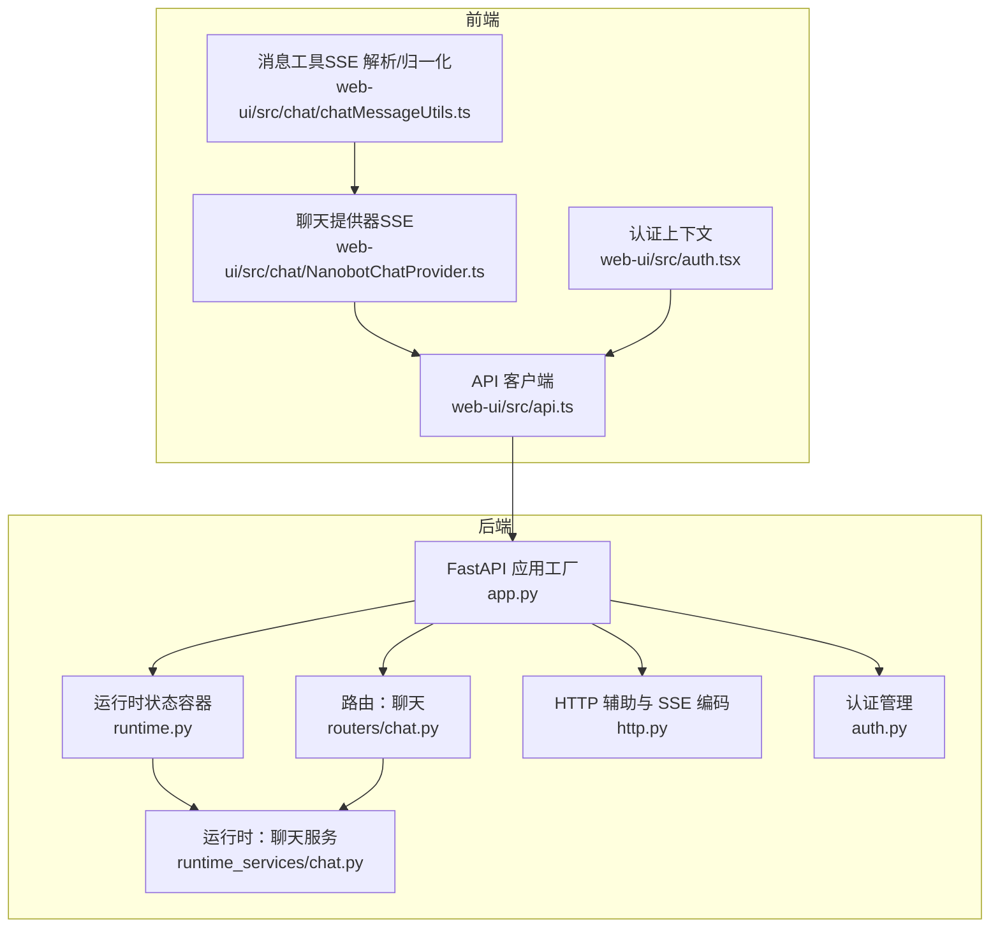
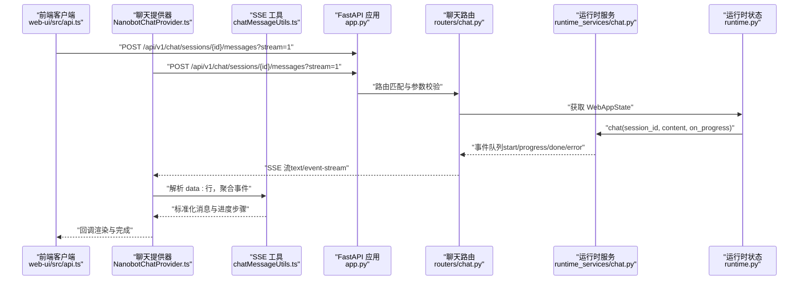
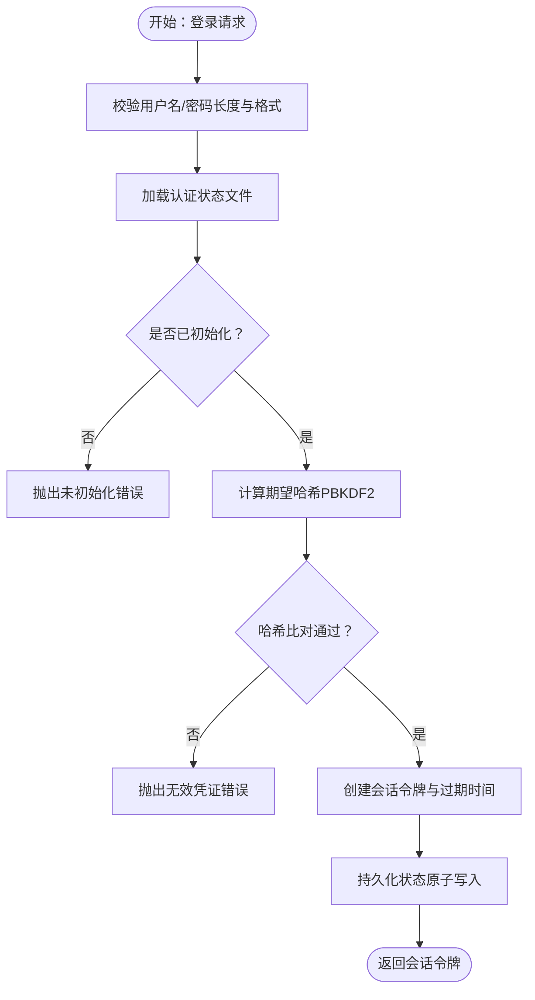
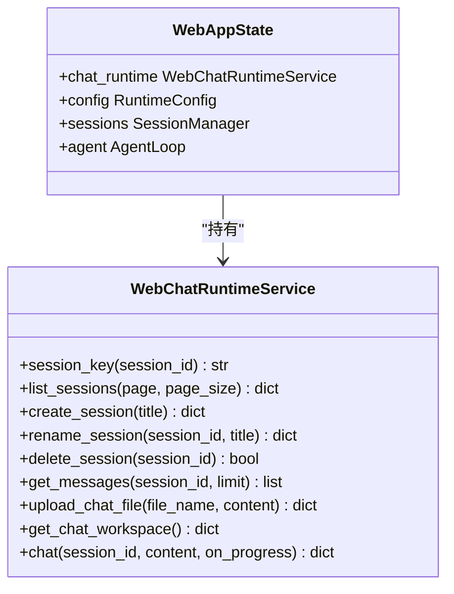
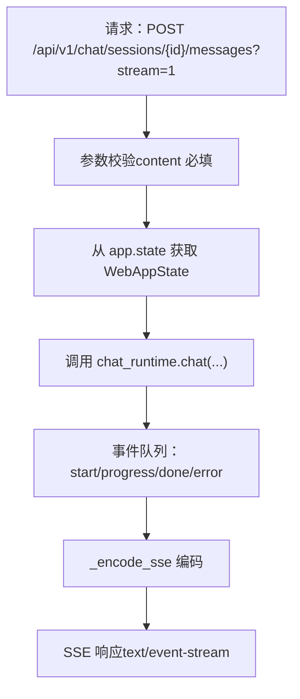
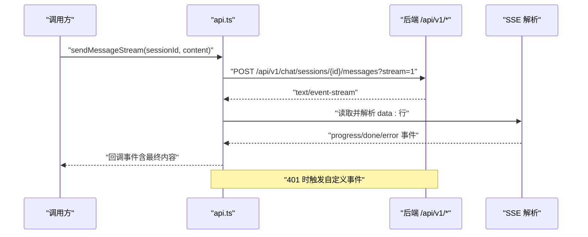
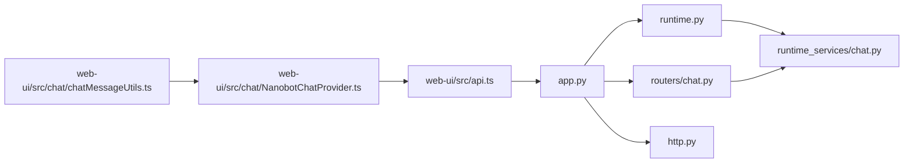

# API 集成方式

<cite>
**本文引用的文件**
- [nanobot/web/app.py](file://nanobot/web/app.py)
- [nanobot/web/api.py](file://nanobot/web/api.py)
- [nanobot/web/auth.py](file://nanobot/web/auth.py)
- [nanobot/web/http.py](file://nanobot/web/http.py)
- [nanobot/web/routers/chat.py](file://nanobot/web/routers/chat.py)
- [nanobot/web/runtime.py](file://nanobot/web/runtime.py)
- [nanobot/web/runtime_services/chat.py](file://nanobot/web/runtime_services/chat.py)
- [web-ui/src/api.ts](file://web-ui/src/api.ts)
- [web-ui/src/auth.tsx](file://web-ui/src/auth.tsx)
- [web-ui/src/chat/NanobotChatProvider.ts](file://web-ui/src/chat/NanobotChatProvider.ts)
- [web-ui/src/chat/chatMessageUtils.ts](file://web-ui/src/chat/chatMessageUtils.ts)
</cite>

## 目录
1. [简介](#简介)
2. [项目结构](#项目结构)
3. [核心组件](#核心组件)
4. [架构总览](#架构总览)
5. [详细组件分析](#详细组件分析)
6. [依赖分析](#依赖分析)
7. [性能考量](#性能考量)
8. [故障排查指南](#故障排查指南)
9. [结论](#结论)
10. [附录](#附录)

## 简介
本文件面向集成 Nanobot Web API 的前后端开发者，系统性阐述：
- 前端与后端 API 的通信协议、数据格式与请求处理机制
- RESTful API 的调用方式与路径约定
- 基于 Server-Sent Events（SSE）的实时流式响应与会话管理
- API 客户端封装、错误处理与重试策略
- 聊天消息处理、会话生命周期与状态同步的数据流
- API 版本管理、认证令牌与安全策略
- 实战示例、调试方法与性能监控建议

## 项目结构
Nanobot 的 Web API 采用 FastAPI 构建，前端使用 React + 自定义聊天提供器与 SSE 工具链。整体分层如下：
- 后端
  - 应用工厂与路由注册：在应用工厂中装配服务、中间件与异常处理器，并注册各模块路由
  - 路由模块：如聊天路由负责会话、消息与流式响应
  - 运行时服务：封装会话、消息、上传、MCP 测试等运行时能力
  - HTTP 辅助：统一封装响应体结构与 SSE 编码
  - 认证：基于 Cookie 的会话与密码校验
- 前端
  - API 客户端：统一的请求封装、错误抛出与 SSE 流解析
  - 聊天提供器：对接 SSE 流，标准化消息与进度步骤
  - 认证上下文：登录、登出、状态刷新与未授权事件通知

**图表来源**
- [nanobot/web/app.py:70-280](file://nanobot/web/app.py#L70-L280)
- [nanobot/web/routers/chat.py:1-187](file://nanobot/web/routers/chat.py#L1-L187)
- [nanobot/web/runtime_services/chat.py:1-440](file://nanobot/web/runtime_services/chat.py#L1-L440)
- [nanobot/web/runtime.py:72-301](file://nanobot/web/runtime.py#L72-L301)
- [nanobot/web/http.py:1-40](file://nanobot/web/http.py#L1-L40)
- [nanobot/web/auth.py:1-414](file://nanobot/web/auth.py#L1-L414)
- [web-ui/src/api.ts:1-881](file://web-ui/src/api.ts#L1-L881)
- [web-ui/src/chat/NanobotChatProvider.ts:1-172](file://web-ui/src/chat/NanobotChatProvider.ts#L1-L172)
- [web-ui/src/chat/chatMessageUtils.ts:1-170](file://web-ui/src/chat/chatMessageUtils.ts#L1-L170)
- [web-ui/src/auth.tsx:1-152](file://web-ui/src/auth.tsx#L1-L152)

**章节来源**
- [nanobot/web/app.py:70-280](file://nanobot/web/app.py#L70-L280)
- [nanobot/web/api.py:1-80](file://nanobot/web/api.py#L1-L80)

## 核心组件
- 应用工厂与中间件
  - 应用工厂负责装配平台实例、认证、MCP 注册与仓库、通道测试、WhatsApp 绑定、设置、操作、知识库、团队、内存、运行、租户与通道绑定服务，并注入到 app.state
  - 中间件链：先执行租户认证中间件，再执行 Web 认证中间件；对 /api/v1/ 路径进行鉴权，健康检查与认证接口放行
  - 异常处理：统一捕获 APIError、请求验证错误与 HTTP 异常，返回统一响应体
- 路由与控制器
  - 聊天路由：会话列表、创建、重命名、删除、消息查询、消息发送（支持流式）
  - 其他路由：认证、配置、频道、知识库、团队、运行、日程、工作区等（由 app.py 注册）
- 运行时服务
  - WebChatRuntimeService：会话管理、消息格式化、文件上传、MCP 测试会话、聊天主流程
  - WebAppState：统一持有各运行时服务并暴露方法，供路由调用
- 前端 API 客户端
  - 统一前缀 /api/v1，自动携带凭据（Cookie），401 触发自定义事件以驱动前端跳转登录
  - 支持普通 JSON 响应与 SSE 流式响应
- SSE 工具链
  - 后端编码：_encode_sse 将事件对象序列化为 SSE 数据块
  - 前端解析：NanobotChatProvider 与 chatMessageUtils 解析 data: 行，聚合 progress/done/error 事件

**章节来源**
- [nanobot/web/app.py:148-246](file://nanobot/web/app.py#L148-L246)
- [nanobot/web/routers/chat.py:19-187](file://nanobot/web/routers/chat.py#L19-L187)
- [nanobot/web/runtime_services/chat.py:18-440](file://nanobot/web/runtime_services/chat.py#L18-L440)
- [nanobot/web/runtime.py:72-301](file://nanobot/web/runtime.py#L72-L301)
- [nanobot/web/http.py:11-40](file://nanobot/web/http.py#L11-L40)
- [web-ui/src/api.ts:116-143](file://web-ui/src/api.ts#L116-L143)
- [web-ui/src/chat/NanobotChatProvider.ts:20-79](file://web-ui/src/chat/NanobotChatProvider.ts#L20-L79)
- [web-ui/src/chat/chatMessageUtils.ts:106-116](file://web-ui/src/chat/chatMessageUtils.ts#L106-L116)

## 架构总览
下图展示从浏览器到后端的完整调用链，包括认证、路由、运行时与 SSE 流式响应。

**图表来源**
- [nanobot/web/app.py:225-246](file://nanobot/web/app.py#L225-L246)
- [nanobot/web/routers/chat.py:105-187](file://nanobot/web/routers/chat.py#L105-L187)
- [nanobot/web/runtime_services/chat.py:418-440](file://nanobot/web/runtime_services/chat.py#L418-L440)
- [nanobot/web/runtime.py:163-169](file://nanobot/web/runtime.py#L163-L169)
- [web-ui/src/chat/NanobotChatProvider.ts:20-79](file://web-ui/src/chat/NanobotChatProvider.ts#L20-L79)
- [web-ui/src/chat/chatMessageUtils.ts:106-116](file://web-ui/src/chat/chatMessageUtils.ts#L106-L116)

## 详细组件分析

### 认证与会话管理
- 会话存储：内存中维护会话令牌与过期时间，支持清理过期与失效
- 密码策略：PBKDF2-HMAC-SHA256，迭代次数固定，盐值随机生成
- Cookie 名称：nanobot_web_session，最大有效期约 12 小时
- 登录流程：校验账户存在与密码哈希，创建新会话并返回令牌
- 前端交互：api.ts 在 401 时触发自定义事件，auth.tsx 监听并清空状态

**图表来源**
- [nanobot/web/auth.py:154-194](file://nanobot/web/auth.py#L154-L194)
- [nanobot/web/auth.py:336-346](file://nanobot/web/auth.py#L336-L346)
- [web-ui/src/api.ts:129-141](file://web-ui/src/api.ts#L129-L141)
- [web-ui/src/auth.tsx:60-74](file://web-ui/src/auth.tsx#L60-L74)

**章节来源**
- [nanobot/web/auth.py:19-414](file://nanobot/web/auth.py#L19-L414)
- [web-ui/src/api.ts:116-143](file://web-ui/src/api.ts#L116-L143)
- [web-ui/src/auth.tsx:32-125](file://web-ui/src/auth.tsx#L32-L125)

### 聊天消息与会话管理
- 会话键：web:{session_id}，便于区分与隔离
- 消息格式：统一字段（id、sessionId、sequence、role、content、createdAt 等），支持 toolCalls、toolCallId、name、attachments、progressSteps
- 文件上传：限制大小与扩展名，保存至工作区 uploads 目录
- 流式响应：后端将 start/progress/done/error 事件编码为 SSE，前端解析并合并进度步骤
- 最近工具活动：聚合会话中的工具调用与结果，用于快速概览

**图表来源**
- [nanobot/web/runtime_services/chat.py:18-440](file://nanobot/web/runtime_services/chat.py#L18-L440)
- [nanobot/web/runtime.py:72-301](file://nanobot/web/runtime.py#L72-L301)

**章节来源**
- [nanobot/web/runtime_services/chat.py:32-180](file://nanobot/web/runtime_services/chat.py#L32-L180)
- [nanobot/web/runtime_services/chat.py:310-330](file://nanobot/web/runtime_services/chat.py#L310-L330)
- [nanobot/web/runtime_services/chat.py:418-440](file://nanobot/web/runtime_services/chat.py#L418-L440)

### RESTful API 路由与数据模型
- 路由前缀：/api/v1
- 聊天相关
  - GET /chat/workspace：获取工作区信息
  - GET /chat/sessions：分页列出会话
  - POST /chat/sessions：创建会话
  - PATCH /chat/sessions/{session_id}：重命名会话
  - DELETE /chat/sessions/{session_id}：删除会话
  - GET /chat/sessions/{session_id}/messages：获取消息（带 limit）
  - POST /chat/sessions/{session_id}/messages?stream=1：流式发送消息
  - POST /chat/uploads：上传文件
- 统一响应体
  - 成功：{"success": true, "data": ..., "error": null}
  - 失败：{"success": false, "data": null, "error": {"code": "...", "message": "...", "details": ...}}
- SSE 编码：_encode_sse 将事件对象序列化为 data: JSON 行

**图表来源**
- [nanobot/web/routers/chat.py:105-187](file://nanobot/web/routers/chat.py#L105-L187)
- [nanobot/web/http.py:27-28](file://nanobot/web/http.py#L27-L28)

**章节来源**
- [nanobot/web/routers/chat.py:31-187](file://nanobot/web/routers/chat.py#L31-L187)
- [nanobot/web/http.py:11-28](file://nanobot/web/http.py#L11-L28)

### 前端 API 客户端与错误处理
- 统一前缀与凭据：所有请求以 /api/v1 开头，自动携带 Cookie
- 错误处理：当 response.ok 为 false 或 success=false 时抛出 ApiError，包含状态码、错误码与详情
- 401 特殊处理：触发 nanobot:auth-required 自定义事件，由 auth.tsx 监听并清空登录状态
- SSE 流：sendMessageStream 手动发起流式请求，逐块解析 data: 行，直到收到 done 或 error 事件

**图表来源**
- [web-ui/src/api.ts:311-387](file://web-ui/src/api.ts#L311-L387)
- [web-ui/src/api.ts:129-141](file://web-ui/src/api.ts#L129-L141)
- [web-ui/src/chat/NanobotChatProvider.ts:20-79](file://web-ui/src/chat/NanobotChatProvider.ts#L20-L79)

**章节来源**
- [web-ui/src/api.ts:116-143](file://web-ui/src/api.ts#L116-L143)
- [web-ui/src/api.ts:311-387](file://web-ui/src/api.ts#L311-L387)
- [web-ui/src/auth.tsx:60-74](file://web-ui/src/auth.tsx#L60-L74)

### WebSocket 与实时通信
- 后端路由：当前聊天 API 采用 SSE，非 WebSocket
- 平台其他通道：部分渠道（如 Discord、飞书、QQ、Mochat 等）使用 WebSocket 接收事件，但这些不在 /api/v1/chat 路由范围内
- 若需在 /api/v1 下引入 WebSocket，可在 app.py 中注册 WebSocket 路由并在路由模块中实现连接管理与消息分发

[本节为概念性说明，不直接分析具体源码文件]

## 依赖分析
- 后端依赖
  - FastAPI 应用工厂依赖各平台服务与运行时容器，通过 app.state 注入
  - 路由依赖运行时服务提供的方法，实现会话与消息处理
  - 异常处理依赖统一的 APIError 与响应体封装
- 前端依赖
  - api.ts 依赖统一的 fetch 请求与错误封装
  - NanobotChatProvider 依赖 @ant-design/x-sdk 的 XRequest 与 SSE 工具链
  - chatMessageUtils 提供事件解析与消息归一化

**图表来源**
- [nanobot/web/app.py:70-280](file://nanobot/web/app.py#L70-L280)
- [nanobot/web/runtime.py:72-301](file://nanobot/web/runtime.py#L72-L301)
- [nanobot/web/runtime_services/chat.py:1-440](file://nanobot/web/runtime_services/chat.py#L1-L440)
- [nanobot/web/routers/chat.py:1-187](file://nanobot/web/routers/chat.py#L1-L187)
- [nanobot/web/http.py:1-40](file://nanobot/web/http.py#L1-L40)
- [web-ui/src/api.ts:1-881](file://web-ui/src/api.ts#L1-L881)
- [web-ui/src/chat/NanobotChatProvider.ts:1-172](file://web-ui/src/chat/NanobotChatProvider.ts#L1-L172)
- [web-ui/src/chat/chatMessageUtils.ts:1-170](file://web-ui/src/chat/chatMessageUtils.ts#L1-L170)

**章节来源**
- [nanobot/web/app.py:70-280](file://nanobot/web/app.py#L70-L280)
- [web-ui/src/api.ts:1-881](file://web-ui/src/api.ts#L1-L881)

## 性能考量
- SSE 流式传输
  - 后端使用 asyncio.Queue 与异步任务推送事件，避免阻塞
  - 前端按块解码，及时释放读取器锁，减少内存占用
- 会话与消息
  - 会话消息按 limit 截断，避免一次性拉取过多数据
  - 文件上传限制大小与扩展名，降低 IO 压力
- 并发与取消
  - SSE 流程支持取消，及时取消任务防止资源泄漏
- 建议
  - 对高频接口增加缓存或分页优化
  - 控制工具调用与 MCP 交互频率，避免过度并发

[本节为通用性能建议，不直接分析具体源码文件]

## 故障排查指南
- 401 未授权
  - 现象：前端触发 nanobot:auth-required 事件，页面提示登录
  - 排查：确认 Cookie 是否正确携带；检查会话是否过期；确认中间件是否拦截了 /api/v1 路径
- 参数校验失败
  - 现象：返回 VALIDATION_ERROR，包含错误详情数组
  - 排查：核对请求体字段类型与范围（如 content 必填、limit 合法）
- 会话不存在
  - 现象：返回 CHAT_SESSION_NOT_FOUND
  - 排查：确认 session_id 是否正确；检查会话是否被删除
- SSE 流中断
  - 现象：前端报“流式请求失败”或“流式响应意外中断”
  - 排查：检查后端事件队列是否正常推送；确认网络稳定性与代理配置

**章节来源**
- [web-ui/src/api.ts:129-141](file://web-ui/src/api.ts#L129-L141)
- [web-ui/src/auth.tsx:60-74](file://web-ui/src/auth.tsx#L60-L74)
- [nanobot/web/routers/chat.py:112-114](file://nanobot/web/routers/chat.py#L112-L114)
- [nanobot/web/routers/chat.py:137-141](file://nanobot/web/routers/chat.py#L137-L141)
- [web-ui/src/chat/NanobotChatProvider.ts:343-345](file://web-ui/src/chat/NanobotChatProvider.ts#L343-L345)

## 结论
Nanobot 的 Web API 采用清晰的分层设计：应用工厂统一装配服务与中间件，路由聚焦业务入口，运行时服务封装核心逻辑，前端通过统一客户端与 SSE 工具链实现流畅的实时交互。认证采用 Cookie 会话，配合严格的参数校验与异常处理，确保系统的安全性与可维护性。若后续需要引入 WebSocket，可在现有路由体系上平滑扩展。

## 附录

### API 使用示例（路径指引）
- 获取工作区信息
  - 方法：GET
  - 路径：/api/v1/chat/workspace
  - 参考：[web-ui/src/api.ts:288-288](file://web-ui/src/api.ts#L288-L288)
- 创建会话
  - 方法：POST
  - 路径：/api/v1/chat/sessions
  - 参考：[web-ui/src/api.ts:295-299](file://web-ui/src/api.ts#L295-L299)
- 发送消息（流式）
  - 方法：POST
  - 路径：/api/v1/chat/sessions/{session_id}/messages?stream=1
  - 参考：[web-ui/src/api.ts:311-387](file://web-ui/src/api.ts#L311-L387)
- 上传文件
  - 方法：POST
  - 路径：/api/v1/chat/uploads
  - 参考：[web-ui/src/api.ts:289-294](file://web-ui/src/api.ts#L289-L294)
- 登录
  - 方法：POST
  - 路径：/api/v1/auth/login
  - 参考：[web-ui/src/api.ts:242-246](file://web-ui/src/api.ts#L242-L246)

### 调试方法
- 后端
  - 查看中间件拦截与认证状态：[nanobot/web/app.py:225-246](file://nanobot/web/app.py#L225-L246)
  - 检查路由参数与异常处理：[nanobot/web/routers/chat.py:105-187](file://nanobot/web/routers/chat.py#L105-L187)
- 前端
  - 监听 401 事件并重定向登录：[web-ui/src/auth.tsx:60-74](file://web-ui/src/auth.tsx#L60-L74)
  - 解析 SSE 事件并渲染进度：[web-ui/src/chat/NanobotChatProvider.ts:81-94](file://web-ui/src/chat/NanobotChatProvider.ts#L81-L94)

### 安全与版本管理
- 安全
  - 会话 Cookie 名称与过期时间：[nanobot/web/auth.py:19-21](file://nanobot/web/auth.py#L19-L21)
  - 中间件强制鉴权（除健康检查与认证接口）：[nanobot/web/app.py:225-246](file://nanobot/web/app.py#L225-L246)
- 版本
  - 应用版本号来自 __version__，可用于前端显示与兼容性判断：[nanobot/web/app.py:15-16](file://nanobot/web/app.py#L15-L16)