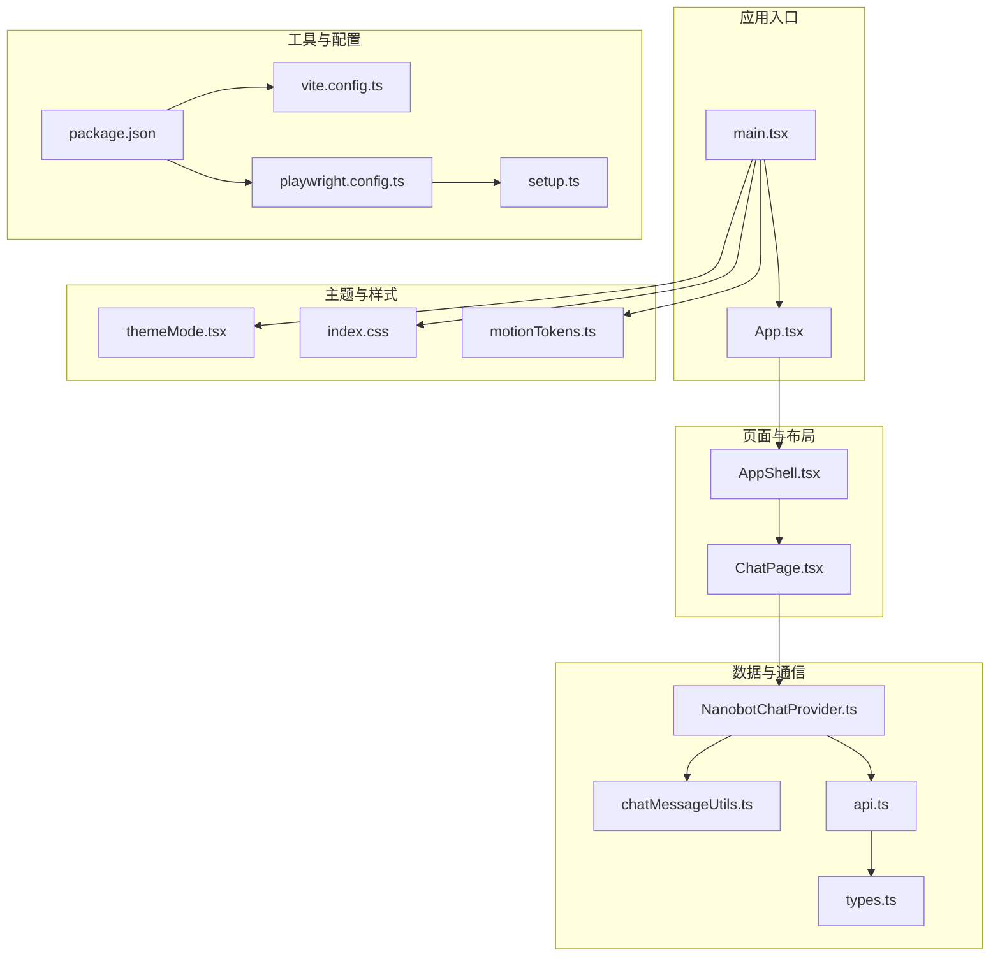
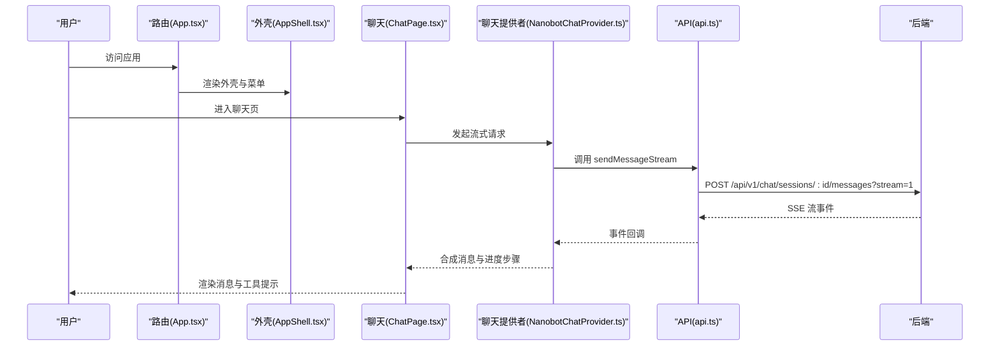
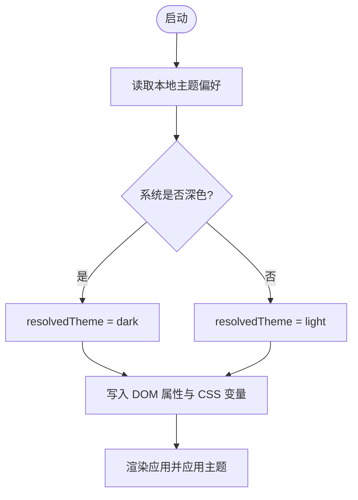
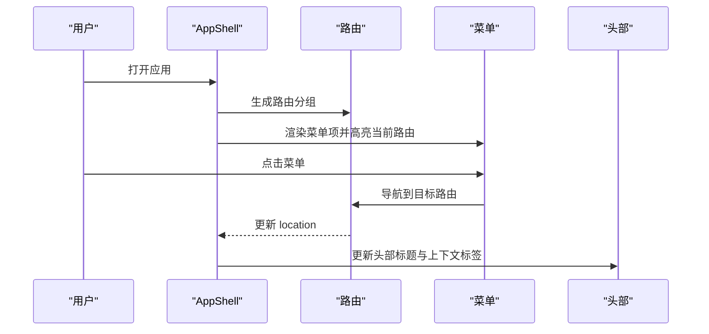
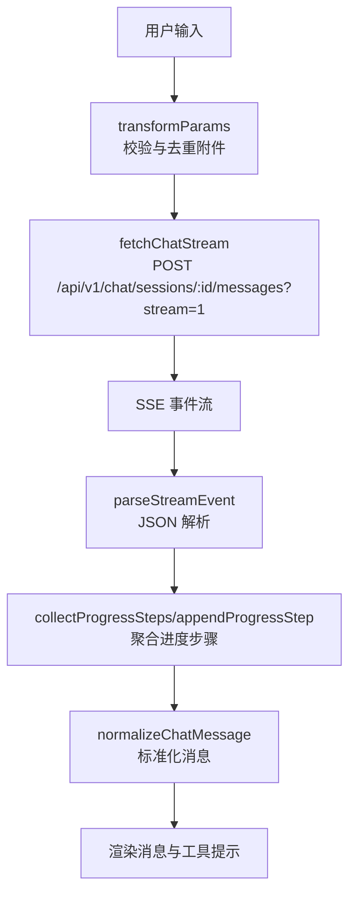
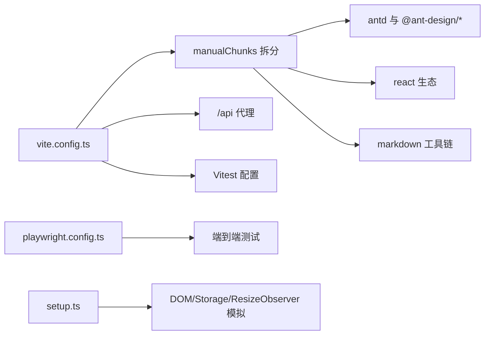

# UI 开发指南

<cite>
**本文引用的文件**
- [package.json](file://web-ui/package.json)
- [vite.config.ts](file://web-ui/vite.config.ts)
- [main.tsx](file://web-ui/src/main.tsx)
- [App.tsx](file://web-ui/src/App.tsx)
- [index.css](file://web-ui/src/index.css)
- [themeMode.tsx](file://web-ui/src/themeMode.tsx)
- [locale.ts](file://web-ui/src/locale.ts)
- [AppShell.tsx](file://web-ui/src/components/AppShell.tsx)
- [motionTokens.ts](file://web-ui/src/motionTokens.ts)
- [branding.ts](file://web-ui/src/branding.ts)
- [ChatPage.tsx](file://web-ui/src/pages/ChatPage.tsx)
- [setup.ts](file://web-ui/src/test/setup.ts)
- [playwright.config.ts](file://web-ui/playwright.config.ts)
- [NanobotChatProvider.ts](file://web-ui/src/chat/NanobotChatProvider.ts)
- [chatMessageUtils.ts](file://web-ui/src/chat/chatMessageUtils.ts)
- [types.ts](file://web-ui/src/types.ts)
- [api.ts](file://web-ui/src/api.ts)
</cite>

## 目录
1. [简介](#简介)
2. [项目结构](#项目结构)
3. [核心组件](#核心组件)
4. [架构总览](#架构总览)
5. [详细组件分析](#详细组件分析)
6. [依赖关系分析](#依赖关系分析)
7. [性能考量](#性能考量)
8. [故障排查指南](#故障排查指南)
9. [结论](#结论)
10. [附录](#附录)

## 简介
本指南面向 Nanobot Web UI 的前端开发者，系统阐述组件开发规范、样式定制方法与主题系统实现；详解 Ant Design 组件的使用模式、自定义组件开发与样式覆盖策略；记录国际化支持、主题切换与响应式设计实现；解释动画与过渡效果、用户体验优化；并提供代码规范、测试策略与构建部署流程，以及组件开发最佳实践、性能优化技巧与调试方法。

## 项目结构
Web UI 基于 Vite + React + TypeScript 构建，采用按功能分层的目录组织方式：页面、组件、Hooks、样式、类型与工具模块清晰分离。Ant Design 作为基础 UI 库，结合 Framer Motion 实现流畅动画；通过 ConfigProvider 与主题令牌统一风格；通过路由懒加载与 Suspense 提升首屏体验。

图示来源
- [main.tsx:1-130](file://web-ui/src/main.tsx#L1-L130)
- [App.tsx:1-293](file://web-ui/src/App.tsx#L1-L293)
- [AppShell.tsx:1-334](file://web-ui/src/components/AppShell.tsx#L1-L334)
- [ChatPage.tsx:1-200](file://web-ui/src/pages/ChatPage.tsx#L1-L200)
- [themeMode.tsx:1-96](file://web-ui/src/themeMode.tsx#L1-L96)
- [index.css:1-4492](file://web-ui/src/index.css#L1-L4492)
- [motionTokens.ts:1-91](file://web-ui/src/motionTokens.ts#L1-L91)
- [NanobotChatProvider.ts:1-172](file://web-ui/src/chat/NanobotChatProvider.ts#L1-L172)
- [chatMessageUtils.ts:1-170](file://web-ui/src/chat/chatMessageUtils.ts#L1-L170)
- [api.ts:1-881](file://web-ui/src/api.ts#L1-L881)
- [types.ts:1-1098](file://web-ui/src/types.ts#L1-L1098)
- [package.json:1-43](file://web-ui/package.json#L1-L43)
- [vite.config.ts:1-138](file://web-ui/vite.config.ts#L1-L138)
- [playwright.config.ts:1-34](file://web-ui/playwright.config.ts#L1-L34)
- [setup.ts:1-86](file://web-ui/src/test/setup.ts#L1-L86)

章节来源
- [package.json:1-43](file://web-ui/package.json#L1-L43)
- [vite.config.ts:1-138](file://web-ui/vite.config.ts#L1-L138)

## 核心组件
- 应用根节点与主题注入：在入口中通过 ConfigProvider 注入 Ant Design 主题与本地化，并以 Framer Motion 全局配置过渡动效；同时通过 ThemeModeProvider 管理明暗主题偏好与系统联动。
- 路由与鉴权：App.tsx 中基于 React Router 实现路由守卫与状态检查，区分访客、已登录与初始化向导阶段，确保用户在正确流程中流转。
- 应用外壳：AppShell.tsx 提供响应式侧边导航、头部操作区与内容区域，结合 Framer Motion 的变体动画实现页面切换与抽屉交互。
- 聊天页面：ChatPage.tsx 集成 @ant-design/x 的聊天组件与流式渲染，配合 NanobotChatProvider 与 chatMessageUtils 完成消息解析、进度步骤收集与工具调用展示。
- 主题系统：themeMode.tsx 提供主题偏好存储、系统主题监听与 DOM 属性同步，支持 light/dark/system 三种模式。
- 国际化辅助：locale.ts 提供中文日期时间格式化与相对时间显示，满足本地化需求。
- 动画令牌：motionTokens.ts 定义统一的弹簧动效与进入/退出变体，保证组件间动效一致性。
- 品牌文案：branding.ts 提供品牌名称与替换逻辑，便于多租户或二次定制。

章节来源
- [main.tsx:1-130](file://web-ui/src/main.tsx#L1-L130)
- [App.tsx:1-293](file://web-ui/src/App.tsx#L1-L293)
- [AppShell.tsx:1-334](file://web-ui/src/components/AppShell.tsx#L1-L334)
- [ChatPage.tsx:1-200](file://web-ui/src/pages/ChatPage.tsx#L1-L200)
- [themeMode.tsx:1-96](file://web-ui/src/themeMode.tsx#L1-L96)
- [locale.ts:1-43](file://web-ui/src/locale.ts#L1-L43)
- [motionTokens.ts:1-91](file://web-ui/src/motionTokens.ts#L1-L91)
- [branding.ts:1-16](file://web-ui/src/branding.ts#L1-L16)

## 架构总览
下图展示 UI 与后端 API 的交互路径、主题与动画的全局配置，以及聊天流式处理的关键链路。

图示来源
- [App.tsx:197-278](file://web-ui/src/App.tsx#L197-L278)
- [AppShell.tsx:130-334](file://web-ui/src/components/AppShell.tsx#L130-L334)
- [ChatPage.tsx:1-200](file://web-ui/src/pages/ChatPage.tsx#L1-L200)
- [NanobotChatProvider.ts:96-172](file://web-ui/src/chat/NanobotChatProvider.ts#L96-L172)
- [api.ts:311-387](file://web-ui/src/api.ts#L311-L387)

## 详细组件分析

### 主题系统与样式定制
- 主题配置：在入口中通过 ConfigProvider 的 theme 字段传入 Ant Design 主题配置，包含算法、全局 token 与组件级覆盖（如 Card、Layout、Menu、Button、Input、Select、Segmented、Tabs、Tag、Drawer）。
- 明暗模式：ThemeModeProvider 读取系统偏好与用户选择，持久化到 localStorage，并同步到 documentElement 的 dataset 与 colorScheme，实现 CSS 变量驱动的主题切换。
- CSS 变量与全局样式：index.css 定义了大量 CSS 自定义属性（如 --nb-*），用于支撑明暗两套视觉体系；同时对滚动条、阴影、卡片、导航、侧栏等进行统一风格化。
- 动画与过渡：通过 MotionConfig 设置全局过渡参数，motionTokens.ts 提供统一的弹簧动效与进入/退出变体，确保页面切换与元素出现的一致性。

图示来源
- [themeMode.tsx:17-75](file://web-ui/src/themeMode.tsx#L17-L75)
- [main.tsx:11-100](file://web-ui/src/main.tsx#L11-L100)
- [index.css:1-306](file://web-ui/src/index.css#L1-L306)

章节来源
- [themeMode.tsx:1-96](file://web-ui/src/themeMode.tsx#L1-L96)
- [main.tsx:1-130](file://web-ui/src/main.tsx#L1-L130)
- [index.css:1-4492](file://web-ui/src/index.css#L1-L4492)
- [motionTokens.ts:1-91](file://web-ui/src/motionTokens.ts#L1-L91)

### Ant Design 使用模式与样式覆盖
- 组件使用：在页面与组件中直接引入 Ant Design 组件（如 Button、Card、Input、Select、Menu、Layout 等），并通过 ConfigProvider 的 components 字段进行细粒度覆盖。
- 样式覆盖策略：
  - 全局 CSS：通过 index.css 的 CSS 变量与类名覆盖，统一导航、侧栏、卡片、按钮等视觉。
  - 组件级覆盖：在 ConfigProvider.components 中设置 borderRadius、padding、颜色等，避免在业务组件中重复注入。
  - 动态主题：根据 resolvedTheme 切换算法与 token，确保明暗模式下组件外观一致。

章节来源
- [main.tsx:40-99](file://web-ui/src/main.tsx#L40-L99)
- [index.css:367-4492](file://web-ui/src/index.css#L367-L4492)

### 自定义组件开发与 AppShell
- 响应式导航：AppShell 基于 Grid.breakpoint 判断桌面端/移动端，桌面端使用 Sider，移动端使用 Drawer；菜单项根据当前路由高亮。
- 动画与交互：使用 Framer Motion 的 variants 与 spring 动效，实现侧栏进入、头部标题与内容区的过渡。
- 用户状态：集成退出登录流程，跳转至登录页；在侧栏底部展示用户名与登出按钮。

图示来源
- [AppShell.tsx:130-334](file://web-ui/src/components/AppShell.tsx#L130-L334)

章节来源
- [AppShell.tsx:1-334](file://web-ui/src/components/AppShell.tsx#L1-L334)

### 国际化支持
- 本地化格式：locale.ts 提供中文日期时间格式化与相对时间显示，满足中文用户的阅读习惯。
- 语言包：入口通过 ConfigProvider.locale 引入 zhCN，确保日期选择器、表格等组件的本地化文本。

章节来源
- [locale.ts:1-43](file://web-ui/src/locale.ts#L1-L43)
- [main.tsx:4-4](file://web-ui/src/main.tsx#L4-L4)

### 聊天与流式渲染
- 提供者封装：NanobotChatProvider 继承 AbstractChatProvider，重写 transformParams、transformLocalMessage、transformMessage 与 fetchChatStream，适配后端流式协议与错误处理。
- 消息解析：chatMessageUtils 对附加文件与用户问题进行解析与去重，收集 progress 步骤，标准化消息结构。
- 页面渲染：ChatPage 使用 @ant-design/x 的聊天组件，结合 ReactMarkdown 与 remark-gfm 渲染富文本与表格。

图示来源
- [NanobotChatProvider.ts:96-172](file://web-ui/src/chat/NanobotChatProvider.ts#L96-L172)
- [chatMessageUtils.ts:106-170](file://web-ui/src/chat/chatMessageUtils.ts#L106-L170)
- [api.ts:311-387](file://web-ui/src/api.ts#L311-L387)
- [ChatPage.tsx:1-200](file://web-ui/src/pages/ChatPage.tsx#L1-L200)

章节来源
- [NanobotChatProvider.ts:1-172](file://web-ui/src/chat/NanobotChatProvider.ts#L1-L172)
- [chatMessageUtils.ts:1-170](file://web-ui/src/chat/chatMessageUtils.ts#L1-L170)
- [api.ts:1-881](file://web-ui/src/api.ts#L1-L881)
- [ChatPage.tsx:1-200](file://web-ui/src/pages/ChatPage.tsx#L1-L200)

### 动画与过渡效果
- 全局动效：MotionConfig 设置全局 spring 参数，保证所有受控动画具有一致的物理特性。
- 页面切换：AppShell 使用 Framer Motion 的 variants 实现路由切换时的内容淡入/淡出与位移，提升流畅度。
- 交互反馈：motionTokens.ts 提供 lift/tap 等微交互动效，增强按钮与卡片的触感。

章节来源
- [main.tsx:107-119](file://web-ui/src/main.tsx#L107-L119)
- [AppShell.tsx:175-182](file://web-ui/src/components/AppShell.tsx#L175-L182)
- [motionTokens.ts:1-91](file://web-ui/src/motionTokens.ts#L1-L91)

### 响应式设计
- 断点判断：AppShell 使用 Grid.useBreakpoint 获取 lg 及以上断点，决定侧栏与抽屉的呈现方式。
- 视觉适配：index.css 中通过 CSS 变量与媒体查询控制字体、间距与布局，确保在不同设备上保持一致的阅读体验。

章节来源
- [AppShell.tsx:133-134](file://web-ui/src/components/AppShell.tsx#L133-L134)
- [index.css:1-4492](file://web-ui/src/index.css#L1-L4492)

## 依赖关系分析
- 构建与打包：Vite 配置按依赖包拆分 chunk，将 antd、@ant-design/x、react 生态与 markdown 工具链独立打包，优化缓存与加载性能。
- 运行时代理：开发服务器通过代理将 /api 请求转发至后端，便于前后端联调。
- 测试环境：Vitest 与 Playwright 配置分别覆盖单元测试与端到端测试，setup.ts 提供浏览器环境模拟与清理。

图示来源
- [vite.config.ts:20-81](file://web-ui/vite.config.ts#L20-L81)
- [vite.config.ts:127-135](file://web-ui/vite.config.ts#L127-L135)
- [playwright.config.ts:1-34](file://web-ui/playwright.config.ts#L1-L34)
- [setup.ts:1-86](file://web-ui/src/test/setup.ts#L1-L86)

章节来源
- [vite.config.ts:1-138](file://web-ui/vite.config.ts#L1-L138)
- [playwright.config.ts:1-34](file://web-ui/playwright.config.ts#L1-L34)
- [setup.ts:1-86](file://web-ui/src/test/setup.ts#L1-L86)

## 性能考量
- 代码分割：通过 manualChunks 将大体积依赖拆分为独立 chunk，减少首屏体积并提升缓存命中率。
- 路由懒加载：App.tsx 中对页面组件使用 lazy 与 Suspense，降低初始包体与白屏时间。
- 动画优化：统一的动效参数与变体，避免过度动画造成卡顿；在移动端可适当简化复杂动效。
- 样式优化：CSS 变量集中管理，避免重复计算与样式抖动；合理使用 backdrop-filter 时注意性能影响。
- 网络优化：流式渲染减少等待时间，错误快速反馈；在 401 时触发鉴权事件，避免无效重试。

## 故障排查指南
- 主题不生效
  - 检查 ThemeModeProvider 是否包裹应用根节点。
  - 确认 resolvedTheme 与 DOM 属性 data-theme 一致。
  - 核对 index.css 中 CSS 变量是否被覆盖。
- 路由状态异常
  - 检查 App.tsx 中鉴权与初始化向导的状态分支与错误回退。
  - 确保 AuthStateError/SetupStateError 的错误信息与重试逻辑正常。
- 聊天无响应
  - 检查 NanobotChatProvider 的 fetchChatStream 是否返回 200 且有 SSE 流。
  - 确认 api.ts 的 sendMessageStream 事件解析与 done/error 分支处理。
- 单元测试失败
  - 确认 setup.ts 中 localStorage/sessionStorage 的 mock 是否生效。
  - 检查 ResizeObserver 与 matchMedia 的模拟实现。
- 端到端测试失败
  - 查看 playwright.config.ts 的 baseURL 与 webServer 启动脚本。
  - 关注 trace/screenshot/video 报告定位问题。

章节来源
- [themeMode.tsx:35-86](file://web-ui/src/themeMode.tsx#L35-L86)
- [App.tsx:38-107](file://web-ui/src/App.tsx#L38-L107)
- [NanobotChatProvider.ts:20-79](file://web-ui/src/chat/NanobotChatProvider.ts#L20-L79)
- [api.ts:311-387](file://web-ui/src/api.ts#L311-L387)
- [setup.ts:1-86](file://web-ui/src/test/setup.ts#L1-L86)
- [playwright.config.ts:1-34](file://web-ui/playwright.config.ts#L1-L34)

## 结论
本指南围绕 Nanobot Web UI 的主题系统、Ant Design 使用、自定义组件开发、国际化与响应式设计、动画与用户体验、测试与构建流程等方面提供了系统化的开发指引。遵循本文档的规范与最佳实践，可在保证一致性的前提下高效迭代 UI 功能，并获得良好的性能与可维护性。

## 附录

### 组件开发规范
- 使用 Ant Design 组件时优先通过 ConfigProvider.components 进行样式覆盖，避免在组件内硬编码样式。
- 使用 CSS 变量与类名统一管理主题色彩与间距，确保明暗模式一致。
- 页面组件尽量保持纯展示与少量状态，复杂逻辑下沉至 Hooks 或工具模块。
- 路由守卫与鉴权逻辑集中在 App.tsx，确保用户流程可控。

### 代码规范
- 类型安全：优先使用 types.ts 中定义的接口与类型，避免 any。
- 错误处理：在 API 层统一抛出 ApiError，并在组件中捕获与展示。
- 动画一致性：统一使用 motionTokens.ts 中的动效参数，避免各自为政。

### 测试策略
- 单元测试：Vitest + @testing-library/react，关注组件渲染、状态变更与事件触发。
- 端到端测试：Playwright，覆盖关键用户路径与跨浏览器兼容性。
- 辅助工具：setup.ts 提供 DOM/Storage/ResizeObserver 的模拟，确保测试稳定。

### 构建与部署流程
- 开发：npm run dev 启动 Vite 开发服务器，自动代理 /api。
- 构建：npm run build 执行类型检查与打包，产物输出至 dist。
- 预览：npm run preview 在本地预览生产构建。
- 测试：npm run test 运行单元测试；npm run test:e2e:* 运行端到端测试。

章节来源
- [package.json:6-14](file://web-ui/package.json#L6-L14)
- [vite.config.ts:83-137](file://web-ui/vite.config.ts#L83-L137)
- [playwright.config.ts:1-34](file://web-ui/playwright.config.ts#L1-L34)
- [setup.ts:1-86](file://web-ui/src/test/setup.ts#L1-L86)