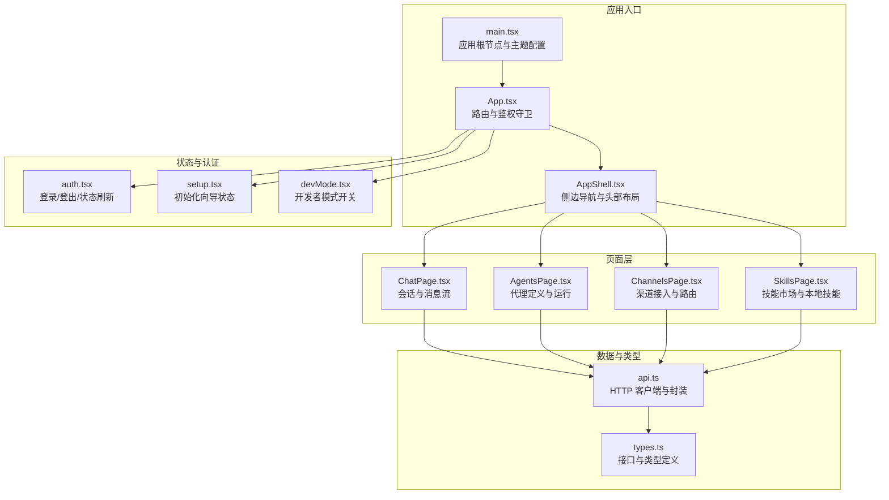
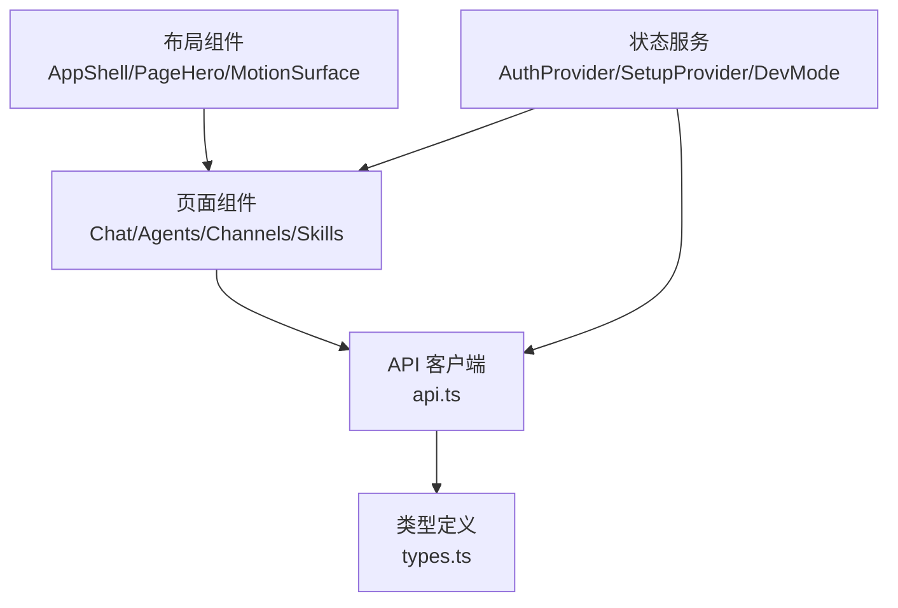
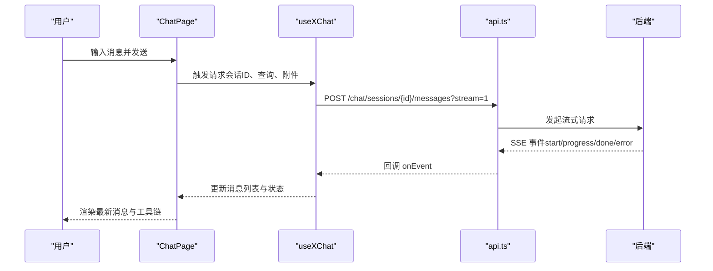
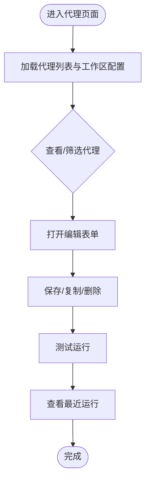
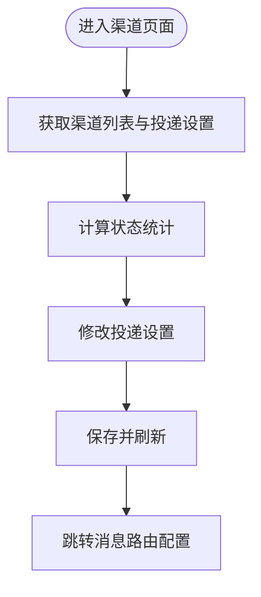
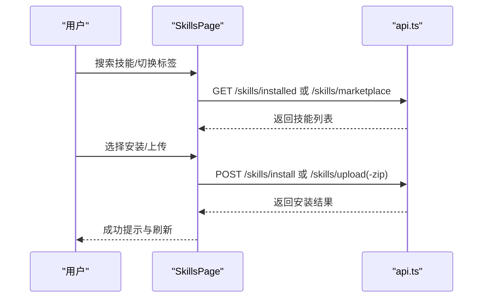
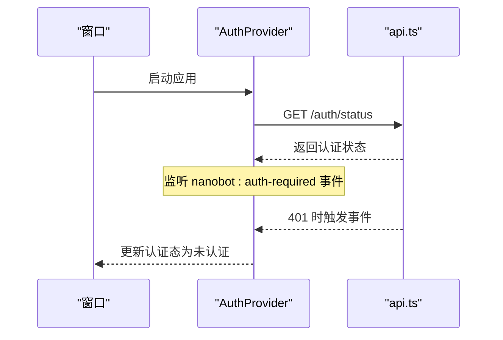
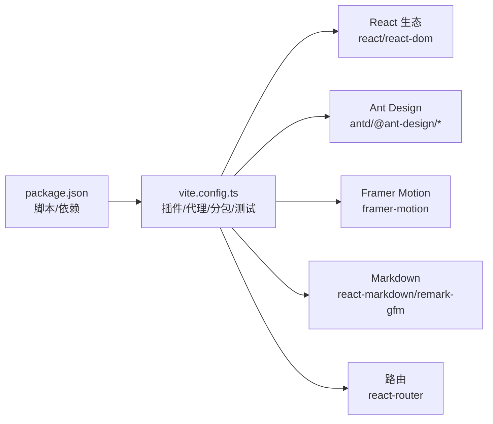

# Web 界面

<cite>
**本文引用的文件**
- [package.json](file://web-ui/package.json)
- [vite.config.ts](file://web-ui/vite.config.ts)
- [main.tsx](file://web-ui/src/main.tsx)
- [App.tsx](file://web-ui/src/App.tsx)
- [api.ts](file://web-ui/src/api.ts)
- [types.ts](file://web-ui/src/types.ts)
- [AppShell.tsx](file://web-ui/src/components/AppShell.tsx)
- [auth.tsx](file://web-ui/src/auth.tsx)
- [setup.tsx](file://web-ui/src/setup.tsx)
- [devMode.tsx](file://web-ui/src/devMode.tsx)
- [ChatPage.tsx](file://web-ui/src/pages/ChatPage.tsx)
- [AgentsPage.tsx](file://web-ui/src/pages/AgentsPage.tsx)
- [ChannelsPage.tsx](file://web-ui/src/pages/ChannelsPage.tsx)
- [SkillsPage.tsx](file://web-ui/src/pages/SkillsPage.tsx)
</cite>

## 目录
1. [简介](#简介)
2. [项目结构](#项目结构)
3. [核心组件](#核心组件)
4. [架构总览](#架构总览)
5. [详细组件分析](#详细组件分析)
6. [依赖关系分析](#依赖关系分析)
7. [性能考量](#性能考量)
8. [故障排查指南](#故障排查指南)
9. [结论](#结论)
10. [附录](#附录)

## 简介
本文件为 Nanobot Web 界面（web-ui）的技术文档，聚焦前端架构设计、页面组件结构与 API 集成方式，阐述用户交互流程、状态管理与响应式设计策略；并记录各功能页面（代理管理、渠道配置、技能市场、会话管理等）的特性与实现要点。同时提供前端开发指南（组件开发、样式定制、性能优化）、与后端 API 的通信协议与数据流说明，以及开发环境搭建、构建部署与调试方法。

## 项目结构
web-ui 使用 Vite + React + TypeScript 构建，采用按页面拆分的目录组织方式，核心模块包括：
- 入口与主题：main.tsx、App.tsx、主题与动画配置
- 页面与布局：pages/*、components/AppShell.tsx
- 状态与认证：auth.tsx、setup.tsx、devMode.tsx
- API 与类型：api.ts、types.ts
- 构建与代理：vite.config.ts、package.json

图表来源
- [main.tsx:1-130](file://web-ui/src/main.tsx#L1-L130)
- [App.tsx:1-293](file://web-ui/src/App.tsx#L1-L293)
- [AppShell.tsx:1-334](file://web-ui/src/components/AppShell.tsx#L1-L334)
- [ChatPage.tsx:1-800](file://web-ui/src/pages/ChatPage.tsx#L1-L800)
- [AgentsPage.tsx:1-200](file://web-ui/src/pages/AgentsPage.tsx#L1-L200)
- [ChannelsPage.tsx:1-200](file://web-ui/src/pages/ChannelsPage.tsx#L1-L200)
- [SkillsPage.tsx:1-200](file://web-ui/src/pages/SkillsPage.tsx#L1-L200)
- [auth.tsx:1-152](file://web-ui/src/auth.tsx#L1-L152)
- [setup.tsx:1-106](file://web-ui/src/setup.tsx#L1-L106)
- [devMode.tsx:1-48](file://web-ui/src/devMode.tsx#L1-L48)
- [api.ts:1-881](file://web-ui/src/api.ts#L1-L881)
- [types.ts:1-800](file://web-ui/src/types.ts#L1-L800)

章节来源
- [package.json:1-43](file://web-ui/package.json#L1-L43)
- [vite.config.ts:1-138](file://web-ui/vite.config.ts#L1-L138)
- [main.tsx:1-130](file://web-ui/src/main.tsx#L1-L130)
- [App.tsx:1-293](file://web-ui/src/App.tsx#L1-L293)

## 核心组件
- 应用入口与主题
  - 主题与动画：通过 ConfigProvider、MotionConfig 注入 Ant Design 主题与 Framer Motion 动画全局配置，支持明暗主题切换与组件层级风格。
  - 入口渲染：在 StrictMode 下挂载 ThemeModeProvider -> ThemedApp -> App，确保主题与动画一致性。
- 路由与权限
  - AppRoutes：集中定义所有页面路由与嵌套路由，结合 AuthIndexRedirect、RequireAuth、GuestOnly、SetupOnly 实现登录态与初始化向导态的前置校验与跳转。
  - Suspense：对页面进行懒加载与降级占位，提升首屏体验。
- 布局与导航
  - AppShell：桌面端固定侧边栏 + 移动端抽屉导航，动态高亮当前路由，支持登出与品牌信息展示。
- 认证与初始化向导
  - AuthProvider：封装登录/登出/状态刷新，监听后端 401 事件以触发认证态变更。
  - SetupProvider：拉取初始化向导状态，带重试逻辑，驱动首次配置流程。
  - DevMode：持久化开发者模式开关，影响菜单项与部分功能可见性。

章节来源
- [main.tsx:1-130](file://web-ui/src/main.tsx#L1-L130)
- [App.tsx:197-278](file://web-ui/src/App.tsx#L197-L278)
- [AppShell.tsx:130-334](file://web-ui/src/components/AppShell.tsx#L130-L334)
- [auth.tsx:32-143](file://web-ui/src/auth.tsx#L32-L143)
- [setup.tsx:39-97](file://web-ui/src/setup.tsx#L39-L97)
- [devMode.tsx:20-48](file://web-ui/src/devMode.tsx#L20-L48)

## 架构总览
前端采用“页面 + 组件 + 服务”的分层架构：
- 页面层：按功能划分 Chat、Agents、Channels、Skills 等页面，负责业务编排与用户交互。
- 组件层：通用布局与功能组件（如 AppShell、PageHero、MotionSurface），复用性强。
- 服务层：api.ts 封装 HTTP 请求、错误处理与 SSE 流式响应；types.ts 提供强类型约束。
- 状态层：React Context（AuthProvider、SetupProvider、DevMode）管理跨组件共享状态。

图表来源
- [App.tsx:197-278](file://web-ui/src/App.tsx#L197-L278)
- [AppShell.tsx:130-334](file://web-ui/src/components/AppShell.tsx#L130-L334)
- [auth.tsx:32-143](file://web-ui/src/auth.tsx#L32-L143)
- [setup.tsx:39-97](file://web-ui/src/setup.tsx#L39-L97)
- [devMode.tsx:20-48](file://web-ui/src/devMode.tsx#L20-L48)
- [api.ts:145-881](file://web-ui/src/api.ts#L145-L881)
- [types.ts:1-800](file://web-ui/src/types.ts#L1-L800)

## 详细组件分析

### 会话与消息流（ChatPage）
- 功能特性
  - 会话管理：加载/创建/重命名/删除会话；会话列表按时间分组与搜索过滤。
  - 工作区上下文：加载最近上传文件、快速提示、活跃 MCP 与工具活动。
  - 消息渲染：支持 Markdown、工具调用链、附件标签、占位提示与重新生成。
  - 流式响应：sendMessageStream 通过 SSE 接收增量事件，实时更新 UI。
  - 附件上传：拖拽/选择文件，上传后注入到消息上下文。
- 数据流
  - 通过 api.ts 的会话与消息接口与后端交互；SSE 事件驱动 UI 更新。
- 用户交互
  - 输入框 + 发送按钮；支持快捷提示插入、最近文件引用与路径插入；移动端适配抽屉与滚动行为。

图表来源
- [ChatPage.tsx:379-431](file://web-ui/src/pages/ChatPage.tsx#L379-L431)
- [api.ts:311-387](file://web-ui/src/api.ts#L311-L387)

章节来源
- [ChatPage.tsx:345-800](file://web-ui/src/pages/ChatPage.tsx#L345-L800)
- [api.ts:286-387](file://web-ui/src/api.ts#L286-L387)

### 代理管理（AgentsPage）
- 功能特性
  - 代理列表与筛选：支持启用/禁用、标签与名称筛选。
  - 表单编辑：名称、描述、系统提示、规则、模型、后端、工具白名单、MCP 服务器、技能、知识库绑定、标签与内存作用域。
  - 测试运行：基于当前配置发起一次测试运行，查看最终消息与知识命中。
  - 运行历史：最近运行状态与状态色标。
- 数据流
  - 通过 api.ts 的代理 CRUD、测试运行、运行树与制品接口与后端交互。

图表来源
- [AgentsPage.tsx:172-200](file://web-ui/src/pages/AgentsPage.tsx#L172-L200)
- [api.ts:622-714](file://web-ui/src/api.ts#L622-L714)

章节来源
- [AgentsPage.tsx:172-200](file://web-ui/src/pages/AgentsPage.tsx#L172-L200)
- [api.ts:622-714](file://web-ui/src/api.ts#L622-L714)

### 渠道配置（ChannelsPage）
- 功能特性
  - 渠道概览：按状态统计（已启用/已配置/待补全/总数）。
  - 消息推送设置：统一开关“推送执行进度/工具提示”，保存后刷新状态。
  - 路由指引：提示下一步应补字段、测试与建立消息路由。
- 数据流
  - 通过 api.ts 的渠道列表、测试、WhatsApp 绑定与投递设置接口与后端交互。

图表来源
- [ChannelsPage.tsx:30-200](file://web-ui/src/pages/ChannelsPage.tsx#L30-L200)
- [api.ts:390-412](file://web-ui/src/api.ts#L390-L412)

章节来源
- [ChannelsPage.tsx:30-200](file://web-ui/src/pages/ChannelsPage.tsx#L30-L200)
- [api.ts:390-412](file://web-ui/src/api.ts#L390-L412)

### 技能市场（SkillsPage）
- 功能特性
  - 已安装技能：本地已安装技能列表，支持搜索、删除与来源统计。
  - SkillHub 市场：关键词搜索、兼容性标签、安装与覆盖安装。
  - 本地上传：支持文件夹批量上传与 ZIP 包上传。
- 数据流
  - 通过 api.ts 的技能 CRUD、市场搜索、ZIP/文件上传接口与后端交互。

图表来源
- [SkillsPage.tsx:52-200](file://web-ui/src/pages/SkillsPage.tsx#L52-L200)
- [api.ts:838-880](file://web-ui/src/api.ts#L838-L880)

章节来源
- [SkillsPage.tsx:52-200](file://web-ui/src/pages/SkillsPage.tsx#L52-L200)
- [api.ts:838-880](file://web-ui/src/api.ts#L838-L880)

### 认证与初始化向导（auth.tsx, setup.tsx）
- 认证流程
  - 登录/登出：调用 api.ts 的登录/登出接口，更新全局认证状态。
  - 状态刷新：应用启动时拉取认证状态；后端返回 401 时通过自定义事件触发认证态变更。
- 初始化向导
  - SetupProvider 在用户认证后拉取初始化向导状态，带重试机制；支持外部应用状态以驱动路由跳转。

图表来源
- [auth.tsx:32-143](file://web-ui/src/auth.tsx#L32-L143)
- [api.ts:145-153](file://web-ui/src/api.ts#L145-L153)

章节来源
- [auth.tsx:32-143](file://web-ui/src/auth.tsx#L32-L143)
- [setup.tsx:39-97](file://web-ui/src/setup.tsx#L39-L97)

## 依赖关系分析
- 构建与打包
  - Vite 配置启用 React 插件、SSR 对 antd 与相关包的 noExternal 处理、测试环境 jsdom、代理 /api 到后端地址。
  - Rollup 分包策略：手动拆分 react 核心、router、ant-design-x、ant-design-core、markdown 等，优化缓存与加载。
- 运行时依赖
  - React、Ant Design、Framer Motion、react-router、react-markdown/remark-gfm、@ant-design/icons、@ant-design/x 与 SDK。
- 开发依赖
  - Vite、TypeScript、Playwright、Vitest、Testing Library 等。

图表来源
- [vite.config.ts:1-138](file://web-ui/vite.config.ts#L1-L138)
- [package.json:1-43](file://web-ui/package.json#L1-L43)

章节来源
- [vite.config.ts:1-138](file://web-ui/vite.config.ts#L1-L138)
- [package.json:1-43](file://web-ui/package.json#L1-L43)

## 性能考量
- 代码分割与懒加载
  - 路由级懒加载与 Suspense 占位，减少首屏体积与白屏时间。
  - Vite 手动分包策略，将大体量依赖拆分为独立 chunk，提升浏览器缓存命中率。
- 网络与错误处理
  - api.ts 统一封装 fetch、统一错误对象、401 自动触发认证态更新，避免重复错误提示。
  - SetupProvider 带重试的初始化向导状态拉取，降低瞬时失败影响。
- 渲染与动画
  - Framer Motion 提供轻量动画，主题配置统一字体、圆角与色彩令牌，减少重复样式计算。
- 图片与媒体
  - 附件上传采用 FormData，避免大文件阻塞主线程；消息面板自动滚动至底部，保证阅读连续性。

[本节为通用指导，无需列出具体文件来源]

## 故障排查指南
- 登录态异常
  - 现象：页面提示“登录状态检查失败”或反复跳转登录。
  - 排查：确认后端 /api/v1/auth/status 可访问；检查浏览器 Cookie 与 credentials 设置；观察 401 事件是否被正确派发。
- 初始化向导卡住
  - 现象：停留在 /setup 或无法进入主界面。
  - 排查：确认 /api/v1/setup/status 返回值；若瞬时失败，确认重试逻辑是否生效。
- 会话消息不更新
  - 现象：发送消息后无流式更新或最终消息未出现。
  - 排查：检查 sendMessageStream 的 SSE 事件解析与 done/error 类型处理；确认会话 ID 与附件引用正确。
- 渠道配置不可用
  - 现象：保存投递设置无效或状态未刷新。
  - 排查：确认 /api/v1/channels/delivery PUT 请求返回；检查 items 状态字段映射与 UI 刷新。
- 技能安装失败
  - 现象：安装/上传后列表未更新或报错。
  - 排查：核对 /skills/install、/skills/upload(-zip) 返回；确认本地缓存与市场搜索结果同步。

章节来源
- [auth.tsx:32-143](file://web-ui/src/auth.tsx#L32-L143)
- [setup.tsx:39-97](file://web-ui/src/setup.tsx#L39-L97)
- [api.ts:311-387](file://web-ui/src/api.ts#L311-L387)
- [api.ts:408-412](file://web-ui/src/api.ts#L408-L412)
- [api.ts:848-864](file://web-ui/src/api.ts#L848-L864)

## 结论
Nanobot Web 界面以 React + Vite 为基础，采用清晰的页面/组件/服务分层与强类型约束，结合 Ant Design 与 Framer Motion 提供一致且流畅的用户体验。通过路由守卫与状态服务保障安全与可用性，借助 SSE 与懒加载优化交互与性能。本文档为开发、调试与维护提供了全面参考。

[本节为总结性内容，无需列出具体文件来源]

## 附录

### 开发环境搭建
- 安装依赖
  - 使用包管理器安装项目依赖。
- 启动开发服务器
  - 通过 Vite 启动，端口与后端代理可在环境变量中配置。
- 环境变量
  - NANOBOT_API_ORIGIN：后端 API 地址，默认 http://127.0.0.1:6788。
  - NANOBOT_WEB_UI_PORT：前端开发端口，默认 5173。

章节来源
- [vite.config.ts:83-137](file://web-ui/vite.config.ts#L83-L137)
- [package.json:6-14](file://web-ui/package.json#L6-L14)

### 构建与部署
- 构建命令
  - tsc 校验 + Vite 打包，产物位于构建目录。
- 静态资源
  - 通过 Vite 默认静态资源处理；注意代理仅在开发环境生效。
- 部署建议
  - 将构建产物部署至反向代理或静态托管；确保 /api 前缀转发至后端服务。

章节来源
- [package.json:7-9](file://web-ui/package.json#L7-L9)
- [vite.config.ts:127-135](file://web-ui/vite.config.ts#L127-L135)

### 调试方法
- 单元与端到端测试
  - Vitest：单元测试与快照。
  - Playwright：端到端测试，含可访问性测试与关键场景。
- 开发者模式
  - 通过 DevModeProvider 切换开发者模式，暴露额外菜单项与调试入口。
- 日志与可观测性
  - 控制台日志、错误边界与 ApiError 统一错误对象，便于定位问题。

章节来源
- [package.json:10-14](file://web-ui/package.json#L10-L14)
- [devMode.tsx:20-48](file://web-ui/src/devMode.tsx#L20-L48)
- [api.ts:95-107](file://web-ui/src/api.ts#L95-L107)