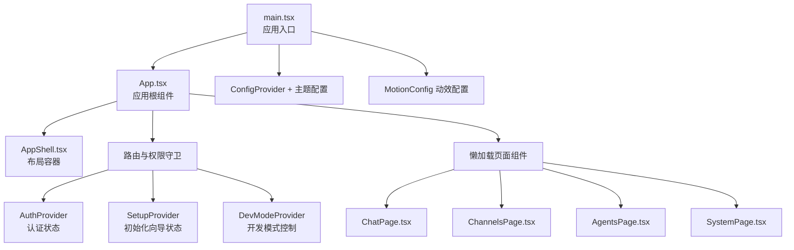
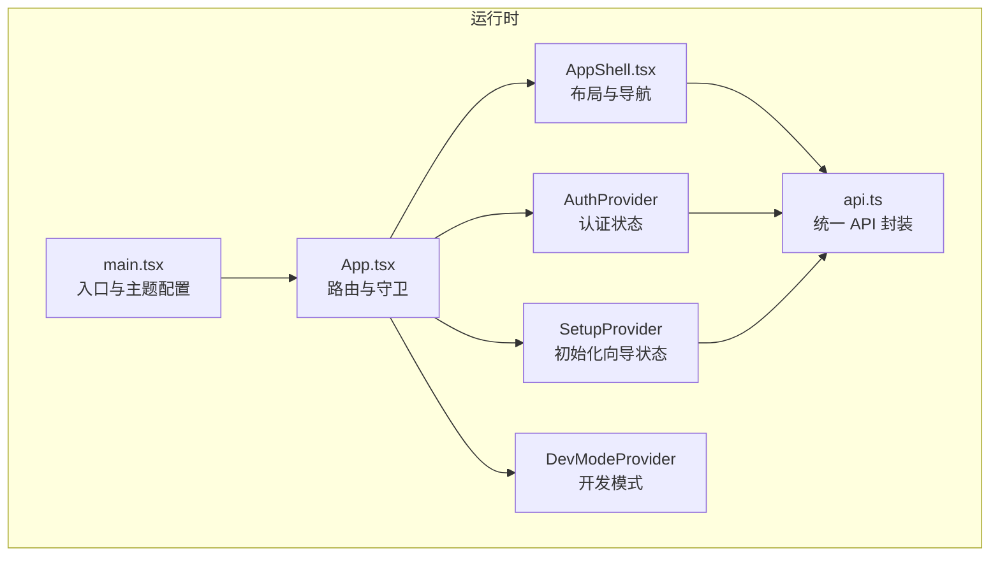
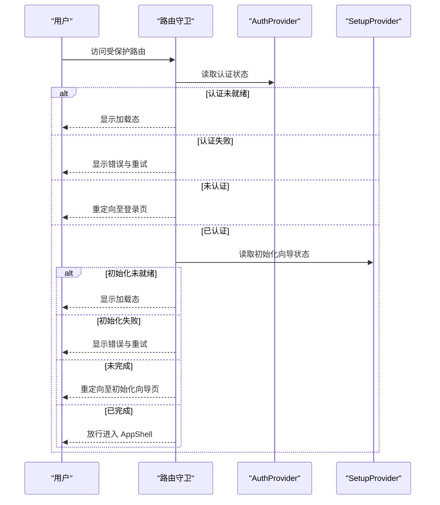
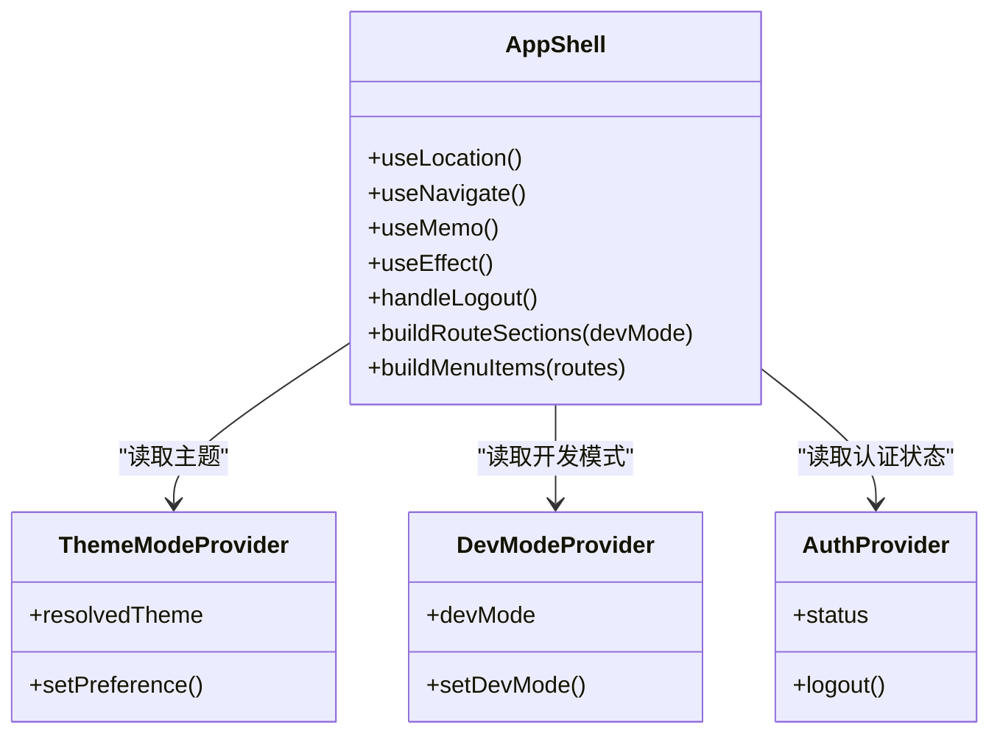
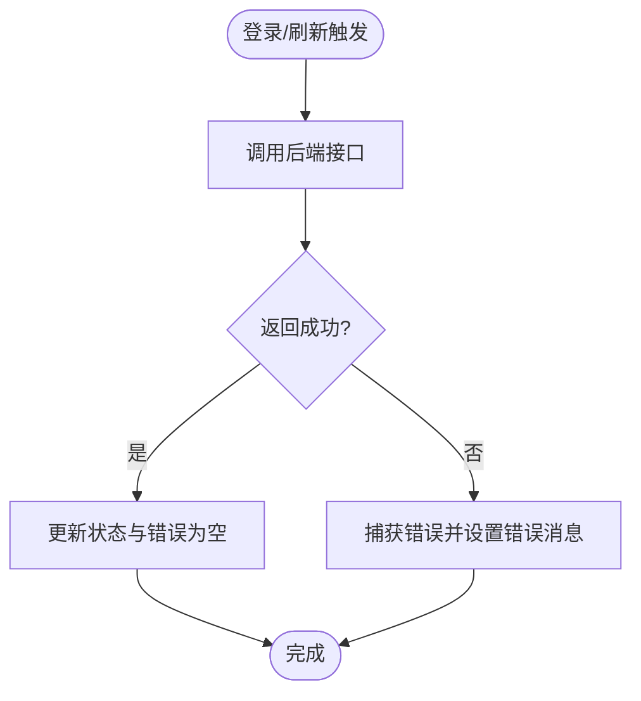
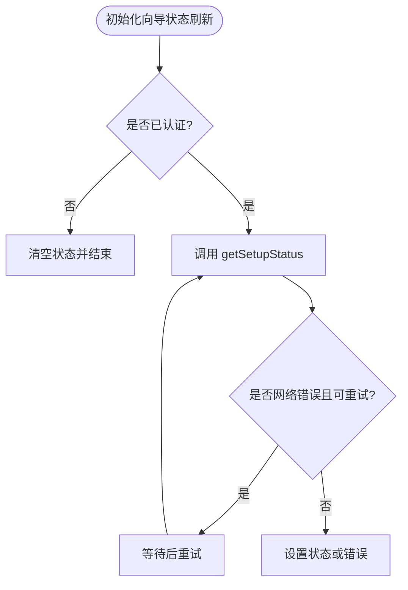
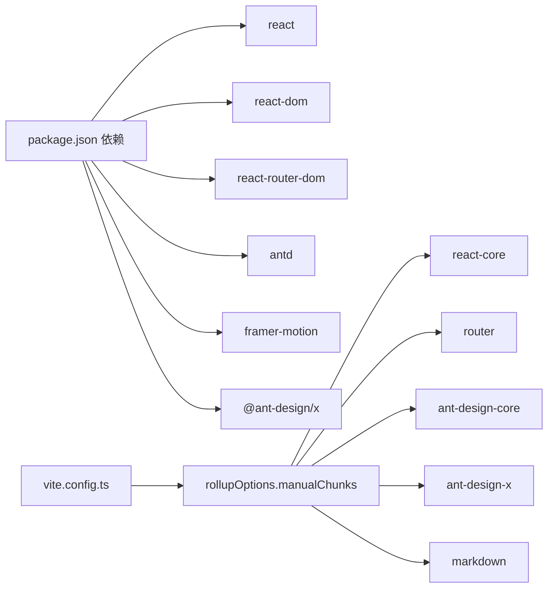

# 前端架构设计

<cite>
**本文档引用的文件**
- [web-ui/src/main.tsx](file://web-ui/src/main.tsx)
- [web-ui/src/App.tsx](file://web-ui/src/App.tsx)
- [web-ui/src/components/AppShell.tsx](file://web-ui/src/components/AppShell.tsx)
- [web-ui/src/auth.tsx](file://web-ui/src/auth.tsx)
- [web-ui/src/setup.tsx](file://web-ui/src/setup.tsx)
- [web-ui/src/devMode.tsx](file://web-ui/src/devMode.tsx)
- [web-ui/src/themeMode.tsx](file://web-ui/src/themeMode.tsx)
- [web-ui/src/api.ts](file://web-ui/src/api.ts)
- [web-ui/src/types.ts](file://web-ui/src/types.ts)
- [web-ui/src/motionTokens.ts](file://web-ui/src/motionTokens.ts)
- [web-ui/src/branding.ts](file://web-ui/src/branding.ts)
- [web-ui/src/testIds.ts](file://web-ui/src/testIds.ts)
- [web-ui/vite.config.ts](file://web-ui/vite.config.ts)
- [web-ui/package.json](file://web-ui/package.json)
</cite>

## 目录
1. [引言](#引言)
2. [项目结构](#项目结构)
3. [核心组件](#核心组件)
4. [架构总览](#架构总览)
5. [详细组件分析](#详细组件分析)
6. [依赖关系分析](#依赖关系分析)
7. [性能考虑](#性能考虑)
8. [故障排查指南](#故障排查指南)
9. [结论](#结论)
10. [附录](#附录)

## 引言
本文件面向 Nanobot 前端架构设计，围绕基于 React 18 与 Ant Design 的应用体系，系统阐述路由系统、状态管理、认证与权限控制、AppShell 组件结构、路由守卫实现、懒加载策略、错误边界处理、认证状态管理、初始化向导状态以及开发模式控制等主题。文档同时解释组件层次结构、数据流向与状态同步机制，并给出架构决策说明、技术选型理由与性能优化策略。

## 项目结构
前端位于 web-ui 目录，采用 Vite 构建工具，使用 React 18、Ant Design 5 与 Framer Motion 实现交互动效。项目采用按功能模块组织的目录结构，核心入口在 main.tsx，应用根组件在 App.tsx，路由与权限守卫集中在 App.tsx 中，状态通过 Context Provider 管理，API 层封装于 api.ts，类型定义集中于 types.ts。

图表来源
- [web-ui/src/main.tsx:1-130](file://web-ui/src/main.tsx#L1-L130)
- [web-ui/src/App.tsx:1-293](file://web-ui/src/App.tsx#L1-L293)
- [web-ui/src/components/AppShell.tsx:1-334](file://web-ui/src/components/AppShell.tsx#L1-L334)

章节来源
- [web-ui/src/main.tsx:1-130](file://web-ui/src/main.tsx#L1-L130)
- [web-ui/src/App.tsx:1-293](file://web-ui/src/App.tsx#L1-L293)
- [web-ui/package.json:1-43](file://web-ui/package.json#L1-L43)

## 核心组件
- 应用入口与主题配置：在 main.tsx 中完成 Ant Design ConfigProvider、主题算法与 Token 配置、Framer Motion 全局过渡配置，并通过 ThemeModeProvider 提供明暗主题切换能力。
- 应用根组件：App.tsx 负责路由声明、懒加载、路由守卫（认证、初始化向导）、错误边界与重试逻辑。
- AppShell：提供桌面/移动端导航、头部标题与动作、侧边栏菜单、内容区域动画切换。
- 认证与初始化向导：AuthProvider 与 SetupProvider 分别管理登录状态与初始化向导状态，支持刷新、错误处理与本地持久化。
- 开发模式：DevModeProvider 通过 localStorage 存储偏好并在全局生效。
- API 封装：api.ts 统一封装后端接口调用、错误处理与 401 自动登出事件通知。
- 类型系统：types.ts 定义所有前后端交互的数据结构，确保类型安全。
- 动效与品牌：motionTokens.ts 定义统一动效参数；branding.ts 提供品牌文案替换。

章节来源
- [web-ui/src/main.tsx:11-130](file://web-ui/src/main.tsx#L11-L130)
- [web-ui/src/App.tsx:11-293](file://web-ui/src/App.tsx#L11-L293)
- [web-ui/src/components/AppShell.tsx:130-334](file://web-ui/src/components/AppShell.tsx#L130-L334)
- [web-ui/src/auth.tsx:32-152](file://web-ui/src/auth.tsx#L32-L152)
- [web-ui/src/setup.tsx:39-106](file://web-ui/src/setup.tsx#L39-L106)
- [web-ui/src/devMode.tsx:20-48](file://web-ui/src/devMode.tsx#L20-L48)
- [web-ui/src/api.ts:145-881](file://web-ui/src/api.ts#L145-L881)
- [web-ui/src/types.ts:1-800](file://web-ui/src/types.ts#L1-L800)
- [web-ui/src/motionTokens.ts:1-91](file://web-ui/src/motionTokens.ts#L1-L91)
- [web-ui/src/branding.ts:1-16](file://web-ui/src/branding.ts#L1-L16)

## 架构总览
前端采用“入口配置 + 根组件路由 + 布局容器 + 状态提供者 + 页面懒加载”的分层架构。认证与初始化向导状态通过 Context Provider 在应用树中传播，路由守卫在进入受保护路由前进行状态校验与重定向。API 层负责统一错误处理与 401 登出事件广播，确保全局一致性。

图表来源
- [web-ui/src/main.tsx:102-130](file://web-ui/src/main.tsx#L102-L130)
- [web-ui/src/App.tsx:280-293](file://web-ui/src/App.tsx#L280-L293)
- [web-ui/src/components/AppShell.tsx:130-334](file://web-ui/src/components/AppShell.tsx#L130-L334)
- [web-ui/src/auth.tsx:32-152](file://web-ui/src/auth.tsx#L32-L152)
- [web-ui/src/setup.tsx:39-106](file://web-ui/src/setup.tsx#L39-L106)
- [web-ui/src/devMode.tsx:20-48](file://web-ui/src/devMode.tsx#L20-L48)
- [web-ui/src/api.ts:145-881](file://web-ui/src/api.ts#L145-L881)

## 详细组件分析

### 路由系统与路由守卫
- 路由声明：App.tsx 使用 React Router v6 的 Routes/Route 结构，定义首页重定向、登录页、初始化向导页与受保护的主应用路由。
- 懒加载策略：通过 React.lazy 与 Suspense 包裹页面组件，实现按需加载与加载态展示。
- 路由守卫：
  - AuthIndexRedirect：根据认证与初始化向导状态决定跳转到登录或初始化向导或聊天页。
  - RequireAuth/GuestOnly/SetupOnly：分别用于“必须已认证且已完成初始化向导”、“仅访客可用”、“仅初始化向导未完成时可用”的场景。
  - 错误边界与重试：AuthStateError/SetupStateError 提供状态检查失败时的提示与重试按钮。
- 数据流向：守卫组件通过 useAuth/useSetup 获取状态，结合 useLocation/state 进行重定向与状态同步。

图表来源
- [web-ui/src/App.tsx:82-195](file://web-ui/src/App.tsx#L82-L195)
- [web-ui/src/auth.tsx:39-54](file://web-ui/src/auth.tsx#L39-L54)
- [web-ui/src/setup.tsx:45-67](file://web-ui/src/setup.tsx#L45-L67)

章节来源
- [web-ui/src/App.tsx:11-293](file://web-ui/src/App.tsx#L11-L293)

### AppShell 组件结构
- 导航构建：buildRouteSections 根据开发模式动态生成导航项，支持桌面与移动端两种布局。
- 侧边栏与头部：左侧 Sider/Drawer 提供菜单导航，右侧 Header 展示当前路由上下文与退出登录按钮。
- 内容区域：使用 Framer Motion 的 AnimatePresence 与 variants 实现页面切换动效，区分聊天页与其他页面的不同动效策略。
- 用户交互：handleLogout 触发登出流程并重定向至登录页；响应屏幕断点自动切换布局。

图表来源
- [web-ui/src/components/AppShell.tsx:130-334](file://web-ui/src/components/AppShell.tsx#L130-L334)
- [web-ui/src/themeMode.tsx:35-96](file://web-ui/src/themeMode.tsx#L35-L96)
- [web-ui/src/devMode.tsx:20-48](file://web-ui/src/devMode.tsx#L20-L48)
- [web-ui/src/auth.tsx:32-152](file://web-ui/src/auth.tsx#L32-L152)

章节来源
- [web-ui/src/components/AppShell.tsx:1-334](file://web-ui/src/components/AppShell.tsx#L1-L334)

### 认证机制与状态管理
- Provider 设计：AuthProvider 管理认证状态、加载与提交状态、错误信息，提供 refresh/bootstrap/login/logout 方法。
- 状态刷新：启动时自动调用 refresh 获取初始状态；监听自定义事件 nanobot:auth-required 同步状态为未认证。
- 错误处理：统一捕获 ApiError 并转换为友好错误消息；通过 Ant Design message 提示成功/失败。
- 本地持久化：登录成功后通过 message.success 提示，保证用户体验一致性。

图表来源
- [web-ui/src/auth.tsx:39-125](file://web-ui/src/auth.tsx#L39-L125)
- [web-ui/src/api.ts:131-143](file://web-ui/src/api.ts#L131-L143)

章节来源
- [web-ui/src/auth.tsx:1-152](file://web-ui/src/auth.tsx#L1-L152)

### 初始化向导状态管理
- Provider 设计：SetupProvider 管理初始化向导状态、加载与错误信息，提供 refresh/applyStatus 方法。
- 自动刷新：当认证状态变为已认证时自动拉取初始化向导状态；未认证时清空状态。
- 重试机制：对非 ApiError 的网络错误进行有限次重试，提升弱网环境下的稳定性。
- 错误处理：统一转换错误消息并抛出，供上层路由守卫渲染错误界面。

图表来源
- [web-ui/src/setup.tsx:45-82](file://web-ui/src/setup.tsx#L45-L82)
- [web-ui/src/setup.tsx:27-37](file://web-ui/src/setup.tsx#L27-L37)

章节来源
- [web-ui/src/setup.tsx:1-106](file://web-ui/src/setup.tsx#L1-L106)

### 开发模式控制
- 偏好存储：通过 localStorage 保存开发模式开关，支持跨会话持久化。
- 全局生效：在 AppShell 中根据 devMode 动态调整导航项与文案，影响 UI 行为。
- 切换机制：setDevMode 更新状态并写入 localStorage，触发重新渲染。

章节来源
- [web-ui/src/devMode.tsx:1-48](file://web-ui/src/devMode.tsx#L1-L48)
- [web-ui/src/components/AppShell.tsx:46-128](file://web-ui/src/components/AppShell.tsx#L46-L128)

### 主题与动效
- 主题配置：main.tsx 中通过 ConfigProvider 与主题算法、Token、组件级覆盖实现统一视觉风格；ThemeModeProvider 支持系统/浅色/深色三种偏好。
- 动效参数：motionTokens.ts 定义 shellSpring/surfaceReveal 等动效参数，AppShell 使用 Framer Motion 实现页面切换与面板展开的流畅体验。

章节来源
- [web-ui/src/main.tsx:11-100](file://web-ui/src/main.tsx#L11-L100)
- [web-ui/src/themeMode.tsx:1-96](file://web-ui/src/themeMode.tsx#L1-L96)
- [web-ui/src/motionTokens.ts:1-91](file://web-ui/src/motionTokens.ts#L1-L91)
- [web-ui/src/components/AppShell.tsx:175-182](file://web-ui/src/components/AppShell.tsx#L175-L182)

### API 封装与错误处理
- 统一请求：request 函数封装 fetch，自动携带 cookies、解析 JSON、处理 401 并触发自定义事件。
- 流式响应：sendMessageStream 支持 SSE 风格的流式数据解析，逐条推送事件直至 done 或 error。
- 错误类型：ApiError 携带状态码、代码与详情，便于上层展示与日志追踪。
- 事件通知：401 时通过自定义事件通知 AuthProvider 同步状态，实现全局登出。

章节来源
- [web-ui/src/api.ts:116-143](file://web-ui/src/api.ts#L116-L143)
- [web-ui/src/api.ts:311-387](file://web-ui/src/api.ts#L311-L387)
- [web-ui/src/api.ts:95-107](file://web-ui/src/api.ts#L95-L107)

### 类型系统与数据模型
- 类型覆盖：types.ts 定义会话、消息、配置、渠道、知识库、运行任务、系统状态等完整数据模型，确保前后端契约一致。
- 流式事件：StreamEvent 定义流式输出的 start/progress/done/error 等事件类型，支撑实时对话体验。

章节来源
- [web-ui/src/types.ts:1-800](file://web-ui/src/types.ts#L1-L800)

## 依赖关系分析
- 技术栈：React 18、Ant Design 5、Framer Motion、React Router DOM 6、Vite 构建。
- 懒加载与分包：vite.config.ts 通过 manualChunks 将 react、router、antd 及其子包拆分为独立 chunk，优化缓存与加载性能。
- 代理与环境：开发服务器通过代理将 /api 请求转发至后端，支持通过环境变量配置。

图表来源
- [web-ui/package.json:16-27](file://web-ui/package.json#L16-L27)
- [web-ui/vite.config.ts:20-81](file://web-ui/vite.config.ts#L20-L81)

章节来源
- [web-ui/package.json:1-43](file://web-ui/package.json#L1-L43)
- [web-ui/vite.config.ts:1-138](file://web-ui/vite.config.ts#L1-L138)

## 性能考虑
- 懒加载与骨架屏：路由级懒加载与 Suspense fallback 提升首屏加载速度与用户体验。
- 分包策略：手动拆分 react、router、antd、@ant-design/x、markdown 等包，减少重复缓存与长尾加载。
- 动效优化：统一动效参数与过渡时间，避免过度动画导致的性能损耗。
- 网络健壮性：SetupProvider 对非 ApiError 的网络错误进行有限次重试，提升弱网稳定性。
- 主题与样式：通过 CSS 变量与 Ant Design Token 控制主题，减少运行时样式计算开销。

## 故障排查指南
- 认证状态检查失败：
  - 现象：AuthStateError 提示“暂时无法连接认证接口”，提供“重新检查”按钮。
  - 排查：确认后端 /api/v1/auth/status 可访问；检查浏览器 Cookie 与跨域配置；查看 Network 面板与控制台错误。
- 初始化向导状态检查失败：
  - 现象：SetupStateError 提示“暂时无法读取首次配置进度”，提供“重新检查”按钮。
  - 排查：确认后端 /api/v1/setup/status 可访问；检查 SetupProvider 的重试逻辑与错误消息映射。
- 登录/登出异常：
  - 现象：登录失败或登出失败，出现错误提示。
  - 排查：查看 api.ts 中对应接口的错误处理与 ApiError 映射；确认后端返回的 success/data/error 字段结构。
- 401 自动登出：
  - 现象：页面无权限或会话过期，自动触发登出。
  - 排查：确认 api.ts 中 401 分支触发自定义事件；检查 AuthProvider 是否正确监听并更新状态。

章节来源
- [web-ui/src/App.tsx:50-107](file://web-ui/src/App.tsx#L50-L107)
- [web-ui/src/App.tsx:166-195](file://web-ui/src/App.tsx#L166-L195)
- [web-ui/src/auth.tsx:39-125](file://web-ui/src/auth.tsx#L39-L125)
- [web-ui/src/setup.tsx:45-67](file://web-ui/src/setup.tsx#L45-L67)
- [web-ui/src/api.ts:131-143](file://web-ui/src/api.ts#L131-L143)

## 结论
该前端架构以 React 18 与 Ant Design 为核心，通过 Context Provider 实现认证与初始化向导状态的集中管理，配合路由守卫与懒加载策略，实现了清晰的权限控制与良好的用户体验。API 封装统一了错误处理与 401 登出机制，主题与动效系统保障了视觉一致性与交互流畅性。分包与构建优化进一步提升了性能表现。整体设计具备高内聚、低耦合与可扩展性，适合在多页面、多权限、多主题的复杂业务场景下持续演进。

## 附录
- 品牌文案替换：branding.ts 提供品牌文本替换函数，便于统一产品名称与文案。
- 测试 ID：testIds.ts 提供全站测试标识，便于端到端与可访问性测试。
- 样式基线：index.css 定义 CSS 变量与主题色板，支撑明暗主题切换与组件样式一致性。

章节来源
- [web-ui/src/branding.ts:1-16](file://web-ui/src/branding.ts#L1-L16)
- [web-ui/src/testIds.ts:1-78](file://web-ui/src/testIds.ts#L1-L78)
- [web-ui/src/index.css:1-200](file://web-ui/src/index.css#L1-L200)