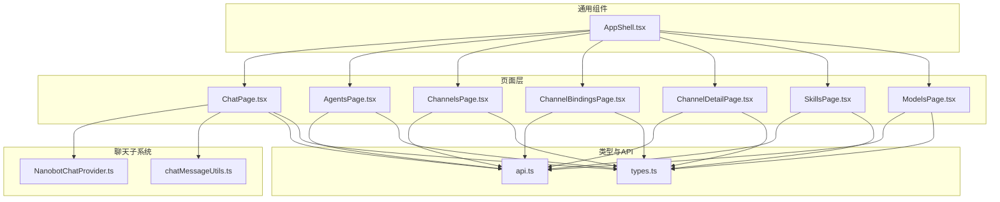
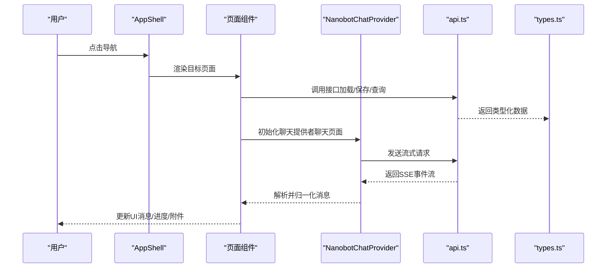
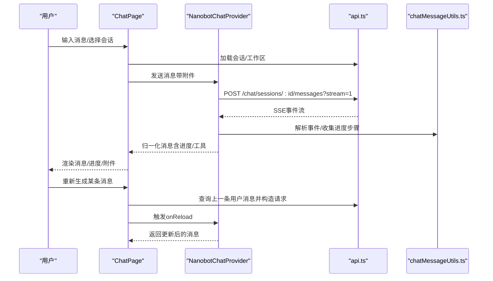
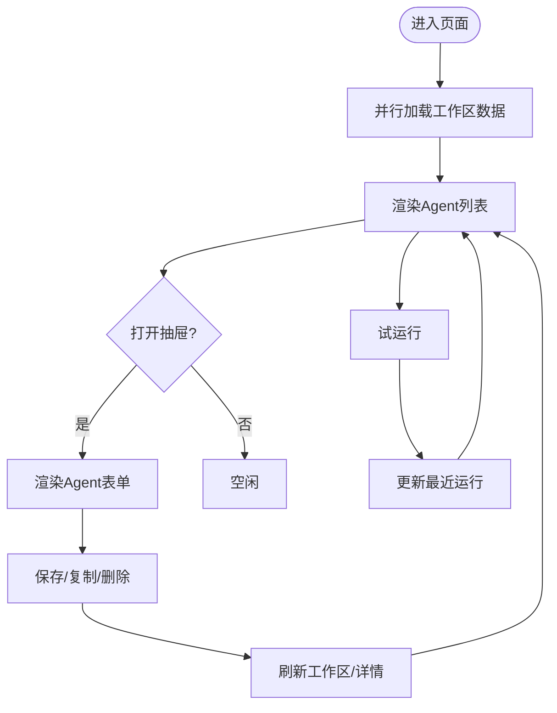
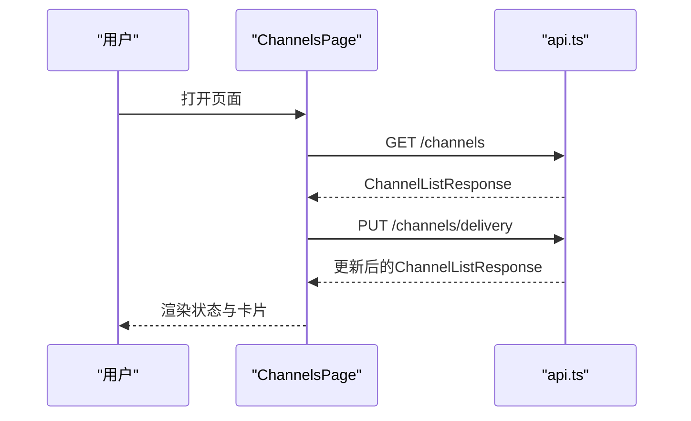
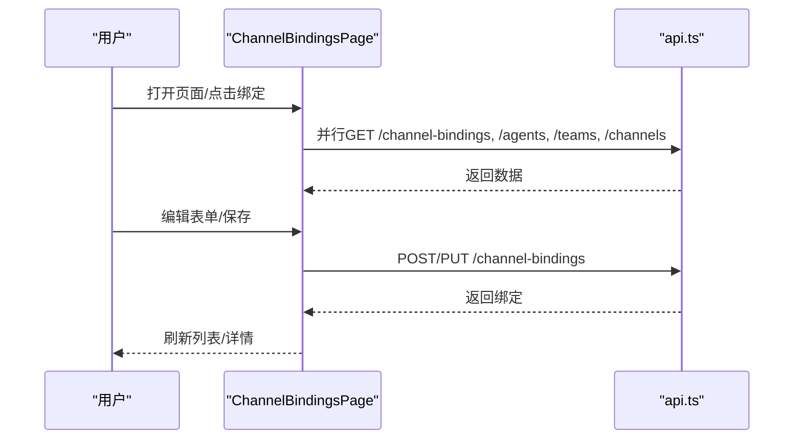
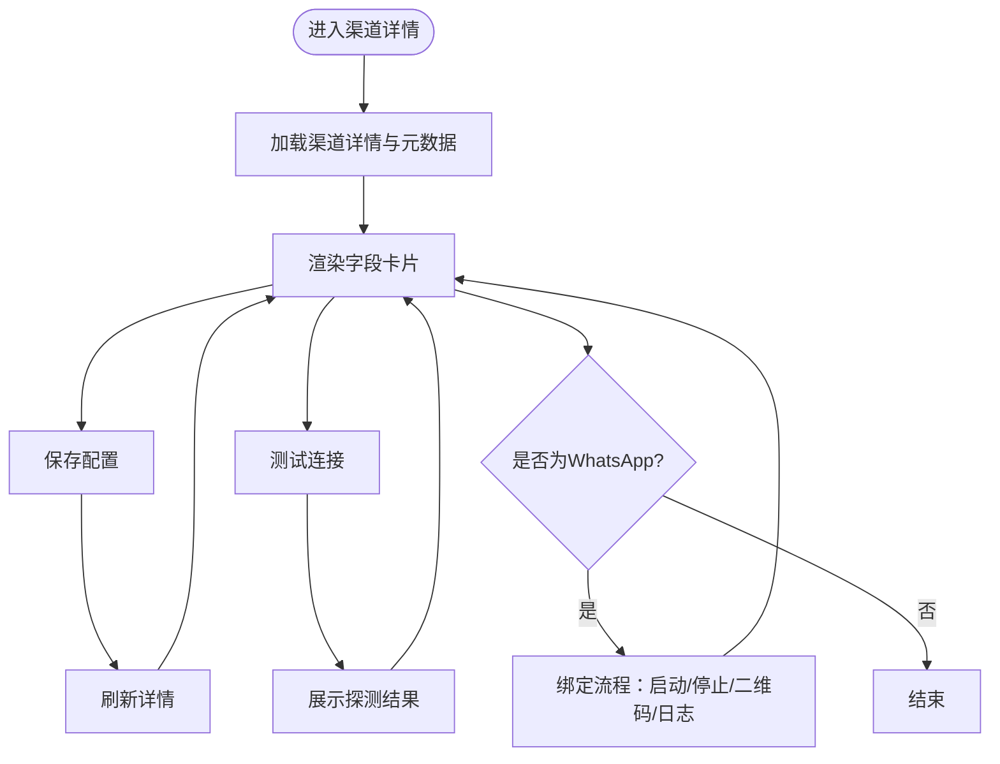
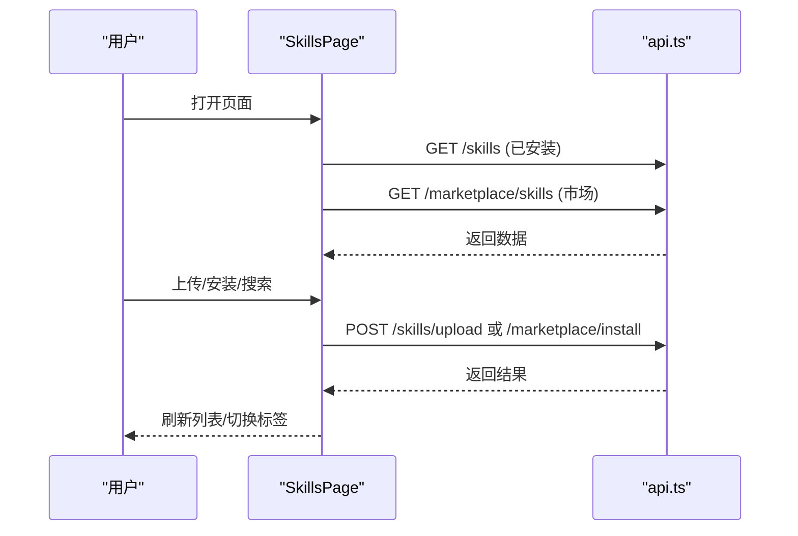
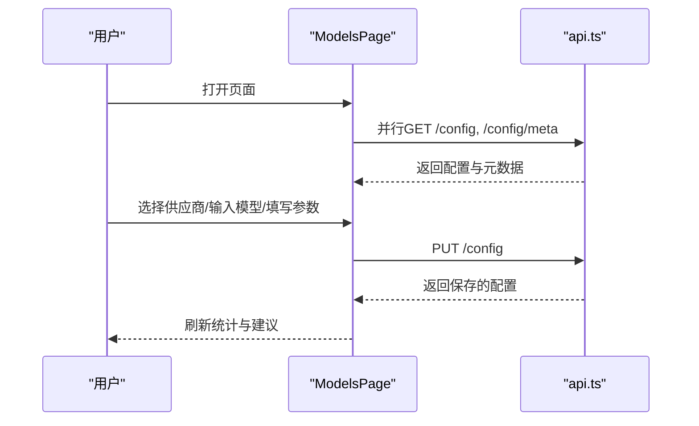
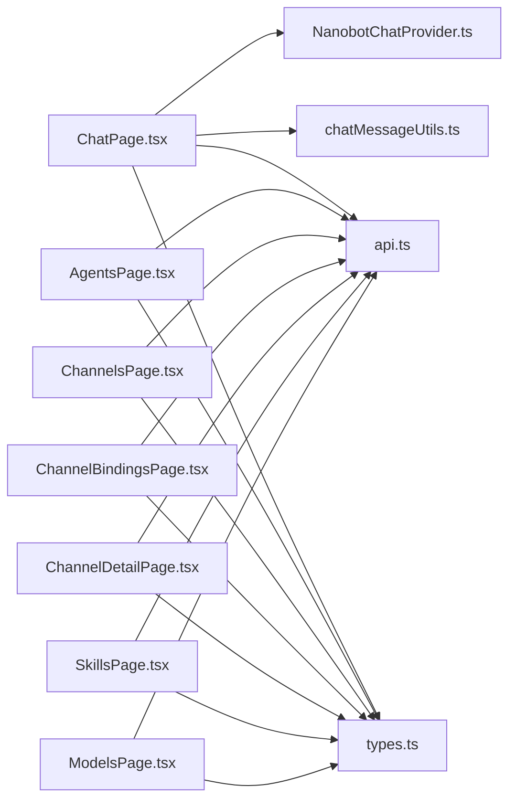

# 页面组件结构

<cite>
**本文档引用的文件**
- [ChatPage.tsx](file://web-ui/src/pages/ChatPage.tsx)
- [AgentsPage.tsx](file://web-ui/src/pages/AgentsPage.tsx)
- [ChannelsPage.tsx](file://web-ui/src/pages/ChannelsPage.tsx)
- [ChannelBindingsPage.tsx](file://web-ui/src/pages/ChannelBindingsPage.tsx)
- [ChannelDetailPage.tsx](file://web-ui/src/pages/ChannelDetailPage.tsx)
- [SkillsPage.tsx](file://web-ui/src/pages/SkillsPage.tsx)
- [ModelsPage.tsx](file://web-ui/src/pages/ModelsPage.tsx)
- [AppShell.tsx](file://web-ui/src/components/AppShell.tsx)
- [NanobotChatProvider.ts](file://web-ui/src/chat/NanobotChatProvider.ts)
- [chatMessageUtils.ts](file://web-ui/src/chat/chatMessageUtils.ts)
- [types.ts](file://web-ui/src/types.ts)
- [api.ts](file://web-ui/src/api.ts)
</cite>

## 目录
1. [简介](#简介)
2. [项目结构](#项目结构)
3. [核心组件](#核心组件)
4. [架构总览](#架构总览)
5. [详细组件分析](#详细组件分析)
6. [依赖分析](#依赖分析)
7. [性能考虑](#性能考虑)
8. [故障排查指南](#故障排查指南)
9. [结论](#结论)
10. [附录](#附录)

## 简介
本技术文档聚焦 Nanobot Web 前端页面组件结构，系统梳理聊天页面、代理管理页面、渠道管理页面、技能市场页面与模型配置页面的设计与实现。文档覆盖各页面的功能特性、布局设计、交互逻辑、Props 接口、状态管理、事件处理、页面间导航关系、数据传递与状态同步机制，并总结组件复用模式、样式定制与响应式设计实践，同时提供页面开发最佳实践与性能优化建议。

## 项目结构
前端采用模块化页面组件与通用组件分离的组织方式：
- 页面组件位于 web-ui/src/pages，按功能域划分（聊天、协作、渠道、构建、系统）。
- 通用组件位于 web-ui/src/components，如 AppShell、MotionSurface、PageHero 等。
- 聊天专用模块位于 web-ui/src/chat，封装聊天提供者与消息工具函数。
- 类型定义位于 web-ui/src/types，统一前后端数据契约。
- API 封装位于 web-ui/src/api，集中管理后端接口调用与错误处理。

图表来源
- [AppShell.tsx:130-334](file://web-ui/src/components/AppShell.tsx#L130-L334)
- [ChatPage.tsx:345-1111](file://web-ui/src/pages/ChatPage.tsx#L345-L1111)
- [AgentsPage.tsx:172-894](file://web-ui/src/pages/AgentsPage.tsx#L172-L894)
- [ChannelsPage.tsx:30-302](file://web-ui/src/pages/ChannelsPage.tsx#L30-L302)
- [ChannelBindingsPage.tsx:98-559](file://web-ui/src/pages/ChannelBindingsPage.tsx#L98-L559)
- [ChannelDetailPage.tsx:75-599](file://web-ui/src/pages/ChannelDetailPage.tsx#L75-L599)
- [SkillsPage.tsx:52-488](file://web-ui/src/pages/SkillsPage.tsx#L52-L488)
- [ModelsPage.tsx:36-380](file://web-ui/src/pages/ModelsPage.tsx#L36-L380)
- [NanobotChatProvider.ts:96-172](file://web-ui/src/chat/NanobotChatProvider.ts#L96-L172)
- [chatMessageUtils.ts:1-170](file://web-ui/src/chat/chatMessageUtils.ts#L1-L170)
- [types.ts:1-1098](file://web-ui/src/types.ts#L1-L1098)
- [api.ts:145-881](file://web-ui/src/api.ts#L145-L881)

章节来源
- [AppShell.tsx:130-334](file://web-ui/src/components/AppShell.tsx#L130-L334)
- [types.ts:1-1098](file://web-ui/src/types.ts#L1-L1098)
- [api.ts:145-881](file://web-ui/src/api.ts#L145-L881)

## 核心组件
- 聊天页面组件：负责会话管理、消息渲染、附件上传、工具链展示与重新生成等交互。
- 代理管理页面组件：负责 Agent 的增删改查、能力配置（工具/技能/MCP/知识库）、试运行与统计展示。
- 渠道管理页面组件：负责渠道概览、状态统计、投递行为配置与路由入口。
- 渠道绑定页面组件：负责消息路由规则的增删改查、过滤与优先级配置。
- 渠道详情页面组件：负责具体渠道的字段配置、状态检查、测试与特定渠道（如 WhatsApp）绑定流程。
- 技能市场页面组件：负责技能的安装、卸载、搜索与市场浏览。
- 模型配置页面组件：负责供应商选择、模型名称、连接参数与推理参数的统一配置。

章节来源
- [ChatPage.tsx:345-1111](file://web-ui/src/pages/ChatPage.tsx#L345-L1111)
- [AgentsPage.tsx:172-894](file://web-ui/src/pages/AgentsPage.tsx#L172-L894)
- [ChannelsPage.tsx:30-302](file://web-ui/src/pages/ChannelsPage.tsx#L30-L302)
- [ChannelBindingsPage.tsx:98-559](file://web-ui/src/pages/ChannelBindingsPage.tsx#L98-L559)
- [ChannelDetailPage.tsx:75-599](file://web-ui/src/pages/ChannelDetailPage.tsx#L75-L599)
- [SkillsPage.tsx:52-488](file://web-ui/src/pages/SkillsPage.tsx#L52-L488)
- [ModelsPage.tsx:36-380](file://web-ui/src/pages/ModelsPage.tsx#L36-L380)

## 架构总览
页面组件通过统一的 AppShell 导航体系串联，页面内部通过 api.ts 封装的 HTTP 请求与后端交互，聊天子系统通过 NanobotChatProvider 与 chatMessageUtils 实现流式消息与进度步骤的解析与归一化。

图表来源
- [AppShell.tsx:130-334](file://web-ui/src/components/AppShell.tsx#L130-L334)
- [ChatPage.tsx:345-1111](file://web-ui/src/pages/ChatPage.tsx#L345-L1111)
- [NanobotChatProvider.ts:96-172](file://web-ui/src/chat/NanobotChatProvider.ts#L96-L172)
- [api.ts:145-881](file://web-ui/src/api.ts#L145-L881)
- [types.ts:1-1098](file://web-ui/src/types.ts#L1-L1098)

## 详细组件分析

### 聊天页面（ChatPage）
- 功能特性
  - 会话列表与筛选、重命名、删除与创建新会话。
  - 工作区上下文（快速提示、最近上传、活跃 MCP、工具活动）集成。
  - 附件上传与引用、Markdown 渲染、工具调用与执行过程可视化。
  - 重新生成指定消息、错误回退与占位符提示。
- 布局设计
  - 左侧会话面板、右侧聊天主面板，支持滚动至最新消息与平滑动画。
- 交互逻辑
  - 使用 NanobotChatProvider 与后端建立 SSE 流，实时接收进度事件与最终消息。
  - 通过 chatMessageUtils 归一化消息、解析进度步骤与工具调用。
- Props 接口与状态
  - 关键状态：会话列表、当前会话、工作区数据、Composer 输入、附件集合、消息列表、请求状态。
  - 关键方法：加载会话、刷新工作区、上传附件、发送消息、重新生成、同步会话。
- 数据传递与状态同步
  - 会话切换后异步拉取历史消息并同步 UI；上传附件后刷新工作区数据。
- 组件复用与样式
  - 复用 @ant-design/x 的 Conversations、Bubble、Sender、ThoughtChain 等组件。
  - 自定义样式类名用于主题变量与响应式适配。
- 性能优化
  - 使用 startTransition 与 useMemo 降低渲染抖动；滚动至底部使用行为配置避免阻塞主线程。

图表来源
- [ChatPage.tsx:345-1111](file://web-ui/src/pages/ChatPage.tsx#L345-L1111)
- [NanobotChatProvider.ts:96-172](file://web-ui/src/chat/NanobotChatProvider.ts#L96-L172)
- [chatMessageUtils.ts:106-170](file://web-ui/src/chat/chatMessageUtils.ts#L106-L170)
- [api.ts:286-387](file://web-ui/src/api.ts#L286-L387)

章节来源
- [ChatPage.tsx:345-1111](file://web-ui/src/pages/ChatPage.tsx#L345-L1111)
- [NanobotChatProvider.ts:96-172](file://web-ui/src/chat/NanobotChatProvider.ts#L96-L172)
- [chatMessageUtils.ts:1-170](file://web-ui/src/chat/chatMessageUtils.ts#L1-L170)
- [types.ts:42-104](file://web-ui/src/types.ts#L42-L104)
- [api.ts:286-387](file://web-ui/src/api.ts#L286-L387)

### 代理管理页面（AgentsPage）
- 功能特性
  - Agent 列表展示与统计（总数、启用中、最近执行、可用知识库）。
  - Agent 表单配置（名称、描述、系统提示、规则、模型、后端、标签、记忆范围）。
  - 能力配置（工具、技能、MCP 服务、知识库）卡片化展示与选择。
  - Agent 试运行与最近运行记录展示。
  - 保存、复制、删除与刷新。
- 布局设计
  - 左侧列表卡片流，右侧抽屉表单，支持动态能力标签与状态徽章。
- 交互逻辑
  - 通过 api.getAgents、getValidTemplateTools、getInstalledSkills、getMcpServers、getKnowledgeBases 并行加载工作区。
  - 表单字段变更通过 updateForm 与 toPayload 转换为提交负载。
- Props 接口与状态
  - 关键状态：agents、validTools、skills、mcpServers、knowledgeBases、currentAgent、recentRuns、form、loading 状态。
  - 关键方法：加载工作区、加载详情、保存、复制、删除、试运行。
- 数据传递与状态同步
  - 保存后刷新列表与详情；删除后更新路由；试运行后刷新最近运行。
- 组件复用与样式
  - 复用 Ant Design 的卡片、表格、抽屉、折叠面板与标签页。
  - 使用 motion 动画增强交互反馈。
- 性能优化
  - 并行加载多源数据；useMemo 优化卡片项与建议模型列表。

图表来源
- [AgentsPage.tsx:172-894](file://web-ui/src/pages/AgentsPage.tsx#L172-L894)
- [api.ts:622-658](file://web-ui/src/api.ts#L622-L658)
- [types.ts:435-472](file://web-ui/src/types.ts#L435-L472)

章节来源
- [AgentsPage.tsx:172-894](file://web-ui/src/pages/AgentsPage.tsx#L172-L894)
- [types.ts:435-472](file://web-ui/src/types.ts#L435-L472)
- [api.ts:622-658](file://web-ui/src/api.ts#L622-L658)

### 渠道管理页面（ChannelsPage）
- 功能特性
  - 渠道概览与状态统计（已启用、已配置、待补全、总数）。
  - 统一投递行为配置（推送执行进度、推送工具提示）。
  - 按分类展示渠道卡片，标注状态、类别与缺失字段。
  - 路由入口与下一步操作提示。
- 布局设计
  - 顶部 Hero 展示统计与徽章，网格卡片展示渠道分类与状态。
- 交互逻辑
  - 加载渠道列表与投递设置；保存投递设置；跳转到消息路由。
- Props 接口与状态
  - 关键状态：data、loading、savingDelivery、deliveryDraft。
  - 关键方法：加载渠道、保存投递设置。
- 数据传递与状态同步
  - 保存后同步更新状态与徽章提示。
- 组件复用与样式
  - 复用 PageHero、Card、Tag、Switch、Row/Col 等组件。
- 性能优化
  - 使用 useMemo 计算统计与缺失字段列表。

图表来源
- [ChannelsPage.tsx:30-302](file://web-ui/src/pages/ChannelsPage.tsx#L30-L302)
- [api.ts:390-412](file://web-ui/src/api.ts#L390-L412)
- [types.ts:194-197](file://web-ui/src/types.ts#L194-L197)

章节来源
- [ChannelsPage.tsx:30-302](file://web-ui/src/pages/ChannelsPage.tsx#L30-L302)
- [types.ts:194-197](file://web-ui/src/types.ts#L194-L197)
- [api.ts:390-412](file://web-ui/src/api.ts#L390-L412)

### 渠道绑定页面（ChannelBindingsPage）
- 功能特性
  - 绑定列表展示与过滤（全部/启用/员工/团队），支持搜索。
  - 绑定表单（渠道名称、聊天 ID、目标类型、目标、优先级、启用状态）。
  - 创建、更新、删除绑定；路由到对应详情。
- 布局设计
  - 左侧列表卡片，右侧表单卡片，支持优先级与启用状态徽章。
- 交互逻辑
  - 并行加载绑定、Agent、Team、Channel 列表；根据路由参数加载详情。
  - 表单字段联动（目标类型切换清空目标）。
- Props 接口与状态
  - 关键状态：bindings、agents、teams、channels、currentBinding、form、loadingWorkspace、saving、deleting。
  - 关键方法：加载工作区、加载详情、保存、删除。
- 数据传递与状态同步
  - 保存后刷新列表与详情；删除后更新路由。
- 组件复用与样式
  - 复用 Ant Design 的 List、Card、Select、Input、Switch、Segmented 等。
- 性能优化
  - 使用 useMemo 过滤绑定列表与计算目标选项。

图表来源
- [ChannelBindingsPage.tsx:98-559](file://web-ui/src/pages/ChannelBindingsPage.tsx#L98-L559)
- [api.ts:420-440](file://web-ui/src/api.ts#L420-L440)
- [types.ts:40-86](file://web-ui/src/types.ts#L40-L86)

章节来源
- [ChannelBindingsPage.tsx:98-559](file://web-ui/src/pages/ChannelBindingsPage.tsx#L98-L559)
- [types.ts:40-86](file://web-ui/src/types.ts#L40-L86)
- [api.ts:420-440](file://web-ui/src/api.ts#L420-L440)

### 渠道详情页面（ChannelDetailPage）
- 功能特性
  - 字段配置卡片，支持多种输入类型（文本、密码、数字、下拉、开关、列表、文本域）。
  - 状态检查与下一步建议；测试连接与探测结果展示。
  - 特定渠道（如 WhatsApp）绑定流程：启动/停止绑定、二维码、日志与状态。
- 布局设计
  - 左侧字段配置，右侧状态、测试与绑定流程区域。
- 交互逻辑
  - 通过 meta 配置动态渲染字段；保存后刷新详情；测试后展示探测结果。
  - WhatsApp 绑定流程独立状态管理与日志展示。
- Props 接口与状态
  - 关键状态：detail、draftConfig、loading、saving、testing、probeResult、whatsappBinding。
  - 关键方法：更新字段、保存、测试、启动/停止绑定。
- 数据传递与状态同步
  - 保存后同步草稿配置；测试后展示最新探测结果。
- 组件复用与样式
  - 复用 Ant Design 的 Card、Input、Select、Switch、QRCode、Alert 等。
- 性能优化
  - 使用 useMemo 计算缺失字段与完成度；结构化克隆更新深层字段。

图表来源
- [ChannelDetailPage.tsx:75-599](file://web-ui/src/pages/ChannelDetailPage.tsx#L75-L599)
- [api.ts:391-417](file://web-ui/src/api.ts#L391-L417)
- [types.ts:199-241](file://web-ui/src/types.ts#L199-L241)

章节来源
- [ChannelDetailPage.tsx:75-599](file://web-ui/src/pages/ChannelDetailPage.tsx#L75-L599)
- [types.ts:199-241](file://web-ui/src/types.ts#L199-L241)
- [api.ts:391-417](file://web-ui/src/api.ts#L391-L417)

### 技能市场页面（SkillsPage）
- 功能特性
  - 已安装技能列表与搜索；支持文件夹上传与ZIP上传。
  - 技能市场浏览与搜索；安装/覆盖安装；标签与兼容性展示。
  - 统计信息（已安装数量、市场资源数量）。
- 布局设计
  - 顶部 Hero 展示统计；标签页切换“已安装”与“技能市场”。
  - 响应式网格卡片展示技能。
- 交互逻辑
  - 加载已安装技能与市场技能；上传后刷新列表；安装后同步标签页。
- Props 接口与状态
  - 关键状态：skills、marketplaceSkills、loading、marketLoading、uploading、deletingId、installingId、query、marketQuery、activeTab。
  - 关键方法：加载技能、搜索市场、上传、删除、安装。
- 数据传递与状态同步
  - 上传/安装后刷新列表并切换到“已安装”标签。
- 组件复用与样式
  - 复用 Ant Design 的 Tabs、Card、Grid、Tag、Input、Button 等。
- 性能优化
  - 使用 useMemo 过滤技能列表与计算统计；并发加载减少等待时间。

图表来源
- [SkillsPage.tsx:52-488](file://web-ui/src/pages/SkillsPage.tsx#L52-L488)
- [api.ts:92-200](file://web-ui/src/api.ts#L92-L200)
- [types.ts:365-393](file://web-ui/src/types.ts#L365-L393)

章节来源
- [SkillsPage.tsx:52-488](file://web-ui/src/pages/SkillsPage.tsx#L52-L488)
- [types.ts:365-393](file://web-ui/src/types.ts#L365-L393)
- [api.ts:92-200](file://web-ui/src/api.ts#L92-L200)

### 模型配置页面（ModelsPage）
- 功能特性
  - 供应商选择与模型建议；服务连接（API Key/OAuth）与可选服务地址。
  - 推理参数（温度、思考深度、最大回复长度、上下文窗口、工具迭代次数）。
  - 统计信息（当前供应商、模型、认证方式、建议模型数量）。
- 布局设计
  - 分步骤配置：供应商 → 模型 → 连接 → 参数。
- 交互逻辑
  - 选择供应商后动态更新模型建议与字段；保存后刷新配置与元数据。
- Props 接口与状态
  - 关键状态：config、configMeta、loading、saving。
  - 关键方法：加载配置、更新字段、保存配置。
- 数据传递与状态同步
  - 保存后重新加载配置与元数据并归一化。
- 组件复用与样式
  - 复用 Ant Design 的 Card、Select、Input、InputNumber、Tag、Alert 等。
- 性能优化
  - 使用 useMemo 生成建议模型与选项；并发加载配置与元数据。

图表来源
- [ModelsPage.tsx:36-380](file://web-ui/src/pages/ModelsPage.tsx#L36-L380)
- [api.ts:388-446](file://web-ui/src/api.ts#L388-L446)
- [types.ts:136-176](file://web-ui/src/types.ts#L136-L176)

章节来源
- [ModelsPage.tsx:36-380](file://web-ui/src/pages/ModelsPage.tsx#L36-L380)
- [types.ts:136-176](file://web-ui/src/types.ts#L136-L176)
- [api.ts:388-446](file://web-ui/src/api.ts#L388-L446)

## 依赖分析
- 组件耦合
  - 页面组件对 AppShell 导航强依赖，对 api.ts 与 types.ts 弱依赖，便于解耦与测试。
  - 聊天页面对 NanobotChatProvider 与 chatMessageUtils 存在直接依赖，形成聊天子系统内聚。
- 外部依赖
  - @ant-design/x 与 @ant-design/x-sdk 提供聊天 UI 与流式通信能力。
  - framer-motion 提供页面与元素动画。
- 循环依赖
  - 未发现循环导入；页面组件通过 api.ts 间接依赖 types.ts，避免直接循环。

图表来源
- [ChatPage.tsx:345-1111](file://web-ui/src/pages/ChatPage.tsx#L345-L1111)
- [NanobotChatProvider.ts:96-172](file://web-ui/src/chat/NanobotChatProvider.ts#L96-L172)
- [chatMessageUtils.ts:1-170](file://web-ui/src/chat/chatMessageUtils.ts#L1-L170)
- [AgentsPage.tsx:172-894](file://web-ui/src/pages/AgentsPage.tsx#L172-L894)
- [ChannelsPage.tsx:30-302](file://web-ui/src/pages/ChannelsPage.tsx#L30-L302)
- [ChannelBindingsPage.tsx:98-559](file://web-ui/src/pages/ChannelBindingsPage.tsx#L98-L559)
- [ChannelDetailPage.tsx:75-599](file://web-ui/src/pages/ChannelDetailPage.tsx#L75-L599)
- [SkillsPage.tsx:52-488](file://web-ui/src/pages/SkillsPage.tsx#L52-L488)
- [ModelsPage.tsx:36-380](file://web-ui/src/pages/ModelsPage.tsx#L36-L380)
- [api.ts:145-881](file://web-ui/src/api.ts#L145-L881)
- [types.ts:1-1098](file://web-ui/src/types.ts#L1-L1098)

章节来源
- [api.ts:145-881](file://web-ui/src/api.ts#L145-L881)
- [types.ts:1-1098](file://web-ui/src/types.ts#L1-L1098)

## 性能考虑
- 渲染优化
  - 使用 useMemo 与 useCallback 缓存计算结果与回调，减少不必要的重渲染。
  - 使用 startTransition 与 Suspense 风格的异步状态切换，避免阻塞 UI。
- 网络优化
  - 并行加载多源数据，缩短首屏时间；对高频请求进行节流/防抖。
  - SSE 流式传输按事件粒度更新，避免一次性大对象渲染。
- 内存与状态
  - 使用局部状态隔离页面内部状态，避免全局污染。
  - 对附件与进度步骤进行去重与归一化，减少冗余数据。
- 可访问性与响应式
  - 使用断点与响应式布局适配移动端；为关键按钮与表单控件提供语义化标签与键盘导航支持。

## 故障排查指南
- 聊天流式异常
  - 现象：消息不更新或报错。
  - 排查：检查 SSE 事件解析与错误捕获；确认会话 ID 与查询内容非空。
- 认证失效
  - 现象：401 错误弹窗。
  - 排查：监听 auth-required 事件并跳转登录页。
- 渠道测试失败
  - 现象：探测结果失败或警告。
  - 排查：核对字段完整性与配置正确性；查看探测检查项明细。
- 绑定冲突
  - 现象：路由规则未生效或优先级异常。
  - 排查：检查绑定启用状态、聊天 ID 匹配与优先级设置。

章节来源
- [NanobotChatProvider.ts:47-79](file://web-ui/src/chat/NanobotChatProvider.ts#L47-L79)
- [api.ts:109-114](file://web-ui/src/api.ts#L109-L114)
- [ChannelDetailPage.tsx:194-205](file://web-ui/src/pages/ChannelDetailPage.tsx#L194-L205)
- [ChannelBindingsPage.tsx:248-303](file://web-ui/src/pages/ChannelBindingsPage.tsx#L248-L303)

## 结论
本文档系统梳理了 Nanobot 页面组件结构，明确了各页面的功能边界、数据流与交互模式，并给出了依赖关系、性能优化与故障排查建议。通过统一的类型契约与 API 封装，页面组件实现了高内聚、低耦合与良好的可维护性。建议在后续开发中持续关注渲染性能、网络请求优化与用户体验一致性。

## 附录
- 开发最佳实践
  - 使用 TypeScript 严格模式与类型守卫，确保数据安全。
  - 将 UI 细分为可复用组件，遵循单一职责原则。
  - 在页面层使用状态提升与集中式存储（如需要）结合局部状态，平衡复杂度与性能。
  - 为关键流程绘制序列图与流程图，辅助代码审查与回归测试。
- 样式与主题
  - 使用 CSS 变量与 Ant Design 主题系统，保证一致的视觉语言。
  - 为聊天与表单场景分别定义专用样式类名，避免样式污染。
- 响应式设计
  - 基于断点与弹性布局适配桌面与移动设备，优先保障核心交互流畅性。