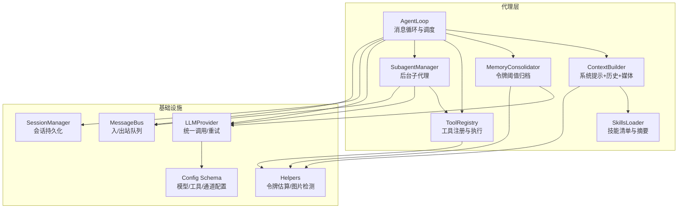
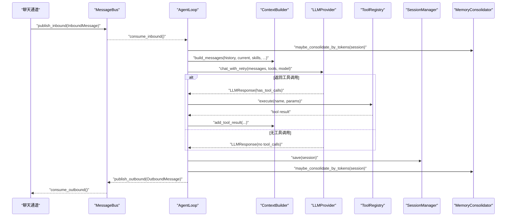
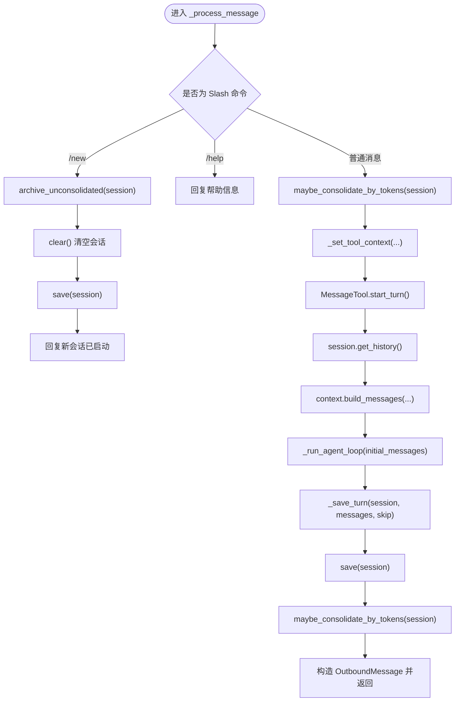
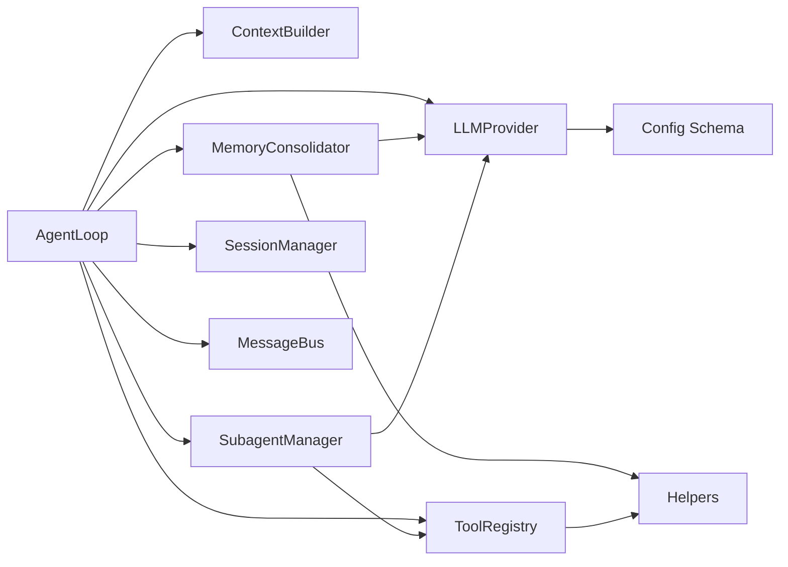

# 代理引擎

<cite>
**本文引用的文件列表**
- [nanobot/agent/loop.py](file://nanobot/agent/loop.py)
- [nanobot/agent/context.py](file://nanobot/agent/context.py)
- [nanobot/agent/memory.py](file://nanobot/agent/memory.py)
- [nanobot/agent/skills.py](file://nanobot/agent/skills.py)
- [nanobot/agent/subagent.py](file://nanobot/agent/subagent.py)
- [nanobot/agent/tools/registry.py](file://nanobot/agent/tools/registry.py)
- [nanobot/agent/tools/base.py](file://nanobot/agent/tools/base.py)
- [nanobot/session/manager.py](file://nanobot/session/manager.py)
- [nanobot/bus/events.py](file://nanobot/bus/events.py)
- [nanobot/bus/queue.py](file://nanobot/bus/queue.py)
- [nanobot/providers/base.py](file://nanobot/providers/base.py)
- [nanobot/config/schema.py](file://nanobot/config/schema.py)
- [nanobot/utils/helpers.py](file://nanobot/utils/helpers.py)
</cite>

## 目录
1. [简介](#简介)
2. [项目结构](#项目结构)
3. [核心组件](#核心组件)
4. [架构总览](#架构总览)
5. [详细组件分析](#详细组件分析)
6. [依赖关系分析](#依赖关系分析)
7. [性能与令牌估算](#性能与令牌估算)
8. [故障排查指南](#故障排查指南)
9. [结论](#结论)
10. [附录：配置与使用模式](#附录配置与使用模式)

## 简介
本文件面向 Nanobot 代理引擎，聚焦 AgentLoop 的核心机制，系统阐述代理循环处理、上下文构建、LLM 调用、工具执行、会话与记忆管理、令牌估算与性能优化，并给出调试方法与集成建议。读者可据此理解代理如何接收用户输入、生成响应、管理会话状态，以及如何通过工具链扩展能力。

## 项目结构
围绕代理引擎的关键模块如下：
- 代理循环与调度：AgentLoop（消息消费、循环迭代、停止控制）
- 上下文构建：ContextBuilder（系统提示、历史拼接、运行时上下文注入）
- 记忆与归档：MemoryConsolidator/MemoryStore（按令牌阈值归档、长短期记忆）
- 技能加载：SkillsLoader（技能清单、摘要、可用性检查）
- 工具体系：ToolRegistry + Tool 基类（动态注册、参数校验、OpenAI Schema）
- 会话管理：Session/SessionManager（持久化历史、分页取用、迁移兼容）
- 消息总线：MessageBus（入站/出站队列解耦）
- 提供商接口：LLMProvider（统一调用、重试、空内容清洗）
- 配置与工具：Config Schema、工具配置、令牌估算辅助

图表来源
- [nanobot/agent/loop.py:35-129](file://nanobot/agent/loop.py#L35-L129)
- [nanobot/agent/context.py:16-78](file://nanobot/agent/context.py#L16-L78)
- [nanobot/agent/memory.py:149-285](file://nanobot/agent/memory.py#L149-L285)
- [nanobot/agent/skills.py:13-141](file://nanobot/agent/skills.py#L13-L141)
- [nanobot/agent/tools/registry.py:8-71](file://nanobot/agent/tools/registry.py#L8-L71)
- [nanobot/agent/subagent.py:28-119](file://nanobot/agent/subagent.py#L28-L119)
- [nanobot/bus/queue.py:8-45](file://nanobot/bus/queue.py#L8-L45)
- [nanobot/session/manager.py:73-252](file://nanobot/session/manager.py#L73-L252)
- [nanobot/providers/base.py:69-271](file://nanobot/providers/base.py#L69-L271)
- [nanobot/config/schema.py:351-450](file://nanobot/config/schema.py#L351-L450)
- [nanobot/utils/helpers.py:92-171](file://nanobot/utils/helpers.py#L92-L171)

章节来源
- [nanobot/agent/loop.py:35-129](file://nanobot/agent/loop.py#L35-L129)
- [nanobot/agent/context.py:16-78](file://nanobot/agent/context.py#L16-L78)
- [nanobot/agent/memory.py:149-285](file://nanobot/agent/memory.py#L149-L285)
- [nanobot/agent/skills.py:13-141](file://nanobot/agent/skills.py#L13-L141)
- [nanobot/agent/tools/registry.py:8-71](file://nanobot/agent/tools/registry.py#L8-L71)
- [nanobot/agent/subagent.py:28-119](file://nanobot/agent/subagent.py#L28-L119)
- [nanobot/bus/queue.py:8-45](file://nanobot/bus/queue.py#L8-L45)
- [nanobot/session/manager.py:73-252](file://nanobot/session/manager.py#L73-L252)
- [nanobot/providers/base.py:69-271](file://nanobot/providers/base.py#L69-L271)
- [nanobot/config/schema.py:351-450](file://nanobot/config/schema.py#L351-L450)
- [nanobot/utils/helpers.py:92-171](file://nanobot/utils/helpers.py#L92-L171)

## 核心组件
- AgentLoop：代理主循环，负责消息消费、上下文构建、LLM 调用、工具执行、结果回传、会话保存与内存归档。
- ContextBuilder：组装系统提示、工作区记忆、技能、运行时上下文与历史消息，支持多模态用户内容注入。
- MemoryConsolidator：基于令牌阈值选择旧消息边界进行归档，避免上下文溢出；提供并发锁与轮次限制。
- SkillsLoader：扫描工作区与内置技能目录，构建技能摘要与可用性检查，用于上下文注入。
- ToolRegistry：动态注册工具，统一参数类型转换、校验与执行，输出 OpenAI 函数定义。
- SubagentManager：管理后台子代理任务，独立工具集与运行记录，完成自动汇报。
- SessionManager：会话持久化（JSONL），支持迁移、清理、元数据合并与历史截断。
- MessageBus：异步队列解耦通道与代理，提供入/出站消息发布与消费。
- LLMProvider：抽象统一的 LLM 调用接口，内置重试与空内容清洗，支持令牌估算回调。
- 配置与工具：Config Schema 定义模型、工具、通道等配置；helpers 提供令牌估算与图片 MIME 检测。

章节来源
- [nanobot/agent/loop.py:35-129](file://nanobot/agent/loop.py#L35-L129)
- [nanobot/agent/context.py:16-78](file://nanobot/agent/context.py#L16-L78)
- [nanobot/agent/memory.py:149-285](file://nanobot/agent/memory.py#L149-L285)
- [nanobot/agent/skills.py:13-141](file://nanobot/agent/skills.py#L13-L141)
- [nanobot/agent/tools/registry.py:8-71](file://nanobot/agent/tools/registry.py#L8-L71)
- [nanobot/agent/subagent.py:28-119](file://nanobot/agent/subagent.py#L28-L119)
- [nanobot/session/manager.py:73-252](file://nanobot/session/manager.py#L73-L252)
- [nanobot/bus/queue.py:8-45](file://nanobot/bus/queue.py#L8-L45)
- [nanobot/providers/base.py:69-271](file://nanobot/providers/base.py#L69-L271)
- [nanobot/config/schema.py:351-450](file://nanobot/config/schema.py#L351-L450)
- [nanobot/utils/helpers.py:92-171](file://nanobot/utils/helpers.py#L92-L171)

## 架构总览
代理引擎采用“消息总线 + 会话 + 记忆 + 工具”的解耦架构：
- 通道通过 MessageBus 将 InboundMessage 推入代理；
- AgentLoop 在全局锁保护下处理消息，构建 Context，调用 LLMProvider；
- 若返回工具调用，则执行 ToolRegistry 中对应工具，将结果追加到消息序列；
- 最终将 OutboundMessage 发回通道或作为系统消息触发后续处理；
- 会话与记忆在每次回合后保存，必要时按令牌阈值归档旧消息。

图表来源
- [nanobot/agent/loop.py:289-485](file://nanobot/agent/loop.py#L289-L485)
- [nanobot/agent/context.py:145-180](file://nanobot/agent/context.py#L145-L180)
- [nanobot/agent/memory.py:229-285](file://nanobot/agent/memory.py#L229-L285)
- [nanobot/bus/queue.py:20-34](file://nanobot/bus/queue.py#L20-L34)
- [nanobot/providers/base.py:192-266](file://nanobot/providers/base.py#L192-L266)

## 详细组件分析

### AgentLoop：代理循环与调度
- 初始化与配置
  - 接收 MessageBus、LLMProvider、工作区路径、模型名、最大迭代次数、上下文窗口令牌数、工具白名单、技能名、系统提示覆盖、是否包含工作区记忆、记忆片段、通道配置、会话管理器、MCP 服务器、通道分发器等。
  - 构建 ContextBuilder、SessionManager、ToolRegistry、SubagentManager、MemoryConsolidator。
- 默认工具注册
  - 文件系统读写/编辑/列出、Shell 执行、Web 搜索/抓取、消息发送、子代理派生、定时任务（若启用）。
- 运行与消息分发
  - run() 循环从 MessageBus 消费消息，遇到 “/stop” 触发取消当前会话所有任务与子代理；否则以任务形式异步处理，支持响应式停止。
- 单条消息处理
  - 支持系统消息（channel=system）、Slash 命令（/new、/help）、普通消息；设置工具上下文（路由信息、运行上下文）；构建消息序列；按需流式进度通知；保存回合、归档记忆、返回响应。
- 停止控制
  - 基于会话键收集活跃任务并取消，同时取消该会话下的子代理，反馈统计信息。

图表来源
- [nanobot/agent/loop.py:371-485](file://nanobot/agent/loop.py#L371-L485)
- [nanobot/agent/memory.py:229-285](file://nanobot/agent/memory.py#L229-L285)
- [nanobot/agent/context.py:145-180](file://nanobot/agent/context.py#L145-L180)

章节来源
- [nanobot/agent/loop.py:35-129](file://nanobot/agent/loop.py#L35-L129)
- [nanobot/agent/loop.py:289-485](file://nanobot/agent/loop.py#L289-L485)

### ContextBuilder：上下文构建与运行时注入
- 系统提示组成
  - 身份信息（运行环境、工作区路径、平台策略）、引导文件（AGENTS/SOUL/USER/TOOLS）、额外系统提示、工作区共享记忆与自定义记忆片段、激活技能内容与技能摘要。
- 用户消息构建
  - 将运行时上下文（时间、频道、会话标识）与用户文本合并为单一用户消息，避免连续相同角色消息；支持多模态（图片）以 dataURL 形式注入。
- 助手消息与工具结果
  - 统一构建助手消息（含 content/tool_calls/reasoning/thinking），追加工具结果消息。

章节来源
- [nanobot/agent/context.py:16-78](file://nanobot/agent/context.py#L16-L78)
- [nanobot/agent/context.py:145-180](file://nanobot/agent/context.py#L145-L180)
- [nanobot/agent/context.py:204-227](file://nanobot/agent/context.py#L204-L227)

### MemoryConsolidator：记忆归档与令牌估算
- 归档策略
  - 估计当前会话提示大小，若超过半上下文窗口则循环归档旧用户回合，直到满足阈值；每轮最多尝试固定次数。
- 边界选择
  - 从最近未归档位置开始，按消息逐条累加令牌，遇到下一个用户消息即记录候选边界，确保安全裁剪。
- 令牌估算
  - 先尝试提供商提供的计数器，失败则回退到 tiktoken 估算；对单条消息也提供估算函数。
- 并发控制
  - 以会话键为粒度的弱引用锁，避免并发归档冲突。

章节来源
- [nanobot/agent/memory.py:149-285](file://nanobot/agent/memory.py#L149-L285)
- [nanobot/utils/helpers.py:92-171](file://nanobot/utils/helpers.py#L92-L171)

### SkillsLoader：技能加载与可用性检查
- 列表与加载
  - 优先工作区 skills，再内置 skills；支持过滤不可用技能（依据元数据中的 bins/env 要求）。
- 摘要与描述
  - 生成 XML 摘要，包含名称、描述、位置、可用性与缺失依赖；支持 always 标记的技能。
- 元数据解析
  - 支持 nanobot/openclaw 前言元数据，提取 requires、always 等字段。

章节来源
- [nanobot/agent/skills.py:13-141](file://nanobot/agent/skills.py#L13-L141)
- [nanobot/agent/skills.py:193-229](file://nanobot/agent/skills.py#L193-L229)

### ToolRegistry 与 Tool 基类：工具注册与执行
- 注册与执行
  - 注册 Tool 实例，统一导出 OpenAI Schema；执行前进行参数类型转换与校验，异常与错误结果带提示。
- 参数校验
  - 支持整数/数字/字符串/布尔/数组/对象类型，枚举、长度、范围、必填项等校验规则。
- 类型转换
  - 字符串到数值、布尔的智能转换，数组/对象递归转换。

章节来源
- [nanobot/agent/tools/registry.py:8-71](file://nanobot/agent/tools/registry.py#L8-L71)
- [nanobot/agent/tools/base.py:7-182](file://nanobot/agent/tools/base.py#L7-L182)

### SubagentManager：后台子代理
- 子代理生命周期
  - spawn 创建后台任务，限制最大迭代次数；构建子代理专用工具集（不含消息与派生工具）；记录运行事件与产物；完成后通过系统消息通知主代理。
- 取消与状态
  - 支持按会话批量取消，按 run_id 单个取消；失败/取消时更新运行状态并记录日志。

章节来源
- [nanobot/agent/subagent.py:28-119](file://nanobot/agent/subagent.py#L28-L119)
- [nanobot/agent/subagent.py:120-307](file://nanobot/agent/subagent.py#L120-L307)

### SessionManager：会话持久化与历史管理
- 数据结构
  - Session 包含消息列表、创建/更新时间、元数据、最后归档索引；历史取用按用户回合对齐，丢弃非用户开头的消息。
- 存储与迁移
  - JSONL 文件存储，支持旧路径迁移；缓存加速访问；提供元数据合并、删除、列表查询。
- 一致性
  - 归档不修改消息列表，仅更新 last_consolidated 指针，保证 get_history() 输出稳定。

章节来源
- [nanobot/session/manager.py:16-71](file://nanobot/session/manager.py#L16-L71)
- [nanobot/session/manager.py:73-252](file://nanobot/session/manager.py#L73-L252)

### MessageBus：异步消息总线
- 解耦通信
  - 入站/出站队列分别承载通道到代理与代理到通道的消息；提供阻塞消费与队列长度查询。

章节来源
- [nanobot/bus/queue.py:8-45](file://nanobot/bus/queue.py#L8-L45)

### LLMProvider：统一调用与重试
- 接口与响应
  - chat() 返回 LLMResponse（content/tool_calls/finish_reason/usage/reasoning/thinking）；chat_with_retry() 自动重试瞬时错误。
- 请求清洗
  - 对空内容进行安全替换，避免部分提供商 400 错误；标准化消息键集合。
- 默认参数
  - 通过 GenerationSettings 统一温度、最大令牌、推理强度等默认值。

章节来源
- [nanobot/providers/base.py:69-271](file://nanobot/providers/base.py#L69-L271)

## 依赖关系分析
- AgentLoop 依赖
  - ContextBuilder（构建消息）、MemoryConsolidator（令牌估算与归档）、ToolRegistry（工具定义与执行）、SubagentManager（后台任务）、LLMProvider（模型调用）、SessionManager（会话持久化）、MessageBus（消息总线）。
- 工具链依赖
  - ToolRegistry 依赖 Tool 基类；工具执行可能依赖外部进程/网络（Exec/Web）。
- 记忆与令牌
  - MemoryConsolidator 依赖 Provider 的令牌估算回调或 tiktoken；helpers 提供估算实现。
- 配置与通道
  - Config Schema 提供模型、工具、通道、网关等配置；ChannelsConfig 控制进度与工具提示开关。

图表来源
- [nanobot/agent/loop.py:35-129](file://nanobot/agent/loop.py#L35-L129)
- [nanobot/agent/memory.py:149-285](file://nanobot/agent/memory.py#L149-L285)
- [nanobot/agent/tools/registry.py:8-71](file://nanobot/agent/tools/registry.py#L8-L71)
- [nanobot/agent/subagent.py:28-119](file://nanobot/agent/subagent.py#L28-L119)
- [nanobot/providers/base.py:69-271](file://nanobot/providers/base.py#L69-L271)
- [nanobot/config/schema.py:351-450](file://nanobot/config/schema.py#L351-L450)
- [nanobot/utils/helpers.py:92-171](file://nanobot/utils/helpers.py#L92-L171)

## 性能与令牌估算
- 令牌估算
  - 提供 estimate_prompt_tokens_chain：优先调用提供商计数器，失败回退 tiktoken；estimate_prompt_tokens/estimate_message_tokens 分别用于整体与单条消息估算。
- 归档策略
  - 当提示超过半上下文窗口时，按用户回合边界循环归档，最多尝试固定轮次；边界选择确保移除足够旧令牌且不破坏对话结构。
- 工具结果截断
  - 为避免超长工具结果污染会话，对过长结果进行截断并标记。
- 会话历史截断
  - 历史取用按最大消息数截断，避免无限增长。

章节来源
- [nanobot/utils/helpers.py:92-171](file://nanobot/utils/helpers.py#L92-L171)
- [nanobot/agent/memory.py:181-285](file://nanobot/agent/memory.py#L181-L285)
- [nanobot/agent/loop.py:487-521](file://nanobot/agent/loop.py#L487-L521)

## 故障排查指南
- LLM 调用错误
  - 使用 chat_with_retry 自动重试瞬时错误；若非瞬时错误，直接返回错误响应；注意空内容清洗避免 400。
- 工具执行异常
  - ToolRegistry 对参数类型转换与校验失败会返回错误提示；工具抛出异常也会被包装并附加建议。
- 记忆归档失败
  - Consolidator 失败会记录异常并中止本轮归档；可检查 Provider 工具定义与模型能力。
- 会话加载/迁移问题
  - SessionManager 支持旧路径迁移与异常容错；若加载失败，检查 JSONL 结构与权限。
- 停止命令无效
  - 确认消息为 “/stop”，且会话键匹配；AgentLoop 会取消当前会话的所有任务与子代理。

章节来源
- [nanobot/providers/base.py:192-266](file://nanobot/providers/base.py#L192-L266)
- [nanobot/agent/tools/registry.py:38-59](file://nanobot/agent/tools/registry.py#L38-L59)
- [nanobot/agent/memory.py:149-147](file://nanobot/agent/memory.py#L149-L147)
- [nanobot/session/manager.py:125-171](file://nanobot/session/manager.py#L125-L171)
- [nanobot/agent/loop.py:308-323](file://nanobot/agent/loop.py#L308-L323)

## 结论
Nanobot 代理引擎通过清晰的职责划分与解耦设计，实现了高扩展性的对话代理：AgentLoop 负责循环与调度，ContextBuilder 提供一致的上下文，MemoryConsolidator 保障长上下文稳定性，ToolRegistry 与 SubagentManager 扩展了工具与后台任务能力。配合 MessageBus、SessionManager 与 LLMProvider，形成可维护、可观测、可扩展的代理内核。

## 附录：配置与使用模式

### 配置选项（关键）
- 模型与提供商
  - agents.defaults.model、agents.defaults.provider、providers.* 配置 API Key/Base。
- 工具与安全
  - tools.exec.timeout/path_append、tools.restrict_to_workspace、tools.mcp_servers。
- 通道行为
  - channels.send_progress/send_tool_hints 控制进度与工具提示。
- 上下文窗口与迭代
  - agents.defaults.context_window_tokens、agents.defaults.max_tool_iterations。

章节来源
- [nanobot/config/schema.py:231-246](file://nanobot/config/schema.py#L231-L246)
- [nanobot/config/schema.py:322-349](file://nanobot/config/schema.py#L322-L349)
- [nanobot/config/schema.py:213-229](file://nanobot/config/schema.py#L213-L229)
- [nanobot/config/schema.py:231-246](file://nanobot/config/schema.py#L231-L246)

### 使用模式
- 直接调用
  - process_direct：适用于 CLI 或计划任务，直接返回最终文本。
- 通道接入
  - 通过 MessageBus 发布 InboundMessage，由 AgentLoop 异步处理并回传 OutboundMessage。
- 子代理
  - 使用 spawn 启动后台任务，子代理完成后通过系统消息向主代理汇报。

章节来源
- [nanobot/agent/loop.py:522-541](file://nanobot/agent/loop.py#L522-L541)
- [nanobot/bus/queue.py:20-34](file://nanobot/bus/queue.py#L20-L34)
- [nanobot/agent/subagent.py:55-119](file://nanobot/agent/subagent.py#L55-L119)

### 最佳实践
- 合理设置 context_window_tokens 与 max_tool_iterations，避免长对话溢出与死循环。
- 使用工具白名单与 restrict_to_workspace 提升安全性。
- 开启 channels.send_progress/send_tool_hints 提升用户体验。
- 定期归档会话，保持上下文窗口健康。
- 对工具参数进行严格校验，必要时在工具实现中补充前置检查。