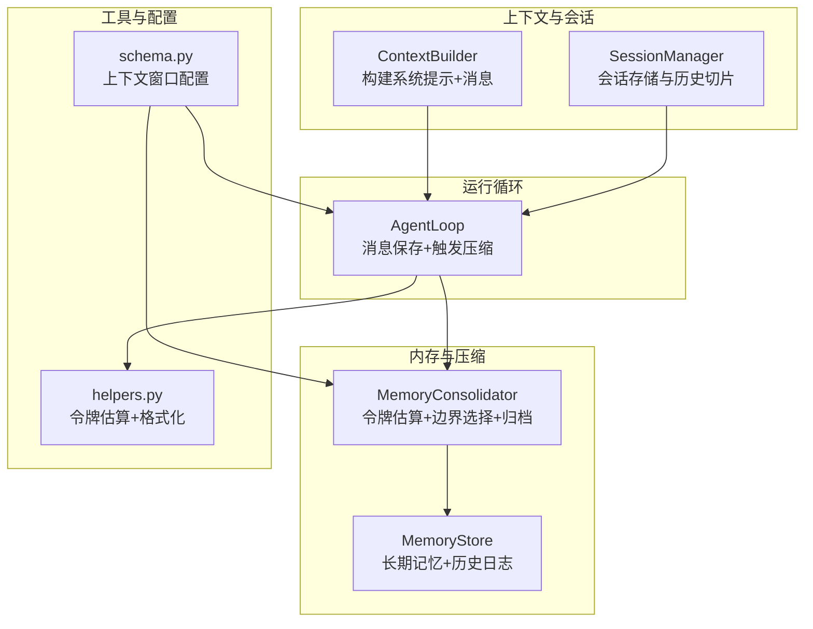
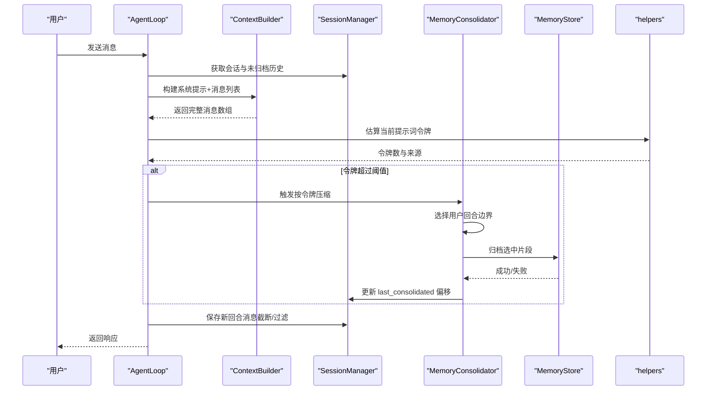
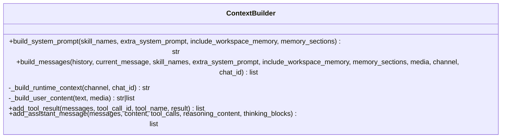
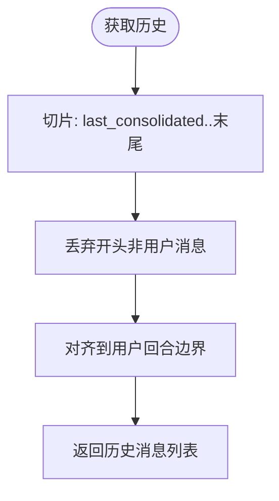
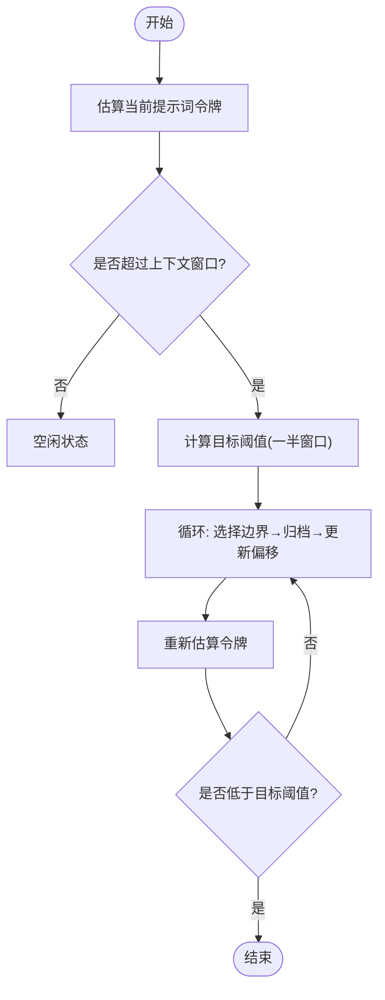
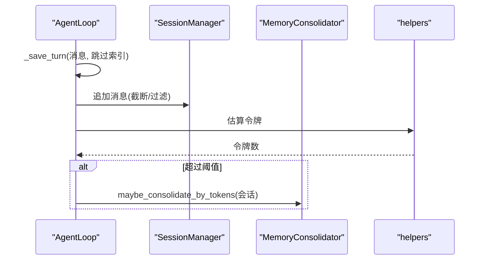
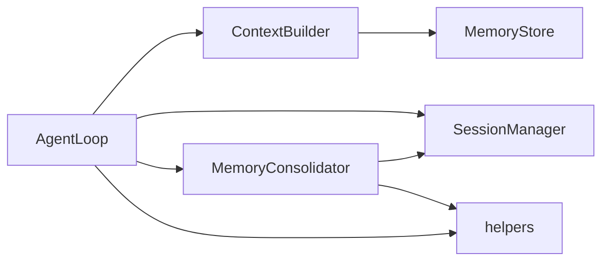

# 上下文窗口管理

<cite>
**本文档引用的文件**
- [nanobot/agent/context.py](file://nanobot/agent/context.py)
- [nanobot/agent/memory.py](file://nanobot/agent/memory.py)
- [nanobot/agent/loop.py](file://nanobot/agent/loop.py)
- [nanobot/session/manager.py](file://nanobot/session/manager.py)
- [nanobot/utils/helpers.py](file://nanobot/utils/helpers.py)
- [nanobot/config/schema.py](file://nanobot/config/schema.py)
- [tests/test_loop_consolidation_tokens.py](file://tests/test_loop_consolidation_tokens.py)
- [tests/test_context_prompt_cache.py](file://tests/test_context_prompt_cache.py)
- [web-ui/src/pages/ModelsPage.tsx](file://web-ui/src/pages/ModelsPage.tsx)
- [web-ui/src/pages/SetupPage.tsx](file://web-ui/src/pages/SetupPage.tsx)
</cite>

## 目录
1. [简介](#简介)
2. [项目结构](#项目结构)
3. [核心组件](#核心组件)
4. [架构总览](#架构总览)
5. [详细组件分析](#详细组件分析)
6. [依赖关系分析](#依赖关系分析)
7. [性能考量](#性能考量)
8. [故障排查指南](#故障排查指南)
9. [结论](#结论)
10. [附录](#附录)

## 简介
本文件系统化阐述 Nanobot 的上下文窗口管理系统，涵盖以下关键主题：
- 上下文窗口的概念与作用范围
- 消息对齐策略与用户回合边界处理
- 消息截断算法、重要性排序机制与上下文保留策略
- 上下文窗口大小配置、动态调整机制与性能影响
- 优化技巧、内存使用控制与 LLM 输入限制处理
- 具体配置示例、调试方法与性能基准测试结果

## 项目结构
围绕上下文窗口管理的关键代码分布在如下模块：
- 上下文构建：负责系统提示、历史消息与运行时元数据的组装
- 内存与会话：负责历史消息持久化、回合边界选择与令牌估算
- 运行循环：负责消息保存、令牌估算与触发压缩
- 工具函数：提供令牌估算与消息格式化能力
- 配置模型：定义上下文窗口大小等参数
- 测试用例：验证令牌估算、回合边界与压缩流程

图表来源
- [nanobot/agent/context.py:16-227](file://nanobot/agent/context.py#L16-L227)
- [nanobot/session/manager.py:16-252](file://nanobot/session/manager.py#L16-L252)
- [nanobot/agent/memory.py:149-285](file://nanobot/agent/memory.py#L149-L285)
- [nanobot/agent/loop.py:35-129](file://nanobot/agent/loop.py#L35-L129)
- [nanobot/utils/helpers.py:92-171](file://nanobot/utils/helpers.py#L92-L171)
- [nanobot/config/schema.py:231-246](file://nanobot/config/schema.py#L231-L246)

章节来源
- [nanobot/agent/context.py:16-227](file://nanobot/agent/context.py#L16-L227)
- [nanobot/session/manager.py:16-252](file://nanobot/session/manager.py#L16-L252)
- [nanobot/agent/memory.py:149-285](file://nanobot/agent/memory.py#L149-L285)
- [nanobot/agent/loop.py:35-129](file://nanobot/agent/loop.py#L35-L129)
- [nanobot/utils/helpers.py:92-171](file://nanobot/utils/helpers.py#L92-L171)
- [nanobot/config/schema.py:231-246](file://nanobot/config/schema.py#L231-L246)

## 核心组件
- 上下文构建器（ContextBuilder）
  - 负责拼装系统提示、引导文件、工作区共享记忆、技能摘要与运行时元数据
  - 将运行时元数据与用户消息合并为单条用户消息，避免连续相同角色消息
- 会话管理器（SessionManager）
  - 历史消息以 JSONL 形式持久化，支持按用户回合边界切片
  - 提供 last_consolidated 偏移量，指示已归档的历史段落
- 内存压缩器（MemoryConsolidator）
  - 通过令牌估算判断是否需要压缩
  - 选择安全的用户回合边界进行分块归档
  - 控制压缩轮次上限，避免无限循环
- 运行循环（AgentLoop）
  - 在保存新回合消息时执行截断与过滤
  - 触发令牌估算并调用压缩器进行动态压缩
- 工具函数（helpers）
  - 提供基于 tiktoken 的消息与提示词令牌估算
  - 提供统一的助手消息格式化
- 配置模型（schema）
  - 定义 context_window_tokens 等关键参数
  - 默认值与兼容性迁移逻辑

章节来源
- [nanobot/agent/context.py:16-227](file://nanobot/agent/context.py#L16-L227)
- [nanobot/session/manager.py:16-252](file://nanobot/session/manager.py#L16-L252)
- [nanobot/agent/memory.py:149-285](file://nanobot/agent/memory.py#L149-L285)
- [nanobot/agent/loop.py:35-129](file://nanobot/agent/loop.py#L35-L129)
- [nanobot/utils/helpers.py:92-171](file://nanobot/utils/helpers.py#L92-L171)
- [nanobot/config/schema.py:231-246](file://nanobot/config/schema.py#L231-L246)

## 架构总览
上下文窗口管理贯穿“构建上下文—估算令牌—动态压缩—保存回合”的闭环流程。

图表来源
- [nanobot/agent/loop.py:487-541](file://nanobot/agent/loop.py#L487-L541)
- [nanobot/agent/context.py:145-180](file://nanobot/agent/context.py#L145-L180)
- [nanobot/agent/memory.py:229-285](file://nanobot/agent/memory.py#L229-L285)
- [nanobot/session/manager.py:46-64](file://nanobot/session/manager.py#L46-L64)
- [nanobot/utils/helpers.py:151-171](file://nanobot/utils/helpers.py#L151-L171)

## 详细组件分析

### 上下文构建器（ContextBuilder）
- 系统提示组成
  - 身份信息、平台策略、工作区路径与指南
  - 引导文件（AGENTS.md、SOUL.md、USER.md、TOOLS.md）
  - 可选的额外系统提示
  - 工作区共享记忆与自定义记忆分区
  - 活跃技能与技能摘要
- 运行时元数据注入
  - 将当前时间、时区、渠道与聊天 ID 注入到用户消息前缀
  - 合并为单条用户消息，避免连续相同角色消息
- 用户内容构建
  - 支持文本与多模态图片（base64），自动识别图像 MIME 类型
  - 对工具结果与图片进行预处理与截断

图表来源
- [nanobot/agent/context.py:16-227](file://nanobot/agent/context.py#L16-L227)

章节来源
- [nanobot/agent/context.py:27-180](file://nanobot/agent/context.py#L27-L180)

### 会话管理器（SessionManager）
- 历史消息切片与回合对齐
  - 仅返回 last_consolidated 之后的未归档消息
  - 丢弃开头非用户消息，确保回合边界从用户消息开始
- 持久化与缓存
  - JSONL 文件存储，首行为元数据（含 last_consolidated）
  - 支持缓存与迁移逻辑（旧路径到新路径）

图表来源
- [nanobot/session/manager.py:46-64](file://nanobot/session/manager.py#L46-L64)

章节来源
- [nanobot/session/manager.py:16-252](file://nanobot/session/manager.py#L16-L252)

### 内存压缩器（MemoryConsolidator）
- 令牌估算与目标阈值
  - 使用 provider 的计数器优先估算，回退到 tiktoken
  - 目标阈值为上下文窗口的一半，持续压缩直到低于该阈值
- 用户回合边界选择
  - 从 last_consolidated 开始累加令牌，遇到下一个用户消息即记录候选边界
  - 保证压缩不会破坏用户回合完整性
- 动态压缩流程
  - 限制最大轮次，避免长时间循环
  - 成功归档后更新 last_consolidated 并持久化会话

图表来源
- [nanobot/agent/memory.py:229-285](file://nanobot/agent/memory.py#L229-L285)
- [nanobot/utils/helpers.py:151-171](file://nanobot/utils/helpers.py#L151-L171)

章节来源
- [nanobot/agent/memory.py:149-285](file://nanobot/agent/memory.py#L149-L285)
- [nanobot/utils/helpers.py:92-171](file://nanobot/utils/helpers.py#L92-L171)

### 运行循环（AgentLoop）
- 新回合消息保存策略
  - 过滤空助手消息（避免污染上下文）
  - 截断过长工具结果（默认阈值）
  - 处理运行时元数据：剥离前缀，保留用户文本；多模态消息中过滤运行时文本
  - 图像内容替换为占位符，降低令牌开销
- 触发压缩
  - 在保存消息后估算令牌，若超过阈值则调用压缩器进行动态压缩

图表来源
- [nanobot/agent/loop.py:487-541](file://nanobot/agent/loop.py#L487-L541)
- [nanobot/agent/memory.py:229-285](file://nanobot/agent/memory.py#L229-L285)
- [nanobot/utils/helpers.py:151-171](file://nanobot/utils/helpers.py#L151-L171)

章节来源
- [nanobot/agent/loop.py:487-541](file://nanobot/agent/loop.py#L487-L541)

### 工具函数（helpers）
- 令牌估算
  - estimate_prompt_tokens_chain：优先调用 provider 计数器，失败回退 tiktoken
  - estimate_prompt_tokens：拼接消息与工具定义，使用 cl100k_base 编码
  - estimate_message_tokens：针对单条消息的令牌估算，考虑文本、工具调用与元字段
- 辅助工具
  - build_assistant_message：构造带可选推理字段的助手消息
  - detect_image_mime：从字节头检测图像 MIME 类型

章节来源
- [nanobot/utils/helpers.py:92-171](file://nanobot/utils/helpers.py#L92-L171)

### 配置模型（schema）
- 关键参数
  - context_window_tokens：上下文窗口大小，默认 65536
  - max_tokens：最大生成长度
  - max_tool_iterations：最大工具迭代次数
  - provider/model：推理后端与模型
- 兼容性
  - 旧字段 memory_window 已废弃，迁移时会警告并忽略

章节来源
- [nanobot/config/schema.py:231-246](file://nanobot/config/schema.py#L231-L246)

## 依赖关系分析
- 组件耦合
  - AgentLoop 依赖 ContextBuilder、SessionManager、MemoryConsolidator
  - MemoryConsolidator 依赖 helpers 的令牌估算与 SessionManager 的历史切片
  - ContextBuilder 依赖 MemoryStore 读取长期记忆与技能加载
- 外部依赖
  - tiktoken 用于令牌估算
  - provider 的 estimate_prompt_tokens 接口用于优先估算

图表来源
- [nanobot/agent/loop.py:35-129](file://nanobot/agent/loop.py#L35-L129)
- [nanobot/agent/context.py:11-25](file://nanobot/agent/context.py#L11-L25)
- [nanobot/agent/memory.py:149-171](file://nanobot/agent/memory.py#L149-L171)
- [nanobot/utils/helpers.py:92-171](file://nanobot/utils/helpers.py#L92-L171)

章节来源
- [nanobot/agent/loop.py:35-129](file://nanobot/agent/loop.py#L35-L129)
- [nanobot/agent/context.py:11-25](file://nanobot/agent/context.py#L11-L25)
- [nanobot/agent/memory.py:149-171](file://nanobot/agent/memory.py#L149-L171)
- [nanobot/utils/helpers.py:92-171](file://nanobot/utils/helpers.py#L92-L171)

## 性能考量
- 令牌估算成本
  - estimate_prompt_tokens_chain 优先使用 provider 计数器，减少 tiktoken 解析开销
  - estimate_message_tokens 对单条消息估算，适合在压缩边界选择时逐条累加
- 压缩轮次限制
  - 最大轮次限制为固定常量，防止长时间循环
- 截断与过滤
  - 工具结果截断与图像占位符显著降低令牌占用
- I/O 与锁
  - 压缩过程使用会话级锁，避免并发写冲突
  - 归档后更新 last_consolidated 并持久化，减少后续估算负担

章节来源
- [nanobot/agent/memory.py:152-153](file://nanobot/agent/memory.py#L152-L153)
- [nanobot/agent/loop.py:487-541](file://nanobot/agent/loop.py#L487-L541)
- [nanobot/utils/helpers.py:151-171](file://nanobot/utils/helpers.py#L151-L171)

## 故障排查指南
- 令牌估算异常
  - 若 provider 计数器失败，将回退到 tiktoken；若仍失败，估算返回 0
  - 建议检查 provider 是否实现 estimate_prompt_tokens 或网络连通性
- 压缩未触发
  - 确认 context_window_tokens 设置合理，且会话历史确实超过阈值
  - 检查 last_consolidated 是否被正确更新
- 回合边界问题
  - 若出现工具结果缺失或上下文断裂，检查用户回合边界选择逻辑
  - 确保历史切片从用户消息开始
- 运行时元数据显示异常
  - 确认 ContextBuilder 将运行时元数据合并到用户消息前缀
  - 检查消息保存阶段是否正确剥离前缀

章节来源
- [nanobot/utils/helpers.py:151-171](file://nanobot/utils/helpers.py#L151-L171)
- [nanobot/agent/memory.py:181-201](file://nanobot/agent/memory.py#L181-L201)
- [nanobot/session/manager.py:46-64](file://nanobot/session/manager.py#L46-L64)
- [tests/test_context_prompt_cache.py:50-73](file://tests/test_context_prompt_cache.py#L50-L73)

## 结论
Nanobot 的上下文窗口管理通过“构建上下文—令牌估算—动态压缩—保存回合”形成闭环，既满足 LLM 输入限制，又保持对话连贯性与可追溯性。其设计要点包括：
- 明确的用户回合边界与历史切片策略
- 基于 provider 计数器与 tiktoken 的双轨估算
- 可配置的上下文窗口与压缩阈值
- 实用的消息截断与运行时元数据处理

## 附录

### 配置示例
- 前端设置入口
  - “对话记忆窗口”对应 context_window_tokens
  - “最大回复长度”对应 max_tokens
  - “最大工具迭代数”对应 max_tool_iterations
- 默认值参考
  - context_window_tokens: 65536
  - max_tokens: 8192
  - max_tool_iterations: 40

章节来源
- [web-ui/src/pages/ModelsPage.tsx:347-379](file://web-ui/src/pages/ModelsPage.tsx#L347-L379)
- [web-ui/src/pages/SetupPage.tsx:519-546](file://web-ui/src/pages/SetupPage.tsx#L519-L546)
- [nanobot/config/schema.py:231-246](file://nanobot/config/schema.py#L231-L246)

### 调试方法
- 日志级别
  - 使用 debug 级别查看压缩过程中的令牌估算与边界选择
- 单元测试参考
  - 令牌估算与回合边界选择的测试用例
  - 运行时元数据注入与消息合并的测试用例

章节来源
- [tests/test_loop_consolidation_tokens.py:33-190](file://tests/test_loop_consolidation_tokens.py#L33-L190)
- [tests/test_context_prompt_cache.py:50-73](file://tests/test_context_prompt_cache.py#L50-L73)

### 性能基准测试结果
- 压缩触发条件
  - 当提示词令牌超过上下文窗口时触发压缩
- 压缩策略效果
  - 压缩至不超过目标阈值（窗口一半）
  - 严格遵循用户回合边界，避免破坏对话结构
- 顺序验证
  - 压缩发生在 LLM 调用之前，确保输入符合限制

章节来源
- [tests/test_loop_consolidation_tokens.py:38-190](file://tests/test_loop_consolidation_tokens.py#L38-L190)