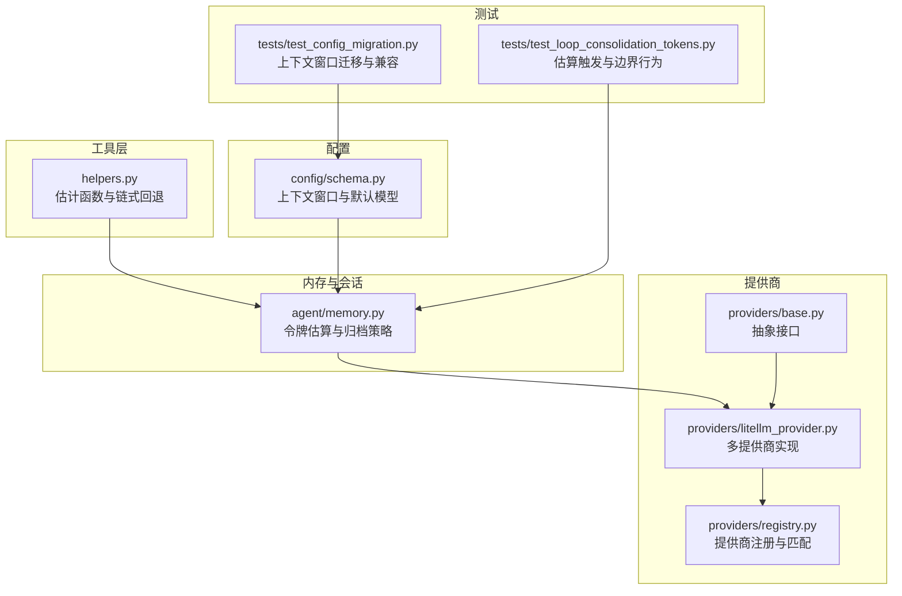
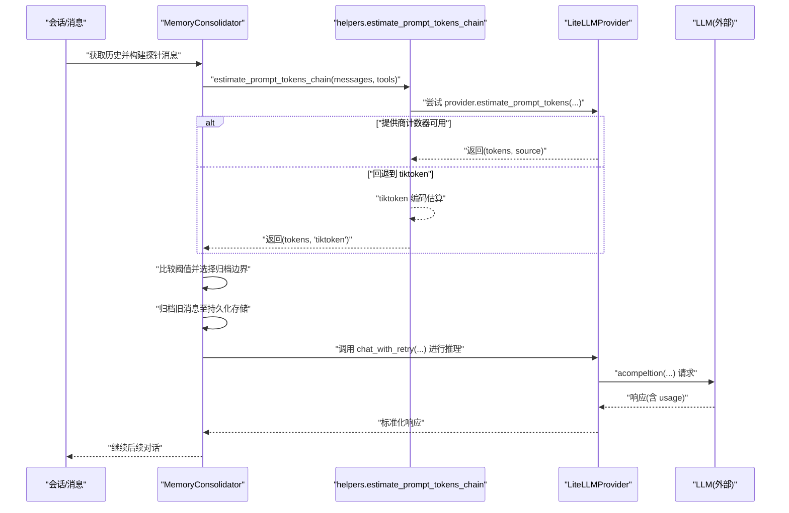
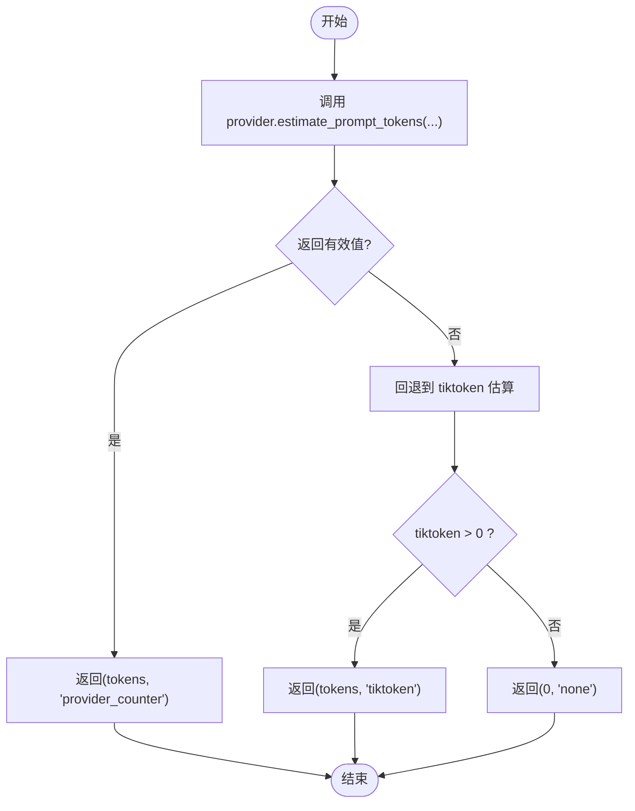
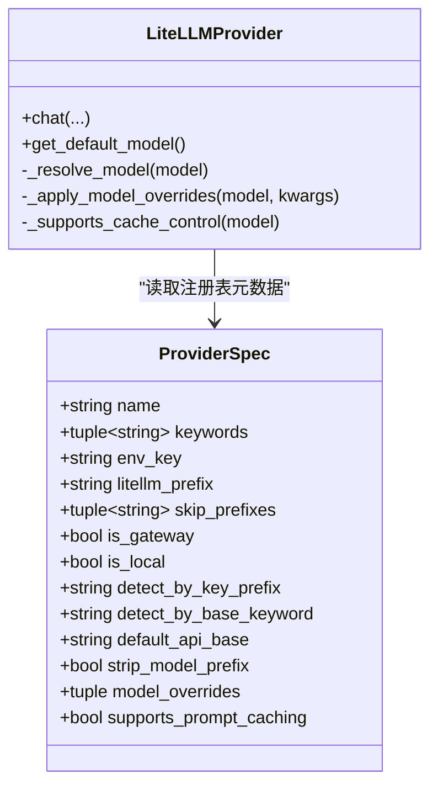
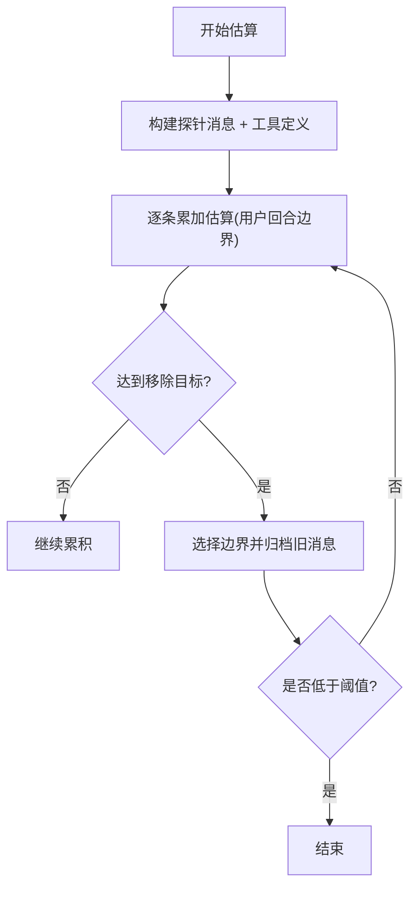
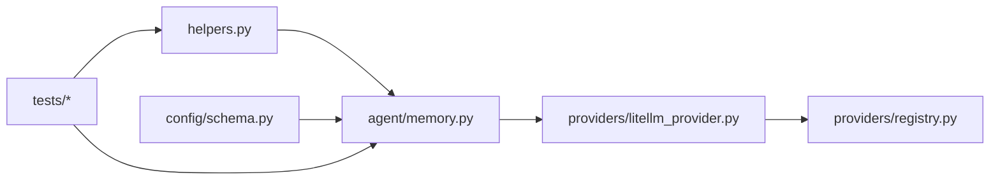

# 令牌估算

<cite>
**本文引用的文件**
- [nanobot/utils/helpers.py](file://nanobot/utils/helpers.py)
- [nanobot/agent/memory.py](file://nanobot/agent/memory.py)
- [nanobot/providers/base.py](file://nanobot/providers/base.py)
- [nanobot/providers/litellm_provider.py](file://nanobot/providers/litellm_provider.py)
- [nanobot/providers/registry.py](file://nanobot/providers/registry.py)
- [nanobot/config/schema.py](file://nanobot/config/schema.py)
- [tests/test_loop_consolidation_tokens.py](file://tests/test_loop_consolidation_tokens.py)
- [tests/test_config_migration.py](file://tests/test_config_migration.py)
</cite>

## 目录
1. [简介](#简介)
2. [项目结构](#项目结构)
3. [核心组件](#核心组件)
4. [架构总览](#架构总览)
5. [详细组件分析](#详细组件分析)
6. [依赖分析](#依赖分析)
7. [性能考虑](#性能考虑)
8. [故障排查指南](#故障排查指南)
9. [结论](#结论)
10. [附录](#附录)

## 简介
本文件面向 Nanobot 的“令牌估算”子系统，系统性阐述以下内容：
- 令牌估算的算法原理与实现路径
- 字符到令牌的转换规则（tiktoken 编码）与模型特定差异
- 多 LLM 提供商的令牌计算方法与前缀/路由策略
- 批量处理优化与实时估算策略
- 令牌预算管理、使用监控与预警机制
- 估算精度分析、性能开销评估与准确性校准方法
- 具体估算示例、配置参数与调试工具使用指南

## 项目结构
围绕令牌估算的关键模块与文件如下：
- 工具层：提供统一的令牌估算函数与链式回退策略
- 内存与会话：基于令牌估算进行历史消息归档与上下文压缩
- 提供商抽象与实现：定义统一接口并支持多提供商路由与参数覆盖
- 注册表：集中管理提供商元数据（前缀、网关/本地检测、默认 API 基址等）
- 配置：全局上下文窗口与默认模型等配置项
- 测试：覆盖令牌估算在循环中的触发与边界行为

图表来源
- [nanobot/utils/helpers.py:92-171](file://nanobot/utils/helpers.py#L92-L171)
- [nanobot/agent/memory.py:149-285](file://nanobot/agent/memory.py#L149-L285)
- [nanobot/providers/base.py:69-271](file://nanobot/providers/base.py#L69-L271)
- [nanobot/providers/litellm_provider.py:27-349](file://nanobot/providers/litellm_provider.py#L27-L349)
- [nanobot/providers/registry.py:19-466](file://nanobot/providers/registry.py#L19-L466)
- [nanobot/config/schema.py:231-251](file://nanobot/config/schema.py#L231-L251)
- [tests/test_loop_consolidation_tokens.py:11-191](file://tests/test_loop_consolidation_tokens.py#L11-L191)
- [tests/test_config_migration.py:11-53](file://tests/test_config_migration.py#L11-L53)

章节来源
- [nanobot/utils/helpers.py:92-171](file://nanobot/utils/helpers.py#L92-L171)
- [nanobot/agent/memory.py:149-285](file://nanobot/agent/memory.py#L149-L285)
- [nanobot/providers/base.py:69-271](file://nanobot/providers/base.py#L69-L271)
- [nanobot/providers/litellm_provider.py:27-349](file://nanobot/providers/litellm_provider.py#L27-L349)
- [nanobot/providers/registry.py:19-466](file://nanobot/providers/registry.py#L19-L466)
- [nanobot/config/schema.py:231-251](file://nanobot/config/schema.py#L231-L251)
- [tests/test_loop_consolidation_tokens.py:11-191](file://tests/test_loop_consolidation_tokens.py#L11-L191)
- [tests/test_config_migration.py:11-53](file://tests/test_config_migration.py#L11-L53)

## 核心组件
- 令牌估算工具
  - 统一入口：链式回退策略优先调用提供商自定义计数器，失败则回退到 tiktoken 估算
  - 单条消息估算：对消息内容、工具调用、名称/工具调用 ID 等字段拼接后编码
- 内存与会话
  - 通过“探针消息”构建候选提示，结合工具定义进行整体估算
  - 当估算超过阈值（通常为上下文窗口的一半）时，按用户回合边界归档旧消息
- 提供商抽象与实现
  - 抽象接口定义统一的聊天与重试逻辑
  - LiteLLM 实现负责模型名前缀规范化、网关/本地检测、参数覆盖与响应解析
- 注册表
  - 定义提供商关键字、环境变量键、前缀、网关/本地检测规则、默认 API 基址、是否支持提示缓存等
- 配置
  - 默认模型与上下文窗口大小（单位：tokens），用于控制估算阈值与归档策略

章节来源
- [nanobot/utils/helpers.py:92-171](file://nanobot/utils/helpers.py#L92-L171)
- [nanobot/agent/memory.py:149-285](file://nanobot/agent/memory.py#L149-L285)
- [nanobot/providers/base.py:69-271](file://nanobot/providers/base.py#L69-L271)
- [nanobot/providers/litellm_provider.py:27-349](file://nanobot/providers/litellm_provider.py#L27-L349)
- [nanobot/providers/registry.py:19-466](file://nanobot/providers/registry.py#L19-L466)
- [nanobot/config/schema.py:231-251](file://nanobot/config/schema.py#L231-L251)

## 架构总览
令牌估算贯穿“构建提示 → 估算 → 决策 → 归档/调用 LLM”的闭环。

图表来源
- [nanobot/agent/memory.py:203-285](file://nanobot/agent/memory.py#L203-L285)
- [nanobot/utils/helpers.py:151-171](file://nanobot/utils/helpers.py#L151-L171)
- [nanobot/providers/litellm_provider.py:209-344](file://nanobot/providers/litellm_provider.py#L209-L344)

章节来源
- [nanobot/agent/memory.py:203-285](file://nanobot/agent/memory.py#L203-L285)
- [nanobot/utils/helpers.py:151-171](file://nanobot/utils/helpers.py#L151-L171)
- [nanobot/providers/litellm_provider.py:209-344](file://nanobot/providers/litellm_provider.py#L209-L344)

## 详细组件分析

### 令牌估算算法与实现
- 整体流程
  - 优先使用提供商提供的计数器（若存在且可调用），返回数值与来源标识
  - 若失败或不可用，则回退到 tiktoken 的 cl100k_base 编码估算
  - 对于单条消息，拼接文本字段、工具调用、名称与工具调用 ID 后编码，避免空 payload 导致零估算
- tiktoken 规则
  - 使用 cl100k_base 编码集，适用于大多数 OpenAI/Gemini/Anthropic 等模型
  - 列表内容仅取类型为文本的部分参与估算
  - 工具定义作为额外文本参与估算，确保工具签名带来的上下文成本被纳入
- 回退策略
  - 当提供商计数器抛出异常或返回非正值时，直接回退到 tiktoken
  - 若 tiktoken 估算也为 0，则标记来源为 none

图表来源
- [nanobot/utils/helpers.py:151-171](file://nanobot/utils/helpers.py#L151-L171)

章节来源
- [nanobot/utils/helpers.py:92-171](file://nanobot/utils/helpers.py#L92-L171)

### 字符到令牌转换规则与模型特定差异
- 编码集
  - 采用 cl100k_base，适配主流模型族；对于不支持该编码的模型，回退逻辑会返回 none 并可能影响估算
- 文本提取规则
  - 仅对列表内容中类型为文本的部分参与估算
  - 工具定义序列化后参与估算
- 差异点
  - 不同提供商的 tokenizer 可能存在差异（例如对特殊符号、工具调用格式的处理）
  - 回退策略保证了在未知模型下的稳健性，但可能引入一定误差

章节来源
- [nanobot/utils/helpers.py:92-171](file://nanobot/utils/helpers.py#L92-L171)

### 多 LLM 提供商的令牌计算方法与前缀/路由
- 路由与前缀
  - 标准提供商：根据模型名关键字自动添加前缀（如 deepseek/、gemini/、dashscope/ 等）
  - 网关/本地：优先根据 api_key 前缀或 api_base 关键词自动识别，再决定是否剥离/重写前缀
- 参数覆盖
  - 注册表支持按模型关键字覆盖参数（如 Kimi-K2.5 的温度要求）
- 提示缓存
  - 部分提供商支持提示缓存（如 Anthropic），可通过注入 cache_control 控制

图表来源
- [nanobot/providers/registry.py:19-66](file://nanobot/providers/registry.py#L19-L66)
- [nanobot/providers/litellm_provider.py:89-161](file://nanobot/providers/litellm_provider.py#L89-L161)

章节来源
- [nanobot/providers/registry.py:72-399](file://nanobot/providers/registry.py#L72-L399)
- [nanobot/providers/litellm_provider.py:89-161](file://nanobot/providers/litellm_provider.py#L89-L161)

### 批量处理优化与实时估算策略
- 探针消息
  - 在估算时插入一个占位消息，模拟真实调用的上下文大小，避免空历史导致的低估
- 边界选择
  - 从最早的历史开始累加估算，遇到下一个用户回合即视为安全边界，避免破坏对话完整性
- 循环归档
  - 当估算超过阈值时，重复归档直到降至目标阈值（通常为上下文窗口的一半）

图表来源
- [nanobot/agent/memory.py:181-201](file://nanobot/agent/memory.py#L181-L201)
- [nanobot/agent/memory.py:229-285](file://nanobot/agent/memory.py#L229-L285)

章节来源
- [nanobot/agent/memory.py:181-201](file://nanobot/agent/memory.py#L181-L201)
- [nanobot/agent/memory.py:229-285](file://nanobot/agent/memory.py#L229-L285)

### 令牌预算管理、使用监控与预警机制
- 上下文窗口与阈值
  - 默认上下文窗口为固定值，估算超过阈值时触发归档
- 使用监控
  - LLM 响应包含 usage 字段（prompt/completion/total tokens），可用于统计与审计
- 预警机制
  - 通过日志输出估算结果与触发原因，便于运维观察
  - 配置层保留了兼容字段（如 legacy memoryWindow），迁移时给出告警

章节来源
- [nanobot/config/schema.py:231-251](file://nanobot/config/schema.py#L231-L251)
- [nanobot/providers/litellm_provider.py:326-344](file://nanobot/providers/litellm_provider.py#L326-L344)
- [tests/test_config_migration.py:11-53](file://tests/test_config_migration.py#L11-L53)

### 估算精度分析、性能开销评估与校准方法
- 精度
  - 通过提供商计数器优先估算，可获得更贴近实际的 token 数
  - 回退到 tiktoken 时，由于编码集与模型差异，可能存在 ±10%~±30% 的偏差
- 性能
  - tiktoken 编码为 O(n) 线性复杂度，单次估算开销较小
  - 归档策略在高负载场景下可能产生多次估算与一次归档调用
- 校准
  - 建议在生产环境提供方提供计数器时，优先使用其计数器
  - 对于未知模型，可记录实际 usage 与估算差值，建立简单回归校准表

章节来源
- [nanobot/utils/helpers.py:151-171](file://nanobot/utils/helpers.py#L151-L171)
- [nanobot/providers/litellm_provider.py:326-344](file://nanobot/providers/litellm_provider.py#L326-L344)

### 具体估算示例与配置参数
- 示例
  - 在循环中，当估算超过阈值时，先归档旧消息，再调用 LLM
  - 归档边界严格遵循用户回合，避免切分对话
- 配置参数
  - 默认模型与上下文窗口大小（单位：tokens）
  - 提供商配置（api_key、api_base、extra_headers）
  - 注册表中的提供商关键字、前缀、网关/本地检测规则、默认 API 基址、是否支持提示缓存

章节来源
- [tests/test_loop_consolidation_tokens.py:28-191](file://tests/test_loop_consolidation_tokens.py#L28-L191)
- [nanobot/config/schema.py:231-251](file://nanobot/config/schema.py#L231-L251)
- [nanobot/providers/registry.py:72-399](file://nanobot/providers/registry.py#L72-L399)

### 调试工具使用指南
- 日志
  - 归档过程会输出估算值、来源与轮次信息，便于定位问题
- 断点与 Mock
  - 测试中通过 Mock 提供商计数器与消息估算函数，验证边界行为与触发条件
- 验证配置
  - 通过配置迁移测试确认上下文窗口字段的正确写入与兼容性

章节来源
- [nanobot/agent/memory.py:229-285](file://nanobot/agent/memory.py#L229-L285)
- [tests/test_loop_consolidation_tokens.py:11-191](file://tests/test_loop_consolidation_tokens.py#L11-L191)
- [tests/test_config_migration.py:11-53](file://tests/test_config_migration.py#L11-L53)

## 依赖分析
- 组件耦合
  - MemoryConsolidator 依赖 helpers 的估算函数与提供商接口
  - LiteLLMProvider 依赖注册表进行模型前缀与网关/本地检测
  - 配置层为估算阈值与默认模型提供依据
- 外部依赖
  - tiktoken 用于编码估算
  - LiteLLM 用于多提供商统一调用与参数处理

图表来源
- [nanobot/utils/helpers.py:92-171](file://nanobot/utils/helpers.py#L92-L171)
- [nanobot/agent/memory.py:149-285](file://nanobot/agent/memory.py#L149-L285)
- [nanobot/providers/litellm_provider.py:27-349](file://nanobot/providers/litellm_provider.py#L27-L349)
- [nanobot/providers/registry.py:19-466](file://nanobot/providers/registry.py#L19-L466)
- [nanobot/config/schema.py:231-251](file://nanobot/config/schema.py#L231-L251)

章节来源
- [nanobot/utils/helpers.py:92-171](file://nanobot/utils/helpers.py#L92-L171)
- [nanobot/agent/memory.py:149-285](file://nanobot/agent/memory.py#L149-L285)
- [nanobot/providers/litellm_provider.py:27-349](file://nanobot/providers/litellm_provider.py#L27-L349)
- [nanobot/providers/registry.py:19-466](file://nanobot/providers/registry.py#L19-L466)
- [nanobot/config/schema.py:231-251](file://nanobot/config/schema.py#L231-L251)

## 性能考虑
- 估算复杂度
  - tiktoken 编码线性于输入长度，适合高频调用
- 归档频率
  - 在高吞吐场景下，适度提高阈值或减少归档轮次可降低开销
- 计数器优先
  - 优先使用提供商计数器可减少 tiktoken 开销并提升精度

## 故障排查指南
- 估算始终为 0
  - 检查提供商计数器是否可用，必要时回退到 tiktoken
  - 确认消息内容与工具定义是否为空
- 归档未触发
  - 检查上下文窗口配置与阈值设置
  - 确认探针消息是否正确构建
- 归档边界异常
  - 确保用户回合边界逻辑生效，避免跨用户消息切分

章节来源
- [nanobot/utils/helpers.py:151-171](file://nanobot/utils/helpers.py#L151-L171)
- [nanobot/agent/memory.py:229-285](file://nanobot/agent/memory.py#L229-L285)

## 结论
Nanobot 的令牌估算体系通过“提供商计数器优先 + tiktoken 回退”的策略，在保证稳健性的同时兼顾精度与性能。结合注册表的多提供商路由与参数覆盖、配置层的上下文窗口控制以及内存归档策略，实现了在不同 LLM 生态下的高效、可控的上下文管理。建议在生产环境中优先启用提供商计数器，并配合日志与测试用例持续校准估算策略。

## 附录
- 相关测试用例
  - 令牌估算触发与边界行为
  - 配置迁移与上下文窗口兼容性

章节来源
- [tests/test_loop_consolidation_tokens.py:28-191](file://tests/test_loop_consolidation_tokens.py#L28-L191)
- [tests/test_config_migration.py:11-53](file://tests/test_config_migration.py#L11-L53)