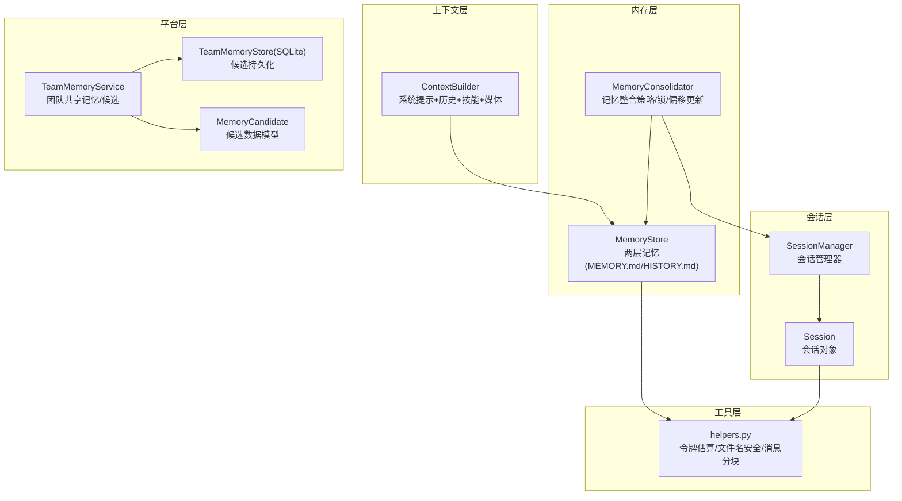
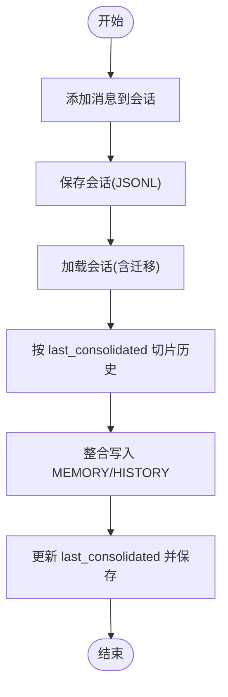
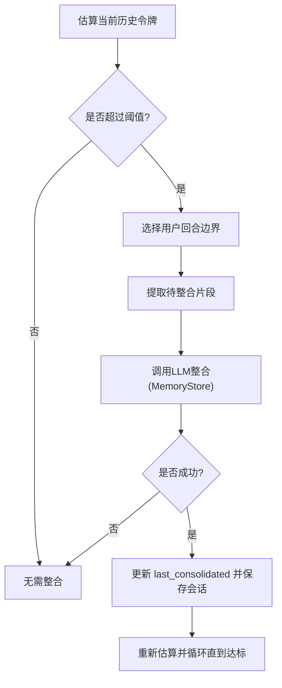
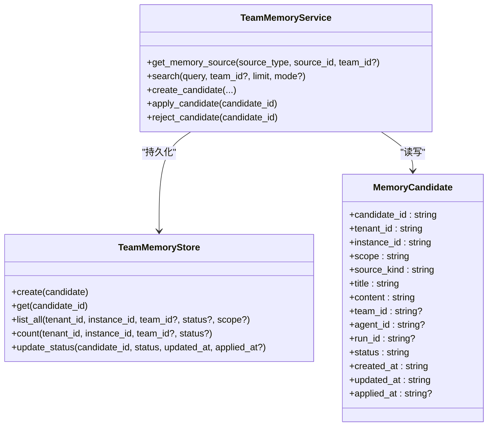
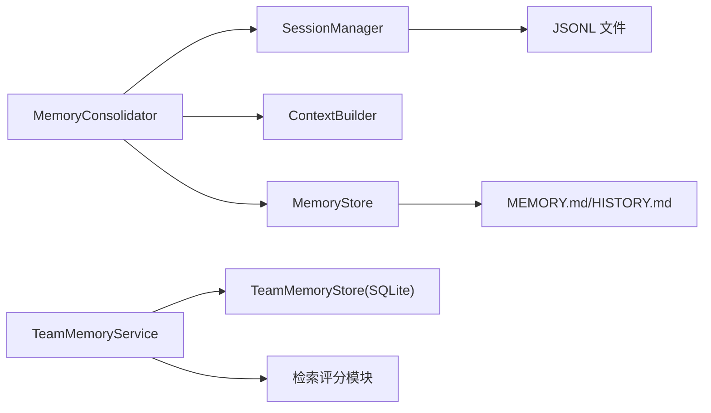

# 会话与内存

<cite>
**本文引用的文件**
- [nanobot/session/manager.py](file://nanobot/session/manager.py)
- [nanobot/agent/memory.py](file://nanobot/agent/memory.py)
- [nanobot/agent/context.py](file://nanobot/agent/context.py)
- [nanobot/agent/loop.py](file://nanobot/agent/loop.py)
- [nanobot/platform/memory/service.py](file://nanobot/platform/memory/service.py)
- [nanobot/platform/memory/store.py](file://nanobot/platform/memory/store.py)
- [nanobot/platform/memory/models.py](file://nanobot/platform/memory/models.py)
- [nanobot/utils/helpers.py](file://nanobot/utils/helpers.py)
- [memory/MEMORY.md](file://memory/MEMORY.md)
- [nanobot/templates/memory/MEMORY.md](file://nanobot/templates/memory/MEMORY.md)
- [tests/test_loop_consolidation_tokens.py](file://tests/test_loop_consolidation_tokens.py)
- [nanobot/config/schema.py](file://nanobot/config/schema.py)
</cite>

## 目录
1. [简介](#简介)
2. [项目结构](#项目结构)
3. [核心组件](#核心组件)
4. [架构总览](#架构总览)
5. [详细组件分析](#详细组件分析)
6. [依赖关系分析](#依赖关系分析)
7. [性能考量](#性能考量)
8. [故障排查指南](#故障排查指南)
9. [结论](#结论)
10. [附录](#附录)

## 简介
本技术文档聚焦 Nanobot 的“会话与内存”系统，涵盖会话管理机制、内存整合策略、上下文窗口管理、令牌估算机制、内存压缩与存储优化、会话状态的持久化/恢复/清理、内存使用监控与性能优化、资源管理策略、配置示例与调优建议，以及多会话并发处理与状态同步的实现方式。目标是帮助开发者与运维人员快速理解并高效使用该系统。

## 项目结构
围绕会话与内存的关键模块如下：
- 会话层：会话对象与会话管理器负责消息的增删改查、历史切片、磁盘持久化与迁移。
- 内存层：两层记忆（长期 MEMORY.md + 历史 HISTORY.md），通过 LLM 自动整合旧消息，保持上下文可控。
- 上下文层：构建系统提示词、合并历史与技能、媒体内容注入等。
- 平台层：团队共享记忆与候选更新，支持搜索、候选创建与应用。
- 工具层：令牌估算、文件安全命名、消息分块等通用能力。



图表来源
- [nanobot/session/manager.py:16-252](file://nanobot/session/manager.py#L16-L252)
- [nanobot/agent/memory.py:60-285](file://nanobot/agent/memory.py#L60-L285)
- [nanobot/agent/context.py:16-227](file://nanobot/agent/context.py#L16-L227)
- [nanobot/platform/memory/service.py:31-447](file://nanobot/platform/memory/service.py#L31-L447)
- [nanobot/platform/memory/store.py:12-202](file://nanobot/platform/memory/store.py#L12-L202)
- [nanobot/platform/memory/models.py:14-65](file://nanobot/platform/memory/models.py#L14-L65)
- [nanobot/utils/helpers.py:92-200](file://nanobot/utils/helpers.py#L92-L200)

章节来源
- [nanobot/session/manager.py:16-252](file://nanobot/session/manager.py#L16-L252)
- [nanobot/agent/memory.py:60-285](file://nanobot/agent/memory.py#L60-L285)
- [nanobot/agent/context.py:16-227](file://nanobot/agent/context.py#L16-L227)
- [nanobot/platform/memory/service.py:31-447](file://nanobot/platform/memory/service.py#L31-L447)
- [nanobot/platform/memory/store.py:12-202](file://nanobot/platform/memory/store.py#L12-L202)
- [nanobot/platform/memory/models.py:14-65](file://nanobot/platform/memory/models.py#L14-L65)
- [nanobot/utils/helpers.py:92-200](file://nanobot/utils/helpers.py#L92-L200)

## 核心组件
- 会话对象与管理器
  - 会话对象：维护消息列表、元数据、最后整合偏移、时间戳；提供添加消息、截取历史、清空等操作。
  - 会话管理器：负责加载/保存 JSONL 文件、缓存、迁移旧路径、列出会话、删除会话、更新元数据等。
- 记忆存储与整合器
  - MemoryStore：读写 MEMORY.md 与 HISTORY.md，格式化历史条目，调用 LLM 执行整合。
  - MemoryConsolidator：基于令牌估算选择用户回合边界进行批量整合，带并发锁与轮次限制。
- 上下文构建器
  - 组装系统提示词、合并历史、注入运行时上下文、拼接媒体内容，避免连续相同角色消息。
- 团队共享记忆服务
  - 提供团队共享记忆读写、候选创建/查询/应用/拒绝、来源聚合与检索评分。
- 工具函数
  - 令牌估算（tiktoken 与提供商计数器回退）、消息分块、安全文件名等。

章节来源
- [nanobot/session/manager.py:16-252](file://nanobot/session/manager.py#L16-L252)
- [nanobot/agent/memory.py:60-285](file://nanobot/agent/memory.py#L60-L285)
- [nanobot/agent/context.py:16-227](file://nanobot/agent/context.py#L16-L227)
- [nanobot/platform/memory/service.py:31-447](file://nanobot/platform/memory/service.py#L31-L447)
- [nanobot/utils/helpers.py:92-200](file://nanobot/utils/helpers.py#L92-L200)

## 架构总览
Nanobot 的会话与内存架构以“会话-整合-上下文-输出”为主线，结合“团队共享记忆候选”形成闭环。关键流程包括：
- 会话消息追加与历史切片；
- 整合触发条件（超过阈值）与边界选择；
- LLM 调用整合并写入长期记忆；
- 上下文构建用于后续推理；
- 团队共享记忆与候选管理。

```mermaid
sequenceDiagram
participant User as "用户"
participant Loop as "AgentLoop"
participant Sess as "SessionManager/Session"
participant Cons as "MemoryConsolidator"
participant Store as "MemoryStore"
participant Ctx as "ContextBuilder"
participant LLM as "LLMProvider"
User->>Loop : 发送消息
Loop->>Sess : 获取/创建会话
Loop->>Ctx : 构建系统提示+历史+媒体
Loop->>Cons : 预检：估算令牌是否超阈值
alt 超阈值
Loop->>Cons : 触发整合按用户回合边界
Cons->>Store : 调用LLM整合并写入 MEMORY/HISTORY
Store-->>Cons : 成功/失败
Cons->>Sess : 更新 last_consolidated 偏移并保存
end
Loop->>LLM : 发送消息+上下文
LLM-->>Loop : 返回响应/工具调用
Loop-->>User : 输出结果
```

图表来源
- [nanobot/agent/loop.py:35-200](file://nanobot/agent/loop.py#L35-L200)
- [nanobot/agent/memory.py:149-285](file://nanobot/agent/memory.py#L149-L285)
- [nanobot/agent/context.py:145-227](file://nanobot/agent/context.py#L145-L227)
- [nanobot/session/manager.py:96-252](file://nanobot/session/manager.py#L96-L252)

## 详细组件分析

### 会话管理机制
- 消息模型与历史切片
  - 会话对象以 JSONL 存储，重要约束：消息追加只增不减，整合过程写入 MEMORY/HISTORY，但不修改未整合消息列表或 get_history() 输出。
  - 历史切片会丢弃开头非用户消息，确保工具结果不会被孤立。
- 加载/保存/迁移
  - 支持新旧路径迁移，优先读取新路径；保存时先写入元数据行，再写入消息行。
- 缓存与失效
  - 内存缓存键控会话对象，支持显式失效与元数据合并保存。
- 列表与清理
  - 列出会话时解析元数据行统计消息数量；删除会话同时清理缓存。



图表来源
- [nanobot/session/manager.py:35-190](file://nanobot/session/manager.py#L35-L190)
- [nanobot/agent/memory.py:96-147](file://nanobot/agent/memory.py#L96-L147)

章节来源
- [nanobot/session/manager.py:16-252](file://nanobot/session/manager.py#L16-L252)
- [nanobot/agent/memory.py:96-147](file://nanobot/agent/memory.py#L96-L147)

### 内存整合策略与上下文窗口管理
- 整合触发与边界选择
  - 当前会话历史的预估令牌超过上下文窗口的一半时触发整合；边界选择严格遵循用户回合，避免破坏工具调用链。
- 令牌估算
  - 先尝试提供商提供的计数器，失败则回退到 tiktoken；对单条消息也提供估算，保证整合粒度可控。
- 整合执行
  - 将选中的消息片段交给 LLM，要求其调用 save_memory 工具返回历史摘要与长期记忆更新；若未调用或参数异常则跳过。
- 偏移更新与并发控制
  - 整合成功后更新 last_consolidated，并保存会话；使用弱引用锁按会话键隔离并发。



图表来源
- [nanobot/agent/memory.py:181-285](file://nanobot/agent/memory.py#L181-L285)
- [nanobot/utils/helpers.py:117-171](file://nanobot/utils/helpers.py#L117-L171)

章节来源
- [nanobot/agent/memory.py:149-285](file://nanobot/agent/memory.py#L149-L285)
- [nanobot/utils/helpers.py:117-171](file://nanobot/utils/helpers.py#L117-L171)
- [tests/test_loop_consolidation_tokens.py:38-190](file://tests/test_loop_consolidation_tokens.py#L38-L190)

### 上下文窗口管理与令牌估算
- 上下文构建
  - 系统提示由身份、引导文件、工作区共享记忆、技能摘要等组成；运行时上下文作为“元数据块”注入到用户消息前，避免连续相同角色消息。
- 令牌估算链路
  - 优先使用提供商计数器，失败则使用 tiktoken；对消息内容与工具定义一并估算，确保更准确的窗口占用评估。
- 媒体内容处理
  - 支持图片内容以 base64 方式注入，自动识别真实 MIME 类型。

章节来源
- [nanobot/agent/context.py:16-227](file://nanobot/agent/context.py#L16-L227)
- [nanobot/utils/helpers.py:92-171](file://nanobot/utils/helpers.py#L92-L171)

### 团队共享记忆与候选管理
- 来源聚合
  - 支持工作区共享记忆、团队共享记忆、团队线程、运行产物等多源聚合；搜索时对命中内容做预览与评分。
- 候选生命周期
  - 创建候选 → 查询候选 → 应用候选（写入团队共享记忆）→ 拒绝候选；状态字段与时间戳完整记录。
- 数据模型
  - 候选实体包含租户/实例/作用域/来源类型/标题/内容/关联标识等，便于跨团队共享与审计。



图表来源
- [nanobot/platform/memory/models.py:14-65](file://nanobot/platform/memory/models.py#L14-L65)
- [nanobot/platform/memory/store.py:12-202](file://nanobot/platform/memory/store.py#L12-L202)
- [nanobot/platform/memory/service.py:31-447](file://nanobot/platform/memory/service.py#L31-L447)

章节来源
- [nanobot/platform/memory/service.py:31-447](file://nanobot/platform/memory/service.py#L31-L447)
- [nanobot/platform/memory/store.py:12-202](file://nanobot/platform/memory/store.py#L12-L202)
- [nanobot/platform/memory/models.py:14-65](file://nanobot/platform/memory/models.py#L14-L65)

### 会话状态的持久化、恢复与清理
- 持久化
  - 保存时先写入元数据行（含 key、创建/更新时间、元数据、last_consolidated），再写入每条消息行。
- 恢复
  - 加载时先从新路径读取，不存在则尝试迁移旧路径；解析元数据行后顺序读取消息行。
- 清理
  - 删除会话时同时清理新旧路径与内存缓存；列出会话时可统计消息数量并排序。

章节来源
- [nanobot/session/manager.py:125-190](file://nanobot/session/manager.py#L125-L190)

### 多会话并发处理与状态同步
- 并发隔离
  - 整合器为每个会话键维护一个弱引用锁，避免跨会话干扰；同时限制最大整合轮次，防止长时间阻塞。
- 状态同步
  - 整合成功后立即更新 last_consolidated 并保存会话，确保其他并发请求读取到最新状态。

章节来源
- [nanobot/agent/memory.py:173-176](file://nanobot/agent/memory.py#L173-L176)
- [nanobot/agent/memory.py:250-285](file://nanobot/agent/memory.py#L250-L285)

## 依赖关系分析
- 组件耦合
  - MemoryConsolidator 依赖 SessionManager 以读取/更新 last_consolidated；依赖 ContextBuilder 与工具定义进行令牌估算；依赖 MemoryStore 执行整合。
  - TeamMemoryService 依赖 TeamMemoryStore 进行候选持久化，依赖搜索评分模块进行检索。
- 外部依赖
  - tiktoken 用于令牌估算回退；SQLite 用于候选持久化；JSONL 文本文件用于会话持久化。



图表来源
- [nanobot/agent/memory.py:149-285](file://nanobot/agent/memory.py#L149-L285)
- [nanobot/session/manager.py:73-252](file://nanobot/session/manager.py#L73-L252)
- [nanobot/platform/memory/service.py:31-447](file://nanobot/platform/memory/service.py#L31-L447)
- [nanobot/platform/memory/store.py:12-202](file://nanobot/platform/memory/store.py#L12-L202)

章节来源
- [nanobot/agent/memory.py:149-285](file://nanobot/agent/memory.py#L149-L285)
- [nanobot/session/manager.py:73-252](file://nanobot/session/manager.py#L73-L252)
- [nanobot/platform/memory/service.py:31-447](file://nanobot/platform/memory/service.py#L31-L447)
- [nanobot/platform/memory/store.py:12-202](file://nanobot/platform/memory/store.py#L12-L202)

## 性能考量
- 令牌估算优化
  - 优先使用提供商计数器，失败回退 tiktoken；对工具定义与消息内容分别处理，减少误估。
- 整合策略
  - 以用户回合为边界，避免频繁中断工具调用链；限制最大轮次，防止长时间阻塞。
- I/O 与缓存
  - 会话管理器内置内存缓存，减少重复磁盘访问；整合完成后统一保存，降低碎片写入。
- 媒体与长文本
  - 对图片采用 base64 注入；消息分块工具支持按换行/空格断句，避免超长文本导致的性能问题。

章节来源
- [nanobot/utils/helpers.py:92-171](file://nanobot/utils/helpers.py#L92-L171)
- [nanobot/agent/memory.py:250-285](file://nanobot/agent/memory.py#L250-L285)
- [nanobot/agent/context.py:182-203](file://nanobot/agent/context.py#L182-L203)

## 故障排查指南
- 整合失败
  - 若 LLM 未调用 save_memory 或参数异常，系统会记录警告并跳过本次整合；检查工具定义与模型行为。
- 令牌估算异常
  - 若提供商计数器不可用，回退到 tiktoken；若仍失败，估算返回 0，需检查消息格式与工具定义。
- 会话加载失败
  - 旧路径迁移失败会记录异常；检查文件权限与路径有效性。
- 候选应用失败
  - 若候选不存在或状态不符，抛出相应错误；检查候选 ID 与状态流转。

章节来源
- [nanobot/agent/memory.py:126-146](file://nanobot/agent/memory.py#L126-L146)
- [nanobot/utils/helpers.py:151-171](file://nanobot/utils/helpers.py#L151-L171)
- [nanobot/session/manager.py:134-136](file://nanobot/session/manager.py#L134-L136)
- [nanobot/platform/memory/service.py:410-447](file://nanobot/platform/memory/service.py#L410-L447)

## 结论
Nanobot 的会话与内存系统通过“会话-整合-上下文-输出”的闭环设计，在保证上下文窗口可控的同时，实现了长期记忆的自动化沉淀与团队共享。借助并发锁与边界选择策略，系统在高负载场景下仍能保持稳定与一致。配合团队候选机制，进一步提升了知识复用与协作效率。

## 附录

### 配置示例与调优建议
- 关键配置项
  - contextWindowTokens：上下文窗口令牌数，默认值见前端配置项；建议根据模型规格与任务复杂度调整。
  - maxTokens：单次回复最大令牌数；与上下文窗口共同决定整体吞吐与成本。
  - memoryWindow：已废弃，系统自动转换为 contextWindowTokens。
- 前端配置入口
  - “对话记忆窗口”与“最大回复长度”等参数可在前端页面进行设置与保存。
- 调优建议
  - 对于长对话：适当提高 contextWindowTokens，并启用整合轮次；确保工具调用链完整。
  - 对于多媒体：合理控制图片大小与数量，避免令牌开销过大。
  - 对于团队协作：利用候选机制定期归档知识，减少重复检索成本。

章节来源
- [nanobot/config/schema.py:1-200](file://nanobot/config/schema.py#L1-L200)
- [web-ui/src/pages/ModelsPage.tsx:347-379](file://web-ui/src/pages/ModelsPage.tsx#L347-L379)
- [web-ui/src/pages/SetupPage.tsx:519-546](file://web-ui/src/pages/SetupPage.tsx#L519-L546)
- [tests/test_config_migration.py:11-88](file://tests/test_config_migration.py#L11-L88)

### 存储与模板
- 默认长期记忆模板
  - 系统会在工作区生成 MEMORY.md 与 HISTORY.md，并提供默认模板内容，便于用户补充个性化信息。
- 历史条目格式
  - 历史文件以段落形式记录，首行包含时间戳与角色信息，便于 grep 搜索。

章节来源
- [memory/MEMORY.md:1-24](file://memory/MEMORY.md#L1-L24)
- [nanobot/templates/memory/MEMORY.md:1-24](file://nanobot/templates/memory/MEMORY.md#L1-L24)
- [nanobot/agent/memory.py:76-95](file://nanobot/agent/memory.py#L76-L95)