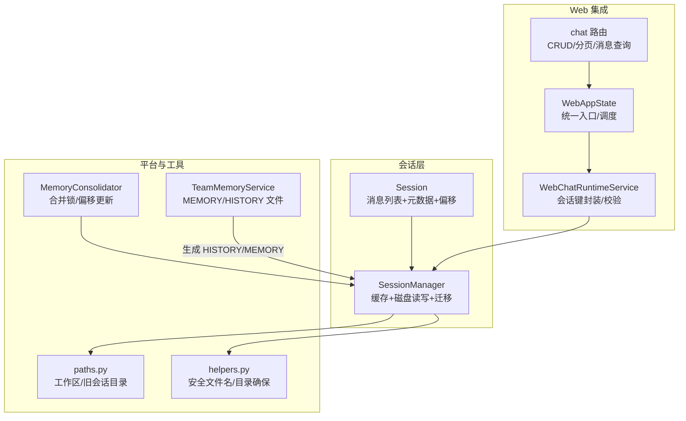
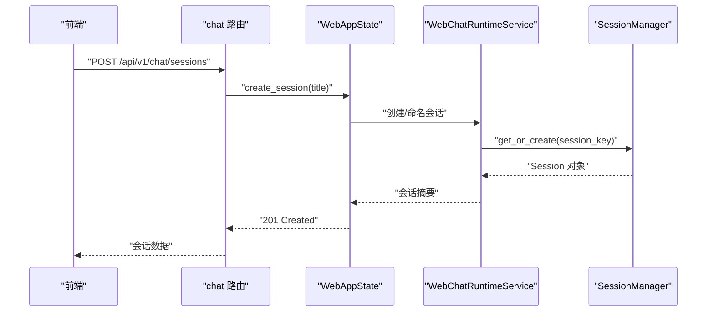
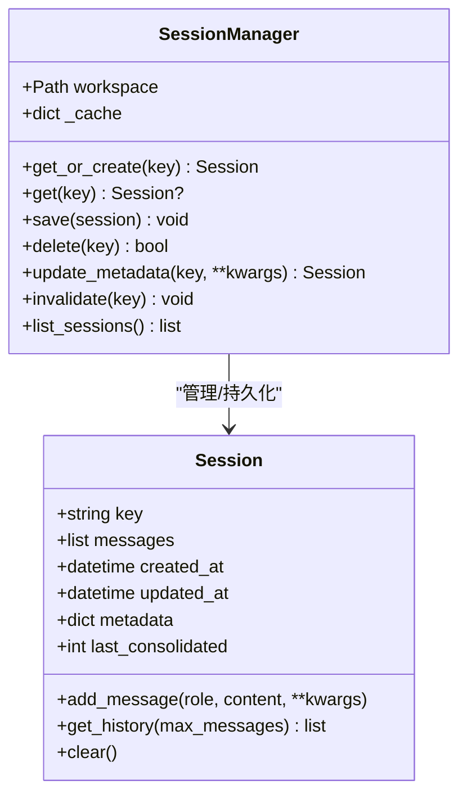
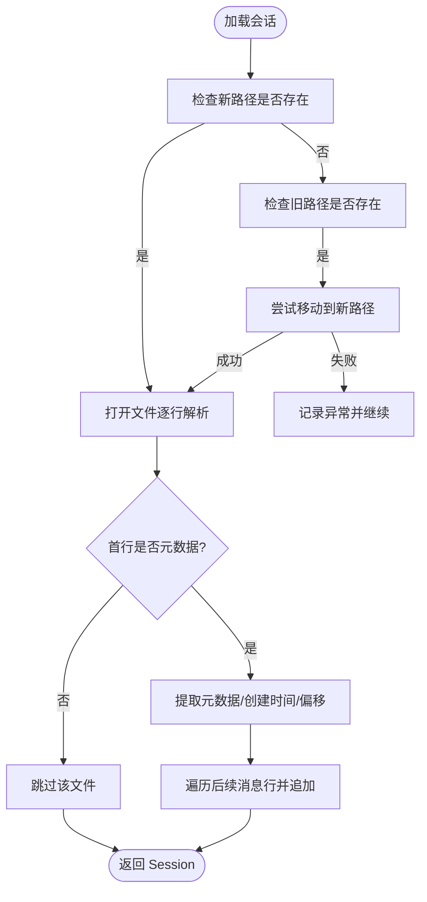
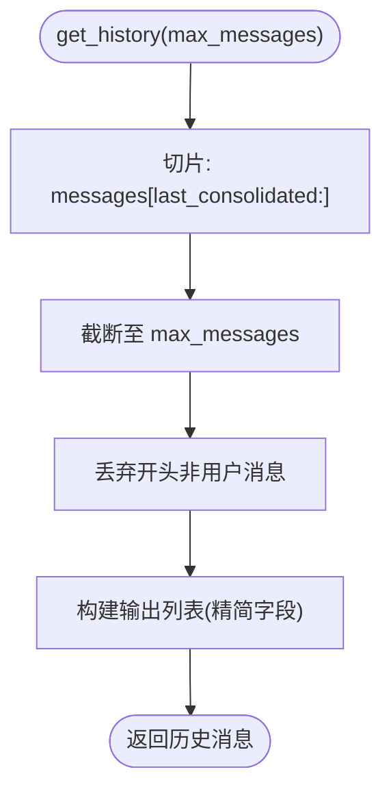
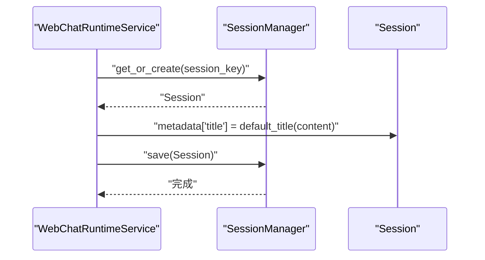
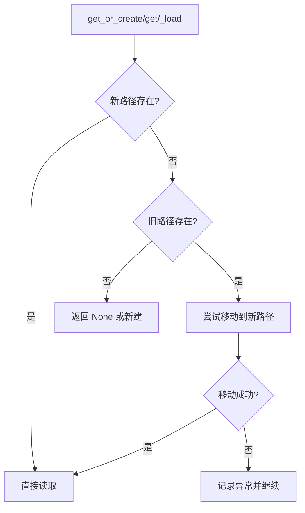
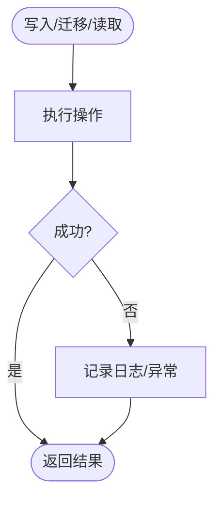
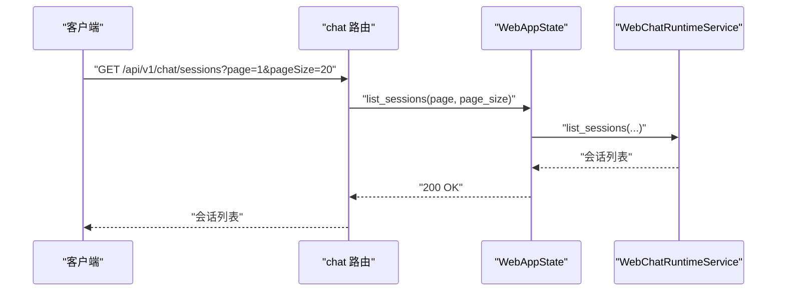
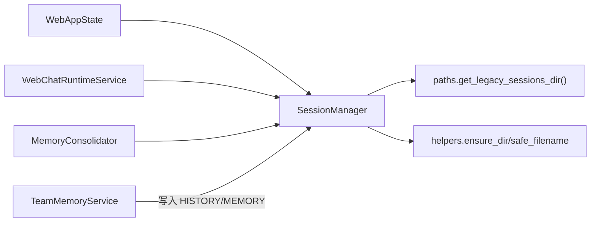

# 会话管理

<cite>
**本文引用的文件**
- [nanobot/session/manager.py](file://nanobot/session/manager.py)
- [nanobot/session/__init__.py](file://nanobot/session/__init__.py)
- [nanobot/config/paths.py](file://nanobot/config/paths.py)
- [nanobot/utils/helpers.py](file://nanobot/utils/helpers.py)
- [nanobot/web/routers/chat.py](file://nanobot/web/routers/chat.py)
- [nanobot/web/runtime_services/chat.py](file://nanobot/web/runtime_services/chat.py)
- [nanobot/web/runtime.py](file://nanobot/web/runtime.py)
- [nanobot/web/app.py](file://nanobot/web/app.py)
- [nanobot/agent/memory.py](file://nanobot/agent/memory.py)
- [nanobot/platform/memory/service.py](file://nanobot/platform/memory/service.py)
- [nanobot/platform/memory/store.py](file://nanobot/platform/memory/store.py)
- [tests/test_web_api.py](file://tests/test_web_api.py)
- [tests/test_loop_save_turn.py](file://tests/test_loop_save_turn.py)
- [tests/test_consolidate_offset.py](file://tests/test_consolidate_offset.py)
</cite>

## 目录
1. [简介](#简介)
2. [项目结构](#项目结构)
3. [核心组件](#核心组件)
4. [架构总览](#架构总览)
5. [详细组件分析](#详细组件分析)
6. [依赖关系分析](#依赖关系分析)
7. [性能考量](#性能考量)
8. [故障排查指南](#故障排查指南)
9. [结论](#结论)
10. [附录](#附录)

## 简介
本文件系统性阐述 Nanobot 会话管理系统的设计与实现，覆盖会话类的设计理念、生命周期管理、持久化机制、键值生成规则、消息存储格式（JSONL）、文件组织结构、创建/加载/保存/删除/缓存策略、元数据管理、历史消息获取、会话迁移机制、并发访问控制与错误处理策略，并提供可操作的最佳实践与图示。

## 项目结构
会话管理位于 nanobot/session 子模块，围绕 Session 与 SessionManager 展开；配合 Web 路由与运行时服务进行对外暴露与业务集成；通过路径与工具模块支持安全文件名与目录组织；通过平台内存服务与内存合并器实现“未归档消息”与“已归档记忆”的协同。

**图表来源**
- [nanobot/session/manager.py:16-252](file://nanobot/session/manager.py#L16-L252)
- [nanobot/web/routers/chat.py:50-89](file://nanobot/web/routers/chat.py#L50-L89)
- [nanobot/web/runtime_services/chat.py:18-39](file://nanobot/web/runtime_services/chat.py#L18-L39)
- [nanobot/web/runtime.py:72-200](file://nanobot/web/runtime.py#L72-L200)
- [nanobot/config/paths.py:53-56](file://nanobot/config/paths.py#L53-L56)
- [nanobot/utils/helpers.py:25-41](file://nanobot/utils/helpers.py#L25-L41)
- [nanobot/agent/memory.py:149-179](file://nanobot/agent/memory.py#L149-L179)
- [nanobot/platform/memory/service.py:107-125](file://nanobot/platform/memory/service.py#L107-L125)

**章节来源**
- [nanobot/session/manager.py:16-252](file://nanobot/session/manager.py#L16-L252)
- [nanobot/web/routers/chat.py:50-89](file://nanobot/web/routers/chat.py#L50-L89)
- [nanobot/web/runtime_services/chat.py:18-39](file://nanobot/web/runtime_services/chat.py#L18-L39)
- [nanobot/web/runtime.py:72-200](file://nanobot/web/runtime.py#L72-L200)
- [nanobot/config/paths.py:53-56](file://nanobot/config/paths.py#L53-L56)
- [nanobot/utils/helpers.py:25-41](file://nanobot/utils/helpers.py#L25-L41)
- [nanobot/agent/memory.py:149-179](file://nanobot/agent/memory.py#L149-L179)
- [nanobot/platform/memory/service.py:107-125](file://nanobot/platform/memory/service.py#L107-L125)

## 核心组件
- Session：承载单一会话的消息列表、元数据、创建/更新时间、以及“已归档到文件的消息数量偏移”。消息以 JSONL 持久化，且仅追加写入以提升 LLM 缓存效率。
- SessionManager：负责会话的缓存、磁盘读写、迁移、列表、元数据更新、删除等。采用工作区内的 sessions 目录作为默认存储，同时兼容旧版全局 sessions 目录迁移。

关键职责与行为：
- 键值生成：将 key 中的冒号替换为下划线后进行安全文件名处理，避免非法字符并映射为文件名。
- 持久化格式：首行固定类型元数据，后续每行一条消息 JSON，形成 JSONL 文件。
- 历史获取：按 last_consolidated 偏移切片，限制最大返回条数，并确保从用户消息开始对齐，避免孤立工具结果块。
- 元数据管理：支持增量合并更新并持久化，包含创建/更新时间、标题等。
- 迁移机制：优先读取新路径，若不存在则尝试将旧路径会话移动到新路径，失败时记录警告但不中断流程。
- 并发与一致性：通过内存缓存与锁（在合并器中体现）保障多会话并发下的稳定性；会话对象本身无显式锁，建议在上层调用侧串行或基于会话键加锁。

**章节来源**
- [nanobot/session/manager.py:16-252](file://nanobot/session/manager.py#L16-L252)
- [nanobot/utils/helpers.py:25-41](file://nanobot/utils/helpers.py#L25-L41)
- [nanobot/config/paths.py:53-56](file://nanobot/config/paths.py#L53-L56)

## 架构总览
Web 路由通过 WebAppState 统一调度，WebChatRuntimeService 将前端 session_id 映射为内部 session_key（如 web:xxx），随后委托 SessionManager 完成会话的增删改查与消息读取。平台内存服务负责生成 HISTORY.md 与 MEMORY.md，与 Session 的未归档消息共同构成完整的对话记忆体系。

**图表来源**
- [nanobot/web/routers/chat.py:59-65](file://nanobot/web/routers/chat.py#L59-L65)
- [nanobot/web/runtime.py:128-129](file://nanobot/web/runtime.py#L128-L129)
- [nanobot/web/runtime_services/chat.py:32-33](file://nanobot/web/runtime_services/chat.py#L32-L33)
- [nanobot/session/manager.py:96-114](file://nanobot/session/manager.py#L96-L114)

## 详细组件分析

### Session 类设计与生命周期
- 设计理念
  - 追加式消息存储：仅追加写入，有利于 LLM 缓存命中与增量处理。
  - 偏移标记 last_consolidated：用于区分“未归档消息”与“已归档到 MEMORY/HISTORY 的内容”，保证 get_history 输出始终对齐用户回合。
  - 元数据字段：支持标题、来源信息等扩展属性，便于 UI 展示与检索。
- 生命周期
  - 创建：通过 SessionManager.get_or_create 或直接实例化。
  - 运行期：add_message 追加消息，clear 清空并重置偏移。
  - 归档：由内存合并器将部分历史写入 MEMORY/HISTORY，但不修改 messages 列表与 get_history 输出。
  - 持久化：通过 SessionManager.save 写入 JSONL 文件。
  - 删除：SessionManager.delete 移除文件并清理缓存。

**图表来源**
- [nanobot/session/manager.py:16-252](file://nanobot/session/manager.py#L16-L252)

**章节来源**
- [nanobot/session/manager.py:16-71](file://nanobot/session/manager.py#L16-L71)

### SessionManager：键值生成、文件组织与迁移
- 键值生成规则
  - 将 key 中的冒号替换为下划线，再经安全文件名处理，避免非法字符。
- 文件组织结构
  - 默认路径：工作区 sessions 目录（由 ensure_dir 确保存在）。
  - 兼容旧路径：~/.nanobot/sessions，若目标不存在则尝试移动。
- 迁移策略
  - 加载时若新路径不存在，检查旧路径是否存在，存在则尝试移动到新路径并记录日志；失败时记录异常但不抛出致命错误。
- 读写策略
  - 读取：逐行解析 JSONL，首行固定类型元数据，其余为消息；解析失败记录告警并返回 None。
  - 写入：先写入元数据行，再逐条写入消息行；写入后更新内存缓存。

**图表来源**
- [nanobot/session/manager.py:125-171](file://nanobot/session/manager.py#L125-L171)
- [nanobot/config/paths.py:53-56](file://nanobot/config/paths.py#L53-L56)
- [nanobot/utils/helpers.py:25-41](file://nanobot/utils/helpers.py#L25-L41)

**章节来源**
- [nanobot/session/manager.py:86-171](file://nanobot/session/manager.py#L86-L171)
- [nanobot/config/paths.py:53-56](file://nanobot/config/paths.py#L53-L56)
- [nanobot/utils/helpers.py:25-41](file://nanobot/utils/helpers.py#L25-L41)

### 历史消息获取与对齐策略
- 截断策略：按 last_consolidated 偏移切片，再取末尾 max_messages 条。
- 对齐策略：丢弃开头非用户消息，确保输出从用户回合开始，避免孤立工具结果块。
- 输出精简：仅保留 role/content/tool_calls/tool_call_id/name 等必要字段，便于下游模型输入。

**图表来源**
- [nanobot/session/manager.py:46-64](file://nanobot/session/manager.py#L46-L64)

**章节来源**
- [nanobot/session/manager.py:46-64](file://nanobot/session/manager.py#L46-L64)

### 元数据管理与标题策略
- 元数据更新：update_metadata 合并传入键值并持久化，同时刷新 updated_at。
- 标题策略：WebChatRuntimeService 提供默认标题生成逻辑（取内容前若干字符），在首次创建或测试运行时设置标题并保存。

**图表来源**
- [nanobot/web/runtime_services/chat.py:24-33](file://nanobot/web/runtime_services/chat.py#L24-L33)
- [nanobot/session/manager.py:201-207](file://nanobot/session/manager.py#L201-L207)

**章节来源**
- [nanobot/web/runtime_services/chat.py:24-33](file://nanobot/web/runtime_services/chat.py#L24-L33)
- [nanobot/session/manager.py:201-207](file://nanobot/session/manager.py#L201-L207)

### 会话迁移机制
- 新旧路径兼容：加载时若新路径不存在，尝试将旧路径文件移动到新路径；失败记录异常但不中断。
- 路径来源：新路径来自工作区，旧路径来自 get_legacy_sessions_dir 返回的全局目录。

**图表来源**
- [nanobot/session/manager.py:125-136](file://nanobot/session/manager.py#L125-L136)
- [nanobot/config/paths.py:53-56](file://nanobot/config/paths.py#L53-L56)

**章节来源**
- [nanobot/session/manager.py:125-136](file://nanobot/session/manager.py#L125-L136)
- [nanobot/config/paths.py:53-56](file://nanobot/config/paths.py#L53-L56)

### 并发访问控制与错误处理
- 并发控制
  - 会话对象本身无内置锁：建议在上层按会话键加锁，或在关键写入点使用外部同步。
  - 内存合并器提供按会话键的共享锁，避免同一会话的历史归档并发冲突。
- 错误处理
  - 文件读取异常：捕获并记录警告，返回 None，不影响其他流程。
  - 迁移失败：记录异常并继续，保持幂等性。
  - Web 层：路由层对缺失会话抛出 404，验证错误返回 422。

**图表来源**
- [nanobot/session/manager.py:168-170](file://nanobot/session/manager.py#L168-L170)
- [nanobot/agent/memory.py:173-175](file://nanobot/agent/memory.py#L173-L175)

**章节来源**
- [nanobot/session/manager.py:168-170](file://nanobot/session/manager.py#L168-L170)
- [nanobot/agent/memory.py:173-175](file://nanobot/agent/memory.py#L173-L175)

### Web 集成与 API 行为
- 路由定义：提供会话 CRUD、分页列表、消息查询等接口。
- 运行时服务：将前端 session_id 映射为 internal session_key（如 web:xxx），并提供 require_session 校验。
- 测试验证：端到端测试覆盖创建、列表、重命名、清空消息、删除等行为。

**图表来源**
- [nanobot/web/routers/chat.py:50-56](file://nanobot/web/routers/chat.py#L50-L56)
- [nanobot/web/runtime.py:125-127](file://nanobot/web/runtime.py#L125-L127)

**章节来源**
- [nanobot/web/routers/chat.py:50-89](file://nanobot/web/routers/chat.py#L50-L89)
- [nanobot/web/runtime_services/chat.py:32-39](file://nanobot/web/runtime_services/chat.py#L32-L39)
- [tests/test_web_api.py:1278-1302](file://tests/test_web_api.py#L1278-L1302)

## 依赖关系分析
- SessionManager 依赖
  - 工作区路径与 sessions 目录（ensure_dir）
  - 旧会话目录（get_legacy_sessions_dir）
  - 安全文件名处理（safe_filename）
- Web 集成
  - 路由层依赖运行时状态，运行时状态持有 SessionManager 实例。
- 平台内存协同
  - 内存合并器通过 SessionManager 更新 last_consolidated 偏移，平台内存服务负责写入 HISTORY/MEMORY 文件。

**图表来源**
- [nanobot/session/manager.py:80-84](file://nanobot/session/manager.py#L80-L84)
- [nanobot/config/paths.py:53-56](file://nanobot/config/paths.py#L53-L56)
- [nanobot/utils/helpers.py:25-41](file://nanobot/utils/helpers.py#L25-L41)
- [nanobot/web/runtime.py:90-105](file://nanobot/web/runtime.py#L90-L105)
- [nanobot/web/runtime_services/chat.py:32-33](file://nanobot/web/runtime_services/chat.py#L32-L33)
- [nanobot/agent/memory.py:154-175](file://nanobot/agent/memory.py#L154-L175)
- [nanobot/platform/memory/service.py:107-125](file://nanobot/platform/memory/service.py#L107-L125)

**章节来源**
- [nanobot/session/manager.py:80-84](file://nanobot/session/manager.py#L80-L84)
- [nanobot/web/runtime.py:90-105](file://nanobot/web/runtime.py#L90-L105)
- [nanobot/agent/memory.py:154-175](file://nanobot/agent/memory.py#L154-L175)
- [nanobot/platform/memory/service.py:107-125](file://nanobot/platform/memory/service.py#L107-L125)

## 性能考量
- 追加式写入：减少随机写，提高 LLM 缓存命中率与增量处理效率。
- 历史截断：通过 max_messages 限制输入长度，降低上下文成本。
- 偏移归档：将长历史写入 MEMORY/HISTORY，避免 get_history 输出过大。
- 缓存策略：SessionManager 内部缓存提升频繁读取性能；注意在高并发场景下结合会话键加锁或合并器锁避免竞争。
- 文件 IO：JSONL 顺序读写简单高效；大文件场景建议定期归档与压缩策略（由上层平台内存服务负责）。

[本节为通用指导，无需列出具体文件来源]

## 故障排查指南
- 会话无法加载
  - 检查新旧路径是否存在与权限；查看迁移日志；确认 JSONL 格式正确。
- 迁移失败
  - 查看异常日志；确认旧路径文件可读；确认新路径可写。
- 历史为空或不完整
  - 检查 last_consolidated 偏移是否异常（如超过消息总数或为负数）；参考测试用例定位边界情况。
- Web 接口 404/422
  - 确认会话 ID 是否存在；检查请求体参数是否符合校验规则。

**章节来源**
- [nanobot/session/manager.py:168-170](file://nanobot/session/manager.py#L168-L170)
- [tests/test_consolidate_offset.py:226-244](file://tests/test_consolidate_offset.py#L226-L244)
- [nanobot/web/routers/chat.py:76-81](file://nanobot/web/routers/chat.py#L76-L81)

## 结论
Nanobot 会话管理以简洁可靠的 JSONL 文件与内嵌缓存为核心，结合偏移归档与平台内存服务，实现了高效、可扩展的对话历史管理。通过 Web 路由与运行时服务的统一封装，既满足前端交互需求，又为上层智能体与工具链提供稳定的数据基础。建议在高并发场景下引入会话级锁与批量归档策略，持续优化大体量会话的读写性能与一致性。

[本节为总结性内容，无需列出具体文件来源]

## 附录

### 最佳实践清单
- 使用安全文件名：键值中冒号替换为下划线后再进行安全处理。
- 严格追加写入：避免覆盖已有消息，确保 LLM 缓存有效性。
- 合理设置 max_messages：平衡上下文窗口与历史长度。
- 及时归档：通过内存合并器将长历史写入 MEMORY/HISTORY，维护 last_consolidated 偏移。
- 并发控制：按会话键加锁或复用合并器锁，避免竞态。
- 失败容忍：对文件读写与迁移异常进行日志记录，保证系统可用性。

[本节为通用指导，无需列出具体文件来源]