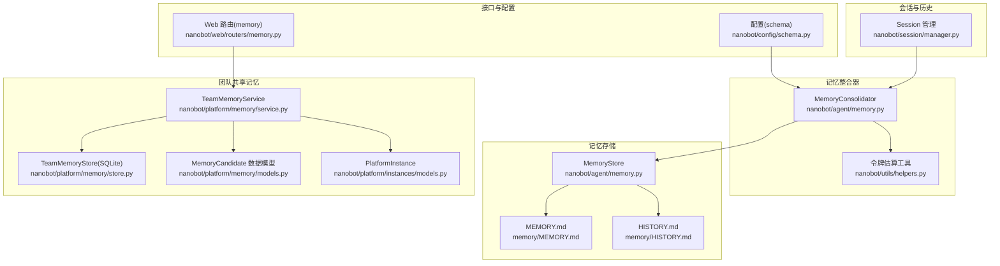
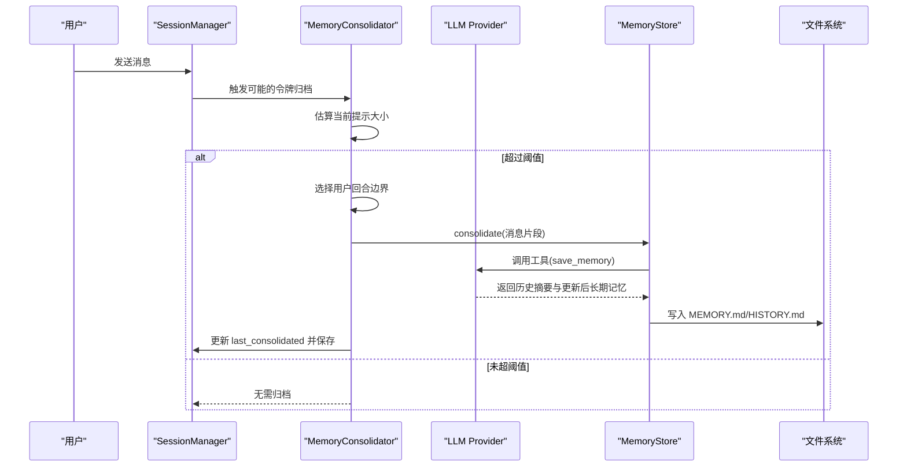
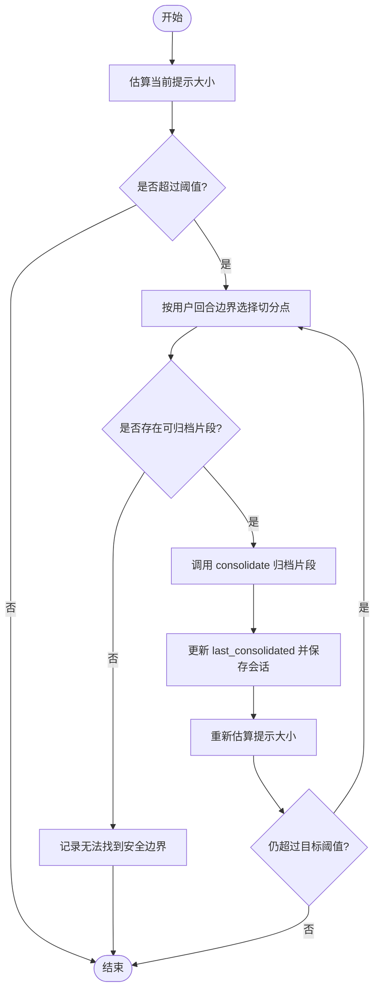
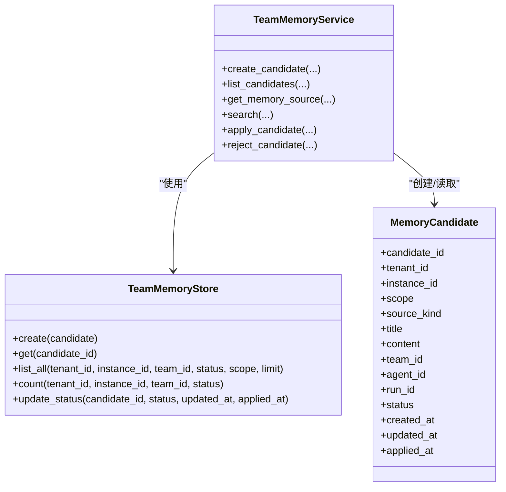
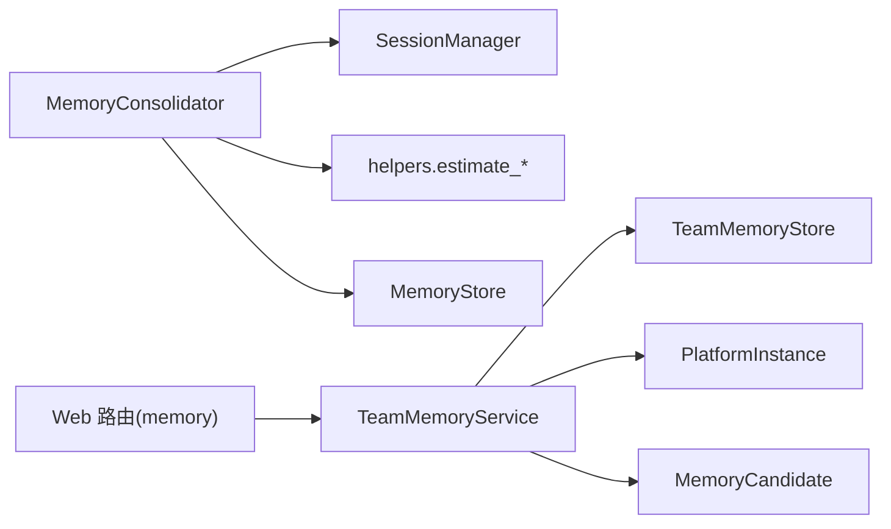

# 内存整合

<cite>
**本文引用的文件**
- [nanobot/agent/memory.py](file://nanobot/agent/memory.py)
- [nanobot/utils/helpers.py](file://nanobot/utils/helpers.py)
- [nanobot/session/manager.py](file://nanobot/session/manager.py)
- [nanobot/platform/memory/models.py](file://nanobot/platform/memory/models.py)
- [nanobot/platform/memory/service.py](file://nanobot/platform/memory/service.py)
- [nanobot/platform/memory/store.py](file://nanobot/platform/memory/store.py)
- [nanobot/platform/instances/models.py](file://nanobot/platform/instances/models.py)
- [nanobot/web/routers/memory.py](file://nanobot/web/routers/memory.py)
- [nanobot/config/schema.py](file://nanobot/config/schema.py)
- [memory/MEMORY.md](file://memory/MEMORY.md)
- [tests/test_loop_consolidation_tokens.py](file://tests/test_loop_consolidation_tokens.py)
- [tests/test_memory_service.py](file://tests/test_memory_service.py)
</cite>

## 目录
1. [引言](#引言)
2. [项目结构](#项目结构)
3. [核心组件](#核心组件)
4. [架构总览](#架构总览)
5. [详细组件分析](#详细组件分析)
6. [依赖分析](#依赖分析)
7. [性能考量](#性能考量)
8. [故障排除指南](#故障排除指南)
9. [结论](#结论)
10. [附录](#附录)

## 引言
本文件面向 Nanobot 的“内存整合”系统，系统性阐述其架构设计、上下文窗口管理与令牌估算机制、消息压缩与去重策略、历史信息筛选规则、监控与性能优化、资源限制策略、配置参数与阈值设定，以及自动清理机制。文档同时提供可视化图示与实操建议，帮助开发者与运维人员在不同规模与场景下稳定运行该系统。

## 项目结构
围绕“内存整合”的关键模块分布如下：
- 会话与历史：会话持久化与历史片段读取
- 记忆存储：本地长期记忆与可搜索历史
- 记忆整合器：基于 LLM 的消息归档与上下文控制
- 团队共享记忆：候选条目、搜索与应用流程
- 工具与估算：令牌估算、提示构建与落盘
- 配置与接口：上下文窗口参数、Web API 路由

图表来源
- [nanobot/session/manager.py:16-71](file://nanobot/session/manager.py#L16-L71)
- [nanobot/agent/memory.py:60-147](file://nanobot/agent/memory.py#L60-L147)
- [nanobot/utils/helpers.py:117-171](file://nanobot/utils/helpers.py#L117-L171)
- [nanobot/platform/memory/service.py:31-447](file://nanobot/platform/memory/service.py#L31-L447)
- [nanobot/platform/memory/store.py:12-202](file://nanobot/platform/memory/store.py#L12-L202)
- [nanobot/platform/memory/models.py:14-65](file://nanobot/platform/memory/models.py#L14-L65)
- [nanobot/platform/instances/models.py:14-111](file://nanobot/platform/instances/models.py#L14-L111)
- [nanobot/web/routers/memory.py:12-125](file://nanobot/web/routers/memory.py#L12-L125)
- [nanobot/config/schema.py:1-200](file://nanobot/config/schema.py#L1-L200)

章节来源
- [nanobot/session/manager.py:16-71](file://nanobot/session/manager.py#L16-L71)
- [nanobot/agent/memory.py:60-147](file://nanobot/agent/memory.py#L60-L147)
- [nanobot/utils/helpers.py:117-171](file://nanobot/utils/helpers.py#L117-L171)
- [nanobot/platform/memory/service.py:31-447](file://nanobot/platform/memory/service.py#L31-L447)
- [nanobot/platform/memory/store.py:12-202](file://nanobot/platform/memory/store.py#L12-L202)
- [nanobot/platform/memory/models.py:14-65](file://nanobot/platform/memory/models.py#L14-L65)
- [nanobot/platform/instances/models.py:14-111](file://nanobot/platform/instances/models.py#L14-L111)
- [nanobot/web/routers/memory.py:12-125](file://nanobot/web/routers/memory.py#L12-L125)
- [nanobot/config/schema.py:1-200](file://nanobot/config/schema.py#L1-L200)

## 核心组件
- 会话与历史（Session/SessionManager）
  - 会话以 JSONL 形式持久化，消息追加写入；通过 last_consolidated 偏移量区分已归档与未归档片段。
  - 提供 get_history(max_messages) 对未归档片段进行用户回合对齐与前导非用户消息裁剪，避免孤立工具结果块。
- 记忆存储（MemoryStore）
  - 两层记忆：MEMORY.md（长期事实）+ HISTORY.md（可 grep 的日志）。
  - consolidate 将一段消息交给 LLM，要求其调用 save_memory 工具返回历史摘要与更新后的长期记忆，并落盘。
- 记忆整合器（MemoryConsolidator）
  - 基于上下文窗口令牌阈值，按用户回合边界挑选可安全归档的消息片段，循环归档直至降至目标阈值以下。
  - 使用弱引用锁保证同一会话并发安全；支持预估提示大小并记录来源。
- 令牌估算与提示构建（helpers）
  - estimate_message_tokens/estimate_prompt_tokens_chain：优先使用 provider 的计数器，回退到 tiktoken。
- 团队共享记忆（TeamMemoryService/Store）
  - 候选条目（MemoryCandidate）入库（SQLite），支持搜索、应用、拒绝等治理操作。
  - 支持从工作区共享记忆、团队记忆、线程源、制品源等多源聚合检索。
- 实例与路径（PlatformInstance）
  - 统一管理实例级数据目录、数据库路径与团队记忆目录，确保隔离与可维护性。
- Web 接口（Web 路由）
  - 提供团队共享记忆查询、更新、候选列表、搜索、获取源、应用/拒绝候选等 API。

章节来源
- [nanobot/session/manager.py:16-71](file://nanobot/session/manager.py#L16-L71)
- [nanobot/agent/memory.py:60-147](file://nanobot/agent/memory.py#L60-L147)
- [nanobot/agent/memory.py:149-285](file://nanobot/agent/memory.py#L149-L285)
- [nanobot/utils/helpers.py:117-171](file://nanobot/utils/helpers.py#L117-L171)
- [nanobot/platform/memory/service.py:31-447](file://nanobot/platform/memory/service.py#L31-L447)
- [nanobot/platform/memory/store.py:12-202](file://nanobot/platform/memory/store.py#L12-L202)
- [nanobot/platform/memory/models.py:14-65](file://nanobot/platform/memory/models.py#L14-L65)
- [nanobot/platform/instances/models.py:14-111](file://nanobot/platform/instances/models.py#L14-L111)
- [nanobot/web/routers/memory.py:12-125](file://nanobot/web/routers/memory.py#L12-L125)

## 架构总览
整体流程：会话产生消息 → 估算提示大小 → 若超过阈值则按用户回合边界归档 → LLM 生成摘要并更新长期记忆 → 历史落盘 → 持续循环直到满足阈值 → 团队共享记忆可被检索与治理。

图表来源
- [nanobot/agent/memory.py:149-285](file://nanobot/agent/memory.py#L149-L285)
- [nanobot/agent/memory.py:96-147](file://nanobot/agent/memory.py#L96-L147)
- [nanobot/utils/helpers.py:151-171](file://nanobot/utils/helpers.py#L151-L171)
- [nanobot/session/manager.py:16-71](file://nanobot/session/manager.py#L16-L71)

## 详细组件分析

### 会话与历史（Session/SessionManager）
- 设计要点
  - 追加写入提升 LLM 缓存命中率；未归档片段通过 last_consolidated 切分。
  - get_history 在输出给 LLM 前进行用户回合对齐与前导非用户消息裁剪，避免孤立工具结果。
- 关键行为
  - add_message 自动注入时间戳与元数据。
  - get_history 支持 max_messages 截断，配合归档偏移量形成滑动窗口。
- 复杂度
  - get_history 时间复杂度 O(N)，N 为未归档片段长度；空间复杂度 O(N)。

章节来源
- [nanobot/session/manager.py:16-71](file://nanobot/session/manager.py#L16-L71)
- [nanobot/session/manager.py:73-252](file://nanobot/session/manager.py#L73-L252)

### 记忆存储（MemoryStore）
- 功能
  - 读取/写入长期记忆（MEMORY.md），追加历史（HISTORY.md）。
  - consolidate 构造提示，调用 LLM 的 save_memory 工具，解析并落盘。
- 安全与健壮性
  - 参数标准化与空值保护，失败时记录异常日志。
- 输出格式
  - HISTORY.md 采用带时间戳与角色标记的可 grep 文本格式，便于检索。

章节来源
- [nanobot/agent/memory.py:60-147](file://nanobot/agent/memory.py#L60-L147)
- [memory/MEMORY.md:1-24](file://memory/MEMORY.md#L1-L24)

### 记忆整合器（MemoryConsolidator）
- 上下文窗口与阈值
  - 依据 context_window_tokens 设置目标阈值（通常为窗口的一半），循环归档直至低于目标。
- 边界选择策略
  - 仅在用户回合边界切分，避免破坏对话连贯性与工具调用配对。
- 锁与并发
  - 使用弱引用字典为每个会话键持有独立异步锁，避免交叉写入。
- 估算与来源追踪
  - estimate_session_prompt_tokens 通过 provider 计数器或 tiktoken 估算，记录来源以便诊断。

图表来源
- [nanobot/agent/memory.py:181-285](file://nanobot/agent/memory.py#L181-L285)
- [nanobot/agent/memory.py:203-218](file://nanobot/agent/memory.py#L203-L218)

章节来源
- [nanobot/agent/memory.py:149-285](file://nanobot/agent/memory.py#L149-L285)

### 令牌估算与提示构建（helpers）
- estimate_message_tokens
  - 对单条消息内容进行文本拼接与编码，考虑工具调用与辅助字段，返回正整数。
- estimate_prompt_tokens_chain
  - 优先调用 provider 的计数器（如可用），否则回退到 tiktoken；若均不可用返回 0 与来源标记。
- 用途
  - 用于 MemoryConsolidator 的边界选择与阈值判断，以及 Web 搜索的评分与预览。

章节来源
- [nanobot/utils/helpers.py:117-171](file://nanobot/utils/helpers.py#L117-L171)

### 团队共享记忆（TeamMemoryService/Store）
- 数据模型（MemoryCandidate）
  - 包含候选标识、作用域、来源类型、标题、内容、团队/代理/运行关联、状态与时间戳。
- 服务能力
  - 创建候选、列出候选、获取源、搜索（关键词/混合/语义）、应用/拒绝候选。
  - 搜索时聚合工作区共享记忆、团队记忆、线程源、制品源与候选（已应用的候选不再重复搜索）。
- 存储（TeamMemoryStore）
  - SQLite 表 memory_candidates，包含索引以支持按团队/范围/状态排序与统计。

图表来源
- [nanobot/platform/memory/models.py:14-65](file://nanobot/platform/memory/models.py#L14-L65)
- [nanobot/platform/memory/store.py:12-202](file://nanobot/platform/memory/store.py#L12-L202)
- [nanobot/platform/memory/service.py:31-447](file://nanobot/platform/memory/service.py#L31-L447)

章节来源
- [nanobot/platform/memory/models.py:14-65](file://nanobot/platform/memory/models.py#L14-L65)
- [nanobot/platform/memory/store.py:12-202](file://nanobot/platform/memory/store.py#L12-L202)
- [nanobot/platform/memory/service.py:31-447](file://nanobot/platform/memory/service.py#L31-L447)

### 实例与路径（PlatformInstance）
- 作用
  - 统一管理实例级数据目录、数据库路径与团队记忆目录，确保跨进程与多实例隔离。
- 关键路径
  - memory_db_path、team_memory_dir 等，保障团队共享记忆与候选数据的持久化。

章节来源
- [nanobot/platform/instances/models.py:14-111](file://nanobot/platform/instances/models.py#L14-L111)

### Web 接口（Web 路由）
- 能力
  - 获取/更新团队共享记忆、列举候选、搜索、获取源、应用/拒绝候选。
- 错误处理
  - 对无效请求与缺失候选返回明确的 API 错误码与消息。

章节来源
- [nanobot/web/routers/memory.py:12-125](file://nanobot/web/routers/memory.py#L12-L125)

## 依赖分析
- 组件耦合
  - MemoryConsolidator 依赖 SessionManager（读取未归档片段）、LLM Provider（估算与工具调用）、工具函数（令牌估算）。
  - TeamMemoryService 依赖 TeamMemoryStore（SQLite）、PlatformInstance（路径）、搜索评分工具。
- 外部依赖
  - tiktoken 用于回退估算；SQLite 用于候选持久化；FastAPI 路由提供治理接口。
- 潜在环路
  - 当前模块间为单向依赖，未见循环导入。

图表来源
- [nanobot/agent/memory.py:149-285](file://nanobot/agent/memory.py#L149-L285)
- [nanobot/utils/helpers.py:117-171](file://nanobot/utils/helpers.py#L117-L171)
- [nanobot/platform/memory/service.py:31-447](file://nanobot/platform/memory/service.py#L31-L447)
- [nanobot/platform/memory/store.py:12-202](file://nanobot/platform/memory/store.py#L12-L202)
- [nanobot/platform/memory/models.py:14-65](file://nanobot/platform/memory/models.py#L14-L65)
- [nanobot/platform/instances/models.py:14-111](file://nanobot/platform/instances/models.py#L14-L111)
- [nanobot/web/routers/memory.py:12-125](file://nanobot/web/routers/memory.py#L12-L125)

## 性能考量
- 令牌估算
  - 优先使用 provider 的计数器，减少重复计算；回退到 tiktoken 时注意编码开销。
- 归档策略
  - 用户回合边界切分避免碎片化；最大归档轮次限制防止长时间循环。
- I/O 与并发
  - 使用弱引用锁避免内存泄漏；归档后批量保存会话，降低频繁落盘。
- 搜索与评分
  - 混合/语义模式在准确性与性能间权衡；建议根据数据规模调整模式与阈值。
- 配置建议
  - 合理设置 context_window_tokens，结合模型实际上下文长度与任务复杂度。

[本节为通用指导，不直接分析具体文件]

## 故障排除指南
- 归档未触发
  - 检查 context_window_tokens 是否为正值；确认 estimate_session_prompt_tokens 返回正值。
  - 参考测试用例验证边界选择逻辑与预估行为。
- LLM 未调用工具
  - consolidate 中若未检测到工具调用，将跳过归档；检查工具定义与模型指令。
- 候选应用失败
  - 确认候选存在且状态为 proposed；应用后状态应变为 applied。
- 搜索无结果
  - 检查查询词与模式；确认源内容非空且评分超过阈值。
- 文件读写异常
  - 检查工作区与团队记忆目录权限；确认 MEMORY.md/HISTORY.md 可写。

章节来源
- [nanobot/agent/memory.py:126-147](file://nanobot/agent/memory.py#L126-L147)
- [tests/test_loop_consolidation_tokens.py:38-190](file://tests/test_loop_consolidation_tokens.py#L38-L190)
- [tests/test_memory_service.py:9-145](file://tests/test_memory_service.py#L9-L145)

## 结论
Nanobot 的内存整合系统通过“会话历史 + 长期记忆 + 候选治理”的三层结构实现高效、可控的记忆管理。系统以用户回合边界为切分原则，结合令牌估算与阈值控制，确保上下文窗口稳定；团队共享记忆提供协作治理与检索能力。通过合理的配置与监控，可在不同规模场景中获得稳定的性能表现。

[本节为总结，不直接分析具体文件]

## 附录

### 内存使用示例（概念性）
- 场景：连续对话超过阈值
  - 会话持续增长，MemoryConsolidator 检测到提示大小超过目标阈值。
  - 选择用户回合边界，将旧片段归档至 MEMORY.md/HISTORY.md。
  - 更新 last_consolidated 并保存会话，循环直至满足阈值。
- 场景：团队协作
  - 成员提交候选，经审核后应用至团队共享记忆；其他成员可通过搜索快速定位相关内容。

[本节为概念性说明，不直接分析具体文件]

### 性能调优建议
- 估算精度
  - 优先启用 provider 计数器；若不可用，确保 tiktoken 编码正确。
- 归档频率
  - 适度提高阈值可减少归档次数；过低会导致频繁归档影响吞吐。
- 搜索模式
  - 默认 hybrid；大规模文本建议 keyword 或 hybrid；对语义召回需求高的场景可尝试 semantic。
- I/O 优化
  - 批量保存会话；避免在热路径中频繁读写文件。

[本节为通用指导，不直接分析具体文件]

### 配置参数与阈值
- 上下文窗口
  - 通过配置项 context_window_tokens 设置；默认值参考平台配置 schema。
- 最大归档轮次
  - MemoryConsolidator 内部常量限制，避免无限循环。
- 搜索限制
  - 候选列表默认上限为 200；搜索结果按评分降序截断。

章节来源
- [nanobot/config/schema.py:1-200](file://nanobot/config/schema.py#L1-L200)
- [nanobot/agent/memory.py:152](file://nanobot/agent/memory.py#L152)
- [nanobot/platform/memory/service.py:292-317](file://nanobot/platform/memory/service.py#L292-L317)