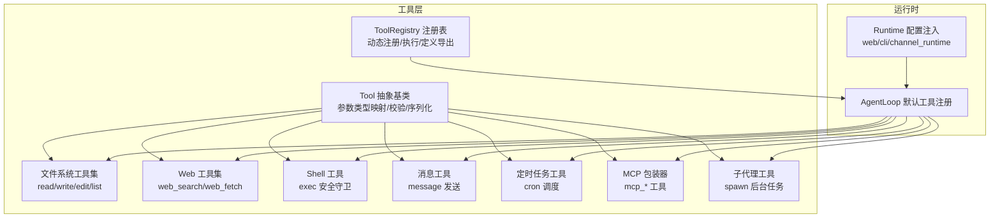
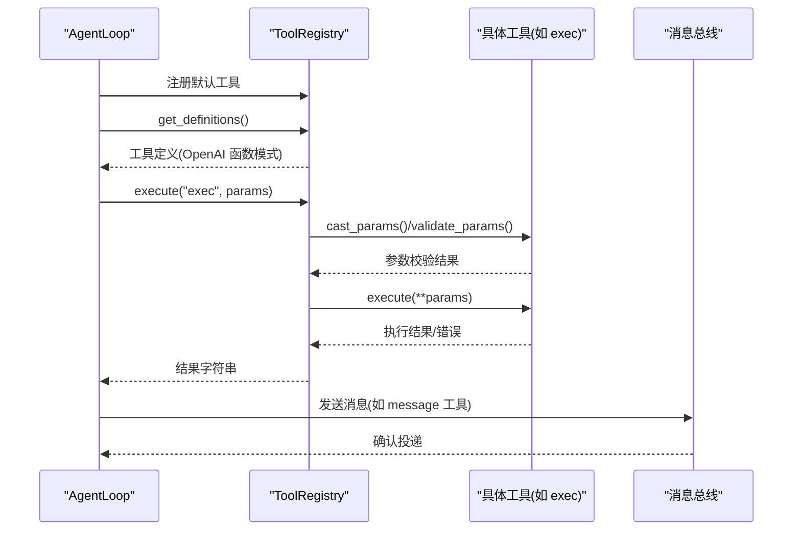
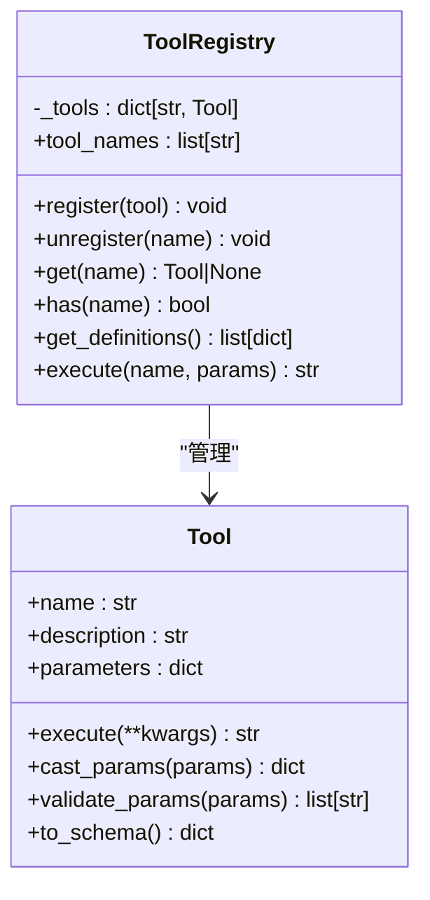
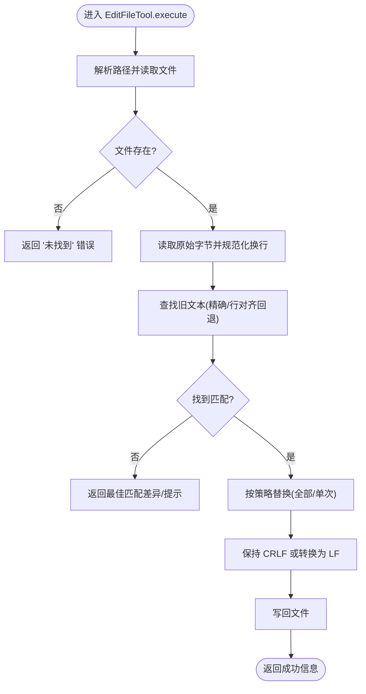
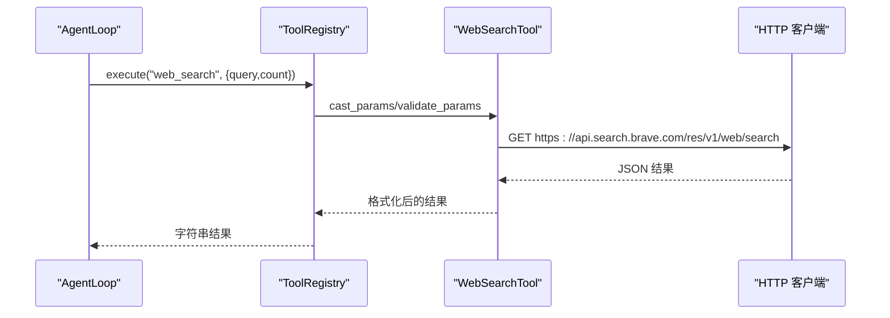
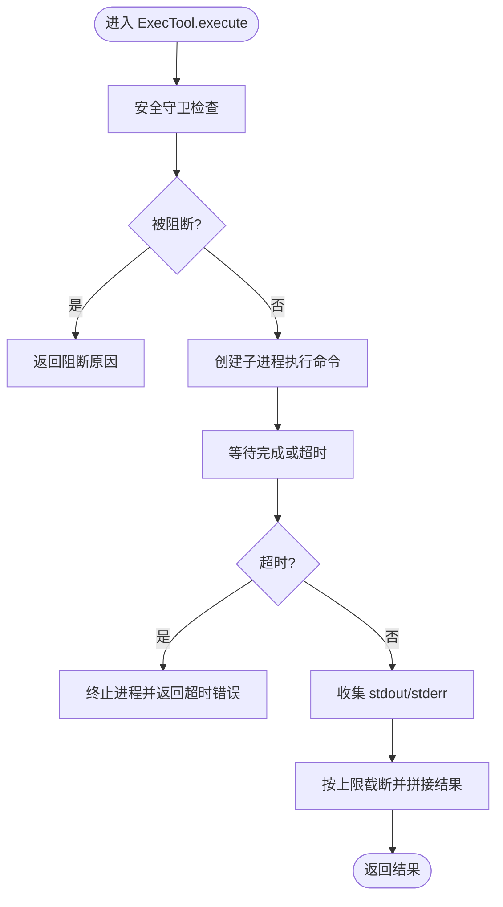
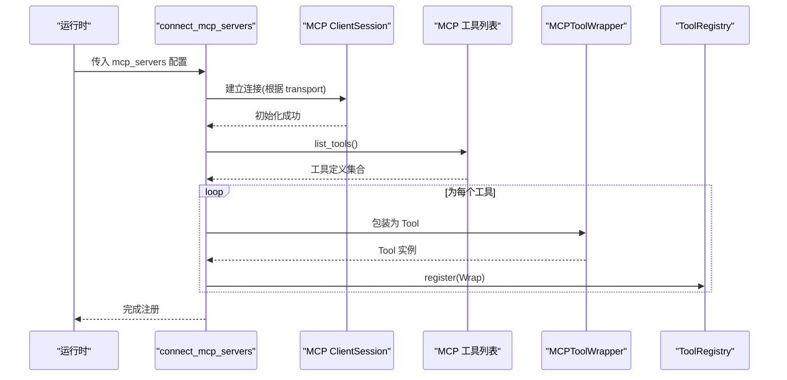
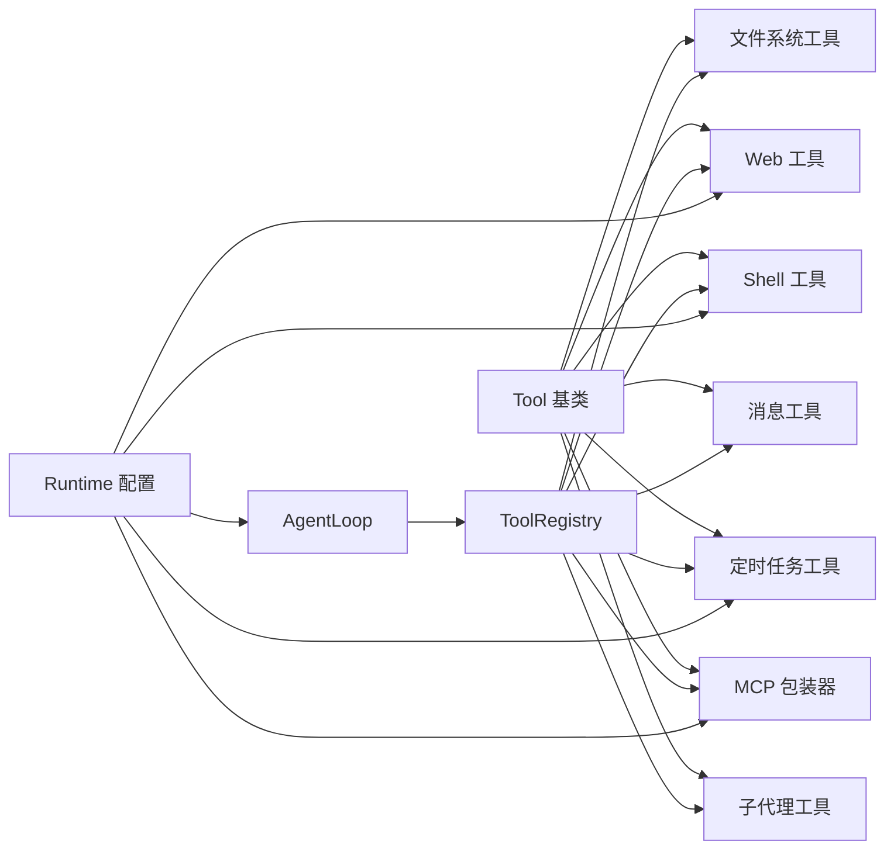

# 工具系统

<cite>
**本文引用的文件**
- [nanobot/agent/tools/base.py](file://nanobot/agent/tools/base.py)
- [nanobot/agent/tools/registry.py](file://nanobot/agent/tools/registry.py)
- [nanobot/agent/tools/filesystem.py](file://nanobot/agent/tools/filesystem.py)
- [nanobot/agent/tools/web.py](file://nanobot/agent/tools/web.py)
- [nanobot/agent/tools/shell.py](file://nanobot/agent/tools/shell.py)
- [nanobot/agent/tools/message.py](file://nanobot/agent/tools/message.py)
- [nanobot/agent/tools/cron.py](file://nanobot/agent/tools/cron.py)
- [nanobot/agent/tools/mcp.py](file://nanobot/agent/tools/mcp.py)
- [nanobot/agent/tools/spawn.py](file://nanobot/agent/tools/spawn.py)
- [nanobot/agent/loop.py](file://nanobot/agent/loop.py)
- [nanobot/web/runtime_services/config.py](file://nanobot/web/runtime_services/config.py)
- [nanobot/web/runtime_services/channel_runtime.py](file://nanobot/web/runtime_services/channel_runtime.py)
- [nanobot/cli/commands.py](file://nanobot/cli/commands.py)
- [TOOLS.md](file://TOOLS.md)
- [tests/test_filesystem_tools.py](file://tests/test_filesystem_tools.py)
- [tests/test_web_api.py](file://tests/test_web_api.py)
- [tests/test_message_tool.py](file://tests/test_message_tool.py)
- [tests/test_mcp_tool.py](file://tests/test_mcp_tool.py)
- [tests/test_tool_validation.py](file://tests/test_tool_validation.py)
</cite>

## 目录
1. [简介](#简介)
2. [项目结构](#项目结构)
3. [核心组件](#核心组件)
4. [架构总览](#架构总览)
5. [详细组件分析](#详细组件分析)
6. [依赖分析](#依赖分析)
7. [性能考量](#性能考量)
8. [故障排查指南](#故障排查指南)
9. [结论](#结论)
10. [附录](#附录)

## 简介
本文件系统性阐述 Nanobot 的工具体系：工具基类设计、工具注册表机制与工具执行流程；覆盖内置工具（文件系统、Web 搜索、Shell 执行、消息发送、定时任务、MCP 工具集成）的功能特性与使用边界；并提供自定义工具开发指南（接口规范、参数校验、错误处理）、安全与性能优化建议以及调试方法与最佳实践。

## 项目结构
工具系统位于 agent 子模块下，核心文件如下：
- 基类与注册表：base.py、registry.py
- 内置工具：filesystem.py、web.py、shell.py、message.py、cron.py、mcp.py、spawn.py
- 注册与使用：agent/loop.py（默认工具注册），runtime 配置入口（web/runtime_services/config.py、web/runtime_services/channel_runtime.py、cli/commands.py）
- 文档与测试：TOOLS.md、tests/*（文件系统、Web、消息、MCP、参数校验）

**图表来源**
- [nanobot/agent/tools/base.py:1-182](file://nanobot/agent/tools/base.py#L1-L182)
- [nanobot/agent/tools/registry.py:1-71](file://nanobot/agent/tools/registry.py#L1-L71)
- [nanobot/agent/tools/filesystem.py:1-366](file://nanobot/agent/tools/filesystem.py#L1-L366)
- [nanobot/agent/tools/web.py:1-182](file://nanobot/agent/tools/web.py#L1-L182)
- [nanobot/agent/tools/shell.py:1-180](file://nanobot/agent/tools/shell.py#L1-L180)
- [nanobot/agent/tools/message.py:1-110](file://nanobot/agent/tools/message.py#L1-L110)
- [nanobot/agent/tools/cron.py:1-159](file://nanobot/agent/tools/cron.py#L1-L159)
- [nanobot/agent/tools/mcp.py:1-153](file://nanobot/agent/tools/mcp.py#L1-L153)
- [nanobot/agent/tools/spawn.py:1-75](file://nanobot/agent/tools/spawn.py#L1-L75)
- [nanobot/agent/loop.py:130-159](file://nanobot/agent/loop.py#L130-L159)
- [nanobot/web/runtime_services/config.py:79-108](file://nanobot/web/runtime_services/config.py#L79-L108)
- [nanobot/web/runtime_services/channel_runtime.py:156-185](file://nanobot/web/runtime_services/channel_runtime.py#L156-L185)
- [nanobot/cli/commands.py:332-367](file://nanobot/cli/commands.py#L332-L367)

**章节来源**
- [nanobot/agent/tools/base.py:1-182](file://nanobot/agent/tools/base.py#L1-L182)
- [nanobot/agent/tools/registry.py:1-71](file://nanobot/agent/tools/registry.py#L1-L71)
- [nanobot/agent/loop.py:130-159](file://nanobot/agent/loop.py#L130-L159)
- [nanobot/web/runtime_services/config.py:79-108](file://nanobot/web/runtime_services/config.py#L79-L108)
- [nanobot/web/runtime_services/channel_runtime.py:156-185](file://nanobot/web/runtime_services/channel_runtime.py#L156-L185)
- [nanobot/cli/commands.py:332-367](file://nanobot/cli/commands.py#L332-L367)

## 核心组件
- 工具基类 Tool
  - 规范工具名称、描述、参数 JSON Schema
  - 提供类型映射、参数安全转换与严格校验
  - 支持将工具转为 OpenAI 函数调用格式
- 工具注册表 ToolRegistry
  - 动态注册/注销/查询工具
  - 导出工具定义（OpenAI 函数模式）
  - 统一执行入口：参数类型转换、校验、异常捕获与提示
- AgentLoop 默认注册
  - 将文件系统、Web、Shell、消息、子代理、定时任务等工具注册到运行时
  - 支持工具白名单、工作区限制、执行超时与路径追加等配置

**章节来源**
- [nanobot/agent/tools/base.py:7-182](file://nanobot/agent/tools/base.py#L7-L182)
- [nanobot/agent/tools/registry.py:8-71](file://nanobot/agent/tools/registry.py#L8-L71)
- [nanobot/agent/loop.py:130-159](file://nanobot/agent/loop.py#L130-L159)

## 架构总览
工具系统围绕“抽象基类 + 注册表 + 运行时注册”的模式构建，支持内置工具与 MCP 工具统一接入，并在运行时通过配置注入工具能力。

**图表来源**
- [nanobot/agent/loop.py:130-159](file://nanobot/agent/loop.py#L130-L159)
- [nanobot/agent/tools/registry.py:38-60](file://nanobot/agent/tools/registry.py#L38-L60)
- [nanobot/agent/tools/shell.py:78-143](file://nanobot/agent/tools/shell.py#L78-L143)
- [nanobot/agent/tools/message.py:73-110](file://nanobot/agent/tools/message.py#L73-L110)

## 详细组件分析

### 工具基类与注册表
- Tool
  - 类型映射：支持 string/integer/number/boolean/array/object 等
  - 参数转换：按 Schema 对输入进行安全转换（含字符串到数值/布尔/数组/对象）
  - 参数校验：支持 enum、范围、长度、必填、嵌套对象与数组项校验
  - 序列化：to_schema 输出 OpenAI 函数调用格式
- ToolRegistry
  - 注册/注销/查询/存在性判断
  - 执行流程：参数转换 → 校验 → 调用工具 → 异常捕获与提示
  - 导出定义：所有工具的函数定义列表

**图表来源**
- [nanobot/agent/tools/base.py:7-182](file://nanobot/agent/tools/base.py#L7-L182)
- [nanobot/agent/tools/registry.py:8-71](file://nanobot/agent/tools/registry.py#L8-L71)

**章节来源**
- [nanobot/agent/tools/base.py:15-182](file://nanobot/agent/tools/base.py#L15-L182)
- [nanobot/agent/tools/registry.py:15-71](file://nanobot/agent/tools/registry.py#L15-L71)
- [tests/test_tool_validation.py:50-89](file://tests/test_tool_validation.py#L50-L89)

### 文件系统工具
- ReadFileTool
  - 行号编号输出、offset/limit 分页、大文件截断保护
  - 最大字符限制与分页提示
- WriteFileTool
  - 自动创建父目录、写入内容、返回字节数
- EditFileTool
  - 精确匹配与行首尾空白容差回退、可替换全部
  - CRLF/LF 兼容、找不到旧文本时给出最佳匹配差异
- ListDirTool
  - 递归/非递归列出、忽略常见噪声目录、最大条目限制与截断提示

**图表来源**
- [nanobot/agent/tools/filesystem.py:190-276](file://nanobot/agent/tools/filesystem.py#L190-L276)

**章节来源**
- [nanobot/agent/tools/filesystem.py:41-366](file://nanobot/agent/tools/filesystem.py#L41-L366)
- [tests/test_filesystem_tools.py:17-252](file://tests/test_filesystem_tools.py#L17-L252)

### Web 工具
- WebSearchTool
  - Brave Search API 调用、代理支持、结果数量限制
  - 缺少密钥时返回明确提示
- WebFetchTool
  - Readability 解析、Markdown/纯文本提取、JSON/HTML/RAW 自适应
  - URL 校验、重定向限制、超时控制、最大字符截断

**图表来源**
- [nanobot/agent/tools/web.py:47-107](file://nanobot/agent/tools/web.py#L47-L107)

**章节来源**
- [nanobot/agent/tools/web.py:47-182](file://nanobot/agent/tools/web.py#L47-L182)

### Shell 工具
- ExecTool
  - 安全守卫：危险命令模式阻断、允许/禁止白名单、路径穿越与越权检测
  - 工作目录、超时、PATH 追加、输出截断（前后各半）
  - 返回 stdout/stderr 与退出码

**图表来源**
- [nanobot/agent/tools/shell.py:78-143](file://nanobot/agent/tools/shell.py#L78-L143)

**章节来源**
- [nanobot/agent/tools/shell.py:12-180](file://nanobot/agent/tools/shell.py#L12-L180)
- [TOOLS.md:6-11](file://TOOLS.md#L6-L11)

### 消息工具
- MessageTool
  - 发送回调封装、上下文通道/会话设置、媒体附件支持
  - 无目标上下文或未配置回调时返回错误

**章节来源**
- [nanobot/agent/tools/message.py:9-110](file://nanobot/agent/tools/message.py#L9-L110)
- [tests/test_message_tool.py:7-11](file://tests/test_message_tool.py#L7-L11)

### 定时任务工具
- CronTool
  - 支持一次性(at)、固定间隔(every)、Cron 表达式
  - 时区校验、作业列表/删除、禁止在 Cron 回调中再次调度

**章节来源**
- [nanobot/agent/tools/cron.py:11-159](file://nanobot/agent/tools/cron.py#L11-L159)

### MCP 工具集成
- MCPToolWrapper
  - 将 MCP 服务器工具包装为原生 Tool，支持超时、取消、失败日志
- connect_mcp_servers
  - 支持 stdio/sse/streamableHttp 三种传输，自动探测工具并注册

**图表来源**
- [nanobot/agent/tools/mcp.py:74-153](file://nanobot/agent/tools/mcp.py#L74-L153)

**章节来源**
- [nanobot/agent/tools/mcp.py:14-153](file://nanobot/agent/tools/mcp.py#L14-L153)
- [tests/test_mcp_tool.py:24-100](file://tests/test_mcp_tool.py#L24-L100)
- [tests/test_web_api.py:592-687](file://tests/test_web_api.py#L592-L687)

### 子代理工具
- SpawnTool
  - 在后台派生子代理执行复杂任务，保留运行上下文用于溯源与汇报

**章节来源**
- [nanobot/agent/tools/spawn.py:11-75](file://nanobot/agent/tools/spawn.py#L11-L75)

## 依赖分析
- 工具层
  - Tool 作为抽象基类被所有内置工具继承
  - ToolRegistry 统一管理工具生命周期与执行
- 运行时
  - AgentLoop 在启动时批量注册默认工具
  - 配置服务将外部参数（如 API Key、代理、执行配置、MCP 服务器）注入工具构造
- 外部依赖
  - Web 工具依赖 httpx、readability
  - Shell 工具依赖 asyncio、正则表达式
  - MCP 工具依赖 mcp 客户端库

**图表来源**
- [nanobot/agent/tools/base.py:7-182](file://nanobot/agent/tools/base.py#L7-L182)
- [nanobot/agent/tools/registry.py:8-71](file://nanobot/agent/tools/registry.py#L8-L71)
- [nanobot/agent/loop.py:130-159](file://nanobot/agent/loop.py#L130-L159)
- [nanobot/web/runtime_services/config.py:79-108](file://nanobot/web/runtime_services/config.py#L79-L108)

**章节来源**
- [nanobot/agent/loop.py:130-159](file://nanobot/agent/loop.py#L130-L159)
- [nanobot/web/runtime_services/config.py:79-108](file://nanobot/web/runtime_services/config.py#L79-L108)
- [nanobot/web/runtime_services/channel_runtime.py:156-185](file://nanobot/web/runtime_services/channel_runtime.py#L156-L185)
- [nanobot/cli/commands.py:332-367](file://nanobot/cli/commands.py#L332-L367)

## 性能考量
- 输出截断
  - Shell 工具输出上限与前后截断，避免长输出拖垮上下文窗口
  - 文件读取工具对超限内容进行头部/尾部拼接截断
- 超时控制
  - Shell 工具默认超时与最大超时限制
  - Web 工具请求超时与最大重定向次数
  - MCP 工具独立超时控制
- I/O 与网络
  - Web 工具代理支持与连接池复用
  - MCP 传输选择（SSE/HTTP）以适配不同网络环境
- CPU 与内存
  - WebFetch 对 HTML 解析后进行 Markdown 转换，注意大文本开销
  - EditFileTool 使用滑动窗口相似度匹配，复杂度与文本长度相关

[本节为通用指导，无需特定文件来源]

## 故障排查指南
- 参数校验失败
  - 使用 Tool.validate_params 获取详细错误列表
  - Registry.execute 会在参数无效时返回带提示的错误字符串
- 工具未找到
  - 检查工具是否在 AgentLoop 默认注册列表内
  - 若使用工具白名单，请确认工具名在允许列表中
- Shell 安全阻断
  - 查看阻断原因（危险模式/路径穿越/越权）
  - 调整 allow/deny 列表或工作目录限制
- Web 请求异常
  - 检查代理配置、API Key、URL 校验
  - 关注代理错误与超时日志
- MCP 工具异常
  - 超时/取消/失败均有明确返回字符串
  - 检查服务器连接状态与传输类型
- 消息发送失败
  - 确认已设置发送回调与目标上下文

**章节来源**
- [nanobot/agent/tools/registry.py:38-60](file://nanobot/agent/tools/registry.py#L38-L60)
- [nanobot/agent/tools/shell.py:144-180](file://nanobot/agent/tools/shell.py#L144-L180)
- [nanobot/agent/tools/web.py:128-169](file://nanobot/agent/tools/web.py#L128-L169)
- [nanobot/agent/tools/mcp.py:37-71](file://nanobot/agent/tools/mcp.py#L37-L71)
- [nanobot/agent/tools/message.py:73-110](file://nanobot/agent/tools/message.py#L73-L110)
- [tests/test_tool_validation.py:85-89](file://tests/test_tool_validation.py#L85-L89)

## 结论
Nanobot 工具系统以抽象基类与注册表为核心，提供统一的工具开发与执行框架。内置工具覆盖文件系统、Web、Shell、消息、定时任务与 MCP 集成，满足多场景自动化需求。通过严格的参数校验、安全守卫与超时/截断策略，兼顾可用性与安全性。建议在生产环境中结合配置白名单、工作区限制与代理策略，持续完善监控与日志。

[本节为总结，无需特定文件来源]

## 附录

### 自定义工具开发指南
- 接口规范
  - 继承 Tool，实现 name/description/parameters/execute
  - 参数使用 JSON Schema 描述，确保 cast/validate 生效
- 参数验证
  - 使用 validate_params 获取错误列表
  - 必填字段、枚举值、范围与长度约束应明确声明
- 错误处理
  - 工具内部返回字符串错误时，Registry 会附加提示
  - 异常捕获由 Registry 统一处理并返回友好提示
- 安全与性能
  - 如涉及文件/网络/进程，参考 Shell/Web/MCP 工具的安全守卫与超时策略
  - 对大输出进行截断，避免影响上下文窗口
- 注册与使用
  - 在 AgentLoop 中注册，或通过运行时配置注入
  - 使用 get_definitions 导出工具定义供模型函数调用

**章节来源**
- [nanobot/agent/tools/base.py:24-53](file://nanobot/agent/tools/base.py#L24-L53)
- [nanobot/agent/tools/registry.py:34-60](file://nanobot/agent/tools/registry.py#L34-L60)
- [nanobot/agent/loop.py:130-159](file://nanobot/agent/loop.py#L130-L159)

### 运行时配置要点
- Web 搜索与代理
  - Brave API Key 与代理配置注入到 Web 工具
- Shell 执行
  - 超时、工作目录、路径追加、工作区限制
- MCP 服务器
  - 传输类型、命令/URL、超时、环境变量与工具同步

**章节来源**
- [nanobot/web/runtime_services/config.py:79-108](file://nanobot/web/runtime_services/config.py#L79-L108)
- [nanobot/web/runtime_services/channel_runtime.py:156-185](file://nanobot/web/runtime_services/channel_runtime.py#L156-L185)
- [nanobot/cli/commands.py:332-367](file://nanobot/cli/commands.py#L332-L367)