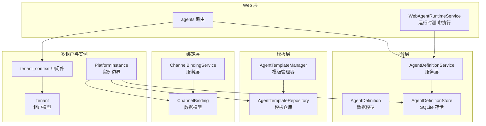
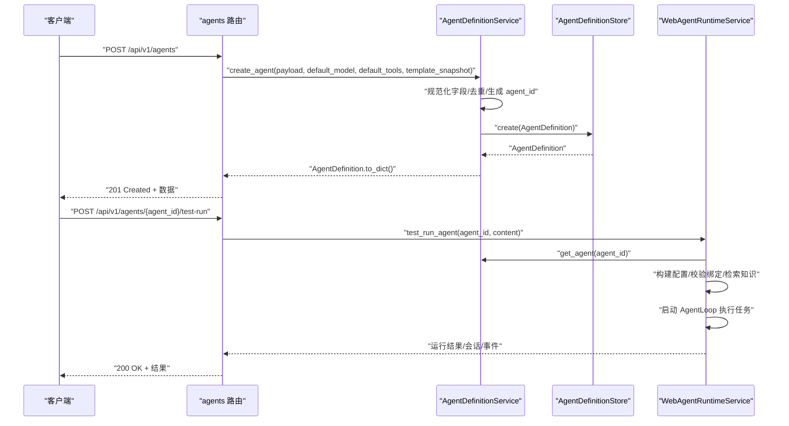
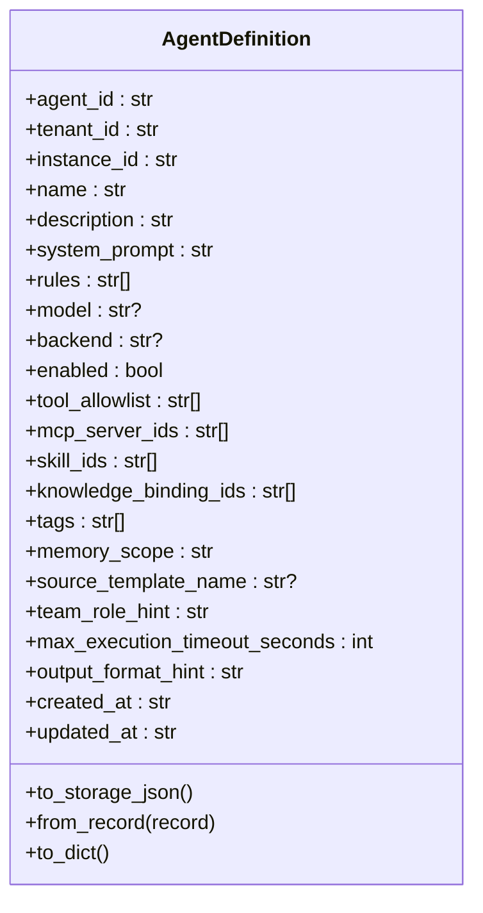
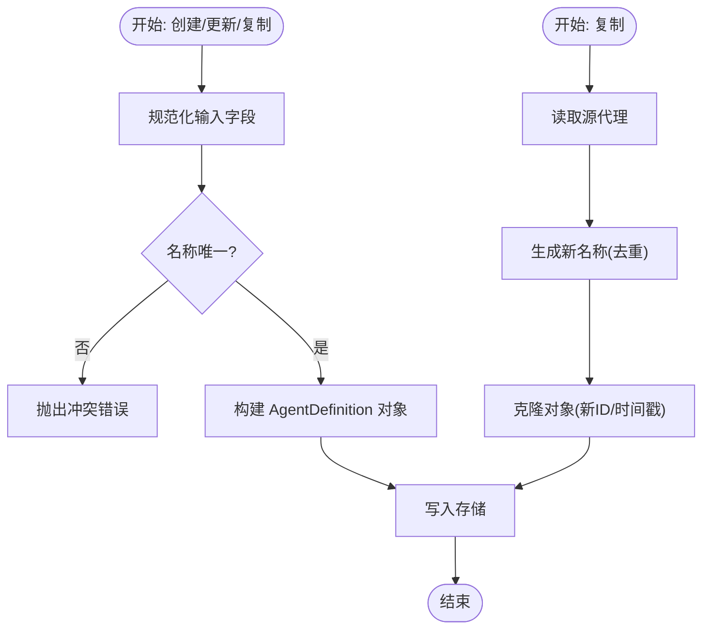
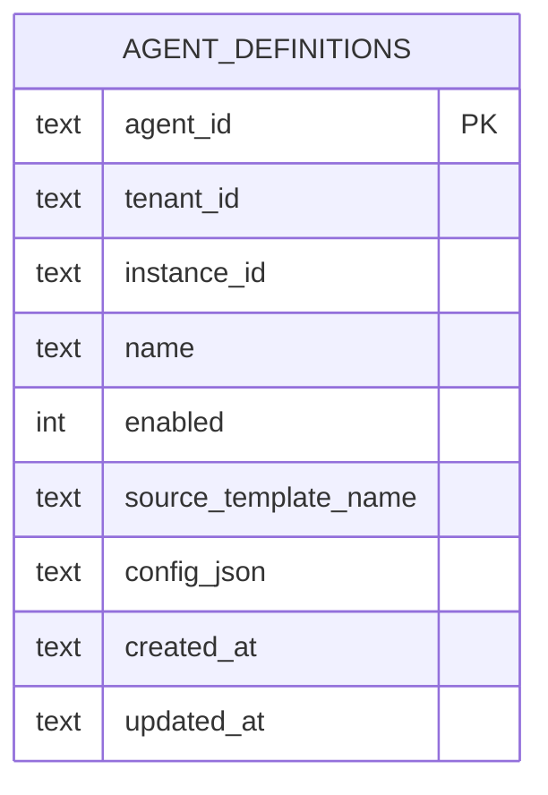
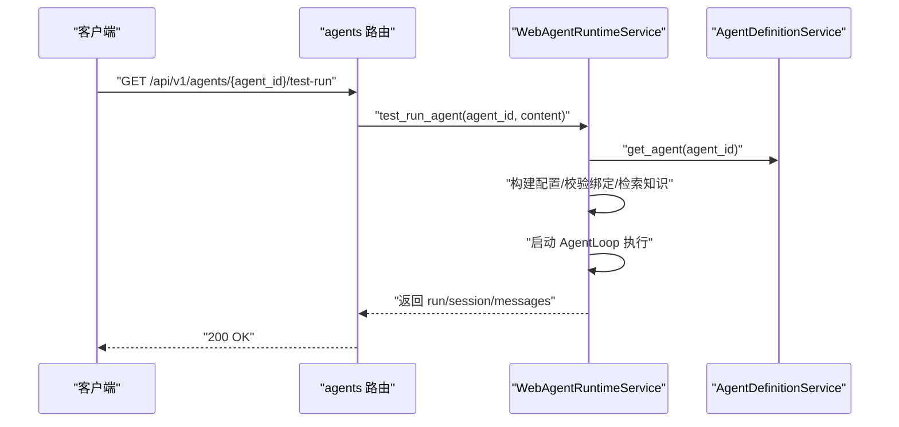
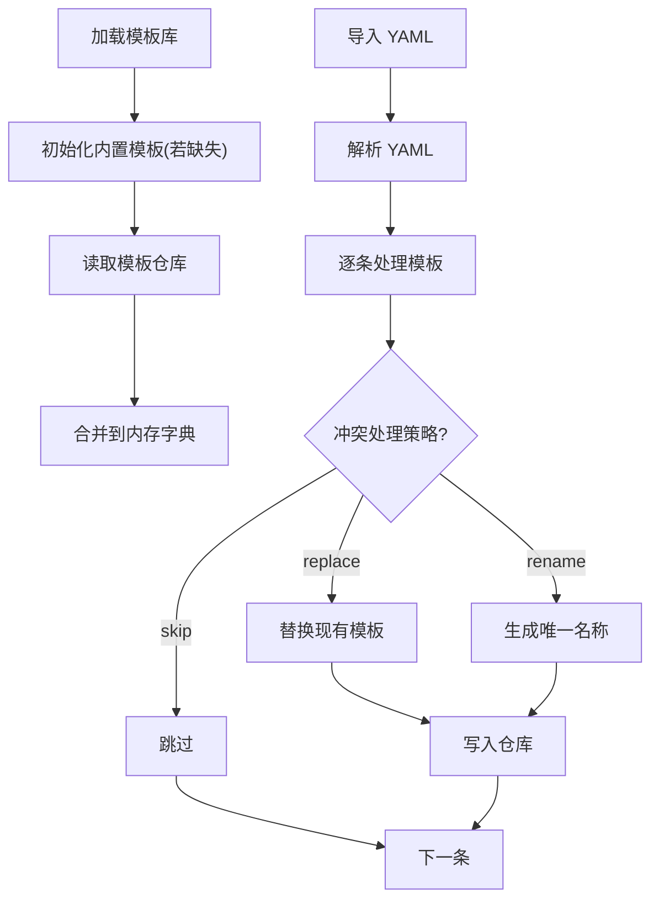
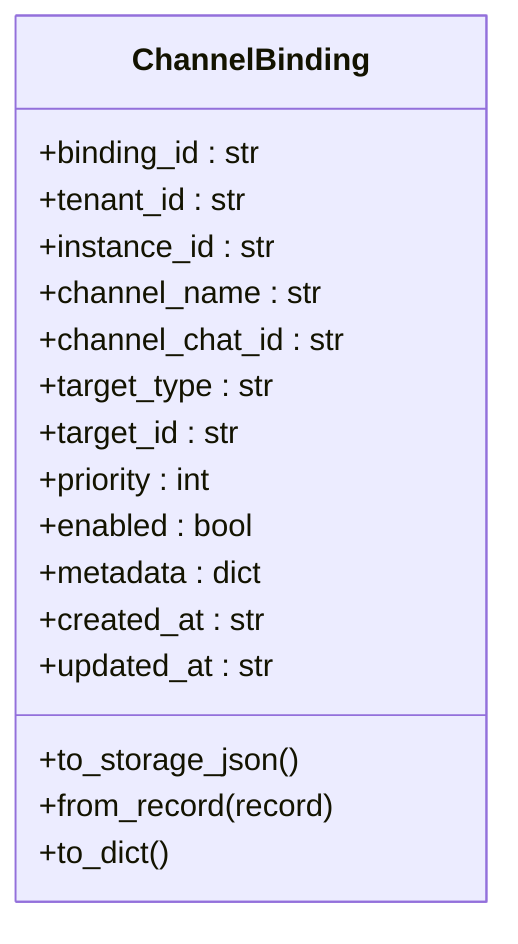
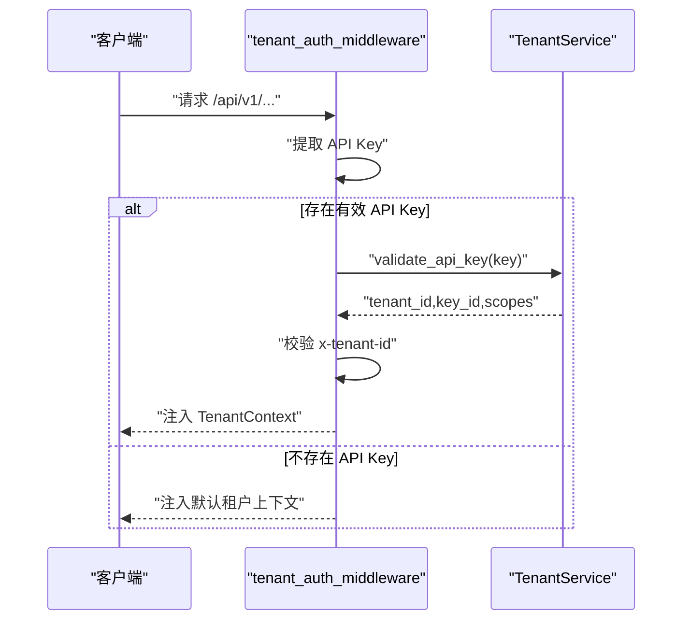
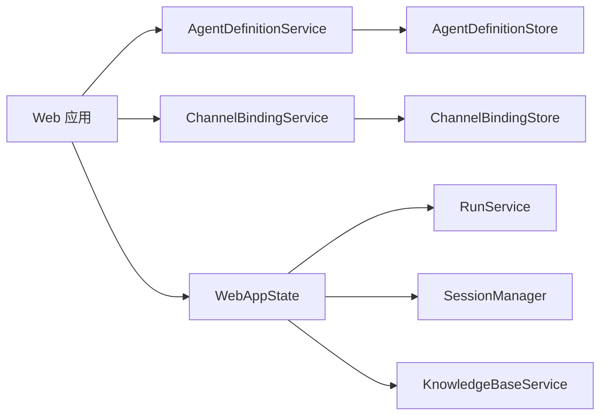

# 代理管理

<cite>
**本文引用的文件**
- [nanobot/platform/agents/models.py](file://nanobot/platform/agents/models.py)
- [nanobot/platform/agents/service.py](file://nanobot/platform/agents/service.py)
- [nanobot/platform/agents/store.py](file://nanobot/platform/agents/store.py)
- [nanobot/web/routers/agents.py](file://nanobot/web/routers/agents.py)
- [nanobot/web/runtime_services/agents.py](file://nanobot/web/runtime_services/agents.py)
- [nanobot/storage/agent_template_repository.py](file://nanobot/storage/agent_template_repository.py)
- [nanobot/services/agent_templates.py](file://nanobot/services/agent_templates.py)
- [nanobot/platform/channel_bindings/models.py](file://nanobot/platform/channel_bindings/models.py)
- [nanobot/platform/channel_bindings/service.py](file://nanobot/platform/channel_bindings/service.py)
- [nanobot/platform/tenants/models.py](file://nanobot/platform/tenants/models.py)
- [nanobot/platform/instances/models.py](file://nanobot/platform/instances/models.py)
- [nanobot/web/app.py](file://nanobot/web/app.py)
- [nanobot/web/tenant_context.py](file://nanobot/web/tenant_context.py)
- [nanobot/web/auth.py](file://nanobot/web/auth.py)
</cite>

## 目录
1. [简介](#简介)
2. [项目结构](#项目结构)
3. [核心组件](#核心组件)
4. [架构总览](#架构总览)
5. [详细组件分析](#详细组件分析)
6. [依赖分析](#依赖分析)
7. [性能考量](#性能考量)
8. [故障排查指南](#故障排查指南)
9. [结论](#结论)
10. [附录](#附录)

## 简介
本文件系统化阐述 Nanobot 代理管理模块的设计与实现，覆盖代理实体的数据模型、存储机制与服务层；解释代理生命周期（创建、查询、更新、删除、启用/禁用、复制）、配置与权限验证；记录代理模板的创建、导入导出与版本化策略；提供 API 接口定义、使用示例与最佳实践；说明代理与渠道绑定的关系管理、运行时调度与监控；最后讨论多租户隔离与安全要点。

## 项目结构
代理管理相关代码主要分布在以下区域：
- 平台层：代理定义数据模型、服务与存储
- Web 层：路由与运行时服务
- 模板层：模板仓库与管理器
- 绑定层：渠道到代理/团队的映射
- 多租户与实例：租户模型、实例边界与认证上下文

图表来源
- [nanobot/platform/agents/models.py:15-109](file://nanobot/platform/agents/models.py#L15-L109)
- [nanobot/platform/agents/service.py:30-404](file://nanobot/platform/agents/service.py#L30-L404)
- [nanobot/platform/agents/store.py:12-206](file://nanobot/platform/agents/store.py#L12-L206)
- [nanobot/web/routers/agents.py:19-162](file://nanobot/web/routers/agents.py#L19-L162)
- [nanobot/web/runtime_services/agents.py:18-401](file://nanobot/web/runtime_services/agents.py#L18-L401)
- [nanobot/storage/agent_template_repository.py:13-205](file://nanobot/storage/agent_template_repository.py#L13-L205)
- [nanobot/services/agent_templates.py:207-566](file://nanobot/services/agent_templates.py#L207-L566)
- [nanobot/platform/channel_bindings/models.py:15-69](file://nanobot/platform/channel_bindings/models.py#L15-L69)
- [nanobot/platform/channel_bindings/service.py:28-201](file://nanobot/platform/channel_bindings/service.py#L28-L201)
- [nanobot/platform/tenants/models.py:15-100](file://nanobot/platform/tenants/models.py#L15-L100)
- [nanobot/platform/instances/models.py:14-111](file://nanobot/platform/instances/models.py#L14-L111)
- [nanobot/web/tenant_context.py:26-108](file://nanobot/web/tenant_context.py#L26-L108)

章节来源
- [nanobot/platform/agents/models.py:1-109](file://nanobot/platform/agents/models.py#L1-L109)
- [nanobot/platform/agents/service.py:1-404](file://nanobot/platform/agents/service.py#L1-L404)
- [nanobot/platform/agents/store.py:1-206](file://nanobot/platform/agents/store.py#L1-L206)
- [nanobot/web/routers/agents.py:1-162](file://nanobot/web/routers/agents.py#L1-L162)
- [nanobot/web/runtime_services/agents.py:1-401](file://nanobot/web/runtime_services/agents.py#L1-L401)
- [nanobot/storage/agent_template_repository.py:1-205](file://nanobot/storage/agent_template_repository.py#L1-L205)
- [nanobot/services/agent_templates.py:1-566](file://nanobot/services/agent_templates.py#L1-L566)
- [nanobot/platform/channel_bindings/models.py:1-69](file://nanobot/platform/channel_bindings/models.py#L1-L69)
- [nanobot/platform/channel_bindings/service.py:1-201](file://nanobot/platform/channel_bindings/service.py#L1-L201)
- [nanobot/platform/tenants/models.py:1-100](file://nanobot/platform/tenants/models.py#L1-L100)
- [nanobot/platform/instances/models.py:1-111](file://nanobot/platform/instances/models.py#L1-L111)
- [nanobot/web/tenant_context.py:1-108](file://nanobot/web/tenant_context.py#L1-L108)

## 核心组件
- 代理定义模型：统一承载代理元数据、配置与运行参数，并提供序列化/反序列化能力。
- 代理服务层：负责校验、规范化、去重、命名冲突处理、启用/禁用切换与复制等业务逻辑。
- 代理存储层：基于 SQLite 的实例作用域持久化，提供增删改查与索引优化。
- Web 路由：暴露 REST API，对接服务层与运行时服务，支持模板快照注入与测试运行。
- 运行时服务：封装测试运行、知识检索、绑定校验、会话与运行记录管理。
- 模板仓库与管理器：用户/内置模板的持久化与管理，支持导入导出与工具/技能校验。
- 渠道绑定：将通道与聊天 ID 映射到代理或团队，支持优先级与启用控制。
- 多租户与实例：租户模型、实例路径解析与 API 认证中间件。

章节来源
- [nanobot/platform/agents/models.py:15-109](file://nanobot/platform/agents/models.py#L15-L109)
- [nanobot/platform/agents/service.py:30-404](file://nanobot/platform/agents/service.py#L30-L404)
- [nanobot/platform/agents/store.py:12-206](file://nanobot/platform/agents/store.py#L12-L206)
- [nanobot/web/routers/agents.py:43-162](file://nanobot/web/routers/agents.py#L43-L162)
- [nanobot/web/runtime_services/agents.py:18-401](file://nanobot/web/runtime_services/agents.py#L18-L401)
- [nanobot/storage/agent_template_repository.py:13-205](file://nanobot/storage/agent_template_repository.py#L13-L205)
- [nanobot/services/agent_templates.py:207-566](file://nanobot/services/agent_templates.py#L207-L566)
- [nanobot/platform/channel_bindings/models.py:15-69](file://nanobot/platform/channel_bindings/models.py#L15-L69)
- [nanobot/platform/channel_bindings/service.py:28-201](file://nanobot/platform/channel_bindings/service.py#L28-L201)
- [nanobot/platform/tenants/models.py:15-100](file://nanobot/platform/tenants/models.py#L15-L100)
- [nanobot/platform/instances/models.py:14-111](file://nanobot/platform/instances/models.py#L14-L111)
- [nanobot/web/tenant_context.py:26-108](file://nanobot/web/tenant_context.py#L26-L108)

## 架构总览
下图展示从 Web 请求到代理运行时的端到端流程，包括模板解析、服务层校验、存储持久化与运行时执行。

图表来源
- [nanobot/web/routers/agents.py:52-162](file://nanobot/web/routers/agents.py#L52-L162)
- [nanobot/platform/agents/service.py:348-364](file://nanobot/platform/agents/service.py#L348-L364)
- [nanobot/platform/agents/store.py:110-144](file://nanobot/platform/agents/store.py#L110-L144)
- [nanobot/web/runtime_services/agents.py:362-401](file://nanobot/web/runtime_services/agents.py#L362-L401)

## 详细组件分析

### 代理定义数据模型
- 关键字段：标识、租户与实例作用域、名称、描述、系统提示词、规则、模型/后端、启用状态、工具白名单、MCP 服务器列表、技能 ID 列表、知识绑定 ID 列表、标签、内存作用域、模板来源、角色提示、超时与输出格式提示、时间戳。
- 序列化：提供 to_storage_json 与 from_record，确保与存储结构一致；to_dict 提供对外 API 字段名转换。
- 时间戳：统一使用 UTC ISO 格式，便于跨时区一致性。

图表来源
- [nanobot/platform/agents/models.py:15-109](file://nanobot/platform/agents/models.py#L15-L109)

章节来源
- [nanobot/platform/agents/models.py:15-109](file://nanobot/platform/agents/models.py#L15-L109)

### 代理服务层（CRUD、校验、复制、启用/禁用）
- 校验与规范化：文本字段、字符串列表、正整数范围、唯一性检查（名称）。
- 命名策略：slug 化基础名，冲突自动追加序号；复制时自动生成不冲突的新名称。
- 复制：保留源代理关键字段，生成新 agent_id 与时间戳。
- 启用/禁用：原子更新 enabled 字段并刷新 updated_at。
- 错误类型：未找到、冲突、校验失败。

图表来源
- [nanobot/platform/agents/service.py:120-242](file://nanobot/platform/agents/service.py#L120-L242)
- [nanobot/platform/agents/service.py:380-396](file://nanobot/platform/agents/service.py#L380-L396)

章节来源
- [nanobot/platform/agents/service.py:30-404](file://nanobot/platform/agents/service.py#L30-L404)

### 代理存储层（SQLite）
- 表结构：主键 agent_id，tenant_id 与 instance_id 参与查询与索引；存储 config_json；带多个索引优化查询。
- 查询：按 agent_id、按 tenant+instance+name；支持按 enabled 过滤与排序。
- 写入：插入/更新/删除；更新返回是否影响行数；删除返回布尔值。
- 一致性：创建后重新加载以保证可见性。

图表来源
- [nanobot/platform/agents/store.py:15-34](file://nanobot/platform/agents/store.py#L15-L34)

章节来源
- [nanobot/platform/agents/store.py:12-206](file://nanobot/platform/agents/store.py#L12-L206)

### Web 路由与运行时服务
- 路由：列出、创建、获取、更新、删除、复制、启用、禁用、测试运行。
- 测试运行：构建运行配置、校验绑定、检索知识、创建运行记录、执行 AgentLoop、写入制品、记录进度事件与最终结果。
- 模板快照：根据请求中的模板名解析模板快照，作为默认值来源。

图表来源
- [nanobot/web/routers/agents.py:149-162](file://nanobot/web/routers/agents.py#L149-L162)
- [nanobot/web/runtime_services/agents.py:362-401](file://nanobot/web/runtime_services/agents.py#L362-L401)

章节来源
- [nanobot/web/routers/agents.py:43-162](file://nanobot/web/routers/agents.py#L43-L162)
- [nanobot/web/runtime_services/agents.py:18-401](file://nanobot/web/runtime_services/agents.py#L18-L401)

### 代理模板（创建、导入/导出、版本化）
- 模板仓库：用户/内置模板持久化，支持启用/禁用、系统标记、来源字段。
- 模板管理器：内置默认模板初始化、加载、校验工具与技能、导入 YAML（支持跳过/替换/重命名）、导出 YAML、生成有效工具清单、列出已安装技能。
- 版本化：通过模板名称与来源字段区分；导入时可选择冲突处理策略。

图表来源
- [nanobot/services/agent_templates.py:222-264](file://nanobot/services/agent_templates.py#L222-L264)
- [nanobot/services/agent_templates.py:358-417](file://nanobot/services/agent_templates.py#L358-L417)

章节来源
- [nanobot/storage/agent_template_repository.py:13-205](file://nanobot/storage/agent_template_repository.py#L13-L205)
- [nanobot/services/agent_templates.py:207-566](file://nanobot/services/agent_templates.py#L207-L566)

### 渠道绑定（关系管理）
- 绑定模型：绑定 ID、租户与实例、通道名与聊天 ID、目标类型（agent/team）、目标 ID、优先级、启用状态、元数据。
- 服务层：校验目标存在性（代理/团队），解析绑定，创建/更新/删除绑定，支持通配聊天 ID。
- 运行时路由：在消息进入时按通道与聊天 ID 解析绑定，决定分发给代理或团队。

图表来源
- [nanobot/platform/channel_bindings/models.py:15-69](file://nanobot/platform/channel_bindings/models.py#L15-L69)

章节来源
- [nanobot/platform/channel_bindings/service.py:28-201](file://nanobot/platform/channel_bindings/service.py#L28-L201)
- [nanobot/platform/channel_bindings/models.py:15-69](file://nanobot/platform/channel_bindings/models.py#L15-L69)

### 多租户与实例隔离
- 租户模型：包含租户 ID、名称、状态、套餐、设置与时间戳。
- 实例模型：提供实例边界下的路径解析（日志、媒体、知识库、运行数据库、模板数据库等），确保不同实例数据隔离。
- 认证中间件：优先 API Key（Bearer 或 X-API-Key），支持 x-tenant-id 头部校验；非 /api/v1/ 路径默认租户上下文为 default；排除健康检查与认证端点。

图表来源
- [nanobot/web/tenant_context.py:26-108](file://nanobot/web/tenant_context.py#L26-L108)
- [nanobot/platform/tenants/models.py:15-100](file://nanobot/platform/tenants/models.py#L15-L100)

章节来源
- [nanobot/platform/tenants/models.py:15-100](file://nanobot/platform/tenants/models.py#L15-L100)
- [nanobot/platform/instances/models.py:14-111](file://nanobot/platform/instances/models.py#L14-L111)
- [nanobot/web/tenant_context.py:26-108](file://nanobot/web/tenant_context.py#L26-L108)

## 依赖分析
- Web 应用装配：在应用生命周期中创建并注入各服务实例（代理、知识、团队、内存、运行、租户、渠道绑定），并将运行时服务挂载到 WebAppState。
- 服务耦合：AgentDefinitionService 依赖 AgentDefinitionStore；ChannelBindingService 依赖 ChannelBindingStore，并持有代理/团队查找回调以进行目标校验。
- 运行时依赖：WebAgentRuntimeService 依赖运行记录、会话、知识检索、工具与 MCP 配置、技能加载器等。

图表来源
- [nanobot/web/app.py:83-114](file://nanobot/web/app.py#L83-L114)
- [nanobot/web/app.py:148-185](file://nanobot/web/app.py#L148-L185)

章节来源
- [nanobot/web/app.py:70-200](file://nanobot/web/app.py#L70-L200)

## 性能考量
- 存储索引：按 tenant_id、instance_id、updated_at 与 name 建立复合索引，提升按租户/实例过滤与排序效率。
- 查询优化：列表接口支持 enabled 过滤与排序，避免全量扫描。
- 运行时开销：测试运行前先做绑定与知识检索校验，减少无效执行；运行记录与制品落盘需注意 I/O 压力。
- 并发安全：模板管理器内部使用线程锁保护内存模板字典，避免并发写入竞争。

## 故障排查指南
- 代理未找到：检查 agent_id 与租户上下文是否匹配；确认中间件注入的 tenant_id 是否正确。
- 名称冲突：创建/更新时若名称重复会触发冲突错误；请修改名称或使用复制。
- 校验失败：检查必填字段（如 systemPrompt）、字段类型（列表必须为字符串列表）、数值范围（超时秒数）。
- 绑定错误：目标类型必须为 agent 或 team；目标 ID 必须存在；MCP 服务器必须启用且可用。
- API Key 无效：确认请求头 Authorization: Bearer 或 X-API-Key；核对 x-tenant-id 与密钥所属租户一致。
- 运行异常：查看运行记录事件与制品内容，定位工具/技能/MCP/知识检索问题。

章节来源
- [nanobot/platform/agents/service.py:13-23](file://nanobot/platform/agents/service.py#L13-L23)
- [nanobot/platform/channel_bindings/service.py:13-23](file://nanobot/platform/channel_bindings/service.py#L13-L23)
- [nanobot/web/tenant_context.py:64-82](file://nanobot/web/tenant_context.py#L64-L82)
- [nanobot/web/runtime_services/agents.py:340-343](file://nanobot/web/runtime_services/agents.py#L340-L343)

## 结论
代理管理模块以清晰的三层架构（模型/服务/存储）实现代理定义的全生命周期管理，结合模板系统与渠道绑定，形成从“定义—配置—运行—监控”的闭环。多租户与实例边界确保了数据隔离与可扩展性。建议在生产环境中配合严格的 API Key 策略、完善的监控与日志审计，持续优化运行时性能与稳定性。

## 附录

### API 接口文档（概要）
- 列出代理
  - 方法与路径：GET /api/v1/agents
  - 查询参数：enabled（可选）
  - 成功响应：200，返回代理数组
- 创建代理
  - 方法与路径：POST /api/v1/agents
  - 请求体：代理配置（可选包含 templateName/template_name 使用模板快照）
  - 成功响应：201，返回新建代理
  - 可能错误：400（校验失败）、409（名称冲突）
- 获取代理
  - 方法与路径：GET /api/v1/agents/{agent_id}
  - 成功响应：200
  - 可能错误：404（未找到）
- 更新代理
  - 方法与路径：PUT /api/v1/agents/{agent_id}
  - 成功响应：200
  - 可能错误：404/409/400
- 删除代理
  - 方法与路径：DELETE /api/v1/agents/{agent_id}
  - 成功响应：200，返回 {deleted: true}
- 复制代理
  - 方法与路径：POST /api/v1/agents/{agent_id}/copy
  - 成功响应：201
- 启用/禁用代理
  - 方法与路径：POST /api/v1/agents/{agent_id}/enable, /disable
  - 成功响应：200
- 测试运行代理
  - 方法与路径：POST /api/v1/agents/{agent_id}/test-run
  - 请求体：{ content: string }
  - 成功响应：200，返回运行结果与会话摘要

章节来源
- [nanobot/web/routers/agents.py:43-162](file://nanobot/web/routers/agents.py#L43-L162)

### 使用示例（步骤）
- 创建代理
  - 准备配置（名称、系统提示词、工具白名单等），可指定模板名使用模板快照。
  - 发送 POST /api/v1/agents，接收 201 与代理详情。
- 复制代理
  - 发送 POST /api/v1/agents/{agent_id}/copy，接收 201 与复制后的代理。
- 启用/禁用
  - 发送 POST /api/v1/agents/{agent_id}/enable 或 disable。
- 测试运行
  - 发送 POST /api/v1/agents/{agent_id}/test-run，传入任务内容，查看运行结果与会话消息。

章节来源
- [nanobot/web/routers/agents.py:52-162](file://nanobot/web/routers/agents.py#L52-L162)
- [nanobot/web/runtime_services/agents.py:362-401](file://nanobot/web/runtime_services/agents.py#L362-L401)

### 最佳实践
- 模板先行：优先使用模板快照，减少重复配置；定期维护模板库。
- 工具与技能校验：在创建/更新前确保工具与技能可用，避免运行期报错。
- 绑定优先级：合理设置渠道绑定优先级，避免误分流。
- 多租户隔离：严格区分租户上下文，API Key 与 x-tenant-id 配合使用。
- 监控与审计：关注运行事件、制品与知识检索命中情况，建立告警与回溯机制。