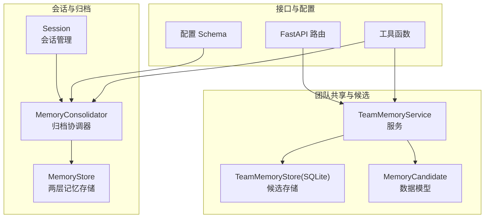
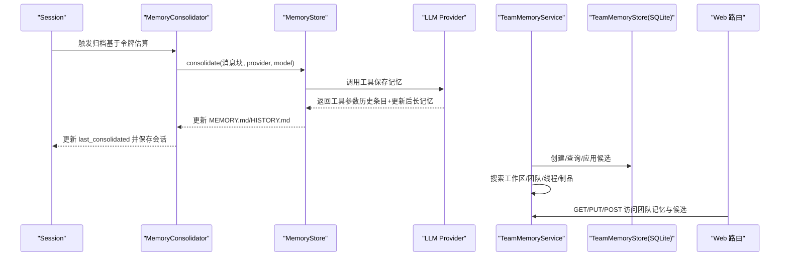
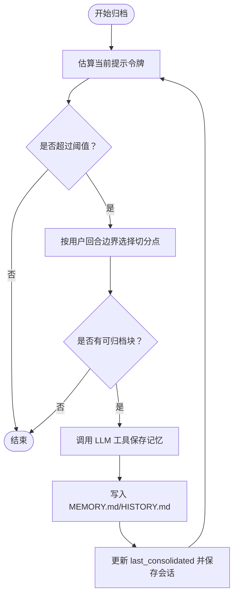
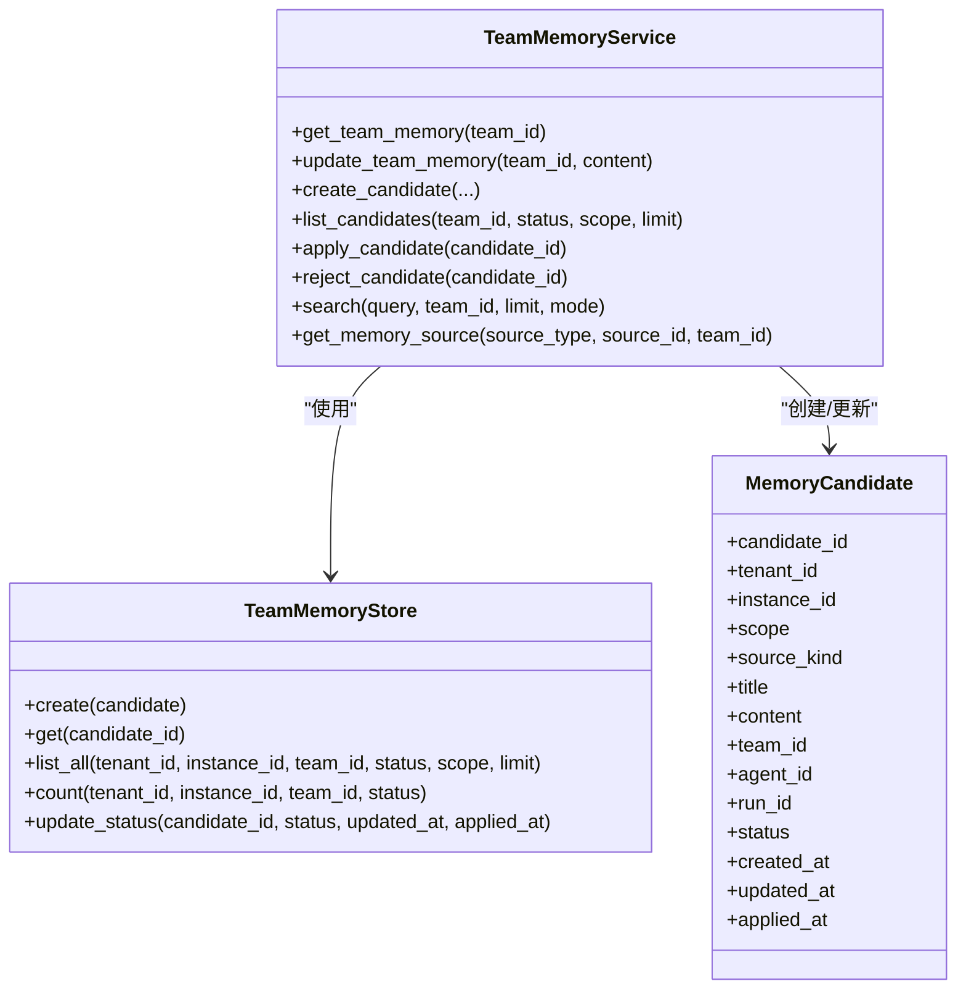
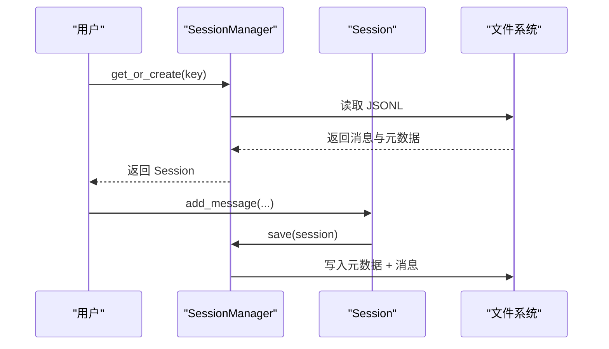
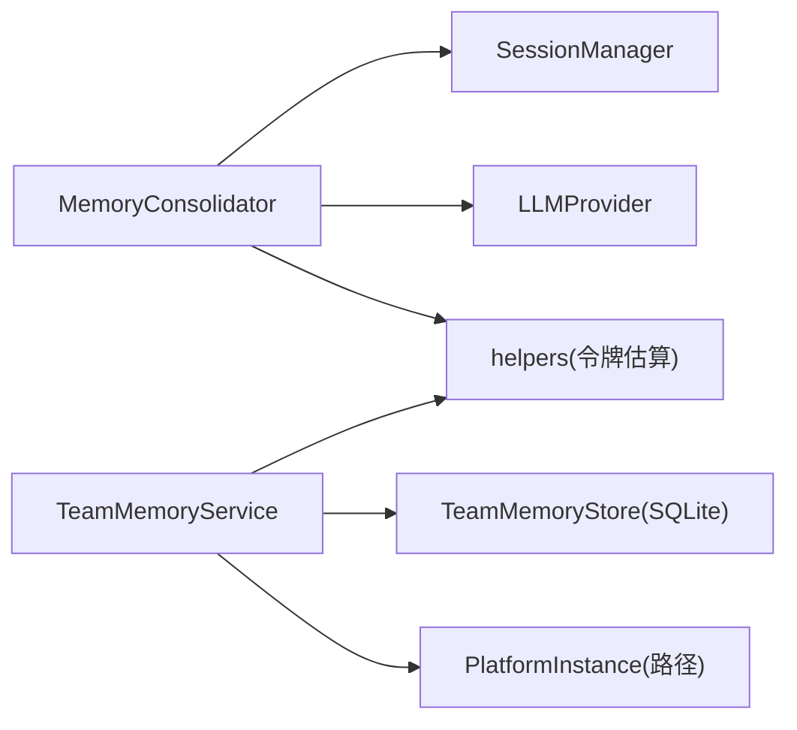

# 内存管理

<cite>
**本文引用的文件**
- [nanobot/agent/memory.py](file://nanobot/agent/memory.py)
- [nanobot/platform/memory/models.py](file://nanobot/platform/memory/models.py)
- [nanobot/platform/memory/service.py](file://nanobot/platform/memory/service.py)
- [nanobot/platform/memory/store.py](file://nanobot/platform/memory/store.py)
- [nanobot/web/routers/memory.py](file://nanobot/web/routers/memory.py)
- [nanobot/config/schema.py](file://nanobot/config/schema.py)
- [nanobot/utils/helpers.py](file://nanobot/utils/helpers.py)
- [nanobot/session/manager.py](file://nanobot/session/manager.py)
- [memory/MEMORY.md](file://memory/MEMORY.md)
- [nanobot/skills/memory/SKILL.md](file://nanobot/skills/memory/SKILL.md)
- [tests/test_memory_service.py](file://tests/test_memory_service.py)
- [web-ui/src/pages/MemoryAuditPage.tsx](file://web-ui/src/pages/MemoryAuditPage.tsx)
</cite>

## 目录
1. [简介](#简介)
2. [项目结构](#项目结构)
3. [核心组件](#核心组件)
4. [架构总览](#架构总览)
5. [详细组件分析](#详细组件分析)
6. [依赖关系分析](#依赖关系分析)
7. [性能与容量管理](#性能与容量管理)
8. [故障排查指南](#故障排查指南)
9. [结论](#结论)
10. [附录](#附录)

## 简介
本文件系统性阐述 Nanobot 的内存管理模块，覆盖以下方面：
- 内存数据模型：两层记忆（长期事实与历史事件）与团队共享候选更新
- 存储策略：本地 Markdown 文件 + SQLite 持久化
- 服务实现：上下文记忆的存储、检索、合并与清理
- 审计与容量管理：搜索模式、候选计数、索引与阈值
- 性能优化：令牌估算、分批归档、并发锁与缓存
- API 接口与配置：REST 路由、配置项与使用示例
- 加密、备份与迁移：现状与建议
- 多用户/多会话并发控制与一致性保证

## 项目结构
围绕“记忆”的核心代码位于以下模块：
- 会话与归档：nanobot/agent/memory.py（两层记忆归档）、nanobot/session/manager.py（会话持久化）
- 团队共享与候选：nanobot/platform/memory/service.py（服务）、nanobot/platform/memory/store.py（SQLite 存储）、nanobot/platform/memory/models.py（数据模型）
- Web API：nanobot/web/routers/memory.py（路由）
- 配置：nanobot/config/schema.py（上下文窗口等）
- 工具：nanobot/utils/helpers.py（令牌估算、安全文件名等）
- 文档与技能：memory/MEMORY.md、nanobot/skills/memory/SKILL.md
- 前端审计页：web-ui/src/pages/MemoryAuditPage.tsx

图表来源
- [nanobot/agent/memory.py:60-285](file://nanobot/agent/memory.py#L60-L285)
- [nanobot/platform/memory/service.py:31-447](file://nanobot/platform/memory/service.py#L31-L447)
- [nanobot/platform/memory/store.py:12-202](file://nanobot/platform/memory/store.py#L12-L202)
- [nanobot/web/routers/memory.py:1-125](file://nanobot/web/routers/memory.py#L1-L125)
- [nanobot/config/schema.py:231-251](file://nanobot/config/schema.py#L231-L251)
- [nanobot/utils/helpers.py:92-171](file://nanobot/utils/helpers.py#L92-L171)
- [nanobot/session/manager.py:16-200](file://nanobot/session/manager.py#L16-L200)

章节来源
- [nanobot/agent/memory.py:60-285](file://nanobot/agent/memory.py#L60-L285)
- [nanobot/platform/memory/service.py:31-447](file://nanobot/platform/memory/service.py#L31-L447)
- [nanobot/platform/memory/store.py:12-202](file://nanobot/platform/memory/store.py#L12-L202)
- [nanobot/web/routers/memory.py:1-125](file://nanobot/web/routers/memory.py#L1-L125)
- [nanobot/config/schema.py:231-251](file://nanobot/config/schema.py#L231-L251)
- [nanobot/utils/helpers.py:92-171](file://nanobot/utils/helpers.py#L92-L171)
- [nanobot/session/manager.py:16-200](file://nanobot/session/manager.py#L16-L200)

## 核心组件
- 两层记忆归档（MemoryConsolidator + MemoryStore）
  - 将旧消息块归档到 MEMORY.md（长期事实）与 HISTORY.md（事件日志），并调用 LLM 提取关键信息
  - 通过令牌估算与边界选择，按用户回合边界进行分批归档，避免越界
- 团队共享与候选（TeamMemoryService + TeamMemoryStore）
  - 将候选更新（MemoryCandidate）写入 SQLite，支持按团队、作用域、状态查询
  - 支持将候选合并到团队共享记忆文件，并提供搜索与来源解析
- 会话管理（Session + SessionManager）
  - 以 JSONL 形式持久化会话，维护 last_consolidated 偏移，确保归档不修改原始消息列表
- Web API 与配置
  - FastAPI 路由提供团队共享记忆读写、候选列表、搜索、来源解析、应用/拒绝
  - 配置项 context_window_tokens 控制归档触发阈值

章节来源
- [nanobot/agent/memory.py:60-285](file://nanobot/agent/memory.py#L60-L285)
- [nanobot/platform/memory/models.py:14-65](file://nanobot/platform/memory/models.py#L14-L65)
- [nanobot/platform/memory/service.py:31-447](file://nanobot/platform/memory/service.py#L31-L447)
- [nanobot/platform/memory/store.py:12-202](file://nanobot/platform/memory/store.py#L12-L202)
- [nanobot/web/routers/memory.py:1-125](file://nanobot/web/routers/memory.py#L1-L125)
- [nanobot/config/schema.py:231-251](file://nanobot/config/schema.py#L231-L251)
- [nanobot/session/manager.py:16-200](file://nanobot/session/manager.py#L16-L200)

## 架构总览
下图展示从会话到归档、再到团队共享记忆与 API 的整体流程。

图表来源
- [nanobot/agent/memory.py:96-147](file://nanobot/agent/memory.py#L96-L147)
- [nanobot/platform/memory/service.py:348-447](file://nanobot/platform/memory/service.py#L348-L447)
- [nanobot/web/routers/memory.py:32-125](file://nanobot/web/routers/memory.py#L32-L125)

## 详细组件分析

### 两层记忆归档（MemoryConsolidator + MemoryStore）
- 数据模型
  - MEMORY.md：长期事实（偏好、项目上下文、关系等），始终注入上下文
  - HISTORY.md：追加式事件日志，用于 grep 式检索
- 归档策略
  - 选择用户回合边界作为安全切分点，避免破坏上下文连贯性
  - 使用令牌估算与目标阈值（半上下文窗口）循环归档，最多 5 轮
  - 归档完成后更新会话 last_consolidated 并持久化
- 并发控制
  - 按会话键持有 asyncio.Lock，避免并发归档导致的竞争条件
- 错误处理
  - LLM 未调用工具或参数异常时记录警告并跳过
  - 归档异常统一捕获并记录

图表来源
- [nanobot/agent/memory.py:177-285](file://nanobot/agent/memory.py#L177-L285)
- [nanobot/agent/memory.py:96-147](file://nanobot/agent/memory.py#L96-L147)

章节来源
- [nanobot/agent/memory.py:60-285](file://nanobot/agent/memory.py#L60-L285)
- [memory/MEMORY.md:1-24](file://memory/MEMORY.md#L1-L24)
- [nanobot/skills/memory/SKILL.md:1-38](file://nanobot/skills/memory/SKILL.md#L1-L38)

### 团队共享与候选（TeamMemoryService + TeamMemoryStore + MemoryCandidate）
- 数据模型
  - MemoryCandidate：候选记忆条目，包含作用域、来源类型、标题、内容、状态、时间戳等
- 服务能力
  - 获取/更新团队共享记忆文件
  - 创建候选、列出候选、按状态/范围过滤
  - 应用候选（合并到团队共享记忆）与拒绝候选
  - 搜索：工作区共享记忆、团队共享记忆、团队线程、运行制品、候选（已应用的候选不再重复搜索）
- 存储
  - SQLite 表 memory_candidates，带多索引（团队/状态/更新时间、运行 ID、作用域/状态/更新时间）
  - 支持按租户/实例/团队/状态/范围查询与计数

图表来源
- [nanobot/platform/memory/models.py:14-65](file://nanobot/platform/memory/models.py#L14-L65)
- [nanobot/platform/memory/store.py:12-202](file://nanobot/platform/memory/store.py#L12-L202)
- [nanobot/platform/memory/service.py:31-447](file://nanobot/platform/memory/service.py#L31-L447)

章节来源
- [nanobot/platform/memory/models.py:14-65](file://nanobot/platform/memory/models.py#L14-L65)
- [nanobot/platform/memory/store.py:12-202](file://nanobot/platform/memory/store.py#L12-L202)
- [nanobot/platform/memory/service.py:31-447](file://nanobot/platform/memory/service.py#L31-L447)

### 会话管理与持久化（Session + SessionManager）
- 会话结构
  - messages：追加式消息列表
  - last_consolidated：已归档消息的偏移量，不影响 get_history 输出
- 持久化
  - JSONL 文件，首行元数据包含 created_at、updated_at、metadata、last_consolidated
  - 支持缓存与迁移（从旧路径迁移）

图表来源
- [nanobot/session/manager.py:96-190](file://nanobot/session/manager.py#L96-L190)

章节来源
- [nanobot/session/manager.py:16-200](file://nanobot/session/manager.py#L16-L200)

### Web API 与前端审计
- 路由
  - 获取/更新团队共享记忆
  - 列出候选、搜索、获取来源、应用/拒绝候选
- 前端审计页
  - 展示团队、共享记忆、候选、线程与最近运行，支持搜索与模式切换

章节来源
- [nanobot/web/routers/memory.py:1-125](file://nanobot/web/routers/memory.py#L1-L125)
- [web-ui/src/pages/MemoryAuditPage.tsx:138-359](file://web-ui/src/pages/MemoryAuditPage.tsx#L138-L359)

## 依赖关系分析
- 组件耦合
  - MemoryConsolidator 依赖 SessionManager（读取/保存会话）与 LLMProvider（工具调用）
  - TeamMemoryService 依赖 TeamMemoryStore（SQLite）与平台实例路径（团队共享记忆文件）
  - 所有组件依赖 utils.helpers 的令牌估算与安全文件名等工具
- 外部依赖
  - SQLite（TeamMemoryStore）
  - LLM 工具调用（MemoryStore 调用 provider.chat_with_retry）
  - FastAPI（Web 路由）

图表来源
- [nanobot/agent/memory.py:154-171](file://nanobot/agent/memory.py#L154-L171)
- [nanobot/platform/memory/service.py:34-51](file://nanobot/platform/memory/service.py#L34-L51)
- [nanobot/utils/helpers.py:92-171](file://nanobot/utils/helpers.py#L92-L171)

章节来源
- [nanobot/agent/memory.py:154-171](file://nanobot/agent/memory.py#L154-L171)
- [nanobot/platform/memory/service.py:34-51](file://nanobot/platform/memory/service.py#L34-L51)
- [nanobot/utils/helpers.py:92-171](file://nanobot/utils/helpers.py#L92-L171)

## 性能与容量管理
- 令牌估算与归档
  - 通过 estimate_prompt_tokens_chain 优先使用 provider 自带计数器，回退到 tiktoken
  - 归档阈值为目标窗口的一半，避免频繁归档；最多 5 轮，防止无限循环
- 搜索与索引
  - SQLite 多索引加速按团队/状态/更新时间与作用域/状态/更新时间的查询
  - 搜索模式支持语义与混合模式，阈值与预览构建提升检索效率
- 缓存与文件系统
  - SessionManager 对会话对象做内存缓存，减少磁盘 IO
  - HISTORY.md 追加式写入，适合 grep/工具链检索
- 配置项
  - context_window_tokens 控制归档触发阈值；max_tool_iterations 控制工具调用上限

章节来源
- [nanobot/utils/helpers.py:92-171](file://nanobot/utils/helpers.py#L92-L171)
- [nanobot/platform/memory/store.py:15-39](file://nanobot/platform/memory/store.py#L15-L39)
- [nanobot/config/schema.py:231-251](file://nanobot/config/schema.py#L231-L251)

## 故障排查指南
- 归档失败
  - 现象：LLM 未调用工具或参数异常
  - 处理：检查工具定义与模型输出；查看日志警告
- 候选应用失败
  - 现象：候选不存在或状态异常
  - 处理：确认候选 ID 与状态；检查数据库更新结果
- 搜索无命中
  - 现象：查询为空或分数低于阈值
  - 处理：调整模式（semantic/hybrid），检查内容是否为空
- 并发冲突
  - 现象：多会话同时归档导致竞争
  - 处理：使用会话级锁；避免手动修改 last_consolidated

章节来源
- [nanobot/agent/memory.py:115-146](file://nanobot/agent/memory.py#L115-L146)
- [nanobot/platform/memory/service.py:23-29](file://nanobot/platform/memory/service.py#L23-L29)
- [nanobot/platform/memory/service.py:410-447](file://nanobot/platform/memory/service.py#L410-L447)

## 结论
Nanobot 的内存管理采用“两层记忆 + 团队候选”的双轨设计：短期会话通过归档保持上下文窗口稳定，长期知识沉淀到 Markdown 文件；团队共享候选通过 SQLite 管理与审核，最终合并到团队共享记忆。配合令牌估算、并发锁与多索引，系统在多用户/多会话环境下实现了高效、可审计的记忆管理。

## 附录

### API 接口清单
- 获取团队共享记忆
  - 方法：GET /api/v1/teams/{team_id}/memory
  - 参数：team_id
  - 返回：团队 ID、内容、文件名、候选数量、更新时间
- 更新团队共享记忆
  - 方法：PUT /api/v1/teams/{team_id}/memory
  - 请求体：content
  - 返回：同上
- 列出候选
  - 方法：GET /api/v1/memory-candidates
  - 查询参数：teamId、status、scope、limit
  - 返回：items、total
- 搜索记忆
  - 方法：POST /api/v1/memory-search
  - 请求体：query、teamId、limit、mode
  - 返回：查询词、模式、命中项列表
- 获取来源
  - 方法：POST /api/v1/memory-get
  - 请求体：sourceType、sourceId、teamId
  - 返回：来源类型、ID、标题、内容、元数据
- 应用候选
  - 方法：POST /api/v1/memory-candidates/{candidate_id}/apply
  - 返回：更新后的候选
- 拒绝候选
  - 方法：POST /api/v1/memory-candidates/{candidate_id}/reject
  - 返回：更新后的候选

章节来源
- [nanobot/web/routers/memory.py:32-125](file://nanobot/web/routers/memory.py#L32-L125)

### 配置选项
- agents.defaults.context_window_tokens：上下文窗口大小，影响归档触发阈值
- agents.defaults.max_tool_iterations：工具调用最大轮次
- 兼容字段 memory_window：已废弃，系统会给出兼容警告

章节来源
- [nanobot/config/schema.py:231-251](file://nanobot/config/schema.py#L231-L251)
- [tests/test_config_migration.py:11-53](file://tests/test_config_migration.py#L11-L53)

### 使用示例（步骤）
- 在会话中积累消息，达到阈值后自动归档至 MEMORY.md/HISTORY.md
- 通过 Web UI 或 API 查看团队共享记忆与候选
- 审核候选并应用，将其合并到团队共享记忆文件
- 使用搜索功能在工作区/团队/线程/制品间检索

章节来源
- [nanobot/skills/memory/SKILL.md:1-38](file://nanobot/skills/memory/SKILL.md#L1-L38)
- [tests/test_memory_service.py:9-145](file://tests/test_memory_service.py#L9-L145)

### 加密、备份与迁移
- 现状
  - 本地文件与 SQLite 存储，未内置加密与自动备份
- 建议
  - 文件系统层面：对 workspace 目录启用加密卷或外部加密工具
  - 备份：定期复制 memory/ 与 instance 的 memory.db
  - 迁移：遵循会话迁移逻辑（SessionManager 已处理旧路径迁移）

章节来源
- [nanobot/session/manager.py:125-170](file://nanobot/session/manager.py#L125-L170)