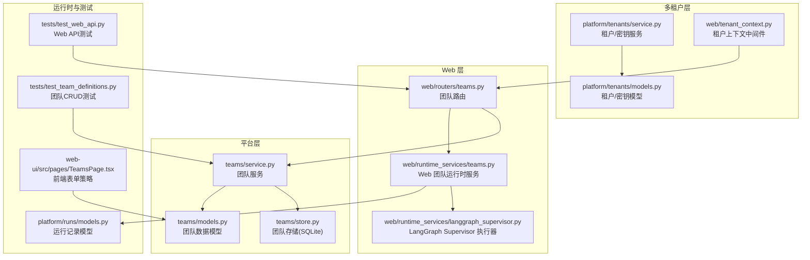
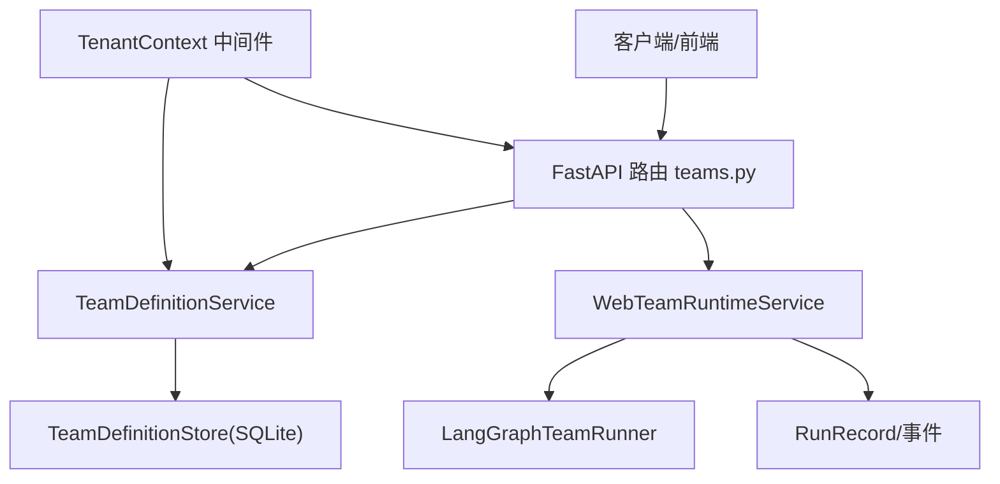
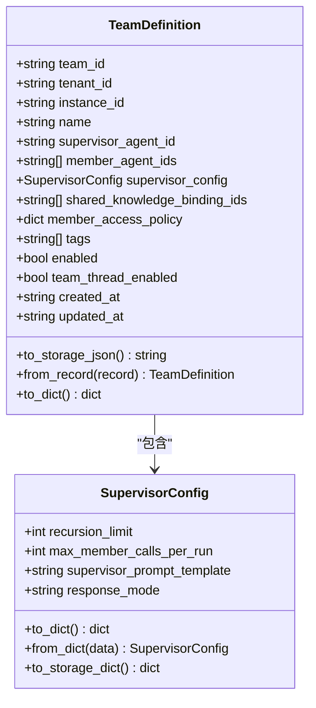
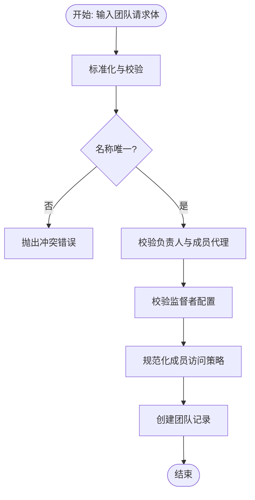
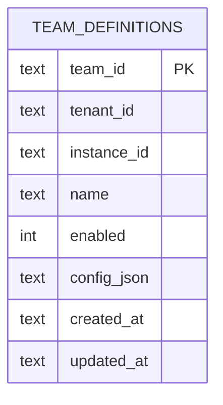
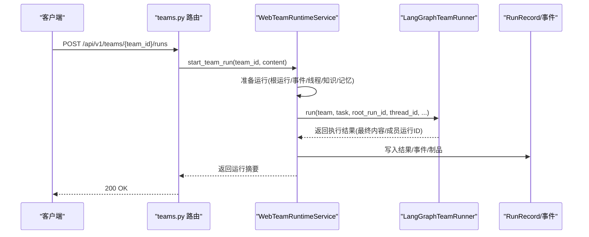
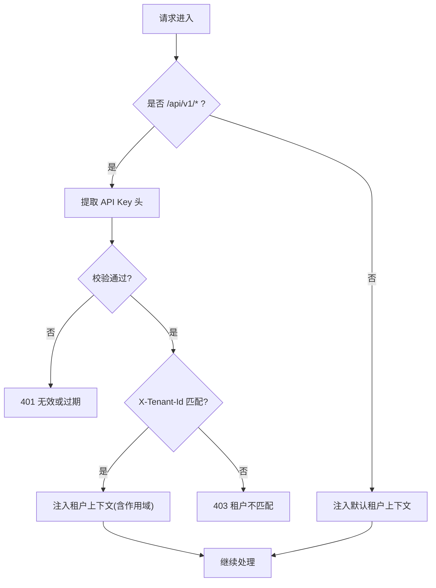
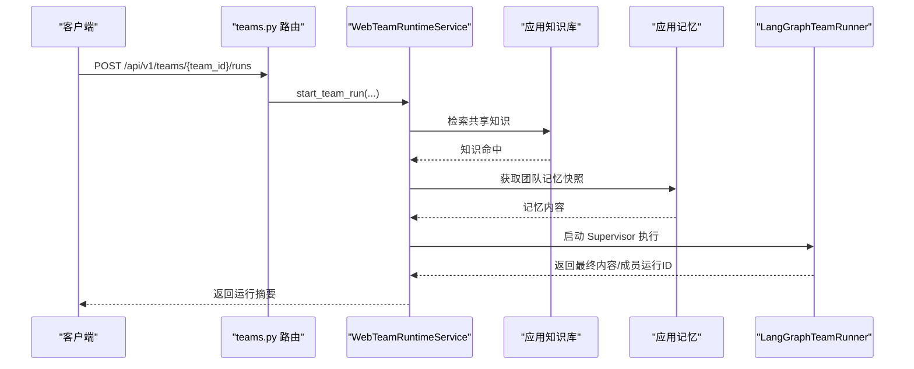
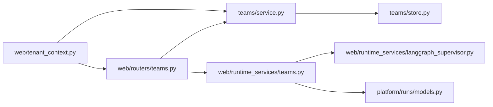

# 团队管理

<cite>
**本文引用的文件**
- [nanobot/platform/teams/models.py](file://nanobot/platform/teams/models.py)
- [nanobot/platform/teams/service.py](file://nanobot/platform/teams/service.py)
- [nanobot/platform/teams/store.py](file://nanobot/platform/teams/store.py)
- [nanobot/web/routers/teams.py](file://nanobot/web/routers/teams.py)
- [nanobot/web/runtime_services/teams.py](file://nanobot/web/runtime_services/teams.py)
- [nanobot/web/runtime_services/langgraph_supervisor.py](file://nanobot/web/runtime_services/langgraph_supervisor.py)
- [nanobot/platform/tenants/models.py](file://nanobot/platform/tenants/models.py)
- [nanobot/platform/tenants/service.py](file://nanobot/platform/tenants/service.py)
- [nanobot/web/tenant_context.py](file://nanobot/web/tenant_context.py)
- [nanobot/platform/runs/models.py](file://nanobot/platform/runs/models.py)
- [tests/test_team_definitions.py](file://tests/test_team_definitions.py)
- [tests/test_web_api.py](file://tests/test_web_api.py)
- [web-ui/src/pages/TeamsPage.tsx](file://web-ui/src/pages/TeamsPage.tsx)
</cite>

## 目录
1. [简介](#简介)
2. [项目结构](#项目结构)
3. [核心组件](#核心组件)
4. [架构总览](#架构总览)
5. [详细组件分析](#详细组件分析)
6. [依赖分析](#依赖分析)
7. [性能考虑](#性能考虑)
8. [故障排查指南](#故障排查指南)
9. [结论](#结论)
10. [附录](#附录)

## 简介
本文件为 Nanobot 团队管理模块的详细技术文档，覆盖团队数据模型、成员与权限体系、团队生命周期管理（创建、复制、启用/禁用、更新、删除）、运行时协作工作流与线程上下文、以及在多租户环境下的隔离与资源共享策略。文档同时提供 API 接口定义、前端表单策略、运行时执行序列图与数据流图，并给出常见问题排查建议。

## 项目结构
团队管理相关代码主要分布在以下模块：
- 平台层：团队定义的数据模型、服务与存储
- Web 层：团队 API 路由与运行时服务
- 多租户层：租户与 API Key 模型、服务与中间件
- 运行时层：LangGraph Supervisor 执行器与团队运行时服务
- 测试与前端：单元测试、端到端测试与前端表单策略

**图表来源**
- [nanobot/platform/teams/models.py:64-143](file://nanobot/platform/teams/models.py#L64-L143)
- [nanobot/platform/teams/service.py:35-358](file://nanobot/platform/teams/service.py#L35-L358)
- [nanobot/platform/teams/store.py:12-201](file://nanobot/platform/teams/store.py#L12-L201)
- [nanobot/web/routers/teams.py:1-185](file://nanobot/web/routers/teams.py#L1-L185)
- [nanobot/web/runtime_services/teams.py:16-543](file://nanobot/web/runtime_services/teams.py#L16-L543)
- [nanobot/web/runtime_services/langgraph_supervisor.py:462-692](file://nanobot/web/runtime_services/langgraph_supervisor.py#L462-L692)
- [nanobot/platform/tenants/models.py:15-100](file://nanobot/platform/tenants/models.py#L15-L100)
- [nanobot/platform/tenants/service.py:43-191](file://nanobot/platform/tenants/service.py#L43-L191)
- [nanobot/web/tenant_context.py:26-108](file://nanobot/web/tenant_context.py#L26-L108)
- [nanobot/platform/runs/models.py:16-161](file://nanobot/platform/runs/models.py#L16-L161)
- [tests/test_team_definitions.py:28-136](file://tests/test_team_definitions.py#L28-L136)
- [tests/test_web_api.py:1545-1677](file://tests/test_web_api.py#L1545-L1677)
- [web-ui/src/pages/TeamsPage.tsx:67-107](file://web-ui/src/pages/TeamsPage.tsx#L67-L107)

**章节来源**
- [nanobot/platform/teams/models.py:1-143](file://nanobot/platform/teams/models.py#L1-L143)
- [nanobot/platform/teams/service.py:1-358](file://nanobot/platform/teams/service.py#L1-L358)
- [nanobot/platform/teams/store.py:1-201](file://nanobot/platform/teams/store.py#L1-L201)
- [nanobot/web/routers/teams.py:1-185](file://nanobot/web/routers/teams.py#L1-L185)
- [nanobot/web/runtime_services/teams.py:1-543](file://nanobot/web/runtime_services/teams.py#L1-L543)
- [nanobot/web/runtime_services/langgraph_supervisor.py:462-692](file://nanobot/web/runtime_services/langgraph_supervisor.py#L462-L692)
- [nanobot/platform/tenants/models.py:1-100](file://nanobot/platform/tenants/models.py#L1-L100)
- [nanobot/platform/tenants/service.py:1-191](file://nanobot/platform/tenants/service.py#L1-L191)
- [nanobot/web/tenant_context.py:1-108](file://nanobot/web/tenant_context.py#L1-L108)
- [nanobot/platform/runs/models.py:1-161](file://nanobot/platform/runs/models.py#L1-L161)
- [tests/test_team_definitions.py:1-136](file://tests/test_team_definitions.py#L1-L136)
- [tests/test_web_api.py:1545-1677](file://tests/test_web_api.py#L1545-L1677)
- [web-ui/src/pages/TeamsPage.tsx:67-107](file://web-ui/src/pages/TeamsPage.tsx#L67-L107)

## 核心组件
- 数据模型
  - 团队定义：包含团队标识、所属租户与实例、名称、负责人代理、成员代理列表、监督者配置、共享知识绑定、成员访问策略、标签、启用状态、团队线程开关等字段，并提供序列化/反序列化方法。
  - 监督者配置：包含递归限制、每轮最大成员调用次数、监督者提示模板、响应模式等。
- 服务层
  - 团队定义服务：负责团队的标准化校验、唯一性检查、ID 生成、复制、启用/禁用、CRUD 与查询列表。
- 存储层
  - 团队定义存储：基于 SQLite 的持久化，包含索引优化，支持按租户与实例维度查询。
- Web 路由与运行时
  - 路由：提供团队列表、创建、查询、更新、删除、复制、启用/禁用、测试运行、重试运行、团队线程摘要与消息查询等接口。
  - 运行时服务：封装团队运行准备、知识检索、团队记忆、LangGraph Supervisor 执行、事件记录、结果归档与取消任务等。
- 多租户与权限
  - 租户与 API Key：提供租户与 API Key 的模型、服务与校验逻辑。
  - 租户上下文中间件：优先使用 API Key 认证，否则回退默认租户上下文；对特定路径豁免认证。

**章节来源**
- [nanobot/platform/teams/models.py:22-143](file://nanobot/platform/teams/models.py#L22-L143)
- [nanobot/platform/teams/service.py:35-358](file://nanobot/platform/teams/service.py#L35-L358)
- [nanobot/platform/teams/store.py:12-201](file://nanobot/platform/teams/store.py#L12-L201)
- [nanobot/web/routers/teams.py:30-185](file://nanobot/web/routers/teams.py#L30-L185)
- [nanobot/web/runtime_services/teams.py:16-543](file://nanobot/web/runtime_services/teams.py#L16-L543)
- [nanobot/platform/tenants/models.py:15-100](file://nanobot/platform/tenants/models.py#L15-L100)
- [nanobot/platform/tenants/service.py:43-191](file://nanobot/platform/tenants/service.py#L43-L191)
- [nanobot/web/tenant_context.py:26-108](file://nanobot/web/tenant_context.py#L26-L108)

## 架构总览
团队管理采用“模型-服务-存储”三层与“路由-运行时-执行器”的分层设计，结合多租户中间件实现租户级隔离。前端通过 Web API 与运行时服务交互，运行时服务驱动 LangGraph Supervisor 完成团队协作执行。

**图表来源**
- [nanobot/web/routers/teams.py:30-185](file://nanobot/web/routers/teams.py#L30-L185)
- [nanobot/platform/teams/service.py:35-358](file://nanobot/platform/teams/service.py#L35-L358)
- [nanobot/platform/teams/store.py:12-201](file://nanobot/platform/teams/store.py#L12-L201)
- [nanobot/web/runtime_services/teams.py:16-543](file://nanobot/web/runtime_services/teams.py#L16-L543)
- [nanobot/web/runtime_services/langgraph_supervisor.py:462-692](file://nanobot/web/runtime_services/langgraph_supervisor.py#L462-L692)
- [nanobot/platform/runs/models.py:94-161](file://nanobot/platform/runs/models.py#L94-L161)
- [nanobot/web/tenant_context.py:26-108](file://nanobot/web/tenant_context.py#L26-L108)

## 详细组件分析

### 数据模型与访问策略
- 团队定义模型
  - 关键字段：团队 ID、租户 ID、实例 ID、名称、负责人代理 ID、成员代理 ID 列表、监督者配置、共享知识绑定 ID 列表、成员访问策略、标签、启用状态、团队线程开关、时间戳。
  - 序列化：提供存储 JSON 与字典格式转换，兼容旧字段名迁移。
- 成员访问策略
  - 默认策略：团队共享知识库仅显式授权使用；团队共享记忆为负责人写入、成员只读。
  - 前端选项：支持“显式授权使用”、“成员可使用共享知识库”、“仅负责人可使用”；“负责人维护/成员可参考”、“仅负责人使用”、“成员不读取团队记忆”。

**图表来源**
- [nanobot/platform/teams/models.py:22-143](file://nanobot/platform/teams/models.py#L22-L143)

**章节来源**
- [nanobot/platform/teams/models.py:15-143](file://nanobot/platform/teams/models.py#L15-L143)
- [web-ui/src/pages/TeamsPage.tsx:67-107](file://web-ui/src/pages/TeamsPage.tsx#L67-L107)

### 服务层：团队定义服务
- 标准化与校验
  - 名称去重与唯一性检查、ID 生成、复制命名策略。
  - 成员代理 ID 校验与负责人不得在成员列表中。
  - 监督者配置参数范围校验（递归限制、每轮最大成员调用次数、响应模式）。
  - 成员访问策略对象规范化。
- CRUD 与复制
  - 创建、查询、列表、更新、删除、复制、启用/禁用。
- 错误类型
  - 未找到、冲突、校验错误。

**图表来源**
- [nanobot/platform/teams/service.py:180-220](file://nanobot/platform/teams/service.py#L180-L220)
- [nanobot/platform/teams/service.py:171-178](file://nanobot/platform/teams/service.py#L171-L178)
- [nanobot/platform/teams/service.py:95-132](file://nanobot/platform/teams/service.py#L95-L132)
- [nanobot/platform/teams/service.py:82-93](file://nanobot/platform/teams/service.py#L82-L93)

**章节来源**
- [nanobot/platform/teams/service.py:35-358](file://nanobot/platform/teams/service.py#L35-L358)

### 存储层：团队定义存储
- 表结构与索引
  - 主键：团队 ID；复合索引：租户+实例+更新时间、启用状态、名称。
- 查询与操作
  - 按 ID/名称/租户查询、列表过滤（启用状态）、创建/更新/删除。

**图表来源**
- [nanobot/platform/teams/store.py:15-33](file://nanobot/platform/teams/store.py#L15-L33)

**章节来源**
- [nanobot/platform/teams/store.py:12-201](file://nanobot/platform/teams/store.py#L12-L201)

### Web 路由与运行时服务
- 路由接口
  - GET /api/v1/teams：列出团队（可按启用状态过滤）
  - POST /api/v1/teams：创建团队
  - GET /api/v1/teams/{team_id}：获取团队详情
  - GET /api/v1/teams/{team_id}/thread：团队线程摘要
  - GET /api/v1/teams/{team_id}/thread/messages：团队线程消息
  - PUT /api/v1/teams/{team_id}：更新团队
  - DELETE /api/v1/teams/{team_id}：删除团队
  - POST /api/v1/teams/{team_id}/copy：复制团队
  - POST /api/v1/teams/{team_id}/enable：启用团队
  - POST /api/v1/teams/{team_id}/disable：禁用团队
  - POST /api/v1/teams/{team_id}/runs：测试运行团队
  - POST /api/v1/teams/{team_id}/runs/{run_id}/retry：重试运行
- 运行时服务
  - 准备运行：构建根运行、事件记录、线程上下文、知识检索、团队记忆。
  - 执行：LangGraph Supervisor 执行，事件记录，结果归档，线程消息追加。
  - 取消：后台任务跟踪与取消，最终状态更新。

**图表来源**
- [nanobot/web/routers/teams.py:152-164](file://nanobot/web/routers/teams.py#L152-L164)
- [nanobot/web/runtime_services/teams.py:414-451](file://nanobot/web/runtime_services/teams.py#L414-L451)
- [nanobot/web/runtime_services/teams.py:284-413](file://nanobot/web/runtime_services/teams.py#L284-L413)
- [nanobot/web/runtime_services/langgraph_supervisor.py:462-692](file://nanobot/web/runtime_services/langgraph_supervisor.py#L462-L692)
- [nanobot/platform/runs/models.py:94-161](file://nanobot/platform/runs/models.py#L94-L161)

**章节来源**
- [nanobot/web/routers/teams.py:30-185](file://nanobot/web/routers/teams.py#L30-L185)
- [nanobot/web/runtime_services/teams.py:16-543](file://nanobot/web/runtime_services/teams.py#L16-L543)
- [nanobot/web/runtime_services/langgraph_supervisor.py:462-692](file://nanobot/web/runtime_services/langgraph_supervisor.py#L462-L692)
- [nanobot/platform/runs/models.py:16-161](file://nanobot/platform/runs/models.py#L16-L161)

### 多租户隔离与资源共享
- 租户与 API Key
  - 租户模型包含状态、套餐、设置；API Key 模型包含哈希、前缀、作用域、过期时间等。
  - 租户服务提供租户 CRUD、API Key 创建/校验/撤销、列表等。
- 租户上下文中间件
  - 优先从请求头提取 API Key（Authorization 或 X-API-Key），校验后注入租户上下文；否则默认租户。
  - 对 /api/v1/auth/* 与 /api/v1/health 等路径豁免认证。
- 团队数据隔离
  - 存储层以租户 ID 与实例 ID 维度进行查询与过滤，确保跨租户与跨实例隔离。

**图表来源**
- [nanobot/web/tenant_context.py:26-108](file://nanobot/web/tenant_context.py#L26-L108)
- [nanobot/platform/tenants/service.py:121-191](file://nanobot/platform/tenants/service.py#L121-L191)
- [nanobot/platform/teams/store.py:57-82](file://nanobot/platform/teams/store.py#L57-L82)

**章节来源**
- [nanobot/platform/tenants/models.py:15-100](file://nanobot/platform/tenants/models.py#L15-L100)
- [nanobot/platform/tenants/service.py:43-191](file://nanobot/platform/tenants/service.py#L43-L191)
- [nanobot/web/tenant_context.py:26-108](file://nanobot/web/tenant_context.py#L26-L108)
- [nanobot/platform/teams/store.py:57-82](file://nanobot/platform/teams/store.py#L57-L82)

### 权限与协作工作流
- 权限控制点
  - API Key 作用域：创建 API Key 时指定作用域，默认具备读写能力；中间件根据作用域进行访问控制。
  - 团队访问策略：成员访问策略决定共享知识库与共享记忆的使用范围。
- 协作工作流
  - Web 团队运行时服务在执行前构建团队线程上下文、检索共享知识、读取团队记忆，然后启动 LangGraph Supervisor 执行，记录事件并产出制品。
  - 支持重试运行，合并附加上下文，保留原始任务来源信息。

**图表来源**
- [nanobot/web/runtime_services/teams.py:284-413](file://nanobot/web/runtime_services/teams.py#L284-L413)
- [nanobot/web/runtime_services/langgraph_supervisor.py:462-692](file://nanobot/web/runtime_services/langgraph_supervisor.py#L462-L692)

**章节来源**
- [nanobot/web/runtime_services/teams.py:16-543](file://nanobot/web/runtime_services/teams.py#L16-L543)
- [nanobot/web/runtime_services/langgraph_supervisor.py:462-692](file://nanobot/web/runtime_services/langgraph_supervisor.py#L462-L692)

## 依赖分析
- 组件耦合
  - 路由依赖服务层；服务层依赖存储层；运行时服务依赖 LangGraph 执行器与运行记录模型。
  - 多租户中间件贯穿 API 层，影响路由与服务层的租户上下文解析。
- 外部依赖
  - SQLite（存储）、FastAPI（路由）、LangGraph（执行器）、loguru（日志）。

**图表来源**
- [nanobot/web/routers/teams.py:1-185](file://nanobot/web/routers/teams.py#L1-L185)
- [nanobot/platform/teams/service.py:1-358](file://nanobot/platform/teams/service.py#L1-L358)
- [nanobot/platform/teams/store.py:1-201](file://nanobot/platform/teams/store.py#L1-L201)
- [nanobot/web/runtime_services/teams.py:1-543](file://nanobot/web/runtime_services/teams.py#L1-L543)
- [nanobot/web/runtime_services/langgraph_supervisor.py:1-692](file://nanobot/web/runtime_services/langgraph_supervisor.py#L1-L692)
- [nanobot/platform/runs/models.py:1-161](file://nanobot/platform/runs/models.py#L1-L161)
- [nanobot/web/tenant_context.py:1-108](file://nanobot/web/tenant_context.py#L1-L108)

**章节来源**
- [nanobot/web/routers/teams.py:1-185](file://nanobot/web/routers/teams.py#L1-L185)
- [nanobot/platform/teams/service.py:1-358](file://nanobot/platform/teams/service.py#L1-L358)
- [nanobot/platform/teams/store.py:1-201](file://nanobot/platform/teams/store.py#L1-L201)
- [nanobot/web/runtime_services/teams.py:1-543](file://nanobot/web/runtime_services/teams.py#L1-L543)
- [nanobot/web/runtime_services/langgraph_supervisor.py:1-692](file://nanobot/web/runtime_services/langgraph_supervisor.py#L1-L692)
- [nanobot/platform/runs/models.py:1-161](file://nanobot/platform/runs/models.py#L1-L161)
- [nanobot/web/tenant_context.py:1-108](file://nanobot/web/tenant_context.py#L1-L108)

## 性能考虑
- 存储层
  - 使用复合索引加速按租户/实例/启用状态/名称的查询；批量读取时注意 LIMIT 控制。
- 运行时
  - 监督者递归限制与每轮最大成员调用次数可调，避免深度递归导致的性能问题。
  - 线程消息与知识检索按需加载，避免一次性载入过多数据。
- 并发与取消
  - 运行时服务跟踪后台任务，支持取消与清理，防止僵尸任务占用资源。

[本节为通用指导，无需具体文件分析]

## 故障排查指南
- 常见错误与定位
  - 团队未找到：检查团队 ID 是否正确，确认租户上下文是否匹配。
  - 团队冲突：团队名称在同一租户+实例下必须唯一。
  - 校验失败：负责人或成员代理不存在、成员列表包含负责人、监督者配置参数越界。
  - API Key 无效/过期：检查请求头 Authorization 或 X-API-Key，确认租户 ID 匹配。
- 日志与事件
  - 运行时服务在执行过程中会记录关键事件（如知识检索、监督者启动/完成、团队完成），可用于排障。
- 单元与集成测试
  - 团队 CRUD 与复制行为可通过测试用例验证；Web API 的端到端行为也可通过测试覆盖。

**章节来源**
- [nanobot/platform/teams/service.py:18-28](file://nanobot/platform/teams/service.py#L18-L28)
- [nanobot/web/tenant_context.py:64-92](file://nanobot/web/tenant_context.py#L64-L92)
- [nanobot/web/runtime_services/teams.py:300-413](file://nanobot/web/runtime_services/teams.py#L300-L413)
- [tests/test_team_definitions.py:85-136](file://tests/test_team_definitions.py#L85-L136)
- [tests/test_web_api.py:1545-1677](file://tests/test_web_api.py#L1545-L1677)

## 结论
团队管理模块通过清晰的模型-服务-存储分层与 Web 路由-运行时-执行器协同，实现了团队定义的全生命周期管理、多租户隔离与资源共享、以及基于 LangGraph 的协作执行。配合严格的参数校验、访问策略与事件记录，系统在可用性与安全性之间取得平衡。建议在生产环境中合理设置监督者配置参数、监控运行时事件、并结合测试用例保障变更质量。

[本节为总结，无需具体文件分析]

## 附录

### API 接口清单（概要）
- GET /api/v1/teams：列出团队（可选启用状态过滤）
- POST /api/v1/teams：创建团队
- GET /api/v1/teams/{team_id}：获取团队详情
- GET /api/v1/teams/{team_id}/thread：团队线程摘要
- GET /api/v1/teams/{team_id}/thread/messages：团队线程消息（支持 limit）
- PUT /api/v1/teams/{team_id}：更新团队
- DELETE /api/v1/teams/{team_id}：删除团队
- POST /api/v1/teams/{team_id}/copy：复制团队
- POST /api/v1/teams/{team_id}/enable：启用团队
- POST /api/v1/teams/{team_id}/disable：禁用团队
- POST /api/v1/teams/{team_id}/runs：测试运行团队
- POST /api/v1/teams/{team_id}/runs/{run_id}/retry：重试运行

**章节来源**
- [nanobot/web/routers/teams.py:30-185](file://nanobot/web/routers/teams.py#L30-L185)

### 前端表单策略
- 团队共享知识库策略选项：显式授权使用、成员可使用、仅负责人可使用
- 团队共享记忆策略选项：负责人维护/成员可参考、仅负责人使用、成员不读取团队记忆
- 表单初始值与默认策略与模型默认策略一致

**章节来源**
- [web-ui/src/pages/TeamsPage.tsx:67-107](file://web-ui/src/pages/TeamsPage.tsx#L67-L107)
- [nanobot/platform/teams/models.py:15-19](file://nanobot/platform/teams/models.py#L15-L19)