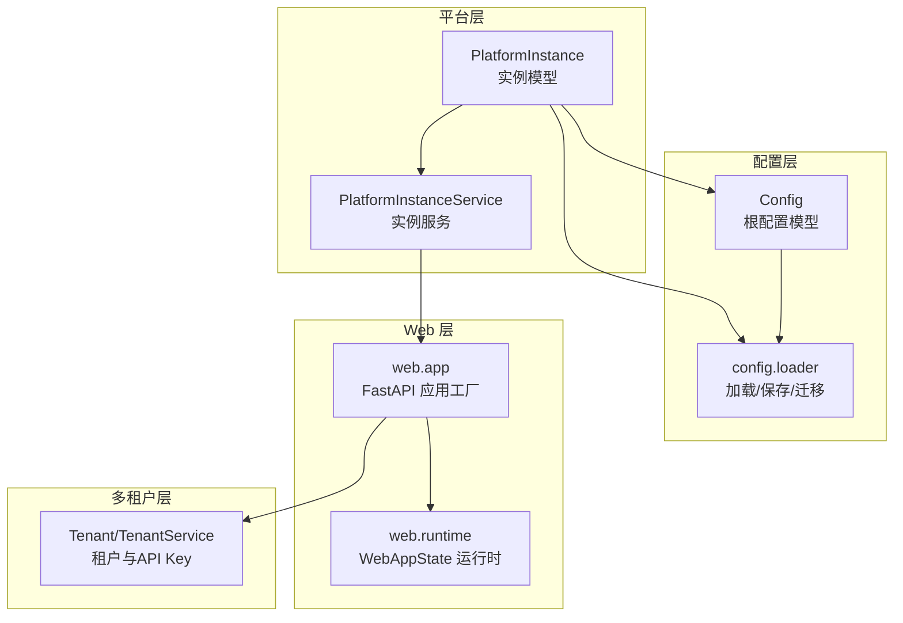
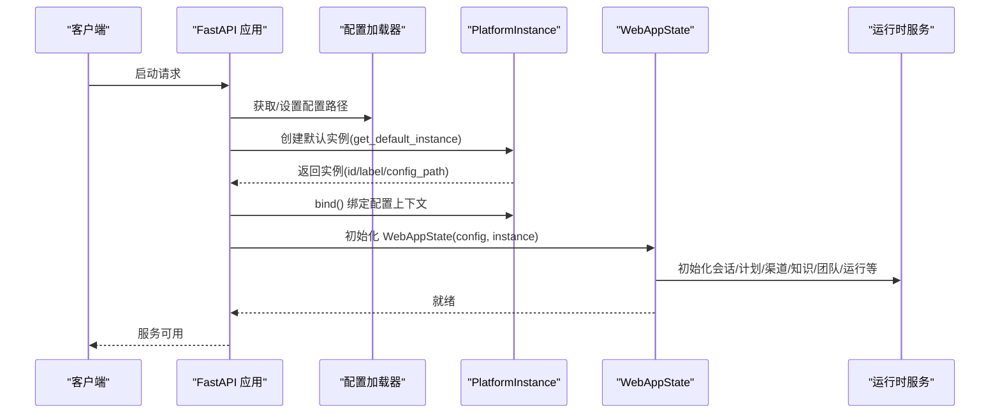
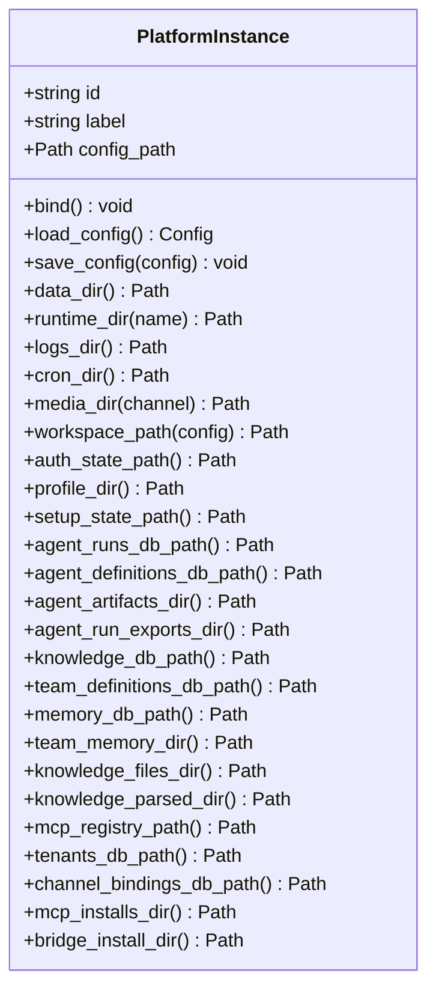
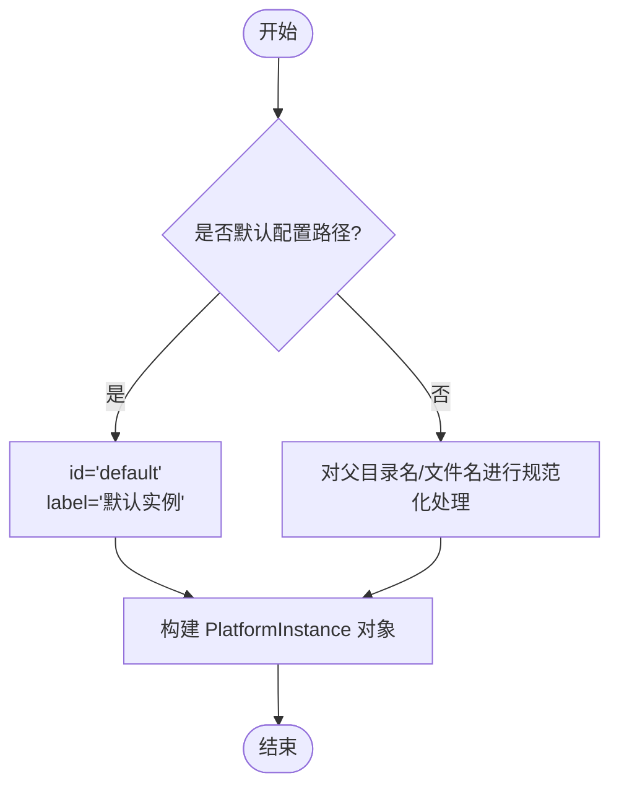
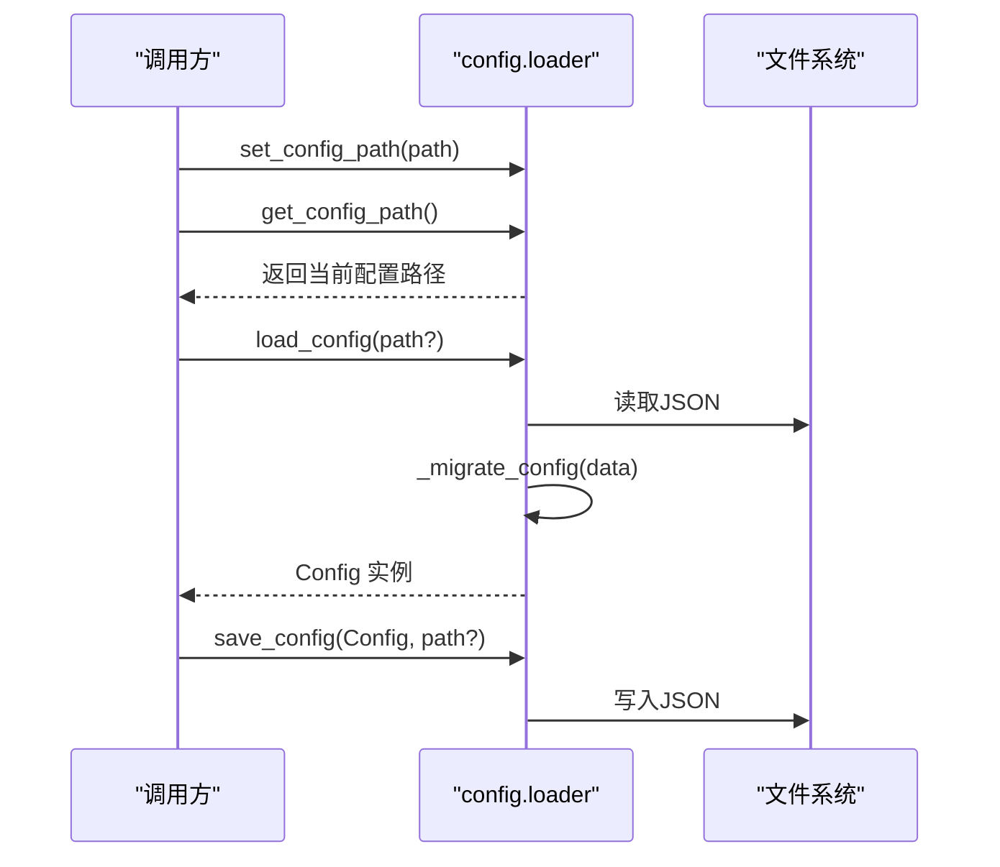
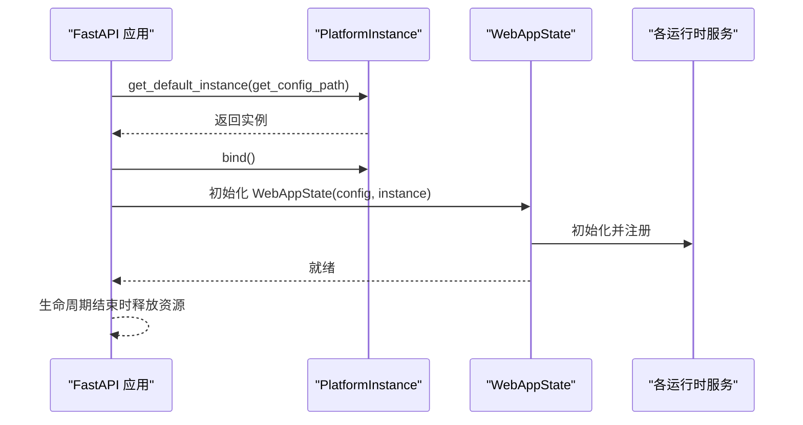
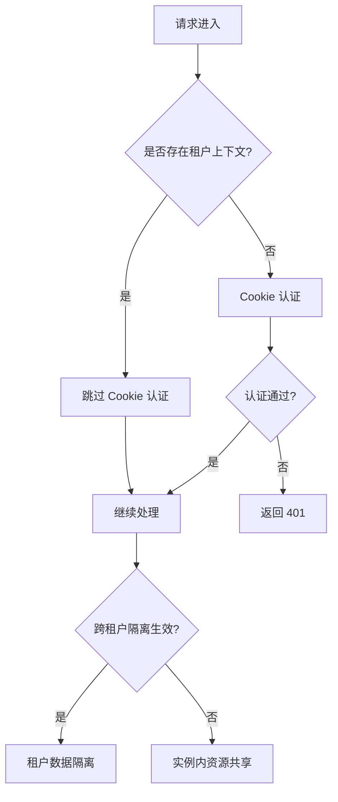
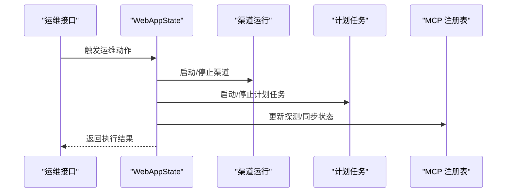
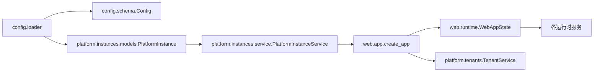

# 实例管理

<cite>
**本文引用的文件**
- [nanobot/platform/instances/models.py](file://nanobot/platform/instances/models.py)
- [nanobot/platform/instances/service.py](file://nanobot/platform/instances/service.py)
- [nanobot/platform/instances/__init__.py](file://nanobot/platform/instances/__init__.py)
- [nanobot/config/schema.py](file://nanobot/config/schema.py)
- [nanobot/config/loader.py](file://nanobot/config/loader.py)
- [nanobot/web/runtime.py](file://nanobot/web/runtime.py)
- [nanobot/web/app.py](file://nanobot/web/app.py)
- [nanobot/platform/tenants/models.py](file://nanobot/platform/tenants/models.py)
- [nanobot/platform/tenants/service.py](file://nanobot/platform/tenants/service.py)
- [nanobot/platform/tenants/__init__.py](file://nanobot/platform/tenants/__init__.py)
- [tests/test_platform_instances.py](file://tests/test_platform_instances.py)
- [tests/test_multi_tenancy.py](file://tests/test_multi_tenancy.py)
- [nanobot/web/routers/tenants.py](file://nanobot/web/routers/tenants.py)
- [nanobot/web/routers/operations.py](file://nanobot/web/routers/operations.py)
- [nanobot/web/mcp_registry.py](file://nanobot/web/mcp_registry.py)
- [nanobot/utils/helpers.py](file://nanobot/utils/helpers.py)
</cite>

## 目录
1. [简介](#简介)
2. [项目结构](#项目结构)
3. [核心组件](#核心组件)
4. [架构总览](#架构总览)
5. [详细组件分析](#详细组件分析)
6. [依赖分析](#依赖分析)
7. [性能考虑](#性能考虑)
8. [故障排查指南](#故障排查指南)
9. [结论](#结论)
10. [附录](#附录)

## 简介
本章节面向 Nanobot 的“实例管理”能力，系统化阐述实例的概念、数据模型与管理策略，覆盖从创建、配置、启动、停止到销毁的全生命周期；同时说明资源分配、负载均衡与高可用配置思路，给出 API 接口、关键配置参数与使用示例，并补充监控指标、性能优化与故障恢复机制，以及在多租户架构下的隔离策略与资源共享方案。

## 项目结构
实例管理主要由以下层次构成：
- 平台层实例抽象：定义实例边界、路径解析与配置加载/保存
- 配置层：定义全局配置结构与环境变量映射
- Web 层：应用状态与运行时服务绑定实例上下文
- 多租户层：租户与 API Key 的隔离与认证
- 测试与路由：验证实例路径与租户隔离行为，暴露租户管理 API

图表来源
- [nanobot/platform/instances/models.py:14-111](file://nanobot/platform/instances/models.py#L14-L111)
- [nanobot/platform/instances/service.py:17-43](file://nanobot/platform/instances/service.py#L17-L43)
- [nanobot/config/schema.py:351-450](file://nanobot/config/schema.py#L351-L450)
- [nanobot/config/loader.py:13-82](file://nanobot/config/loader.py#L13-L82)
- [nanobot/web/app.py:70-185](file://nanobot/web/app.py#L70-L185)
- [nanobot/web/runtime.py:72-114](file://nanobot/web/runtime.py#L72-L114)
- [nanobot/platform/tenants/service.py:43-94](file://nanobot/platform/tenants/service.py#L43-L94)

章节来源
- [nanobot/platform/instances/models.py:14-111](file://nanobot/platform/instances/models.py#L14-L111)
- [nanobot/platform/instances/service.py:17-43](file://nanobot/platform/instances/service.py#L17-L43)
- [nanobot/config/schema.py:351-450](file://nanobot/config/schema.py#L351-L450)
- [nanobot/config/loader.py:13-82](file://nanobot/config/loader.py#L13-L82)
- [nanobot/web/app.py:70-185](file://nanobot/web/app.py#L70-L185)
- [nanobot/web/runtime.py:72-114](file://nanobot/web/runtime.py#L72-L114)
- [nanobot/platform/tenants/service.py:43-94](file://nanobot/platform/tenants/service.py#L43-L94)

## 核心组件
- 实例模型（PlatformInstance）
  - 职责：封装单个实例的标识、标签、配置路径，提供绑定当前配置上下文、加载/保存配置、计算运行时目录与数据库/文件路径等能力
  - 关键方法与属性：bind、load_config、save_config、data_dir、runtime_dir、logs_dir、cron_dir、media_dir、workspace_path、各类数据库与目录路径
- 实例服务（PlatformInstanceService）
  - 职责：根据当前配置路径推导默认实例 ID 与标签，支持从路径或实例对象进行统一转换
  - 关键方法：get_default_instance、coerce_instance
- 配置模型（Config）
  - 职责：定义全局配置结构（代理、通道、提供商、网关、工具等），提供工作空间路径解析与提供商匹配逻辑
- 配置加载器（config.loader）
  - 职责：设置/获取当前配置路径，加载/保存配置，执行配置迁移
- Web 运行时（WebAppState）
  - 职责：在应用生命周期内绑定实例上下文，初始化各运行时服务（会话、计划任务、渠道等），并提供统一的 API 访问入口
- 多租户（Tenant/TenantService）
  - 职责：租户 CRUD、API Key 管理与校验，保障多租户隔离

章节来源
- [nanobot/platform/instances/models.py:14-111](file://nanobot/platform/instances/models.py#L14-L111)
- [nanobot/platform/instances/service.py:17-43](file://nanobot/platform/instances/service.py#L17-L43)
- [nanobot/config/schema.py:351-450](file://nanobot/config/schema.py#L351-L450)
- [nanobot/config/loader.py:13-82](file://nanobot/config/loader.py#L13-L82)
- [nanobot/web/runtime.py:72-114](file://nanobot/web/runtime.py#L72-L114)
- [nanobot/platform/tenants/models.py:15-36](file://nanobot/platform/tenants/models.py#L15-L36)
- [nanobot/platform/tenants/service.py:43-94](file://nanobot/platform/tenants/service.py#L43-L94)

## 架构总览
实例管理贯穿平台层、配置层与 Web 层，形成“实例边界 → 配置上下文 → 运行时服务”的闭环。Web 应用在启动时基于当前配置路径创建默认实例，并将实例绑定到全局配置上下文，随后初始化各业务运行时服务（如会话、计划任务、渠道、知识库、团队、运行记录等）。多租户层通过中间件与服务在请求链路中实现租户隔离与认证。

图表来源
- [nanobot/web/app.py:70-185](file://nanobot/web/app.py#L70-L185)
- [nanobot/config/loader.py:13-24](file://nanobot/config/loader.py#L13-L24)
- [nanobot/platform/instances/service.py:20-36](file://nanobot/platform/instances/service.py#L20-L36)
- [nanobot/web/runtime.py:72-114](file://nanobot/web/runtime.py#L72-L114)

章节来源
- [nanobot/web/app.py:70-185](file://nanobot/web/app.py#L70-L185)
- [nanobot/web/runtime.py:72-114](file://nanobot/web/runtime.py#L72-L114)

## 详细组件分析

### 实例数据模型与路径解析
- 数据模型
  - PlatformInstance 使用不可变数据类，包含 id、label、config_path 三个核心字段
  - 提供 bind、load_config、save_config 方法以操作配置上下文与持久化
  - 提供大量路径计算方法，确保实例范围内的所有数据与日志、媒体、数据库、缓存等资源均落于实例专属目录
- 路径解析策略
  - data_dir 基于 config_path 所在目录
  - runtime_dir、logs_dir、cron_dir、media_dir 等均相对 data_dir 派生
  - workspace_path 可从配置解析，支持用户自定义工作空间
- 资源定位
  - 各类数据库与文件（如 agent_runs.db、web-agents.db、web-knowledge.db、web-memory.db、web-teams.db、web-tenants.db、web-channel-bindings.db）均位于实例数据目录下
  - mcp 相关目录（mcp-installs、web-mcp-registry.json）与桥接程序目录（bridge）同样位于实例数据目录

图表来源
- [nanobot/platform/instances/models.py:14-111](file://nanobot/platform/instances/models.py#L14-L111)

章节来源
- [nanobot/platform/instances/models.py:14-111](file://nanobot/platform/instances/models.py#L14-L111)

### 实例服务与统一转换
- 默认实例推导
  - 当前配置路径等于默认路径时，实例 id 固化为 "default"，label 为“默认实例”
  - 其他情况下，id 由父目录名或文件名经规范化生成，label 采用相同规则
- 统一转换
  - coerce_instance 支持传入 PlatformInstance、Path 或 None，统一返回 PlatformInstance

图表来源
- [nanobot/platform/instances/service.py:20-36](file://nanobot/platform/instances/service.py#L20-L36)

章节来源
- [nanobot/platform/instances/service.py:17-43](file://nanobot/platform/instances/service.py#L17-L43)

### 配置模型与加载/保存
- 配置模型（Config）
  - 定义 agents、channels、providers、gateway、tools 等子配置域
  - 提供 workspace_path 解析与提供商匹配逻辑（用于选择合适的 LLM 提供商）
- 加载/保存/迁移
  - set_config_path/get_config_path 支持多实例场景下的配置路径切换
  - load_config 在文件存在时尝试迁移旧格式并校验，否则返回默认配置
  - save_config 将配置写回 JSON 文件，保留别名与缩进

图表来源
- [nanobot/config/loader.py:13-82](file://nanobot/config/loader.py#L13-L82)
- [nanobot/config/schema.py:351-450](file://nanobot/config/schema.py#L351-L450)

章节来源
- [nanobot/config/loader.py:13-82](file://nanobot/config/loader.py#L13-L82)
- [nanobot/config/schema.py:351-450](file://nanobot/config/schema.py#L351-L450)

### Web 应用与运行时绑定实例上下文
- 应用创建
  - create_app 在启动时基于当前配置路径创建默认实例，并将实例绑定到全局配置上下文
  - 初始化认证、MCP 注册表、MCP 仓库与服务器、渠道、测试、WhatsApp 绑定、设置、运维、代理/知识/团队/内存/运行/租户等服务
- 生命周期
  - lifespan 中在启动阶段完成运行时服务绑定与启动，在关闭阶段释放资源
- 运行时服务
  - WebAppState 汇聚会话、计划、聊天、工作区、配置、渠道、Cron、日历提醒等服务，并提供统一 API

图表来源
- [nanobot/web/app.py:70-185](file://nanobot/web/app.py#L70-L185)
- [nanobot/web/runtime.py:72-114](file://nanobot/web/runtime.py#L72-L114)

章节来源
- [nanobot/web/app.py:70-185](file://nanobot/web/app.py#L70-L185)
- [nanobot/web/runtime.py:72-114](file://nanobot/web/runtime.py#L72-L114)

### 多租户隔离与资源共享
- 租户模型与服务
  - Tenant 表示租户实体，包含租户 ID、名称、状态、套餐、设置与时间戳
  - TenantService 提供租户 CRUD、冲突检测、校验错误类型与 API Key 管理辅助
- 隔离策略
  - Web 应用在中间件中优先检查租户上下文（API Key），若存在则跳过 Cookie 认证，实现基于租户的访问控制
  - 测试用例验证不同租户的代理定义相互隔离，体现跨租户数据隔离
- 资源共享
  - 通过实例边界限定数据库与文件路径，确保同一实例内的资源共享；跨实例通过独立配置与数据目录实现物理隔离

图表来源
- [nanobot/platform/tenants/service.py:43-94](file://nanobot/platform/tenants/service.py#L43-L94)
- [nanobot/platform/tenants/models.py:15-36](file://nanobot/platform/tenants/models.py#L15-L36)
- [nanobot/web/app.py:225-246](file://nanobot/web/app.py#L225-L246)
- [tests/test_multi_tenancy.py:26-55](file://tests/test_multi_tenancy.py#L26-L55)

章节来源
- [nanobot/platform/tenants/service.py:43-94](file://nanobot/platform/tenants/service.py#L43-L94)
- [nanobot/platform/tenants/models.py:15-36](file://nanobot/platform/tenants/models.py#L15-L36)
- [nanobot/web/app.py:225-246](file://nanobot/web/app.py#L225-L246)
- [tests/test_multi_tenancy.py:26-55](file://tests/test_multi_tenancy.py#L26-L55)

### 实例生命周期与运维接口
- 实例创建与配置
  - 通过 PlatformInstanceService 推导默认实例，绑定配置上下文后由 WebAppState 初始化运行时
  - 配置可通过 load_config/save_config 进行读写，支持迁移
- 启动与停止
  - 应用生命周期内启动运行时服务（如渠道运行、计划任务等），关闭时释放资源
- 运维动作
  - Web 层提供运维动作查询与触发接口，便于在受控环境中执行重启等动作
- MCP 维护
  - MCP 注册表支持探测结果记录、显示名更新与工具同步状态跟踪，便于实例内工具生态治理

图表来源
- [nanobot/web/routers/operations.py:44-71](file://nanobot/web/routers/operations.py#L44-L71)
- [nanobot/web/mcp_registry.py:223-256](file://nanobot/web/mcp_registry.py#L223-L256)
- [nanobot/web/runtime.py:289-295](file://nanobot/web/runtime.py#L289-L295)

章节来源
- [nanobot/web/routers/operations.py:44-71](file://nanobot/web/routers/operations.py#L44-L71)
- [nanobot/web/mcp_registry.py:223-256](file://nanobot/web/mcp_registry.py#L223-L256)
- [nanobot/web/runtime.py:289-295](file://nanobot/web/runtime.py#L289-L295)

## 依赖分析
- 组件耦合
  - PlatformInstance 依赖配置加载器与路径工具，负责实例边界与资源定位
  - PlatformInstanceService 依赖配置加载器与实例模型，负责实例推导与统一转换
  - WebAppState 依赖实例模型与服务集合，负责运行时装配
  - TenantService 依赖存储与实例模型，负责租户与 API Key 管理
- 外部依赖
  - FastAPI、Starlette、loguru、pydantic、tiktoken 等
- 循环依赖
  - 未发现循环导入；实例与配置、Web 运行时之间为单向依赖

图表来源
- [nanobot/config/loader.py:13-82](file://nanobot/config/loader.py#L13-L82)
- [nanobot/config/schema.py:351-450](file://nanobot/config/schema.py#L351-L450)
- [nanobot/platform/instances/models.py:14-111](file://nanobot/platform/instances/models.py#L14-L111)
- [nanobot/platform/instances/service.py:17-43](file://nanobot/platform/instances/service.py#L17-L43)
- [nanobot/web/app.py:70-185](file://nanobot/web/app.py#L70-L185)
- [nanobot/web/runtime.py:72-114](file://nanobot/web/runtime.py#L72-L114)
- [nanobot/platform/tenants/service.py:43-94](file://nanobot/platform/tenants/service.py#L43-L94)

章节来源
- [nanobot/config/loader.py:13-82](file://nanobot/config/loader.py#L13-L82)
- [nanobot/config/schema.py:351-450](file://nanobot/config/schema.py#L351-L450)
- [nanobot/platform/instances/models.py:14-111](file://nanobot/platform/instances/models.py#L14-L111)
- [nanobot/platform/instances/service.py:17-43](file://nanobot/platform/instances/service.py#L17-L43)
- [nanobot/web/app.py:70-185](file://nanobot/web/app.py#L70-L185)
- [nanobot/web/runtime.py:72-114](file://nanobot/web/runtime.py#L72-L114)
- [nanobot/platform/tenants/service.py:43-94](file://nanobot/platform/tenants/service.py#L43-L94)

## 性能考虑
- 路径与目录操作
  - 使用 ensure_dir 确保目录存在，减少重复 IO 与异常开销
- 配置加载
  - 仅在必要时加载/保存配置，避免频繁磁盘 IO；迁移逻辑集中处理旧格式
- 运行时服务
  - WebAppState 将各服务聚合，减少重复初始化成本；生命周期内统一管理启停
- 文本处理
  - 估算提示词 token 的逻辑提供两套方案（提供商计数器与 tiktoken 回退），降低估算误差与额外计算

章节来源
- [nanobot/utils/helpers.py:25-29](file://nanobot/utils/helpers.py#L25-L29)
- [nanobot/config/loader.py:26-82](file://nanobot/config/loader.py#L26-L82)
- [nanobot/web/runtime.py:72-114](file://nanobot/web/runtime.py#L72-L114)
- [nanobot/utils/helpers.py:92-171](file://nanobot/utils/helpers.py#L92-L171)

## 故障排查指南
- 配置加载失败
  - 现象：加载配置时报错并回退默认配置
  - 排查：检查配置文件格式与权限；确认迁移逻辑是否正确处理旧字段
- 实例路径异常
  - 现象：实例数据目录或数据库路径不符合预期
  - 排查：确认 config_path 是否正确；验证 data_dir 与 runtime_dir 的派生逻辑
- 多租户隔离问题
  - 现象：跨租户数据可见或权限异常
  - 排查：确认中间件是否正确设置租户上下文；核对租户 CRUD 与 API Key 校验逻辑
- 运维动作冲突
  - 现象：触发运维动作返回“正在执行”或无效
  - 排查：检查动作状态机与并发控制；确认动作预览与执行命令配置

章节来源
- [nanobot/config/loader.py:26-82](file://nanobot/config/loader.py#L26-L82)
- [nanobot/platform/instances/models.py:34-111](file://nanobot/platform/instances/models.py#L34-L111)
- [nanobot/web/app.py:225-246](file://nanobot/web/app.py#L225-L246)
- [nanobot/platform/tenants/service.py:43-94](file://nanobot/platform/tenants/service.py#L43-L94)
- [nanobot/web/routers/operations.py:62-71](file://nanobot/web/routers/operations.py#L62-L71)

## 结论
实例管理通过“实例边界 + 配置上下文 + 运行时服务”的设计，实现了清晰的资源隔离与可扩展的生命周期管理。结合多租户层的认证与隔离策略，可在单实例内实现资源共享，在多实例间实现物理隔离。运维接口与 MCP 注册表进一步完善了实例治理能力。建议在生产环境中严格遵循实例边界与租户隔离策略，配合监控与告警体系，持续优化配置与资源分配。

## 附录

### 实例管理 API 一览（Web 路由）
- 租户管理
  - GET /api/v1/tenants：列出租户
  - POST /api/v1/tenants：创建租户
  - GET /api/v1/tenants/{tenant_id}：获取租户详情
  - PUT /api/v1/tenants/{tenant_id}：更新租户
  - DELETE /api/v1/tenants/{tenant_id}：删除租户
- 运维操作
  - POST /api/v1/validation/run：运行配置验证
  - GET /api/v1/ops/logs：获取运维日志
  - GET /api/v1/ops/actions：获取可用运维动作
  - POST /api/v1/ops/actions/{action_name}：触发运维动作

章节来源
- [nanobot/web/routers/tenants.py:24-77](file://nanobot/web/routers/tenants.py#L24-L77)
- [nanobot/web/routers/operations.py:44-71](file://nanobot/web/routers/operations.py#L44-L71)

### 关键配置参数（节选）
- agents.defaults
  - workspace：工作空间路径（支持 ~ 展开）
  - model/provider/max_tokens/context_window_tokens/temperature/max_tool_iterations/reasoning_effort：代理默认参数
- providers.*：各提供商的 API Key、Base URL、额外头部
- gateway.host/port/heartbeat：服务网关与心跳配置
- tools.web/exec/mcp_servers：网络工具、执行工具与 MCP 服务器配置

章节来源
- [nanobot/config/schema.py:231-450](file://nanobot/config/schema.py#L231-L450)

### 使用示例（步骤说明）
- 创建实例
  - 通过 PlatformInstanceService.get_default_instance 获取默认实例
  - 若非默认路径，实例 id 与 label 将基于路径规范化生成
- 绑定配置上下文
  - 调用 instance.bind() 将当前配置路径设为全局上下文
- 加载/保存配置
  - 使用 config_loader.load_config()/save_config() 读写配置
- 启动 Web 应用
  - create_app(config) 初始化实例与运行时服务
- 多租户隔离
  - 通过中间件设置租户上下文，实现基于 API Key 的访问控制

章节来源
- [nanobot/platform/instances/service.py:20-36](file://nanobot/platform/instances/service.py#L20-L36)
- [nanobot/config/loader.py:13-24](file://nanobot/config/loader.py#L13-L24)
- [nanobot/web/app.py:70-185](file://nanobot/web/app.py#L70-L185)
- [nanobot/web/app.py:225-246](file://nanobot/web/app.py#L225-L246)

### 监控指标与性能优化建议
- 监控指标
  - 实例级：配置加载耗时、数据库访问延迟、运行时服务启动/停止耗时
  - 租户级：请求量、认证失败率、跨租户访问事件
  - MCP 生态：工具同步成功率、探测失败次数、工具数量变化
- 优化建议
  - 缓存配置与路径解析结果
  - 异步化 IO 密集型操作（如文件上传、日志写入）
  - 合理设置心跳与超时参数，避免长连接阻塞
  - 对 MCP 工具进行分组与限流，防止资源争用

章节来源
- [nanobot/web/runtime.py:72-114](file://nanobot/web/runtime.py#L72-L114)
- [nanobot/web/mcp_registry.py:223-256](file://nanobot/web/mcp_registry.py#L223-L256)