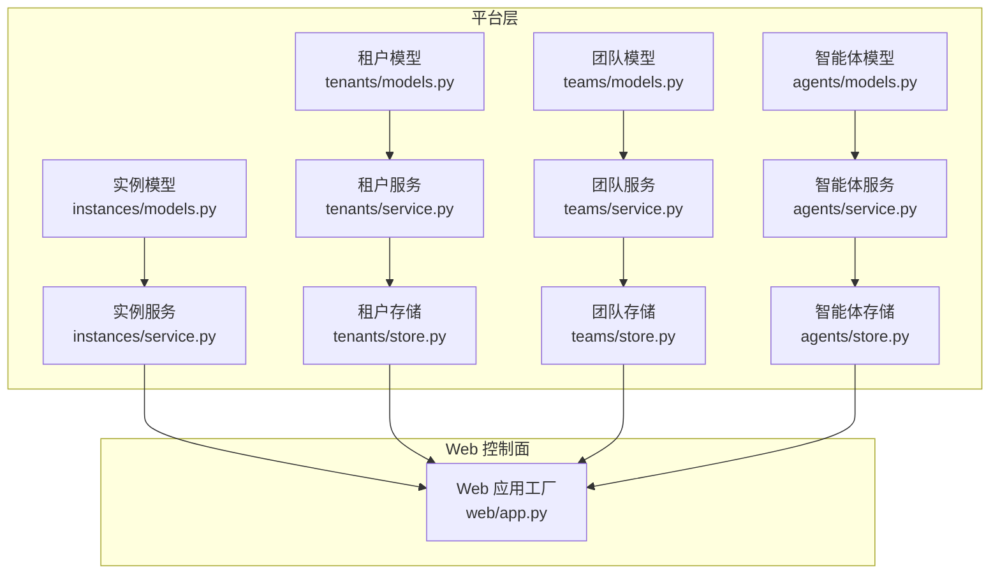
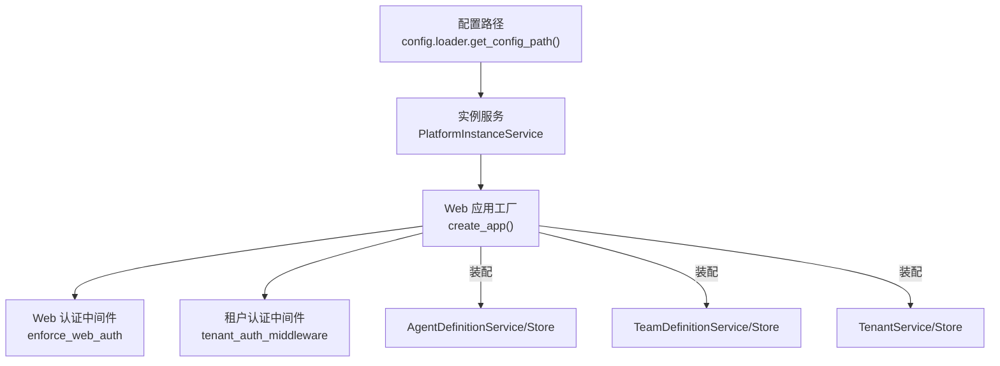
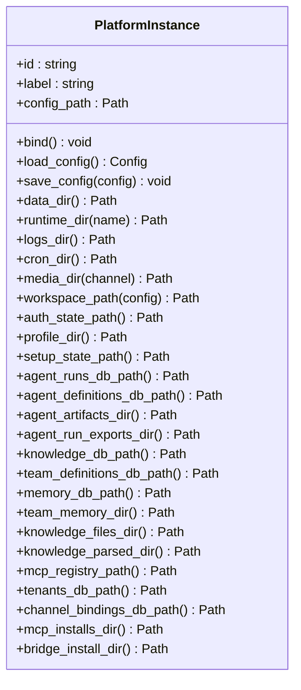
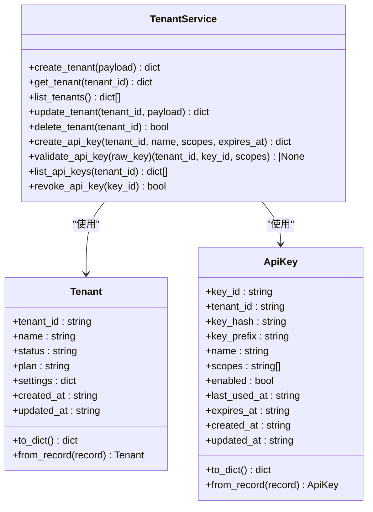
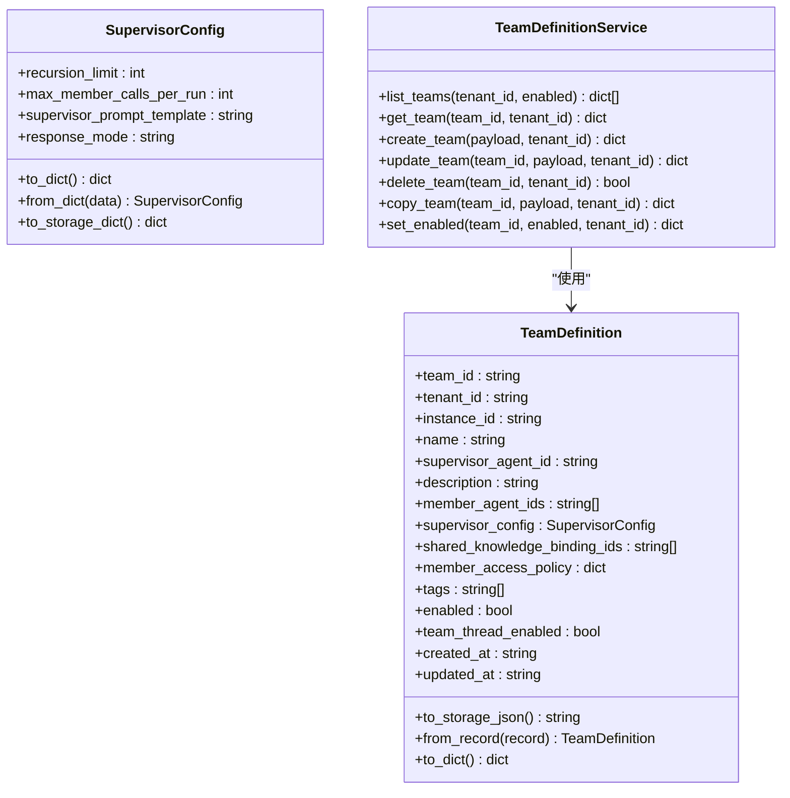
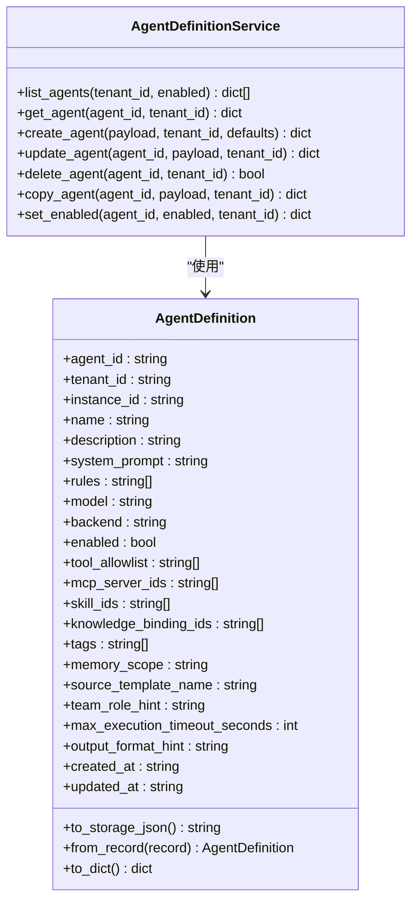
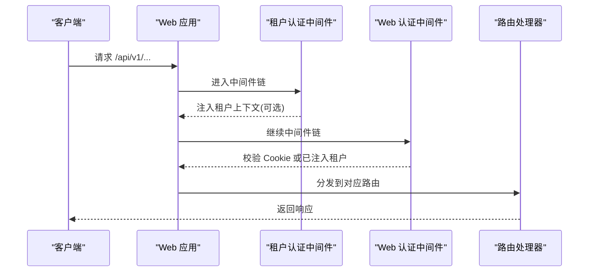
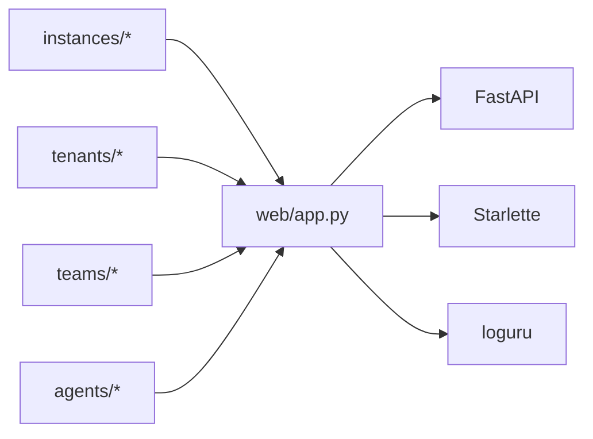

# 平台服务

<cite>
**本文引用的文件**
- [nanobot/platform/__init__.py](file://nanobot/platform/__init__.py)
- [nanobot/platform/instances/models.py](file://nanobot/platform/instances/models.py)
- [nanobot/platform/instances/service.py](file://nanobot/platform/instances/service.py)
- [nanobot/platform/tenants/models.py](file://nanobot/platform/tenants/models.py)
- [nanobot/platform/tenants/service.py](file://nanobot/platform/tenants/service.py)
- [nanobot/platform/tenants/store.py](file://nanobot/platform/tenants/store.py)
- [nanobot/platform/teams/models.py](file://nanobot/platform/teams/models.py)
- [nanobot/platform/teams/service.py](file://nanobot/platform/teams/service.py)
- [nanobot/platform/teams/store.py](file://nanobot/platform/teams/store.py)
- [nanobot/platform/agents/models.py](file://nanobot/platform/agents/models.py)
- [nanobot/platform/agents/service.py](file://nanobot/platform/agents/service.py)
- [nanobot/platform/agents/store.py](file://nanobot/platform/agents/store.py)
- [nanobot/web/app.py](file://nanobot/web/app.py)
</cite>

## 目录
1. [简介](#简介)
2. [项目结构](#项目结构)
3. [核心组件](#核心组件)
4. [架构总览](#架构总览)
5. [详细组件分析](#详细组件分析)
6. [依赖分析](#依赖分析)
7. [性能考量](#性能考量)
8. [故障排查指南](#故障排查指南)
9. [结论](#结论)
10. [附录](#附录)

## 简介
本文件面向 Nanobot 平台服务，系统化阐述其在多实例支持、租户隔离、团队协作与权限管理方面的实现机制。文档覆盖平台服务的架构设计、数据模型与业务逻辑，提供配置方法、使用场景与最佳实践，并说明扩展方式、集成接口与兼容性考虑，同时给出部署示例与运维建议，解释平台服务与核心功能的集成方式与数据流转。

## 项目结构
平台服务位于 nanobot/platform 子包中，围绕“实例边界”“租户与 API Key”“团队定义”“智能体定义”四大域构建，采用“模型-服务-存储”的分层设计，配合 Web 应用在运行时装配各服务实例，形成统一的控制平面。

图表来源
- [nanobot/platform/instances/models.py:14-111](file://nanobot/platform/instances/models.py#L14-L111)
- [nanobot/platform/instances/service.py:17-43](file://nanobot/platform/instances/service.py#L17-L43)
- [nanobot/platform/tenants/models.py:15-100](file://nanobot/platform/tenants/models.py#L15-L100)
- [nanobot/platform/tenants/service.py:43-191](file://nanobot/platform/tenants/service.py#L43-L191)
- [nanobot/platform/tenants/store.py:12-222](file://nanobot/platform/tenants/store.py#L12-L222)
- [nanobot/platform/teams/models.py:22-143](file://nanobot/platform/teams/models.py#L22-L143)
- [nanobot/platform/teams/service.py:35-358](file://nanobot/platform/teams/service.py#L35-L358)
- [nanobot/platform/teams/store.py:12-201](file://nanobot/platform/teams/store.py#L12-L201)
- [nanobot/platform/agents/models.py:15-109](file://nanobot/platform/agents/models.py#L15-L109)
- [nanobot/platform/agents/service.py:30-404](file://nanobot/platform/agents/service.py#L30-L404)
- [nanobot/platform/agents/store.py:12-206](file://nanobot/platform/agents/store.py#L12-L206)
- [nanobot/web/app.py:70-280](file://nanobot/web/app.py#L70-L280)

章节来源
- [nanobot/platform/__init__.py:1-10](file://nanobot/platform/__init__.py#L1-L10)
- [nanobot/platform/instances/models.py:14-111](file://nanobot/platform/instances/models.py#L14-L111)
- [nanobot/platform/instances/service.py:17-43](file://nanobot/platform/instances/service.py#L17-L43)
- [nanobot/platform/tenants/models.py:15-100](file://nanobot/platform/tenants/models.py#L15-L100)
- [nanobot/platform/tenants/service.py:43-191](file://nanobot/platform/tenants/service.py#L43-L191)
- [nanobot/platform/tenants/store.py:12-222](file://nanobot/platform/tenants/store.py#L12-L222)
- [nanobot/platform/teams/models.py:22-143](file://nanobot/platform/teams/models.py#L22-L143)
- [nanobot/platform/teams/service.py:35-358](file://nanobot/platform/teams/service.py#L35-L358)
- [nanobot/platform/teams/store.py:12-201](file://nanobot/platform/teams/store.py#L12-L201)
- [nanobot/platform/agents/models.py:15-109](file://nanobot/platform/agents/models.py#L15-L109)
- [nanobot/platform/agents/service.py:30-404](file://nanobot/platform/agents/service.py#L30-L404)
- [nanobot/platform/agents/store.py:12-206](file://nanobot/platform/agents/store.py#L12-L206)
- [nanobot/web/app.py:70-280](file://nanobot/web/app.py#L70-L280)

## 核心组件
- 实例边界（PlatformInstance）：封装单实例的配置路径、工作区解析、运行时目录与数据库/文件路径等，提供绑定当前实例为活动配置上下文的能力。
- 租户与 API Key：提供租户生命周期管理与 API Key 的创建、校验、撤销等能力，确保多租户隔离与访问控制。
- 团队定义（TeamDefinition）：描述跨智能体的编排配置，包括主管智能体、成员集合、监督器配置、共享知识与访问策略等。
- 智能体定义（AgentDefinition）：描述可复用的智能体模板，包含系统提示、规则、工具白名单、技能、知识绑定、内存范围等。
- 服务与存储：每个域均提供 Service 层进行业务规则处理与参数规范化，Store 层基于 SQLite 提供持久化，保证实例作用域内的数据隔离。

章节来源
- [nanobot/platform/instances/models.py:14-111](file://nanobot/platform/instances/models.py#L14-L111)
- [nanobot/platform/tenants/models.py:15-100](file://nanobot/platform/tenants/models.py#L15-L100)
- [nanobot/platform/teams/models.py:22-143](file://nanobot/platform/teams/models.py#L22-L143)
- [nanobot/platform/agents/models.py:15-109](file://nanobot/platform/agents/models.py#L15-L109)
- [nanobot/platform/tenants/service.py:43-191](file://nanobot/platform/tenants/service.py#L43-L191)
- [nanobot/platform/teams/service.py:35-358](file://nanobot/platform/teams/service.py#L35-L358)
- [nanobot/platform/agents/service.py:30-404](file://nanobot/platform/agents/service.py#L30-L404)
- [nanobot/platform/tenants/store.py:12-222](file://nanobot/platform/tenants/store.py#L12-L222)
- [nanobot/platform/teams/store.py:12-201](file://nanobot/platform/teams/store.py#L12-L201)
- [nanobot/platform/agents/store.py:12-206](file://nanobot/platform/agents/store.py#L12-L206)

## 架构总览
平台服务通过 Web 应用工厂在启动时装配各域的服务与存储实例，形成统一的控制平面。实例边界贯穿所有域，确保数据与运行时资源按实例隔离；租户域负责多租户隔离与 API Key 认证；团队与智能体域提供产品化复用与编排能力；Web 中间件在请求进入路由前执行认证与租户上下文注入。

图表来源
- [nanobot/platform/instances/service.py:17-43](file://nanobot/platform/instances/service.py#L17-L43)
- [nanobot/web/app.py:70-280](file://nanobot/web/app.py#L70-L280)

章节来源
- [nanobot/web/app.py:70-280](file://nanobot/web/app.py#L70-L280)

## 详细组件分析

### 实例边界与多实例支持
- 实例识别：根据当前配置路径推导实例 ID 与标签，支持默认实例与自定义实例命名。
- 配置绑定：实例对象可将自身设置为活动配置上下文，以兼容旧版运行时辅助函数。
- 数据与运行时目录：提供日志、定时任务、媒体、工作区、知识库、团队记忆、MCP 安装与桥接安装等目录的实例级路径解析。
- 作用域隔离：实例边界贯穿所有域，确保不同实例的数据与运行时资源相互独立。

图表来源
- [nanobot/platform/instances/models.py:14-111](file://nanobot/platform/instances/models.py#L14-L111)

章节来源
- [nanobot/platform/instances/models.py:14-111](file://nanobot/platform/instances/models.py#L14-L111)
- [nanobot/platform/instances/service.py:17-43](file://nanobot/platform/instances/service.py#L17-L43)

### 租户隔离与权限管理
- 租户模型：包含标识、名称、状态、套餐、设置、时间戳等字段，支持序列化/反序列化。
- API Key 模型：包含键标识、租户标识、哈希、前缀、名称、作用域、启用状态、过期时间与时间戳等，支持序列化/反序列化。
- 租户服务：提供租户创建/查询/列表/更新/删除；API Key 创建（生成原始密钥并返回）、校验（哈希匹配、启用状态、过期检查、最后使用时间更新）、列出与撤销。
- 存储层：基于 SQLite 的租户表与 API Key 表，含唯一索引与常用查询索引，保障一致性与性能。

图表来源
- [nanobot/platform/tenants/models.py:15-100](file://nanobot/platform/tenants/models.py#L15-L100)
- [nanobot/platform/tenants/service.py:43-191](file://nanobot/platform/tenants/service.py#L43-L191)

章节来源
- [nanobot/platform/tenants/models.py:15-100](file://nanobot/platform/tenants/models.py#L15-L100)
- [nanobot/platform/tenants/service.py:43-191](file://nanobot/platform/tenants/service.py#L43-L191)
- [nanobot/platform/tenants/store.py:12-222](file://nanobot/platform/tenants/store.py#L12-L222)

### 团队协作与编排
- 团队模型：包含团队标识、租户标识、实例标识、名称、主管智能体标识、成员智能体列表、监督器配置、共享知识绑定、成员访问策略、标签、启用状态、线程开关、时间戳与成员计数。
- 团队服务：提供团队的创建/查询/列表/更新/删除/复制/启用切换；对名称唯一性、成员引用有效性、监督器配置合法性、访问策略格式等进行规范化与校验。
- 存储层：基于 SQLite 的团队定义表，含多维索引，支持按租户+实例+启用状态排序查询。

图表来源
- [nanobot/platform/teams/models.py:22-143](file://nanobot/platform/teams/models.py#L22-L143)
- [nanobot/platform/teams/service.py:35-358](file://nanobot/platform/teams/service.py#L35-L358)

章节来源
- [nanobot/platform/teams/models.py:22-143](file://nanobot/platform/teams/models.py#L22-L143)
- [nanobot/platform/teams/service.py:35-358](file://nanobot/platform/teams/service.py#L35-L358)
- [nanobot/platform/teams/store.py:12-201](file://nanobot/platform/teams/store.py#L12-L201)

### 智能体产品化与复用
- 智能体模型：包含智能体标识、租户标识、实例标识、名称、描述、系统提示、规则、模型/后端、启用状态、工具白名单、MCP 服务器列表、技能列表、知识绑定列表、标签、内存范围、来源模板名、团队角色提示、最大执行超时、输出格式提示与时间戳。
- 智能体服务：提供智能体的创建/查询/列表/更新/删除/复制/启用切换；对名称唯一性、系统提示必填、工具/技能/知识绑定列表去重与去空、模型/后端/内存范围、超时限制等进行规范化与校验。
- 存储层：基于 SQLite 的智能体定义表，含多维索引，支持按租户+实例+启用状态排序查询。

图表来源
- [nanobot/platform/agents/models.py:15-109](file://nanobot/platform/agents/models.py#L15-L109)
- [nanobot/platform/agents/service.py:30-404](file://nanobot/platform/agents/service.py#L30-L404)

章节来源
- [nanobot/platform/agents/models.py:15-109](file://nanobot/platform/agents/models.py#L15-L109)
- [nanobot/platform/agents/service.py:30-404](file://nanobot/platform/agents/service.py#L30-L404)
- [nanobot/platform/agents/store.py:12-206](file://nanobot/platform/agents/store.py#L12-L206)

### Web 控制面与运行时装配
- 应用工厂：在启动时解析实例、初始化认证、MCP 管理、通道服务、渠道测试、WhatsApp 绑定、设置与运维服务，并装配各域服务与存储。
- 生命周期：在 lifespan 中绑定运行时源（团队线程与运行产物），启动通道运行时，结束时清理资源。
- 中间件：先执行租户认证中间件（从 API Key 注入租户上下文），再执行 Web 认证中间件（Cookie），对非 /api/v1/ 路径放行，对受保护接口要求登录或已注入租户上下文。
- 路由注册：统一注册各域路由，提供未知 API 路由兜底与前端静态资源服务。

图表来源
- [nanobot/web/app.py:225-262](file://nanobot/web/app.py#L225-L262)

章节来源
- [nanobot/web/app.py:70-280](file://nanobot/web/app.py#L70-L280)

## 依赖分析
- 组件内聚与耦合：各域（租户、团队、智能体、实例）内部高内聚，通过 Service/Store 分层解耦；Web 应用作为装配中心，集中注入各域实例。
- 外部依赖：Web 应用依赖 FastAPI、Starlette、loguru 等；平台层依赖 SQLite 用于本地持久化；实例边界依赖配置加载器与路径解析工具。
- 可能的循环依赖：平台层未见直接循环导入；Web 应用通过字符串引用各域服务，避免循环依赖。

图表来源
- [nanobot/web/app.py:70-280](file://nanobot/web/app.py#L70-L280)

章节来源
- [nanobot/web/app.py:70-280](file://nanobot/web/app.py#L70-L280)

## 性能考量
- 存储索引：租户/团队/智能体存储均建立复合索引与常用过滤列索引，提升按租户+实例+启用状态的查询效率。
- 参数规范化：服务层对输入进行严格校验与归一化，减少异常分支与重复查询。
- 运行时目录：实例边界提供统一的运行时目录解析，避免跨实例冲突与磁盘 IO 竞态。
- 建议：在高并发场景下，建议将 SQLite 替换为外部数据库以提升写入吞吐；对频繁查询的视图结果增加缓存；对 API Key 校验引入轻量缓存与过期策略。

## 故障排查指南
- 认证失败
  - 现象：返回“需要认证”。
  - 排查：确认是否已登录且 Cookie 有效；若通过 API Key 访问，确认租户上下文是否正确注入；检查中间件顺序与路径匹配。
- 租户不存在/冲突
  - 现象：创建租户时报“租户已存在”或“租户不存在”。
  - 排查：核对租户名称与 ID 的唯一性；检查 ID 生成逻辑与 slug 化规则。
- API Key 校验失败
  - 现象：校验返回空或被拒绝。
  - 排查：确认原始密钥前缀、哈希一致性、启用状态、过期时间；检查最后使用时间更新逻辑。
- 团队/智能体冲突或非法
  - 现象：创建/更新时报“名称已存在”“成员引用无效”“监督器配置非法”等。
  - 排查：核对名称唯一性、成员智能体是否存在、监督器配置数值范围与响应模式枚举值；检查存储层索引与查询条件。
- Web 路由错误
  - 现象：返回“未知端点”或前端资源 404。
  - 排查：确认路由注册顺序与通配符路由；检查静态资源目录与前端打包状态。

章节来源
- [nanobot/platform/tenants/service.py:15-191](file://nanobot/platform/tenants/service.py#L15-L191)
- [nanobot/platform/teams/service.py:18-358](file://nanobot/platform/teams/service.py#L18-L358)
- [nanobot/platform/agents/service.py:13-404](file://nanobot/platform/agents/service.py#L13-L404)
- [nanobot/web/app.py:205-278](file://nanobot/web/app.py#L205-L278)

## 结论
平台服务通过“实例边界 + 租户隔离 + 团队编排 + 智能体复用”的四维架构，实现了多实例支持、租户隔离与团队协作的统一控制平面。服务层提供严格的参数规范化与错误类型化，存储层以 SQLite 保障实例级数据隔离与查询效率。Web 控制面在启动时装配各域服务，结合中间件完成认证与租户上下文注入，形成清晰的调用链路与可观测性。建议在生产环境中评估数据库替换、缓存与监控方案，以满足更高性能与可靠性需求。

## 附录

### 配置方法与使用场景
- 多实例支持
  - 使用实例服务获取默认实例或从指定配置路径推导实例；通过实例对象绑定配置上下文，确保后续运行时行为一致。
- 租户隔离
  - 为不同客户/组织创建租户；为租户创建 API Key 并限定作用域；通过租户认证中间件注入上下文，实现资源级隔离。
- 团队协作
  - 在团队定义中配置主管智能体与成员集合、监督器参数与响应模式；设置成员访问策略与共享知识绑定，支撑跨智能体协同。
- 权限管理
  - 通过 API Key 的作用域与过期时间控制访问粒度；结合 Web 认证中间件与租户上下文，实现细粒度授权。

章节来源
- [nanobot/platform/instances/service.py:17-43](file://nanobot/platform/instances/service.py#L17-L43)
- [nanobot/platform/tenants/service.py:43-191](file://nanobot/platform/tenants/service.py#L43-L191)
- [nanobot/platform/teams/service.py:35-358](file://nanobot/platform/teams/service.py#L35-L358)
- [nanobot/platform/agents/service.py:30-404](file://nanobot/platform/agents/service.py#L30-L404)
- [nanobot/web/app.py:225-262](file://nanobot/web/app.py#L225-L262)

### 扩展方式与集成接口
- 扩展新域：遵循“模型-服务-存储”三层结构，新增域的模型、服务与 SQLite 存储；在 Web 应用工厂中装配并注册路由。
- 集成接口：通过 Web 路由与中间件接入；API Key 与 Cookie 双通道认证；实例边界贯穿所有域，确保扩展域具备相同的隔离与运行时环境。
- 兼容性：保持模型字段的向后兼容（如团队定义中的字段别名支持）；服务层对输入进行严格校验，避免破坏性变更。

章节来源
- [nanobot/platform/teams/models.py:96-121](file://nanobot/platform/teams/models.py#L96-L121)
- [nanobot/web/app.py:70-280](file://nanobot/web/app.py#L70-L280)

### 部署示例与运维指南
- 部署步骤
  - 启动 Web 服务：通过应用工厂创建 FastAPI 应用，选择静态或开发模式运行前端；或使用静态资源模式直接托管前端。
  - 实例与数据：确保实例配置路径存在且可写；各域的 SQLite 文件与运行时目录自动创建。
- 运维建议
  - 日志与健康检查：利用日志框架与健康端点监控服务状态。
  - 备份与迁移：定期备份各域 SQLite 文件与运行时目录；升级时注意模型字段变更与索引维护。
  - 安全加固：限制 API Key 作用域与有效期；定期轮换密钥；启用 HTTPS 与安全 Cookie。

章节来源
- [nanobot/web/app.py:283-332](file://nanobot/web/app.py#L283-L332)