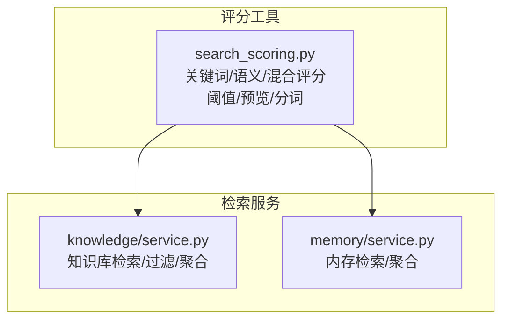
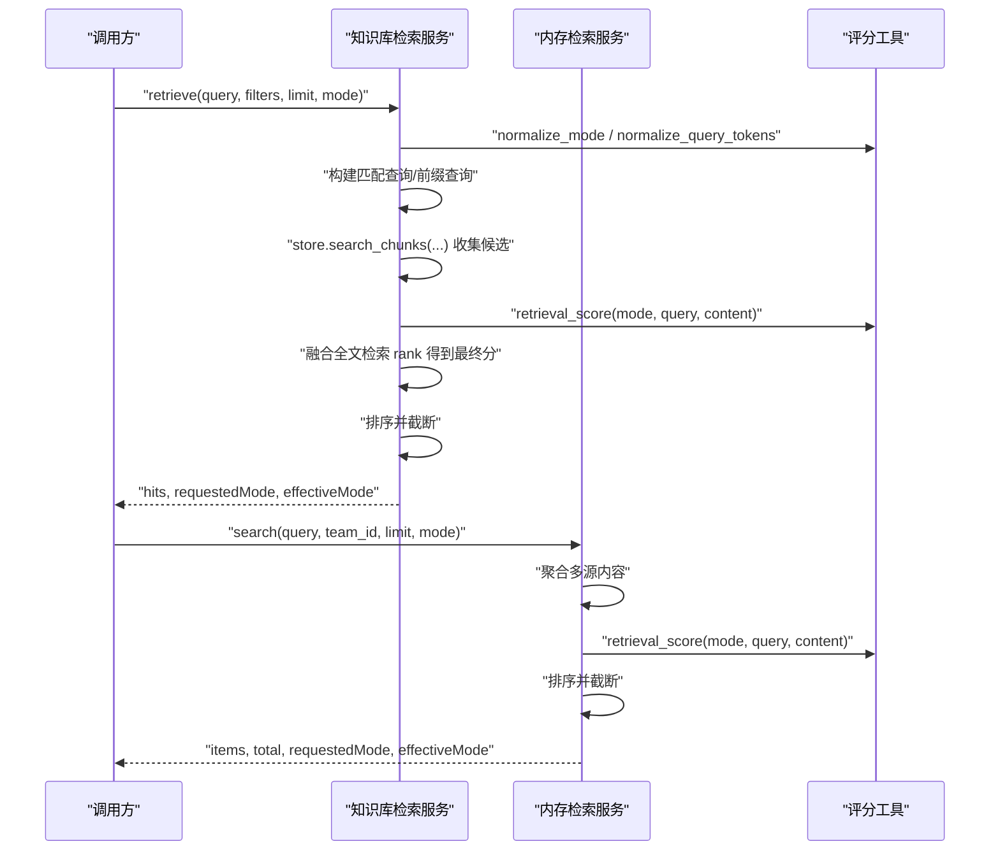
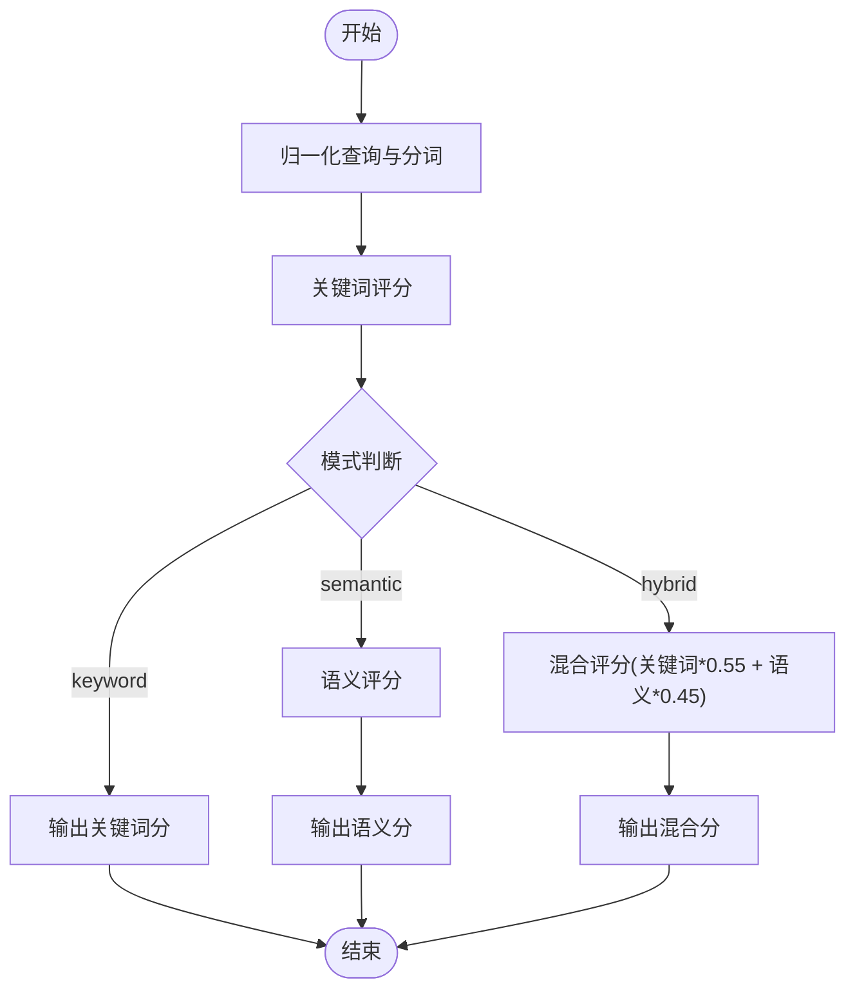
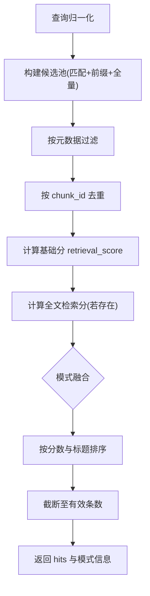
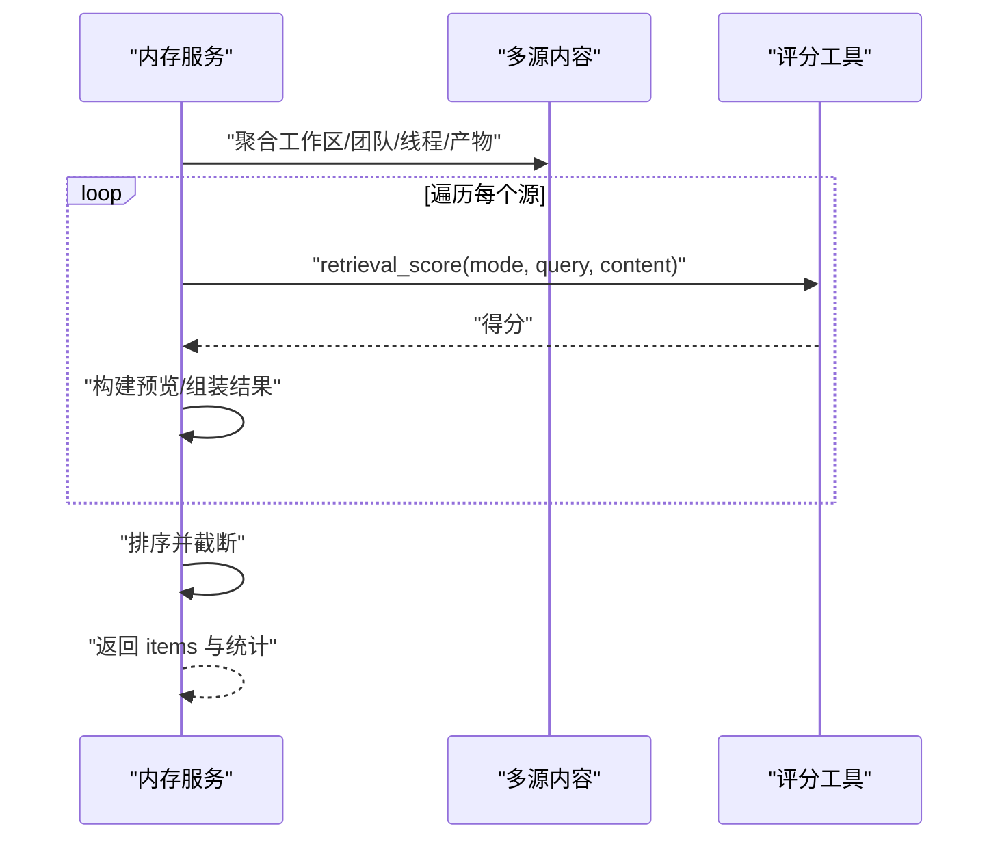
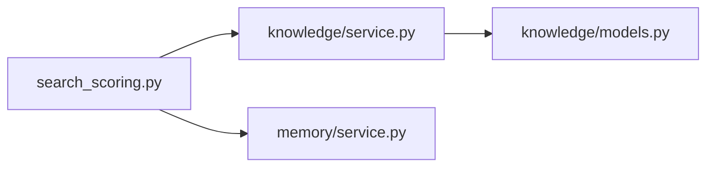

# 搜索评分

<cite>
**本文引用的文件**
- [search_scoring.py](file://nanobot/platform/search_scoring.py)
- [knowledge/service.py](file://nanobot/platform/knowledge/service.py)
- [knowledge/models.py](file://nanobot/platform/knowledge/models.py)
- [memory/service.py](file://nanobot/platform/memory/service.py)
- [test_memory_service.py](file://tests/test_memory_service.py)
</cite>

## 目录
1. [简介](#简介)
2. [项目结构](#项目结构)
3. [核心组件](#核心组件)
4. [架构总览](#架构总览)
5. [详细组件分析](#详细组件分析)
6. [依赖关系分析](#依赖关系分析)
7. [性能考量](#性能考量)
8. [故障排查指南](#故障排查指南)
9. [结论](#结论)
10. [附录](#附录)

## 简介
本技术文档聚焦 Nanobot 搜索评分模块，系统阐述检索评分算法的设计原理、计算方法与优化策略；详解不同数据类型（关键词、语义、混合）的评分权重、相关性计算与排序机制；记录搜索结果的过滤、去重与聚合处理流程；提供可配置参数、调优方法与性能优化建议；并覆盖知识库检索、内存查询与渠道消息等场景的应用实践，以及与机器学习模型的集成与自适应优化思路。

## 项目结构
搜索评分能力由独立的本地评分工具模块提供，并被知识库检索与内存检索服务复用：
- 评分工具模块：提供关键词、语义相似度与混合评分、阈值、预览生成等基础能力
- 知识库检索服务：基于分块检索与元数据过滤，结合评分与全文检索分数融合
- 内存检索服务：对工作区共享记忆、团队共享记忆、线程与运行产物等多源内容进行统一检索与排序

图表来源
- [search_scoring.py:1-143](file://nanobot/platform/search_scoring.py#L1-L143)
- [knowledge/service.py:1722-1814](file://nanobot/platform/knowledge/service.py#L1722-L1814)
- [memory/service.py:249-346](file://nanobot/platform/memory/service.py#L249-L346)

章节来源
- [search_scoring.py:1-143](file://nanobot/platform/search_scoring.py#L1-L143)
- [knowledge/service.py:35-42](file://nanobot/platform/knowledge/service.py#L35-L42)
- [memory/service.py:13-19](file://nanobot/platform/memory/service.py#L13-L19)

## 核心组件
- 评分工具模块（search_scoring.py）
  - 分词与归一化：支持中英文词级提取与去重
  - 关键词评分：基于命中覆盖率与密度的加权
  - 语义评分：基于词元匹配、字符三元组 Jaccard 与短语包含的加权
  - 混合评分：对关键词与语义评分进行加权融合
  - 阈值控制：按模式设定最低阈值过滤低质量结果
  - 预览生成：从命中位置截取上下文片段
- 知识库检索服务（knowledge/service.py）
  - 多轮检索：常规匹配与前缀匹配组合，扩大候选池
  - 去重与聚合：按 chunk_id 去重，按文档元数据过滤
  - 评分融合：将基础评分与全文检索 rank 融合
  - 排序与截断：按分数与标题排序并限制返回数量
- 内存检索服务（memory/service.py）
  - 多源聚合：工作区共享记忆、团队共享记忆、线程与运行产物
  - 去重策略：已应用的候选不再重复检索，避免冗余
  - 评分与排序：统一调用评分工具并排序输出

章节来源
- [search_scoring.py:17-143](file://nanobot/platform/search_scoring.py#L17-L143)
- [knowledge/service.py:1722-1814](file://nanobot/platform/knowledge/service.py#L1722-L1814)
- [memory/service.py:249-346](file://nanobot/platform/memory/service.py#L249-L346)

## 架构总览
搜索评分贯穿“输入归一化 → 评分计算 → 阈值过滤 → 预览生成 → 排序截断”的主链路，并在知识库与内存两大场景中落地：

图表来源
- [knowledge/service.py:1722-1814](file://nanobot/platform/knowledge/service.py#L1722-L1814)
- [memory/service.py:249-346](file://nanobot/platform/memory/service.py#L249-L346)
- [search_scoring.py:100-119](file://nanobot/platform/search_scoring.py#L100-L119)

## 详细组件分析

### 评分工具模块（search_scoring.py）
- 归一化与分词
  - 模式归一化：支持 keyword、semantic、hybrid，默认 keyword
  - 查询分词：提取中英文词元并去重，作为查询令牌集合
- 关键词评分（keyword_score）
  - 计算命中次数与覆盖率、密度，加权得到关键词分
  - 适配精确匹配与模糊匹配场景
- 语义评分（semantic_score）
  - 词元匹配：候选文本词表内匹配或包含即高分
  - 前缀/包含/公共前缀长度启发式，给出阶段性置信度
  - 字符三元组 Jaccard 相似度与短语包含奖励
  - 综合得到语义分
- 混合评分（retrieval_score）
  - 关键词与语义分按权重融合（关键词 0.55、语义 0.45）
- 阈值（score_threshold）
  - 语义模式阈值较高，混合模式次之，关键词模式无阈值
- 预览（build_preview）
  - 基于首次命中位置截取上下文片段，便于前端展示

图表来源
- [search_scoring.py:100-119](file://nanobot/platform/search_scoring.py#L100-L119)
- [search_scoring.py:50-97](file://nanobot/platform/search_scoring.py#L50-L97)

章节来源
- [search_scoring.py:17-143](file://nanobot/platform/search_scoring.py#L17-L143)

### 知识库检索（knowledge/service.py）
- 输入与配置
  - 请求模式归一化，优先使用绑定 KB 的检索配置
  - 有效返回条数受 top_k 与上限约束
- 候选收集
  - 常规匹配与前缀匹配组合，扩大候选池
  - 在语义/混合模式下补充全量分块列表，提升召回
- 过滤与去重
  - 按文档维度过滤：doc_id、source_type、locale、tags
  - 去重：按 chunk_id 去重，保留首条
- 评分与融合
  - 基础分：标题+内容拼接后调用 retrieval_score
  - 全文检索分：若 rank 非零，转换为 1/(1+|rank|)，与基础分融合
  - 关键词模式：取两者最大值
  - 混合模式：基础分占 0.8，全文分占 0.2
- 排序与截断
  - 按分数与标题降序排序，截断至有效返回条数

图表来源
- [knowledge/service.py:1722-1814](file://nanobot/platform/knowledge/service.py#L1722-L1814)
- [knowledge/service.py:1680-1695](file://nanobot/platform/knowledge/service.py#L1680-L1695)
- [search_scoring.py:100-119](file://nanobot/platform/search_scoring.py#L100-L119)

章节来源
- [knowledge/service.py:1722-1814](file://nanobot/platform/knowledge/service.py#L1722-L1814)
- [knowledge/service.py:1680-1721](file://nanobot/platform/knowledge/service.py#L1680-L1721)
- [knowledge/models.py:33-77](file://nanobot/platform/knowledge/models.py#L33-L77)

### 内存检索（memory/service.py）
- 数据源聚合
  - 工作区共享记忆、团队共享记忆、线程与运行产物
  - 候选去重：已应用候选不再重复检索
- 评分与排序
  - 对每个源内容调用 retrieval_score
  - 按分数与标题降序排序，截断至 limit
- 返回结构
  - 包含 sourceType/sourceId/title/content/score/preview/metadata

图表来源
- [memory/service.py:249-346](file://nanobot/platform/memory/service.py#L249-L346)
- [search_scoring.py:100-119](file://nanobot/platform/search_scoring.py#L100-L119)

章节来源
- [memory/service.py:249-346](file://nanobot/platform/memory/service.py#L249-L346)

### 测试验证（test_memory_service.py）
- 验证语义与混合模式的检索行为与返回结构
- 确认有效模式与命中项类型

章节来源
- [test_memory_service.py:112-145](file://tests/test_memory_service.py#L112-L145)

## 依赖关系分析
- 评分工具模块被知识库与内存服务共同依赖
- 知识库服务在评分基础上引入全文检索 rank 融合
- 内存服务直接使用评分工具，不涉及外部向量库

图表来源
- [knowledge/service.py:35-42](file://nanobot/platform/knowledge/service.py#L35-L42)
- [memory/service.py:13-19](file://nanobot/platform/memory/service.py#L13-L19)
- [knowledge/models.py:33-77](file://nanobot/platform/knowledge/models.py#L33-L77)

章节来源
- [knowledge/service.py:35-42](file://nanobot/platform/knowledge/service.py#L35-L42)
- [memory/service.py:13-19](file://nanobot/platform/memory/service.py#L13-L19)

## 性能考量
- 时间复杂度
  - 关键词评分：O(T + C)，T 为查询令牌数，C 为内容长度
  - 语义评分：词元匹配 O(T·S)，S 为候选词表规模；字符三元组 Jaccard 与短语包含近似 O(C)
  - 混合评分：线性组合
  - 知识库检索：候选池大小与过滤/去重成本相关
- 空间复杂度
  - 主要消耗在候选池与中间令牌集合
- 优化建议
  - 控制候选池上限：根据 top_k 与 chunk_top_k 合理放大倍数
  - 使用前缀查询与全量分块列表互补，减少漏召回
  - 评分阈值过滤前置，降低后续处理开销
  - 预览宽度与命中定位可按需调整，平衡展示与性能
  - 将高频查询结果缓存（如命中位置与预览片段），减少重复计算

## 故障排查指南
- 无结果或结果过少
  - 检查请求模式是否合理（语义模式阈值较高）
  - 确认查询分词是否为空（空查询会被拒绝）
  - 核对知识库检索配置（top_k、chunk_top_k、chunk_size、chunk_overlap）
- 结果重复或冗余
  - 知识库：确认按 chunk_id 去重逻辑是否生效
  - 内存：确认已应用候选不会重复出现
- 排序异常
  - 检查排序键（分数与标题）是否被正确设置
- 预览不准确
  - 调整预览宽度与命中定位逻辑，确保首次命中位置正确

章节来源
- [knowledge/service.py:1722-1814](file://nanobot/platform/knowledge/service.py#L1722-L1814)
- [memory/service.py:249-346](file://nanobot/platform/memory/service.py#L249-L346)
- [search_scoring.py:36-47](file://nanobot/platform/search_scoring.py#L36-L47)

## 结论
搜索评分模块通过关键词、语义与混合三种模式，提供了确定性、可预测且无需外部向量依赖的检索评分方案。知识库与内存检索服务在此基础上实现了过滤、去重、聚合与排序，满足企业级检索需求。通过合理的阈值与候选池控制，可在准确性与性能之间取得良好平衡；未来可考虑引入外部嵌入或重排服务，进一步提升语义相关性与个性化效果。

## 附录

### 配置参数与调优要点
- 知识库检索配置（KnowledgeRetrievalProfile）
  - mode：检索模式（keyword/semantic/hybrid）
  - top_k：期望返回条数
  - chunk_top_k：分块候选池上限
  - chunk_size/chunk_overlap：分块大小与重叠
  - citation_required：是否强制引用
  - rerank_enabled：是否启用重排（当前评分模块未使用）
  - metadata_filters：元数据过滤条件
- 调优建议
  - 语义模式：提高召回时可适当降低阈值，但需关注误召回
  - 混合模式：在关键词与语义之间取得平衡，兼顾速度与精度
  - 候选池：根据业务规模与硬件资源动态调整 chunk_top_k 与 pool_limit

章节来源
- [knowledge/models.py:33-77](file://nanobot/platform/knowledge/models.py#L33-L77)

### 应用场景
- 知识库检索：面向结构化文档与非结构化内容的统一检索
- 内存查询：面向团队共享记忆、线程与运行产物的上下文检索
- 渠道消息：可扩展至消息历史检索（当前代码未直接体现，但评分工具具备通用性）

章节来源
- [knowledge/service.py:1722-1814](file://nanobot/platform/knowledge/service.py#L1722-L1814)
- [memory/service.py:249-346](file://nanobot/platform/memory/service.py#L249-L346)

### 与机器学习模型的集成与自适应优化
- 当前实现为确定性规则评分，未直接依赖 ML 模型
- 可选集成路径
  - 使用外部嵌入模型计算向量相似度，与现有评分进行加权融合
  - 引入轻量级重排模型（reranker）对候选进行二次排序
  - 基于用户反馈与点击数据训练自适应阈值与权重
- 自适应优化建议
  - 以 A/B 实验对比不同阈值与权重组合的效果
  - 建立指标体系（准确率、召回率、MRR、人工评估）持续迭代