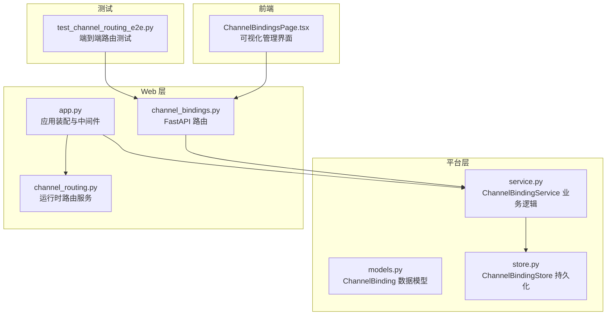
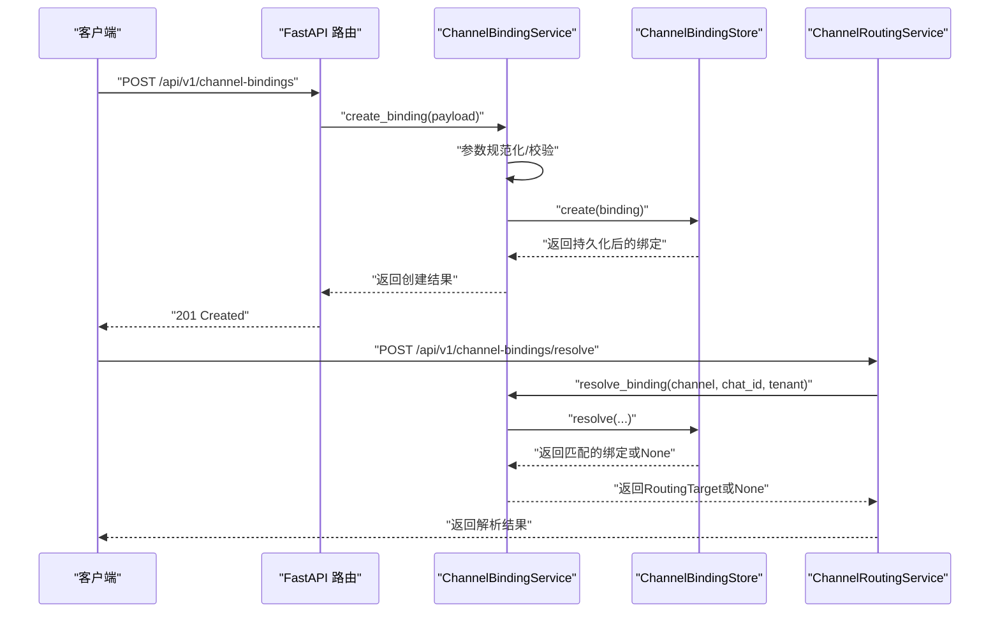
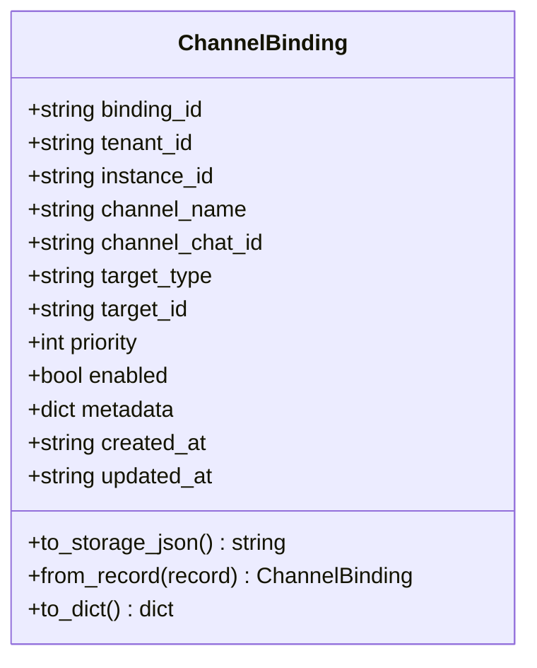
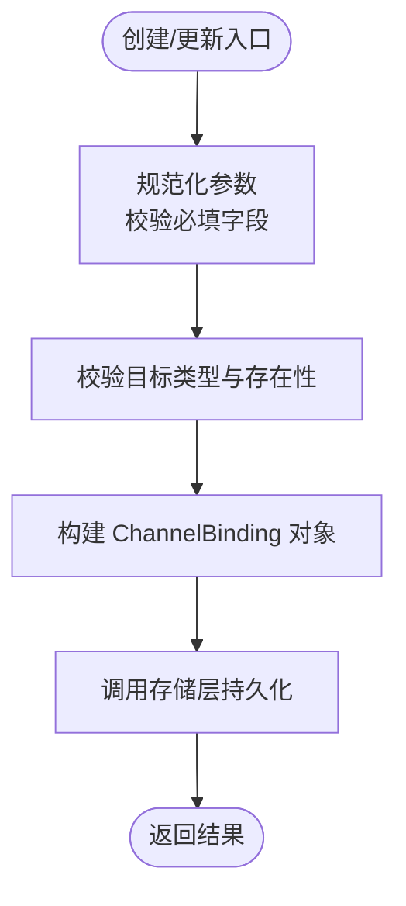
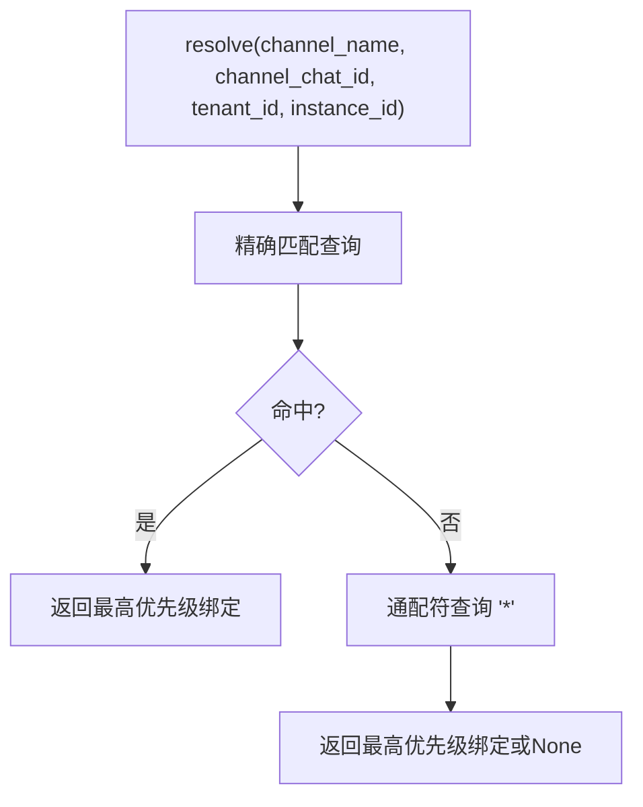
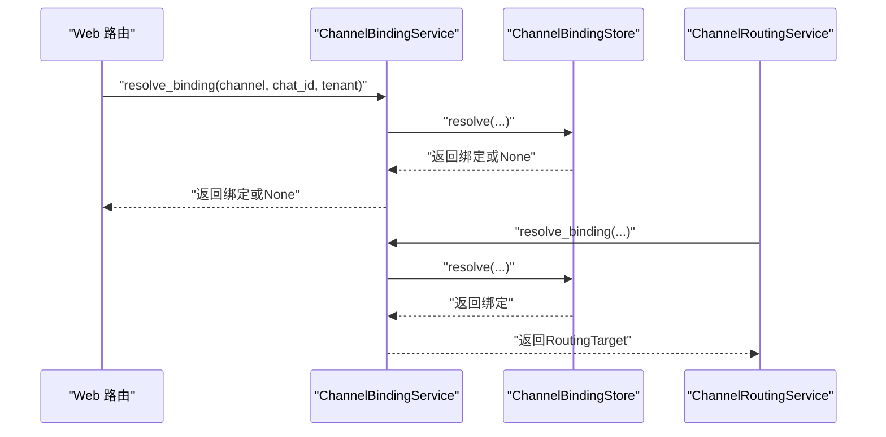
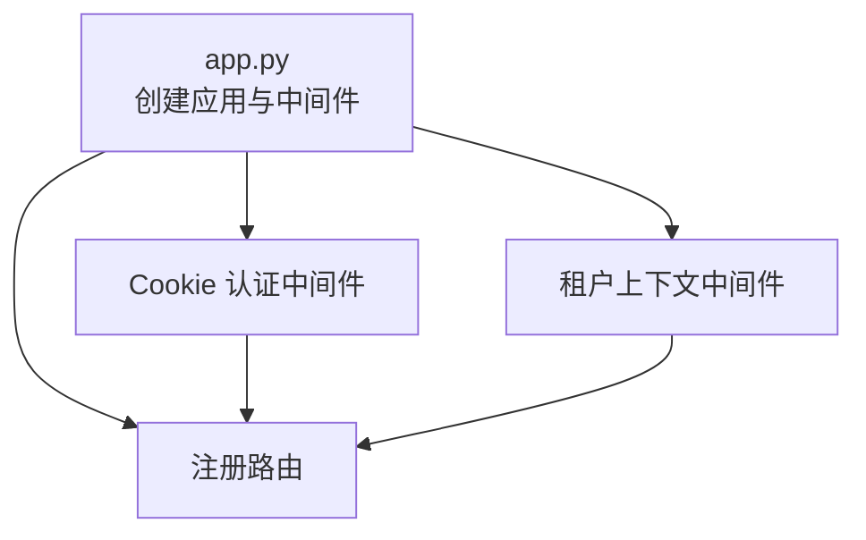
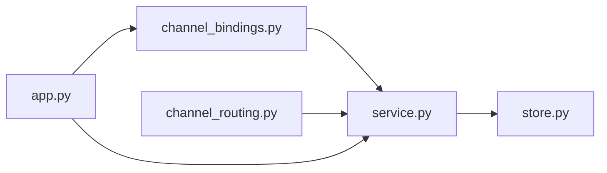
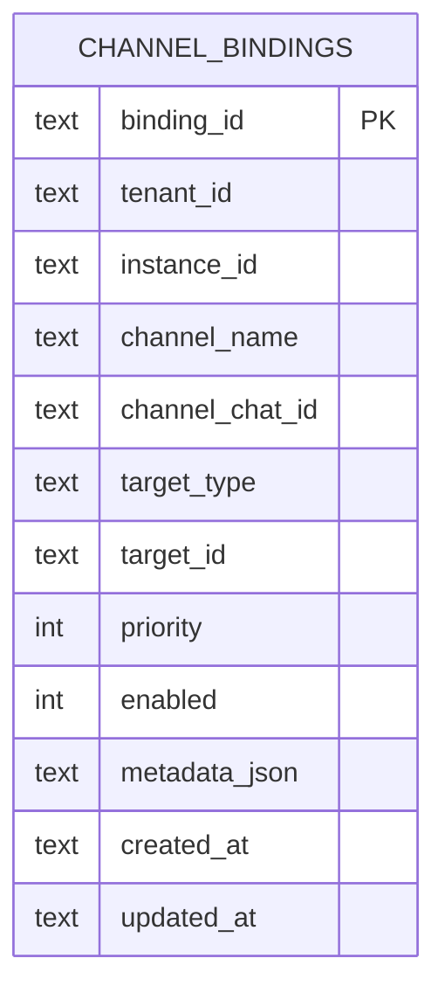

# 渠道绑定

<cite>
**本文引用的文件**
- [models.py](file://nanobot/platform/channel_bindings/models.py)
- [service.py](file://nanobot/platform/channel_bindings/service.py)
- [store.py](file://nanobot/platform/channel_bindings/store.py)
- [channel_bindings.py](file://nanobot/web/routers/channel_bindings.py)
- [channel_routing.py](file://nanobot/web/runtime_services/channel_routing.py)
- [app.py](file://nanobot/web/app.py)
- [models.py（实例）](file://nanobot/platform/instances/models.py)
- [models.py（租户）](file://nanobot/platform/tenants/models.py)
- [ChannelBindingsPage.tsx](file://web-ui/src/pages/ChannelBindingsPage.tsx)
- [test_channel_routing_e2e.py](file://tests/test_channel_routing_e2e.py)
</cite>

## 目录
1. [简介](#简介)
2. [项目结构](#项目结构)
3. [核心组件](#核心组件)
4. [架构总览](#架构总览)
5. [详细组件分析](#详细组件分析)
6. [依赖分析](#依赖分析)
7. [性能考虑](#性能考虑)
8. [故障排除指南](#故障排除指南)
9. [结论](#结论)
10. [附录](#附录)

## 简介
本文件系统性阐述 Nanobot 渠道绑定模块的设计与实现，覆盖数据模型、绑定规则、服务层、存储层、路由策略、消息转发机制、API 操作（创建/查询/更新/删除）、配置示例、使用场景、安全与权限控制、以及多实例与多租户环境下的管理策略。目标是帮助开发者与运维人员快速理解并正确使用渠道绑定功能。

## 项目结构
渠道绑定相关代码主要分布在以下位置：
- 平台层：数据模型、服务层、存储层
- Web 层：API 路由、运行时路由服务
- 应用装配：FastAPI 应用初始化，注入服务与中间件
- 前端页面：可视化管理界面
- 测试：端到端路由解析与优先级校验

**图表来源**
- [models.py:15-69](file://nanobot/platform/channel_bindings/models.py#L15-L69)
- [service.py:28-201](file://nanobot/platform/channel_bindings/service.py#L28-L201)
- [store.py:11-231](file://nanobot/platform/channel_bindings/store.py#L11-L231)
- [channel_bindings.py:18-102](file://nanobot/web/routers/channel_bindings.py#L18-L102)
- [channel_routing.py:23-73](file://nanobot/web/runtime_services/channel_routing.py#L23-L73)
- [app.py:70-281](file://nanobot/web/app.py#L70-L281)
- [ChannelBindingsPage.tsx:98-559](file://web-ui/src/pages/ChannelBindingsPage.tsx#L98-L559)
- [test_channel_routing_e2e.py:568-641](file://tests/test_channel_routing_e2e.py#L568-L641)

**章节来源**
- [models.py:1-69](file://nanobot/platform/channel_bindings/models.py#L1-L69)
- [service.py:1-201](file://nanobot/platform/channel_bindings/service.py#L1-L201)
- [store.py:1-231](file://nanobot/platform/channel_bindings/store.py#L1-L231)
- [channel_bindings.py:1-102](file://nanobot/web/routers/channel_bindings.py#L1-L102)
- [channel_routing.py:1-73](file://nanobot/web/runtime_services/channel_routing.py#L1-L73)
- [app.py:70-281](file://nanobot/web/app.py#L70-L281)
- [ChannelBindingsPage.tsx:1-559](file://web-ui/src/pages/ChannelBindingsPage.tsx#L1-L559)
- [test_channel_routing_e2e.py:568-641](file://tests/test_channel_routing_e2e.py#L568-L641)

## 核心组件
- 数据模型：ChannelBinding 表示“渠道+聊天会话”到“目标（Agent/Team）”的映射，包含优先级、启用状态、元数据等字段，并提供序列化/反序列化能力。
- 服务层：ChannelBindingService 提供创建、查询、更新、删除、解析绑定等能力；负责参数规范化、目标存在性校验、冲突检测等。
- 存储层：ChannelBindingStore 使用 SQLite 文件存储，提供增删改查、唯一约束、索引、解析（精确匹配优先，通配符回退）等。
- 运行时路由：ChannelRoutingService 将入站消息按租户/实例边界解析为具体目标（Agent/Team），供运行时分发使用。
- Web 路由：提供 REST API 对外暴露 CRUD 与解析接口，并结合认证中间件进行访问控制。
- 应用装配：在 FastAPI 应用启动时注入 ChannelBindingService，并注册路由与中间件。
- 前端页面：提供可视化界面用于创建/编辑/删除绑定，支持筛选、搜索、动态目标选项等。

**章节来源**
- [models.py:15-69](file://nanobot/platform/channel_bindings/models.py#L15-L69)
- [service.py:28-201](file://nanobot/platform/channel_bindings/service.py#L28-L201)
- [store.py:11-231](file://nanobot/platform/channel_bindings/store.py#L11-L231)
- [channel_routing.py:23-73](file://nanobot/web/runtime_services/channel_routing.py#L23-L73)
- [channel_bindings.py:18-102](file://nanobot/web/routers/channel_bindings.py#L18-L102)
- [app.py:70-281](file://nanobot/web/app.py#L70-L281)
- [ChannelBindingsPage.tsx:98-559](file://web-ui/src/pages/ChannelBindingsPage.tsx#L98-L559)

## 架构总览
下图展示从 Web 请求到运行时路由的整体流程，包括鉴权、租户上下文、服务层处理、存储层持久化与运行时解析。

**图表来源**
- [channel_bindings.py:28-102](file://nanobot/web/routers/channel_bindings.py#L28-L102)
- [service.py:99-141](file://nanobot/platform/channel_bindings/service.py#L99-L141)
- [store.py:130-161](file://nanobot/platform/channel_bindings/store.py#L130-L161)
- [channel_routing.py:38-72](file://nanobot/web/runtime_services/channel_routing.py#L38-L72)

## 详细组件分析

### 数据模型：ChannelBinding
- 关键字段
  - 绑定标识、租户标识、实例标识、渠道名、聊天会话 ID、目标类型（agent/team）、目标 ID、优先级、启用状态、元数据、时间戳。
- 序列化/反序列化
  - 支持将元数据转为 JSON 字符串存储，从数据库记录重建对象。
- 默认行为
  - 未指定聊天会话 ID 时，默认为通配符“*”。

**图表来源**
- [models.py:15-69](file://nanobot/platform/channel_bindings/models.py#L15-L69)

**章节来源**
- [models.py:15-69](file://nanobot/platform/channel_bindings/models.py#L15-L69)

### 服务层：ChannelBindingService
- 职责
  - 参数规范化与必填校验
  - 目标存在性校验（通过 agent_lookup/team_lookup）
  - 绑定 ID 生成（随机十六进制）
  - CRUD 操作封装
  - 解析绑定（委托给存储层）
- 错误类型
  - 不存在、冲突、参数校验失败

**图表来源**
- [service.py:99-141](file://nanobot/platform/channel_bindings/service.py#L99-L141)
- [service.py:143-195](file://nanobot/platform/channel_bindings/service.py#L143-L195)

**章节来源**
- [service.py:28-201](file://nanobot/platform/channel_bindings/service.py#L28-L201)

### 存储层：ChannelBindingStore
- 数据库设计
  - 主键：binding_id
  - 唯一索引：tenant_id + instance_id + channel_name + channel_chat_id
  - 辅助索引：tenant_id + instance_id + channel_name + enabled（用于快速列出）
- 查询策略
  - 解析时先精确匹配 channel_chat_id，再回退到通配符“*”
  - 结果按 priority 降序、updated_at 降序排序
- 持久化
  - 元数据以 JSON 文本存储
  - enabled 以整型布尔存储

**图表来源**
- [store.py:74-110](file://nanobot/platform/channel_bindings/store.py#L74-L110)

**章节来源**
- [store.py:11-231](file://nanobot/platform/channel_bindings/store.py#L11-L231)

### Web 路由与运行时路由
- Web 路由
  - 提供列表、创建、获取、更新、删除、解析接口
  - 统一错误码与响应格式
- 运行时路由
  - 在运行时根据租户与实例解析消息目标
  - 返回 RoutingTarget（包含目标类型、ID、绑定 ID、元数据）

**图表来源**
- [channel_bindings.py:21-102](file://nanobot/web/routers/channel_bindings.py#L21-L102)
- [channel_routing.py:38-72](file://nanobot/web/runtime_services/channel_routing.py#L38-L72)
- [service.py:73-85](file://nanobot/platform/channel_bindings/service.py#L73-L85)
- [store.py:74-110](file://nanobot/platform/channel_bindings/store.py#L74-L110)

**章节来源**
- [channel_bindings.py:1-102](file://nanobot/web/routers/channel_bindings.py#L1-L102)
- [channel_routing.py:1-73](file://nanobot/web/runtime_services/channel_routing.py#L1-L73)
- [service.py:73-85](file://nanobot/platform/channel_bindings/service.py#L73-L85)
- [store.py:74-110](file://nanobot/platform/channel_bindings/store.py#L74-L110)

### 应用装配与安全控制
- 应用装配
  - 初始化 ChannelBindingService，并注入 agent_lookup/team_lookup
  - 注册所有 Web 路由
- 安全控制
  - 中间件强制要求登录态（Cookie）
  - 租户上下文可通过 API Key 设置，绕过 Cookie 认证
  - 所有 API 均受统一异常处理器处理

**图表来源**
- [app.py:225-246](file://nanobot/web/app.py#L225-L246)
- [app.py:248-262](file://nanobot/web/app.py#L248-L262)

**章节来源**
- [app.py:70-281](file://nanobot/web/app.py#L70-L281)

### 前端管理界面
- 功能概览
  - 加载绑定、Agent/Team 列表、渠道列表
  - 创建/编辑/删除绑定
  - 搜索、筛选、优先级显示
- 交互要点
  - 目标类型切换时动态刷新目标选项
  - 保存成功后自动刷新列表并跳转详情

**章节来源**
- [ChannelBindingsPage.tsx:98-559](file://web-ui/src/pages/ChannelBindingsPage.tsx#L98-L559)

## 依赖分析
- 组件耦合
  - Web 路由依赖 ChannelBindingService
  - ChannelBindingService 依赖 ChannelBindingStore 与外部 lookup 回调
  - 运行时路由依赖 ChannelBindingService
  - 应用装配将服务注入到全局状态，供路由与运行时共享
- 外部依赖
  - SQLite（本地文件）
  - FastAPI/Starlette（Web 框架）
  - 日志（loguru）

**图表来源**
- [channel_bindings.py:18-102](file://nanobot/web/routers/channel_bindings.py#L18-L102)
- [service.py:28-201](file://nanobot/platform/channel_bindings/service.py#L28-L201)
- [store.py:11-231](file://nanobot/platform/channel_bindings/store.py#L11-L231)
- [channel_routing.py:23-73](file://nanobot/web/runtime_services/channel_routing.py#L23-L73)
- [app.py:70-281](file://nanobot/web/app.py#L70-L281)

**章节来源**
- [channel_bindings.py:1-102](file://nanobot/web/routers/channel_bindings.py#L1-L102)
- [service.py:1-201](file://nanobot/platform/channel_bindings/service.py#L1-L201)
- [store.py:1-231](file://nanobot/platform/channel_bindings/store.py#L1-L231)
- [channel_routing.py:1-73](file://nanobot/web/runtime_services/channel_routing.py#L1-L73)
- [app.py:70-281](file://nanobot/web/app.py#L70-L281)

## 性能考虑
- 索引设计
  - 唯一索引避免重复绑定
  - 查询索引加速列表与解析
- 排序与回退
  - 解析时优先精确匹配，再回退通配符，减少扫描范围
- 存储格式
  - 元数据 JSON 文本存储，便于扩展但需注意大小限制
- 实践建议
  - 控制每个渠道的绑定数量，合理设置优先级
  - 避免过多通配符绑定导致回退路径复杂化

[本节为通用指导，无需特定文件来源]

## 故障排除指南
- 常见错误与定位
  - 400 参数校验失败：检查请求体字段是否符合规范（如 channelName、targetType、targetId 必填）
  - 404 绑定不存在：确认 binding_id 是否正确，或是否跨租户/实例误用
  - 409 冲突：唯一索引冲突，检查同一租户/实例/渠道/聊天会话是否已有重复绑定
  - 401 未认证：确保已登录或携带有效租户 API Key
- 端到端验证
  - 通过解析接口验证精确匹配优先于通配符
  - 通过列表接口确认创建/更新结果

**章节来源**
- [channel_bindings.py:34-42](file://nanobot/web/routers/channel_bindings.py#L34-L42)
- [channel_bindings.py:61-70](file://nanobot/web/routers/channel_bindings.py#L61-L70)
- [test_channel_routing_e2e.py:568-641](file://tests/test_channel_routing_e2e.py#L568-L641)

## 结论
渠道绑定模块通过清晰的三层架构（模型/服务/存储）与 Web 路由、运行时路由协同，实现了对多聊天平台消息的灵活路由与分发。其设计强调：
- 明确的绑定规则（精确匹配优先、通配符回退）
- 可观测的生命周期（创建/查询/更新/删除/解析）
- 安全可控的访问（Cookie 认证与租户上下文）
- 可扩展的元数据与优先级机制

在多实例与多租户环境下，通过实例 ID 与租户 ID 的组合，可实现强隔离与独立管理。

[本节为总结，无需特定文件来源]

## 附录

### 数据模型与表结构

**图表来源**
- [store.py:14-35](file://nanobot/platform/channel_bindings/store.py#L14-L35)

**章节来源**
- [store.py:14-35](file://nanobot/platform/channel_bindings/store.py#L14-L35)

### API 操作清单
- 列表绑定：GET /api/v1/channel-bindings
- 创建绑定：POST /api/v1/channel-bindings
- 获取绑定：GET /api/v1/channel-bindings/{binding_id}
- 更新绑定：PUT /api/v1/channel-bindings/{binding_id}
- 删除绑定：DELETE /api/v1/channel-bindings/{binding_id}
- 解析绑定：POST /api/v1/channel-bindings/resolve

**章节来源**
- [channel_bindings.py:21-102](file://nanobot/web/routers/channel_bindings.py#L21-L102)

### 使用场景与最佳实践
- 场景
  - 不同渠道的消息分流至不同 Agent/Team
  - VIP 用户专属通道与普通通道分离
  - 多租户 SaaS 下按租户隔离路由
- 最佳实践
  - 为关键渠道设置精确匹配绑定，降低歧义
  - 使用优先级区分高优与低优规则
  - 合理使用通配符，避免过度泛化
  - 为每个租户/实例维护独立的绑定集

[本节为概念性内容，无需特定文件来源]

### 多实例与多租户管理策略
- 实例边界
  - 每个实例拥有独立的 SQLite 数据库文件，避免跨实例污染
- 租户边界
  - 通过租户 ID 与实例 ID 组合实现强隔离
  - 前端与后端均基于租户上下文执行操作
- 配置路径
  - 实例模型提供 channel_bindings_db_path，用于定位绑定数据库文件

**章节来源**
- [models.py（实例）:103-104](file://nanobot/platform/instances/models.py#L103-L104)
- [app.py:109-114](file://nanobot/web/app.py#L109-L114)
- [app.py:168-168](file://nanobot/web/app.py#L168-L168)