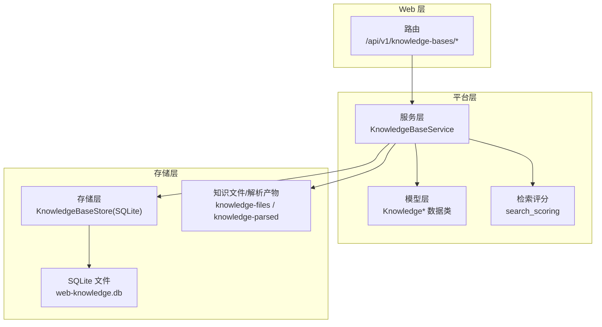
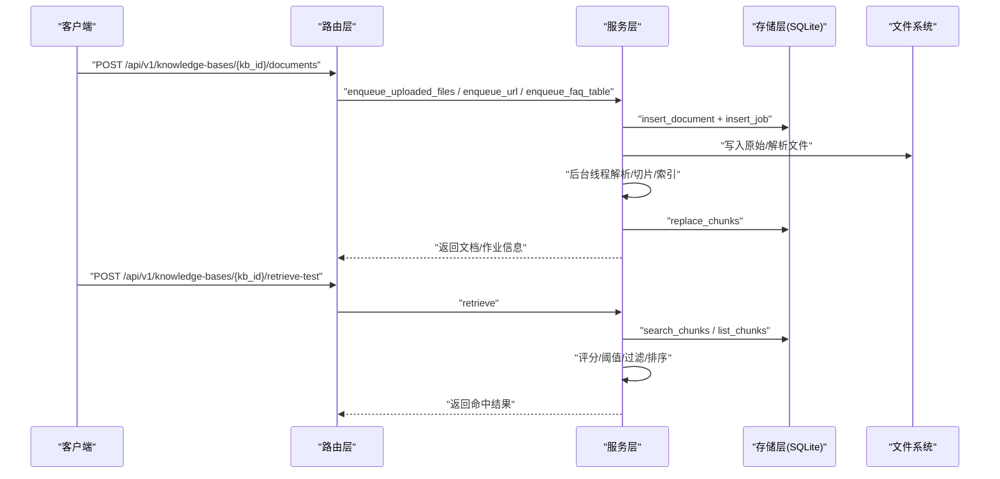
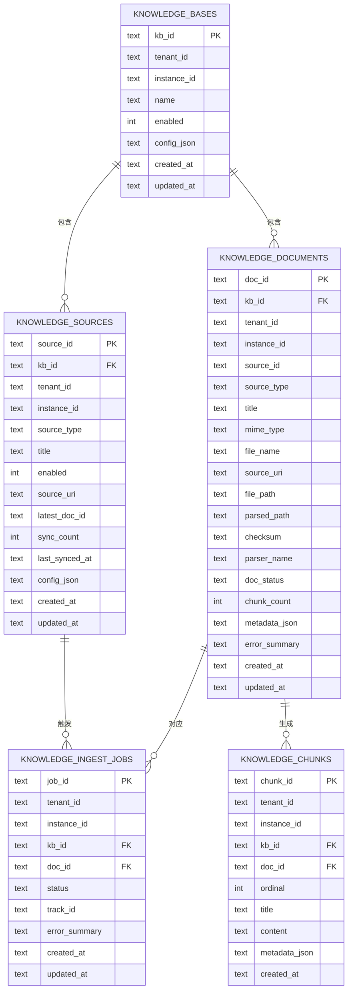
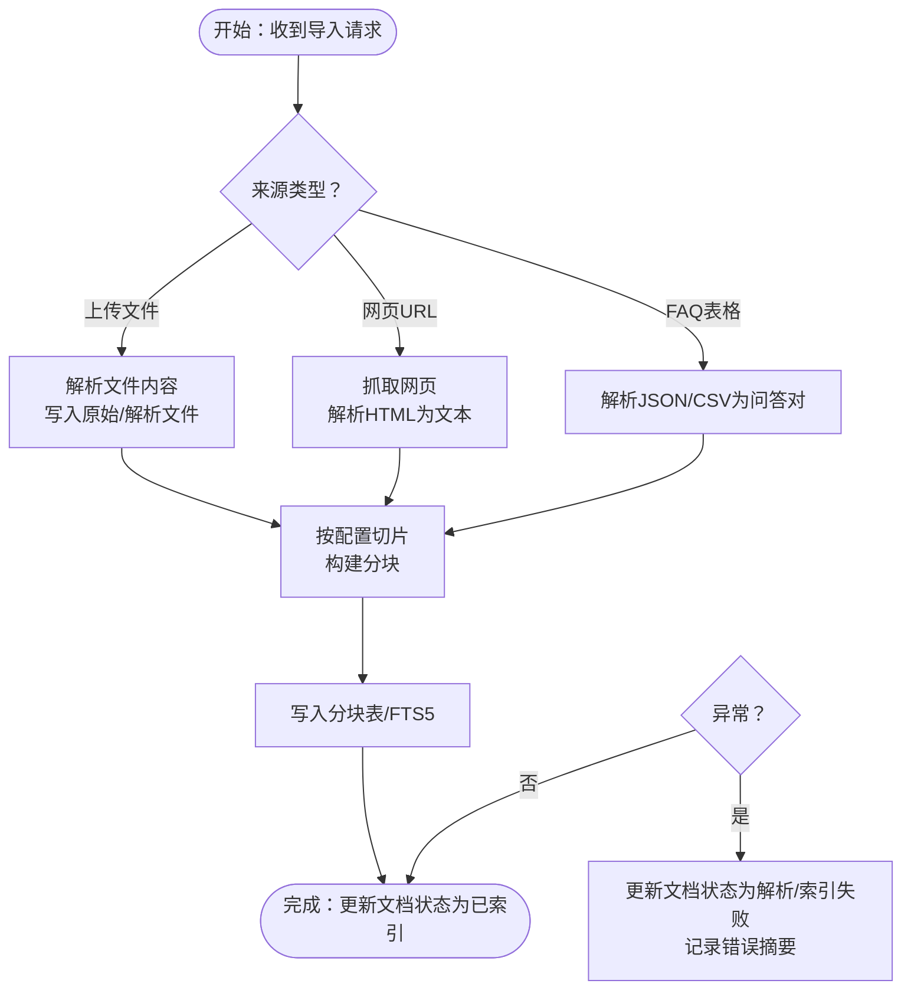
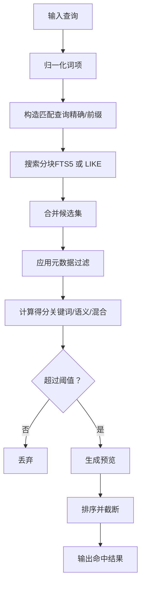
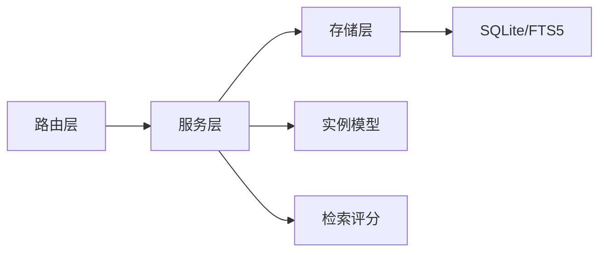

# 知识库管理

<cite>
**本文引用的文件**
- [models.py](file://nanobot/platform/knowledge/models.py)
- [service.py](file://nanobot/platform/knowledge/service.py)
- [store.py](file://nanobot/platform/knowledge/store.py)
- [knowledge.py](file://nanobot/web/routers/knowledge.py)
- [search_scoring.py](file://nanobot/platform/search_scoring.py)
- [__init__.py](file://nanobot/platform/knowledge/__init__.py)
- [models.py（实例）](file://nanobot/platform/instances/models.py)
- [context.py](file://nanobot/agent/context.py)
- [test_knowledge_bases.py](file://tests/test_knowledge_bases.py)
</cite>

## 目录
1. [简介](#简介)
2. [项目结构](#项目结构)
3. [核心组件](#核心组件)
4. [架构总览](#架构总览)
5. [详细组件分析](#详细组件分析)
6. [依赖分析](#依赖分析)
7. [性能考虑](#性能考虑)
8. [故障排查指南](#故障排查指南)
9. [结论](#结论)
10. [附录](#附录)

## 简介
本文件面向 Nanobot 的“知识库管理”子系统，系统性阐述其数据模型、存储结构、服务实现与检索机制；覆盖知识条目的创建、分类、索引与检索流程；记录导入导出、版本与更新策略；给出 API 接口定义、搜索算法与排序规则；并说明权限控制、访问统计与质量评估能力；最后解释知识库与代理的集成方式、上下文注入与智能检索机制。

## 项目结构
知识库管理模块位于平台层，采用“模型-服务-存储-路由”的分层设计：
- 模型层：定义知识库、文档、作业、来源等实体与检索配置
- 服务层：封装业务逻辑（创建/更新/删除、解析/切片/索引、检索）
- 存储层：基于 SQLite 的持久化，内置 FTS5 支持
- 路由层：对外暴露 REST API
- 检索评分：提供关键词/语义/混合评分与阈值
- 实例模型：提供知识库数据库与文件目录路径
- 测试：覆盖 CRUD、导入、检索、源同步与迁移

图示来源
- [knowledge.py:1-240](file://nanobot/web/routers/knowledge.py#L1-L240)
- [service.py:71-1814](file://nanobot/platform/knowledge/service.py#L71-L1814)
- [store.py:18-729](file://nanobot/platform/knowledge/store.py#L18-L729)
- [models.py:1-298](file://nanobot/platform/knowledge/models.py#L1-L298)
- [search_scoring.py:1-143](file://nanobot/platform/search_scoring.py#L1-L143)
- [models.py（实例）:79-95](file://nanobot/platform/instances/models.py#L79-L95)

章节来源
- [knowledge.py:1-240](file://nanobot/web/routers/knowledge.py#L1-L240)
- [service.py:71-1814](file://nanobot/platform/knowledge/service.py#L71-L1814)
- [store.py:18-729](file://nanobot/platform/knowledge/store.py#L18-L729)
- [models.py:1-298](file://nanobot/platform/knowledge/models.py#L1-L298)
- [search_scoring.py:1-143](file://nanobot/platform/search_scoring.py#L1-L143)
- [models.py（实例）:79-95](file://nanobot/platform/instances/models.py#L79-L95)

## 核心组件
- 知识库定义：包含标识、租户/实例绑定、启用状态、标签、检索配置等
- 文档实体：记录来源类型、标题、元数据、状态、分块数量、错误摘要等
- 来源实体：记录来源类型（上传/网页/FAQ）、同步计数、最新文档、配置等
- 作业实体：记录导入任务状态、跟踪号、错误摘要
- 检索配置：模式（关键词/语义/混合）、返回数量、分块大小与重叠、元数据过滤、重排开关等
- 服务层：负责校验、解析、切片、索引、检索、源同步、批量重索引
- 存储层：SQLite 表与 FTS5 虚表，支持查询、替换分块、列出分块
- 路由层：提供 CRUD、导入、检索测试、重建索引、源同步等接口

章节来源
- [models.py:16-298](file://nanobot/platform/knowledge/models.py#L16-L298)
- [service.py:71-1814](file://nanobot/platform/knowledge/service.py#L71-L1814)
- [store.py:18-729](file://nanobot/platform/knowledge/store.py#L18-L729)
- [knowledge.py:1-240](file://nanobot/web/routers/knowledge.py#L1-L240)

## 架构总览
下图展示从 Web 请求到服务层再到存储层的关键调用链，以及检索时的评分与过滤流程。

图示来源
- [knowledge.py:150-211](file://nanobot/web/routers/knowledge.py#L150-L211)
- [service.py:1164-1814](file://nanobot/platform/knowledge/service.py#L1164-L1814)
- [store.py:560-729](file://nanobot/platform/knowledge/store.py#L560-L729)

## 详细组件分析

### 数据模型与存储结构
- 实体关系
  - 知识库（KB）与文档一对多
  - 文档与来源一对一（或空），来源可回填
  - 文档与作业一对多
  - 分块表与文档/知识库/租户/实例关联
  - FTS5 虚表用于全文检索加速

图示来源
- [store.py:21-131](file://nanobot/platform/knowledge/store.py#L21-L131)
- [models.py:80-298](file://nanobot/platform/knowledge/models.py#L80-L298)

章节来源
- [store.py:18-729](file://nanobot/platform/knowledge/store.py#L18-L729)
- [models.py:16-298](file://nanobot/platform/knowledge/models.py#L16-L298)

### 服务层：创建/更新/删除、解析/切片/索引、检索
- 创建/更新/删除知识库：名称唯一性校验、启用状态、标签、检索配置
- 文档管理：列表、删除、批量删除
- 来源管理：自动回填、更新标题/URI/配置、同步
- 导入策略
  - 上传文件：解析内容、写入原始与解析文件、切片、索引
  - 网页 URL：下载/解析 HTML、写入解析文件、切片、索引
  - FAQ 表：JSON/CSV 解析为问答对，写入解析文件、切片、索引
- 重索引：按文档 ID 列表重新排队处理
- 检索：关键词/语义/混合模式，FTS5 加权融合，阈值过滤，预览截取，排序

图示来源
- [service.py:824-1096](file://nanobot/platform/knowledge/service.py#L824-L1096)
- [service.py:1164-1249](file://nanobot/platform/knowledge/service.py#L1164-L1249)
- [store.py:560-613](file://nanobot/platform/knowledge/store.py#L560-L613)

章节来源
- [service.py:71-1814](file://nanobot/platform/knowledge/service.py#L71-L1814)
- [store.py:560-729](file://nanobot/platform/knowledge/store.py#L560-L729)

### 检索算法与排序规则
- 查询归一化：提取词项、去重
- 匹配策略
  - 关键词：精确词匹配
  - 语义：词形变体、前缀匹配、字符 N-gram、短语命中加分
  - 混合：加权融合
- FTS5 加权：若可用则使用 BM25 排序，否则回退 LIKE 查询
- 过滤：按文档 ID、来源类型、语言、标签等元数据过滤
- 预览：截取首次命中附近片段
- 排序：先按得分降序，再按标题排序

图示来源
- [service.py:1722-1814](file://nanobot/platform/knowledge/service.py#L1722-L1814)
- [search_scoring.py:17-143](file://nanobot/platform/search_scoring.py#L17-L143)
- [store.py:615-729](file://nanobot/platform/knowledge/store.py#L615-L729)

章节来源
- [service.py:1655-1814](file://nanobot/platform/knowledge/service.py#L1655-L1814)
- [search_scoring.py:1-143](file://nanobot/platform/search_scoring.py#L1-L143)
- [store.py:615-729](file://nanobot/platform/knowledge/store.py#L615-L729)

### API 接口定义
- 列出/创建/获取/更新/删除知识库
- 列出/删除文档；批量删除文档
- 列出作业
- 列出/更新来源；同步来源
- 导入：上传文件、网页 URL、FAQ 表格
- 检索测试：指定模式、限制、过滤
- 重建索引：可选指定文档 ID 列表

章节来源
- [knowledge.py:22-240](file://nanobot/web/routers/knowledge.py#L22-L240)

### 权限控制、访问统计与质量评估
- 权限控制
  - 知识库/文档/来源均按租户与实例边界进行存在性与归属校验，防止越权访问
- 访问统计
  - 来源记录 sync_count 与 last_synced_at，便于追踪同步历史
- 质量评估
  - 文档状态机：上传/解析中/解析成功/索引中/已索引/解析失败/索引失败
  - 错误摘要字段记录失败原因，便于诊断
  - 检索阈值与预览辅助判断命中质量

章节来源
- [service.py:379-421](file://nanobot/platform/knowledge/service.py#L379-L421)
- [models.py:131-200](file://nanobot/platform/knowledge/models.py#L131-L200)
- [store.py:511-545](file://nanobot/platform/knowledge/store.py#L511-L545)

### 与代理的集成、上下文注入与智能检索
- 上下文构建：代理在生成提示词时可加载工作区记忆、技能与引导文件
- 知识库检索：代理可通过检索接口获取上下文片段，结合预览与引用信息进行回答
- 智能检索：服务层根据检索配置选择模式、限制返回数量、应用元数据过滤，确保相关性与性能平衡

章节来源
- [context.py:16-227](file://nanobot/agent/context.py#L16-L227)
- [service.py:1722-1814](file://nanobot/platform/knowledge/service.py#L1722-L1814)

## 依赖分析
- 组件耦合
  - 服务层依赖存储层与实例模型，不直接依赖 Web 层
  - 路由层仅作为入口，调用服务层
  - 检索评分独立于外部向量库，降低依赖复杂度
- 外部依赖
  - 解析：chardet、httpx、lxml、openpyxl、readability、pypdf、python-docx
  - 存储：SQLite（含 FTS5）
- 循环依赖
  - 未见循环依赖

图示来源
- [knowledge.py:1-240](file://nanobot/web/routers/knowledge.py#L1-L240)
- [service.py:24-44](file://nanobot/platform/knowledge/service.py#L24-L44)
- [store.py:133-160](file://nanobot/platform/knowledge/store.py#L133-L160)
- [models.py（实例）:79-95](file://nanobot/platform/instances/models.py#L79-L95)
- [search_scoring.py:1-143](file://nanobot/platform/search_scoring.py#L1-L143)

章节来源
- [service.py:24-44](file://nanobot/platform/knowledge/service.py#L24-L44)
- [store.py:133-160](file://nanobot/platform/knowledge/store.py#L133-L160)
- [models.py（实例）:79-95](file://nanobot/platform/instances/models.py#L79-L95)

## 性能考虑
- 并发与后台作业：通过线程池执行解析/索引，避免阻塞主线程
- FTS5：优先使用 BM25 排序，显著提升检索性能
- 分块策略：可配置 chunk_size 与 chunk_overlap，在召回与上下文连贯性间折中
- 查询池：先用关键词/前缀查询收集候选，再做语义扩展，减少全表扫描
- 过滤与阈值：尽早过滤低质量命中，减少后续处理

## 故障排查指南
- 常见错误
  - 知识库不存在/越权：抛出相应错误并返回 404
  - 名称冲突：创建/更新时检查唯一性
  - 参数非法：校验必填字段与类型
  - 不支持的文件类型/URL 内容类型：抛出验证错误
  - 依赖缺失：如 PDF/DOCX 解析需安装可选依赖
- 定位方法
  - 查看文档状态与错误摘要
  - 检查作业状态与跟踪号
  - 确认来源是否启用、最新文档是否存在
  - 核对检索模式与阈值设置
- 单元测试参考
  - 覆盖 CRUD、导入、检索、源同步与数据库迁移

章节来源
- [service.py:46-61](file://nanobot/platform/knowledge/service.py#L46-L61)
- [knowledge.py:37-186](file://nanobot/web/routers/knowledge.py#L37-L186)
- [test_knowledge_bases.py:19-283](file://tests/test_knowledge_bases.py#L19-L283)

## 结论
Nanobot 的知识库管理模块以清晰的分层设计实现了从导入、解析、切片、索引到检索的全链路能力。通过 SQLite+FTS5 的组合与本地化的检索评分，既保证了易部署与低依赖，又提供了可配置的检索模式与过滤能力。配合代理的上下文构建与智能检索，能够有效支撑企业级知识问答与自动化场景。

## 附录

### API 参考（节选）
- GET /api/v1/knowledge-bases
- POST /api/v1/knowledge-bases
- GET /api/v1/knowledge-bases/{kb_id}
- PUT /api/v1/knowledge-bases/{kb_id}
- DELETE /api/v1/knowledge-bases/{kb_id}
- GET /api/v1/knowledge-bases/{kb_id}/documents
- GET /api/v1/knowledge-bases/{kb_id}/jobs
- GET /api/v1/knowledge-bases/{kb_id}/sources
- PUT /api/v1/knowledge-bases/{kb_id}/sources/{source_id}
- DELETE /api/v1/knowledge-bases/{kb_id}/documents/{doc_id}
- POST /api/v1/knowledge-bases/{kb_id}/documents/delete
- POST /api/v1/knowledge-bases/{kb_id}/documents
- POST /api/v1/knowledge-bases/{kb_id}/retrieve-test
- POST /api/v1/knowledge-bases/{kb_id}/reindex
- POST /api/v1/knowledge-bases/{kb_id}/sources/{source_id}/sync

章节来源
- [knowledge.py:22-240](file://nanobot/web/routers/knowledge.py#L22-L240)