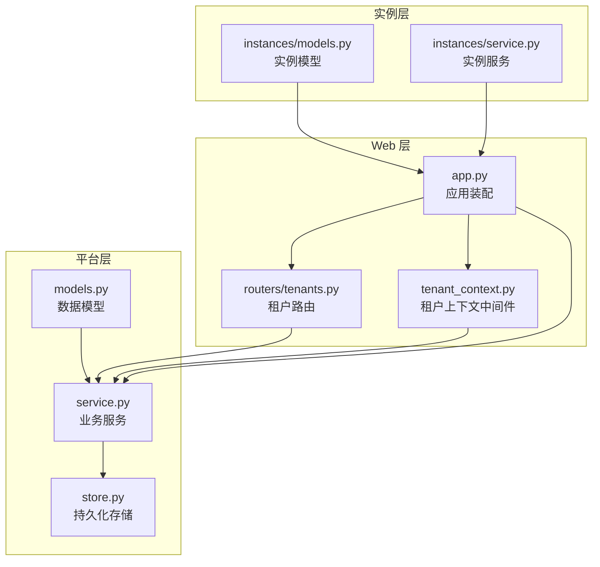
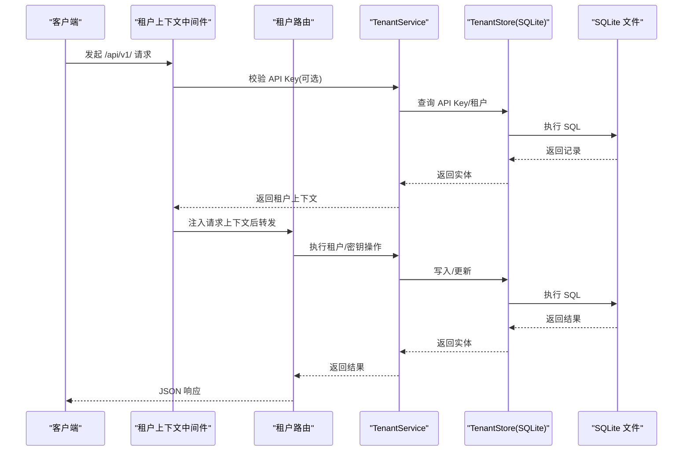
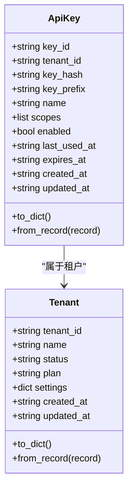
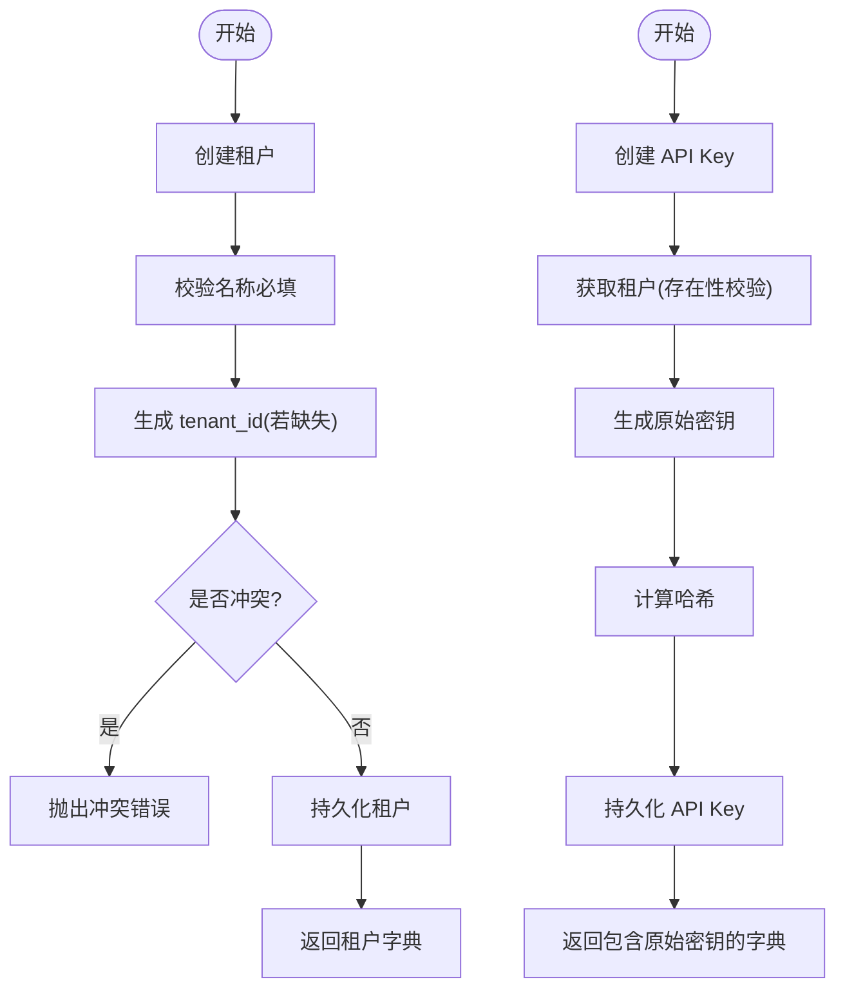
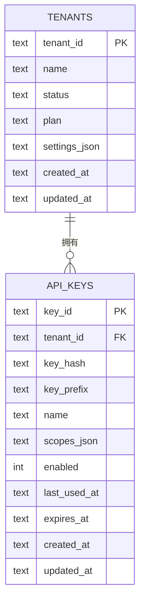
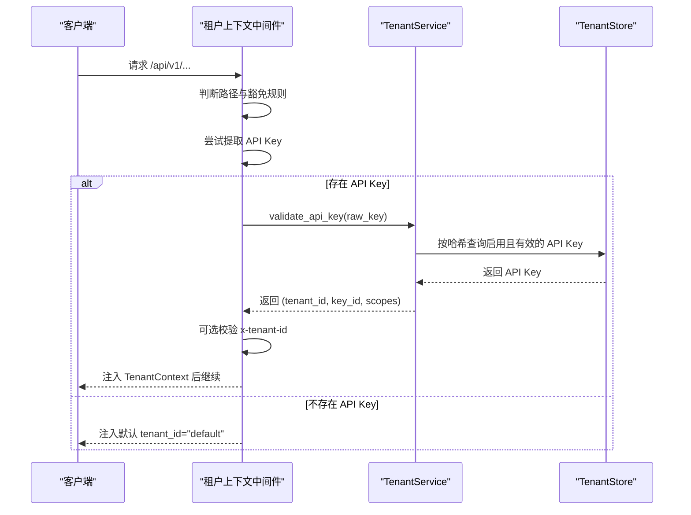
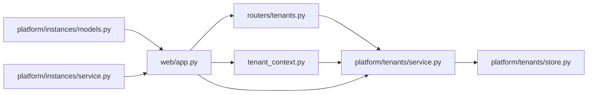

# 租户管理

<cite>
**本文引用的文件**
- [nanobot/platform/tenants/__init__.py](file://nanobot/platform/tenants/__init__.py)
- [nanobot/platform/tenants/models.py](file://nanobot/platform/tenants/models.py)
- [nanobot/platform/tenants/service.py](file://nanobot/platform/tenants/service.py)
- [nanobot/platform/tenants/store.py](file://nanobot/platform/tenants/store.py)
- [nanobot/web/routers/tenants.py](file://nanobot/web/routers/tenants.py)
- [nanobot/web/tenant_context.py](file://nanobot/web/tenant_context.py)
- [nanobot/web/app.py](file://nanobot/web/app.py)
- [nanobot/platform/instances/models.py](file://nanobot/platform/instances/models.py)
- [nanobot/platform/instances/service.py](file://nanobot/platform/instances/service.py)
- [tests/test_multi_tenancy.py](file://tests/test_multi_tenancy.py)
</cite>

## 目录
1. [简介](#简介)
2. [项目结构](#项目结构)
3. [核心组件](#核心组件)
4. [架构总览](#架构总览)
5. [详细组件分析](#详细组件分析)
6. [依赖分析](#依赖分析)
7. [性能考虑](#性能考虑)
8. [故障排查指南](#故障排查指南)
9. [结论](#结论)
10. [附录](#附录)

## 简介
本文件面向 Nanobot 的租户管理模块，系统化阐述多租户概念、数据模型与隔离机制，覆盖租户生命周期（创建、配置、升级、注销）、API 密钥体系、认证与授权、资源与计费边界、监控指标建议、安全与合规要点，以及在多实例架构下的统一管理、资源调度与成本控制实践。文档同时提供 API 接口定义、关键配置参数与错误处理策略，帮助开发者与运维人员快速理解并正确使用租户管理能力。

## 项目结构
租户管理相关代码主要分布在以下位置：
- 平台层：租户与 API Key 的数据模型、服务层与存储层
- Web 层：租户管理路由、租户上下文中间件与应用装配
- 实例层：平台实例模型与服务，用于确定租户数据库路径等
- 测试层：多租户隔离行为的端到端验证

图表来源
- [nanobot/platform/tenants/models.py:15-100](file://nanobot/platform/tenants/models.py#L15-L100)
- [nanobot/platform/tenants/service.py:43-191](file://nanobot/platform/tenants/service.py#L43-L191)
- [nanobot/platform/tenants/store.py:12-222](file://nanobot/platform/tenants/store.py#L12-L222)
- [nanobot/web/routers/tenants.py:1-119](file://nanobot/web/routers/tenants.py#L1-L119)
- [nanobot/web/tenant_context.py:11-108](file://nanobot/web/tenant_context.py#L11-L108)
- [nanobot/web/app.py:70-281](file://nanobot/web/app.py#L70-L281)
- [nanobot/platform/instances/models.py:14-111](file://nanobot/platform/instances/models.py#L14-L111)
- [nanobot/platform/instances/service.py:17-43](file://nanobot/platform/instances/service.py#L17-L43)

章节来源
- [nanobot/platform/tenants/__init__.py:1-23](file://nanobot/platform/tenants/__init__.py#L1-L23)
- [nanobot/platform/tenants/models.py:15-100](file://nanobot/platform/tenants/models.py#L15-L100)
- [nanobot/platform/tenants/service.py:43-191](file://nanobot/platform/tenants/service.py#L43-L191)
- [nanobot/platform/tenants/store.py:12-222](file://nanobot/platform/tenants/store.py#L12-L222)
- [nanobot/web/routers/tenants.py:1-119](file://nanobot/web/routers/tenants.py#L1-L119)
- [nanobot/web/tenant_context.py:11-108](file://nanobot/web/tenant_context.py#L11-L108)
- [nanobot/web/app.py:70-281](file://nanobot/web/app.py#L70-L281)
- [nanobot/platform/instances/models.py:14-111](file://nanobot/platform/instances/models.py#L14-L111)
- [nanobot/platform/instances/service.py:17-43](file://nanobot/platform/instances/service.py#L17-L43)

## 核心组件
- 数据模型
  - 租户模型：包含租户标识、名称、状态、套餐、设置、时间戳等字段，并提供字典序列化与记录反序列化方法。
  - API Key 模型：包含密钥标识、租户标识、哈希值、前缀、名称、作用域、启用状态、过期时间、最后使用时间与时间戳等，并提供字典序列化与记录反序列化方法。
- 服务层
  - 租户 CRUD：创建、查询、列表、更新、删除租户；自动 slug 化租户 ID，冲突检测，校验错误。
  - API Key 管理：创建 API Key（含随机原始密钥生成、哈希计算、唯一 key_id 生成、前缀提取），校验 API Key（支持过期校验与启用状态校验），列出与吊销。
- 存储层
  - 基于 SQLite 的表结构：租户表与 API Key 表，包含索引优化；提供增删改查与批量查询。
- Web 路由
  - 提供 /api/v1/tenants 与 /api/v1/tenants/{tenant_id}/api-keys 等 REST 接口，返回标准 JSON 响应。
- 租户上下文中间件
  - 支持 API Key 认证（Authorization Bearer 或 X-API-Key），可选校验 x-tenant-id 头部一致性，注入请求上下文；对非 /api/v1/ 路径或健康检查与认证路径进行豁免。
- 应用装配
  - 在应用生命周期内初始化 TenantService 与 TenantStore，并注入到请求上下文中供路由与中间件使用。
- 实例层
  - 提供实例模型与服务，用于解析实例边界与生成各实例的数据目录与数据库路径（包括租户数据库路径）。

章节来源
- [nanobot/platform/tenants/models.py:15-100](file://nanobot/platform/tenants/models.py#L15-L100)
- [nanobot/platform/tenants/service.py:43-191](file://nanobot/platform/tenants/service.py#L43-L191)
- [nanobot/platform/tenants/store.py:12-222](file://nanobot/platform/tenants/store.py#L12-L222)
- [nanobot/web/routers/tenants.py:1-119](file://nanobot/web/routers/tenants.py#L1-L119)
- [nanobot/web/tenant_context.py:11-108](file://nanobot/web/tenant_context.py#L11-L108)
- [nanobot/web/app.py:70-281](file://nanobot/web/app.py#L70-L281)
- [nanobot/platform/instances/models.py:14-111](file://nanobot/platform/instances/models.py#L14-L111)
- [nanobot/platform/instances/service.py:17-43](file://nanobot/platform/instances/service.py#L17-L43)

## 架构总览
租户管理采用“模型-服务-存储-路由-中间件-应用”的分层设计，结合实例边界实现多实例统一管理。认证通过中间件在进入业务路由前完成，随后业务服务基于租户上下文执行隔离操作。

图表来源
- [nanobot/web/tenant_context.py:26-92](file://nanobot/web/tenant_context.py#L26-L92)
- [nanobot/web/routers/tenants.py:24-119](file://nanobot/web/routers/tenants.py#L24-L119)
- [nanobot/platform/tenants/service.py:43-191](file://nanobot/platform/tenants/service.py#L43-L191)
- [nanobot/platform/tenants/store.py:12-222](file://nanobot/platform/tenants/store.py#L12-L222)

## 详细组件分析

### 数据模型与隔离机制
- 租户模型
  - 字段：tenant_id、name、status、plan、settings、created_at、updated_at
  - 序列化/反序列化：to_dict/from_record，支持 settings_json 的 JSON 解析与默认值处理
- API Key 模型
  - 字段：key_id、tenant_id、key_hash、key_prefix、name、scopes、enabled、last_used_at、expires_at、created_at、updated_at
  - 序列化/反序列化：to_dict/from_record，支持 scopes_json 的 JSON 解析与默认值处理
- 隔离机制
  - API Key 与租户建立外键式关联（存储层通过 tenant_id 字段维护）
  - 中间件在认证成功后将 tenant_id 注入请求上下文，后续业务逻辑可据此进行访问控制与资源定位

图表来源
- [nanobot/platform/tenants/models.py:15-100](file://nanobot/platform/tenants/models.py#L15-L100)

章节来源
- [nanobot/platform/tenants/models.py:15-100](file://nanobot/platform/tenants/models.py#L15-L100)

### 服务层：租户与 API Key 生命周期
- 租户 CRUD
  - 创建：校验名称必填，自动生成 tenant_id（若未提供），冲突检测，写入当前时间戳，返回字典
  - 查询/列表：按需抛出租户不存在异常
  - 更新：部分字段可更新，自动刷新 updated_at
  - 删除：级联删除该租户下的 API Key 后再删除租户
- API Key 管理
  - 创建：生成原始密钥、哈希值、key_id 与 key_prefix，写入 scopes、启用状态与时间戳
  - 校验：校验前缀、启用状态与过期时间，更新 last_used_at
  - 列出：按租户维度查询
  - 吊销：按 key_id 删除

图表来源
- [nanobot/platform/tenants/service.py:60-85](file://nanobot/platform/tenants/service.py#L60-L85)
- [nanobot/platform/tenants/service.py:121-158](file://nanobot/platform/tenants/service.py#L121-L158)

章节来源
- [nanobot/platform/tenants/service.py:43-191](file://nanobot/platform/tenants/service.py#L43-L191)

### 存储层：SQLite 持久化与索引
- 表结构
  - tenants：主键 tenant_id，包含状态、套餐、settings_json、时间戳
  - api_keys：主键 key_id，外键 tenant_id，包含 key_hash、key_prefix、scopes_json、enabled、last_used_at、expires_at、时间戳
  - 索引：key_hash 唯一索引、tenant_id 索引
- 操作
  - 租户：查询、列表、创建、更新、删除
  - API Key：查询、按哈希查询（启用且有效）、按租户列出、创建、更新最后使用时间、删除

图表来源
- [nanobot/platform/tenants/store.py:15-42](file://nanobot/platform/tenants/store.py#L15-L42)
- [nanobot/platform/tenants/store.py:62-138](file://nanobot/platform/tenants/store.py#L62-L138)
- [nanobot/platform/tenants/store.py:142-221](file://nanobot/platform/tenants/store.py#L142-L221)

章节来源
- [nanobot/platform/tenants/store.py:12-222](file://nanobot/platform/tenants/store.py#L12-L222)

### Web 路由与 API 定义
- 租户管理
  - GET /api/v1/tenants：列出所有租户
  - POST /api/v1/tenants：创建租户（payload：name、tenantId/tenant_id 可选、status、plan、settings）
  - GET /api/v1/tenants/{tenant_id}：获取租户详情
  - PUT /api/v1/tenants/{tenant_id}：更新租户（支持 name、status、plan、settings）
  - DELETE /api/v1/tenants/{tenant_id}：删除租户
- API Key 管理
  - GET /api/v1/tenants/{tenant_id}/api-keys：列出租户 API Key
  - POST /api/v1/tenants/{tenant_id}/api-keys：创建 API Key（payload：name、scopes 可选、expiresAt/expires_at 可选）
  - DELETE /api/v1/api-keys/{key_id}：吊销 API Key
- 错误码
  - 租户冲突：409 TENANT_CONFLICT
  - 租户校验失败：400 TENANT_VALIDATION_ERROR
  - 租户不存在：404 TENANT_NOT_FOUND
  - API Key 校验失败：401（直接 JSON 响应）
  - API Key 不存在：404 API_KEY_NOT_FOUND

章节来源
- [nanobot/web/routers/tenants.py:24-119](file://nanobot/web/routers/tenants.py#L24-L119)

### 租户上下文与认证流程
- 中间件行为
  - 仅对 /api/v1/ 路径生效，健康检查与认证路径豁免
  - 优先尝试从 Authorization Bearer 或 X-API-Key 提取 API Key
  - 若存在，调用服务层校验 API Key，支持启用状态与过期时间检查，并可选校验 x-tenant-id 与密钥所属租户一致
  - 成功则注入 TenantContext（tenant_id、key_id、scopes），否则返回 401
  - 未携带 API Key 时，默认 tenant_id="default"
- Web 认证联动
  - 在 enforce_web_auth 中，若已通过租户上下文认证，则跳过 Cookie 认证

图表来源
- [nanobot/web/tenant_context.py:26-92](file://nanobot/web/tenant_context.py#L26-L92)
- [nanobot/platform/tenants/service.py:160-179](file://nanobot/platform/tenants/service.py#L160-L179)
- [nanobot/platform/tenants/store.py:153-162](file://nanobot/platform/tenants/store.py#L153-L162)

章节来源
- [nanobot/web/tenant_context.py:11-108](file://nanobot/web/tenant_context.py#L11-L108)
- [nanobot/web/app.py:225-246](file://nanobot/web/app.py#L225-L246)

### 多实例架构与统一管理
- 实例边界
  - 实例模型提供数据目录与数据库路径解析，租户数据库路径由实例模型提供
- 统一管理
  - 应用启动时为每个实例创建独立的 TenantService/TenantStore，确保不同实例间租户数据隔离
  - 通过实例服务获取默认实例，slug 化实例 ID，便于多实例部署场景下的命名与识别

章节来源
- [nanobot/platform/instances/models.py:14-111](file://nanobot/platform/instances/models.py#L14-L111)
- [nanobot/platform/instances/service.py:17-43](file://nanobot/platform/instances/service.py#L17-L43)
- [nanobot/web/app.py:108-108](file://nanobot/web/app.py#L108-L108)

### 多租户隔离测试验证
- 测试覆盖
  - 租户隔离：同一存储中不同 tenant_id 的对象互不可见或不可修改
  - 更新/删除权限：错误租户 ID 不应影响其他租户数据
  - 服务层透传：服务层正确将 tenant_id 传递给存储层
- 结论
  - 通过测试确认租户隔离在平台层得到保障，API 层与存储层协同实现强隔离

章节来源
- [tests/test_multi_tenancy.py:29-100](file://tests/test_multi_tenancy.py#L29-L100)
- [tests/test_multi_tenancy.py:105-164](file://tests/test_multi_tenancy.py#L105-L164)
- [tests/test_multi_tenancy.py:170-247](file://tests/test_multi_tenancy.py#L170-L247)
- [tests/test_multi_tenancy.py:252-312](file://tests/test_multi_tenancy.py#L252-L312)

## 依赖分析
- 组件耦合
  - 路由依赖服务层；服务层依赖存储层；中间件依赖服务层；应用装配负责初始化与注入
  - 实例层为应用装配提供实例边界信息，间接影响租户数据库路径
- 外部依赖
  - SQLite 作为本地持久化存储
  - FastAPI 作为 Web 框架，中间件与路由配合实现认证与业务处理

图表来源
- [nanobot/web/routers/tenants.py:1-119](file://nanobot/web/routers/tenants.py#L1-L119)
- [nanobot/platform/tenants/service.py:43-191](file://nanobot/platform/tenants/service.py#L43-L191)
- [nanobot/platform/tenants/store.py:12-222](file://nanobot/platform/tenants/store.py#L12-L222)
- [nanobot/web/tenant_context.py:11-108](file://nanobot/web/tenant_context.py#L11-L108)
- [nanobot/web/app.py:70-281](file://nanobot/web/app.py#L70-L281)
- [nanobot/platform/instances/models.py:14-111](file://nanobot/platform/instances/models.py#L14-L111)
- [nanobot/platform/instances/service.py:17-43](file://nanobot/platform/instances/service.py#L17-L43)

章节来源
- [nanobot/web/app.py:70-281](file://nanobot/web/app.py#L70-L281)

## 性能考虑
- 存储层
  - 使用索引加速 API Key 查询与去重（key_hash 唯一索引、tenant_id 索引）
  - JSON 字段采用字符串存储并在读取时解析，避免复杂嵌套结构带来的序列化开销
- 认证路径
  - API Key 校验仅在 /api/v1/ 路径生效，减少非 API 请求的额外开销
  - 校验过程包含启用状态与过期时间检查，建议在高并发场景下缓存短期有效的校验结果（需评估安全风险）
- 路由与中间件
  - 中间件短路处理健康检查与认证路径，降低无效请求的处理成本

## 故障排查指南
- 常见错误与处理
  - 租户冲突：当 tenant_id 已存在时抛出冲突错误；请检查是否重复创建或使用已有 ID
  - 租户校验失败：当缺少必要字段（如 name）时抛出校验错误；请补齐必填字段
  - 租户不存在：当查询/更新/删除的目标租户不存在时抛出错误；请确认 tenant_id 正确
  - API Key 校验失败：当 API Key 不存在、未启用或已过期时返回 401；请检查密钥状态与有效期
  - API Key 不存在：吊销不存在的 key_id 时抛出错误；请确认 key_id 正确
- 日志与可观测性
  - 建议在服务层与存储层增加关键操作的日志埋点（创建、更新、删除、校验）
  - 对认证失败与权限拒绝事件进行审计日志记录

章节来源
- [nanobot/platform/tenants/service.py:15-29](file://nanobot/platform/tenants/service.py#L15-L29)
- [nanobot/platform/tenants/service.py:160-179](file://nanobot/platform/tenants/service.py#L160-L179)
- [nanobot/web/routers/tenants.py:37-40](file://nanobot/web/routers/tenants.py#L37-L40)
- [nanobot/web/routers/tenants.py:105-108](file://nanobot/web/routers/tenants.py#L105-L108)
- [nanobot/web/tenant_context.py:66-70](file://nanobot/web/tenant_context.py#L66-L70)

## 结论
Nanobot 的租户管理模块以清晰的分层设计实现了多租户隔离：数据模型定义明确、服务层提供完整的租户与 API Key 生命周期管理、存储层采用 SQLite 并具备必要的索引优化、Web 层通过中间件实现灵活的认证与授权、实例层支撑多实例统一管理。结合测试验证与错误处理策略，该模块能够满足多租户 SaaS 场景下的隔离、安全与可运维需求。建议在生产环境中进一步完善监控指标、审计日志与缓存策略，以提升整体性能与安全性。

## 附录

### API 接口清单（摘要）
- 租户管理
  - GET /api/v1/tenants：返回租户列表
  - POST /api/v1/tenants：创建租户（payload 字段：name、tenantId/tenant_id、status、plan、settings）
  - GET /api/v1/tenants/{tenant_id}：返回租户详情
  - PUT /api/v1/tenants/{tenant_id}：更新租户（支持 name、status、plan、settings）
  - DELETE /api/v1/tenants/{tenant_id}：删除租户
- API Key 管理
  - GET /api/v1/tenants/{tenant_id}/api-keys：返回租户 API Key 列表
  - POST /api/v1/tenants/{tenant_id}/api-keys：创建 API Key（payload 字段：name、scopes、expiresAt/expires_at）
  - DELETE /api/v1/api-keys/{key_id}：吊销 API Key

章节来源
- [nanobot/web/routers/tenants.py:24-119](file://nanobot/web/routers/tenants.py#L24-L119)

### 配置参数与环境变量
- 实例与数据库路径
  - 租户数据库路径：由实例模型提供（实例数据目录下的 web-tenants.db）
- 环境变量
  - 通过配置模式支持环境变量前缀（示例：NANOBOT_），用于覆盖默认配置项（具体键名取决于配置结构）

章节来源
- [nanobot/platform/instances/models.py:100-101](file://nanobot/platform/instances/models.py#L100-L101)
- [nanobot/config/schema.py:449-449](file://nanobot/config/schema.py#L449-L449)

### 监控指标建议
- 认证与授权
  - API Key 校验成功率、失败率（过期/禁用/不存在）
  - 认证路径命中率（/api/v1/ 与非 API 路径）
- 租户与密钥
  - 租户创建/更新/删除次数
  - API Key 创建/吊销次数
  - API Key 最后使用时间分布
- 存储层
  - SQLite 查询/写入耗时分布、连接池使用情况

[本节为通用建议，不直接分析具体文件]